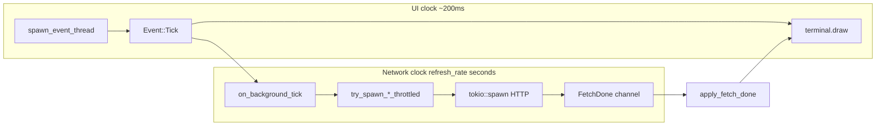
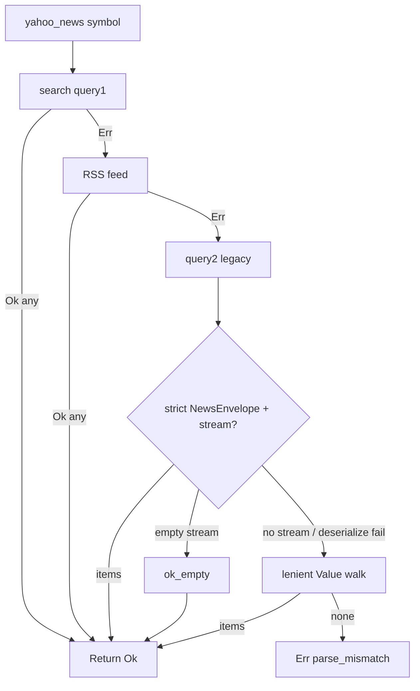

# SPEC — StockTerm (Issue #3 baseline + follow-ons)

**Issue #3** — Multi-symbol watchlist & multi-row quote table (§§1–7). **[#81](https://github.com/FelipeMorandini/stockterm/issues/81) / [#82](https://github.com/FelipeMorandini/stockterm/issues/82) / [#83](https://github.com/FelipeMorandini/stockterm/issues/83)** — Stock View narrow-terminal status hints, plain-**Tab** portfolio dialog focus, **`add_to_portfolio`** false-path contract (**§37**; manual QA [`docs/QA_PLAN.md`](QA_PLAN.md) Issues **#81–#83** — sign-off **2026-05-18**; **PR:** [#151](https://github.com/FelipeMorandini/stockterm/pull/151)). **[#54](https://github.com/FelipeMorandini/stockterm/issues/54)** — Yahoo news: resilient **`query2`** parsing + **`STOCKTERM_DEBUG_YAHOO_NEWS`** (**§36**; manual QA [`docs/QA_PLAN.md`](QA_PLAN.md) Issue **#54** — sign-off **2026-05-18**; **PR:** [#150](https://github.com/FelipeMorandini/stockterm/pull/150)). **[#4](https://github.com/FelipeMorandini/stockterm/issues/4)** — configurable **`refresh_rate`** vs UI tick (**§35**; manual QA [`docs/QA_PLAN.md`](QA_PLAN.md) Issue **#4** — sign-off **2026-05-18**; **PR:** [#149](https://github.com/FelipeMorandini/stockterm/pull/149)). **[#90](https://github.com/FelipeMorandini/stockterm/issues/90) / [#91](https://github.com/FelipeMorandini/stockterm/issues/91)** — Yahoo quote adapter: **`STOCKTERM_DEBUG_YAHOO_QUOTE`** v7→v8 stderr + v7 multi-row **symbol** match (**§34**; manual QA [`docs/QA_PLAN.md`](QA_PLAN.md) Issues **#90, #91** — sign-off **2026-05-18**). **[#60](https://github.com/FelipeMorandini/stockterm/issues/60)** — Search **Esc** must not clear cross-tab runtime errors (**§33**; manual QA [`docs/QA_PLAN.md`](QA_PLAN.md) Issue **#60** — sign-off **2026-05-18**). **[#89](https://github.com/FelipeMorandini/stockterm/issues/89)** — Yahoo **`yahoo_latest_quote`** **v7→v8** orchestration integration test (**§32**; manual QA [`docs/QA_PLAN.md`](QA_PLAN.md) Issue **#89** — sign-off **2026-05-18**). **[#15](https://github.com/FelipeMorandini/stockterm/issues/15)** — **layout / widget visibility** (`Config.layout`, shell + pane splits, optional Settings presets — **§31**; manual QA [`docs/QA_PLAN.md`](QA_PLAN.md) Issue **#15** — sign-off **2026-05-17**). **[#138](https://github.com/FelipeMorandini/stockterm/issues/138)** — keymap **compile-time default chord table** (remove runtime `Box::leak` — **§30**; manual QA [`docs/QA_PLAN.md`](QA_PLAN.md) Issue **#138** — sign-off 2026-05-17). **[#134](https://github.com/FelipeMorandini/stockterm/issues/134)** — keymap **per-context overlay propagation** (portfolio list vs remove-armed shared row nav — **§25**; manual QA [`docs/QA_PLAN.md`](QA_PLAN.md) Issue **#134**). **Issue #44** — Stock View & Alerts keyboard modifiers (§8, shipped). **Issues #48 / #6** — Portfolio tab: keyboard parity (§12, shipped); add dialog, confirm remove, quote coverage (§13, shipped). **Issue #31** — Yahoo Finance default provider & Polygon fallback (§9, shipped). **Issues #29 / #5 / #11 / #12** — Search typeahead, News list, Settings editor (§10, shipped — see §10.9 PR). **Issues #9 / #8 / #7** — Historical time ranges, chart viewport (zoom/pan), real candlestick widget (§11, shipped — see §11.10 PR). **Issues #62 / #63 / #64** — Charts polish: symbol/series coherence, Yahoo W1 empty fallback, historical fetch resilience (§11.11, shipped — see §11.11.7). **Issues #71 / #72 / #73 / #74** — Charts/async hardening: inflight recovery on channel send failure, remove dead sync historical fetch, Yahoo W1 unit tests, watchlist add without spurious chart clear (§11.12, shipped — see §11.12.8). **Issues #43 / #49 / #50 / #67 / #69** — Alerts titles & copy, Stock View watchlist typing hint, Portfolio dialog Tab/Shift+Tab field focus, commit inline errors and optional numeric caps (§15, shipped — see §15.8). **Issues #17 / #46 / #77** — Non-blocking loop completion, quote-batch panic-safety, and `stock_refresh_pending` on stock inflight recovery (§16, shipped — see §16.8). **Issue #2** — Latest-session stock quotes via provider adapters (§17, shipped — see §17.9). **Issues #10 / #42** — Alerts: add dialog + bell/desktop notify + Settings toggle; Status column from latched `triggered` (§18, shipped — see §18.12). **Issues #93 / #94 / #95** — Shared modal `centered_rect`, alert dialog **←/→** on Condition, optional stderr when desktop **`show()`** fails (§18.13, shipped — see §18.13.8). **Issues #96 / #97 / #98** — Alerts tab banner + optional save retry after `try_save` failure, coalesced desktop toast per quote batch, sanitized notify text (§18.14, implemented — see §18.14.9 and [PR #105](https://github.com/FelipeMorandini/stockterm/pull/105); sign-off **2026-05-18**). **Issues #100 / #101 / #104** — `centered_rect` percent contract (`debug_assert!`), README **Developer / debug** env vars, total cap on coalesced desktop notify **`body`** (§18.15, implemented — see §18.15.8). **Issue #18** — API robustness: shared HTTP tuning, **`Retry-After`** on 429, exponential backoff + jitter, non-JSON error bodies, extended **`ProviderError`** (**§19** — shipped [PR #115](https://github.com/FelipeMorandini/stockterm/pull/115); **manual QA** [`docs/QA_PLAN.md`](QA_PLAN.md) Issue #18 sign-off). **Issues #110 / #111 / #112 / #113 / #114 / #116** — §19 post-audit hardening (bounded error-body reads, **`Retry-After`** ceiling + sub-second **`Display`**, HTTP-date tolerance, paused-**`tokio`** test docs, retry **`unreachable!`**, query redaction on **`Debug`** / stored URL — **§19.13**, shipped — see §19.13.7; **manual QA** [`docs/QA_PLAN.md`](QA_PLAN.md) Issues **#110–#116** sign-off). **Issue #14** — Theme system: palette model, JSON hex slots, built-in presets, Settings picker, theme-aware draw helpers (**§21** — shipped — see §21.11 / [PR #126](https://github.com/FelipeMorandini/stockterm/pull/126)). **Issues [#19](https://github.com/FelipeMorandini/stockterm/issues/19) / [#103](https://github.com/FelipeMorandini/stockterm/issues/103)** — config persistence polish + coordination of sticky alerts-save failures with other runtime errors (**§22** — partial ship: #103 + session fields + README; manual QA [`docs/QA_PLAN.md`](QA_PLAN.md) **Issues #19, #103**). **[#34](https://github.com/FelipeMorandini/stockterm/issues/34) / [#35](https://github.com/FelipeMorandini/stockterm/issues/35) / [#40](https://github.com/FelipeMorandini/stockterm/issues/40) / [#129](https://github.com/FelipeMorandini/stockterm/issues/129)** — operator-facing API-key docs, load-failure UX audit, optional async config I/O, session-write coalescing (**§22.7** follow-ons). **[#16](https://github.com/FelipeMorandini/stockterm/issues/16)** — Portfolio + Stock View watchlist **substring filter** (`/`, live table, Esc clear, Enter commit, Tab-safe — **§23**; manual QA [`docs/QA_PLAN.md`](QA_PLAN.md) Issue **#16**). **[#13](https://github.com/FelipeMorandini/stockterm/issues/13)** — **Configurable keymap** (`Action`, `BindingLayer`, `~/.stockterm.json` **`keymap`** — **§24**; manual QA [`docs/QA_PLAN.md`](QA_PLAN.md) Issue **#13** — sign-off **2026-05-18**. **[#136](https://github.com/FelipeMorandini/stockterm/issues/136)** — **Keymap phase 2** (symbol buffers + modal digit/symbol entry under `Action` / hybrid policy — **§26**; manual QA [`docs/QA_PLAN.md`](QA_PLAN.md) Issue **#136** — sign-off **2026-05-18**. **[#137](https://github.com/FelipeMorandini/stockterm/issues/137)** — **Keymap: remappable filter-input mode** (`BindingLayer::FilterInput` — **§28**; manual QA [`docs/QA_PLAN.md`](QA_PLAN.md) Issue **#137** — sign-off **2026-05-18**. **[#58](https://github.com/FelipeMorandini/stockterm/issues/58) / [#59](https://github.com/FelipeMorandini/stockterm/issues/59)** — News **clipboard copy** + **non-blocking** browser open with **`http`/`https`** allowlist (**§27**; manual QA [`docs/QA_PLAN.md`](QA_PLAN.md) Issues **#58, #59** — sign-off **2026-05-18**). **[#3](https://github.com/FelipeMorandini/stockterm/issues/3)** — shipped watchlist baseline; re-run §3 / QA **Issue #3** when touching session save or watchlist persistence (**§22.7.5**).

**Sources (Issue #3):**

- [GitHub Issue #3](https://github.com/FelipeMorandini/stockterm/issues/3) — `Watchlist` in config, fan-out quotes, Stock View table, navigation, persistence, bounded concurrency, non-blocking refresh.

**Related issues (dependencies / alignment):**

- [#4](https://github.com/FelipeMorandini/stockterm/issues/4) — `Config.refresh_rate` drives network poll cadence (seconds); UI tick stays ~200 ms — **§35** (canonical plan; shipped in-tree with #3 / #12 / #16 / #17).
- [#17](https://github.com/FelipeMorandini/stockterm/issues/17) — Network I/O must not sit inline between redraws; input stays responsive during slow API.
- [#18](https://github.com/FelipeMorandini/stockterm/issues/18) — Shared HTTP client, timeouts, 429/backoff, concurrency cap (this SPEC adopts a **minimal** cap for watchlist fan-out; full `ProviderError` work can extend #18).
- [#19](https://github.com/FelipeMorandini/stockterm/issues/19) — Surface `Config::try_save` failures via `App::error_message()` / `active_runtime_error`; avoid silent persistence loss; session fields in **§22**. [#103](https://github.com/FelipeMorandini/stockterm/issues/103) — Do not drop **`Failed to save alerts:`** when quote errors overwrite runtime error (**§22.2**). [#34](https://github.com/FelipeMorandini/stockterm/issues/34) — document plaintext **`api_key`** + **`STOCKTERM_API_KEY`** (**§22.7.1**). [#35](https://github.com/FelipeMorandini/stockterm/issues/35) — no silent **`try_load`** failures on the **`App::new`** path (**§22.7.2**). [#40](https://github.com/FelipeMorandini/stockterm/issues/40) — optional non-blocking **`try_save`** (**§22.7.3**). [#129](https://github.com/FelipeMorandini/stockterm/issues/129) — debounce / coalesce frequent session JSON writes (**§22.7.4**).

**Overlap note:** Issue #3 acceptance requires refresh to respect `refresh_rate` and not block input. **As of the §11.12 tree**, [`App::run`](../src/app/app.rs) uses **`tokio::select!`** over **`tokio::sync::mpsc`** event / `FetchDone` / `InflightRecovery` channels, and quote / historical / news / search HTTP runs inside **`tokio::spawn`** tasks — **no HTTP `await` on the path between `draw` and the next `select!` branch**. Remaining **#17** work is **acceptance polish** (documented smoke delay, optional `CancellationToken`, clippy lock hygiene) — see **§16**.

---

## 1. Current gaps (verified in tree)

| Area | Location | Problem |
|------|----------|---------|
| Single symbol | `App::symbol` only | No persisted list; Stock View is a single-symbol paragraph ([`src/app/ui.rs`](../src/app/ui.rs) `draw_stock_view`). |
| Config | [`src/config/config.rs`](../src/config/config.rs) | No `watchlist` field; older JSON files must still deserialize after adding the field (`serde(default)`). |
| Quote cache | `App::ticker_data: Option<TickerResponse>` | Only one response; watchlist needs per-symbol quote cache for the table **and** for `get_current_price` ([`src/app/alerts.rs`](../src/app/alerts.rs)) for non-active alert symbols. |
| Keys | [`src/app/handlers.rs`](../src/app/handlers.rs) `handle_stock_view_keys` | No `w` / remove / table navigation. |
| Fan-out | `fetch_ticker_data` | Single `get_ticker_data(&self.symbol, …)` only. |
| Non-blocking (#17) | `App::run` | **Shipped baseline:** async `select!` + background fetches (see §16.1). **Remaining:** smoke harness, optional cancel token, clippy `await_holding_lock` gate. |

**Already helpful in tree:** `data_poll_interval()` uses `config.refresh_rate` with a minimum of 5 seconds ([`src/app/app.rs`](../src/app/app.rs)); `Config::try_save` exists for safe persistence.

---

## 2. Crate & module layout

- **Single package:** `stockterm` (no new crate).
- **`src/config/config.rs`:** Add `watchlist: Vec<String>` with `#[serde(default)]`; document default (empty). Optionally coordinate `default_symbol` with #19 — out of scope for #3 unless the same PR touches `App::new`.
- **`src/app/app.rs`:** Watchlist state, fan-out fetch orchestration, throttle integration, `symbol` / selection invariants, portfolio back-fill from cached quotes where applicable.
- **`src/app/ui.rs`:** Split Stock View into a **watchlist table** + **detail** region (or dedicated `draw_watchlist` in `src/app/stock_view.rs` if the module grows — optional file split).
- **`src/app/handlers.rs`:** Stock View key bindings: add/remove/list navigation; avoid conflicting with existing `A`–`Z` symbol typing (see §3.5).
- **`src/app/alerts.rs`:** Extend `get_current_price` to consult the watchlist quote cache before returning `None`.
- **`src/api/polygon.rs`:** No schema change to `TickerResponse`; reuse `get_ticker_data`. Concurrency limiting may use a small helper or `tokio::sync::Semaphore` in `api` or `app` (prefer one shared semaphore for all Polygon quote calls if #18 lands later).

---

## 3. Implementation plan (Rust)

### 3.1 Config & migration

- Add `pub watchlist: Vec<String>` to `Config` with `#[serde(default)]` so missing field → empty vec on `try_load`.
- Normalize symbols when persisting: uppercase, trim, reject empty strings; dedupe on add.
- After any add/remove/reorder that should persist, assign `self.config.watchlist = self.watchlist.clone()` (or use config as single source of truth) and call **`self.config.try_save()`**; on `Err`, set `self.error_message` (align with #19 / `save_alerts` pattern).

### 3.2 Application state

- **`watchlist: Vec<String>`** — Loaded from `config.watchlist` in `App::new`; kept in sync with `config` on save.
- **`watchlist_state: ratatui::widgets::TableState`** — Selection index into `watchlist` (same pattern as `portfolio_state` / `alerts_state`).
- **`watchlist_quotes: std::collections::HashMap<String, TickerResponse>`** (or `HashMap<String, TickerResult>` if only the latest bar is needed) — Last successful quote per symbol; clear or mark stale per product decision (recommended: update in place on each successful fan-out; on per-symbol error keep previous bar and optionally store a side-channel error map or a single aggregated status string).

**Active symbol (`App::symbol`):**

- Continues to drive Charts, News, alerts add (`'a'`), portfolio context, and the **detail** pane on Stock View.
- **Invariant:** When the user moves the watchlist selection (`j`/`k` or arrows), set `self.symbol` to `watchlist[i]` so the rest of the app tracks the highlighted row.
- **Typing buffer:** Today uppercase letters append to `symbol` and Backspace pops ([`handlers.rs`](../src/app/handlers.rs)). With a table, either:
  - **Recommended:** Treat typing as editing the “pending” ticker: still mutate `symbol`; when the user confirms with **Enter**, fetch and optionally move selection to that symbol if it exists in the watchlist; **or**
  - Keep selection and typed string in sync only when navigating rows (simpler UX: row change overwrites `symbol`).

Document the chosen behavior in QA steps.

### 3.3 Fan-out fetch & throttle

- Replace or extend the single-symbol path with **`fetch_watchlist_quotes`** (name flexible) that:
  1. Builds the distinct set of symbols to refresh: **all `watchlist` entries** plus **`symbol`** if it is non-empty and not already in the set (so the typed ticker still gets a quote before `w` adds it).
  2. Respects **bounded concurrency**: e.g. `const MAX_CONCURRENT_QUOTES: usize = 2` (tunable; Polygon free tier is 5 req/min — sequential or 2-wide fan-out is safer than unbounded `join_all`).
  3. Uses `futures::stream::FuturesUnordered` + `buffer_unordered(N)`, or chunks of `N` with `futures::future::join_all`, or a `Semaphore` with `acquire_owned` around each `get_ticker_data` — all acceptable; pick one style and use it consistently.
  4. Merges successes into `watchlist_quotes` and updates `ticker_data` for **`self.symbol`** from the cached map (or last fetch result) so existing code that reads `ticker_data` for the detail pane keeps working.
  5. After successful updates, **portfolio `current_price` back-fill**: for each portfolio row whose symbol has a fresh quote in the map, update `current_price` (same idea as today’s single-symbol path in `fetch_ticker_data`).
  6. Calls **`check_alerts()`** once after the batch (prices for multiple symbols may now exist via `watchlist_quotes` — see §3.4).

- **Throttle:** Reuse `last_stock_network_poll` + `data_poll_interval()` so watchlist refresh runs on the same cadence as today’s stock poll for `Tab::StockView | Tab::Alerts` (and any other tab that the implementation decides needs fresh quotes — keep parity with current behavior unless SPEC is extended).

- **In-flight guard (#4):** If a watchlist fetch is still running, do not start another full fan-out; optionally set a flag or use a generation counter so only the **latest** completed batch applies (pairs with #17 cancellation semantics).

### 3.4 `get_current_price` & alerts

Extend `get_current_price` order roughly to:

1. If `ticker_data` matches the requested symbol (existing logic) → use it.
2. Else if `watchlist_quotes.get(symbol)` has a latest bar → `Some(bar.c)`.
3. Else portfolio `current_price` (existing).

Then `check_alerts` can evaluate alerts for watchlist symbols without requiring that symbol to be the single global `ticker_data` row.

### 3.5 UI — Stock View

- **Layout:** Vertical split (e.g. `Layout`) — **top:** `Table` with columns **Symbol | Last | Change | % Change | Volume** (values from latest daily bar: `c`, `c-o`, percent vs `o`, `v` rounded).
- **Bottom:** Existing detail block (open/high/low/volume narrative) for **`symbol`**, driven by `ticker_data` or by row lookup in `watchlist_quotes`.
- **Highlight:** `TableState` selection; highlight style consistent with portfolio/alerts tables.
- **Empty watchlist:** Show empty-state hint (“Press `w` to add current symbol”) and still allow typing a symbol and Enter to fetch detail.

### 3.6 Key bindings (Stock View)

| Key | Action |
|-----|--------|
| `w` | Add current `symbol` (normalized) to `watchlist` if not duplicate; persist with `try_save`. |
| `x` or `Shift+d` (`D`) | Remove selected watchlist row; adjust selection; set `symbol` to new selection or first remaining; persist. |
| `j` / `k` or `Up` / `Down` | Move selection; update `symbol` to selected ticker. |

**Conflict check:** Lowercase `a`–`z` are not used today for symbol input (only uppercase). `w`, `x`, `j`, `k` are safe. Use `Shift+d` for delete if `d` would collide with future bindings.

### 3.7 Non-blocking UI (#17)

- **Requirement:** No `await` on `get_quote` / other HTTP on the path between `terminal.draw(…)` and the next **input-capable** turn of the main loop.
- **Shipped pattern (tree):** [`spawn_event_thread`](../src/app/event.rs) bridges crossterm into **`tokio::sync::mpsc::unbounded_channel`**. **`App::run`** uses **`tokio::select!`** over **input/tick**, **`FetchDone`**, and **`InflightRecovery`**. Stock batch (**`run_stock_quote_batch`**), historical, news, and search use **`tokio::spawn`** + **`FetchDone`** variants.
- **Loading:** While **`stock_refresh_inflight`** (or other inflight flags) is true, status UI may show a short “Refreshing…” / busy hint; **ticks keep firing** (~200 ms).
- **Remaining acceptance (#17 / §16):** Artificial-delay smoke test, optional **`tokio_util::sync::CancellationToken`** (or stricter generation docs) for superseded work, **`cargo clippy`** without **`await_holding_lock`** (and similar) on touched code.

If the §16 checklist is not satisfied, QA keeps marking the **#17 smoke** row **fail** until fixed.

### 3.8 API robustness (#18) — minimal slice for #3

- **Canonical plan:** **§19** (Issue #18) — retries, **`RateLimited`**, client timeouts, and shared fetch helpers supersede the historical “minimal slice” bullets below.
- **Today:** A single **`reqwest::Client`** (**[`src/api/http.rs`](../src/api/http.rs)** **`shared_client`**) already exists; watchlist still multiplies call volume — testers on Polygon free tier should keep conservative **`refresh_rate`** and small watchlists. **§19** implementation: [PR #115](https://github.com/FelipeMorandini/stockterm/pull/115) (sign-off **2026-05-18**.
- Concurrency cap (§3.3 / **`MAX_CONCURRENT_QUOTES`**) remains mandatory and aligns with §19.6.

---

## 4. Automated verification

- `cargo build --release`
- `cargo clippy -- -D warnings`
- Optional: unit test for watchlist normalization / dedupe if pure functions are extracted.

---

## 5. Out of scope

- Yahoo migration / `MarketDataProvider` trait (ROADMAP §7).
- Settings UI to edit watchlist (#12 / M3).
- Full **`ProviderError`** extensions + 429/backoff (#18) — tracked in **§19** (same PR as #3 is no longer required; #3 shipped earlier).
- Watchlist ordering UI (drag/sort) — not required; optional stable sort by symbol.

---

## 6. Approval

After maintainer approval of this SPEC, implementation may proceed per `.cursor/rules/sdd_workflow.mdc` and [`docs/QA_PLAN.md`](QA_PLAN.md).

---

## 7. Shipment

- **Status:** Implemented; closes [Issue #3](https://github.com/FelipeMorandini/stockterm/issues/3). Manual verification: [`docs/QA_PLAN.md`](QA_PLAN.md).
- **PR:** https://github.com/FelipeMorandini/stockterm/pull/47
- **Follow-ups:** [Issue #44](https://github.com/FelipeMorandini/stockterm/issues/44) — specified in **§8** below (Stock View / Alerts modifier keys). **§16** — [#17](https://github.com/FelipeMorandini/stockterm/issues/17) / [#46](https://github.com/FelipeMorandini/stockterm/issues/46) / [#77](https://github.com/FelipeMorandini/stockterm/issues/77). [#18](https://github.com/FelipeMorandini/stockterm/issues/18) (429/backoff / richer `ProviderError`).

### Prior reference

Alerts loop + table layout (Issues #30 / #37 / #38): [PR #45](https://github.com/FelipeMorandini/stockterm/pull/45).

---

## 8. Next milestone — Issue #44: Stock View & Alerts keyboard modifiers

**Sources:**

- [GitHub Issue #44](https://github.com/FelipeMorandini/stockterm/issues/44) — accept `SHIFT` with letter keys, accept lowercase `a`–`z` for symbol typing and Alerts hotkeys, normalize tickers to uppercase, reject Ctrl/Alt/Meta/Super/Hyper chords.

**Related:**

- [#19](https://github.com/FelipeMorandini/stockterm/issues/19) — `default_symbol` at startup (separate).

### 8.1 Problem (verified in tree)

[`handle_stock_view_keys`](../src/app/handlers.rs) and [`handle_alerts_events`](../src/app/alerts.rs) match `KeyModifiers::NONE` for most `KeyCode::Char` arms. Many terminals report **Shift+letter** with `KeyModifiers::SHIFT` set (and sometimes an uppercase `Char`). Symbol entry only accepts `c.is_ascii_uppercase()` with `NONE`, so **lowercase** and **Shift-held** typing fail. Alerts **`a`** / **`d`** similarly ignore Shift-only and mixed case.

### 8.2 Acceptance

- **Stock View:** Watchlist actions (`w`, `x`, `j`, `k`), symbol buffer input, **Enter**, and **Backspace** behave consistently when the user types with **Shift** or **Caps Lock** (within normal terminal variance): letters append as **uppercase** ticker characters. **Hotkeys stay the lowercase letters** `w`/`x`/`j`/`k` (Issue #3 convention): uppercase `W`/`X`/`J`/`K` are **symbol input**, not shortcuts. Shifted uppercase may still carry `KeyModifiers::SHIFT`; that is allowed for the generic letter arm as long as meta keys are clear.
- **Alerts:** **`a`** (add) and **`d`** (delete selected) work with the same modifier rule and case normalization (`a`/`A`, `d`/`D`).
- **Safety:** Combinations with **Control, Alt, Meta, Hyper, or Super** (as exposed by `crossterm::event::KeyModifiers`) must **not** trigger these letter bindings or append to the symbol buffer.
- **No new crate** — logic stays in `stockterm` binary.

### 8.3 Crate & module layout

- **`src/app/handlers.rs`:** Refactor `handle_stock_view_keys` to use a shared predicate for “plain letter key” (Shift allowed, meta disallowed). Optionally move the predicate to a tiny `src/app/keyboard.rs` or `handlers` private `fn` if it is shared with alerts.
- **`src/app/alerts.rs`:** Update `handle_alerts_events` to use the same predicate and case-insensitive `Char` matching for `a`/`d`.

### 8.4 Implementation plan (Rust)

1. **Modifier predicate**  
   Define a `const` mask of disallowed modifiers, e.g.  
   `KeyModifiers::CONTROL | KeyModifiers::ALT | KeyModifiers::META | KeyModifiers::HYPER | KeyModifiers::SUPER`  
   (verify against `crossterm 0.27` `KeyModifiers` — include every non-Shift flag that indicates a chord).  
   **`letter_key_plain(m: KeyModifiers) -> bool`:** `!m.intersects(DISALLOWED_MODIFIERS)` (and optionally document that **Shift may or may not** be set for uppercase letters depending on terminal).

2. **Watchlist / navigation keys (Stock View)** — **before** the generic letter arm  
   Match **`Char('w')`, `Char('x')`, `Char('j')`, `Char('k')`** explicitly with `letter_key_plain(modifiers)` (same behavior as today). **Do not** treat uppercase `W`/`X`/`J`/`K` as these shortcuts — they belong to the symbol buffer (preserves tickers like **WMT**, **XOM**, etc., and matches pre–#44 behavior where only uppercase was typed).  
   **Remove row:** **`x`** = `Char('x')` + plain modifiers; **`Shift+d`** = `Char(c)` where `c.eq_ignore_ascii_case('d') && modifiers.contains(KeyModifiers::SHIFT) && letter_key_plain(modifiers)` so terminals that emit `'D'` vs `'d'` both work.

3. **Symbol buffer (Stock View)**  
   **After** the hotkey arms, match:  
   `KeyCode::Char(c) if c.is_ascii_alphabetic() && letter_key_plain(modifiers)` → `app.symbol.push(c.to_ascii_uppercase())`.  
   **Edge case:** An all-lowercase ticker that **starts** with `w`, `x`, `j`, or `k` (e.g. `wmt`) cannot be entered with a leading lowercase `w`/`x`/`j`/`k` because those keys are shortcuts; use **Shift** for the first letter (**`Wmt`** → **WMT**) or type in uppercase. Document in QA.

4. **Alerts**  
   For add/remove, match `Char(c)` with `c.eq_ignore_ascii_case('a')` / `eq_ignore_ascii_case('d')` and `letter_key_plain(modifiers)`.

5. **Enter / Backspace**  
   Leave **`KeyModifiers::NONE`** (or equivalent “no meta chord”) for **Enter** and **Backspace** so `Ctrl+Enter` / `Alt+Backspace` do not trigger app actions unintentionally. If the product later wants Shift+Enter, extend in a separate issue.

6. **Async / channels**  
   No change — pure input-path refactor.

### 8.5 Automated verification

- `cargo build --release`
- `cargo clippy -- -D warnings`
- **Unit tests** (in `handlers.rs` or `keyboard.rs`): `letter_key_plain(KeyModifiers::NONE)` and `letter_key_plain(KeyModifiers::SHIFT)` are true; false when `CONTROL`, `ALT`, or `SUPER` (etc.) are set alone or combined with `SHIFT`.

### 8.6 Out of scope

- **Portfolio** tab (`handle_portfolio_events` in [`src/app/portfolio.rs`](../src/app/portfolio.rs)) — same pattern may be applied later for parity; not required by Issue #44.
- Tab switching, arrow keys, or mouse — unchanged.
- Remapping keys in `Config` (ROADMAP M6).

### 8.7 Approval

After maintainer approval of §8, implementation may proceed per `.cursor/rules/sdd_workflow.mdc` and [`docs/QA_PLAN.md`](QA_PLAN.md) Issue #44 section.

### 8.8 Shipment

- **Status:** Implemented; closes [Issue #44](https://github.com/FelipeMorandini/stockterm/issues/44). Manual verification: [`docs/QA_PLAN.md`](QA_PLAN.md) (Issue #44 section).
- **PR:** https://github.com/FelipeMorandini/stockterm/pull/52
- **Code:** `src/app/keyboard.rs` (`letter_key_plain`), updates to [`src/app/handlers.rs`](../src/app/handlers.rs) and [`src/app/alerts.rs`](../src/app/alerts.rs).
- **Follow-ups:** [#48](https://github.com/FelipeMorandini/stockterm/issues/48) (Portfolio keyboard parity), [#49](https://github.com/FelipeMorandini/stockterm/issues/49) (Stock View hints), [#50](https://github.com/FelipeMorandini/stockterm/issues/50) (Alerts copy), [#51](https://github.com/FelipeMorandini/stockterm/issues/51) (global quit/tab modifiers).

---

## 9. Issue #31 — Yahoo Finance default provider (engineer migration playbook)

**Product decision (locked):** **`provider` defaults to `yahoo`**. Existing configs **without** a `provider` field deserialize as **`yahoo`** via `serde(default)` so users are **not** required to obtain a Polygon key to run the app. Polygon remains an **explicit opt-in** (`"provider": "polygon"` + API key).

**Sources:**

- [GitHub Issue #31](https://github.com/FelipeMorandini/stockterm/issues/31)
- [`docs/ROADMAP.md`](ROADMAP.md) §7 — API strategy

**Related:** [#18](https://github.com/FelipeMorandini/stockterm/issues/18) (429/backoff — follow-up), [#17](https://github.com/FelipeMorandini/stockterm/issues/17) (non-blocking UI — already landed; only swap call sites).

---

### 9.1 Problem inventory (verified in tree)

| Area | Location | Issue |
|------|----------|--------|
| HTTP | [`src/api/polygon.rs`](../src/api/polygon.rs) | `reqwest::get` — **no** connect/request timeout; errors are raw **`reqwest::Error`**. |
| Gating | [`src/app/app.rs`](../src/app/app.rs) | **`polygon_key_configured()`** blocks **`spawn_stock_fetch_task`**, **`try_spawn_historical_fetch`**, **`try_spawn_news_fetch`**, and sync **`search_symbols` / `fetch_news`** (if present) — unusable without a key. |
| Batch quotes | [`run_stock_quote_batch`](../src/app/app.rs) | Calls **`get_ticker_data`** from Polygon only. |
| Models | [`src/models/`](../src/models/) | **`TickerResponse`**, **`HistoricalResponse`**, **`SymbolSearchResponse`**, **`NewsResponse`** are **app-internal contracts**; adapters **construct** these types (they need not `Deserialize` Yahoo JSON directly into them — prefer **wire structs + mapping fns**). |

---

### 9.2 Acceptance criteria (closure checklist)

- [x] **`Config`** exposes **`provider: MarketProviderKind`** (or equivalent) with serde **`"yahoo"` \| `"polygon"`**, **`Default`** = **`Yahoo`**. Missing JSON field → Yahoo.
- [x] **Single shared `reqwest::Client`** (timeouts + User-Agent). **No** `reqwest::get` in provider code paths.
- [x] **`ProviderError`** enum + **`Display`**; HTTP non-2xx, JSON parse failures, and empty/invalid Yahoo payloads surfaced clearly on **`App.error_message`**.
- [x] **Yahoo** implements **quote**, **historical (daily)**, **symbol search**, **news** (see §9.10–9.13); maps into **existing** model types without breaking UI.
- [x] **Polygon** path preserved: same models, refactored to shared client + **`ProviderError`**; **`api_key`** required only when **`provider == Polygon`**.
- [x] **`provider_ready()`** replaces **`polygon_key_configured()`**: returns **`true`** for Yahoo always; for Polygon requires **`effective_api_key()`** non-empty.
- [x] **`cargo build --release`**, **`cargo clippy -- -D warnings`**, **`cargo test`** pass; unit tests for Yahoo mapping fixtures + error classification per §9.18.
- [x] **`docs/QA_PLAN.md`** Issue #31 manual verification (see sign-off in QA Plan).

---

### 9.3 Configuration (`src/config/config.rs`)

**New type (recommended):**

```rust
#[derive(Debug, Clone, Copy, PartialEq, Eq, Serialize, Deserialize)]
#[serde(rename_all = "lowercase")]
pub enum MarketProviderKind {
    Yahoo,
    Polygon,
}

impl Default for MarketProviderKind {
    fn default() -> Self {
        Self::Yahoo
    }
}
```

**On `Config`:**

- Add **`#[serde(default)] pub provider: MarketProviderKind`**.
- Keep **`api_key: String`** as today; document that **`effective_api_key()`** is used **only for Polygon** network calls.
- Optional doc comment: **`STOCKTERM_API_KEY`** env still overrides empty file key for Polygon users (existing behavior).

**Migration:** Users with old JSON **without** `provider` get **Yahoo** — may change behavior vs former Polygon-only workflow; acceptable per product decision above.

---

### 9.4 Dependencies (`Cargo.toml`)

- **`async-trait = "0.1"`** — if using **`dyn MarketDataProvider`** + trait objects (**recommended** for clarity and testing with mock providers later).
- **No** extra HTTP crate required; reuse **`reqwest`** with shared **`Client`**.
- Optional: **`once_cell`** only if **`std::sync::OnceLock`** is avoided for MSRV/readability — otherwise prefer **`OnceLock`** (Rust 1.70+) for the global client.

---

### 9.5 Module layout & exports

| Path | Responsibility |
|------|----------------|
| [`src/api/mod.rs`](../src/api/mod.rs) | `pub mod error; pub mod http; pub mod provider; pub mod yahoo; pub mod polygon;` + re-export **`ProviderError`**, **`market_provider_for(config)`** (name flexible). |
| `src/api/http.rs` | **`fn shared_client() -> &'static reqwest::Client`** built with **`OnceLock`**, timeouts, User-Agent. |
| `src/api/error.rs` | **`ProviderError`** + **`type ProviderResult<T>`**. |
| `src/api/provider.rs` | **`#[async_trait::async_trait] pub trait MarketDataProvider`** with four methods below; **`pub fn market_provider_for(kind: MarketProviderKind) -> Arc<dyn MarketDataProvider + Send + Sync>`** (or **`Box`** — prefer **`Arc`** if sharing across spawned tasks without cloning config-heavy state). |
| `src/api/yahoo.rs` | Wire **`Deserialize`** structs (private), **`pub async fn`** impl methods, **pure** `map_*` into `models::*`. |
| `src/api/polygon.rs` | Refactor existing URLs to use **`shared_client()`**, return **`ProviderError`**, implement **`MarketDataProvider`**. |

**Trait surface (exact signatures):**

```rust
async fn get_quote(&self, symbol: &str, config: &Config) -> ProviderResult<TickerResponse>;
async fn get_historical(&self, symbol: &str, from: &str, to: &str, timespan: &str, config: &Config) -> ProviderResult<HistoricalResponse>;
async fn search_symbols(&self, query: &str, config: &Config) -> ProviderResult<SymbolSearchResponse>;
async fn get_news(&self, symbol: &str, config: &Config) -> ProviderResult<NewsResponse>;
```

**Note:** `config` may be ignored for Yahoo (`get_quote` does not need a key) but keep the parameter for a uniform trait and future provider options.

---

### 9.6 `ProviderError` design (`src/api/error.rs`)

Define variants sufficient for debugging **and** user-visible strings:

| Variant | When |
|---------|------|
| **`Timeout`** | `reqwest::Error::is_timeout()` or equivalent |
| **`Http { status: u16, url: String }`** | `status()` after **`error_for_status()`** or manual check — **do not** dump full body in UI; optional **`body_preview: Option<String>`** truncated ≤120 chars for logs/tests only |
| **`Json`** | `serde_json::Error` / wrong schema |
| **`ApiMessage(String)`** | HTTP 200 but Yahoo/Polygon logical error, empty quote list, or `chart.error` in Yahoo payload |
| **`Transport(String)`** | Other **`reqwest::Error`** (DNS, connection reset) — **`Display`** = short message |

Implement **`impl Display for ProviderError`** with stable, copy-pastable English phrases (the TUI shows **`error_message`**).

**`From` impls:** `reqwest::Error`, `serde_json::Error` where convenient.

---

### 9.7 Shared HTTP client (`src/api/http.rs`)

**Constants (starting point):**

- **Connect timeout:** `Duration::from_secs(10)`
- **Pool idle / overall request:** use **`reqwest::ClientBuilder::timeout(Duration::from_secs(30))`** as **total per request** (covers connect + transfer).

**User-Agent (required):** set a non-empty string, e.g. **`stockterm/<crate_version> (+https://github.com/FelipeMorandini/stockterm)`** — reduces anonymous blocking.

**TLS:** keep **`rustls-tls`** feature on **`reqwest`** as today.

**Pattern:**

```rust
static CLIENT: OnceLock<reqwest::Client> = OnceLock::new();

pub fn shared_client() -> &'static reqwest::Client {
    CLIENT.get_or_init(|| {
        reqwest::Client::builder()
            .timeout(Duration::from_secs(30))
            .connect_timeout(Duration::from_secs(10))
            .user_agent(format!("stockterm/{} (...)", env!("CARGO_PKG_VERSION")))
            .build()
            .expect("reqwest Client builder")
    })
}
```

Every provider **`get`** / **`post`** uses **`shared_client()`**.

---

### 9.8 Yahoo Finance — general rules

**Hosts:** Primary **`https://query1.finance.yahoo.com`**. Some secondary routes use **`query2.finance.yahoo.com`** (e.g. news). **Verify URLs with `curl` during implementation** — unofficial endpoints change.

**Symbol encoding:** Path segments must be **URL-encoded** (e.g. **`BRK-B`** → **`BRK%2FB`** depending on Yahoo symbol format — use Yahoo’s convention: often **`BRK-B`** in path; **test two tickers with `-` and `.`**).

**Timestamps:** Yahoo **chart** endpoints use Unix seconds in **`timestamp`** arrays. Internal **`TickerResult.t`** / **`HistoricalData.t`** are **`u64`** and used with **`latest_result()`** by **max timestamp** — Polygon uses **milliseconds**. **Standardize on milliseconds** in mapped output: **`t_yahoo_secs * 1000`**.

**Null bars:** Chart arrays may contain **`null`** in OHLCV — **skip** indices where **`close`** is null or pair-wise invalid.

---

### 9.9 Yahoo — quotes / watchlist (`get_quote` → `TickerResponse`)

**Endpoint:**

`GET https://query1.finance.yahoo.com/v7/finance/quote?symbols={SYMBOL}`

For multiple symbols in one HTTP request (optimization): comma-separated, URL-encoded list — see §9.16.

**Wire JSON (conceptual):** root **`quoteResponse.result`** = array of quote objects; **`quoteResponse.error`** may exist.

**Mapping into [`TickerResponse`](../src/models/ticker.rs) / [`TickerResult`](../src/models/ticker.rs):**

Build **`results: vec![TickerResult { ... }]`** with **one row** representing the **latest regular session snapshot** (sufficient for Stock View “Last” and **`latest_result()`**):

| `TickerResult` field | Yahoo source (typical field names) | Notes |
|----------------------|-----------------------------------|--------|
| **`o`** | `regularMarketOpen` | If missing, fallback **`regularMarketPreviousClose`** or **`postMarketPrice`** — document chosen precedence in code comment |
| **`h`** | `regularMarketDayHigh` | |
| **`l`** | `regularMarketDayLow` | |
| **`c`** | `regularMarketPrice` | Primary “last” |
| **`v`** | `regularMarketVolume` | Default **`0.0`** if null |
| **`t`** | `regularMarketTime` | Unix **seconds** → **multiply by 1000** |

Set **`TickerResponse.ticker`** from Yahoo **`symbol`** string (fallback: requested symbol uppercase). **`status`** = **`"OK"`**; **`error`** = **`None`** on success.

**Empty result:** If **`result`** empty or symbol unknown → **`ProviderError::ApiMessage`** with text like **`Unknown symbol: AAPL`** (use requested symbol in message).

---

### 9.10 Yahoo — historical / Charts (`get_historical` → `HistoricalResponse`)

**Endpoint:**

`GET https://query1.finance.yahoo.com/v8/finance/chart/{SYMBOL}?period1={START_UNIX}&period2={END_UNIX}&interval={INTERVAL}`

**Parameters:**

- **`period1` / `period2`**: Unix **seconds** (inclusive/exclusive semantics per Yahoo — align **period2** to **end-of-day** for daily range).
- **`interval`**: For **`timespan == "day"`** (only case required for parity with current app): **`1d`**.

**Date inputs:** Call sites today pass **`from_date`**, **`to_date`** as **`YYYY-MM-DD`** strings via **`try_spawn_historical_fetch`** ([`src/app/app.rs`](../src/app/app.rs)). Parse with **`chrono::NaiveDate`**, convert to UTC midnight timestamps **consistently** (document: use **UTC** boundary **or** US market calendar — pick **UTC midnight** for simplicity; note intraday drift in comments).

**Wire JSON (conceptual):** **`chart.result[0]`** contains **`timestamp`** (Vec of seconds), **`indicators.quote[0]`** with parallel arrays **`open`**, **`high`**, **`low`**, **`close`**, **`volume`**. Handle **`chart.error`**.

**Mapping into [`HistoricalResponse`](../src/models/historical.rs) / [`HistoricalData`](../src/models/historical.rs):**

| Field | Source |
|-------|--------|
| **`HistoricalResponse.ticker`** | `chart.result[0].meta.symbol` or requested symbol |
| **`HistoricalResponse.status`** | **`"OK"`** if successful |
| **`HistoricalResponse.request_id`** | **`""`** |
| **`HistoricalResponse.count`** | number of valid bars |
| **`HistoricalData.o/h/l/c/v`** | aligned arrays index **`i`** |
| **`HistoricalData.t`** | **`timestamp[i] * 1000`** |
| **`HistoricalData.vw`** | use **`close`** as VWAP proxy **or** **`(o+h+l+c)/4`** — document (Polygon supplies VWAP; Yahoo chart includes separate adjclose — optional improvement) |
| **`HistoricalData.n`** | **`None`** |

**Order:** Preserve **chronological order** ascending (charts may assume order — match existing Polygon ordering if any code depends on it).

---

### 9.11 Yahoo — symbol search (`search_symbols` → `SymbolSearchResponse`)

**Endpoint:**

`GET https://query1.finance.yahoo.com/v1/finance/search?q={QUERY}&quotesCount=10`

**Wire:** **`quotes`** array (and optionally **`news`**, **`mutualfunds`** — ignore for MVP).

**Mapping into [`SymbolSearchResponse`](../src/models/search.rs):**

- **`status`**: **`"OK"`**
- **`count`**: **`quotes.len()` as u32**
- For each Yahoo quote row, build **`SymbolResult`**:

| `SymbolResult` | Yahoo / fallback |
|----------------|------------------|
| **`ticker`** | `symbol` |
| **`name`** | `shortname` **or** `longname` |
| **`market`** | `exchDisp` **or** `exchange` **or** `""` |
| **`locale`** | **`"us"`** if absent |
| **`primary_exchange`** | `exchDisp` **or** `""` |
| **`type_`** | `quoteType` **or** `typeDisp` **or** **`"EQUITY"`** |
| **`active`** | **`true`** |
| **`currency_name`** | `currency` **or** **`"USD"`** |
| **`cik`**, **`composite_figi`**, **`share_class_figi`** | **`None`** |
| **`last_updated_utc`** | **`""`** |

---

### 9.12 Yahoo — news (`get_news` → `NewsResponse`)

**Goal:** Populate [`NewsResponse`](../src/models/news.rs) / [`NewsItem`](../src/models/news.rs) without Polygon.

**Approach (implementation order):** `query2` **`/v2/finance/news`** often returns **HTTP 500**; the provider therefore tries, in order:

1. **`GET https://query1.finance.yahoo.com/v1/finance/search?q={SYMBOL}&newsCount=20&quotesCount=0`** — JSON **`news`** array (`title`, `publisher`, `link`, `providerPublishTime`).
2. **RSS:** `GET https://feeds.finance.yahoo.com/rss/2.0/headline?s={SYMBOL}&region=US&lang=en-US` — parse `<item>` / `<title>` / `<link>` / `<pubDate>`.
3. **Legacy:** `GET https://query2.finance.yahoo.com/v2/finance/news?symbols={SYMBOL}` — existing stream JSON mapper.

If endpoints shift: fix parsers + fixtures; on HTTP success with a **valid, empty** feed (parsed structure with zero items), **`Ok`** with zero results is acceptable per empty-news UX. **Do not** treat **JSON shape drift** (HTTP 200 + `{…}` body that does not map to known news wire) as **`Ok(empty)`** — see **§36** ([Issue #54](https://github.com/FelipeMorandini/stockterm/issues/54)). Surface **`ProviderError`** when **all** orchestration attempts fail or the last-resort path cannot parse.

**Mapping highlights:**

- **`NewsItem.id`**: hash URL or use Yahoo id if present.
- **`publisher`**: map nested **`name`**, **`homepage_url`**, **`logo_url`**, **`favicon_url`** — use **`""`** for unknown URLs.
- **`published_utc`**: RFC3339 string from Yahoo field **`providerPublishTime`** / **`pubDate`** / equivalent — normalize to **ISO-8601** string as today’s UI expects.

---

### 9.13 Polygon adapter refactor (`src/api/polygon.rs`)

- Replace **`reqwest::get`** with **`shared_client().get(url)`** + **`.send().await`** + **`error_for_status()`**.
- Map **`reqwest::Error`** → **`ProviderError`**.
- Deserialize JSON as today, then if **`TickerResponse.api_error_message()`** returns **`Some`**, convert to **`ProviderError::ApiMessage`** **or** keep legacy behavior by letting **`App`** layers handle **`TickerResponse`** errors — **preferred:** return **`Ok(TickerResponse)`** only when logically OK; otherwise **`Err(ApiMessage(...))`** for consistency.
- Implement **`MarketDataProvider`** for **`struct PolygonProvider`** (zero-sized or holds nothing).

---

### 9.14 Application wiring (`src/app/app.rs`) — mechanical checklist

**Imports:** Remove direct **`crate::api::polygon::*`**. Import **`market_provider_for`** (or equivalent) + **`MarketProviderKind`**.

**`run_stock_quote_batch`:**

- Accept **`MarketProviderKind`** or **`Arc<dyn MarketDataProvider>`** — simplest: **`clone `** `config` already has **`provider`**; inside batch, **`let p = market_provider_for(cfg.provider);`** then **`p.get_quote(&sym, &cfg).await`**.
- Map **`Err(e)`** → **`errors.push(format!("{sym}: {e}"))`** (same as today).

**`spawn_stock_fetch_task` (~L259):**

- Replace **`if !self.polygon_key_configured()`** with **`if !self.provider_ready()`** where **`provider_ready`** is **`false`** only for **Polygon + empty key**.
- For **Yahoo**, **never** short-circuit with “missing API key”.

**`try_spawn_historical_fetch`**, **`try_spawn_news_fetch`**, **`search_symbols`**, **`fetch_news`:**

- Same gating: **`provider_ready()`** instead of Polygon-only.
- Replace **`get_historical_data` / `get_news` / `search_symbols`** calls with **`market_provider_for(self.config.provider)`** trait methods.
- Spawns already pass **`Config`** — ensure **`provider`** is included in **`clone`**.

**Constants / messages:**

- Rename **`MISSING_POLYGON_KEY_MSG`** → e.g. **`MISSING_API_KEY_FOR_POLYGON_MSG`** and show **only** when **`provider == Polygon`** and key missing.

**`lib.rs`:** Re-export nothing new unless tests need it.

---

### 9.15 Issue [#53](https://github.com/FelipeMorandini/stockterm/issues/53) — Batched Yahoo quotes (fewer HTTP round-trips)

**Sources:** [GitHub Issue #53](https://github.com/FelipeMorandini/stockterm/issues/53) — when **`provider == Yahoo`**, collapse watchlist / portfolio quote refresh from **N** parallel **`get_quote`** calls into **one primary** **`v7/finance/quote`** request (comma-separated **`symbols`**) per batch; **Polygon** unchanged (**`JoinSet` + `Semaphore`**).

**Acceptance (issue):** Fewer HTTP round-trips for multi-symbol watchlists; preserve bounded concurrency for Polygon; Yahoo fallback behavior remains acceptable vs today’s per-symbol **`yahoo_latest_quote`** parity (§9.15.4).

#### 9.15.1 Wiring ([`src/app/app.rs`](../src/app/app.rs))

- **`run_stock_quote_batch`** (today ~**L243**): keep **`maybe_debug_http_delay().await`** once at entry (§16 / §19.5 interaction unchanged).
- **Branch on `cfg.provider`:**
  - **`MarketProviderKind::Polygon`** — retain existing **`JoinSet`** over **`symbols`**, **`Arc<Semaphore>`** with **`MAX_CONCURRENT_QUOTES`**, **`get_quote(&sym, &cfg).await`**, merge into **`FetchDone::Stock { quotes, errors }`** — **no** semantic change.
  - **`MarketProviderKind::Yahoo`** — call a **`pub(crate)`** batch helper in [`src/api/yahoo.rs`](../src/api/yahoo.rs) (e.g. **`yahoo_latest_quotes_for_symbols(symbols: &[String], config: &Config)`** returning **`(HashMap<String, TickerResponse>, Vec<(String, ProviderError)>)`** for **`run_stock_quote_batch`** to pack into **`FetchDone::Stock`**) so **`spawn_stock_fetch_task`** / **`apply_stock_fetch_done`** stay unchanged.

**Avoid** extending **`MarketDataProvider`** with a default batch method unless tests strongly benefit; **provider-kind branch in `app.rs`** keeps **`async_trait`** surface minimal and matches “Polygon path unchanged.”

#### 9.15.2 Yahoo `v7` batch HTTP

- **URL:** `{QUERY1}/v7/finance/quote?symbols=` + comma-joined **per-symbol** **`urlencoding::encode`** segments (encode each symbol **once**; join with raw **`,`**).
- **Transport:** reuse **`fetch_text` → `execute_get_text_with_retry`** (§19) so timeouts, 429, **`Retry-After`**, and body snippets behave like single-symbol **`yahoo_quote_v7`**.
- **Deserialize:** existing **`V7QuoteEnvelope`**; **`quote_response.result`** is **`Option<Vec<V7QuoteItem>>`**. Row order is **not** guaranteed — **never** assume **`items[i]`** matches **`symbols[i]`**.

#### 9.15.3 Parsing — multi-row `v7`

- Extract from **`v7_envelope_to_ticker`** ([`yahoo.rs`](../src/api/yahoo.rs) ~**L138**) a pure helper **`v7_item_to_ticker_response(item: &V7QuoteItem, requested: &str) -> ProviderResult<TickerResponse>`** using the same OHLCV / volume / timestamp rules as the single-row path.
- Add **`v7_envelope_items_by_symbol(env: &V7QuoteEnvelope) -> ProviderResult<HashMap<String, &V7QuoteItem>>`** (or **`BTreeMap`**) keyed by **`item.symbol`** normalized (**ASCII uppercase** trim) for lookup.
- For each **requested** symbol (in **`collect_symbols_for_quote_fetch`** order if needed for deterministic **`errors`** ordering — optional), resolve row by **case-insensitive** key match; on missing row or **`v7_item_to_ticker_response`** **`Err`**, record **`(sym, err)`** and/or mark symbol for **§9.15.4** fallback.

**Wire error / unusable batch envelope:** If **`quote_response.error`** is present **or** the batched **`v7`** response cannot be parsed as **`V7QuoteEnvelope`**, treat the **whole chunk** like a failed **`v7`** attempt: queue **every** symbol in that chunk for **§9.15.4** **`yahoo_latest_quote`** (so **`v8`** may still succeed), instead of surfacing only **`ApiMessage`** without **`v8`**.

#### 9.15.4 Fallback parity (`v7` empty / per-row miss → `v8` chart)

Single-symbol path: **`yahoo_latest_quote`** = **`yahoo_quote_v7`** then, if empty **`results`** or error, **`yahoo_quote`** ( **`v8`** `range=1d&interval=1d` ).

**Batch policy (recommended):**

1. After a **successful** **`v7`** JSON parse, for each requested symbol **without** a mapped **`TickerResponse`** with non-empty **`results`**, invoke existing **`yahoo_latest_quote(sym).await`** (reuse **§17** behavior).
2. Run fallbacks under a **`Semaphore::new(MAX_CONCURRENT_QUOTES)`** (same constant as **`app.rs`**) so worst-case HTTP concurrency stays bounded when many symbols miss **`v7`** rows.
3. If the **batched** **`v7`** **`fetch_text`** returns **`Err`** (e.g. **HTTP 401** on multi-symbol **`v7`**) **or** JSON parse of the batch body fails **or** **`quote_response.error`** is set, queue **all** symbols in that chunk for **`yahoo_latest_quote`** (same **`v7`→`v8`** parity as single-symbol **`get_quote`**), rather than recording **`errors`** immediately from the batch failure alone. Final **`errors`** come only from **`yahoo_latest_quote`** / **`api_error_message`** outcomes.

**Non-goal:** **`v8`** multi-symbol chart batching.

#### 9.15.5 URL length / chunking

- If the encoded **`symbols=`** query string exceeds a **`YAHOO_V7_QUOTE_SYMBOLS_MAX_URL_BYTES`** constant (e.g. **3000**, tunable), **split** **`symbols`** into chunks under the limit, issue **one `GET` per chunk** **sequentially** (simple, predictable rate behavior), merge **`HashMap`** / **`errors`**. Document the constant in Rustdoc (CDN / proxy limits vary).

#### 9.15.6 Concurrency note vs §19.6

- **§19.6** “at most **`MAX_CONCURRENT_QUOTES`** **`get_quote`** calls” applies to **Polygon** and to **Yahoo per-symbol fallbacks** in §9.15.4. The **primary** Yahoo **`v7`** batch is **one in-flight GET per chunk** (not **`N`**).

#### 9.15.7 Automated tests

- **`yahoo.rs`** **`#[cfg(test)]`**: fixture JSON with **≥ 2** symbols, **`result`** array **out of order** vs request list — assert correct **`HashMap`** keys and OHLCV mapping.
- **Missing row:** one requested symbol absent from **`result`** — assert fallback path is invoked when tests mock **`fetch_text`** (split tests: parser-only vs integration **`wiremock`** if already used in crate — follow **`retry.rs`** / **`http_fetch`** patterns from §19.8).
- **Regression:** **`quote_response.result == None`** or empty **`Vec`** — align with single-symbol empty-**`v7`** → **`v8`** behavior for symbols that need a quote.

#### 9.15.8 Shipment checklist

- **`cargo clippy -- -D warnings`**, **`cargo test`**
- Manual QA: [`docs/QA_PLAN.md`](QA_PLAN.md) — **Issue #53** section.

### 9.15.9 Shipment record

- **Status:** Shipped (code + manual QA 2026-05-13) — [Issue #53](https://github.com/FelipeMorandini/stockterm/issues/53).
- **Code:** [`src/api/yahoo.rs`](../src/api/yahoo.rs) — **`yahoo_latest_quotes_for_symbols`**, **`chunk_symbols_for_v7_quote_url`**, **`yahoo_quote_v7_batch_chunk`**; batched **`v7`** HTTP/parse failure or **`quote_response.error`** → per-symbol **`yahoo_latest_quote`** ( **`v7`→`v8`** parity); unit tests **`v7_batch_maps_rows_by_symbol_out_of_order`**, **`v7_chunk_splits_when_url_budget_small`**. [`src/app/app.rs`](../src/app/app.rs) — **`run_stock_quote_batch`** Yahoo branch.
- **Manual QA:** [`docs/QA_PLAN.md`](QA_PLAN.md) Issue #53 — sign-off 2026-05-13.
- **PR:** https://github.com/FelipeMorandini/stockterm/pull/127

### 9.16 Edge cases & QA hints

- **International tickers:** Yahoo suffix conventions (**`7203.T`**, **`SAP.DE`**) — user types symbol as today; **do not** second-guess beyond encoding.
- **`TickerResponse.latest_result()`** assumes **`t`** comparable — ms timestamps required.
- **Charts empty:** If no bars (delisted window) → **`ApiMessage`** or **`Ok`** with empty **`results`** — pick one and ensure **`draw_charts`** doesn’t panic (existing code paths).
- **Rate limits:** Yahoo may throttle abusive IPs; respectful **`refresh_rate`** still matters.

---

### 9.17 Implementation phases (recommended order)

1. **`http.rs` + `error.rs`** — shared client + **`ProviderError`**.
2. **`Config` + `MarketProviderKind`** — default Yahoo; **`serde`** round-trip test / manual JSON sample.
3. **`provider` trait + `PolygonProvider`** wrapping old logic — prove parity with **`cargo test`** / manual Polygon still works.
4. **`yahoo.rs`** — **`get_quote`** + fixtures → **`TickerResponse`**; wire **`run_stock_quote_batch`** + **`spawn_stock_fetch_task`** gating.
5. **`get_historical`** (chart) + Charts tab smoke.
6. **`search_symbols`** + Search tab.
7. **`get_news`** + News tab.
8. Cleanup strings, clippy, **`docs/QA_PLAN.md`** run.

---

### 9.18 Automated testing expectations

- **Fixture tests** (stored `&str` JSON snippets in `yahoo.rs` **`#[cfg(test)]`**): quote mapping, chart mapping (include **null** volume row), search mapping.
- **`ProviderError::Display`** smoke test.
- **Optional:** **`wiremock`** integration test — out of scope for #31 unless quick — prefer fixtures first.

---

### 9.19 Out of scope

- Exponential backoff / 429 ([#18](https://github.com/FelipeMorandini/stockterm/issues/18)).
- Settings UI for provider.
- New providers beyond Yahoo + Polygon.
- Intraday intervals and multi-range charts — **Issue #31** shipped daily-only Yahoo history; intraday + **1D/1W/1M/1Y** switching is specified in **§11** (Issues [#9](https://github.com/FelipeMorandini/stockterm/issues/9) / [#8](https://github.com/FelipeMorandini/stockterm/issues/8) / [#7](https://github.com/FelipeMorandini/stockterm/issues/7)).

---

### 9.20 Shipment record

- **Status:** Shipped — manual QA per [`docs/QA_PLAN.md`](QA_PLAN.md) Issue #31; PR [#57](https://github.com/FelipeMorandini/stockterm/pull/57).
- **Issue:** https://github.com/FelipeMorandini/stockterm/issues/31
- **Dependencies:** `async-trait` **0.1.89** (see `Cargo.lock`).
- **Code:** `src/api/{http,error,provider,yahoo}.rs`, refactored [`src/api/polygon.rs`](../src/api/polygon.rs); [`src/config/config.rs`](../src/config/config.rs) `MarketProviderKind`; [`src/app/app.rs`](../src/app/app.rs) `provider_ready` / `market_provider_for`; fixtures under [`tests/fixtures/`](../tests/fixtures/).
- **PR:** https://github.com/FelipeMorandini/stockterm/pull/57

---

## 10. M3 — Search, News, Settings tabs (Issues #29, #5, #11, #12)

**Umbrella:** [Issue #29](https://github.com/FelipeMorandini/stockterm/issues/29) — replace stub panes with real UIs and tab-local key handling.

**Child issues (acceptance detail):**

- [Issue #5](https://github.com/FelipeMorandini/stockterm/issues/5) — Search: typeahead, debounce, list navigation, Enter → Stock View.
- [Issue #11](https://github.com/FelipeMorandini/stockterm/issues/11) — News: scrollable headlines, loading/empty states, Enter → open URL or copy (best-effort).
- [Issue #12](https://github.com/FelipeMorandini/stockterm/issues/12) — Settings: edit `refresh_rate` / `default_symbol`, placeholders for theme/keymap, persist via `Config::try_save`.

**Related:** [#17](https://github.com/FelipeMorandini/stockterm/issues/17) — search/news/settings fetches must stay off the draw/input hot path (extend existing `FetchDone` + `tokio::spawn` pattern). [#19](https://github.com/FelipeMorandini/stockterm/issues/19) — surface `try_save` failures on `App.error_message`. Keyboard parity: reuse [`letter_key_plain`](../src/app/keyboard.rs) where letter keys must not fire under Ctrl/Alt/Meta chords.

**Verified baseline (tree):**

| Area | Location | State |
|------|----------|--------|
| Search UI | [`src/app/ui.rs`](../src/app/ui.rs) `draw_search` | Empty stub. |
| News UI | `draw_news` | Empty stub. |
| Settings UI | `draw_settings` | Empty stub. |
| Search API | [`FetchDone::Search`](../src/app/app.rs) + `spawn_search_task` | Debounced tick on `Tab::Search`; stale guard on generation + query string. |
| News fetch | `try_spawn_news_fetch`, `FetchDone::News` | Background fetch on `Tab::News` only; data never rendered. |
| State | `App` | `search_query`, `search_results`, `news_data`, `news_refresh_inflight` exist; `selected_index` is **unused** — replace or repurpose for list selection. |

---

### 10.1 Crate & module layout

- **Single package** `stockterm`; no new crate unless clipboard/open requires a tiny helper crate (prefer **no** new dependency: shell out to `open` / `xdg-open` / `cmd.exe /c start` for URLs).
- **`src/app/ui.rs`:** Implement `draw_search`, `draw_news`, `draw_settings` (layout: `Block`, `Paragraph`, `Table` or `List`, `Layout`, consistent with Stock/Portfolio panes).
- **`src/app/handlers.rs`:** Dispatch `Tab::Search`, `Tab::News`, `Tab::Settings` to new `handle_search_events`, `handle_news_events`, `handle_settings_events` (mirror `handle_portfolio_events` style).
- **Optional file split:** If `handlers.rs` grows, add `src/app/search_tab.rs`, `news_tab.rs`, `settings_tab.rs` exporting only the `handle_*` + small helpers — optional; keep diff focused.
- **`src/app/app.rs`:**
  - Extend **`FetchDone`** with **`Search { generation: u64, query: String, result: Result<SymbolSearchResponse, String> }`** (or `Err` maps to same string pattern as `News`).
  - Add search-specific fields: e.g. **`search_list_state: ratatui::widgets::ListState`**, **`search_request_generation: u64`**, **`search_refresh_inflight: bool`**, **`search_debounce_deadline: Option<Instant>`** (or a single **`search_pending_query: Option<String>`** + deadline).
  - Add **`news_list_state: ListState`** for News selection (do **not** overload `watchlist_state`).
  - Settings: **`settings_row: usize`**, **`settings_editing: Option<SettingsEdit>`** enum (`RefreshRate`, `DefaultSymbol`) with **`edit_buffer: String`**, optional **`settings_saved_flash_until: Option<Instant>`** for a short “Saved” hint.
- **`src/config/`:** No schema change required for MVP beyond existing `refresh_rate`, `default_symbol`, `theme: Option<Theme>`, `provider`. Settings screen may show **`provider`** as **read-only** text (editing provider belongs to a later issue unless explicitly extended).

---

### 10.2 Search tab (Issue #5) — behavior & async

**UI:**

- Top: single-line **query** bound to `App.search_query` (prefix with label e.g. `Query:`).
- Below: **results table** from `search_results` — columns **Symbol | Name | Type | Exchange** (map `SymbolResult`: `ticker`, `name`, `type_`, `primary_exchange` or `market`).
- Footer/status: **`Searching…`** when `search_refresh_inflight`; **`No results`** when response is success with empty `results`; provider error on `error_message` line.

**Keys (Search tab only):**

- Printable ASCII that belongs in company/ticker search: **letters, digits, space, `-`, `.`** — append to `search_query` when `letter_key_plain` allows, with an explicit arm for **digits and punctuation** that still requires **no** Ctrl/Alt/Meta (same safety as Stock View).
- **Backspace** — pop char (modifiers: **NONE** only for Backspace/Enter/Esc, matching Issue #44 §8.5).
- **Esc** — clear `search_query`, clear results, reset list selection, cancel pending debounced request (bump generation so stale responses drop).
- **Enter** — if results non-empty, take **highlighted** row’s ticker: `normalize_symbol`, set `app.symbol`, set `active_tab = Tab::StockView`, clear or keep query per UX (recommend **keep** query for repeat searches), call **`request_immediate_stock_poll()`** (same as Stock View Enter path).
- **Up/Down** or **j/k** (with `letter_key_plain` for `j`/`k`) — move `search_list_state` selection within bounds.

**Debounce & concurrency:**

- **Debounce interval:** **250 ms** from last mutation to `search_query` (character add/remove/clear).
- On each qualifying tick (`Event::Tick`) while `active_tab == Tab::Search`, if deadline elapsed and query non-empty and `provider_ready()`:
  - If `search_refresh_inflight`, **do not** stack another request; optionally set a **“pending retry”** flag when the in-flight query ≠ current query (when current completes, if query changed, schedule again).
  - Else increment **`search_request_generation`**, spawn **`tokio::spawn`** that calls `provider.search_symbols(&query, &cfg).await`, send **`FetchDone::Search { generation, query, result }`**.
- **`apply_fetch_done`:** For `Search`, clear `search_refresh_inflight`. Apply result **only if** `generation == search_request_generation` **and** `query == search_query` (stale guard). On success, replace `search_results`; clamp `search_list_state` selection; on error, set `error_message` and clear or keep last results (recommend **clear** results on error to avoid misleading rows).

**Empty query:** Do not call API; set `search_results = None` and show hint text.

**Polygon gate:** If `!provider_ready()`, mirror existing `MISSING_API_KEY_FOR_POLYGON_MSG` on `error_message` and skip spawn.

---

### 10.3 News tab (Issue #11) — behavior

**UI:**

- **`List`** (or table) of items from `news_data.results`: **publisher name** (truncate), **title** (truncate with ellipsis), **published_utc** (short form), optional **URL** column or footer line for selection.
- **`news_list_state`** for highlight.
- While **`news_refresh_inflight`:** show **Loading…** (reuse pattern from Stock refresh if any).
- **Empty:** `news_data` present with `results.is_empty()` or count 0 → **No news available** message; distinguish from “not yet loaded”.

**Keys:**

- **Up/Down**, **j/k** — navigate list (`letter_key_plain` for `j`/`k`).
- **Enter** — **best-effort** open article:
  - **macOS:** `Command::new("open").arg(url)`  
  - **Windows:** `cmd /C start "" <url>` (or `start` pattern that avoids injection — use single arg).  
  - **Unix (non-mac):** `xdg-open <url>` if desired, else skip.  
  - If spawn fails, set a short `error_message` (“Could not open URL”).  
  - **Optional:** If open fails or user prefers copy, try clipboard via **`pbcopy`** / **`wl-copy`** / **`xclip -selection clipboard`** when `which` succeeds — document in QA as platform-dependent; **not** required for closure if open works on primary dev OS.

**Refresh semantics:**

- Keep **`try_spawn_news_fetch`** on **`Tab::News`** tick with existing throttle (`data_poll_interval`).
- **When `symbol` changes** while user is on News (e.g. after returning from Search): stale responses are already ignored in `apply_fetch_done` by symbol match — additionally **reset `news_list_state`**, and either **clear `news_data`** until next fetch or **force** immediate news poll when `symbol` changes and `active_tab == News` (recommend **clear + reset `last_news_network_poll` to None** for instant refresh on next tick, or call a small `request_immediate_news_poll` helper).

---

### 10.4 Settings tab (Issue #12) — behavior

**UI:**

- Menu of rows (numbered or plain list): **Refresh interval (seconds)**, **Default symbol**, **Desktop alert toasts** (toggle), **Theme** (summary per [`Theme`](../src/config/theme.rs); full picker in **§21** / Issue #14), **Provider** (read-only: `yahoo` / `polygon`), **Keymap** (read-only summary per **§24** once shipped — until then placeholder / issue reference).
- **Enter** on editable row enters **edit mode** (`settings_editing`). In edit mode, typing fills **`edit_buffer`**; **Enter** commits, **Esc** cancels edit.
- **Refresh rate editor:** numeric only; validate **integer ≥ 1** (document interaction with existing **`data_poll_interval`** minimum of **5** seconds in [`App::data_poll_interval`](../src/app/app.rs) — UI may allow typing `3` but effective poll remains 5; show inline note “Minimum effective: 5s” or clamp on commit with message).
- **Default symbol:** `normalize_symbol` on commit; reject empty after trim with inline error.
- **Persist:** On successful commit, assign `self.config.refresh_rate` / `self.config.default_symbol`, call **`Config::try_save()`**; on `Err`, set **`error_message`** (Issue #19). On success, set **`settings_saved_flash_until = now + 2s`** (tunable).
- **Live default symbol:** Changing `default_symbol` updates config only; **current session** `symbol` unchanged until next app launch — matches Issue #12 acceptance (“on next launch, `App::new` uses it”). Optionally document in QA.

**Theme row:** Per **§21** — preset ring (**←/→** or **h**/**l**) with **live preview** on Settings row **3** while focused; **Enter** commits preset to `Config.theme` and **`try_save`** (see §21.5). Summary label shows active preset.

---

### 10.5 Keyboard & global keys

- **Tab / Shift+Tab** — already switch tabs; ensure Search/News/Settings do not consume these.
- **`q`** — global quit unchanged (**NONE** only).
- Reuse **`letter_key_plain`** for Search/News letter keys consistent with Issues #3/#44.

---

### 10.6 Out of scope

- Editing **`provider`** or **`api_key`** in Settings (security / validation — separate issue).
- In-Settings **keymap editor** UI — **out of scope for §10**; file-backed keymap is **§24 / Issue [#13](https://github.com/FelipeMorandini/stockterm/issues/13)** (Settings row may remain summary-only until a follow-on).
- Watchlist management from Settings (Issue #3 / `w` only).
- ~~Changing Yahoo batch quote N→1~~ — **shipped:** [Issue #53](https://github.com/FelipeMorandini/stockterm/issues/53) / **§9.15.9** (watchlist **`v7`** batch + fallbacks).

---

### 10.7 Automated verification

- `cargo build --release`
- `cargo clippy -- -D warnings`
- `cargo test`
- **Unit tests (recommended):** stale-search generation helper (pure fn), optional `normalize_symbol` / settings validation if extracted.

---

### 10.8 Approval

After maintainer approval of §10, implementation may proceed per `.cursor/rules/sdd_workflow.mdc` and [`docs/QA_PLAN.md`](QA_PLAN.md) (M3 / Issues #29, #5, #11, #12 section).

### 10.9 Shipment record

- **Status:** Shipped — manual QA per [`docs/QA_PLAN.md`](QA_PLAN.md) (M3 sign-off, 2026-05-10).
- **Tracking:** [Issue #29](https://github.com/FelipeMorandini/stockterm/issues/29), [#5](https://github.com/FelipeMorandini/stockterm/issues/5), [#11](https://github.com/FelipeMorandini/stockterm/issues/11), [#12](https://github.com/FelipeMorandini/stockterm/issues/12).
- **PR:** https://github.com/FelipeMorandini/stockterm/pull/61
- **Code:** `src/app/{app,handlers,ui,open_url}.rs`; `FetchDone::Search`; Settings via `Config::try_save`; Yahoo `get_news` uses `query1` search + RSS before `query2` (`src/api/yahoo.rs`).
- **Follow-up issues:** [#58](https://github.com/FelipeMorandini/stockterm/issues/58) / [#59](https://github.com/FelipeMorandini/stockterm/issues/59) — **shipped §27** (see §27.9); [#60](https://github.com/FelipeMorandini/stockterm/issues/60) — Search **Esc** vs global error — **§33**.

---

## 11. M4 — Charts: time ranges (#9), viewport (#8), candlesticks (#7)

**Tracking (GitHub):**

- [Issue #9](https://github.com/FelipeMorandini/stockterm/issues/9) — `TimeRange` (1D / 1W / 1M / 1Y), provider window + bar granularity, Charts tab keys `1`–`4`, title/status reflects range.
- [Issue #8](https://github.com/FelipeMorandini/stockterm/issues/8) — `ChartViewport` indices, zoom `+`/`-`, pan `h`/`l` (and/or arrows), reset `0`, y-axis from visible window, visible date range in UI.
- [Issue #7](https://github.com/FelipeMorandini/stockterm/issues/7) — Custom `ratatui` candlestick `Widget`, green/red bodies + wicks, toggle vs line (`c`), remove or demote text-table `draw_candlestick`.

**Related:** [#17](https://github.com/FelipeMorandini/stockterm/issues/17) — historical fetch stays on `tokio::spawn` + `FetchDone::Historical` (no change to hot-path blocking). [#18](https://github.com/FelipeMorandini/stockterm/issues/18) — intraday may increase request volume; respect `refresh_rate` / provider limits.

**Verified baseline (tree):**

| Area | Location | State |
|------|----------|--------|
| Historical window | [`try_spawn_historical_fetch`](../src/app/app.rs) | Hard-coded **30 days**, **`"day"`** only (pre–`TimeRange`; superseded by §11). |
| Yahoo history | [`YahooProvider::get_historical`](../src/api/yahoo.rs) | Rejects **`timespan != "day"`**; URL uses **`interval=1d`** only. |
| Polygon history | [`PolygonProvider::get_historical`](../src/api/polygon.rs) | **`range/1/{timespan}/`** — supports Polygon **`minute` / `hour` / `day`** (etc.) per API; today call site always passes **`"day"`**. |
| Charts keys | [`handlers.rs`](../src/app/handlers.rs) `Tab::Charts` | **No** tab-local handler — must add `handle_charts_events`. |
| Line chart | [`draw_charts`](../src/app/charts.rs) | Full-series min/max x/y; no viewport. |
| Candlestick | [`draw_candlestick`](../src/app/charts.rs) | OHLC **text table**; unused from [`ui.rs`](../src/app/ui.rs). |

---

### 11.1 Recommended delivery order

1. **#9 (data contract)** — Introduce `TimeRange`, map to `(from, to, bar_resolution)` per provider, extend **`get_historical`** (or add a parallel method) so Yahoo can request **`interval=1m`** / **`5m`** / **`1d`** / **`1wk`** via v8 chart. Wire **`try_spawn_historical_fetch`** to use `App.time_range`. Add Charts tab range keys and on-range-change **invalidate / refit** viewport (step 2).
2. **#8 (viewport)** — Add `ChartViewport`, slice `historical_data.results` for drawing, key bindings, dynamic y-bounds, visible-range label. Works for **line** mode first; candlestick reuses the same slice.
3. **#7 (rendering)** — Implement `CandlestickChart` widget consuming the **viewport-sliced** `&[HistoricalData]`, wire **`c`** toggle, delete or gate the old text-table helper.

This order avoids building a candlestick widget twice (full series vs windowed).

---

### 11.2 Crate & module layout

- **`src/models/time_range.rs`** (or `src/app/chart_state.rs` if you prefer app-only):  
  `#[derive(Clone, Copy, Debug, PartialEq, Eq, Default, Serialize, Deserialize)] pub enum TimeRange { D1, W1, M1, Y1 }` with **`Default = M1`** (parity with today’s ~30-day daily habit). Optionally reserve variants **`M3`, `M6`, `Ytd`, `Y5`** behind `#[non_exhaustive]` for growth without breaking match exhaustiveness in `non_exhaustive` style — only **`D1`–`Y1`** required for closure.
- **`src/app/app.rs`:** `time_range: TimeRange`, `chart_viewport: ChartViewport`, `chart_mode: ChartDisplayMode` (`Line` | `Candlestick`). On successful `FetchDone::Historical`, **reset viewport** to full range (`0..results.len()`); on **`time_range` change** before fetch completes, clear or keep stale data per existing Historical stale-guard pattern.
- **`src/app/charts.rs`:** `draw_charts` takes **`&ChartViewport`**, **`ChartDisplayMode`**, **`TimeRange`** (for title), slices data, dispatches to line `Chart` or candlestick widget. Extract **`visible_slice(results, viewport) -> &[HistoricalData]`** (empty-safe).
- **`src/app/handlers.rs`:** `handle_charts_events` — range keys, viewport keys, mode toggle; use **`letter_key_plain`** for **`h`/`l`/`c`** where applicable; **`+`/`-`/`0`/`1`–`4`** typically **`KeyModifiers::NONE`** only (avoid `Ctrl++` collisions — document).
- **`src/api/provider.rs`:** Extend historical API so providers receive enough to fetch intraday + daily windows. **Recommended shape:**

```rust
/// Bar size for chart history (Yahoo `interval` string; Polygon multiplier+timespan derived in adapter).
pub struct HistoricalQuery<'a> {
    pub from: &'a str, // YYYY-MM-DD and/or document when intraday uses same-day bounds
    pub to: &'a str,
    pub bar_interval: &'a str, // e.g. "1m", "5m", "1d", "1wk" — provider maps
}
```

Replace the loose **`timespan: &str`** argument in **`get_historical`** with **`HistoricalQuery`** **or** add an overload `get_historical_v2` and migrate call sites in one PR — pick one to avoid dual paths. This SPEC assumes a **single** trait method taking **`HistoricalQuery`** (or equivalent **`interval: &str`** + date pair) after refactor.

- **`src/api/yahoo.rs`:** Remove the **`timespan != "day"`** guard; build chart URL with **`interval={bar_interval}`** from query; keep **`period1`/`period2`** as Unix seconds (extend helpers for “start of session” vs calendar midnight where needed for **D1**).
- **`src/api/polygon.rs`:** Map **`HistoricalQuery.bar_interval`** to Polygon **`multiplier` + `timespan`** (`minute`/`hour`/`day`/`week`) per [Polygon aggregates docs](https://polygon.io/docs/stocks/get_v2_aggs_ticker__stocksticker__range__multiplier___timespan___from___to); validate free-tier limits in comments.

---

### 11.3 TimeRange → provider mapping (#9)

**Goal:** Keys **`1`/`2`/`3`/`4`** set **`D1` / `W1` / `M1` / `Y1`** respectively. Show active range in chart **block title** or **status** line (e.g. **`M1 · daily · 2026-04-10 → 2026-05-10`**).

**Suggested mapping (tune during implementation; document final table in code comments):**

| `TimeRange` | Calendar window (anchor: local `now`) | Yahoo `interval` (v8 chart) | Notes |
|-------------|--------------------------------------|-----------------------------|--------|
| **D1** | Current session window: `period1` ≈ start of **current trading day** (US **Eastern** recommended for US equities) through `period2` = now | **`1m`** or **`5m`** | Yahoo may cap intraday points; clamp or subsample if payload huge. Acceptance: **intraday bars** visible. |
| **W1** | ~7 calendar days ending today | **`30m`** or **`1h`** | Coarser bars reduce noise; if empty, fall back to **`1d`** for the same window. |
| **M1** | ~30 calendar days (match old behavior) | **`1d`** | Parity with pre–M4 default. |
| **Y1** | ~365 calendar days | **`1d`** or **`1wk`** | **`1wk`** reduces point count for line/candles; pick one and keep axis labels honest. |

**Polygon:** For each row, choose **`multiplier`** and **`timespan`** to approximate the same bar count (e.g. D1 → `1`/`minute` or `5`/`minute` over ISO date range). **Empty / illiquid** responses: return **`Ok`** with empty **`results`** where appropriate; UI shows existing “No historical data” copy — **no panic**.

**Stale fetch:** If `FetchDone::Historical` arrives after **`symbol`** or **`time_range`** changed, drop result (mirror **`FetchDone::News`** / **`Search`** generation pattern) — add **`hist_request_epoch`** or compare **`(symbol, time_range)`** tuple in **`apply_fetch_done`**.

---

### 11.4 ChartViewport (#8)

**State:**

```rust
#[derive(Clone, Copy, Debug, Default)]
pub struct ChartViewport {
    /// Inclusive start index into the **sorted** `historical_data.results` vector.
    pub start: usize,
    /// Exclusive end index (Rust half-open range: `start..end`).
    pub end: usize,
}
```

- **Invariant:** `start < end` when `results.len() >= 2`; if `results.len() <= 1`, viewport equals `0..len` or full range; drawing shows message for fewer than 2 points when zoom/pan is meaningless.
- **`+` zoom:** Shrink window around **center** of current `start..end` (e.g. new width = max(2, (end-start)/2)); clamp to `0..len`.
- **`-` zoom:** Grow window symmetrically; cap at full `0..len`.
- **`h` / `l`** (and optionally **Left/Right**): shift window by **one bar** (or **N** bars); clamp at dataset edges — **no wrap**, **no panic**.
- **`0` reset:** `start = 0`, `end = results.len()` after each successful load and when user presses **`0`**.
- **Y-axis:** **`min`/`max`** price computed **only** from visible OHLC (use **low**/**high** per bar, not close-only) with small padding (reuse ~10% padding from current `draw_charts`).
- **X-axis labels:** Derive from **first/last/mid** visible bar timestamps (format adapts to intraday vs daily).
- **Title / status:** Append visible date range from first/last visible bar (timezone: **UTC** or **local** — pick one, document in QA).

**On `time_range` change (#9):** After user presses **`1`–`4`**, set `time_range`, bump stale token, **reset viewport** to full range (or `0..0` until data arrives), clear `last_charts_network_poll` / force refresh so new range fetches immediately (same pattern as “immediate poll” helpers elsewhere).

---

### 11.5 Candlestick widget (#7)

- Implement **`struct CandlestickChart<'a>`** implementing **`Widget`** (or **`StatefulWidget`** if selection is needed later). Input: **draw `Rect`**, **visible `&[HistoricalData]`**, **x as bar index 0..n-1** mapped to pixel columns (or Braille blocks), **y** from price scale (viewport y-bounds).
- **Body:** vertical segment from **`open` → `close`** (thick column or two cells); **wick:** **`low` → `high`** (thin). **Green** if **`close >= open`**, **red** otherwise (reuse `Color::Green` / `Color::Red` or theme later).
- **Toggle:** **`c`** cycles **`Line` ↔ `Candlestick`**; persist only in-memory unless a follow-up adds `Config` (out of scope).
- **Line chart polish (optional in same PR):** Improve axis labels when viewport is active; ensure line dataset uses **same** slice as candles.
- **Remove** unused import of **`draw_candlestick`** from **`ui.rs`** or replace call path so dead code is eliminated.

---

### 11.6 Keyboard summary (Charts tab only)

| Key | Action |
|-----|--------|
| `1`–`4` | Set **`TimeRange`** **D1** / **W1** / **M1** / **Y1**; trigger refetch + viewport reset. |
| `+` / `-` | Zoom in / out. |
| `h` / `l` | Pan left / right ( **`letter_key_plain`** ). |
| `0` | Full range. |
| `c` | Toggle line / candlestick. |
| Arrows | Optional alias for pan (recommended for accessibility). |

**Global:** **`Tab` / Shift+Tab**, **`q`** unchanged. Do not bind **`1`–`4`** on other tabs (Charts-only dispatch).

---

### 11.7 Automated verification

- `cargo build --release`
- `cargo clippy -- -D warnings`
- `cargo test`
- **Unit tests:** `visible_slice` / viewport clamping (pure fn); `TimeRange` → `HistoricalQuery` mapping (table-driven); optional Yahoo URL builder test with fixed clock (if injectable).

---

### 11.8 Out of scope

- Persisting **`time_range`** / **`chart_mode`** in **`~/.stockterm.json`** (follow-up).
- Touch/mouse drag on chart.
- Volume histogram pane, MACD, indicators.
- Changing **`MarketDataProvider`** trait without migrating both Yahoo and Polygon in the same change (avoid Yahoo-only intraday).

---

### 11.9 Approval

After maintainer approval of §11, implementation may proceed per `.cursor/rules/sdd_workflow.mdc` and [`docs/QA_PLAN.md`](QA_PLAN.md) (Issues #7, #8, #9 section).

### 11.10 Shipment record

- **Status:** Shipped — manual QA per [`docs/QA_PLAN.md`](QA_PLAN.md) (M4 / Issues #7, #8, #9); closes [#7](https://github.com/FelipeMorandini/stockterm/issues/7), [#8](https://github.com/FelipeMorandini/stockterm/issues/8), [#9](https://github.com/FelipeMorandini/stockterm/issues/9).
- **PR:** https://github.com/FelipeMorandini/stockterm/pull/66
- **Code:** `src/models/time_range.rs`, `src/api/historical_query.rs`, `src/api/{yahoo,polygon,provider}.rs`, `src/app/{app,charts,handlers}.rs`.
- **Follow-ups:** [#62](https://github.com/FelipeMorandini/stockterm/issues/62), [#63](https://github.com/FelipeMorandini/stockterm/issues/63), [#64](https://github.com/FelipeMorandini/stockterm/issues/64) — specified in **§11.11**. [#65](https://github.com/FelipeMorandini/stockterm/issues/65) (Polygon limits / payload size).
- **Behavior note (post-audit):** Periodic historical refresh preserves zoom/pan via `chart_viewport_after_refresh` unless the view was full-range or the ticker changed; see `src/app/charts.rs`.

---

### 11.11 M4 follow-ups — Issues #62, #63, #64 (Charts polish)

**Tracking (GitHub):**

- [Issue #62](https://github.com/FelipeMorandini/stockterm/issues/62) — Clear or gate stale `historical_data` when `App.symbol` changes so chart chrome and OHLC series never disagree.
- [Issue #63](https://github.com/FelipeMorandini/stockterm/issues/63) — Yahoo **W1**: if primary intraday request returns **zero** bars, retry same window with **daily** bars (§11.3 already suggested this).
- [Issue #64](https://github.com/FelipeMorandini/stockterm/issues/64) — Transient historical errors, empty `HistoricalResponse.ticker` in viewport logic, and `mpsc` send failure vs `hist_refresh_inflight`.

**Verified baseline (symbol vs charts):**

| Area | Location | Problem |
|------|----------|---------|
| Symbol changes | `search_pick_symbol_go_stock`, `add_current_to_watchlist`, `remove_selected_watchlist_row`, `watchlist_select_*`, Portfolio **Enter** → Stock (`portfolio.rs`) | These paths call `notify_symbol_changed_for_news()` but do **not** clear `historical_data` / `chart_viewport`. |
| Charts draw | `draw_charts` (`charts.rs`) | Title uses `app.symbol`; series comes from `app.historical_data` — mismatch until `FetchDone::Historical` applies. |
| W1 Yahoo | `TimeRange::W1` → `yahoo_range: "5d"`, `bar_interval: "30m"` (`time_range.rs`) | Illiquid symbols may get **empty** intraday series; no second request today. |
| Historical error | `apply_fetch_done` / `FetchDone::Historical` (`app.rs`) | On `Err`, clears **`historical_data`** and viewport — user loses last-good chart during transient failures. |
| Viewport refresh | `chart_viewport_after_refresh` (`charts.rs`) | Compares `prev.ticker` to `new_data.ticker` with `eq_ignore_ascii_case`; if Yahoo leaves **`ticker` empty**, comparison fails and viewport resets to full range unnecessarily. |

---

#### 11.11.1 Issue #62 — Symbol / series coherence

**Goal:** After any **effective** change to the active ticker (`App.symbol`), the Charts tab must not render OHLC from a **different** ticker until a fetch for the new symbol succeeds.

**Recommended approach (single helper):**

- Add **`App::on_active_symbol_changed_for_charts(&mut self)`** (name flexible) that:
  - Sets **`historical_data = None`**
  - Sets **`chart_viewport = ChartViewport::default()`** (or `full(0)` equivalent — match existing “empty” conventions in `draw_charts`)
  - Sets **`last_charts_network_poll = None`** so the next Charts poll schedules immediately when the user lands on Charts (optional but aligns with “loading” state)
  - Does **not** alone flip **`hist_refresh_inflight`** — in-flight tasks still complete; **`apply_fetch_done`** already drops stale responses when `symbol != self.symbol` or `time_range` mismatches.

**Call sites (audit each `self.symbol = …` in `app.rs`, `portfolio.rs`, and any future navigators):**

- After **`search_pick_symbol_go_stock`** assigns `self.symbol`
- After **`add_current_to_watchlist`** / **`remove_selected_watchlist_row`** / **`watchlist_select_prev`** / **`watchlist_select_next`** when `symbol` changes
- Portfolio **Enter** path when jumping to Stock View with a new holding symbol

**Alternative (not preferred unless profiling demands it):** In **`draw_charts`**, render the chart body **only if** `historical_data.as_ref().map(|h| effective_ticker_for_draw(h, &app.symbol))` matches **`normalize_symbol` / case-insensitive** `app.symbol`; otherwise show **Loading…** / empty-state. The helper approach avoids duplicating match logic in the widget layer.

**Keys / typing:** Character-by-character edits to `symbol` on Stock View without confirming **Enter** may keep old series until fetch — acceptable if chrome shows the **typed** buffer consistently; if product wants “clear as soon as buffer diverges,” extend the helper to partial clears — **out of scope** unless Issue #62 acceptance is expanded.

---

#### 11.11.2 Issue #63 — Yahoo W1 empty intraday fallback

**Goal:** For **`TimeRange::W1`**, when the primary Yahoo request (`range=5d`, `interval=30m`) returns **`Ok`** with **`results.is_empty()`**, issue a **second** request for the **same** rolling window with **`interval=1d`** (daily bars for ~the same calendar span). If the second response has bars, return that **`HistoricalResponse`**; if still empty, return empty **`Ok`** (same as today — UI shows “no data”). **No panic.**

**Implementation placement (pick one, avoid dual call sites):**

- **`src/api/yahoo.rs`:** Inside the **`yahoo_historical_range`** path (or a small private **`yahoo_historical_range_with_empty_fallback`** used only from **`get_historical`** when `query.yahoo_range == Some("5d")` and `query.bar_interval == "30m"`), after parsing the first envelope:
  - If `results.len() == 0`, call **`yahoo_historical_range(symbol, "5d", "1d")`** (or build URL twice without duplicating fetch helpers).
- **Polygon:** No change required for #63 (issue scope is Yahoo); if Polygon W1 returns empty, existing empty-state UI applies.

**Tests:** Unit-test URL builder or injectable fetch seam if present; otherwise table-driven test that **`chart_to_historical` empty → second interval** is invoked (mock provider or internal fn).

---

#### 11.11.3 Issue #64 — Historical fetch resilience

**1) Transient errors vs last-good series**

- **Chosen behavior:** On **`FetchDone::Historical` with `Err(err)`**, **do not** clear **`historical_data`** or **`chart_viewport`** if **`historical_data` is already `Some`** for the **current** `(symbol, time_range)` (i.e. we previously had a successful load for this selection). Set **`error_message`** to a short prefix + provider error (reuse existing string style).
- **First load failure** (no prior series for this selection): keep **`historical_data = None`** and default viewport — same as today.
- **Success after error:** Clear **`error_message`** for this path (already done on Ok branch).
- Rationale: matches Issue #64 acceptance (“keep last-good series and surface error until retry succeeds”) without hiding stale **symbol** data — combined with **§11.11.1**, after a symbol change the series is already cleared, so “last-good” is always for the **current** symbol.

**2) Empty `HistoricalResponse.ticker` in `chart_viewport_after_refresh`**

- Extend **`chart_viewport_after_refresh`** (or a thin wrapper) to accept **`requested_symbol: &str`** (the **`FetchDone::Historical.symbol`** / spawn capture).
- **Effective ticker** for comparison: `if new_data.ticker.is_empty() { requested_symbol } else { new_data.ticker.as_str() }` (trim if needed). Use that for **`eq_ignore_ascii_case`** against **`prev.ticker`** when deciding ticker-change vs append-only refresh.
- Optionally normalize **`HistoricalResponse.ticker`** in **`chart_to_historical`** to **`requested.to_uppercase()`** when meta symbol missing — only if it does not break Polygon payloads; otherwise rely on **requested_symbol** at call site.

**3) `hist_refresh_inflight` when `tx.send` fails**

- Background tasks use **`let _ = tx.send(FetchDone::Historical { … })`**. If the **`UnboundedSender`** is disconnected (shutting down or abnormal), **`hist_refresh_inflight` stays `true`** forever.
- **Minimal mitigation:** In the **`tokio::spawn`** block, **`match tx.send(...)`** — on **`Err`**, **do not** rely on `App` mutation; document that shutdown drops the receiver. Optional: **`eprintln!`** / **`tracing::warn!`** if tracing is added later.
- **Stronger (optional):** Send a synthetic **`FetchDone::Historical { result: Err("disconnected") }`** is impossible without a live sender — instead, ensure **`App::run`** sets **`fetch_done_tx = None`** only on exit after draining — **out of scope** unless reproducible stuck state appears in production.

---

#### 11.11.4 Crate & module layout

| Item | Module | Change |
|------|--------|--------|
| #62 | `src/app/app.rs` | New **`on_active_symbol_changed_for_charts`** (or merged **`on_active_symbol_changed`** that also calls **`notify_symbol_changed_for_news`** pattern — avoid double-clear). Wire from every **`symbol`** mutation that affects the active ticker. |
| #62 | `src/app/portfolio.rs` | Portfolio **Enter** → call the same helper after **`symbol`** assignment. |
| #63 | `src/api/yahoo.rs` | W1 empty → retry **`5d`/`1d`**; keep **`ProviderResult`** semantics. |
| #64 | `src/app/app.rs` | Adjust **`apply_fetch_done`** Historical **`Err`** branch per §11.11.3.1. |
| #64 | `src/app/charts.rs` | **`chart_viewport_after_refresh(prev_vp, new_data, requested_symbol)`** signature update + tests in same file `#[cfg(test)]`. |

---

#### 11.11.5 Automated verification

- `cargo build --release`
- `cargo clippy -- -D warnings`
- `cargo test`
- **Unit tests:** `chart_viewport_after_refresh` with **empty `new_data.ticker`** and non-empty **`requested_symbol`**; optional Yahoo fallback test seam.

---

#### 11.11.6 Approval

After maintainer approval of §11.11, implementation may proceed per `.cursor/rules/sdd_workflow.mdc` and [`docs/QA_PLAN.md`](QA_PLAN.md) (Issues #62 / #63 / #64 section).

### 11.11.7 Shipment record

- **Status:** Shipped — manual QA per [`docs/QA_PLAN.md`](QA_PLAN.md) (Issues #62 / #63 / #64 section, 2026-05-11).
- **Tracking:** Closes [#62](https://github.com/FelipeMorandini/stockterm/issues/62), [#63](https://github.com/FelipeMorandini/stockterm/issues/63), [#64](https://github.com/FelipeMorandini/stockterm/issues/64).
- **PR:** https://github.com/FelipeMorandini/stockterm/pull/75
- **Code:** `src/app/{app,charts,portfolio}.rs`, `src/api/yahoo.rs`.
- **Follow-ups (shipped in §11.12):** [#71](https://github.com/FelipeMorandini/stockterm/issues/71)–[#74](https://github.com/FelipeMorandini/stockterm/issues/74) — see **§11.12.8**. New polish backlog: [#76](https://github.com/FelipeMorandini/stockterm/issues/76)–[#79](https://github.com/FelipeMorandini/stockterm/issues/79).

---

### 11.12 M4 follow-ups — Issues #71, #72, #73, #74 (async hardening, tests, UX)

**Tracking (GitHub):**

- [Issue #71](https://github.com/FelipeMorandini/stockterm/issues/71) — When `FetchDone` (or stock batch completion) **`send`** fails, matching **`*_inflight`** flags must not stay stuck; unify logging vs silent `let _ = tx.send`.
- [Issue #72](https://github.com/FelipeMorandini/stockterm/issues/72) — Remove dead **`App::fetch_historical_data`** (or isolate behind **`#[cfg(test)]`**) so only **`try_spawn_historical_fetch`** + **`FetchDone::Historical`** define production historical loads.
- [Issue #73](https://github.com/FelipeMorandini/stockterm/issues/73) — Unit tests for Yahoo **W1** empty intraday → **daily** retry (**#63**) without live HTTP.
- [Issue #74](https://github.com/FelipeMorandini/stockterm/issues/74) — **`add_current_to_watchlist`**: if normalization only changes **case**, skip **`on_active_symbol_changed_for_charts`** to avoid chart flicker; preserve **#62** behavior for real symbol changes.

**Related:** [#17](https://github.com/FelipeMorandini/stockterm/issues/17) (async UX), [#63](https://github.com/FelipeMorandini/stockterm/issues/63) / §11.11.2 (W1 fallback under test), [#62](https://github.com/FelipeMorandini/stockterm/issues/62) / §11.11.1 (symbol/chart coherence).

---

#### 11.12.1 Issue #71 — Inflight flags vs `mpsc` send failures

**Problem (verified in tree):** `try_spawn_historical_fetch` sets **`hist_refresh_inflight = true`**, then **`tokio::spawn`** runs HTTP and **`tx.send(FetchDone::Historical { ... })`**. On **`Err(SendError)`**, the task logs to **stderr** but **`apply_fetch_done`** never runs, so **`hist_refresh_inflight`** can remain **`true`** and block further chart fetches. **`spawn_stock_fetch_task`**, **`try_spawn_news_fetch`**, and **`spawn_search_task`** use **`let _ = tx.send(...)`** with **no** inflight recovery and **no** logging.

**Acceptance:**

- Every background path that sets **`hist_refresh_inflight`**, **`stock_refresh_inflight`**, **`news_refresh_inflight`**, or **`search_refresh_inflight`** must **clear** that flag on the **main** async loop if the result cannot be delivered via **`FetchDone`** (same semantics: user can retry on next tick).
- Replace ad-hoc **`eprintln!`** with a **single** style: **`tracing::warn!`** if the crate adds **`tracing`** (optional per issue); otherwise keep **`eprintln!`** with a consistent **`stockterm:`** prefix.

**Implementation plan (Rust):**

1. **Recovery channel (recommended):** Introduce **`#[derive(Debug, Clone, Copy)] enum InflightRecovery { Historical, News, Search, Stock }`** and a second **`tokio::sync::mpsc::unbounded_channel<InflightRecovery>`** — **`inflight_recovery_rx`** merged into **`App::run`**’s **`tokio::select!`** alongside **`fetch_rx`**. Store **`Option<UnboundedSender<InflightRecovery>>`** on **`App`**, cloned into each fetch **`tokio::spawn`** alongside **`fetch_done_tx`**. After **`fetch_tx.send(...).map_err(|e| { warn!(...); let _ = recovery_tx.send(InflightRecovery::Historical); })`** — the **`select!`** arm **`Some(InflightRecovery::Historical) => { self.hist_refresh_inflight = false; }`** (mirror for **`Stock`**, **`News`**, **`Search`**). Optionally set a one-line **`error_message`** (“Fetch result dropped — retrying”) if product wants visible feedback; **default:** clear flag only, same as a no-op completion for throttle purposes.
2. **Alternative:** **Stale-inflight watchdog** in **`on_background_tick`** (e.g. clear if inflight and **no** progress for **N** seconds). Prefer only if a second channel is unacceptable; document **N** and false-positive risk on slow networks.
3. **Stock batch:** Apply the **same** **`send` + recovery** pattern to **`spawn_stock_fetch_task`** (today **`stock_refresh_inflight`** can stick like historical).
4. **Tests:** **`#[cfg(test)]`** can expose a helper **`send_fetch_done_or_recover`**; optional integration test with **dropped receiver** is **out of scope** unless trivial.

**Modules:** **`src/app/app.rs`** (primary); optional **`src/app/fetch_channels.rs`** if **`App::run`** grows too large.

---

#### 11.12.2 Issue #72 — Remove or isolate `App::fetch_historical_data`

**Problem:** **`pub async fn fetch_historical_data`** ([`src/app/app.rs`](../src/app/app.rs)) duplicates **`try_spawn_historical_fetch`** + **`apply_fetch_done`** semantics and is **not** called from **`App::run`**.

**Acceptance:** No second production entry point for historical loads; **`cargo clippy -- -D warnings`** passes (no unjustified **`dead_code`**).

**Implementation plan:**

1. Confirm **no** callers (**`rg fetch_historical_data`**) across the workspace.
2. **Preferred:** **Delete** the method; keep a **single** pipeline: **`try_spawn_historical_fetch`** → **`FetchDone::Historical`** → **`apply_fetch_done`**.
3. **Alternative:** If tests need inline history, add **`#[cfg(test)]`** helpers that call **`MarketDataProvider::get_historical`** directly **without** mutating **`App`** through a parallel code path.

**Docs:** Legacy SPEC bullets that named **`fetch_historical_data`** are updated in this revision to reference **`try_spawn_historical_fetch`** only.

---

#### 11.12.3 Issue #73 — Unit tests for Yahoo W1 empty intraday → daily fallback

**Goal:** Lock **#63** / §11.11.2 behavior: primary **`5d` / `30m`** response with **zero** bars triggers a **second** request with **`5d` / `1d`**.

**Implementation plan:**

1. **Extract** a **pure** decision function (name flexible), e.g. **`fn yahoo_w1_daily_fallback_interval(yahoo_range: Option<&str>, bar_interval: &str, first_result_count: usize) -> Option<&'static str>`** returning **`Some("1d")`** only when **`yahoo_range == Some("5d")`**, **`bar_interval == "30m"`**, and **`first_result_count == 0`**; otherwise **`None`**.
2. **`YahooProvider::get_historical`** (or inner helper) calls this after parsing the first envelope; on **`Some("1d")`**, issue the follow-up fetch using existing URL builders.
3. **`#[cfg(test)] mod tests`** in **`src/api/yahoo.rs`**: table-driven tests for **(range, interval, len) →** expected next interval / no retry.

**Automated:** **`cargo test`** includes these cases; **no** live Yahoo HTTP.

---

#### 11.12.4 Issue #74 — Watchlist add: skip chart invalidation on case-only normalization

**Problem:** **`add_current_to_watchlist`** assigns **`self.symbol = sym`** (normalized) and always calls **`on_active_symbol_changed_for_charts()`**, which clears **`historical_data`** / viewport. If the buffer was already the same ticker in different case (**`aapl`** → **`AAPL`**), the chart clears unnecessarily (**minor flicker**).

**Acceptance:** If the **effective** ticker is unchanged under **ASCII case-insensitive** equality, **do not** call **`on_active_symbol_changed_for_charts`**. If the ticker **actually** changes, keep **#62** / §11.11.1 behavior (clear stale series).

**Implementation plan (Rust):**

1. At entry, **`let prev_effective = self.symbol.clone();`**
2. After **`let Some(sym) = normalize_symbol(...)`**, if **`prev_effective.eq_ignore_ascii_case(&sym)`**, **skip** **`on_active_symbol_changed_for_charts`**; otherwise call it **after** state updates as today.
3. Still **`push`**, **`try_save`**, update **`watchlist_state`**, **`notify_symbol_changed_for_news`**, and set **`self.symbol = sym`** for consistent casing.

**Module:** **`src/app/app.rs`** — **`add_current_to_watchlist`**.

---

#### 11.12.5 Crate & module layout (summary)

| Issue | Module(s) |
|-------|-----------|
| #71 | `src/app/app.rs` (+ optional `fetch_channels.rs`) |
| #72 | `src/app/app.rs` |
| #73 | `src/api/yahoo.rs` |
| #74 | `src/app/app.rs` |

---

#### 11.12.6 Automated verification

- `cargo build --release`
- `cargo clippy -- -D warnings`
- `cargo test` (includes **#73** table tests)

---

#### 11.12.7 Approval

After maintainer approval of §11.12, implementation may proceed per `.cursor/rules/sdd_workflow.mdc` and [`docs/QA_PLAN.md`](QA_PLAN.md) (Issues #71 / #72 / #73 / #74 section).

### 11.12.8 Shipment record

- **Status:** Shipped — manual QA per [`docs/QA_PLAN.md`](QA_PLAN.md) (Issues #71–#74 section, 2026-05-11).
- **Tracking:** Closes [#71](https://github.com/FelipeMorandini/stockterm/issues/71), [#72](https://github.com/FelipeMorandini/stockterm/issues/72), [#73](https://github.com/FelipeMorandini/stockterm/issues/73), [#74](https://github.com/FelipeMorandini/stockterm/issues/74).
- **PR:** https://github.com/FelipeMorandini/stockterm/pull/80
- **Code:** [`src/app/app.rs`](../src/app/app.rs) (`InflightRecovery`, fetch send + recovery channel, `add_current_to_watchlist` case-only skip), [`src/api/yahoo.rs`](../src/api/yahoo.rs) (`yahoo_w1_daily_fallback_interval` + unit tests).
- **Deferred (scratchpad → issues):** [#76](https://github.com/FelipeMorandini/stockterm/issues/76) (tracing), **[#77](https://github.com/FelipeMorandini/stockterm/issues/77) → §16.3** (`stock_refresh_pending` vs `InflightRecovery::Stock`), [#78](https://github.com/FelipeMorandini/stockterm/issues/78) (recovery channel hardening), [#79](https://github.com/FelipeMorandini/stockterm/issues/79) (Unicode tickers).

---

## 12. Issue #48 — Portfolio tab keyboard parity (Issue #44 follow-up)

**Sources:**

- [GitHub Issue #48](https://github.com/FelipeMorandini/stockterm/issues/48) — reuse `letter_key_plain` for Portfolio `a` / `d` (and any future letter hotkeys); same modifier rules as Stock View / Alerts.
- **Baseline:** [Issue #44](https://github.com/FelipeMorandini/stockterm/issues/44) (shipped, §8) — `src/app/keyboard.rs::letter_key_plain`.

**Related:** [Issue #6](https://github.com/FelipeMorandini/stockterm/issues/6) — broader portfolio UX; may land in the same PR or after #48.

### 12.1 Problem (verified in tree)

[`handle_portfolio_events`](../src/app/portfolio.rs) matches `KeyCode::Char('a')` / `Char('d')` with **`KeyModifiers::NONE` only**. Terminals that report **Shift+letter** with `KeyModifiers::SHIFT`, or lowercase **`a`** / **`d`**, do not match — add/remove feel broken compared to Alerts.

**Already correct:** `Up` / `Down` use `..` for modifiers (arrow parity with other tables).

### 12.2 Acceptance

- **`a` (add)** and **`d` (delete)** accept the same modifier surface as §8.4: `letter_key_plain(modifiers)` is **true**, and character match is **ASCII case-insensitive** (`eq_ignore_ascii_case('a')`, `eq_ignore_ascii_case('d')`).
- **Chord safety:** Control / Alt / Meta / Hyper / Super (per `crossterm`) must **not** trigger `a` / `d` actions.
- **Reuse** `crate::app::keyboard::letter_key_plain` — no duplicated bitmask logic.
- **`Enter`** (jump to Stock View for highlighted row): keep **`KeyModifiers::NONE` only** (parity with §8.5 / Settings — avoid accidental `Ctrl+Enter`).
- **No async / HTTP changes** for #48 alone.

### 12.3 Implementation plan (Rust)

1. In [`src/app/portfolio.rs`](../src/app/portfolio.rs), `use crate::app::keyboard::letter_key_plain`.
2. Replace the two `KeyEvent { code: Char('a'|'d'), modifiers: NONE, .. }` arms with `Char(c)` patterns gated by `letter_key_plain(key.modifiers)` and `c.eq_ignore_ascii_case('a')` / `eq_ignore_ascii_case('d')`.
3. When **§13** lands (portfolio add dialog), **`a`** while a dialog is open should be handled by the dialog first (see §13.4) — do not double-add.

### 12.4 Automated verification

- `cargo build --release`, `cargo clippy -- -D warnings`, `cargo test`.
- Extend **unit tests** only if new helpers are introduced; otherwise rely on existing `keyboard.rs` tests + manual QA.

### 12.5 Out of scope

- **`j` / `k`** row navigation (optional parity with Stock View — track under §13 or a follow-up).
- Global tab switching / quit modifier rules ([#51](https://github.com/FelipeMorandini/stockterm/issues/51)).

### 12.6 Approval

After maintainer approval of §12, implementation may proceed per `.cursor/rules/sdd_workflow.mdc` and [`docs/QA_PLAN.md`](QA_PLAN.md) (Issue #48 section).

### 12.7 Shipment record

- **Status:** Shipped — manual QA per [`docs/QA_PLAN.md`](QA_PLAN.md) (Issue #48 section); closes [#48](https://github.com/FelipeMorandini/stockterm/issues/48) (PR [#70](https://github.com/FelipeMorandini/stockterm/pull/70), same as §13).
- **Code:** [`src/app/portfolio.rs`](../src/app/portfolio.rs) — `letter_key_plain` on Portfolio `a`/`d`/armed keys + **`j`**/**`k`** navigation.
- **Follow-ups:** [#67](https://github.com/FelipeMorandini/stockterm/issues/67) — **§15.4** (Tab / BackTab in add dialog).

---

## 13. Issue #6 — Portfolio UX: add dialog, confirm remove, quote coverage

**Sources:**

- [GitHub Issue #6](https://github.com/FelipeMorandini/stockterm/issues/6) — replace hard-coded `(1.0, 100.0)` add; confirm-before-remove; refresh prices after add; navigation.

**Supersedes outdated bullets in the GitHub issue body** (as of 2026-05-10 tree audit):

- **`handle_portfolio_events` is wired** from [`handlers.rs`](../src/app/handlers.rs) when `active_tab == Tab::Portfolio`.
- **No `fetch_ticker_data().await` in the handler** — quotes use **`spawn_stock_fetch_task`** + `FetchDone::Stock` ([#17](https://github.com/FelipeMorandini/stockterm/issues/17) pattern); [`apply_stock_fetch_done`](../src/app/app.rs) already back-fills **`portfolio[].current_price`** from **`watchlist_quotes`**.
- **Remaining gap:** [`collect_symbols_for_quote_fetch`](../src/app/app.rs) includes **watchlist + `symbol` only** — **not** every **portfolio** symbol. Holdings whose tickers are neither on the watchlist nor the active `symbol` can stay stale until the user selects that ticker. §13 requires unioning **all distinct portfolio symbols** into the quote batch (deduped with watchlist / `symbol`).

**Related:** [#19](https://github.com/FelipeMorandini/stockterm/issues/19) — surface `Config::try_save` errors via `App.error_message` (today `add_to_portfolio` / `remove_from_portfolio` call `Config::save()` which can panic on I/O — align with `try_save` when touching these paths). [#48](https://github.com/FelipeMorandini/stockterm/issues/48) / §12 — keyboard parity (land before or with §13).

### 13.1 Acceptance criteria

- **`a` on Portfolio** opens an **in-app input flow** (modal / overlay), **not** an immediate `add_to_portfolio(1.0, 100.0)`.
- **Symbol** shown in the dialog is the **active** `App.symbol` (read-only label), **normalized** (uppercase); if `symbol` is empty or invalid, show an inline error and do not open numeric fields (or open with disabled commit until Stock View sets a symbol — pick one and document in QA).
- **Shares** and **purchase price** are user-entered **positive floats** (digits + one `.`, Backspace, reasonable max length).
- **Field focus:** **`;`** (semicolon, no modifiers) cycles **Shares** ↔ **Price**. **`Tab`** / **`Shift+Tab`** (`BackTab`) do the same **when the add dialog is open**, without switching app tabs (**Issue #67**, §15.4). When the dialog is closed, **Tab** / **BackTab** keep switching app tabs as today. **Enter** on **Shares** moves to **Price**; **Enter** on **Price** **commits**; **Esc** **cancels** (clear dialog state, no mutation).
- On **commit:** call existing **`add_to_portfolio(shares, price)`** logic (weighted average when symbol already exists); persist via **`Config::try_save`**; on `Err`, set **`error_message`** and keep dialog open or close per UX choice (document in QA).
- After successful add: call **`request_immediate_stock_poll()`** so a quote batch runs soon and **`apply_stock_fetch_done`** updates the new row’s **`current_price`** (with §13.3 ensuring the symbol is in the batch).
- **`d` remove:** **two-step confirm** — first `d` arms removal for the **selected** row (status hint); second `d` **or** **`y`** confirms; **`n`** or **`Esc`** cancels the armed state. While armed, other keys are ignored or only safety keys work (document). **Chord / case rules** for `d` / `y` / `n` follow §12 (`letter_key_plain` + case-insensitive where applicable).
- **Row navigation:** keep **Up/Down**; add **`j` / `k`** with `letter_key_plain` (optional but recommended for parity with Stock View / Search).
- **Totals** in `draw_portfolio` reflect new data immediately after commit (same frame after state update; price may fill on next `FetchDone::Stock`).

### 13.2 Crate & module layout

- **`src/app/app.rs`:** New fields on `App`, for example:
  - `portfolio_dialog: Option<PortfolioAddDialog>` where `PortfolioAddDialog` holds `shares_buffer: String`, `price_buffer: String`, `focused: PortfolioAddField` (`Shares` | `Price`), and optionally `inline_error: Option<String>`.
  - `portfolio_remove_armed: bool` (or `Option<usize>` if selection must be snapshotted — prefer bool if arm always targets **current** `portfolio_state.selected()`).
- **`src/app/portfolio.rs`:** `draw_portfolio` draws an **overlay** (centered `Block` or extra `Layout` split) when `portfolio_dialog` is `Some` or `portfolio_remove_armed`; `handle_portfolio_events` dispatches to **`handle_portfolio_dialog_keys`** / **`App` methods** when dialog active or remove armed.
- **`src/app/handlers.rs`:** **Issue #67** (§15.4) requires a **narrow** change: when **`Tab`/`BackTab`** would switch tabs, **guard** with `active_tab == Tab::Portfolio && portfolio_dialog.is_some()` and route to field-cycle instead of `next_tab`/`prev_tab`. **`q`** and other globals unchanged.

### 13.3 Quote batch — include all portfolio symbols

Extend **`collect_symbols_for_quote_fetch`** to iterate **`self.portfolio`** and push **normalized** `item.symbol` into the same **deduped** list as watchlist + `symbol`. Order: existing watchlist order, then `symbol`, then portfolio symbols not yet seen (stable order aids debugging). Keeps **`MAX_CONCURRENT_QUOTES`** behavior unchanged.

### 13.4 Input routing precedence

When `portfolio_dialog.is_some()`:

1. **Esc** → cancel dialog, clear buffers.
2. **Field cycle:** **`;`** (semicolon, no modifiers) cycles `focused` between Shares and Price. **`Tab`** / **`BackTab`:** when the dialog is open, **`handle_event`** must cycle fields instead of app tabs (**§15.4**, Issue #67). When the dialog is closed, Tab / BackTab switch app tabs as today.
3. **Digits / `.`** → append to active buffer (validate no multiple `.`).
4. **Backspace** → pop from active buffer (`KeyModifiers::NONE` only recommended).
5. **Enter** → if focus is **Price**, parse both buffers and commit; if focus is **Shares`, move focus to **Price** (alternative: Enter always advances field — document one behavior in QA).

When `portfolio_remove_armed` and no dialog:

- **Esc** / **`n`** → disarm.
- **`d`** or **`y`** → confirm remove for selected index, then `remove_from_portfolio`, `try_save`, disarm.

**Letter `a` while armed:** Either disarm first or ignore — pick one (recommend **ignore** until user clears arm, to avoid accidental add).

### 13.5 Persistence

- Replace **`Config::save()`** in **`add_to_portfolio`** / **`remove_from_portfolio`** with **`try_save`**, matching **`save_alerts`** / watchlist patterns: on failure set **`error_message`**, do not panic.

### 13.6 Automated verification

- `cargo build --release`, `cargo clippy -- -D warnings`, `cargo test`.
- **Unit tests (recommended):** pure fn for **parsing** shares/price strings; optional test that **`collect_symbols_for_quote_fetch`** includes a portfolio-only symbol fixture (if extracted for testability).

### 13.7 Out of scope

- Full **editing** of existing rows (shares/price) — new issue.
- **OS dialogs** or external TUI crates — stay **ratatui** + existing patterns.
- **Portfolio** symbol different from `App.symbol` in the add dialog (Issue #6 text mentions symbol in dialog; this SPEC pins symbol to **active `App.symbol`** — user switches symbol on Stock View first, or via Enter from portfolio row).

### 13.8 Approval

After maintainer approval of §13, implementation may proceed per `.cursor/rules/sdd_workflow.mdc` and [`docs/QA_PLAN.md`](QA_PLAN.md) (Issue #6 section).

### 13.9 Shipment record

- **Status:** Shipped — manual QA per [`docs/QA_PLAN.md`](QA_PLAN.md) (Issue #6 section); closes [#6](https://github.com/FelipeMorandini/stockterm/issues/6). **PR:** [#70](https://github.com/FelipeMorandini/stockterm/pull/70).
- **Code:** [`src/app/portfolio.rs`](../src/app/portfolio.rs) (`PortfolioAddDialog`, overlay, two-step remove); [`src/app/app.rs`](../src/app/app.rs) (`collect_symbols_for_quote_fetch` includes portfolio symbols; `add_to_portfolio` / `remove_from_portfolio` + **`try_save`**).
- **Related closure:** [#39](https://github.com/FelipeMorandini/stockterm/issues/39) (portfolio **`try_save`** parity — addressed in same delivery).
- **Follow-ups:** [#67](https://github.com/FelipeMorandini/stockterm/issues/67) / [#69](https://github.com/FelipeMorandini/stockterm/issues/69) — **§15**. [#68](https://github.com/FelipeMorandini/stockterm/issues/68) — optional decimal money display (out of §15 scope).

---

## 14. Issue #44 — reference (shipped)

**Issue #44** is **closed**; behavior is specified in **§8** and verified in [`docs/QA_PLAN.md`](QA_PLAN.md). **§12** and **§13** must stay consistent with §8 for modifier semantics on letter keys.

---

## 15. Issues #43, #49, #50, #67, #69 — Alerts polish, Stock View hints, Portfolio dialog input

**Sources:**

- [Issue #43](https://github.com/FelipeMorandini/stockterm/issues/43) — unify **`draw_alerts`** block titles (empty vs table).
- [Issue #49](https://github.com/FelipeMorandini/stockterm/issues/49) — Stock View status/footer: watchlist hotkeys + **A–Z symbol typing** + §8.4 edge case (leading `w`/`x`/`j`/`k`).
- [Issue #50](https://github.com/FelipeMorandini/stockterm/issues/50) — Alerts empty-state copy: **`a` / `A`** (Shift-friendly) for add.
- [Issue #67](https://github.com/FelipeMorandini/stockterm/issues/67) — Portfolio add dialog: **Tab** / **Shift+Tab** cycle Shares/Price; precedence over global tab bar when dialog open.
- [Issue #69](https://github.com/FelipeMorandini/stockterm/issues/69) — Portfolio add: **inline_error** on commit when `add_to_portfolio` fails for non–`try_save` reasons; optional **max shares / max price** caps.

**Non-goals:** No API/provider changes; no new async tasks; no OS notifications.

### 15.1 Issue #43 — Alerts block titles

- **Current:** [`src/app/alerts.rs`](../src/app/alerts.rs) — empty branch wraps content in `Block::title("Price Alerts")`; non-empty branch renders `Table` with inner `Block::title("Alerts")`.
- **Target:** One consistent user-visible title on both branches (recommended: **"Price Alerts"** on both, or a single outer `Block` title and inner blocks without conflicting titles). If two nested titles remain, add a **short code comment** documenting the hierarchy.
- **Verification:** Visual only; no handler changes.

### 15.2 Issue #50 — Alerts empty-state copy

- Update the yellow helper line so users know add matches **`a`** and **`A`** / Shift-friendly input (same semantics as `letter_key_plain` in [`handlers.rs`](../src/app/handlers.rs) / [`alerts.rs`](../src/app/alerts.rs)).
- **Verification:** Empty `app.alerts` on **Alerts** tab.

### 15.3 Issue #49 — Stock View status bar

- **Location:** [`src/app/ui.rs`](../src/app/ui.rs) **`draw_status_bar`**, `Tab::StockView` branch (today: `w` add, `x`/`D` remove, `j`/`k` move, Enter fetch).
- **Add:** Explicit note that **ticker symbols use A–Z** (and link visually to existing hotkey spans). One-line reminder of **§8.4**: symbols starting with **`w`**, **`x`**, **`j`**, or **`k`** — type the first letter with **Shift** when using lowercase (`Wmt` → WMT), because those keys are watchlist shortcuts.
- **Layout:** Prefer a **single** `Line` of `Span`s; if width is tight on small terminals, use **DarkGray** for the edge-case clause or truncate responsibly — record the chosen UX in QA.

### 15.4 Issue #67 — Tab / BackTab in Portfolio add dialog (sync routing)

**Problem:** [`handle_event`](../src/app/handlers.rs) matches **`KeyCode::Tab`** and **`BackTab`** before the `match app.active_tab` dispatch, so [`handle_portfolio_dialog_keys`](../src/app/portfolio.rs) never receives Tab.

**Algorithm:**

1. In **`handle_event`**, replace the unconditional `Tab` → `next_tab` / `BackTab` → `prev_tab` arms with:
   - If **`app.active_tab == Tab::Portfolio`** && **`app.portfolio_dialog.is_some()`**:
     - **Tab** (any modifiers policy: match existing global Tab arm — today unrestricted): cycle **`PortfolioAddField`** forward (Shares → Price → Shares).
     - **BackTab:** cycle backward.
     - Clear **`inline_error`** on cycle (same as **`;`** handler).
   - Else: **`app.next_tab()`** / **`app.prev_tab()`** unchanged.
2. Keep **`;`** in **`handle_portfolio_dialog_keys`** as an alternate cycle (shipped §13 behavior).
3. Update dialog overlay help text in **`draw_portfolio`** to mention **Tab** / **Shift+Tab** and **`;`**.

**Crates / types:** No new dependencies. Optional **`fn cycle_portfolio_dialog_focus(app: &mut App, forward: bool)`** in `portfolio.rs` (or **`App`** impl in `app.rs`) to share logic between **`;`** and Tab.

**Async:** None.

### 15.5 Issue #69 — Commit failures and optional caps

**Commit path:** [`try_commit_portfolio_dialog`](../src/app/portfolio.rs) — after **`parse_holding_decimal`** succeeds for both fields and **`add_to_portfolio(shares, price)`** returns **`false`**:

| Condition | Action |
|-----------|--------|
| **`app.error_message.is_some()`** | **`try_save`** failed inside `add_to_portfolio`; message already set; **keep dialog open**; do not clear **`error_message`**. |
| **`error_message` is `None`** | e.g. **`normalize_symbol(&app.symbol)`** is **`None`** at commit time — set **`portfolio_dialog.inline_error`** with a clear, user-facing string (dialog must not **no-op** silently). |

**Optional caps (recommended in same delivery):** After parse, before `add_to_portfolio`, reject if **shares** or **price** exceed **`const`** ceilings (pick conservative values, e.g. `1e9` shares and `1e12` USD per share — tune for realism). On violation set **`inline_error`** only (no **`error_message`**). Document constants in QA.

**Tests:** Unit tests in **`portfolio.rs`** (or extracted pure **`fn`**) for cap boundaries and for “`add_to_portfolio` false + no error_message ⇒ caller sets inline error” if testable without full **`App`** (otherwise manual QA emphasis).

### 15.6 Automated verification

- `cargo build --release`, `cargo clippy -- -D warnings`, `cargo test`.

### 15.7 Approval

After maintainer approval of §15, implementation may proceed per `.cursor/rules/sdd_workflow.mdc` and [`docs/QA_PLAN.md`](QA_PLAN.md) (Issues #43, #49, #50, #67, #69 section).

### 15.8 Shipment record

- **Status:** Shipped (implementation 2026-05-11). **PR:** [#84](https://github.com/FelipeMorandini/stockterm/pull/84). Manual QA: [`docs/QA_PLAN.md`](QA_PLAN.md) (Issues #43, #49, #50, #67, #69 section).
- **Issues:** [#43](https://github.com/FelipeMorandini/stockterm/issues/43), [#49](https://github.com/FelipeMorandini/stockterm/issues/49), [#50](https://github.com/FelipeMorandini/stockterm/issues/50), [#67](https://github.com/FelipeMorandini/stockterm/issues/67), [#69](https://github.com/FelipeMorandini/stockterm/issues/69).
- **Code:** [`src/app/alerts.rs`](../src/app/alerts.rs) (#43, #50), [`src/app/ui.rs`](../src/app/ui.rs) (#49 status bar), [`src/app/handlers.rs`](../src/app/handlers.rs) + [`src/app/portfolio.rs`](../src/app/portfolio.rs) (#67, #69 — `cycle_portfolio_dialog_focus`, `validate_holding_limits`, `try_commit_portfolio_dialog`), [`src/app/app.rs`](../src/app/app.rs) (unit test for failed add without `try_save`).

---

## 16. Issues #17, #46, #77 — Async main loop polish (non-blocking completion, quote robustness, pending coalescing)

**Sources:**

- [Issue #17](https://github.com/FelipeMorandini/stockterm/issues/17) — Non-blocking UI: decouple network fetch from input loop.
- [Issue #46](https://github.com/FelipeMorandini/stockterm/issues/46) — Watchlist quote batch: panic-safety and inflight flag cleanup.
- [Issue #77](https://github.com/FelipeMorandini/stockterm/issues/77) — Clear or drain **`stock_refresh_pending`** when stock **`FetchDone`** send fails (**`InflightRecovery::Stock`**).

**Related:** [#71](https://github.com/FelipeMorandini/stockterm/issues/71) / §11.12 (recovery channel), [#3](https://github.com/FelipeMorandini/stockterm/issues/3) / §3.3 (generation + single-flight), [#4](https://github.com/FelipeMorandini/stockterm/issues/4) (throttle).

### 16.1 Issue #17 — Current tree vs GitHub acceptance

**Already implemented (verify during implementation; do not regress):**

| Item | Location | Notes |
|------|----------|--------|
| Async event channel | [`src/app/event.rs`](../src/app/event.rs) | `tokio::sync::mpsc::UnboundedSender<Event>`; blocking **`event::poll` / `read`** on a **std thread**, not on the async runtime worker that runs **`draw`**. |
| `tokio::select!` | [`src/app/app.rs`](../src/app/app.rs) **`App::run`** | Arms: **`event_rx`**, **`fetch_rx`**, **`recovery_rx`**. |
| HTTP off hot path | **`app.rs`** | **`run_stock_quote_batch`**, historical / news / search tasks: **`tokio::spawn`** + **`FetchDone`**; **`apply_fetch_done`** on receive. |
| Stale quote results | **`apply_stock_fetch_done`** | **`generation != stock_fetch_generation`** → ignore payload; **do not** apply stale quotes to **`watchlist_quotes`**. |
| Coalesced refresh | **`request_immediate_stock_poll`** | Sets **`stock_refresh_pending`** when a batch is already in flight; **`apply_stock_fetch_done`** tail may spawn a follow-up. |

**Remaining / explicit close-out for #17:**

1. **Smoke test (mandatory for closing #17):** **`STOCKTERM_DEBUG_HTTP_DELAY_MS`** — non-negative integer read once per process (via **`std::sync::OnceLock`**). When **> 0**, **`maybe_debug_http_delay`** (**`src/api/http.rs`**) **`tokio::time::sleep`** s that long **once per quote batch** at the start of **`run_stock_quote_batch`** (before per-symbol fan-out). Default when unset or invalid: **0**. With **≥ 5000** ms, confirm **rapid keypresses** (tab switch, watchlist **`j`/`k`**, symbol typing) keep updating the TUI and **`select!`** keeps receiving **Tick** / **Input** while quotes are in flight.
2. **Cancellation / supersede (product minimum today):** Document that **`stock_fetch_generation`** + ignore-stale-result is the **supported** supersede model for overlapping quote batches (**single flight** per **`spawn_stock_fetch_task`**). Optional follow-up: **`tokio_util::sync::CancellationToken`** passed into **`run_stock_quote_batch`** and cancelled when **`stock_fetch_generation`** bumps — only if we introduce **true** overlap; not required if single-flight invariant is preserved.
3. **Clippy:** **`cargo clippy -- -D warnings`** on touched modules; fix any **`await_holding_lock`** / **`mutex_lock`** across **`await`** if introduced during refactors.
4. **GitHub issue body:** After ship, update Issue #17 checklist to point at **`event.rs` + `App::run`** so future readers are not misled by the original “sync `mpsc`” wording.

### 16.2 Issue #46 — Panic-safety and inflight invariants

**Problems (from issue + code audit):**

1. A **panic** inside the spawned stock task **after** `run_stock_quote_batch` returns but **before** **`tx.send`** — rare — or a panic that **aborts** the task without hitting **`send`**, leaves **`stock_refresh_inflight == true`** until **`InflightRecovery::Stock`** (only if recovery **`send`** succeeds) or restart.
2. **`apply_stock_fetch_done`** early-return on **`generation != stock_fetch_generation`** intentionally **does not** clear **`stock_refresh_inflight`** — correct **only** while a **newer** batch is still in flight. Document this invariant in a **short comment** on **`apply_stock_fetch_done`** and in §16.2.1.

#### 16.2.1 Single-flight invariant (document)

- At most **one** quote batch task is “authoritative” for clearing **`stock_refresh_inflight`** via **`apply_stock_fetch_done`** for a given **`stock_fetch_generation`**.
- When **`generation`** is stale, either a **newer** batch is in flight (**inflight stays `true`**) or the app incremented generation without spawning (should not happen — audit **`spawn_stock_fetch_task`** guards).

#### 16.2.2 Implementation options (pick one in PR)

**A (recommended):** Inside the **`tokio::spawn`** closure, structure the **`async move { ... }`** so **`run_stock_quote_batch(...).await`** is followed by **`send`** in all non-abort paths. Add **`std::panic::AssertUnwindSafe`** + **`std::panic::catch_unwind`** around a **`pin!`**’d boxed future (or a small **`async fn`** shim) if needed so a **panic** in the batch still reaches a **`send(FetchDone::Stock { … empty quotes, errors: ["…"] })`** or **`InflightRecovery::Stock`** tail — **avoid** new dependencies unless the chosen pattern already matches a transitive crate (e.g. **`futures`** only if added deliberately).

**B:** Rely on **`JoinSet::join_next`** **`Err(JoinError)`** for per-symbol panics (already pushes to **`errors`**) **plus** an outer guard that guarantees **`send`** after the **`while let Some(joined)`** loop completes; document that panics **outside** that loop require **A** or a **`finally`**-equivalent.

**Tests:** **`#[cfg(test)]`** — unit test a small **`async fn`** helper that panics mid-batch and assert the completion path clears **`stock_refresh_inflight`** when wired through a test **`UnboundedChannel`** (optional if too heavy — then **manual QA** + code review sign-off).

### 16.3 Issue #77 — `stock_refresh_pending` vs `InflightRecovery::Stock`

**Bug:** [`apply_inflight_recovery`](../src/app/app.rs) for **`InflightRecovery::Stock`** clears **`stock_refresh_inflight`** but **not** **`stock_refresh_pending`**. If the user coalesced a refresh (**`stock_refresh_pending = true`**) and the background task’s **`FetchDone::Stock`** **`send`** fails, recovery clears inflight but **pending stays `true`** until a later **`apply_stock_fetch_done`** — **no follow-up spawn** if no other completion arrives.

**Target behavior (choose one, document in QA):**

| Option | Behavior |
|--------|----------|
| **A (recommended)** | In **`apply_inflight_recovery(Stock)`**, after **`stock_refresh_inflight = false`**, if **`stock_refresh_pending`**, set it **`false`** and call **`request_immediate_stock_poll()`** (or inline the same tail as **`apply_stock_fetch_done`**) so coalesced user intent becomes a **new** spawn now that the channel is healthy again. |
| **B** | Clear **`stock_refresh_pending`** without spawning; rely on **`on_background_tick`** + throttle for the next refresh. Simpler but **may delay** an explicit user-driven coalesced refresh. |

**Implementation:** **`src/app/app.rs`** only — extend **`apply_inflight_recovery`** (or a tiny **`fn reconcile_stock_refresh_after_recovery(&mut self)`** called from there).

### 16.4 Crate & module layout (summary)

| Issue | Primary module(s) | Optional |
|-------|-------------------|----------|
| #17 | `src/app/app.rs`, `src/app/event.rs`, `src/api/*` (debug delay behind cfg/env) | `Cargo.toml` feature **`slow-network`** |
| #46 | `src/app/app.rs` (`spawn_stock_fetch_task` closure, `run_stock_quote_batch`) | `src/app/app.rs` **`#[cfg(test)]`** |
| #77 | `src/app/app.rs` (`apply_inflight_recovery`) | — |

### 16.5 Automated verification

- `cargo build --release`
- `cargo clippy -- -D warnings`
- `cargo test` (include new §16.2 tests if added)

### 16.6 Out of scope

- **#18** rate-limit / backoff taxonomy — specified in **§19** (Issue #18).
- Replacing **`UnboundedChannel`** with bounded back-pressure (**#78**).

### 16.7 Approval

After maintainer approval of §16, implementation may proceed per `.cursor/rules/sdd_workflow.mdc` and [`docs/QA_PLAN.md`](QA_PLAN.md) (Issues #17 / #46 / #77 section).

### 16.8 Shipment record

- **Status:** Shipped (implementation 2026-05-11) — **`STOCKTERM_DEBUG_HTTP_DELAY_MS`**, quote-batch **`catch_unwind`** + synthetic **`FetchDone::Stock`** on panic, **`apply_inflight_recovery(Stock)`** drains **`stock_refresh_pending`** into **`spawn_stock_fetch_task`**, stale-generation comment on **`apply_stock_fetch_done`**.
- **PR:** https://github.com/FelipeMorandini/stockterm/pull/88
- **Tracking:** Closes [#17](https://github.com/FelipeMorandini/stockterm/issues/17), [#46](https://github.com/FelipeMorandini/stockterm/issues/46), [#77](https://github.com/FelipeMorandini/stockterm/issues/77) after merge; manual QA: [`docs/QA_PLAN.md`](QA_PLAN.md) (Issues #17 / #46 / #77 section).
- **Follow-ups (audit):** [#85](https://github.com/FelipeMorandini/stockterm/issues/85) (cap **`STOCKTERM_DEBUG_HTTP_DELAY_MS`**), [#86](https://github.com/FelipeMorandini/stockterm/issues/86) (dev panic logging), [#87](https://github.com/FelipeMorandini/stockterm/issues/87) (bounded channels / back-pressure).

---

## 17. Issue #2 — Latest-session quotes (provider adapters; no UI schema change)

**Sources:**

- [GitHub Issue #2](https://github.com/FelipeMorandini/stockterm/issues/2) — replace stale / EOD-only quote semantics with **latest trading-session** prices for Stock View + watchlist batch; map into existing **`TickerResult`**; eliminate fixed historical calendar windows in **`src/api/`**; document Yahoo field mapping at the adapter.

**Related:** [#31](https://github.com/FelipeMorandini/stockterm/issues/31) (**`MarketDataProvider`** — quote path is **`get_quote`**), [#3](https://github.com/FelipeMorandini/stockterm/issues/3) (**`run_stock_quote_batch`** / **`watchlist_quotes`**), [#18](https://github.com/FelipeMorandini/stockterm/issues/18) (429/backoff — out of scope unless merged here).

### 17.1 Tree audit vs GitHub issue body (supersedes outdated bullets)

| Issue #2 text (historical) | Current tree (2026-05-11) |
|----------------------------|---------------------------|
| Polygon pinned to **`2023-01-01..2023-12-31`** | **`PolygonProvider::get_quote`** uses a **rolling ~30 calendar days** of **1/day** aggregates anchored to **`chrono::Local::now()`** ([`src/api/polygon.rs`](../src/api/polygon.rs)). |
| `App::fetch_ticker_data` | Quotes flow through **`run_stock_quote_batch`** → **`Arc<dyn MarketDataProvider>::get_quote`** ([`src/app/app.rs`](../src/app/app.rs)); no separate **`fetch_ticker_data`** symbol. |
| Yahoo **`v7/finance/quote`** | Yahoo default quote uses **`v8/finance/chart`** with **`range=1d&interval=1d`**, then **`chart_to_ticker`** maps **chart meta** → one **`TickerResult`** ([`src/api/yahoo.rs`](../src/api/yahoo.rs)). |

**Conclusion:** Much of #2 is **already satisfied** for the default Yahoo path (session fields from chart meta). This §17 defines **explicit acceptance**, **optional v7 primary**, **Polygon tightening/docs**, and **tests** so #2 can be **closed with evidence** without changing **`TickerResult`** call sites in **`ui.rs`** / **`alerts.rs`**.

### 17.2 Product acceptance (unchanged public types)

1. **`models/ticker.rs`** — **`TickerResponse`** / **`TickerResult`** field names and meaning at **UI** boundaries stay **`o` / `h` / `l` / `c` / `v` / `t`** (ms since epoch for bar timestamp, consistent with Polygon). **Do not** change **`draw_stock_detail`** / watchlist row math to require new fields; adapters absorb provider differences.
2. **No hard-coded multi-year quote windows** in **`src/api/`** (e.g. no fixed `2023-..` range literals for **live** quotes). Rolling **`Local::now()`** / **UTC-relative** windows are allowed. **Regression:** `rg '20[0-9]{2}-[0-9]{2}-[0-9]{2}.*20[0-9]{2}-[0-9]{2}-[0-9]{2}' src/api` should stay **empty** for quote URLs (historical calendar **`period1`/`period2`** built from **`NaiveDate`** args are fine).
3. **Semantics:** For liquid US equities during market hours, **`latest_result()`**’s **`c`** reflects **Yahoo regular market price** (or Polygon **latest daily bar close** for the most recent session bar), not a years-old frozen snapshot.
4. **Symbol change:** Changing **`App.symbol`** or watchlist selection triggers the **existing** batch path; Open/High/Low/Volume update from the **new** symbol’s adapter output without code changes outside **`api/`**.

### 17.3 Yahoo — implementation plan (Rust)

**Files:** [`src/api/yahoo.rs`](../src/api/yahoo.rs) only (plus tests in the same module’s **`#[cfg(test)]`** block).

1. **Primary quote path (recommended for #2 closure):** Implement **`yahoo_quote_v7(symbol) -> ProviderResult<TickerResponse>`** calling **`GET {QUERY1}/v7/finance/quote?symbols={enc(symbol)}`**. Deserialize into **private** structs (e.g. `QuoteEnvelope { quote_response: QuoteResponse }` with **`result: Option<Vec<QuoteItem>>`** — match real Yahoo JSON; camelCase via **`serde(rename)`** as needed).
2. **Field mapping** (adapter boundary — document in **`///`** on the mapper fn):

   | Yahoo (typical v7 field) | `TickerResult` |
   |--------------------------|----------------|
   | `regularMarketOpen` | **`o`** |
   | `regularMarketDayHigh` | **`h`** |
   | `regularMarketDayLow` | **`l`** |
   | `regularMarketPrice` | **`c`** |
   | `regularMarketVolume` | **`v`** (as **`f64`**) |
   | `regularMarketTime` (Unix **seconds**) | **`t`** = **`secs.saturating_mul(1000)`** (ms) |

   If any OHLC leg is missing, use the same **fallback** rules as today’s **`chart_to_ticker`** (e.g. high/low default to **`c`**, open fall back to **`chartPreviousClose`** / **`c`**).

3. **Orchestration:** Rename or wrap the public async path used by **`YahooProvider::get_quote`** as **`yahoo_latest_quote(symbol)`**: **try v7** first; on **`ProviderError`** or empty **`result`**, **fall back** to existing **`yahoo_quote`** (v8 chart **`chart_to_ticker`**). Keeps resilience if Yahoo changes v7 behavior.
4. **Async:** Single **`reqwest`** GET per attempt; reuse **`fetch_text`** / **`shared_client`**; no **`tokio::spawn`** inside the provider (callers already spawn batch work).

### 17.4 Polygon — implementation plan (Rust)

**Files:** [`src/api/polygon.rs`](../src/api/polygon.rs).

1. **Correctness:** Keep **daily** aggregates as today; ensure **`latest_result()`** (max **`t`**) is the canonical “display bar” — document in **`///`** on **`PolygonProvider::get_quote`** that **`c`** is the **close of the most recent returned bar** (typically last **US session** trading day in the window, depending on Polygon calendar).
2. **Optional optimization:** If the REST API allows, prefer **`sort=desc`** + **`limit=1`** (or smallest **`limit`** that guarantees at least one bar when the market is open) to shrink JSON; otherwise keep current **`limit=120`** + **`latest_result`** — product-neutral.
3. **Out of scope for #2:** Polygon **WebSocket** / **real-time** trades (#2 stays **REST latest-session**, not streaming).

### 17.5 Application layer

**No change required** for #2 if adapters meet §17.2 — **`run_stock_quote_batch`**, **`apply_stock_fetch_done`**, **`resolve_quote`**, and **`get_current_price`** already consume **`TickerResponse`**.

### 17.6 Automated verification

- `cargo build --release`
- `cargo clippy -- -D warnings`
- **`cargo test`:** add **`#[cfg(test)]`** fixtures in **`yahoo.rs`**:
  - v7 JSON snippet → mapped **`TickerResult`** matches expected floats and **`t`** scaling.
  - v7 empty / error-shaped body → fallback path returns same shape as v8 success **or** returns the same error variant as today’s chart path (pick one and assert).
- **Two-request orchestration (deferred at #2 ship):** covered by **§32** / [Issue #89](https://github.com/FelipeMorandini/stockterm/issues/89) — **`wiremock`** asserts **`yahoo_latest_quote`** issues a failing **`v7`** GET then a successful **`v8`** GET and returns the chart-mapped **`TickerResponse`** (no live network).

### 17.7 Out of scope

- WebSocket / true streaming quotes.
- Changing **`Config.refresh_rate`** throttle (#4).
- Further **watchlist-only** Yahoo quote optimizations beyond **§9.15** (e.g. **`v8`** multi-symbol batching) — not required while per-symbol **`yahoo_latest_quote`** remains the contract for **`MarketDataProvider::get_quote`**.

### 17.8 Approval

After maintainer approval of §17, implementation may proceed per `.cursor/rules/sdd_workflow.mdc` and [`docs/QA_PLAN.md`](QA_PLAN.md) (Issue #2 section).

### 17.9 Shipment record

- **Status:** Shipped (code + manual QA 2026-05-11) — closes [Issue #2](https://github.com/FelipeMorandini/stockterm/issues/2). **PR:** https://github.com/FelipeMorandini/stockterm/pull/92
- **Code:** [`src/api/yahoo.rs`](../src/api/yahoo.rs) — **`yahoo_quote_v7`**, **`v7_envelope_to_ticker`**, **`yahoo_latest_quote`** (v7 then v8 **`yahoo_quote`**); unit tests for v7 JSON mapping / empty / error. [`src/api/polygon.rs`](../src/api/polygon.rs) — **`get_quote`** doc + **`limit=5`** with **`sort=desc`**.
- **Manual QA:** [`docs/QA_PLAN.md`](QA_PLAN.md) (Issue #2 section — sign-off 2026-05-11).

---

## 18. Issues #10, #42 — Alerts: add dialog, notifications, latched Status

**Sources:**

- [GitHub Issue #10](https://github.com/FelipeMorandini/stockterm/issues/10) — persistence, evaluation on refresh, input UX, optional OS notification (issue body predates several fixes; see §18.1).
- [GitHub Issue #42](https://github.com/FelipeMorandini/stockterm/issues/42) — **`draw_alerts`** Status must match persisted **`Alert.triggered`** (latched fire), not live price vs threshold.

**Related:** [#27](https://github.com/FelipeMorandini/stockterm/issues/27) / [#30](https://github.com/FelipeMorandini/stockterm/issues/30) / [#38](https://github.com/FelipeMorandini/stockterm/issues/38) / [#3](https://github.com/FelipeMorandini/stockterm/issues/3) (quote batch + **`check_alerts`** wiring — already in tree). **§15** shipped title/copy only (no notifications).

### 18.1 Tree audit vs Issue #10 (supersedes outdated checklist)

| #10 task (GitHub) | Current tree (2026-05-11 audit) | §18 action |
|-------------------|-----------------------------------|------------|
| Implement **`save_alerts`** | **`save_alerts`** assigns **`config.alerts`** and **`try_save`**, sets **`error_message`** on failure ([`src/app/alerts.rs`](../src/app/alerts.rs)). | None (verify no regressions). |
| Call **`save_alerts`** after add/remove | **`add_alert`** / **`remove_alert`** call it. | None. |
| Drive **`check_alerts`** on refresh | **`apply_stock_fetch_done`** calls **`check_alerts()`** after **`watchlist_quotes`** / portfolio price updates ([`src/app/app.rs`](../src/app/app.rs)). | None. |
| Dispatch **`handle_alerts_events`** | **`handlers.rs`** routes **`Tab::Alerts`**. | None. |
| Replace hard-coded **`(Above, 100.0)`** | Still **`add_alert(app.symbol.clone(), Above, 100.0)`** on **`a`**. | **Implement** add dialog (§18.4). |
| Bell + optional **`notify-rust`** | Not present. | **Implement** (§18.5–18.6). |
| **`Config.notifications_enabled`** | Missing. | **Add** field + Settings row (§18.3, §18.7). |
| Visually distinguish triggered vs armed | **`draw_alerts`** derives Status from **live** price vs threshold, not **`triggered`**. | **Fix** per #42 (§18.2). |

**Latch semantics (unchanged):** **`check_alerts`** remains the **only** writer that flips **`triggered`** from **`false` → `true`** when the threshold is crossed with a known quote. There is **no** “reset when price uncrosses” unless a future issue explicitly requests it.

### 18.2 Issue #42 — Status column and styling

**Problem:** [`draw_alerts`](../src/app/alerts.rs) sets **`is_triggered`** from **`current_price`** vs **`alert.price`**, while **`check_alerts`** sets **`alert.triggered`** once on first crossing and persists. After a crossing, price can move back so live comparison shows “Waiting” while JSON still has **`triggered: true`**.

**Target:**

1. **Primary Status text** — If **`alert.triggered`**: show **`TRIGGERED`** (same red emphasis as today). If **not** **`triggered`** and **`get_current_price`** returns **Some**: show **`Armed`**. If **not** **`triggered`** and **`get_current_price`** is **`None`**: show **`No quote`** in **DarkGray**.
2. **Do not** use live **`current_price > alert.price`** (or Below mirror) for the **main** Status label; optional **secondary** hint is allowed: e.g. a trailing DarkGray parenthetical **`(live)`** only for debugging — default build should keep the row to **five** columns without clutter; prefer **no** live-derived label for “fired” semantics.
3. **`models::Alert::is_triggered(price)`** may remain for tests or future “preview” UI; **`draw_alerts`** must not contradict **`alert.triggered`**.

**Files:** [`src/app/alerts.rs`](../src/app/alerts.rs) (**`draw_alerts`** only for #42; **`check_alerts`** touch only if notification hooks share the transition site).

### 18.3 Config — `notifications_enabled`

**Schema:** Add to [`Config`](../src/config/config.rs):

```rust
#[serde(default = "default_notifications_enabled")]
pub notifications_enabled: bool,
```

with **`fn default_notifications_enabled() -> bool { true }`** so existing **`~/.stockterm.json`** files deserialize without migration.

**Persistence:** Toggle commits via **`Config::try_save`** with the same **`error_message`** pattern as other settings.

### 18.4 Alert add dialog (replaces hard-coded add)

**Pattern:** Reuse the **modal overlay** approach from **`PortfolioAddDialog`** ([`src/app/portfolio.rs`](../src/app/portfolio.rs)): a small struct on **`App`** (e.g. **`Option<AlertAddDialog>`**) with **`AlertAddField`** enum **`Symbol | Condition | Threshold`**, **`inline_error`**, and **`settings_row`-style** focus cycling.

| Field | Behavior |
|-------|----------|
| **Symbol** | Initial buffer = **`normalize_symbol(&app.symbol).unwrap_or_default()`** (or empty); commit requires **`normalize_symbol`** **Some**; store uppercase in **`Alert.symbol`**. |
| **Condition** | Cycle **Above / Below** with **`;`** (and **Tab** / **Shift+Tab** if aligned with §15 portfolio dialog — same **`letter_key_plain`** / global Tab rules: if a dialog is open, tab bar must not steal Tab). |
| **Threshold** | Parse as **`f64`** \> **0** (reject NaN / inf); reuse a local parse helper or mirror **`parse_holding_decimal`** semantics where sensible. |
| **Keys** | **`Esc`** cancel (clear dialog, no mutation). **`Enter`** on last field or global “commit” key: validate → **`add_alert(symbol, condition, price)`** (existing fn sets **`triggered: false`**). |

**Handler split:** In **`handle_alerts_events`**, if **`alert_add_dialog.is_some()`**, delegate to **`handle_alert_dialog_keys`** (new **`fn`** in **`alerts.rs`**); else **`a`**/**`A`** opens dialog (instead of calling **`add_alert`** immediately). **`d`** delete behavior unchanged when dialog closed.

**Drawing:** Add **`draw_alert_add_overlay`** (or inline in **`draw_alerts`**) — bounded **`Rect`** centered or upper-third; show field labels + buffer + helper line (**`Esc`** cancel, **`Tab`** / **`;`** cycle, **`Enter`** commit).

**Follow-up:** Issue #94 / §18.13.2 adds **Left**/**Right** (no modifiers) on **Condition** and updates overlay copy; Issue #93 / §18.13.1 centralizes **`centered_rect`**.

### 18.5 Terminal bell on first fire

When **`check_alerts`** transitions **`alert.triggered`** from **`false` → `true`** (same **`updated`** batch where **`save_alerts`** runs):

- Emit **BEL** (**`\x07`**) once **per newly triggered alert** in that batch (not per tick while already true).
- Implementation: **`use std::io::{self, Write};`** **`let _ = io::stdout().write_all(b"\x07");`** **`let _ = io::stdout().flush();`** or **`crossterm::queue!`/`execute!`** with a bell-capable command — prefer **minimal** deps; BEL on raw-mode TTY is acceptable on macOS/Linux.

**Tests:** Optional unit test on a pure **`fn`** that computes “newly triggered indices” from before/after slices; bell itself is **manual QA**.

### 18.6 Desktop notification (`notify-rust`)

**Dependency:** Add **`notify-rust`** to **[`Cargo.toml`](../Cargo.toml)** (pin a current **4.x** release). **Optional:** gate behind **`[features] desktop-notify`** default **`true`** so headless/CI can **`--no-default-features`** if desktop crates cause pain — document in QA.

**Call site:** Same **`check_alerts`** transition as §18.5, **only if** **`self.config.notifications_enabled`**:

- **`Notification::new()`** (or builder) with **`summary("StockTerm")`** and **`body`** including **symbol**, **Above/Below**, **threshold**, and **last price** if known. When **multiple** alerts newly fire in the **same** **`check_alerts`** batch, **do not** spawn one thread + one toast per row — use the coalescing rules in **§18.14.3** / [Issue #97](https://github.com/FelipeMorandini/stockterm/issues/97). **Symbol** (and any user-derived fragment in **`body`**) must pass **`sanitize_alert_notify_display_text`** per **§18.14.4** / [Issue #98](https://github.com/FelipeMorandini/stockterm/issues/98).
- **`show()`** errors: swallow in production — **optional gated `eprintln!`:** see **§18.13.3** / [Issue #95](https://github.com/FelipeMorandini/stockterm/issues/95). Do **not** block the TUI loop indefinitely; if **`show()`** is synchronous and slow, run in **`std::thread::spawn`** with **`Clone`** data (symbol strings only).

**Platform note:** macOS may require terminal permissions for notifications; QA documents “allow if prompted”.

### 18.7 Settings tab — toggle row

Extend **[`SETTINGS_ROW_COUNT`](../src/app/app.rs)** and **[`draw_settings`](../src/app/ui.rs)** with a new row (recommended index **2**, renumber **Theme → 3**, **Provider → 4**, **Keymap → 5**):

- Label: **`Desktop alert toasts`** (or equivalent).
- Display **`on`/`off`** from **`config.notifications_enabled`**.
- **`settings_begin_edit` / commit:** For this row, **`Enter`** **toggles** the bool and **`try_save`** immediately (no multi-char buffer), or treat **`Enter`** as “edit mode” that flips on second **Enter** — prefer **single Enter toggles** when row selected and not in text-edit mode for consistency with boolean UX.

Update **`settings_row_prev`/`next`** bounds and **`settings_try_enter_row`** match arms.

### 18.8 Crate & module layout (Rust)

| Area | Module / type | Notes |
|------|----------------|-------|
| #42 UI | **`src/app/alerts.rs`** | **`draw_alerts`** Status from **`alert.triggered`** + quote presence. |
| Dialog | **`src/app/alerts.rs`** + **`App`** fields in **`app.rs`** | **`AlertAddDialog`**, overlay draw, key routing. |
| **`check_alerts`** | **`src/app/alerts.rs`** (`impl App`) | Bell + optional **`notify`** after mutating **`triggered`**. |
| Config | **`src/config/config.rs`** | **`notifications_enabled`** + default. |
| Settings UI | **`src/app/ui.rs`**, **`src/app/app.rs`**, **`src/app/handlers.rs`** | Row count, toggle, **`SettingsEdit`** only if text rows need enum extension — bool row may skip **`SettingsEdit`**. |

**Async:** No new **`tokio::spawn`** for alerts logic; quote batch already async. Desktop notify may use **`std::thread`** only to avoid blocking **`apply_stock_fetch_done`** for hundreds of ms.

### 18.9 Automated verification

- **`cargo build --release`**, **`cargo clippy -- -D warnings`**, **`cargo test`**.
- **Unit tests (recommended):** **`check_alerts`** — mock **`get_current_price`** via **`App`** test harness or extract a small **`fn evaluate_alerts(prices: &[(String,f64)], alerts: &mut [Alert]) -> Vec<usize>`** returning indices newly triggered for bell/notify assertions.

### 18.10 Out of scope

- Clearing **`triggered`** when price returns below/above threshold (explicit product change).
- Watchlist / quote batching / **#18** rate limits.
- Replacing **BEL** with configurable sound file.

### 18.11 Approval

After maintainer approval of §18, implementation may proceed per `.cursor/rules/sdd_workflow.mdc` and [`docs/QA_PLAN.md`](QA_PLAN.md) (Issues #10 / #42 section).

### 18.12 Shipment record

- **Status:** Shipped (implementation + manual QA 2026-05-11) — [Issue #10](https://github.com/FelipeMorandini/stockterm/issues/10), [Issue #42](https://github.com/FelipeMorandini/stockterm/issues/42). **PR:** https://github.com/FelipeMorandini/stockterm/pull/99 — manual QA: [`docs/QA_PLAN.md`](QA_PLAN.md) (Issues #10 / #42 section).
- **Code:** [`src/app/alerts.rs`](../src/app/alerts.rs) — latched **Status**, **`AlertAddDialog`**, **`check_alerts`** bell + optional **`notify-rust`** (feature **`desktop-notify`**); [`src/app/app.rs`](../src/app/app.rs) — dialog state, **`settings_toggle_notifications`**, **`SETTINGS_ROW_COUNT`**, Tab routing; [`src/app/handlers.rs`](../src/app/handlers.rs) — **`cycle_alert_dialog_focus`** on Tab when dialog open; [`src/config/config.rs`](../src/config/config.rs) — **`notifications_enabled`**; [`src/app/ui.rs`](../src/app/ui.rs) — Settings row **2**; [`src/models/alerts.rs`](../src/models/alerts.rs) — **`process_alert_crossings`** + unit test; [`Cargo.toml`](../Cargo.toml) — optional **`notify-rust`** behind default feature.

### 18.13 Issues #93, #94, #95 — Alerts follow-up polish (shared layout, dialog arrows, notify debug)

**Sources:**

- [GitHub Issue #93](https://github.com/FelipeMorandini/stockterm/issues/93) — deduplicate **`centered_rect`** used by portfolio and alert add overlays.
- [GitHub Issue #94](https://github.com/FelipeMorandini/stockterm/issues/94) — **Left** / **Right** adjust **Above** / **Below** when the Condition field is focused.
- [GitHub Issue #95](https://github.com/FelipeMorandini/stockterm/issues/95) — optional **`eprintln!`** of the **`Result`** from **`Notification::show()`** when **`STOCKTERM_DEBUG_ALERT_NOTIFY=1`**, for OS permission / desktop environment diagnosis.

**Depends on:** §18.12 (shipped alerts UI + **`desktop-notify`**). **Related:** §18.4 (dialog keys today: **`;`**, **`a`/`b`** on Condition).

#### 18.13.1 Issue #93 — `app::layout::centered_rect`

**Problem:** The same **`fn centered_rect(area: Rect, percent_x, percent_y) -> Rect`** exists in [`src/app/portfolio.rs`](../src/app/portfolio.rs) and [`src/app/alerts.rs`](../src/app/alerts.rs) (identical **`Layout`** / **`Constraint::Percentage`** math). Overlay **sizes** already differ by call site (**`55, 40`** vs **`55, 42`**).

**Implementation:**

1. Add **`src/app/layout.rs`** with **`pub(crate) fn centered_rect(area: Rect, percent_x: u16, percent_y: u16) -> Rect`** — single copy of the implementation (vertical outer split, horizontal inner split, return middle **`Rect`**).
2. Add **`mod layout;`** to [`src/app/mod.rs`](../src/app/mod.rs) (module stays **crate-private**; no **`pub use`**).
3. Remove the private **`centered_rect`** from **`portfolio.rs`** and **`alerts.rs`**; **`use crate::app::layout::centered_rect`** (or equivalent path) in each file.
4. **Preserve call sites:** **`draw_portfolio`** overlay keeps **`centered_rect(area, 55, 40)`**; **`draw_alert_add_overlay`** keeps **`centered_rect(area, 55, 42)`**.

**Verification:** **`cargo clippy -- -D warnings`**; visual spot-check that both modals still center with the same proportions as before.

#### 18.13.2 Issue #94 — Arrow keys on Condition

**Goal:** Improve discoverability for **Above** / **Below** beyond **`;`** and **`a`**/**`b`** ([`handle_alert_dialog_keys`](../src/app/alerts.rs)).

**Behavior** (when **`alert_add_dialog`** is **`Some`** and **`focused == AlertAddField::Condition`**):

| Key | Action |
|-----|--------|
| **`KeyCode::Left`** | Set **`condition = Below`** |
| **`KeyCode::Right`** | Set **`condition = Above`** |

**Rationale:** Matches a horizontal “scale” (lower threshold sensitivity on the left, upper on the right) and complements **`;`** (toggle) without duplicating the same mapping on both arrows.

**Modifiers:** **`key.modifiers == KeyModifiers::NONE`** only — same strict policy as **`Enter`** / **`Backspace`** on the dialog, so **Alt**/terminal chord prefixes do not change condition accidentally.

**Drawing:** Update **`draw_alert_add_overlay`** helper copy: first **`Line`** and the **`DarkGray`** hint on the Condition row must mention **`←`**/**`→`** alongside **`;`** / **`a`**/**`b`**.

**Out of scope for #94:** Changing **`Tab`**/**`Shift+Tab`** / **`Enter`** advance behavior.

#### 18.13.3 Issue #95 — Debug logging for **`show()`**

**Goal:** When desktop notifications fail (permissions, missing bus, etc.), developers can see **`notify-rust`** errors without instrumenting the binary.

**Environment variable:** **`STOCKTERM_DEBUG_ALERT_NOTIFY`**. Treat as **enabled** when **`std::env::var("STOCKTERM_DEBUG_ALERT_NOTIFY")`** yields **`Ok(s)`** with **`s == "1"`** (exact string; no trim). After **`Notification::…show()`** inside the existing **`std::thread::spawn`** closure in **`spawn_desktop_alert_notification`**, if enabled, **`eprintln!`** the **`Result`** (log both **`Ok`** and **`Err`** so success is visible when debugging permission issues).

**When unset or any other value:** no stderr output (current behavior).

**Feature gate:** Only compiled inside **`#[cfg(feature = "desktop-notify")]`**; **`cargo test --no-default-features`** must remain valid.

**Docs:** Record the variable in this subsection; **QA_PLAN** lists a manual smoke step. README update is **not** required to close #95; cross-discoverability is tracked as [Issue #101](https://github.com/FelipeMorandini/stockterm/issues/101) / **§18.15.2**.

#### 18.13.4 Crate / module summary

| Issue | Primary touch |
|-------|----------------|
| #93 | **`src/app/layout.rs`** (new), **`src/app/mod.rs`**, **`portfolio.rs`**, **`alerts.rs`** |
| #94 | **`src/app/alerts.rs`** — **`handle_alert_dialog_keys`**, **`draw_alert_add_overlay`** |
| #95 | **`src/app/alerts.rs`** — **`spawn_desktop_alert_notification`** |

**Async / threading:** No new **`tokio::spawn`**; #95 logging stays inside the existing notify thread.

#### 18.13.5 Automated verification

- **`cargo build --release`**, **`cargo clippy -- -D warnings`**, **`cargo test`** with default features ( **`desktop-notify`** on).
- **`cargo clippy --no-default-features -- -D warnings`** (and **`cargo test --no-default-features`** if CI exercises it) to ensure #95 **`cfg`** does not break lean builds.

#### 18.13.6 Out of scope

- **`tracing`** subscription for notify errors (possible future charts/logging work).
- Changing modal percentage constants or merging portfolio vs alert modal sizes.

#### 18.13.7 Approval

After maintainer approval of §18.13, implementation may proceed per `.cursor/rules/sdd_workflow.mdc` and [`docs/QA_PLAN.md`](QA_PLAN.md) (Issues #93–#95 section).

#### 18.13.8 Implementation record

- **Status:** Shipped on branch — **[PR #102](https://github.com/FelipeMorandini/stockterm/pull/102)**. Automated checks pass; **manual QA passed 2026-05-12** per [`docs/QA_PLAN.md`](QA_PLAN.md) Issues **#93–#95** sign-off. Security audit **PASS** 2026-05-12 (no hard fails; advisories triaged to **#100**–**#101** / **#104** and comments on **#81** / **#97** / **#98** — **#97** / **#98** product follow-up is **§18.14**).
- **Code:** [`src/app/layout.rs`](../src/app/layout.rs) — **`centered_rect`** + unit test; [`src/app/mod.rs`](../src/app/mod.rs) — **`mod layout`**; [`src/app/portfolio.rs`](../src/app/portfolio.rs) / [`src/app/alerts.rs`](../src/app/alerts.rs) — shared helper; **`alerts.rs`** — **`Left`**/**`Right`** on **Condition**, overlay copy; **`STOCKTERM_DEBUG_ALERT_NOTIFY=1`** → **`eprintln!`** of **`show()`** **`Result`** (feature **`desktop-notify`**).

### 18.14 Issues #96, #97, #98 — Alerts save-failure UX, batched desktop notify, sanitized notification text

**Sources:**

- [GitHub Issue #96](https://github.com/FelipeMorandini/stockterm/issues/96) — when **`try_save`** fails inside **`save_alerts`** after **`check_alerts`** has latched **`triggered = true`**, memory and disk diverge; surface clearly and optionally retry persistence.
- [GitHub Issue #97](https://github.com/FelipeMorandini/stockterm/issues/97) — one quote batch can newly trigger many alerts; avoid **N** OS toasts + **N** notify threads.
- [GitHub Issue #98](https://github.com/FelipeMorandini/stockterm/issues/98) — **`symbol`** in notification **`body`** is user-entered; strip control characters before **`notify-rust`**.

**Depends on:** §18.12–§18.13 (shipped alerts + polish). **Related:** [Issue #19](https://github.com/FelipeMorandini/stockterm/issues/19) (general **`try_save`** / **`error_message`** product pass).

#### 18.14.1 Problem statement (current tree)

- **`save_alerts`** ([`src/app/alerts.rs`](../src/app/alerts.rs)) assigns **`config.alerts`** and calls **`Config::try_save`**. On **`Err`**, it sets **`error_message`** to **`format!("Failed to save alerts: {e}")`** — visible in the **global** status bar ([`src/app/ui.rs`](../src/app/ui.rs)). There is **no** in-tab callout on **Alerts** today.
- **`check_alerts`** rings **BEL** once per newly triggered index, then (if **`notifications_enabled`**) loops **`spawn_desktop_alert_notification`** once per index — **N** threads + **N** toasts.
- **`spawn_desktop_alert_notification`** interpolates **`symbol`** into **`body`** without sanitization.

#### 18.14.2 Issue #96 — Persistence mismatch after failed alert save

**Goal:** Users who see **TRIGGERED** in the table understand that **disk** may still be stale until **`try_save`** succeeds; reduce silent “I restarted and the latch vanished” confusion.

**Stable contract:** Keep the user-visible prefix **`Failed to save alerts:`** on the **`error_message`** string set from **`save_alerts`** (or introduce a dedicated **`App::alerts_save_error: Option<String>`** and still mirror into **`error_message`** for the status bar — either way, **`draw_alerts`** must be able to detect “this failure is alert persistence” without fragile substring matching on **`{e}`**). Recommended: **`const ALERTS_SAVE_ERROR_PREFIX: &str = "Failed to save alerts:"`** shared by **`save_alerts`** and the banner predicate.

**Alerts-tab banner:** In **`draw_alerts`**, when the predicate is true, **split** the content **`Rect`** vertically: reserve **1–2 rows** at the **top** for a **`Paragraph`** / **`Line`** (e.g. **Yellow** foreground) with short copy: e.g. **“Alert state may not be saved to disk yet (TRIGGERED shown in memory). Fix path/permissions/quota or retry.”** Then draw the existing empty state / table / overlay below. Do **not** consume the full pane; keep table scroll behavior unchanged.

**Status bar:** Retain the existing **`error_message`** behavior (no regression for users on other tabs).

**Soft retry (recommended):** Add **`alerts_save_retry_pending: bool`** on **`App`** ([`src/app/app.rs`](../src/app/app.rs)): set **`true`** in **`save_alerts`** when **`try_save`** returns **`Err`**; set **`false`** when **`try_save`** returns **`Ok`** from **`save_alerts`**. In **`apply_stock_fetch_done`** ([`src/app/app.rs`](../src/app/app.rs)), **after** quotes are merged and **`check_alerts`** has run for that tick (existing order), if **`alerts_save_retry_pending`**, call **`save_alerts()`** **once** — gives another disk attempt on the next successful quote batch without a tight loop inside **`check_alerts`**. If the retry **succeeds**, clear **`error_message`** **only when** it was the alerts failure (prefix match) so unrelated API errors are not wiped.

**Out of scope for #96:** Full transactional “rollback **`triggered`** if save fails” (would fight latched UX); generic **`#19`** error taxonomy.

#### 18.14.3 Issue #97 — Coalesce desktop notifications per batch

**Goal:** At most **one** **`std::thread::spawn`** + **one** **`Notification::show()`** per **`check_alerts`** invocation that fires desktop notify, regardless of how many rows **`process_alert_crossings`** newly triggered.

**Terminal bell:** Keep **§18.5** semantics — **one BEL per newly triggered alert** (unchanged). Issue #97 scopes **desktop toasts** only.

**Desktop body construction** (feature **`desktop-notify`**):

1. Build a **`Vec`** of display lines from **`newly`** indices (same **`last`** price lookup pattern as today’s per-alert path). Each line: **`"{symbol} {Above|Below} ${threshold:.2}"`** plus optional **`" · last ${p:.2}"`**. Apply **`sanitize_alert_notify_display_text`** to **`symbol`** (§18.14.4).
2. If **len == 1**: **`summary("StockTerm")`**, **`body`** = that single line (equivalent to today’s shape).
3. If **len > 1**: **`summary`** e.g. **`format!("StockTerm — {} alerts", len)`**; **`body`** = newline-separated listing of the **first K = 5** lines, then a final line **`"… and {M} more"`** when **`M = len - K` > 0**.
4. Spawn **one** thread; inside it, build **`Notification`**, call **`show()`**, apply **`STOCKTERM_DEBUG_ALERT_NOTIFY`** logging **once** for that **`Result`** (§18.13.3).

**Further hardening:** total UTF-8 byte cap on the joined **`body`** string — **§18.15.3** / [Issue #104](https://github.com/FelipeMorandini/stockterm/issues/104).

**Async:** No **`tokio::spawn`**; coalescing stays on the **`check_alerts`** thread before spawning the single std thread.

#### 18.14.4 Issue #98 — Sanitize user symbol text for notify **`body`**

**Pure function** (crate-private, unit-tested), e.g. **`sanitize_alert_notify_display_text(s: &str) -> String`** in [`src/app/alerts.rs`](../src/app/alerts.rs) (preferred colocation with notify) **or** [`src/models/alerts.rs`](../src/models/alerts.rs) if you want model-layer reuse:

- Drop characters where **`c.is_control()`** is **`true`** (covers ASCII **NUL**–**US** and Unicode control categories).
- Replace any remaining **horizontal whitespace** runs (including Unicode space classes if you use **`char::is_whitespace`** carefully — **do not** treat **`\n`** as “horizontal” after step 1) with a **single ASCII space** **`' '`**, then **`trim`** ends.
- Optional hardening: **cap output length** (e.g. **32** graphemes or bytes — pick **byte** cap with **UTF-8** safe truncation or use **`chars().take(n)`** to avoid splitting codepoints) and append **`"…"`** when truncated.

**Call sites:** Every code path that builds **`notify-rust`** **`body`** (single-alert and coalesced multi-alert) must pass **`symbol`** through this helper. **Table / JSON** storage of **`Alert.symbol`** remains unchanged unless a separate issue requests normalizing stored symbols.

#### 18.14.5 Crate / module summary

| Issue | Primary touch |
|-------|----------------|
| #96 | [`src/app/alerts.rs`](../src/app/alerts.rs) — **`draw_alerts`** banner layout; [`src/app/app.rs`](../src/app/app.rs) — **`alerts_save_retry_pending`**, hook in **`apply_stock_fetch_done`** |
| #97 | [`src/app/alerts.rs`](../src/app/alerts.rs) — refactor **`check_alerts`** notify loop → one **`spawn_…`** |
| #98 | [`src/app/alerts.rs`](../src/app/alerts.rs) (or **`models/alerts.rs`**) — **`sanitize_alert_notify_display_text`** + **`#[cfg(test)]`** cases |

#### 18.14.6 Automated verification

- **`cargo build --release`**, **`cargo clippy -- -D warnings`**, **`cargo test`** with default features.
- **`cargo test --no-default-features`** (and clippy if CI runs it) — sanitizer **`#[cfg(test)]`** must compile without **`desktop-notify`**; **`#[cfg(feature = "desktop-notify")]`** paths unchanged for lean builds except any **import** hygiene.

#### 18.14.7 Out of scope

- Changing **BEL** count or merging bells into one chime.
- **`tracing`** / structured logs for save failures.
- Sanitizing **`Alert.symbol`** in the **TUI table** (only notify **`body`** required for #98).

#### 18.14.8 Approval

After maintainer approval of §18.14, implementation may proceed per `.cursor/rules/sdd_workflow.mdc` and [`docs/QA_PLAN.md`](QA_PLAN.md) (Issues #96–#98 section).

#### 18.14.9 Implementation record

- **Status:** Implemented — **`cargo test`** / **`cargo clippy -- -D warnings`** pass with default features and with **`--no-default-features`** (2026-05-12). **Pull request:** [#105](https://github.com/FelipeMorandini/stockterm/pull/105). **Manual QA** per [`docs/QA_PLAN.md`](QA_PLAN.md) Issues **#96–#98** — maintainer sign-off **2026-05-18** in that section’s table.
- **Code:** [`src/app/alerts.rs`](../src/app/alerts.rs) — **`ALERTS_SAVE_ERROR_PREFIX`**, **`sanitize_alert_notify_display_text`** (`#[cfg(any(test, feature = "desktop-notify")))]`), **`alerts_tab_banner_active`**, **`draw_alerts`** banner strip, **`check_alerts`** coalesced desktop notify (**`spawn_desktop_alert_notifications_batch`**), **`save_alerts`** / **`retry_alerts_save_if_pending`**; [`src/app/app.rs`](../src/app/app.rs) — **`alerts_save_retry_pending`**, **`preserves_alerts_save_banner`**, skip clearing **`active_runtime_error`** on **successful** quote batches when the active error is alerts-save (**`Failed to save alerts:`** prefix), call **`retry_alerts_save_if_pending`** after **`check_alerts`** in **`apply_stock_fetch_done`**. **#103 follow-up (§22.2, shipped 2026-05-13):** **`apply_stock_fetch_done`** merges quote errors with the alerts-save line when both apply (**`AppError::Internal`** combined string) so the banner predicate stays true.

### 18.15 Issues #100, #101, #104 — Ship triage: layout contract, README debug env, notify body size cap

**Sources:**

- [GitHub Issue #100](https://github.com/FelipeMorandini/stockterm/issues/100) — **`debug_assert!`** (or test-only **`assert!`**) that **`centered_rect`** **`percent_x`** / **`percent_y`** are **≤ 100** so **`(100 - percent)`** never wraps in **`u16`** arithmetic.
- [GitHub Issue #101](https://github.com/FelipeMorandini/stockterm/issues/101) — document supported **`STOCKTERM_DEBUG_*`** environment variables in **`README.md`** (repo root currently may lack a README; create **`README.md`** if missing, else add a subsection).
- [GitHub Issue #104](https://github.com/FelipeMorandini/stockterm/issues/104) — cap **total** assembled desktop-notification **`body`** length (coalesced batch path) so OS UIs do not receive unbounded multi-line strings.

**Depends on:** §18.13 (**`centered_rect`**, **`STOCKTERM_DEBUG_ALERT_NOTIFY`**) and §18.14 (**`spawn_desktop_alert_notifications_batch`**) shipped / implemented. **Related:** [Issue #103](https://github.com/FelipeMorandini/stockterm/issues/103) (scratch triage), §16 (**`STOCKTERM_DEBUG_HTTP_DELAY_MS`**).

#### 18.15.1 Issue #100 — Assert **`centered_rect`** percents **≤ 100**

**Problem:** [`src/app/layout.rs`](../src/app/layout.rs) uses **`Constraint::Percentage((100 - percent_y) / 2)`** (and the symmetric **`percent_x`** split). If a future caller passes **`percent_* > 100`**, subtraction wraps in **`u16`** and **`ratatui::Layout`** constraints become meaningless (zero-size or misplaced modals).

**Implementation:**

1. At the top of **`pub(crate) fn centered_rect(area: Rect, percent_x: u16, percent_y: u16) -> Rect`**, add **`debug_assert!(percent_x <= 100 && percent_y <= 100, "centered_rect: percent_x and percent_y must be ≤ 100");`** (message optional but helps if a test trips).
2. Extend the existing doc comment on **`centered_rect`** with one line: **`percent_x`** and **`percent_y`** must be in **`0..=100`** (inclusive); values **> 100** are a contract violation.
3. Do **not** use **`assert!`** in non-test release code (keep **`debug_assert!`** so **`cargo build --release`** is unchanged); if a **`#[cfg(test)]`** wants to assert panic on **`> 100`**, that is optional ( **`debug_assert!`** is inactive in release tests for overflow — prefer a **unit test** that documents the contract by calling with **`101`** only under **`#[cfg(debug_assertions)]`** or test **`<= 100`** paths only).

**Async / threading:** None.

#### 18.15.2 Issue #101 — **`README.md`** Developer / debug environment variables

**Goal:** Developers discover **`STOCKTERM_DEBUG_*`** without opening SPEC or source.

**Implementation:**

1. Ensure a **`README.md`** exists at the repository root (minimal project blurb + link to **`docs/SPEC.md`** if the file is new).
2. Add a subsection **Developer / debug** (or equivalent) listing at minimum:
   - **`STOCKTERM_DEBUG_ALERT_NOTIFY`** — enabled only when **`std::env::var`** yields **`Ok(s)`** with **`s == "1"`** (exact string, no trim). When set, stderr may log **`Notification::show()`** **`Result`** for **both** single-alert and coalesced batch paths (including **`Ok(())`**), per §18.13.3. **`#[cfg(feature = "desktop-notify")]`** only.
   - **`STOCKTERM_DEBUG_HTTP_DELAY_MS`** — non-negative integer; milliseconds slept **once per quote batch** before fan-out (§16.1 / [`src/api/http.rs`](../src/api/http.rs)). **`0`** or unset / invalid = no delay.
3. State explicitly that other **`STOCKTERM_DEBUG_*`** names are **not** supported unless listed in SPEC/README.

**Crate / files:** **`README.md`** only (no Rust changes required for #101).

#### 18.15.3 Issue #104 — Cap coalesced desktop **`body`** size

**Problem:** §18.14.3 limits to **K = 5** detail lines plus **`… and M more`**, but each line can still be long (sanitized symbol + threshold + optional last price). Some hosts truncate or render oddly.

**Implementation** (feature **`desktop-notify`**, [`src/app/alerts.rs`](../src/app/alerts.rs)):

1. After **`body_lines.join("\n")`** inside **`spawn_desktop_alert_notifications_batch`** (before **`Notification::body`**), apply a **total UTF-8 byte cap** on the final string. Recommended default: **`1024`** bytes (crate-private **`const NOTIFY_BATCH_BODY_MAX_BYTES: usize = 1024`** next to the spawn helper).
2. Truncate **UTF-8-safely** if over cap: e.g. iterate **`char_indices`** accumulating **`char.len_utf8()`** until adding the next character would exceed **`cap - 3`** (room for ellipsis **`…`**) — or use a small **`truncate_utf8_by_bytes(s: &str, max: usize) -> String`** helper in the same module.
3. If truncation occurred, append **`…`** (single grapheme; three ASCII bytes is acceptable per §18.14.4 style).
4. **`STOCKTERM_DEBUG_ALERT_NOTIFY`** logging should reflect the **same** string passed to **`body()`** (so stderr matches what the OS received).

**Out of scope:** Grapheme-cluster boundary perfection beyond UTF-8 scalar safety; changing **K = 5** line count; single-alert path unless it shares the same **`body`** builder (optional unify for one cap site).

#### 18.15.4 Crate / module summary

| Issue | Primary touch |
|-------|----------------|
| #100 | [`src/app/layout.rs`](../src/app/layout.rs) — **`centered_rect`** |
| #101 | **`README.md`** (root) |
| #104 | [`src/app/alerts.rs`](../src/app/alerts.rs) — **`spawn_desktop_alert_notifications_batch`** |

#### 18.15.5 Automated verification

- **`cargo build --release`**, **`cargo clippy -- -D warnings`**, **`cargo test`** with default features.
- **`cargo test --no-default-features`** / **`cargo clippy --no-default-features`** — #104 and #100 must not introduce **`desktop-notify`-only** compile failures in lean builds (#104 helper lives under **`#[cfg(feature = "desktop-notify")]`** alongside **`spawn_desktop_alert_notifications_batch`**).

#### 18.15.6 Out of scope

- **`tracing`** for layout or notify.
- Capping **`summary`** line length (hosts usually truncate summary separately).
- Rewriting §18.14.3 line format (only total **`body`** size is in scope for #104).

#### 18.15.7 Approval

After maintainer approval of §18.15, implementation may proceed per `.cursor/rules/sdd_workflow.mdc` and [`docs/QA_PLAN.md`](QA_PLAN.md) (Issues #100, #101, #104 section).

#### 18.15.8 Implementation record

- **Status:** Implemented (2026-05-12) — **`cargo test`** / **`cargo clippy -- -D warnings`** with default features and **`--no-default-features`**. **Pull request:** [#107](https://github.com/FelipeMorandini/stockterm/pull/107). Manual steps and sign-off: [`docs/QA_PLAN.md`](QA_PLAN.md) Issues **#100–#104**.
- **Code:** [`src/app/layout.rs`](../src/app/layout.rs) — **`debug_assert!`** **`percent_* <= 100`** + doc contract (**#100**); [`src/app/alerts.rs`](../src/app/alerts.rs) — **`truncate_utf8_notify_body_to_max_bytes`**, **`NOTIFY_BATCH_BODY_MAX_BYTES`** in **`spawn_desktop_alert_notifications_batch`** (**#104**); **[`README.md`](../README.md)** — **Developer / debug** (**#101**).
- **Tracking:** [Issue #100](https://github.com/FelipeMorandini/stockterm/issues/100), [Issue #101](https://github.com/FelipeMorandini/stockterm/issues/101), [Issue #104](https://github.com/FelipeMorandini/stockterm/issues/104).

---

## 19. Issue #18 — API robustness: timeouts, 429 / `Retry-After`, backoff, structured errors

**Sources:**

- [GitHub Issue #18](https://github.com/FelipeMorandini/stockterm/issues/18) — shared **`reqwest::Client`** with connect + request timeouts; **`ProviderError`** taxonomy including **`RateLimited { retry_after }`**; status + body on non-2xx **before** JSON parse; exponential backoff with jitter (transient 5xx, timeouts, rate limits); in-process concurrency cap; clear **`App.error_message`** strings.
- [`docs/ROADMAP.md`](ROADMAP.md) §4.14 — gap list vs **`MarketDataProvider`** / **`reqwest`**.

**Related:** [#31](https://github.com/FelipeMorandini/stockterm/issues/31) (**`MarketDataProvider`**), [#3](https://github.com/FelipeMorandini/stockterm/issues/3) / **`run_stock_quote_batch`** (watchlist fan-out), [#53](https://github.com/FelipeMorandini/stockterm/issues/53) (Yahoo **`v7`** multi-symbol batching — **§9.15**). [#20](https://github.com/FelipeMorandini/stockterm/issues/20) — structured **error UX** (categories, log, retry, auto-clear) — **§20**; **not** required for #18 ship bar (#18 is **`ProviderError`** + **`Display`** + HTTP policy per §19.7).

### 19.0 GitHub Issue #18 — checklist traceability

The [issue body](https://github.com/FelipeMorandini/stockterm/issues/18) technical tasks and acceptance criteria map to this section as follows:

| Issue #18 item | SPEC anchor |
|----------------|-------------|
| Shared **`reqwest::Client`** connect + request timeouts (**5 s** / **10 s** in issue) | §19.1 (retune **[`http.rs`](../src/api/http.rs)**), §19.4 (helper uses **`shared_client()`** only) |
| **`ProviderError`** including **`RateLimited { retry_after }`**; status + body before JSON | §19.3, §19.4 |
| **`Result`** from public **`api/`** surfaces (already **`ProviderResult`** on providers) | §19.4 call-site refactor; no change to **`MarketDataProvider`** trait shape required |
| **429** + **`Retry-After`** → **`RateLimited`**; caller-backed retries | §19.4–19.5 |
| Exponential backoff + jitter, max **5** attempts, transient set | §19.5 |
| In-process concurrency cap (**`Semaphore`**) | §19.6 (**[`app.rs`](../src/app/app.rs)** — verify **`MAX_CONCURRENT_QUOTES`**) |
| Check HTTP status before **`serde`**; non-2xx body in error | §19.4 (centralize; today **`fetch_json`** / **`fetch_text`** already gate on **`is_success()`** but omit body — see §19.1) |
| Clear **`App.error_message`** / batch errors | §19.7 |
| Issue note “depends on **#20** for categorization” | **Split delivery:** #18 satisfies API/HTTP bar with **`ProviderError`** + **`Display`** (§19.7); **#20 / §20** add UI taxonomy, ring buffer, retry, and auto-clear **without** changing §19 retry semantics |
| Acceptance: **429** + **`Retry-After: 10`**, **500** retries, **10 s** stall → **`Timeout`**, non-JSON **4xx**, concurrency cap | §19.2, §19.8; **[`docs/QA_PLAN.md`](QA_PLAN.md)** Issue #18 |

### 19.1 Tree audit vs Issue #18 (2026-05-12)

| #18 requirement | Current tree | §19 action |
|-------------------|--------------|------------|
| Single shared **`reqwest::Client`** with timeouts | **[`src/api/http.rs`](../src/api/http.rs)** — **`OnceLock`**, **`HTTP_CONNECT_TIMEOUT`** (**5 s**), **`HTTP_REQUEST_TIMEOUT`** (**10 s**) | **Shipped** — tune only with SPEC update. |
| Check HTTP status before JSON | **[`src/api/polygon.rs`](../src/api/polygon.rs)** **`fetch_json`**, **[`src/api/yahoo.rs`](../src/api/yahoo.rs)** **`fetch_text`** — **`!status.is_success()`** returns **`Http`** **before** **`text()`** + parse | **Keep behavior**; centralize in §19.4 helper so new endpoints cannot skip the gate; on non-success, read bounded **`.text().await`** for **`body_snippet`** (today errors omit body). |
| Non-2xx body in errors (not misleading **`serde`**) | **`ProviderError::Http`** carries **`status`** + **`url`** only — **no** response body | Extend **`Http`** (or add **`Status`**) with a **short** body snippet (e.g. first **256** bytes UTF-8–safe, control chars stripped); **`Display`** must still **strip query strings** from URLs (see existing **`url_without_query`** in **[`src/api/error.rs`](../src/api/error.rs)**). |
| **`RateLimited` + `Retry-After`** | Not modeled — 429 becomes **`Http { status: 429, … }`** | Parse **`Retry-After`** (**integer seconds** and **HTTP-date** per RFC); map to **`ProviderError::RateLimited { retry_after: Option<Duration> }`**. |
| Exponential backoff + jitter, max attempts | No retry loop | New **`src/api/retry.rs`** (or **`http_fetch.rs`**) — §19.5. |
| Concurrency cap | **`run_stock_quote_batch`** — **`Semaphore::new(MAX_CONCURRENT_QUOTES)`** with **`MAX_CONCURRENT_QUOTES = 2`** ([**`src/app/app.rs`](../src/app/app.rs)**) | **Verify** cap remains under §19; optionally share **`Arc<Semaphore>`** with historical/news in a later iteration if burst traffic still trips quotas (document as optional). |
| **`ProviderError` enum shape** | **`Timeout`**, **`Http`**, **`Json`**, **`ApiMessage`**, **`Transport`** — close to issue intent | Evolve enum per §19.3; keep **`ProviderResult<T>`** alias. |

### 19.2 Product acceptance

1. **No hang:** A server that accepts TCP but never completes a response must hit **`ProviderError::Timeout`** (or **`reqwest`** timeout mapped to **`Timeout`**) within the configured request timeout — not an indefinite stall.
2. **429:** When the server returns **429** with **`Retry-After: 10`**, the client **waits at least ~10 s** (respecting **`Retry-After`**) before a retry attempt, applies **jittered exponential backoff** for further transient failures, and **does not panic**; after success or exhaustion, the UI shows a single readable **`error_message`** line per symbol (existing **`FetchDone::Stock`** **`errors`** vector).
3. **500:** Transient **5xx** responses retry up to **5** attempts with backoff (base **500 ms**, factor **2**, cap **30 s**, jitter — values from Issue #18; tune only with SPEC update).
4. **4xx non-JSON:** A **401**/**403** with **`text/plain`** body surfaces **`Display`** text that includes a **snippet** of the body, **not** **`Invalid JSON response:`** from **`serde_json`** on the HTML/plain body.
5. **Secrets:** **`apiKey=`** and other query parameters must **never** appear in **`ProviderError`** **`Display`** output (preserve **`url_without_query`** behavior).

### 19.3 `ProviderError` — target variants ([`src/api/error.rs`](../src/api/error.rs))

**Goal:** Match Issue #18 semantics while minimizing churn at call sites.

| Variant | Meaning |
|---------|---------|
| **`Timeout`** | Request or connect timeout (**`reqwest`** **`is_timeout()`** or equivalent). |
| **`Transport(String)`** | Other **`reqwest::Error`** (DNS, connection reset) — keep string concise. |
| **`Json(serde_json::Error)`** | Success HTTP status but body fails **`serde`** (rare for Polygon/Yahoo if schemas drift). |
| **`ApiMessage(String)`** | Provider-specific logical error already parsed from JSON (existing **`api_error_message`** paths). |
| **`Http { status, url, body_snippet }`** | Non-success HTTP: **`status`**, **`url`** without query, optional **`body_snippet`** (truncated, sanitized). **429** may **either** map here for “give up” after retries **or** be exclusively **`RateLimited`** before retries — pick **one** documented path; recommended: map **429** → **`RateLimited`** first, and only emit **`Http(429, …)`** if **`Retry-After`** absent and retries exhausted. |
| **`RateLimited { retry_after: Option<Duration> }`** | Parsed from **429** + **`Retry-After`** header; **`None`** if header missing (caller uses backoff schedule). |

**`map_reqwest`:** Continue to map timeouts; ensure **`send().await`** errors that are **not** timeouts still become **`Transport`**.

### 19.4 Shared HTTP GET helper (Rust)

**New module (recommended):** **`src/api/http_fetch.rs`** (exported from **`src/api/mod.rs`** / **`lib.rs`** as **`pub(crate) mod http_fetch`**).

Responsibilities:

1. **`GET`** using **[`shared_client()`](../src/api/http.rs)** only (no ad-hoc **`Client::new()`** in providers).
2. **`send().await`** → **`map_reqwest`** on failure.
3. Read **`StatusCode`**; if **429**, parse **`Retry-After`**: try **decimal seconds** (`u64`); if invalid, try **HTTP-date** (use **`chrono`** already in **`Cargo.toml`** — e.g. parse RFC 1123 / IMF-fixdate subset); if still invalid, **`None`** retry delay.
4. If status is **not success** and **not** treated as JSON envelope success: read the body **only up to `MAX_ERROR_BODY_BYTES` (4096)** for snippet construction via **`drain_error_body`** (**`Response::chunk()`** loop — §19.13.1 / Issue **#110**); then build **`Http { …, body_snippet }`** or **`RateLimited`**.
5. If success: return response **body text** to the caller for **`serde_json::from_str`** — **`Json`** errors then reflect real schema mismatch.

**Call sites:** Refactor **[`polygon.rs`](../src/api/polygon.rs)** **`fetch_json`** and **[`yahoo.rs`](../src/api/yahoo.rs)** **`fetch_text`** (and any other raw **`shared_client().get`** loops) to use the helper so **all** provider HTTP shares status/body behavior.

### 19.5 Retry policy (Rust)

**Module:** **`src/api/retry.rs`** (or private functions inside **`http_fetch.rs`** if small).

**Constants (Issue #18 defaults):**

- **`MAX_ATTEMPTS`:** **5**
- **Base delay:** **500 ms**
- **Multiplier:** **2**
- **Cap:** **30 s**
- **Jitter:** apply **±25%** (or fixed jitter from **`Instant`** nanos modulo span) — **avoid** adding a **`rand`** dependency unless already present.

**Transient classification (retry):**

- **`Timeout`**
- **`Transport`** where underlying failure is likely transient (optional: always retry **once** for unknown transport)
- **`Http`** with **5xx** status
- **`RateLimited`** — sleep **`retry_after`** if **`Some`**, else use same exponential schedule from attempt counter; **do not** spin-tight.

**Non-retry (fail fast):**

- **4xx** except **429** (and except documented Polygon “logical” JSON errors already mapped to **`ApiMessage`**)
- **`Json`** after a **2xx** response

**Implementation shape:** `async fn get_with_retries<F, Fut, T>(mut send: F) -> ProviderResult<T>` where **`F`** closes over URL and returns **`Fut`** resolving to **`ProviderResult<ResponsePayload>`** — **or** simpler: **`execute_get_text_with_retry(url: &str) -> ProviderResult<String>`** then providers parse JSON. Keep **`async_trait`** on **`MarketDataProvider`** implementations unchanged.

**Interaction with §16:** Preserve **`maybe_debug_http_delay`** at the **batch** level (**`run_stock_quote_batch`**) — retries are **per HTTP attempt**, not an extra cross-batch delay.

### 19.6 Concurrency ([`src/app/app.rs`](../src/app/app.rs))

- Keep **`MAX_CONCURRENT_QUOTES`** semaphore around **`get_quote`** tasks in **`run_stock_quote_batch`** for **Polygon** (existing **`JoinSet`** + **`Semaphore`** pattern).
- **Yahoo ([Issue #53](https://github.com/FelipeMorandini/stockterm/issues/53) / §9.15):** primary quote refresh uses **one `v7/finance/quote` GET per chunk** (not **N** concurrent **`get_quote`**); per-symbol **`yahoo_latest_quote`** fallbacks remain capped by **`MAX_CONCURRENT_QUOTES`**.
- **§19 acceptance (Polygon):** With **N** symbols, at most **`MAX_CONCURRENT_QUOTES`** **`get_quote`** calls await network concurrently. If **`http_fetch`** adds a second semaphore, document clearly to avoid **deadlock** (nested permits) — **recommended:** one cap at the **app** batch layer only for v1.

### 19.7 Application / UI ([`src/app/app.rs`](../src/app/app.rs))

- **`FetchDone::Stock`** **`errors`** already push **`format!("{sym}: {e}")`** for **`ProviderError: Display`** — extend **`Display`** implementations so operators see **`HTTP 401`**, body snippet, **`rate limited (retry after …)`**, etc., without raw URLs with secrets.
- **[#20](https://github.com/FelipeMorandini/stockterm/issues/20)** — categorized status line, error log, retry affordance, and auto-clear: **§20** (implemented after §19; may refactor **`error_message`** into **`AppError`**).

### 19.8 Automated verification

- **`cargo build --release`**, **`cargo clippy -- -D warnings`**, **`cargo test`**
- **Integration-style tests:** add **`dev-dependencies`**: **`wiremock`** (or **`mockito`** if preferred — pick one, **`wiremock`** recommended for **`async`**). Use **`#[tokio::test(start_paused = true)]`** (or **`time::pause`**) where it pairs cleanly with **`reqwest`** (e.g. **`Timeout`** on a **short-timeout** test client — see **`retry::wiremock_tests::stall_triggers_timeout`**). For **429 + `Retry-After`**, **`retry::wiremock_tests::retry_after_one_second_before_success`** uses **`Retry-After: 1`** with **wall-clock** sleep (asserts **≥ ~900 ms** elapsed) so **`tokio::time::advance`** does not race a production-scale per-request timeout on an in-flight **`GET`**.
  - **429 + `Retry-After`:** first response 429, second 200 — assert elapsed time **≥ ~1 s** before success (scaled from Issue #18’s **10 s** example for CI speed).
  - **500 twice then 200:** assert attempt count / mock hit count **≤ 5**.
  - **Stall beyond timeout:** mock delays response longer than client request timeout — assert **`Timeout`** variant (may require **`wiremock`** delay responders or **`tokio::time::sleep`** inside mock handler with paused clock — document pattern in test comments).
  - **401 plain text:** assert error path does **not** surface **`serde_json::Error`** as the primary message.
- **Unit tests:** **`Retry-After`** parsing — integer, HTTP-date, malformed → **`None`**.
- **Test harness vs real time (Issue #113):** **`#[tokio::test(start_paused = true)]`** with **`time::advance`** can advance the runtime clock while a **`reqwest`** request is still “in flight”, causing **spurious `Timeout`** if the test client uses a production-scale **`timeout`**. Mitigations already used in-tree: (**a**) wall-clock **`Retry-After: 1`** in **`retry_after_one_second_before_success`**; (**b**) an isolated **`Client`** with a **short** request timeout in **`stall_triggers_timeout`**. Document any new paused-time tests beside §19.8 / **§19.13.3**.

### 19.9 Out of scope

- **WebSocket** / streaming quotes.
- **Global** cross-tab semaphore unifying charts + quotes (optional note in §19.6 only).

### 19.10 Implementation sequence (Rust, single crate)

**Crate:** workspace package **`stockterm`** (library + binary under **`src/`**). **No new top-level crate** for #18 — add modules under **`src/api/`** and wire from **`src/api/mod.rs`**.

Recommended PR-sized order (minimize broken intermediate states):

1. **`src/api/error.rs`** — Add **`RateLimited`**, extend **`Http`** with **`body_snippet: Option<String>`** (or equivalent); update **`Display`** / **`map_reqwest`**; extend unit tests (query stripping, new variants).
2. **`src/api/http.rs`** — Retune **`connect_timeout`** / **`timeout`** to issue defaults (**5 s** / **10 s**); rebuild **`shared_client()`** tests if any assert old values.
3. **`src/api/http_fetch.rs`** (new) — **`GET`** via **`shared_client()`**, status handling, bounded error **`text()`**, **`Retry-After`** parser (unit-tested per §19.8); export **`pub(crate)`** from **`mod.rs`**.
4. **`src/api/retry.rs`** (new) — Backoff constants + **`is_transient`** policy per §19.5; thin wrapper around **`http_fetch`** (or merge into one module if the combined module stays small — prefer two files for review clarity).
5. **`polygon.rs` / `yahoo.rs`** — Replace **`fetch_json`** / **`fetch_text`** internals with **`http_fetch`** + **`get_with_retries`** (or re-exported combo) so **all** provider HTTP shares one path; preserve **`MarketDataProvider`** signatures.
6. **`Cargo.toml`** — **`dev-dependencies`**: **`wiremock`** (per §19.8); integration tests under **`src/api/`** **`#[cfg(test)]`** module or **`tests/http_retry.rs`** — pick one style consistent with repo (prefer **`tests/`** for **`wiremock`** server lifecycle if cleaner).
7. **`app.rs`** — Re-verify **`MAX_CONCURRENT_QUOTES`** + **`JoinSet`** + **`Semaphore`**; adjust only if §19.6 notes demand.
8. **Docs** — **`README.md`** one line on HTTP timeouts if user-visible; flip §19.12 + QA sign-off after **`cargo clippy`** / **`cargo test`** green.

### 19.11 Approval

After maintainer approval of §19, implementation may proceed per `.cursor/rules/sdd_workflow.mdc` and [`docs/QA_PLAN.md`](QA_PLAN.md) (Issue #18 section).

### 19.12 Shipment record

- **Status:** **Implemented (code)** — **`cargo test`** / **`cargo clippy -- -D warnings`** (default + **`--no-default-features`**); **pull request:** [#115](https://github.com/FelipeMorandini/stockterm/pull/115). **manual QA** per [`docs/QA_PLAN.md`](QA_PLAN.md) Issue #18 until sign-off.
- **Code:** [`src/api/http.rs`](../src/api/http.rs) — **`HTTP_CONNECT_TIMEOUT`** / **`HTTP_REQUEST_TIMEOUT`** (**5 s** / **10 s**); [`src/api/error.rs`](../src/api/error.rs) — **`Http { body_snippet }`**, **`RateLimited`**; [`src/api/http_fetch.rs`](../src/api/http_fetch.rs) — **`get_text_once`**, **`Retry-After`** parsing; [`src/api/retry.rs`](../src/api/retry.rs) — **`execute_get_text_with_retry`** (max **5** attempts, exponential backoff + jitter per §19.5); [`src/api/polygon.rs`](../src/api/polygon.rs) / [`src/api/yahoo.rs`](../src/api/yahoo.rs) — **`fetch_json`** / **`fetch_text`** call **`execute_get_text_with_retry`**; **`wiremock`** tests in **`retry.rs`** (**`dev-dependencies`** in **[`Cargo.toml`](../Cargo.toml)**). **Polygon:** **`MAX_CONCURRENT_QUOTES`** in [`src/app/app.rs`](../src/app/app.rs). **Yahoo batch quotes:** [Issue #53](https://github.com/FelipeMorandini/stockterm/issues/53) / **§9.15** (post-#115).
- **Manual QA:** [`docs/QA_PLAN.md`](QA_PLAN.md) — Issue #18 sign-off table (**sign-off 2026-05-18**).
- **Tracking:** [Issue #18](https://github.com/FelipeMorandini/stockterm/issues/18).
- **Follow-up engineering (post-audit):** [#110](https://github.com/FelipeMorandini/stockterm/issues/110), [#111](https://github.com/FelipeMorandini/stockterm/issues/111), [#112](https://github.com/FelipeMorandini/stockterm/issues/112), [#113](https://github.com/FelipeMorandini/stockterm/issues/113), [#114](https://github.com/FelipeMorandini/stockterm/issues/114), [#116](https://github.com/FelipeMorandini/stockterm/issues/116) — detailed plan **§19.13** (does **not** block closing #18 once §19.12 manual QA passes, unless maintainer bundles them).

### 19.13 Issues #110–#114, #116 — §19 HTTP hardening (Rust implementation plan)

**Sources:** [#110](https://github.com/FelipeMorandini/stockterm/issues/110) bounded error reads, [#111](https://github.com/FelipeMorandini/stockterm/issues/111) **`Retry-After`** cap + **`RateLimited` `Display`**, [#112](https://github.com/FelipeMorandini/stockterm/issues/112) HTTP-date variants, [#113](https://github.com/FelipeMorandini/stockterm/issues/113) test/docs for **`tokio`** paused time + **`reqwest`**, [#114](https://github.com/FelipeMorandini/stockterm/issues/114) unreachable cleanup in **`retry.rs`**, [#116](https://github.com/FelipeMorandini/stockterm/issues/116) query secrets in **`Debug`** / stored URL.

**Goal:** One focused PR (or two: **#110–#112** transport + **#113–#116** docs/chore/security) under **`src/api/`** + **`docs/`**, preserving §19.5 retry semantics and §19.7 **`Display`** contracts.

#### 19.13.1 #110 — Bounded read for 4xx / 429 error bodies ([`http_fetch.rs`](../src/api/http_fetch.rs))

- **Problem (pre-fix):** `drain_error_body` used **`Response::bytes().await`**, buffering the **entire** response before truncating to **`MAX_ERROR_BODY_BYTES`** for UTF-8 lossy decode → snippet.
- **Implementation:** Use **`Response::chunk().await`** in a loop ( **`reqwest` 0.11** default API — no **`stream`** Cargo feature): accumulate **`Bytes`** until **`acc.len() >= max_bytes`**, then **`break`** without reading the rest of the body into memory. **Hardening:** skip **empty** chunks with **`continue`**, and cap total **`chunk()`** polls (**`min(max_bytes * 2 + 256, 10_000)`**) so a pathological peer cannot spin CPU. (Alternative **`bytes_stream()`** exists behind **`reqwest`**’s optional **`stream`** feature; prefer **`chunk`** to avoid extra transitive deps.)
- **429 path:** Same helper used from **`get_text_once`** for both **429** and non-success branches so behavior stays symmetric.
- **Success path:** Keep **`resp.text().await`** after **`is_success()`** branch (large JSON payloads are expected); this issue targets **error** bodies only.
- **Tests:** **`wiremock`** handler returns a body **> `MAX_ERROR_BODY_BYTES`** with **`Content-Length`** huge — assert memory stays bounded indirectly via test completing quickly; optional **`#[cfg(test)]`** counter if a test-only hook is added (prefer black-box stream read without hooks).

#### 19.13.2 #111 — Cap integer **`Retry-After`** + fix **`RateLimited` `Display`** ([`http_fetch.rs`](../src/api/http_fetch.rs), [`error.rs`](../src/api/error.rs))

- **Cap:** After parsing **`u64`** seconds, clamp to **`MAX_RETRY_AFTER_PARSE = 86_400`** seconds (**24 h**) before **`Duration::from_secs`**. Parsed HTTP-date delays should clamp to the same ceiling when converted to **`Duration`** (if date is far future, treat as **24 h** max or document “use backoff” — pick **min(computed, 24h)** for consistency).
- **`Display`:** For **&lt; 1 s** wall time, show **`{ms}ms`** (**`as_millis().max(1)`**); for **≥ 1 s**, show whole seconds **rounded up** when **`subsec_nanos() > 0`** so operators are not told **`1s`** for **1.5 s** delays.
- **Tests:** Unit tests for **`u64::MAX` → capped`**, **`Retry-After: 0`**, **`0.5`** (if decimal supported — **not** required by RFC; skip unless added), **`Duration` of 400ms** → **`Display`** contains **`ms`**; **`Duration` of 1500ms** → **`Display`** contains **`retry after 2s`** (ceiling).

#### 19.13.3 #112 — HTTP-date **`Retry-After`** normalization + #113 docs

- **Normalization pipeline** in **`parse_retry_after_value`** (non-integer branch): trim; case-fold **` GMT` / ` UTC` / ` gmt` / ` utc`** suffix handling; optional: replace single-digit day variants that **`chrono`** rejects with a documented “best effort” path or call **`httpdate::parse_http_date`** (new **dev-only** dependency **not** recommended — prefer **`chrono`** + small string fixes).
- **Accept at minimum:** **`Wed, 01 Jul 2099 12:00:00 UTC`**, **`… gmt`** lowercase, existing **`GMT`** line.
- **#113:** Add **§19.8** cross-links (already inserted above) plus **`README.md`** **Developer** bullet: “Paused **`tokio`** tests vs **`reqwest`** timeouts — see SPEC §19.8 / §19.13.3.”

#### 19.13.4 #114 — Post-loop path in [`retry.rs`](../src/api/retry.rs)

- Replace final **`Err(ProviderError::Transport("HTTP retry loop exhausted…"))`** after **`for attempt in 0..MAX_ATTEMPTS`** with **`unreachable!("MAX_ATTEMPTS > 0 ensures loop returns")`** (or **`debug_assert!(false);` then `unreachable!()`** if preferred for extra guard).
- **`cargo clippy -- -D warnings`** must remain green (**`unreachable!`** is allowed).

#### 19.13.5 #116 — Query secrets: **`Debug`** and stored URL ([`error.rs`](../src/api/error.rs))

- **`ProviderError::Http { url, … }`:** **`Display`** already uses **`url_without_query`** — good.
- **Risk:** **`#[derive(Debug)]`** on **`ProviderError`** prints full **`url`** (includes **`apiKey=`**). **`tracing::debug!(?err)`** or panic paths can leak.
- **Recommended approach (single change set):** implement **manual `Debug` for `ProviderError`** that prints **`status`**, **`body_snippet`**, and **query-stripped URL** for **`Http`** (mirror **`Display`** policy). Keep **`Clone`** behavior unchanged; ensure **`Http`** tests still construct URLs with queries and assert **`format!("{e:?}")`** does **not** contain **`SECRET`** / **`apiKey=`** substrings.
- **Alternative (heavier API):** store **`url_display: String`** without query at construction sites only — duplicates logic with **`http_fetch`**; prefer **`Debug`** impl unless profiling shows hot path.

#### 19.13.6 Verification

- **`cargo test`**, **`cargo clippy -- -D warnings`**, **`cargo build --release`** (default + **`--no-default-features`** if CI matrix includes it).
- **Manual / spot:** [`docs/QA_PLAN.md`](QA_PLAN.md) — “Issues #110–#114, #116” section.

#### 19.13.7 Shipment record

- **Status:** **Implemented (code)** — Issues **#110–#114**, **#116**; **`cargo test`** / **`cargo clippy -- -D warnings`** (default + **`--no-default-features`**). **Manual QA:** [`docs/QA_PLAN.md`](QA_PLAN.md) — “Issues #110 … #116” sign-off table.
- **Code:** [`src/api/http_fetch.rs`](../src/api/http_fetch.rs) — **`drain_error_body`** via **`chunk()`** + empty-skip + poll cap; **`parse_retry_after_value`** clamp + **`GMT`/`UTC`** normalization; [`src/api/error.rs`](../src/api/error.rs) — manual **`Debug`**, **`RateLimited`** **`Display`** (**`ms`** &lt; 1s, ceiling seconds ≥ 1s); [`src/app/app_error.rs`](../src/app/app_error.rs) — **`retry_hint_suffix`** aligned (**`retry in {ms}ms`** / ceiling **`s`**); [`src/api/retry.rs`](../src/api/retry.rs) — post-loop **`unreachable!`**; [`README.md`](../README.md) — Developer note for paused **`tokio`** vs **`reqwest`** timeouts (#113).
- **Tracking:** [#110](https://github.com/FelipeMorandini/stockterm/issues/110) [#111](https://github.com/FelipeMorandini/stockterm/issues/111) [#112](https://github.com/FelipeMorandini/stockterm/issues/112) [#113](https://github.com/FelipeMorandini/stockterm/issues/113) [#114](https://github.com/FelipeMorandini/stockterm/issues/114) [#116](https://github.com/FelipeMorandini/stockterm/issues/116).

---

## 20. Issue #20 — Error UX: categories, retry affordance, error log, auto-clear

**Sources:**

- [GitHub Issue #20](https://github.com/FelipeMorandini/stockterm/issues/20) — **`AppError`** taxonomy; status bar **prefixes** + **retry hints**; **ring buffer** of recent errors; **retry** key chord; **auto-clear** transient errors; **startup** vs **runtime** distinction.
- [`docs/ROADMAP.md`](ROADMAP.md) §4.16 — “clear errors” gap (string-only **`error_message`**, no log, no retry UX).

**Prerequisite:** [`docs/SPEC.md`](SPEC.md) §19 / **`ProviderError`** (Issue #18) — **`RateLimited { retry_after }`**, **`Http { body_snippet }`**, etc., so UI can derive **`[rate] retry in …`** without parsing English **`Display`** strings.

**Related:** [#18](https://github.com/FelipeMorandini/stockterm/issues/18) (provider errors), [#19](https://github.com/FelipeMorandini/stockterm/issues/19) (persistence UX overlap on failed saves — keep **`AppError::ConfigSave`** compatible with alerts **`try_save`** banner §18.14).

### 20.0 Product goals

1. Operators see **what class** of failure occurred (**network**, **rate limit**, **HTTP/API**, **parse**, **config**) at a glance via a **short bracket prefix** on the status line.
2. **Rate limits** show a **retry countdown-style hint** derived from **`ProviderError::RateLimited::retry_after`** (not a raw **`reqwest`** error string).
3. **Retry** re-dispatches the **last failed fetch** for the **active tab’s** domain (quotes vs historical vs news vs search) without restarting the app.
4. **Error log** lists the **last N** (default **20**) errors with **timestamps** in a **non-blocking overlay**.
5. **Transient** errors **auto-clear** after a timeout; **sticky** errors remain until the underlying condition improves or the user succeeds with **retry**.
6. **Startup** failures (e.g. corrupt config JSON) are visually distinct from **runtime** fetch failures.

### 20.1 Keyboard bindings vs symbol / search typing

**Stock View** binds plain **`A–Z`** to **`app.symbol`** ([`handlers.rs`](../src/app/handlers.rs) **`handle_stock_view_keys`**). **Search** binds plain letters to **`search_query`**. Therefore **plain `e` / `r` cannot be the global defaults** on those tabs without breaking typing.

**SPEC resolution (Issue #20 v1):**

| Action | Binding | Rationale |
|--------|---------|-----------|
| Toggle **error log** overlay | **`Ctrl+E`** | Works on **all** tabs; does not collide with **`letter_key_plain`** symbol/search input. |
| **Retry** last failed fetch | **`Ctrl+R`** | Same. |
| Close overlay | **`Esc`** when overlay focused | Matches modal patterns elsewhere; must not quit the app. |

**Documentation:** Surface **`^E` / `^R`** (or “Ctrl+E / Ctrl+R”) in the **status bar hint** row and/or **Settings** placeholder until a full keymap editor ships. [Issue #20](https://github.com/FelipeMorandini/stockterm/issues/20) acceptance text that says “Pressing **`e`** / **`r`**” is interpreted in **`QA_PLAN.md`** as these **canonical chords** (GitHub issue used **`e`/`r`** as examples).

**Out of scope (v1):** Tab-specific single-key **`r`** on tabs without alphabetic buffers — optional follow-up to avoid dual meanings in QA.

### 20.2 `AppError` — enum shape (Rust)

**New module (recommended):** **`src/app/app_error.rs`**, `pub use` from **`src/app/mod.rs`**.

```text
pub enum AppError {
    /// Market-data / HTTP stack (wraps api::ProviderError).
    Provider(ProviderError),
    /// Config disk I/O or serialize failures (try_save, load).
    ConfigSave(String),
    /// Defensive / join / invariant breaches not worth panicking in the TUI.
    Internal(String),
}
```

**Optional extension (same PR or follow-up):** **`OpenUrl(String)`** for “could not open URL” paths today using raw strings in **`App::open_news_url`** — map into **`AppError`** for consistent **`[api]`** vs **`[net]`** if the platform error is classified, else **`Internal`**.

**`From<&ProviderError>` → `UiErrorCategory`:** used for **prefix** selection (next section). **`AppError::Provider`** keeps the **structured** error for tests and for **retry hint** extraction.

### 20.3 `UiErrorCategory` → status prefix

**New type:** **`UiErrorCategory`** — bracket literals **`[net]`**, **`[api]`**, **`[rate]`**, **`[parse]`**, **`[cfg]`**, **`[int]`** (shown on the status line).

| **`ProviderError` variant / condition** | Category | Status prefix |
|----------------------------------------|----------|---------------|
| **`Timeout`**, **`Transport(_)`** | Network | **`[net]`** |
| **`RateLimited { retry_after }`** | Rate limit | **`[rate]`** |
| **`Http { .. }`** (any status) | Remote HTTP | **`[api]`** |
| **`Json(_)`** | Parse / schema | **`[parse]`** |
| **`ApiMessage(_)`** | Provider logical | **`[api]`** |
| **`AppError::ConfigSave`** | Config disk | **`[cfg]`** |
| **`AppError::Internal`** | Other | **`[int]`** |

**Status line text (single line, UTF-8 safe truncation as today):**

1. **`{prefix} {body}`** where **`body`** is a **concise** human message (may reuse **`ProviderError` `Display`** text **without** repeating the prefix, or a shortened form — avoid doubling “Network error:”).
2. **Rate limit hint:** append **` retry in Ns`** when **`retry_after == Some(d)`** and **`d > 0`** (integer seconds acceptable; match operator mental model with Issue #20 AC **`retry in 10s`**).
3. **Secrets:** inherit §19 / **`url_without_query`** rules — prefixes must **not** encourage logging query strings.

**Acceptance mapping:** A **429** path that surfaces as **`RateLimited`** after policy must render like **`[rate] … retry in 10s`** (not **`reqwest::…`**).

### 20.4 Ring buffer + overlay UI

**Fields on `App` (conceptual):**

- **`error_log: VecDeque<ErrorLogEntry>`** with **`const ERROR_LOG_CAP: usize = 20`**.
- **`ErrorLogEntry`:** **`when: chrono::DateTime<chrono::Local>`** (or **`Utc`** + display local — pick one and document), **`tab: Tab`**, **`category: UiErrorCategory`**, **`summary: String`** (bounded length e.g. **256** chars UTF-8 safe), optional **`retry_hint: Option<String>`**.
- **`error_log_overlay_open: bool`**.
- On every transition into a **new** surfaced error (status bar / banner), **`push_back`** a log entry; **pop_front** when **`len > ERROR_LOG_CAP`**.

**Drawing:** **`src/app/ui.rs`** — new **`draw_error_log_overlay`**, reuse **`app::layout::centered_rect`** (§18.13). Overlay: title **“Recent errors”**, scrollable list (**`j`/`k`** or arrows), **Esc** closes. Overlay must **not** steal the async event loop; it is a **pure render + input** branch.

**When overlay is open:** **`handlers.rs`** routes **Esc**, **j/k**, **Ctrl+E** (toggle), and **PgUp/PgDn** (optional) before tab handlers; **`Ctrl+R`** should still work for retry if SPEC’d as global.

### 20.5 Retry — `LastFailedFetch` + `Ctrl+R`

**New enum `LastFailedFetch`** (private to **`app.rs`** or in **`app_error.rs`**):

- **`StockQuoteBatch`** — last **`FetchDone::Stock`** had **non-empty `errors`** or **empty quotes with errors** (mirror existing “partial failure” semantics).
- **`Historical`** — current symbol + **`TimeRange`** (or “whatever **`hist_refresh`** last attempted”).
- **`News { symbol: String }`**
- **`Search { query: String, generation: u64 }`** — align with **`search_request_generation`** stale guard (§10.2).
- **`None`**

**On `Ctrl+R`:** If **`LastFailedFetch`** is **`Some`**, call the **same** spawn helpers used for successful refresh paths: e.g. **`request_immediate_stock_poll`**, **`try_spawn_historical_fetch`**, **`try_spawn_news_fetch`**, **`spawn_search_task`** — **no new HTTP client**; respect existing **`refresh_rate`** / inflight flags unless the implementation explicitly documents a **user-driven retry bypass** (recommended: **one** immediate retry attempt even when throttle would otherwise block — note in handler / `LastFailedFetch` docs).

**Clearing:** Set **`LastFailedFetch::None`** when a **matching** **`FetchDone`** succeeds (no error for that domain) or when the user changes symbol/tab in a way that invalidates the pending action (document per-domain rules in code comments).

### 20.6 Auto-clear: transient vs sticky

**Constants:** **`ERROR_TRANSIENT_TTL = Duration::from_secs(10)`** (configurable later via **`Config`** — **out of scope** unless Issue #20 expands).

| Error flavor | Policy |
|--------------|--------|
| **`Timeout`**, **`Transport`**, **`RateLimited`**, transient **`Http` 5xx** after user-visible message | **Transient** — clear status **`active_error`** when **TTL elapses** **or** any **successful** network **`FetchDone`** for the **same tab domain** clears it (whichever comes first). |
| **`Http`** **401** / **403**, **`ApiMessage`** for invalid key / entitlement, **`ConfigSave`**, missing Polygon key string, **`Internal`** | **Sticky** — remain until **retry succeeds** or **user fixes config** / switches provider. |

**Implementation note:** Track **`error_shown_since: Option<Instant>`** + **`ErrorPersistence::{Transient, Sticky}`** alongside **`Option<AppError>`** (or merged into a small **`ActiveErrorState`** struct) updated in **`App::tick`** or the main **`select!`** wake path (~200 ms) — reuse existing UI tick cadence from **`event.rs`** / **`App::run`**.

**Ring buffer:** entries are **never** auto-removed by TTL (history); only capped by **20**.

### 20.7 Startup vs runtime presentation

- **`startup_error: Option<AppError>`** — set during **`App::new`** when **`Config::load()`** fails or when an invariant requires aborting normal config (mirror today’s behavior if **`Config::load`** is infallible with defaults — then **`startup_error`** may stay **`None`** until **`main`** gains explicit load reporting).
- **Runtime `active_error`** — fetch failures, save failures during session.
- **Visual:** startup: **full-width banner** (top **1–2** lines, distinct **style** / **title** “Config error”) vs runtime: **status bar** only — both use **`AppError`** + category prefixes for message body.

### 20.8 Integration with existing call sites

| Location today | §20 change |
|----------------|------------|
| **`App.error_message: Option<String>`** | Replace with **`active_error: Option<ActiveErrorState>`** or **`Option<AppError>`** + side metadata — **migration:** keep a **`fn status_error_line(&self) -> Option<String>`** for minimal **`ui.rs`** churn if needed. |
| **`apply_stock_fetch_done`**, **`apply_fetch_done`** (`Historical` / `News` / `Search`) | Build **`AppError::Provider`** from **`ProviderError`** / string conversion; set **`LastFailedFetch`** on failure paths only. |
| **`alerts.rs`** / **`ALERTS_SAVE_ERROR_PREFIX`** | Either map to **`AppError::ConfigSave`** + **`[cfg]`** or keep parallel **inline** banner per §18.14 — **recommended:** unify to **`AppError`** so error log captures save failures. |
| **Portfolio `inline_error`** | Remains **field-local** (add-holding validation) — **out of scope** for ring buffer unless trivial to pipe **`push_log`**. |

### 20.9 Non-blocking invariant

Error UX must **not** introduce **blocking** **`await`** on the UI thread beyond what **`App::run`** already does. Overlays are **draw-time only**.

### 20.10 Automated verification

- **Unit tests** in **`app_error.rs`:** mapping **`ProviderError::RateLimited { Some(10s) }`** → category + **`retry in 10s`** fragment; **`Transport("connection refused")`** → **`[net]`** substring.
- **Unit tests:** ring buffer eviction order at **21** pushes.
- **Unit tests (optional):** **`ActiveErrorState`** TTL clear using **`tokio::time::pause`** if tick plumbing is async-test friendly.
- **No new `wiremock` requirement** — HTTP semantics remain §19.

### 20.11 Implementation sequence (Rust, single crate)

1. **`src/app/app_error.rs`** — **`AppError`**, **`UiErrorCategory`**, **`ErrorLogEntry`**, **`status_line(&AppError) -> String`**, **`retry_hint(&ProviderError) -> Option<String>`**.
2. **`src/app/app.rs`** — replace / wrap **`error_message`**; add **`error_log`**, **`error_log_overlay_open`**, **`last_failed_fetch`**, **`active_error_meta`**, **`startup_error`**; helpers **`push_error_log`**, **`note_fetch_outcome`**, **`tick_error_ttl`**.
3. **`apply_fetch_done` / `apply_stock_fetch_done` / `open_news_url` / save paths`** — route through helpers.
4. **`src/app/handlers.rs`** — global **`Ctrl+E`**, **`Ctrl+R`**, overlay **`Esc`** / scroll; ensure **Stock View** symbol typing unchanged for **plain** letters.
5. **`src/app/ui.rs`** — status bar prefix rendering; **`draw_error_log_overlay`**; startup banner.
6. **`README.md`** one-line **operator** note for **`^E` / `^R`** (only if not duplicating §18.15 table excessively).

### 20.12 Out of scope

- Persisted keymap / user-rebind (**Settings** row is placeholder only).
- File-based **`tracing`** / disk crash logs.
- Push notifications for errors.
- Grapheme-perfect truncation beyond UTF-8 scalar safety.

### 20.13 Approval

After maintainer approval of §20, implementation may proceed per `.cursor/rules/sdd_workflow.mdc` and [`docs/QA_PLAN.md`](QA_PLAN.md) (Issue #20 section).

### 20.14 Implementation record

- **Status:** **Implemented** in-tree — `AppError` / `ActiveErrorState`, `error_message()` status line, `startup_error` banner, `error_log` + `Ctrl+E` overlay (`draw_error_log_overlay`), `Ctrl+R` → `retry_last_failed_fetch`, transient TTL tick, `LastFailedFetch` wiring in fetch paths; alerts/portfolio save paths use `surface_runtime_error`.
- **Tracking:** [Issue #20](https://github.com/FelipeMorandini/stockterm/issues/20). **Pull request:** [#124](https://github.com/FelipeMorandini/stockterm/pull/124).

### 20.15 Issues #120, #121, #122, #123 — Error log overlay & `ProviderError::Clone` post-ship polish

**Sources (post-ship `/audit` 2026-05-12 of [PR #124](https://github.com/FelipeMorandini/stockterm/pull/124)):**

- [GitHub Issue #120](https://github.com/FelipeMorandini/stockterm/issues/120) — error log overlay: unify visible-row count for keyboard scroll bound (today: fixed **`ERROR_LOG_OVERLAY_VISIBLE_ROWS = 12`** in [`src/app/handlers.rs`](../src/app/handlers.rs)) with the value used by [`src/app/ui.rs`](../src/app/ui.rs) `draw_error_log_overlay` (today: derived from **`inner.height - footer_h`** of the live layout). After a terminal resize, **`j`/`k`** can disagree with what was painted until the next frame.
- [GitHub Issue #121](https://github.com/FelipeMorandini/stockterm/issues/121) — error log overlay: **`draw_error_log_overlay`** mutates **`app.error_log_scroll`** when clamping to **`max_scroll`**. Render must not mutate scroll state; clamp must live with input.
- [GitHub Issue #122](https://github.com/FelipeMorandini/stockterm/issues/122) — document or narrow **`ProviderError::Clone`** **`Json` → `ApiMessage`** mapping in [`src/api/error.rs`](../src/api/error.rs). Today **`Clone`** turns **`Json(serde_json::Error)`** into **`ApiMessage(format!("Invalid JSON response: {e}"))`** so any code matching on **`ProviderError::Json`** *after a clone* will silently miss the variant.
- [GitHub Issue #123](https://github.com/FelipeMorandini/stockterm/issues/123) — UX: while **`error_log_overlay_open`**, **`handle_event`** routes to overlay-only keys, so **`q`** does not quit until the user closes the overlay with **Esc**. Decision needed: treat **`q`** as always-quit, or document **Esc**-first.

**Depends on:** §20.1 (global **`Ctrl+E`** / **`Ctrl+R`** + overlay key routing), §20.4 (**`error_log` ring + overlay**), §19.3 (**`ProviderError`** taxonomy). **Related:** [Issue #103](https://github.com/FelipeMorandini/stockterm/issues/103) (older scratch coordination).

#### 20.15.1 Issue #120 — Single source of truth for overlay visible rows

**Problem.** [`src/app/handlers.rs`](../src/app/handlers.rs) clamps **`error_log_scroll`** with the constant **`ERROR_LOG_OVERLAY_VISIBLE_ROWS = 12`**:

```rust
let max_scroll = total.saturating_sub(
    ERROR_LOG_OVERLAY_VISIBLE_ROWS.min(total.max(1)),
);
```

…while [`src/app/ui.rs`](../src/app/ui.rs) `draw_error_log_overlay` uses the live layout:

```rust
let footer_h = 2u16;
let list_h = inner.height.saturating_sub(footer_h);
let visible = list_h.max(1) as usize;
```

On any terminal where `inner.height - footer_h ≠ 12` (which is essentially every non-default size after the **70%** popup constant in `centered_rect`), the input bound and the painted window disagree.

**Implementation (Rust):**

1. **`src/app/app.rs`** — add a new field on `App`:

   ```rust
   /// Issue #120 — last layout-derived row count of the error log overlay's
   /// list area (excludes border + footer). Updated by `draw_error_log_overlay`
   /// every frame the overlay is open; consumed by overlay key handlers in
   /// `handlers.rs`. Defaults to `1` (a safe, non-zero floor) when the overlay
   /// has never been drawn at the current size.
   pub(crate) error_log_visible_rows: usize,
   ```

   Initialize to **`1`** in `App::new` (alongside the existing **`error_log_scroll: 0`**).

2. **`src/app/app.rs`** — add a small helper:

   ```rust
   /// Issue #120 / #121 — clamp `error_log_scroll` against the most recently
   /// rendered visible-row count and the current `error_log` length. Idempotent;
   /// safe to call from input handlers and on overlay open/toggle.
   pub(crate) fn clamp_error_log_scroll(&mut self) {
       let total = self.error_log.len();
       let visible = self.error_log_visible_rows.max(1);
       let max_scroll = total.saturating_sub(visible);
       if self.error_log_scroll > max_scroll {
           self.error_log_scroll = max_scroll;
       }
   }
   ```

3. **`src/app/handlers.rs`** — replace the file-private constant with computation against the stored value, and call `clamp_error_log_scroll` after each scroll mutation:

   ```rust
   // Remove ERROR_LOG_OVERLAY_VISIBLE_ROWS. Keep ERROR_LOG_OVERLAY_PAGE_ROWS
   // as the *default* page step; derive an adaptive page step at small heights
   // so PgDn never overshoots a tiny visible window.
   const ERROR_LOG_OVERLAY_PAGE_ROWS: usize = 10;

   fn overlay_page_rows(app: &App) -> usize {
       // One row of context overlap, like vim's Ctrl-D/F.
       let visible = app.error_log_visible_rows.max(1);
       ERROR_LOG_OVERLAY_PAGE_ROWS.min(visible.saturating_sub(1).max(1))
   }
   ```

   Inside `handle_error_log_overlay_keys`:

   - **Function-entry clamp (canonical pattern, round-2 audit refinement):** Call `app.clamp_error_log_scroll()` *first*, before the `match key` block. This guarantees every overlay input acts on a value freshly clamped against the most recent layout-derived `error_log_visible_rows` published by `draw_error_log_overlay`. Without this, a recent terminal **resize-larger** (which shrinks `max_scroll` but not `error_log_scroll`, since draw is scroll-read-only per §20.15.2) would leave `k` / `PageUp` "dead" for many key presses — `saturating_sub` would walk down a stale field while the local-clamp in draw masks the staleness for *rendering* only.
   - On **`j`/`Down`**: `app.error_log_scroll = app.error_log_scroll.saturating_add(1); app.clamp_error_log_scroll();` (post-mutation clamp left in place as defense-in-depth; idempotent.)
   - On **`k`/`Up`**: `app.error_log_scroll = app.error_log_scroll.saturating_sub(1);` (entry-clamp covers the upper bound; `saturating_sub` covers the lower bound.)
   - On **`PageDown`**: `app.error_log_scroll = app.error_log_scroll.saturating_add(overlay_page_rows(app)); app.clamp_error_log_scroll();`
   - On **`PageUp`**: `app.error_log_scroll = app.error_log_scroll.saturating_sub(overlay_page_rows(app));`

4. **`src/app/handlers.rs`** — when **`Ctrl+E`** *opens* the overlay (today the toggle in `handle_event`), call `app.clamp_error_log_scroll()` right after `app.error_log_overlay_open = !app.error_log_overlay_open;` so a stale `error_log_scroll` (e.g., from a long log earlier this session before ring evictions) does not paint past `max_scroll` on the first frame.

5. **First-frame contract.** Until the overlay's *first* draw, `error_log_visible_rows` retains its initialized value of **`1`** (or whatever the previous open of the overlay observed). Pressing **`j`** before the first frame can therefore advance by at most one row; the next draw immediately re-clamps via §20.15.2 read-only logic. This is the documented one-frame staleness window — acceptable per §20.4 ("pure render + input" branch).

**Async / threading:** None — overlay key handling and draw both run on the UI loop.

#### 20.15.2 Issue #121 — Render must not mutate `error_log_scroll`

**Problem.** [`src/app/ui.rs`](../src/app/ui.rs) `draw_error_log_overlay` currently writes:

```rust
app.error_log_scroll = app.error_log_scroll.min(max_scroll);
```

This makes draw a side-effecting function of state, complicating future `ratatui::backend::TestBackend` snapshot tests (M7) and bypassing the input-side single source of truth from §20.15.1.

**Implementation (Rust):**

1. **`src/app/ui.rs`** — `draw_error_log_overlay` becomes **read-only with respect to scroll**:

   ```rust
   fn draw_error_log_overlay(f: &mut Frame, app: &mut App, full: Rect) {
       // ... existing block / inner / footer layout ...
       let visible = list_h.max(1) as usize;

       // Issue #120 — publish the *layout-derived* visible row count for the
       // input handlers in `handlers.rs`; `error_log_scroll` itself is NOT
       // touched here (Issue #121).
       app.error_log_visible_rows = visible;

       let total = app.error_log.len();
       let max_scroll = total.saturating_sub(visible);
       let scroll = app.error_log_scroll.min(max_scroll); // local read clamp
       // ... use `scroll` (not `app.error_log_scroll`) in `.skip(scroll).take(visible)` ...
   }
   ```

   Rationale: writing the *layout metadata* (`error_log_visible_rows`) on each frame is necessary plumbing for §20.15.1 and is **not** scroll state. Writing `error_log_scroll` is scroll state and is forbidden in draw.

2. **`src/app/app.rs`** — provide the `clamp_error_log_scroll()` helper from §20.15.1 and *also* call it in any path that **shrinks** the log (today: only the ring eviction in `push_error_log`; if a future "Clear log" action lands, that path must call `clamp_error_log_scroll` too — note in code).

3. **No QA-visible behavior change** for operators when the bound from §20.15.1 already matches the live layout — pass criterion is "behavior unchanged for operators" (Issue #121 acceptance).

**Async / threading:** None.

#### 20.15.3 Issue #122 — Document `ProviderError::Clone` Json mapping

**Problem.** [`src/api/error.rs`](../src/api/error.rs) `impl Clone for ProviderError` lossily maps the `Json(serde_json::Error)` arm to `ApiMessage`:

```rust
ProviderError::Json(e) => {
    ProviderError::ApiMessage(format!("Invalid JSON response: {e}"))
}
```

This is required because `serde_json::Error` is **not** `Clone`, and `FetchDone` / `AppError::Provider(ProviderError)` *must* be `Clone` (e.g., to surface the same error in both `active_runtime_error` and `error_log`). The post-clone surface is therefore an `ApiMessage`, which today maps to **`[api]`** + `Sticky` (see [`src/app/app_error.rs`](../src/app/app_error.rs) `category_from_provider` / `persistence_for_provider`).

**Decision (this slice):** Keep current behavior (no `Arc<serde_json::Error>` rework yet), but make the contract explicit so future code does not silently regress.

**Implementation (Rust, doc-only behavior; no logic change):**

1. **`src/api/error.rs`** — add Rustdoc `///` comments above:

   - The `Json(serde_json::Error)` variant declaration:

     ```rust
     /// JSON deserialization failure. **Caveat:** this variant is *not*
     /// preserved across `Clone`. `serde_json::Error` is not `Clone`, so
     /// `<ProviderError as Clone>::clone` lossily maps it to
     /// [`ProviderError::ApiMessage`] with body `"Invalid JSON response: {e}"`.
     /// Callers that want to branch on parse failure MUST do so on the *first*
     /// observation of the error (before it is moved into `FetchDone`,
     /// `AppError::Provider`, or any field that may be cloned later).
     /// The pre-clone parse-failure path renders as **`[parse]`** on the
     /// status line ([`crate::app::app_error::category_from_provider`]); the
     /// post-clone surface renders as **`[api]`** + sticky.
     Json(serde_json::Error),
     ```

   - The `impl Clone for ProviderError` block:

     ```rust
     /// Lossy `Clone` for the JSON arm: see [`ProviderError::Json`] for the
     /// rationale. All other variants are deep-cloned faithfully. If a future
     /// caller requires structured JSON-failure data to survive cloning,
     /// switch the variant to `Json(std::sync::Arc<serde_json::Error>)` (or
     /// equivalent) — that is an opt-in, breaking-API change tracked
     /// separately from Issue #122.
     impl Clone for ProviderError { ... }
     ```

2. **`src/app/app_error.rs`** — add a one-line `///` to `category_from_provider` noting that `ApiMessage` arms include any *cloned* `Json` errors per [`crate::api::error::ProviderError::Json`]. This keeps `[api]` mapping consistent and auditable.

3. **No new unit test** is required by the Issue #122 acceptance ("docs updated; no silent surprises in new match arms"). A `#[test]` that constructs `ProviderError::Json(serde_json::from_str::<u8>("not a number").unwrap_err())`, `clone()`s it, and asserts `matches!(cloned, ProviderError::ApiMessage(_))` is **recommended** as a cheap regression guard for the documented contract; place under `#[cfg(test)] mod tests` next to the existing `Display` tests.

**Crate / files:** [`src/api/error.rs`](../src/api/error.rs) (docs + optional test); [`src/app/app_error.rs`](../src/app/app_error.rs) (doc only).

#### 20.15.4 Issue #123 — `q` should quit while error log overlay is open

**Decision.** **Adopt Option 1 from the issue body:** treat **`q`** as always-quit, handled *before* the overlay early-return, mirroring the global handling of **`Ctrl+E`** (toggle) and **`Ctrl+R`** (retry). Rationale:

- Consistency with the rest of the app: every modeless overlay/dialog in [`src/app/portfolio.rs`](../src/app/portfolio.rs) (add) and [`src/app/alerts.rs`](../src/app/alerts.rs) (add) only swallow text-input keys, not the global quit.
- The `[Issue #123]` body lists "Treat **q** as always quit" as the first option; product preference is fewer Esc-then-q drills.
- `Esc` retains its current meaning ("close overlay") — symmetric with `SettingsEdit` text-buffer Esc.

**Implementation (Rust):**

1. **`src/app/handlers.rs`** — in `handle_event`, *before* the existing `Ctrl+E` / `Ctrl+R` global block (or grouped immediately after them), add a global match:

   ```rust
   if matches!(
       key,
       KeyEvent {
           code: KeyCode::Char('q'),
           modifiers: KeyModifiers::NONE,
           ..
       }
   ) {
       app.should_quit = true;
       return;
   }
   ```

   - This must fire *whether or not* the overlay is open.
   - **`Shift+Q`** / **`Ctrl+Q`** are deliberately **not** handled here (no behavior change vs today).
   - Inside `handle_error_log_overlay_keys`, the existing match arms on `Esc` / `j` / `k` / `PageUp` / `PageDown` are unchanged — `q` no longer reaches that function.

2. **`src/app/handlers.rs`** — remove the now-dead bare-`q` arm from the post-overlay `match key` block (the global handler claimed it). All other tab-handler `q` typing is **already** unreachable for plain `q` (Stock View typed `q` would be lowercased then uppercased to `Q`; with the global handler, plain `q` quits and `Shift+Q` continues to insert as today).

3. **Stock View typing regression check.** Stock View `handle_stock_view_keys` matches `KeyEvent { code: KeyCode::Char(c), modifiers, .. } if c.is_ascii_alphabetic() && letter_key_plain(modifiers)` and pushes `c.to_ascii_uppercase()`. Plain `q` previously hit the `KeyCode::Char('q'), modifiers: NONE` arm in the top-level match (quit), so this is **not** a regression — typing `q` into the symbol buffer is already *not* possible today. Document this in the QA cross-check (§QA — Manual — Issue #123 regression).

4. **Search tab.** `search_query_char(c)` returns true for ASCII alphanumerics; `q` *would* have been appendable today *if* it weren't already swallowed by the top-level quit handler. The global `q`-quit preserves this behavior — typing `q` while on Search continues to quit, not to append `Q` to the query. (If product later wants alphabetic search to include `q`, that requires a separate decision and SPEC update — out of scope for #123.)

**Crate / files:** [`src/app/handlers.rs`](../src/app/handlers.rs) only.

**Async / threading:** None.

#### 20.15.5 Crate / module summary

| Issue | Primary touch |
|-------|----------------|
| #120 | [`src/app/app.rs`](../src/app/app.rs) — new `error_log_visible_rows` field + `clamp_error_log_scroll()` helper; [`src/app/handlers.rs`](../src/app/handlers.rs) — drop fixed visible-rows constant, derive page step. |
| #121 | [`src/app/ui.rs`](../src/app/ui.rs) — `draw_error_log_overlay` becomes scroll-read-only; publishes `error_log_visible_rows` only. |
| #122 | [`src/api/error.rs`](../src/api/error.rs) — Rustdoc on `Json` variant + `Clone` impl; optional clone-mapping `#[test]`. [`src/app/app_error.rs`](../src/app/app_error.rs) — one-line doc on `category_from_provider`. |
| #123 | [`src/app/handlers.rs`](../src/app/handlers.rs) — global plain-`q` quit branch before overlay early-return; remove redundant bare-`q` arm in tab dispatch. |

#### 20.15.6 Automated verification

- **`cargo build --release`**, **`cargo clippy -- -D warnings`**, **`cargo test`** with default features and **`--no-default-features`**.
- **New unit tests (recommended, in [`src/app/app.rs`](../src/app/app.rs) `#[cfg(test)] mod tests` or a new `mod overlay_tests`):**
  - `clamp_error_log_scroll` is idempotent and respects `error_log_visible_rows`:
    1. Push **30** entries to `app.error_log` (cap is **20**; expect 20 retained).
    2. Set `app.error_log_visible_rows = 5;` and `app.error_log_scroll = 99;` → call `clamp_error_log_scroll()` → expect `app.error_log_scroll == 15` (`20 - 5`).
    3. Set `app.error_log_visible_rows = 100;` → `clamp_error_log_scroll()` → expect `app.error_log_scroll == 0`.
    4. Empty log + `error_log_visible_rows = 1` → `error_log_scroll` clamps to **0** (no underflow).
- **Optional unit test in [`src/api/error.rs`](../src/api/error.rs):** `clone_of_json_becomes_api_message` — see §20.15.3 step 3.
- **No new `wiremock` integration** — HTTP semantics unchanged.

#### 20.15.7 Out of scope

- Replacing `ProviderError::Json(serde_json::Error)` with `Arc<serde_json::Error>` (deferred; would require auditing every match arm; Issue #122 explicitly lists this as an alternative future path).
- `ratatui::backend::TestBackend` snapshot test for the overlay (deferred to M7 testing milestone — §20.15.2 is a *prerequisite* for that work).
- Persisting overlay open/scroll across sessions.
- Adding a "Clear error log" action.
- A keymap config for `q` vs `Esc` (no `Config` schema change).

#### 20.15.8 Approval

After maintainer approval of §20.15, implementation may proceed per [`.cursor/rules/sdd_workflow.mdc`](../.cursor/rules/sdd_workflow.mdc) and [`docs/QA_PLAN.md`](QA_PLAN.md) (Issues #120, #121, #122, #123 section).

#### 20.15.9 Implementation record

- **Status:** Implemented (2026-05-12). **`cargo build --release`**, **`cargo clippy -- -D warnings`** (default + **`--no-default-features`**), and **`cargo test`** (75 passing on both feature configurations). Manual sign-off: [`docs/QA_PLAN.md`](QA_PLAN.md) "Issues #120, #121, #122, #123" — **pending operator**.
- **Code:**
  - **#120:** [`src/app/app.rs`](../src/app/app.rs) — new `App.error_log_visible_rows: usize` (init `1`) + `pub(crate) fn clamp_error_log_scroll(&mut self)` helper. [`src/app/handlers.rs`](../src/app/handlers.rs) — dropped `ERROR_LOG_OVERLAY_VISIBLE_ROWS = 12`; added adaptive `overlay_page_rows(&App)` (clamped to `min(10, visible.saturating_sub(1).max(1))`); clamp on **`Ctrl+E`** open.
  - **#121:** [`src/app/ui.rs`](../src/app/ui.rs) — `draw_error_log_overlay` is now scroll-read-only (publishes `error_log_visible_rows` from layout; uses a *local* `let scroll = app.error_log_scroll.min(max_scroll);` for `.skip(...)`).
  - **Round-2 audit follow-up (function-entry clamp):** [`src/app/handlers.rs`](../src/app/handlers.rs) `handle_error_log_overlay_keys` — calls `app.clamp_error_log_scroll()` *before* the input `match`, fixing dead `k` / `PageUp` after a terminal resize-larger (the local-clamp in draw masks staleness for rendering only).
  - **#122:** [`src/api/error.rs`](../src/api/error.rs) — Rustdoc on `ProviderError::Json` (lossy-clone caveat + `[parse]` → `[api]` consequence + deferred `Arc<serde_json::Error>` follow-up) and on `impl Clone for ProviderError`. [`src/app/app_error.rs`](../src/app/app_error.rs) — one-line `///` on `category_from_provider`; collapsed pre-existing `if_same_then_else` lint in `persistence_for_app_error` (semantics-preserving).
  - **#123:** [`src/app/handlers.rs`](../src/app/handlers.rs) — global plain-`q` quit branch placed *before* the overlay early-return; redundant bare-`q` arm removed from tab dispatch. **`Esc`** still closes the overlay; **`Ctrl+R`** still retries while overlay is open.
- **Tests:** Five new helper unit tests in [`src/app/app.rs`](../src/app/app.rs) `mod tests` (`clamp_error_log_scroll_clamps_to_total_minus_visible`, `..._visible_exceeds_total_resets_to_zero`, `..._empty_log_no_underflow`, `..._is_idempotent`, `error_log_visible_rows_initial_floor_is_nonzero`). Two scenario regression tests (`push_error_log_then_clamp_keeps_bottom_anchored`, `resize_larger_does_not_strand_k_against_stale_scroll` — drives `handle_event` end-to-end). One `Clone`-contract guard in [`src/api/error.rs`](../src/api/error.rs) (`clone_of_json_becomes_api_message`).
- **Tracking:** [Issue #120](https://github.com/FelipeMorandini/stockterm/issues/120), [Issue #121](https://github.com/FelipeMorandini/stockterm/issues/121), [Issue #122](https://github.com/FelipeMorandini/stockterm/issues/122), [Issue #123](https://github.com/FelipeMorandini/stockterm/issues/123). **Pull request:** [PR #125](https://github.com/FelipeMorandini/stockterm/pull/125).

---

## 21. Issue #14 — Theme system: palette, JSON, Settings picker, draw-time styles

**Sources:**

- [GitHub Issue #14](https://github.com/FelipeMorandini/stockterm/issues/14) — define `Theme`, built-in light/dark/high-contrast, replace raw `Color::*` in draw modules with theme lookups, read `Config.theme`, Settings picker, persist via `Config::try_save`.

**Depends on:** [Issue #12](https://github.com/FelipeMorandini/stockterm/issues/12) (Settings tab shell — shipped §10.9). **Related:** [Issue #19](https://github.com/FelipeMorandini/stockterm/issues/19) (surface `try_save` failures — reuse `surface_runtime_error` / `AppError::ConfigSave` on theme save).

**Verified baseline (tree, 2026-05-13):**

| Area | Location | State |
|------|----------|--------|
| Config field | [`Config::theme: Option<Theme>`](../src/config/config.rs) | Present. |
| Theme type | [`src/config/theme.rs`](../src/config/theme.rs) | Minimal struct (`accent_hex`, `background_hex` only) — placeholder; **not** wired into widgets. |
| Draw colors | [`ui.rs`](../src/app/ui.rs), [`charts.rs`](../src/app/charts.rs), [`portfolio.rs`](../src/app/portfolio.rs), [`alerts.rs`](../src/app/alerts.rs), [`app_error.rs`](../src/app/app_error.rs) | Hard-coded `ratatui::style::Color::*` throughout. |
| Settings Theme row | [`draw_settings`](../src/app/ui.rs), row index **3** | Display-only string from `config.theme`; **Enter** does not edit (see [`settings_try_enter_row`](../src/app/app.rs)). |

---

### 21.1 Goals & acceptance (Issue #14)

1. **`Theme`** is a first-class, documented palette; **`Config.theme: Option<Theme>`** remains; crate compiles with **no** dead `theme` field.
2. **Built-in presets:** at least **`ThemePreset::Default`**, **`Dark`**, **`Light`**, **`HighContrast`** — each maps to a full resolved palette (see §21.3). Storing a preset in JSON may use either a dedicated serde representation (recommended: `{"preset":"dark"}` alongside optional hex overrides) **or** only hex fields with built-ins applied from Settings UI by writing explicit hex into `Theme` — pick **one** approach, document in §21.8, and add migration for the current two-field `Theme` JSON.
3. **Settings:** On the **Theme** row (**index 3** after refresh / default symbol / notifications), user can **change the active theme without restarting** — cycle or confirm built-ins and/or preview custom JSON (recommended: **←/→** or **`h`/`l`** with `letter_key_plain` cycles **preset**; **Enter** writes `config.theme` + `try_save()` immediately for presets; optional **second mode** for raw JSON edit is **out of scope** unless trivial).
4. **Persistence:** Successful theme change calls **`Config::try_save()`**; on `Err`, revert in-memory selection and **`surface_runtime_error`** (Issue #19 pattern).
5. **Draw modules:** No remaining **`Color::`** literals in **TUI draw paths** — all foreground/background/border/chart colors come from a **`ResolvedTheme`** (or equivalent) obtained from **`app.config.theme`** with fallback to **`ThemePreset::Default`** when `None` or when deserialization yields a partial/invalid custom theme (per-slot fallback, not silent panic).
6. **Custom JSON:** User can set arbitrary valid hex strings per slot in `~/.stockterm.json`; on next launch (and after save from Settings), colors apply. Invalid hex for a slot falls back to that slot’s default preset color (unit-test the parser).

**Non-goals (§21 out of scope):** terminal OSC true-color detection; per-widget user overrides beyond the shared palette; animated transitions.

---

### 21.2 Crate & module layout

- **Single package** `stockterm`.
- **`src/config/theme.rs`** (expand in place):
  - **`ThemePalette`** (or nested **`Theme`**): named fields **`background`**, **`foreground`**, **`accent`**, **`positive`**, **`negative`**, **`border`**, **`selection`**, **`muted`** — each stored as **`Option<String>`** hex in JSON (e.g. `"#1e1e1e"`) **or** a small **`HexColor`** newtype implementing **`Serialize`/`Deserialize`** with validation on **`Deserialize`** (fail open: treat as `None` for that field via custom deserialize or post-pass sanitize).
  - **`#[serde(default)]`** on all new fields for **back-compat** with existing files that only had `accent_hex` / `background_hex` — map legacy keys into **`accent`** / **`background`** during one release (serde **`alias`** or **`flatten`** migration struct), then document removal timeline as “optional cleanup”.
  - **`ThemePreset`** enum (`Copy`, **`Serialize`/`Deserialize`**, `#[serde(rename_all = "snake_case")]`) + **`impl ThemePreset { fn palette(self) -> ThemePalette }`** returning fully populated defaults (ratatui **`Color::Rgb`** values encoded as hex constants in code for clarity).
  - **`pub struct Theme`** as the **on-disk** shape: either **`{ "preset": "dark", "overrides": { ... optional partial ... } }`** **or** flat hex-only — **recommended:** `preset: Option<ThemePreset>` + **`overrides: ThemePalette`** where missing override leaves preset slot unchanged.
  - **`impl Theme { fn resolve(&self) -> ResolvedTheme }`** — merges preset + overrides; used every frame or cached on `App` when `config.theme` generation changes (micro-optimization optional).
- **`src/config/config.rs`** — unchanged field name **`theme: Option<Theme>`**; document default **`None`** → **`ThemePreset::Default`** resolution.
- **`src/app/theme_tokens.rs`** (new, optional name) **or** `src/app/styles.rs`:
  - **`ResolvedTheme`** — holds **`ratatui::style::Color`** (not hex) per slot, **`Copy` or cheap clone**.
  - **`impl ResolvedTheme { fn style_fg(self, slot: FgSlot) -> Style }`** — thin helpers to avoid repeating **`Style::default().fg(...)`**; keep **ratatui** types out of `config/` to avoid coupling serde layer to TUI crate if desired (preferred: **`config/theme.rs`** returns **`[u8; 3]`** or hex, **`app/styles.rs`** maps to **`Color::Rgb`** once).
- **`src/app/app.rs`**
  - Extend **`SettingsEdit`** with **`ThemePresetPick`** (or reuse a single enum holding preset index) if edit-mode is used; **alternative (simpler):** no edit mode — on Theme row only, **arrow keys** adjust **`settings_theme_cursor: usize`** into a static **`PRESET_LABELS`** slice and **Enter** commits — avoids typing in **`settings_edit_buffer`** clash.
  - **`settings_try_enter_row`:** row **3** → apply selected preset (or toggle cycle on **Enter** only — document one UX).
  - Optional: **`fn resolved_theme(&self) -> ResolvedTheme`** on **`App`** delegating to **`self.config.theme`**.

**Files touched for color migration (mechanical):**

| Module | Role |
|--------|------|
| [`src/app/ui.rs`](../src/app/ui.rs) | Stock / Search / News / Settings / status / overlays — replace every **`Color::`** with **`resolved.*`** or **`theme.style_*()`**. |
| [`src/app/charts.rs`](../src/app/charts.rs) | Line chart, axes, candlestick up/down — **`positive`/`negative`/`muted`/`foreground`**. |
| [`src/app/portfolio.rs`](../src/app/portfolio.rs) | Table headers, P/L colors, dialogs. |
| [`src/app/alerts.rs`](../src/app/alerts.rs) | Status column colors (**TRIGGERED** / **Armed** / **No quote**) map to **`negative`/`accent`/`muted`**. |
| [`src/app/app_error.rs`](../src/app/app_error.rs) | Startup / runtime error styles — must participate in “no raw **`Color::`** in draw helpers” rule (expose **`error_style(resolved)`**). |

---

### 21.3 Color model & ratatui mapping

- **Target terminals:** assume **256-color** or **truecolor** capable; use **`Color::Rgb(r, g, b)`** for palette slots. Document that legacy 16-color terminals may approximate poorly (acceptable for Issue #14).
- **Parser:** `fn parse_hex_color(s: &str) -> Option<Color>` — accept **`#rgb`**, **`#rrggbb`**, optional whitespace trim, reject out-of-range; used at **resolve** time only (not per keystroke).
- **Built-in presets:** codify RGB triples in **`const`** arrays or **`include_str!`** is unnecessary — plain Rust literals suffice. **High contrast** should maximize luminance separation (WCAG-inspired, not a formal audit).

---

### 21.4 Wiring into `draw`

- **Signature pattern:** Prefer **`draw_*(f, app, area, theme: ResolvedTheme)`** only if it reduces churn; otherwise **`let t = app.resolved_theme();`** once at the top of **`draw`** in [`ui.rs`](../src/app/ui.rs) and pass **`&t`** into sub-drawers (`draw_stock_detail`, `draw_settings`, …). **Charts** entry point already receives **`&App`** — thread **`ResolvedTheme`** into **`draw_charts`** / candlestick path.
- **Block borders / list selection:** map **`border`**, **`selection`** to **`Block::border_style`**, table row highlight, and **`List`** highlight style consistently.
- **Positive / negative:** all up/down, P/L, candle body/wick up/down use **`positive`/`negative`** only (no **`Color::Green`/`Red`** left in those modules).

---

### 21.5 Settings UX (Theme row)

- **Row index:** Keep **Theme** at index **3** (0 refresh, 1 default symbol, 2 notifications, **3 theme**, 4 provider, 5 keymap) — update [`SETTINGS_ROW_COUNT`](../src/app/app.rs) only if rows are added/removed elsewhere in the same PR.
- **Interaction (recommended):**
  - When **`settings_row == 3`** and **`settings_editing.is_none()`**: **`Char('h')` / `Char('l')`** (with **`letter_key_plain`**) **or** **`KeyCode::Left` / `Right`** cycle **`ThemePreset`** in a ring; show **live preview** by applying to **`config.theme`** in-memory **without save** on each arrow (optional: debounce save — simpler: preview in **`App`** scratch field **`settings_theme_preview: Option<Theme>`** and only commit on **Enter**).
  - **Enter** on Theme row: persist **`config.theme = Some(Theme::from_preset(current_preset))`** (or merge overrides), **`try_save()`**, clear preview, set **`settings_saved_flash_until`** on success.
  - **Esc:** if only preview dirty, revert preview to **`config.theme`** (no disk write).
- **Display string:** Settings row shows **`preset name`** + short hint (**`h`/`l`**: change, **`Enter`**: save).

---

### 21.6 Async / threading

- **None** for theme work — pure CPU + disk on save. Must **not** block **`tokio::select!`** with synchronous disk I/O beyond what existing **`try_save`** already does on other Settings rows.

---

### 21.7 Automated verification

- **`cargo build --release`**, **`cargo clippy -- -D warnings`**, **`cargo test`**.
- **Unit tests in `config/theme.rs` (or `theme_palette_tests.rs`):**
  - Hex parser: valid **`#0f0`**, **`#00ff00`**, invalid garbage → `None`.
  - **`Theme::resolve`:** preset only → all slots non-default; partial overrides replace only listed slots.
  - **Serde round-trip:** minimal legacy JSON **`{"accent_hex":"#aabbcc","background_hex":null}`** migrates or resolves without panic.
- **Repo hygiene test (optional):** `grep -R "Color::" src/app` in CI script **or** a **`#[test]`** that fails if any **`Color::`** remains under **`src/app/`** after allowlist (fragile — prefer **clippy** lint **disallowed_methods** scoped to `ui.rs` if feasible; otherwise manual QA emphasis).

---

### 21.8 JSON schema (document for operators)

Example **preset + overrides** (illustrative — exact keys follow implementation):

```json
"theme": {
  "preset": "dark",
  "overrides": {
    "accent": "#ffcc00"
  }
}
```

Example **explicit-only** flat shape if implementation chooses flat hex without preset enum in file — still must satisfy “custom theme loads on startup” acceptance.

---

### 21.9 Out of scope

- **Issue #13** — full keymap **`Config`** editing — see **§24** (this bullet defers detail to §24).
- **README** exhaustive env table update — optional one-line “Theme JSON” pointer only if README already lists operator concerns (§18.15 style).
- **Desktop notify** toast colors (OS-controlled).

---

### 21.10 Approval

After maintainer approval of §21, implementation may proceed per [`.cursor/rules/sdd_workflow.mdc`](../.cursor/rules/sdd_workflow.mdc) and [`docs/QA_PLAN.md`](QA_PLAN.md) (Issue #14 section).

### 21.11 Implementation record

- **Status:** **Shipped** (2026-05-13). **`cargo build`**, **`cargo clippy -- -D warnings`**, **`cargo test`** (83 tests). Manual QA: [`docs/QA_PLAN.md`](QA_PLAN.md) Issue #14 — **signed 2026-05-13**.
- **Tracking:** [Issue #14](https://github.com/FelipeMorandini/stockterm/issues/14). **PR:** [#126](https://github.com/FelipeMorandini/stockterm/pull/126).
- **Code:** [`src/config/theme.rs`](../src/config/theme.rs) — `ThemePreset`, `ThemePalette`, `Theme`, `parse_hex_rgb`, `PaletteRgb`, serde legacy + preset/overrides; [`src/app/styles.rs`](../src/app/styles.rs) — `ResolvedTheme`; [`src/app/app.rs`](../src/app/app.rs) — `settings_theme_draft`, `theme_palette_for_render`, theme save/cycle/sync; [`src/app/handlers.rs`](../src/app/handlers.rs) — Settings row 3 **h**/**l**/**←**/**→** + **Enter** save + **Esc** revert draft; [`src/app/ui.rs`](../src/app/ui.rs) + [`charts.rs`](../src/app/charts.rs) + [`portfolio.rs`](../src/app/portfolio.rs) + [`alerts.rs`](../src/app/alerts.rs) — theme-colored draw paths; [`app_error.rs`](../src/app/app_error.rs) — removed hard-coded banner colors (banner uses `ResolvedTheme::startup_banner` from UI).

---

## 22. Issues #19, #103 — Config persistence polish & competing runtime errors

**Sources:**

- [GitHub Issue #19](https://github.com/FelipeMorandini/stockterm/issues/19) — `Config` / `~/.stockterm.json` hardening: no silent persistence loss, `default_symbol` and session restore fields, schema documentation, `serde(default)` discipline, optional `load_or_default`-style ergonomics.
- [GitHub Issue #103](https://github.com/FelipeMorandini/stockterm/issues/103) — When **`Failed to save alerts:`** is active, other paths (**quote batch errors**, successful watchlist saves) must not hide that signal unintentionally.
- [GitHub Issue #34](https://github.com/FelipeMorandini/stockterm/issues/34) — User-facing documentation for **`api_key`** storage and **`STOCKTERM_API_KEY`**.
- [GitHub Issue #35](https://github.com/FelipeMorandini/stockterm/issues/35) — Surface **`Config::try_load`** failures instead of silent defaults (product path).
- [GitHub Issue #40](https://github.com/FelipeMorandini/stockterm/issues/40) — Consider non-blocking config writes if profiling shows UI stalls.
- [GitHub Issue #129](https://github.com/FelipeMorandini/stockterm/issues/129) — Optional debounce / coalesce for high-frequency session JSON writes (**`last_tab`** / **`last_symbol`** sync).

**Depends on:** §18.14 (**alerts save banner + retry** — shipped [PR #105](https://github.com/FelipeMorandini/stockterm/pull/105)), §20 (**`ActiveErrorState`**, **`surface_runtime_error`**, **`App::error_message()`** as view over `active_runtime_error`). **Related:** §21 (theme persistence already uses **`try_save`** + **`surface_runtime_error`**).

---

### 22.1 Verified baseline vs Issue #19 (tree, 2026-05-13)

| GitHub #19 bullet | Current tree | Notes |
|-------------------|--------------|-------|
| `Config::save` panics on I/O | **Addressed** | [`Config::save`](../src/config/config.rs) delegates to **`try_save`** and drops errors (`let _ = …`). Prefer call sites to use **`try_save`** only; **`save`** may be deprecated or documented as “tests / fire-and-forget only”. |
| Surface failures via status / no silent loss | **Partial** | Watchlist add/remove, Settings, theme, portfolio paths use **`surface_runtime_error`** + **`AppError::ConfigSave`**. Audit remaining **`config.try_save()`** / **`Config::save`** in **`handlers`**, **`portfolio`**, and any future modules. |
| `default_symbol` in `App::new` | **Shipped** | [`App::new`](../src/app/app.rs): startup symbol = first **`watchlist`** row else **`normalize_symbol(&config.default_symbol).unwrap_or_else(|| "AAPL".to_string())`**. |
| `last_tab` / `last_symbol` restore | **Partial** | **`Config`** fields + **`App::new`** restore + **`try_save_config_with_session`** on saves / tab / quit; symbol persistence when **`watchlist` empty** only (per §22.3). |
| Theme unusable until #14 | **Obsolete** | §21 shipped — **`Config.theme`** + Settings row **3**. |
| Document `~/.stockterm.json` | **Partial** | README / inline **`Config`** docs exist in places; Issue #19 asks for a **field-by-field** operator table (README + struct rustdoc). |
| `Config::load_or_default` helper | **Addressed** | **`load_or_default`** is an alias for **`load`** (both wrap **`try_load().unwrap_or_default()`**); **`App::new`** uses **`try_load`**. |
| #35 **`try_load` visible on launch** | **Addressed (main path)** | [`App::new`](../src/app/app.rs) uses **`Config::try_load`**; failures set **`startup_error`** (surfaced via startup banner in [`draw`](../src/app/ui.rs)). **`Config::load`** remains infallible for tests / legacy callers — rustdoc should steer authors to **`try_load`**. |

---

### 22.2 Issue #103 — Rust behavior (implementation plan)

**Problem (confirmed in [`apply_stock_fetch_done`](../src/app/app.rs)):** On **`!errors.is_empty()`**, the code calls **`surface_runtime_error(…)`** with the quote/primary diagnostic **without** checking **`preserves_alerts_save_banner()`**, so a sticky **`AppError::ConfigSave`** whose message starts with **`ALERTS_SAVE_ERROR_PREFIX`** (**`Failed to save alerts:`**) is **replaced** and the Alerts tab banner predicate (`alerts_tab_banner_active`) can go false until a later batch.

**Watchlist success paths:** [`add_current_to_watchlist`](../src/app/app.rs) / [`remove_selected_watchlist_row`](../src/app/app.rs) clear **`active_runtime_error`** only when **`source_domain == ErrorSourceDomain::Portfolio`** — they **must not** clear **`Alerts`** domain errors; re-verify after any refactor.

**Recommended fix (pick one in implementation; default A):**

- **(A) Merged primary line:** If **`preserves_alerts_save_banner()`** and quote errors exist, build a **single** **`AppError::Internal`** (or **`ConfigSave`**-free **`Internal`**) status line that **prefixes** the alerts-save human text (or **`[cfg]`** category via structured composition) then appends a short separator (**` · `**) and the first quote error summary (respect **`truncate_line_utf8`** budget in [`app_error.rs`](../src/app/app_error.rs)). Push **one** additional error-log line for the quote batch if today’s behavior already logs per-symbol lines (avoid duplicate floods — prefer **batch** line only when merging).
- **(B) Dual-slot (larger change):** Introduce optional **`secondary_runtime_hint: Option<String>`** on **`App`** for “also: quote batch had failures” — only if (A) hits **`Display`** / category UX conflicts.
- **(C) Priority-only:** Keep alerts-save as **`active_runtime_error`** and **do not** call **`surface_runtime_error`** for the quote batch while alerts-save is active; rely on **`push_error_log`** from existing per-error logging — **only** if the error log already receives the batch (today it does via **`push_error_log`** inside the **`!errors.is_empty()`** branch) **and** QA accepts “status line stays on alerts until cleared”.

**Tests:** Add a **`#[cfg(test)]`** scenario on **`App`**: seed **`active_runtime_error`** with **`ConfigSave(ALERTS_SAVE_ERROR_PREFIX + " …")`**, invoke **`apply_stock_fetch_done`** with non-empty **`errors`**, assert **`error_message()`** (or **`preserves_alerts_save_banner()`** + merged substring) still exposes **`Failed to save alerts:`** per chosen strategy. **Shipped:** also cover a second failing batch when the active error is already merged **`Internal`** — extraction must use the same predicate as **`preserves_alerts_save_banner`** (**`active_alerts_save_failure_message`**); strip any prior **` · {quote}`** tail via **`alerts_disk_failure_head_for_quote_merge`** before re-appending the new quote digest.

**Async:** Unchanged — still **`FetchDone::Stock`** on the main **`select!`** thread.

---

### 22.3 Issue #19 — Remaining Rust tasks (implementation plan)

1. **`Config` schema (`src/config/config.rs`)**  
   - Add **`#[serde(default)]`**-friendly optional fields: e.g. **`last_tab: Option<String>`** (serde string for **`Tab`** discriminant) or **`Option<Tab>`** with a small custom **`Serialize`/`Deserialize`** wrapper; **`last_symbol: Option<String>`** (normalized uppercase).  
   - On **`App::new`**: after building **`symbol`** / **`watchlist`**, set **`active_tab`** from **`config.last_tab`** when **`Some`** and valid; clamp invalid enum strings to **`Tab::StockView`**. Restore **`symbol`** from **`last_symbol`** when watchlist empty **or** when issue acceptance demands “remember typed symbol” — document the precedence: **watchlist non-empty → first row wins** vs **last_symbol** (match Issue #19 acceptance; if ambiguous, prefer **last_symbol** only when watchlist empty).  
   - On every **`next_tab` / `prev_tab`** / tab key handler commit, and on **`symbol`** changes that should survive restart, assign **`config.last_*`** and call **`try_save`** (throttle if needed — **no** throttle on normal quit path: persist in **`should_quit`** handling before drop).

2. **Persistence call-site audit**  
   - Grep **`try_save`** / **`Config::save`**; ensure each failure path calls **`surface_runtime_error`** with **`AppError::ConfigSave`** and correct **`Tab`** + **`ErrorSourceDomain`** (reuse §20.2 patterns).  
   - Remove or quarantine any remaining **`unwrap`** on config I/O outside tests.

3. **Documentation**  
   - README subsection **Config file (`~/.stockterm.json`)** — table: field, type, default, notes (include **`provider`**, **`notifications_enabled`**, **`theme`**, **`alerts`**, **`watchlist`**, **`portfolio`**, **`refresh_rate`**, **`api_key`**, **`last_tab`**, **`last_symbol`**, **`default_symbol`**).  
   - Rustdoc on **`struct Config`** mirroring the same defaults.

4. **`load_or_default`**  
   - Either add **`pub fn load_or_default() -> Self`** as **`load()`** alias with doc **or** document that **`Config::load`** is the supported entry — keep **one** canonical name in **`App::new`**.

**Out of scope for this slice (defer to new issues if needed):** full **`AppError`** taxonomy from #19’s “#20 once it lands” (§20 already shipped); row-level portfolio edit UI; changing **`refresh_rate`** semantics beyond documentation.

---

### 22.4 Crate / module summary

| Issue | Primary files |
|-------|----------------|
| #103 | [`src/app/app.rs`](../src/app/app.rs) — **`apply_stock_fetch_done`**, helpers **`preserves_alerts_save_banner`** / **`surface_runtime_error`**; optional tests in same module |
| #19 | [`src/config/config.rs`](../src/config/config.rs), [`src/app/app.rs`](../src/app/app.rs), [`src/app/handlers.rs`](../src/app/handlers.rs) (tab keys), **[`README.md`](../README.md)** |
| #34 | **[`README.md`](../README.md)** (and optionally **`docs/`** user note linked from README) — no code unless copy changes |
| #35 | [`src/config/config.rs`](../src/config/config.rs) (**`Config::load`** rustdoc), [`src/app/app.rs`](../src/app/app.rs), [`src/app/ui.rs`](../src/app/ui.rs) — verify startup banner contract; add tests only if gaps |
| #40 | [`src/config/config.rs`](../src/config/config.rs) and/or async save wrapper in [`src/app/app.rs`](../src/app/app.rs) — **only if** profiling justifies |
| #129 | [`src/app/app.rs`](../src/app/app.rs) — **`persist_session_to_disk`**, **`try_save_config_with_session`**, event tick or **`tokio::time`** debounce state |

---

### 22.5 Automated verification

- **`cargo build --release`**, **`cargo clippy -- -D warnings`**, **`cargo test`** (default + **`--no-default-features`** if CI runs it).  
- New **unit tests:** #103 regression (**`apply_stock_fetch_done`** + alerts-save active + batch errors); #19 serde round-trip for minimal JSON missing **`last_tab`** / **`last_symbol`**.

---

### 22.6 Manual QA pointer

[`docs/QA_PLAN.md`](QA_PLAN.md) — **Issues #19, #103** section (sign-off table). **Issues #34, #35, #40, #129 + #3 regression** — [`docs/QA_PLAN.md`](QA_PLAN.md) **Issues #34, #35, #40, #129** bundle (below).

---

### 22.7 Issues #34, #35, #40, #129 (+ #3 regression) — documentation, load UX, optional I/O, write coalescing

**Depends on:** §22.1–§22.3 baseline (session fields + **`try_save`** patterns). **Related:** [Issue #3](https://github.com/FelipeMorandini/stockterm/issues/3) (watchlist + **`try_save`** on add/remove — regression when changing persistence cadence).

#### 22.7.1 Issue #34 — API key storage (`README` / operator docs)

**Goal:** Operators understand how Polygon credentials are stored and overridden.

**Deliverables:**

1. **`README.md`** — Add a short **Security — API keys** subsection (after the config table or under **Developer / debug**): state explicitly that **`api_key`** is written **in plaintext** inside **`~/.stockterm.json`**; that **`STOCKTERM_API_KEY`** supplies the effective key when the file field is empty (**[`Config::effective_api_key`](../src/config/config.rs)**); recommend **`chmod 600`** on the config file where applicable; warn against committing real keys to git / pasting into logs.
2. **Cross-link:** Point to [`docs/SPEC.md`](SPEC.md) §9 / §31 for provider behavior; no new binary surface required.

**Async / crates:** None (documentation only).

#### 22.7.2 Issue #35 — `Config::try_load` failures surfaced (verification + residual)

**Goal:** Corrupt JSON, permission errors on read, and missing home must not look like a “fresh install” without explanation on the interactive **`App`** path.

**Verified behavior (implementer checklist):**

- [`App::new`](../src/app/app.rs) matches **`Config::try_load()`**; on **`Err`**, constructs **`startup_error: Some(AppError::ConfigSave(...))`** and uses **`Config::default()`** for in-memory state.
- [`src/app/ui.rs`](../src/app/ui.rs) reserves space and draws the startup banner when **`startup_error`** is **`Some`** (§20 shipped UX).

**Residual work (if any):**

- Audit for any future **`Config::load()`** use in non-test code; keep **`Config::load`** rustdoc as **“infallible fallback — prefer `try_load` for user-visible errors”**.
- Optional unit test: **`try_load`** error path strings include I/O vs serde distinction (already encoded in **`ConfigError`**).

**Async:** Unchanged — load runs before **`tokio::runtime`**.

#### 22.7.3 Issue #40 — non-blocking **`Config::try_save`** (optional, evidence-driven)

**Goal:** Avoid rare UI stalls when **`fs::write`** blocks on slow or networked home directories.

**Gate:** Ship documentation in SPEC only until a maintainer reproduces measurable jank (e.g. **`STOCKTERM_DEBUG_HTTP_DELAY_MS`**-style local probe on save path, or OS instrumentation). If implemented:

1. **Preserve semantics:** Callers still learn **`Result<(), ConfigError>`**; failures still route through **`surface_runtime_error`** / existing **`persist_session_to_disk`** behavior.
2. **Preferred Rust approaches (pick one):**
   - **`tokio::task::spawn_blocking`** — move **`serde_json::to_string_pretty` + `fs::write`** into the blocking pool; **`App`** awaits completion via **`oneshot`** or maps a join error to **`ConfigSave`**; **do not** lose ordering relative to a subsequent quit-save without a flush barrier.
   - **`tokio::fs::write`** — only if the call site is already **`async`** and you buffer the serialized **`Vec<u8>`** on the async task first; ensure directory creation (**`create_dir_all`**) remains correct (may stay sync or use **`tokio::fs`** consistently).

**Out of scope:** Changing JSON schema, atomic-rename write strategy (separate hardening issue unless combined for safety).

#### 22.7.4 Issue #129 — debounce / coalesce session **`~/.stockterm.json`** writes

**Problem:** [`persist_session_to_disk`](../src/app/app.rs) / **`try_save_config_with_session`** may run on **every** tab change, watchlist row move (**`j`/`k`**), and Stock View **Enter** — correct but chatty on slow disks.

**Design options (pick one for implementation; default A):**

- **(A) Idle debounce:** Track **`session_dirty`** + **`last_session_change`**. On UI tick (existing ~200 ms cadence) or a dedicated **`tokio::time::sleep`** (**300–500 ms**) after the last session mutation, coalesce to **one** **`try_save_config_with_session`**. **Must** force an immediate flush when **`should_quit`** is set (normal quit path already persists — extend so debounced state cannot skip the final write).
- **(B) Event subset:** Persist **`last_tab`** / **`last_symbol`** only on quit + on “high-value” commits (Settings save, watchlist add/remove, portfolio mutations) while keeping tab navigation in-memory only until exit — **larger UX tradeoff** (crash loses last tab); document if chosen.

**Modules:** [`src/app/app.rs`](../src/app/app.rs) — small **`SessionWriteCoalescer`** struct or **`Option<Instant>`** fields on **`App`**; wire from **`persist_session_to_disk`** call sites; avoid debouncing **alerts** / **portfolio** saves that require immediate durability for §18.14 — restrict debounce to **session-only** fields if **`try_save_config_with_session`** is shared: either split **`sync_session_fields_into_config`** + **`try_save`** paths (session-only vs full config) **or** debounce only entry points that **only** touch session fields (document which).

**Tests:** **`#[cfg(test)]`** — with mocked time if available, assert **N** rapid tab switches produce **≤ ceil(N / window) + 1** saves (bounded); assert quit forces **≥ 1** write after dirty.

#### 22.7.5 Issue #3 — regression scope when touching §22.7

Any change to **`try_save`**, watchlist persistence, or session debounce **must** re-verify [§3](SPEC.md) / [`docs/QA_PLAN.md`](QA_PLAN.md) **Issue #3** smoke (multi-row table, **`w`/`x`/`j`/`k`**, **`refresh_rate`**, non-blocking input).

---

### 22.8 Approval

After maintainer approval of §22 (including §22.7 follow-ons when in scope), implementation may proceed per [`.cursor/rules/sdd_workflow.mdc`](../.cursor/rules/sdd_workflow.mdc) and [`docs/QA_PLAN.md`](QA_PLAN.md).

### 22.9 Implementation record

- **Status:** Partial (2026-05-13). **#103 shipped:** merged quote-batch diagnostics with active **`Failed to save alerts:`** line in **`apply_stock_fetch_done`** (§22.2 option **A**). **#19 partial:** **`Config.last_tab`** / **`last_symbol`**, restore on launch, sync into **`config`** on every **`try_save_config_with_session`**, tab-change + quit persistence, README config table + struct rustdoc table. **Tracking:** [Issue #19](https://github.com/FelipeMorandini/stockterm/issues/19), [Issue #103](https://github.com/FelipeMorandini/stockterm/issues/103).
- **§22.7 follow-on ship (2026-05-13):** **#34** — README **Security — API keys** (plaintext, **`STOCKTERM_API_KEY`**, hygiene, SPEC §9/§31 pointer). **#35** — **`Config::load`** / **`load_or_default`** rustdoc steers to **`try_load`**; unit test **`load_config_from_path_invalid_json_returns_serde_error`** (exercises the same parse path as **`try_load`** without mutating process **`HOME`**). **#129** — debounced session disk sync (**400 ms** tail, **`flush_session_persist_if_due`** on background tick; quit clears deadline and **`try_save_config_with_session`**). **#40** — not implemented (profiling gate per §22.7.3).
- **Code:** [`src/app/app.rs`](../src/app/app.rs) — **`Tab::as_config_str`** / **`from_config_str`**, **`sync_session_fields_into_config`** (**`last_symbol`** via **`normalize_symbol`**), **`try_save_config_with_session`**, **`persist_session_to_disk`** (debounced schedule), **`flush_session_persist_if_due`**, **`session_persist_deadline`**, **`active_alerts_save_failure_message`** + **`preserves_alerts_save_banner`**, **`alerts_disk_failure_head_for_quote_merge`**, **`apply_stock_fetch_done`** merge path, **`App::run`** event **`recv` = `None`**: clear session debounce deadline + best-effort **`try_save_config_with_session`** (audit fix 2026-05-13), unit tests; [`src/app/alerts.rs`](../src/app/alerts.rs) — **`save_alerts`** uses **`try_save_config_with_session`**; [`src/config/config.rs`](../src/config/config.rs) — **`last_tab`**, **`last_symbol`**, **`load_or_default`**, **`load_config_from_path`**, serde default tests + corrupt-json path test (no **`HOME`** mutation); **[`README.md`](../README.md)** — config table + security subsection (stable **`Config::effective_api_key`** link).
- **Manual QA:** [`docs/QA_PLAN.md`](QA_PLAN.md) section **Issues #19, #103** — maintainer sign-off **2026-05-18**. **Issues #34, #35, #40, #129** bundle — run after this ship; **#40** may be **N/A**.
- **Follow-on spec (this plan):** **§22.7** — Issues [#34](https://github.com/FelipeMorandini/stockterm/issues/34), [#35](https://github.com/FelipeMorandini/stockterm/issues/35), [#40](https://github.com/FelipeMorandini/stockterm/issues/40), [#129](https://github.com/FelipeMorandini/stockterm/issues/129); **#3** regression when implementing persistence cadence changes.

---

## 23. Issue [#16](https://github.com/FelipeMorandini/stockterm/issues/16) — Filter stocks (Portfolio holdings + Stock View watchlist)

**Sources:** [GitHub Issue #16](https://github.com/FelipeMorandini/stockterm/issues/16); [`docs/ROADMAP.md`](ROADMAP.md) §4.12 (pre-ship gap: no filter input).

**Goal:** Case-insensitive **substring** filter over the **symbol** column so long watchlists and portfolios can be narrowed (e.g. `aa` matches `AAPL`). Filter state is **ephemeral** (not persisted in `~/.stockterm.json`).

### 23.1 Problem (verified in tree)

- **Portfolio:** [`draw_portfolio`](../src/app/portfolio.rs) iterates **`app.portfolio`** directly; [`handle_portfolio_events`](../src/app/portfolio.rs) uses **`portfolio_state`** as row index into the **full** `Vec` (see **`portfolio_move_up` / `portfolio_move_down`**, **Enter** → `app.portfolio[selected]`).
- **Stock View:** [`draw_watchlist_table`](../src/app/ui.rs) maps **`app.watchlist`**; [`handle_stock_view_keys`](../src/app/handlers.rs) drives **`watchlist_state`** + **`watchlist_select_*`** in [`App`](../src/app/app.rs) against the **full** watchlist order.
- **Global keys:** [`handle_event`](../src/app/handlers.rs) handles **Tab** / **BackTab** **before** tab dispatch — filter mode must **not** break tab cycling.

### 23.2 Acceptance criteria (closure checklist)

1. **`/`** on **Portfolio** (no add/remove modal, not **`portfolio_remove_armed`**) and on **Stock View** enters **filter input mode** (see §23.3).
2. While in filter input mode, **ASCII alphanumeric** keys and **Backspace** edit the in-memory query; the holdings / watchlist **table re-renders** to rows whose **symbol** contains the current query (**case-insensitive** Unicode-safe rule: normalize both sides with **`str::to_ascii_lowercase`** on the query; compare against **`symbol.to_ascii_lowercase()`** **or** compare via **`eq_ignore_ascii_case`** per character slice — document the chosen helper).
3. **Enter** exits filter input mode and **keeps** the committed filter string applied to the table (empty string after Esc means “no filter”).
4. **Esc** clears **`filter_query`**, exits filter input mode, and restores the **full** list (matches Issue #16 acceptance).
5. Optional second clear path (Issue #16 suggestion): **`/`** again while **`filter_query`** is already empty **and** input mode is active exits input mode (no-op if already cleared — document one behavior).
6. **Tab** / **Shift+Tab** still switch tabs globally (unchanged ordering in **`next_tab` / `prev_tab`**).
7. **Selection validity:** `TableState` selection indexes the **filtered** row list (0..`filtered_len-1`). **j/k**, arrows, **Enter** (Portfolio → Stock View jump), **d**/**armed remove**, **x**/**D** (watchlist remove) operate on the **underlying** row identified by the filtered index mapping. When the filter string changes or rows are removed, **clamp** selection so `selected() < filtered_len` (if `filtered_len == 0`, **`select(None)`** or equivalent empty-table UX).
8. **Tab switch:** On **any** **`next_tab` / `prev_tab`** transition, clear **`filter_query`** and exit filter input mode (Issue #16: “cleared on tab switch”). Optionally also clear when leaving Portfolio via the same paths as **`clear_portfolio_tab_transient`** — the global tab rule is sufficient if **`filter_query`** is reset on every tab change.
9. **Modal precedence:** When **`portfolio_dialog`** is **`Some`**, **`alert_add_dialog`**, **`portfolio_remove_armed`**, or **error log overlay** consumes keys, **`/`** does **not** enter stock/portfolio filter (or is ignored).

### 23.3 Application state (`src/app/app.rs`)

Add fields on **`App`** (exact names flexible; keep grep-friendly):

| Field | Type | Semantics |
|-------|------|-----------|
| **`filter_query`** | **`String`** | Active substring; **cleared** on tab switch. |
| **`filter_input_mode`** | **`bool`** | **`true`** after **`/`** until **Enter** (commit + leave input mode) or **Esc** (clear + leave). While **`true`**, Stock View **must not** treat **`A`–`Z`** as symbol-buffer append (see §23.5). |

**Optional** (implementation choice): keep a **`filter_edit_buffer: String`** separate from committed **`filter_query`** so the table only updates on **Enter**; Issue #16 text prefers **live** re-render while typing — implement **live** by driving the predicate from the same string being edited (no separate buffer required).

### 23.4 Filtered row mapping

**Pure helper (recommended for tests):**

```rust
/// Returns indices into `portfolio` / `watchlist` where the ticker symbol contains `query` (ASCII case-folding).
fn filter_symbol_indices(symbols: &[impl AsRef<str>], query: &str) -> Vec<usize>;
```

- **Portfolio:** `symbols[i] = portfolio[i].symbol`.
- **Watchlist:** `symbols[i] = watchlist[i]`.

**Rendering:** Build **`Table`** rows only from **`filter_symbol_indices`**; pass **`TableState`** whose selected index is **into the filtered list**, not the backing `Vec`.

**Actions that need mapping:**

- **`remove_from_portfolio(actual_index)`** — map filtered selected → **`portfolio` index** before call.
- **Portfolio remove armed + confirm** — same mapping for the selected row.
- **`remove_selected_watchlist_row`** — refactor to remove by **filtered** selected index (or add **`remove_watchlist_row_at_filtered`**).
- **Portfolio Enter → Stock View:** resolve **`symbol`** from **`portfolio[actual_index].symbol`**.

After mutating **`portfolio`** or **`watchlist`**, re-run clamp logic if the filter is non-empty.

### 23.5 Keyboard wiring

**Portfolio** — extend [`handle_portfolio_events`](../src/app/portfolio.rs) (or a tiny `portfolio_filter.rs` if the module grows):

- **`/`** (`KeyCode::Char('/')`, plain modifiers): if no dialog / not armed → set **`filter_input_mode = true`** (idempotent if already true).
- While **`filter_input_mode`**: **Esc** → clear **`filter_query`**, **`filter_input_mode = false`**; **Enter** → **`filter_input_mode = false`** only; **Backspace** → pop **`filter_query`**; **`Char(c)`** if **`c.is_ascii_alphanumeric()`** → push (enforce a reasonable max length, e.g. **32** or **64**, to avoid pathological allocations).
- **j/k**, arrows, **d**, **a**, **Enter** on row: only when **`filter_input_mode` is `false`** — preserve existing behavior on the **filtered** list via mapping.

**Stock View** — extend [`handle_stock_view_keys`](../src/app/handlers.rs):

- Same **`/`** / **Esc** / **Enter** / edit keys while **`filter_input_mode`**.
- While **`filter_input_mode`**, **do not** run the **`c.is_ascii_alphabetic()`** branch that appends to **`symbol`**.
- **`w`**, **`x`**, **`D`**, **j/k**, arrows: only when **`filter_input_mode` is `false`** (or document if product allows **`w`** during filter — default **false** for predictability).

**Tab switch** — in **`App::next_tab` / `prev_tab`** ([`app.rs`](../src/app/app.rs)), after updating **`active_tab`**, call **`self.clear_table_filter()`** (new private method) that sets **`filter_query.clear()`** and **`filter_input_mode = false`**.

### 23.6 UI copy

- **Holdings block title** (Portfolio): when **`!filter_query.is_empty()`**, append **`(filter: "…")`** to the title per Issue #16; **escape** embedded quotes in the title string for display (use **`\"`** inside the title or strip control chars).
- **Watchlist block title** (Stock View): same pattern.
- **Empty filtered set:** Short hint (e.g. “No symbols match filter — **Esc** clears”) without panicking.

### 23.7 Async / data paths

- **No HTTP / `await` changes.** Filtering is synchronous over in-memory **`Vec`s** between redraws.
- **`collect_symbols_for_quote_fetch`** remains keyed off the **full** watchlist + portfolio symbols (do **not** shrink the quote batch to visible filtered rows only — alerts and prices for off-screen symbols must stay fresh unless product explicitly changes later).

### 23.8 Automated verification

- **`cargo build --release`**, **`cargo clippy -- -D warnings`**, **`cargo test`**.
- **Unit tests** for **`filter_symbol_indices`** (empty query → all indices; **`aa`** vs **`AAPL`**; no match → empty vec; multi-row mixed case).

### 23.9 Out of scope

- Persisted saved filters in JSON.
- Regex / fuzzy match; filter on non-symbol columns (shares, P/L).
- Search / News / Alerts tables.
- ~~Changing **ROADMAP** §4.12 text until ship — update roadmap row when QA signs off.~~ **§4.12 updated 2026-05-14** (implementation shipped; QA sign-off still tracked in [`docs/QA_PLAN.md`](QA_PLAN.md) Issue **#16**).

### 23.10 Approval

After maintainer approval of §23, implementation may proceed per [`.cursor/rules/sdd_workflow.mdc`](../.cursor/rules/sdd_workflow.mdc) and [`docs/QA_PLAN.md`](QA_PLAN.md) Issue **#16**.

### 23.11 Shipment record

- **Status:** [PR #132](https://github.com/FelipeMorandini/stockterm/pull/132) (2026-05-14). **Manual QA:** [`docs/QA_PLAN.md`](QA_PLAN.md) Issue **#16** — maintainer sign-off **2026-05-18**.
- **Code:** [`src/app/table_filter.rs`](../src/app/table_filter.rs); [`App`](../src/app/app.rs) filter fields, `clear_table_filter`, `watchlist_filter_indices` / `portfolio_filter_indices`, `consume_filter_input_key`, watchlist add/remove/navigate + `sync_watchlist_selection_to_symbol`; [`portfolio.rs`](../src/app/portfolio.rs); [`handlers.rs`](../src/app/handlers.rs); [`ui.rs`](../src/app/ui.rs); [`mod.rs`](../src/app/mod.rs).

---

## 24. Issue [#13](https://github.com/FelipeMorandini/stockterm/issues/13) — Configurable keyboard shortcuts / keymap in `Config`

**Sources:**

- [GitHub Issue #13](https://github.com/FelipeMorandini/stockterm/issues/13) — `Action` enum, `Keymap` in `src/config`, `Config.keymap` JSON, replace hard-coded `KeyCode` matches, baked-in default, README + rustdoc, optional Settings surfacing.

**Related:** [Issue #12](https://github.com/FelipeMorandini/stockterm/issues/12) / **§10** (Settings row **Keymap** placeholder today). [Issue #44](https://github.com/FelipeMorandini/stockterm/issues/44) / **§8** — `letter_key_plain` and modifier rules must remain authoritative for **letter-class** actions after keymap resolution. **§23** — filter **`/`** must remain distinguishable from remapped keys (document collision rules). **§20** — error overlay keys (`Esc`, `PageUp`/`PageDown`, `j`/`k`) should be keymap-eligible only where product accepts changing them; **minimum** slice: global **`Quit`**, **`NextTab`**, **`PrevTab`**, and per-tab actions from Issue #13 checklist.

---

### 24.1 Problem (verified in tree, 2026-05-14)

| Area | Location | State |
|------|----------|-------|
| Global + tab dispatch | [`src/app/handlers.rs`](../src/app/handlers.rs) `handle_event` | Hard-coded **`KeyCode` / `KeyModifiers`** (`q`, `Ctrl+e`, `Ctrl+r`, `Tab` / `BackTab`, Stock View `j`/`k`/…). |
| Charts | [`handle_charts_events`](../src/app/handlers.rs) | Hard-coded range **`1`–`4`**, viewport **`+`/`-`/`=`/`0`**, pan **`h`/`l`/arrows**, mode **`c`**. |
| Search / News / Settings | same module | Hard-coded list nav + editors. |
| Portfolio | [`src/app/portfolio.rs`](../src/app/portfolio.rs) | Hard-coded **`a`**, **`d`**, **`/`**, **`j`/`k`**, arrows, **`Enter`**, dialog **`Tab`**, remove flow. |
| Alerts | [`src/app/alerts.rs`](../src/app/alerts.rs) | Hard-coded add/delete, arrows, dialog cycling. |
| Error log overlay | [`src/app/app.rs`](../src/app/app.rs) (overlay key match) | Hard-coded **`Esc`**, **`Enter`**, **`Backspace`**, **`/`**, **`PageUp`/`PageDown`**, **`j`/`k`**, alphanumeric for jump-to-symbol. |
| Config | [`src/config/config.rs`](../src/config/config.rs) | No **`keymap`** field; ROADMAP §4.10 lists shortcuts as non-customizable. |

**User value:** Non-QWERTY layouts, accessibility, and muscle memory from other TUIs (`vim`, `k9s`, etc.).

---

### 24.2 Acceptance criteria (closure checklist)

1. **File remap:** Editing **`~/.stockterm.json`** so the chord bound to **`Quit`** becomes **`:`** (per Issue #13 example) results in **`:`** quitting the app on **next launch** (with **`KeyModifiers::NONE`** unless the chord syntax documents otherwise).
2. **Default parity:** With **`keymap` absent** or **`null`**, every action behaves **identically** to the pre–#13 tree (golden path: run manual QA “default keymap regression” matrix in [`docs/QA_PLAN.md`](QA_PLAN.md) Issue **#13**).
3. **Dispatch:** `handle_event`, **`handle_charts_events`**, **`handle_search_events`**, **`handle_news_events`**, **`handle_settings_events`**, **`handle_portfolio_events`**, **`handle_alerts_events`**, and error-overlay handling **do not** match raw `KeyCode::Char('q')` for product actions — they resolve **`KeyEvent` → `Option<Action>`** (or equivalent) via the **active resolved keymap**, then **`match` on `Action`**. *Exception (documented):* symbol-buffer **`Char`** wildcard may remain a generic arm **after** all keymap-resolved actions are tried, so arbitrary tickers still type; keymap entries **must not** steal keys needed for symbol typing without documenting the conflict (see §24.6).
4. **Invalid config:** Unknown **action** name, unknown **chord** token, or duplicate chord mapping → **non-panicking** load: log or **`startup_error`** / status message with a **short, grep-friendly** prefix (e.g. **`keymap:`**), then **fall back to the baked-in default keymap** for the whole map (do not partially apply ambiguous files unless tests lock a different behavior).
5. **Documentation:** **`README.md`** — subsection **Keymap (`keymap` field)** with chord grammar, examples, and a table of **`Action`** discriminant names. **`Config` / `Keymap` rustdoc** mirrors the grammar.
6. **(Optional)** Settings row **Keymap** — read-only summary (“N overrides” / path hint) or “see README §Keymap”; full editor remains **out of scope** unless explicitly expanded in a follow-on issue.

---

### 24.3 Data model (`src/config`)

**New module (recommended):** [`src/config/keymap.rs`](../src/config/keymap.rs) (re-export from [`src/config/mod.rs`](../src/config/mod.rs) if present).

#### 24.3.1 `Action` — closed enum

Define **`#[derive(Clone, Copy, Debug, PartialEq, Eq, Hash, Serialize, Deserialize)] pub enum Action`** with **serde** using **string discriminant** names matching README (PascalCase or `SCREAMING_SNAKE` — pick **one** and use `#[serde(rename_all = "...")]` consistently).

**Minimum set** (must cover every user-visible binding in §24.1; extend as needed during implementation so no handler keeps a “shadow” hard-coded action key):

- **Global:** `Quit`, `OpenErrorLog` (today **`Ctrl+e`**), `ForceRefresh` (**`Ctrl+r`**), `NextTab`, `PrevTab`.
- **Stock View:** `StockRowDown`, `StockRowUp`, `StockPageDown`, `StockPageUp`, `WatchlistAdd`, `WatchlistRemove`, `WatchlistRemoveShift`, `StockFilterToggle` (**`/`** per §23), `StockEnter`, `StockBackspace` — *or* group list nav as shared `ListDown`/`ListUp` **only if** all tabs share identical semantics (prefer **explicit per-context `Action`** variants to avoid accidental coupling).
- **Charts:** `ChartRangeD1` … `ChartRangeY1`, `ChartResetViewport`, `ChartZoomIn`, `ChartZoomOut`, `ChartPanLeft`, `ChartPanRight`, `ChartToggleCandle`.
- **Search / News / Settings:** row up/down, confirm, cancel, edit keys as required by current handlers.
- **Portfolio / Alerts:** mirror existing **`letter_key_plain`** hotkeys and dialog **`Tab`** / **`Shift+Tab`** if those are considered part of the keymap surface (Issue #13 asks for **`AddPortfolio`**, **`RemovePortfolio`**, **`AddAlert`**, **`RemoveAlert`** — map 1:1 to current `a`/`d`/armed flows).

**Serde for file format:** Prefer the JSON shape **`{ "bindings": [ { "keys": "…", "action": "Quit" }, … ] }`** *or* a flat map **`{ "q": "Quit", "shift+semicolon": "Quit" }`** — pick **one** in implementation and document it; Issue #13 suggests string→string — **`HashMap<String, String>`** keyed by **chord** with value **action name** is acceptable if duplicate-key handling is defined (reject file → default).

#### 24.3.2 Chord parsing

- **Syntax (SPEC contract):** Document stable tokens, e.g. **`char:x`** for a single Unicode character with **`NONE`** modifiers; **`shift+x`**, **`ctrl+x`**, **`alt+x`** combinations using `+` (order-insensitive after normalization). Special keys: **`tab`**, **`backtab`**, **`esc`**, **`enter`**, **`backspace`**, **`up`**, **`down`**, **`left`**, **`right`**, **`pageup`**, **`pagedown`**. **Case:** normalize chord parse input to **ASCII lowercase** except inside quoted character payloads if needed.
- **Rust type:** `pub struct KeyChord { pub code: KeyCode, pub modifiers: KeyModifiers }` (or store raw `KeyEvent` equality) in a **`ChordDef`** that round-trips parse ↔ display for error messages.
- **`fn parse_chord(s: &str) -> Result<KeyChord, KeymapParseError>`** — unit-tested for regression cases (`shift+d` vs `D` with shift, `ctrl+e`).

#### 24.3.3 `Keymap` / `ResolvedKeymap`

- **`KeymapLayer`:** deserialized from JSON + **`Keymap::default()`** static (compile-time table: chord → `Action`).
- **`ResolvedKeymap`:** built at **`Config::try_load`** / **`App::new`** time: merge **default** then **user overrides** (user wins on duplicate chord), or **replace entirely** if file supplies full map — **document chosen merge rule** in rustdoc; recommended: **user map overlays default** so omitting a key keeps stock behavior.
- **Lookup:** `fn action_for(&self, key: &KeyEvent) -> Option<Action>` — must run **after** existing safety gates (e.g. do not fire `Quit` on `Ctrl+q` unless explicitly bound).

---

### 24.4 `Config` integration

- Add **`pub keymap: Option<KeymapFile>`** (name flexible) with **`#[serde(default)]`** — **`None`** → use **`Keymap::default()`** only.
- **`try_load` path:** If **`keymap`** fails validation, record **`ConfigError`** variant or map to **`startup_error`** with **`keymap:`** prefix and load **`None`** for keymap field so **`App`** still runs with defaults.
- **No async change** — keymap resolution is sync on startup + O(1) hash lookup per key event.

---

### 24.5 Application wiring (`src/app`)

1. **`App` field:** `resolved_keymap: ResolvedKeymap` (or `Arc<ResolvedKeymap>` if sharing — unlikely needed).
2. **Construction:** Build from **`&Config`** in **`App::new`** after config load; rebuild if future code hot-reloads config (out of scope unless #40-style async save adds reload).
3. **`handle_event` / per-tab handlers:** Replace **`match key.code`** arms that denote **product actions** with **`if let Some(a) = app.resolved_keymap.action_for(&key) { match a { … } }`** pattern; keep **`letter_key_plain`** checks **inside** the handler for actions that require plain letters (Issue #44).
4. **Symbol buffer (Stock View):** After keymap resolution, if **no** action matched, retain current behavior: **`Char`** + **`letter_key_plain`** appends to **`symbol`** with uppercase normalization — ensure keymap cannot accidentally bind **`Action::StockRowDown`** to **`Char('j')`** and also leave **`j`** in symbol path; **single winner** is keymap-first **or** document “keymap takes precedence; symbol typing loses that key”.
5. **Error overlay:** Either keymap-driven actions for overlay-only keys **or** document **frozen** overlay bindings in §24.9 if overlay complexity is too high for v1.

---

### 24.6 Collision & modifier policy

- Reuse **`letter_key_plain`** from [`src/app/keyboard.rs`](../src/app/keyboard.rs) for any **`Action`** that today requires “no Ctrl/Alt/Meta…” (Issues #44, #8).
- **`Quit`:** Default **`q`** + **`NONE`** only (match today); if user binds **`Quit`** to **`:`**, **`:`** must not also append to symbol buffer on Stock View — keymap match **short-circuits** before symbol wildcard.
- **§23 filter `/`:** If user remaps **`StockFilterToggle`**, the filter feature follows the new chord; QA updates accordingly.
- **Duplicate chords in user file:** Reject entire user keymap layer → default (§24.2) **or** last-wins with warning — pick one and test.

---

### 24.7 Automated verification

- **`cargo build --release`**, **`cargo clippy -- -D warnings`**, **`cargo test`**.
- **Unit tests (required):**
  - `parse_chord` round-trip / errors for representative strings.
  - `Action` serde from JSON string values (unknown → error).
  - **`ResolvedKeymap`:** overlay merge + duplicate detection per §24.6.
  - **Regression:** default **`ResolvedKeymap`** produces the same `Action` (or same handler outcome) as today's hard-coded keys for a matrix of `KeyEvent` samples (table-driven test in `keymap.rs` or `handlers` test module).

---

### 24.8 Manual QA pointer

[`docs/QA_PLAN.md`](QA_PLAN.md) — **Issue #13** section (default regression + remap **`Quit`** + invalid file fallback).

---

### 24.9 Out of scope

- Mouse / touch bindings.
- Context-sensitive **modes** (e.g. different maps in dialog vs list) **unless** implemented as separate `Action` variants resolved by handler **after** mode check (v2).
- Cloud sync or multiple profiles.
- In-app keymap recording (“press a key” capture UI).

---

### 24.10 Approval

After maintainer approval of §24, implementation may proceed per [`.cursor/rules/sdd_workflow.mdc`](../.cursor/rules/sdd_workflow.mdc) and [`docs/QA_PLAN.md`](QA_PLAN.md) Issue **#13**.

---

### 24.11 Shipment record

- **Status:** Shipped in-tree (2026-05-14). **PR:** [#133](https://github.com/FelipeMorandini/stockterm/pull/133). **Manual QA:** [`docs/QA_PLAN.md`](QA_PLAN.md) Issue **#13** — maintainer sign-off **2026-05-18**.
- **Tracking:** [Issue #13](https://github.com/FelipeMorandini/stockterm/issues/13).
- **Code:** [`src/config/keymap.rs`](../src/config/keymap.rs) — `Action`, `BindingLayer`, `Chord`, `parse_chord`, `ResolvedKeymap`; [`src/config/config.rs`](../src/config/config.rs) — `keymap` field + rustdoc; [`src/app/app.rs`](../src/app/app.rs) — `resolved_keymap`, startup merge on parse failure; [`src/app/handlers.rs`](../src/app/handlers.rs), [`portfolio.rs`](../src/app/portfolio.rs), [`alerts.rs`](../src/app/alerts.rs) — dispatch by layer; **[`README.md`](../README.md)** — Keymap subsection.
- **Post-audit (2026-05-14):** Handlers must not re-check literal `KeyCode` / `Char` after `ResolvedKeymap::action` returns an [`Action`](../src/config/keymap.rs) (Alerts add/remove, portfolio remove-armed cancel/decline/confirm, portfolio main list `PortfolioRowUp` / `PortfolioRowDown`, `WatchlistRemoveShift`). [`chord_lookup_candidates`](../src/config/keymap.rs) uses `contains(SHIFT)` for Tab→BackTab aliasing (idiomatic for `KeyModifiers` bitflags and tolerant if crossterm adds modifier bits later).
- **Follow-up:** [Issue #134](https://github.com/FelipeMorandini/stockterm/issues/134) — user remaps for actions registered in more than one [`BindingLayer`](../src/config/keymap.rs) in **`default_bindings()`** (e.g. **`PortfolioRowDown`** on list **and** remove-armed) must apply to **all** those layers — **§25**.
- **Follow-up:** [Issue #136](https://github.com/FelipeMorandini/stockterm/issues/136) — keymap phase 2 for dialog digits and Settings edit buffers (**§26**); documented wildcards remain for Stock/Search symbols and alert dialog letters.

---

## 25. Issue [#134](https://github.com/FelipeMorandini/stockterm/issues/134) — Keymap per-context overlay propagation (shared actions across layers)

**Sources:**

- [GitHub Issue #134](https://github.com/FelipeMorandini/stockterm/issues/134) — user `keymap` JSON remaps row navigation on the main portfolio table but those chords **do not** apply while **remove-confirm** is armed.
- [`docs/ROADMAP.md`](ROADMAP.md) §4.10 — follow-up to **§24** / [Issue #13](https://github.com/FelipeMorandini/stockterm/issues/13) / [PR #133](https://github.com/FelipeMorandini/stockterm/pull/133).

**Related:** **§24** — `ResolvedKeymap`, `action_binding_layer`, `apply_user_overlay`. [`handle_portfolio_remove_armed_keys`](../src/app/portfolio.rs) resolves **`BindingLayer::PortfolioRemoveArmed`** only.

---

### 25.1 Problem (verified in tree, 2026-05-15)

| Area | Location | State |
|------|----------|-------|
| Canonical layer | [`action_binding_layer`](../src/config/keymap.rs) | Each [`Action`](../src/config/keymap.rs) maps to **one** [`BindingLayer`](../src/config/keymap.rs) (e.g. `PortfolioRowDown` → **`Portfolio`**). |
| User overlay | [`apply_user_overlay`](../src/config/keymap.rs) | Updates **only** that canonical layer’s `LayerMap`. |
| Built-in defaults | [`default_bindings()`](../src/config/keymap.rs) | The **same** `Action` may appear in **multiple** layers — today **`PortfolioRowUp`** / **`PortfolioRowDown`** are bound on **`Portfolio`** **and** **`PortfolioRemoveArmed`** (lines ~427–439). |
| Armed handler | [`handle_portfolio_remove_armed_keys`](../src/app/portfolio.rs) | Looks up **`PortfolioRemoveArmed`**; after a user remap of row-down on **`Portfolio`**, the armed layer still serves **stale default chords** (`j` / arrows). |

**User-visible bug:** Remap e.g. `"char:n": "PortfolioRowDown"` in `~/.stockterm.json` — **`n`** moves rows on the holdings table, but **`j`** still moves rows (or **`n`** does nothing) while **“Remove armed”** is active.

**Root cause:** §24 chose **one layer per action** for JSON overlay targeting, but §24.11 shipped **duplicate default registrations** for shared semantics without propagating user overrides to sibling layers.

---

### 25.2 Acceptance criteria

1. **Shared default actions:** For every [`Action`](../src/config/keymap.rs) that appears in **more than one** entry of [`default_bindings()`](../src/config/keymap.rs), a user chord override in **`Config.keymap`** updates **every** layer that lists that action in defaults (remove old chord, insert new chord, per layer).
2. **Single-layer actions:** Actions that appear in only one default layer (e.g. **`PortfolioRemoveConfirm`**) behave unchanged — overlay touches **only** that layer.
3. **Default parity:** With **`keymap` absent**, portfolio list and remove-armed row navigation remain **identical** to today (still duplicate default rows in **`default_bindings()`**).
4. **Invalid overlay:** If propagating a remap to **any** sibling layer would violate §24 duplicate-chord rules, **reject the entire user `keymap`** and fall back to baked-in defaults with a **`keymap:`** message (no partial apply).
5. **Documentation:** [`README.md`](../README.md) Keymap subsection — one sentence: remaps for actions used in multiple UI modes (e.g. portfolio row nav while remove is armed) apply everywhere that action is bound by default.

---

### 25.3 Design (recommended — multi-layer overlay propagation)

**Rejected for this slice:** Splitting into per-context `Action` variants (e.g. `PortfolioRowDownArmed`) — forces users to remap twice and expands the public `Action` surface without product benefit.

**Chosen:** Keep the existing [`Action`](../src/config/keymap.rs) enum and [`BindingLayer`](../src/config/keymap.rs) dispatch; fix **`ResolvedKeymap::build`** so user overlays target **all default layers** for that action.

#### 25.3.1 `action_overlay_layers`

Add in [`src/config/keymap.rs`](../src/config/keymap.rs):

```rust
/// Layers that receive user `keymap` updates for `action` (all layers where
/// `default_bindings()` registers that action).
fn action_overlay_layers(action: Action) -> &'static [BindingLayer];
```

- **Build time (preferred):** Scan `default_bindings()` once (const / `lazy_static` / private `fn overlay_layer_index() -> HashMap<Action, Vec<BindingLayer>>` populated at first `insert_defaults` call) and cache **unique** layers per `Action`.
- **Keep** [`action_binding_layer`](../src/config/keymap.rs) as the **primary** layer for rustdoc / README (“home” layer) — must remain one of the entries in `action_overlay_layers(action)`.

**Inventory (2026-05-15 tree):** Only **`PortfolioRowUp`** and **`PortfolioRowDown`** are duplicated across layers today (`Portfolio` + `PortfolioRemoveArmed`). The indexer must remain **data-driven** so future duplicate defaults (e.g. Stock View + another mode) pick up propagation without a second issue.

#### 25.3.2 `apply_user_overlay` algorithm change

For each `(chord_s, action_s)` in the user map (unchanged parse/serde):

1. `chord = parse_chord(chord_s)?`, `action = parse Action`.
2. `targets = action_overlay_layers(action)` (non-empty; assert in debug).
3. **For each** `layer` in `targets`:
   - `map = out.entry(layer).or_default()`.
   - If `map.get(&chord)` is `Some(existing)` and `existing != action` → **return Err** (whole-file reject).
   - `map.retain(|c, a| !(*a == action && *c != chord))` (drop prior chord for this action **in this layer**).
   - `map.insert(chord, action)`.
4. If **any** layer step fails, do not mutate `out` (transactional apply) — match §24.2 fallback.

**Do not** change handler layer selection: [`handle_portfolio_remove_armed_keys`](../src/app/portfolio.rs) continues to call `action(PortfolioRemoveArmed, …)`; armed layer maps must simply **mirror** list-layer remaps after build.

#### 25.3.3 Optional defensive lookup (out of scope unless QA finds gaps)

A helper `action_with_fallback(layers: &[BindingLayer], key)` trying layers in order is **not required** if §25.3.2 keeps armed maps in sync. Do not add fallback that masks overlay bugs.

---

### 25.4 Crate & module layout

- **Single package:** `stockterm`.
- **`src/config/keymap.rs`:** `action_overlay_layers`, transactional `apply_user_overlay`, unit tests (§25.6).
- **`src/config/mod.rs`:** Re-export only if tests or docs need `action_overlay_layers` (prefer `pub(crate)`).
- **`README.md`:** Keymap bullet on multi-layer propagation (§25.2.5).
- **No** `App` struct field changes; **no** handler `match` churn beyond what tests require.

---

### 25.5 Application wiring

**No handler changes required** when overlay propagation is correct.

**Regression guard:** [`handle_portfolio_remove_armed_keys`](../src/app/portfolio.rs) already handles `Action::PortfolioRowUp` / `PortfolioRowDown` from the armed layer — verify manually that remapped chords reach this `match` after §25.3.2.

**Portfolio filter (§23):** Row nav while **`filter_input_mode`** stays disabled in both list and armed paths — unchanged.

---

### 25.6 Automated verification

- `cargo build --release`, `cargo clippy -- -D warnings`, `cargo test`.
- **New unit tests** in `keymap.rs`:
  1. **`overlay_layers_include_portfolio_and_armed_for_row_actions`** — `action_overlay_layers(PortfolioRowDown)` contains both `Portfolio` and `PortfolioRemoveArmed`.
  2. **`remap_portfolio_row_down_propagates_to_armed_layer`** — user map `"char:n": "PortfolioRowDown"` → `action(Portfolio, n)` and `action(PortfolioRemoveArmed, n)` both `Some(PortfolioRowDown)`; old `j` absent on **both** layers.
  3. **`remap_portfolio_remove_confirm_only_armed_layer`** — user map for `PortfolioRemoveConfirm` does **not** add chords to `Portfolio` layer.
  4. **`propagation_rejects_on_sibling_chord_conflict`** — e.g. remap `PortfolioRowDown` to `char:d` while armed layer still has default `PortfolioRemoveConfirm` on `d` → build returns `Err`, defaults restored (exact scenario may require clearing confirm binding in test setup per implementation).

---

### 25.7 Manual QA pointer

[`docs/QA_PLAN.md`](QA_PLAN.md) — **Issue #134** section.

---

### 25.8 Out of scope

- New `Action` variants per UI mode.
- In-app keymap editor or layer names in JSON (users still remap by **`Action`** name only).
- Propagating remaps to layers that **do not** list the action in `default_bindings()` (no implicit “parent layer” inheritance).
- Stock View / Alerts armed flows (no duplicate-layer defaults today).

---

### 25.9 Approval

After maintainer approval of §25, implementation may proceed per [`.cursor/rules/sdd_workflow.mdc`](../.cursor/rules/sdd_workflow.mdc) and [`docs/QA_PLAN.md`](QA_PLAN.md) Issue **#134**.

---

### 25.11 Shipment record

- **Status:** Implemented in-tree (2026-05-15). **PR:** [#135](https://github.com/FelipeMorandini/stockterm/pull/135). **Manual QA:** [`docs/QA_PLAN.md`](QA_PLAN.md) Issue **#134** — maintainer sign-off **2026-05-18**.
- **Tracking:** [Issue #134](https://github.com/FelipeMorandini/stockterm/issues/134).
- **Code:** [`src/config/keymap.rs`](../src/config/keymap.rs) — `overlay_layer_index`, `action_overlay_layers`, `apply_user_remap` (multi-layer propagation), release `Err` when overlay targets empty; [`README.md`](../README.md) Keymap note; **§25** / **§24.11** cross-links.
- **Audit:** Re-audit **AUDIT PASSED** (2026-05-15) — zero hard fails, zero minor nits after `/fix`.

---

## 26. Issue [#136](https://github.com/FelipeMorandini/stockterm/issues/136) — Keymap phase 2: symbol buffers & modal digit/symbol entry

**Sources:**

- [GitHub Issue #136](https://github.com/FelipeMorandini/stockterm/issues/136) — extend **§24** / **§25** so Stock View / Search / Settings text buffers and portfolio + alert add dialogs do not rely on **shadow** `KeyCode::Char` matches after `ResolvedKeymap::action` where product accepts full keymap control; preserve **§23** filter behavior, **§8** modifier rules, and **§25** overlay propagation.

**Related:** **§24** / [Issue #13](https://github.com/FelipeMorandini/stockterm/issues/13) — configurable keymap. **§25** / [Issue #134](https://github.com/FelipeMorandini/stockterm/issues/134) — per-context overlay propagation (**unchanged** by this slice). **§8** / [Issue #44](https://github.com/FelipeMorandini/stockterm/issues/44) — `letter_key_plain` remains authoritative for letter-class hotkeys and symbol typing. **§23** / [Issue #16](https://github.com/FelipeMorandini/stockterm/issues/16) — `filter_input_mode` + `consume_filter_input_key`. [Issue #12](https://github.com/FelipeMorandini/stockterm/issues/12) — in-app keymap editor remains out of scope.

---

### 26.1 Problem inventory (verified in tree, 2026-05-15)

| Surface | Location | Gap |
|---------|----------|-----|
| **Stock View** symbol buffer | [`handle_stock_view_keys`](../src/app/handlers.rs) | After `BindingLayer::StockView` lookup, **generic** `KeyCode::Char` + `letter_key_plain` appends to `symbol` — correct per §24.5 **wildcard**, but **`PortfolioDialogDigitOrDot`-style** keys (none today) cannot be remapped independently of “any letter”. |
| **Search** query buffer | [`handle_search_events`](../src/app/handlers.rs) | `SearchEsc` / `SearchBackspace` / `SearchEnter` require `KeyModifiers::NONE` (stricter than `letter_key_plain` on row nav). Post-keymap **wildcard** `search_query_char` + `letter_key_plain` handles alnum / space / `-` / `.` — **not** represented as `Action` rows. |
| **Settings** edit buffers | [`handle_settings_events`](../src/app/handlers.rs) | `SettingsEdit*` actions match with `NONE` on Esc/Enter/Backspace. **Digit / symbol** entry for `RefreshRate` / `DefaultSymbol` is duplicated: once inside the `if let Some(a) = … match` **`_`** arm and again in a **second** `match app.settings_editing` block after the early `return` — same literals twice. |
| **Portfolio add dialog** | [`handle_portfolio_dialog_keys`](../src/app/portfolio.rs) | `Action::PortfolioDialogDigitOrDot` exists in [`Action`](../src/config/keymap.rs) but has **no** rows in [`default_bindings()`](../src/config/keymap.rs); digits and `.` are accepted only via **`KeyCode::Char` + `KeyModifiers::NONE`** after keymap (no Shift/Caps parity with §8 for numeric entry). |
| **Alert add dialog** symbol / threshold / condition | [`handle_alert_dialog_keys`](../src/app/alerts.rs) | Structured actions through **`AlertDialogBackspace`** / **`Enter`** / **`Tab`**; **threshold** and **symbol** field input still uses a trailing **`KeyCode::Char`** block with `letter_key_plain` — cannot remap per-digit chords without stealing the whole wildcard contract. |
| **§23 filter mode** | [`App::consume_filter_input_key`](../src/app/app.rs) | **Hard-coded** `Esc` / `Enter` / `Backspace` / `/` / alnum while `filter_input_mode` — intentional for v1 filter UX; must **not** regress when Stock/Portfolio handlers are refactored (dispatch order stays: **filter consumer first** where already wired). |

---

### 26.2 Product model — hybrid keymap + documented wildcards

1. **Keymap-first, then wildcard (unchanged from §24.5):** For each `KeyEvent`, handlers call `resolved_keymap.action(layer, &key)` first; **only** on `None` may a buffer append wildcard run.
2. **Numeric / punctuation that should be remappable:** Represent **default** chords explicitly in [`default_bindings()`](../src/config/keymap.rs) mapping to a **small** set of `Action` variants (e.g. one action **`PortfolioDialogDigitOrDot`** shared by `char:0`…`char:9` and `char:.` — multiple chords → one `Action` is allowed by the existing layer map). Handler **`match`es** that `Action` and reads **`key.code`** / `KeyEvent` to append with the same validation as today (`append_numeric_char`, dot rules).
3. **Stock View symbol typing:** Keep the **letter wildcard** (ASCII alphabetic + `letter_key_plain`) as the §24.5 exception — **do not** add per-letter `Action` rows (explodes JSON surface; collides with watchlist hotkeys). Document in README that remapping **`StockRowDown`** away from `j` does **not** free `j` for symbol typing if another action still binds `j` — **single winner** is always the resolved action.
4. **Search query typing:** **Default:** keep wildcard for the query charset (`search_query_char`). **Optional stretch (same PR only if trivial):** add **`SearchQueryAppend`** (or reuse a single **`SearchQueryChar`** with chord-gated dispatch) **without** default rows — enables power-user JSON only; not required for closure if README states wildcard policy.
5. **Settings edit typing:** Remove duplicate code paths; route digit / symbol entry through **`SettingsEditBackspace` / `SettingsEditEnter` / `SettingsEditEsc`** already resolved, and add **`SettingsEditDigit`** (refresh row) + **`SettingsEditSymbolChar`** (default symbol row) **or** one combined **`SettingsEditBufferChar`** with field dispatch — pick **one** enum shape, add explicit **`char:0`…`char:9`** defaults for refresh digits, and **alnum + `.` + `-`** defaults for default-symbol row mirroring current `if` predicates. Modifier policy: **`letter_key_plain`** for alnum append (Shift/Caps parity with §8); Esc/Enter/Backspace remain **`NONE`** only unless QA proves terminals need Shift+Enter (out of scope).
6. **Alert dialog threshold:** Add **`AlertDialogThresholdChar`** (name flexible) with default chords `0`–`9` and `.` (same multi-chord → one action pattern as portfolio). **Symbol** field: either (a) keep wildcard for `append_symbol_char` charset, or (b) add **`AlertDialogSymbolChar`** + default alnum/dot/dash rows — **(b)** preferred for parity with portfolio dialog remapping at the cost of ~40 default rows; engineer may ship **(a)** if row count is rejected, but then README must say symbol typing is wildcard-only.
7. **Alert dialog condition letters `a`/`b`:** Today inside the wildcard block. Prefer mapping to **`AlertDialogLeft` / `AlertDialogRight`** semantics only on **Condition** focus, or add **`AlertDialogConditionBelow` / `AlertDialogConditionAbove`** actions with default `char:a` / `char:b` — avoid leaving a raw `eq_ignore_ascii_case` branch if those keys become user-remappable consistently.

---

### 26.3 Acceptance criteria (closure checklist)

1. **No shadow literals after a keymap hit:** If `resolved_keymap.action(layer, &key) == Some(a)`, the handler must **not** also run a second `match key.code` for the **same** product effect (§24.11 post-audit rule extends to dialog digit paths fixed in this issue).
2. **Portfolio dialog:** Digits and `.` enter shares/price only through **`Action::PortfolioDialogDigitOrDot`** (or successor) with **`letter_key_plain`** / modifier policy aligned to §8 for Shifted digits; **`NONE`-only** shadow block **removed** or reduced to unreachable defensive `debug_assert!` only.
3. **Settings edit:** Single code path for buffer mutation; default keymap restores today’s behavior (digits on refresh row; alnum + `.` + `-` on default symbol row).
4. **Alert dialog:** Threshold entry keymap-driven per §26.2; symbol entry per chosen (a)/(b); condition **`a`/`b`** either keymap actions or documented frozen with tests unchanged from today’s UX.
5. **Search:** At minimum, **dedupe** modifier policy (document Esc/Enter/Backspace `NONE` vs §8); optional `SearchQueryAppend` documented in README if implemented.
6. **§23:** With default keymap, **`/`** → filter mode, type substring, **Esc** clears, **Enter** commits — identical to Issue #16 QA. With user-remapped **`StockFilterToggle`** / **`PortfolioFilterToggle`**, filter still toggles on the **remapped** chord only (existing §24.6); **inside** `filter_input_mode`, keys were **literal** at #136 ship — remappable via **§28** / [Issue #137](https://github.com/FelipeMorandini/stockterm/issues/137).
7. **§25:** No change to `action_overlay_layers` / merge semantics; no new duplicate-layer defaults required for #136.
8. **Build:** `cargo clippy -- -D warnings`, `cargo test` green; README Keymap table updated for any **new** `Action` names.

---

### 26.4 Implementation plan (Rust)

#### 26.4.1 `src/config/keymap.rs`

- Extend [`default_bindings()`](../src/config/keymap.rs) with rows **`(PortfolioDialog, "char:N", PortfolioDialogDigitOrDot)`** for `N` in `0`…`9` and **`char:.`**.
- Add new `Action` variants only as needed by §26.2 (threshold / settings / optional search); run `action_binding_layer` + ensure `action_overlay_layers` indexer picks up any duplicate-layer registrations if defaults repeat an action across layers (unlikely for dialogs).
- **Serde / README:** PascalCase names consistent with existing `Action` exports.

#### 26.4.2 `src/app/portfolio.rs`

- In **`handle_portfolio_dialog_keys`**, after existing `PortfolioDialogEsc` / `FocusNext` / `Backspace` / `Enter` arms, handle **`PortfolioDialogDigitOrDot`**: `if letter_key_plain(key.modifiers) { if let KeyCode::Char(c) = key.code { … append_numeric_char … } }`.
- Delete the trailing **`KeyCode::Char` + `NONE`** block once defaults cover all digits and dot.

#### 26.4.3 `src/app/alerts.rs`

- Implement **`AlertDialogThresholdChar`** (or chosen name) in the `match` on `action`; default bindings for `0`–`9` and `.` on **`BindingLayer::AlertDialog`**.
- Symbol field: per §26.2 **(a)** or **(b)**; remove duplicate semantics from wildcard where superseded.
- Condition **`a`/`b`:** implement as explicit actions or keep wildcard with rustdoc **“frozen”** — if explicit, add defaults and handler arms.

#### 26.4.4 `src/app/handlers.rs`

- **`handle_settings_events`:** Refactor so edit-buffer character appends are **not** copy-pasted; unify `BindingLayer::SettingsEdit` dispatch.
- **`handle_search_events`:** Align comments + modifier tests; optional new action wiring.
- **`handle_stock_view_keys`:** No structural change if wildcard retained; add comments referencing §26 / collision rules when touching the file for dialog-related imports.

#### 26.4.5 `src/app/app.rs`

- **`consume_filter_input_key`:** No behavioral change in #136 unless a follow-on explicitly adds filter-layer keymap (out of **this** slice; see §26.3 checklist item **§23** / filter literals). Add a one-line comment cross-linking §26 / §23 if touched.

#### 26.4.6 Async / channels

- **None** — synchronous input dispatch only.

---

### 26.5 Automated verification

- `cargo build --release`, `cargo clippy -- -D warnings`, `cargo test`.
- **Unit tests (`keymap.rs`):** Default map contains `PortfolioDialogDigitOrDot` for `char:0` and `char:.` (spot-check + count **11** chords for digit+dot family if all digits registered).
- **Regression tests (optional, `handlers` / `portfolio` / `alerts` test modules):** Resolved action for sample `KeyEvent` digits on dialog layers matches new actions; settings edit buffer receives digit after `SettingsEdit*` dispatch refactors.

---

### 26.6 Manual QA pointer

[`docs/QA_PLAN.md`](QA_PLAN.md) — **Issue #136** section (default parity + remap spot checks per surface).

---

### 26.7 Out of scope (at #136 ship; superseded for filter by §28)

- **`BindingLayer::FilterInput`** — filed as [Issue #137](https://github.com/FelipeMorandini/stockterm/issues/137); spec **§28**.
- **Per-Unicode** ticker keymap entries for Stock View symbol buffer.
- Changing **§25** propagation algorithm or adding new multi-layer duplicated defaults for Stock/Alerts “armed” flows.
- In-app keymap capture UI ([Issue #12](https://github.com/FelipeMorandini/stockterm/issues/12)).

---

### 26.8 Approval

After maintainer approval of §26, implementation may proceed per [`.cursor/rules/sdd_workflow.mdc`](../.cursor/rules/sdd_workflow.mdc) and [`docs/QA_PLAN.md`](QA_PLAN.md) Issue **#136**.

---

### 26.9 Shipment record

- **Status:** Implemented in-tree. **PR:** [#140](https://github.com/FelipeMorandini/stockterm/pull/140). **Manual QA:** [`docs/QA_PLAN.md`](QA_PLAN.md) Issue **#136** — maintainer sign-off **2026-05-18**.
- **Tracking:** [Issue #136](https://github.com/FelipeMorandini/stockterm/issues/136).
- **Code:** [`src/config/keymap.rs`](../src/config/keymap.rs) — **`DEFAULT_BINDINGS`** (compile-time table; extended rows via macros), **`SettingsEditDigit`**, **`SettingsEditSymbolChar`**, **`AlertDialogDigitOrDot`**, default chord rows; [`src/app/portfolio.rs`](../src/app/portfolio.rs) — **`PortfolioDialogDigitOrDot`** dispatch; [`src/app/alerts.rs`](../src/app/alerts.rs) — **`AlertDialogDigitOrDot`** dispatch; [`src/app/handlers.rs`](../src/app/handlers.rs) — Settings edit refactor + Stock View §26 comment; [`src/app/app.rs`](../src/app/app.rs) — filter literal note; **[`README.md`](../README.md)** — Keymap wildcard note.
- **Follow-ups:** [#138](https://github.com/FelipeMorandini/stockterm/issues/138) — compile-time default chord table — **§30** (shipped — **§30.10**). [#139](https://github.com/FelipeMorandini/stockterm/issues/139) — explicit alert symbol/condition keymap actions — **§29** (shipped — **§29.9**). **#137** shipped — **§28.11**.

---

## 27. Issues [#58](https://github.com/FelipeMorandini/stockterm/issues/58), [#59](https://github.com/FelipeMorandini/stockterm/issues/59) — News: clipboard copy + non-blocking URL open

**Sources:**

- [GitHub Issue #58](https://github.com/FelipeMorandini/stockterm/issues/58) — best-effort **copy article URL** to the system clipboard (`pbcopy` / `wl-copy` / `xclip`), dedicated key and/or fallback when browser open fails (deferred from M3 / Issue #11).
- [GitHub Issue #59](https://github.com/FelipeMorandini/stockterm/issues/59) — run **`open` / `xdg-open` / `cmd start`** off the Tokio runtime task via **`spawn_blocking`**; surface failures on **`App`** asynchronously; optional **`http` / `https`** scheme allowlist before invoking the OS handler (audit note 2026-05-12).

**Related:** **§10** / [Issue #11](https://github.com/FelipeMorandini/stockterm/issues/11) — News tab shipped with synchronous **`open_article_url`** ([`src/app/open_url.rs`](../src/app/open_url.rs), [`App::news_try_open_selected`](../src/app/app.rs)). **§20** — runtime errors use **`ErrorSourceDomain::NewsOpenUrl`** today for open failures. **§24** — add **`NewsCopyUrl`** to the keymap; default **`char:c`** on **`BindingLayer::News`**. **§16** — main loop already uses **`tokio::select!`**; this slice adds a **second** unbounded channel for OS URL work (do **not** overload **`FetchDone`**).

---

### 27.1 Problem inventory (verified in tree, 2026-05-16)

| Area | Location | Gap |
|------|----------|-----|
| **Blocking open** | [`open_article_url`](../src/app/open_url.rs) → [`news_try_open_selected`](../src/app/app.rs) | **`Command::status()`** runs **inline** on the Tokio worker handling input; slow or hung helpers freeze redraw/input (**#59**). |
| **No clipboard** | — | Issue #11 acceptance mentioned copy when open is undesirable; only open path exists (**#58**). |
| **No scheme guard** | [`open_article_url`](../src/app/open_url.rs) | Any non-empty string is passed to the OS; **`javascript:`**, **`file:`**, etc. are not rejected (**#59** optional allowlist). |
| **UI hints** | [`draw_news`](../src/app/ui.rs), status bar **`Tab::News`** | Title shows **`Enter open`** only; no **`c` copy** hint. |
| **Keymap** | [`Action`](../src/config/keymap.rs) | **`NewsEnter`** exists; no **`NewsCopyUrl`**. |

---

### 27.2 Product behavior

#### 27.2.1 URL validation (Issue #59)

- Add **`validate_article_url(url: &str) -> Result<(), &'static str>`** (pure, unit-tested):
  - Reject **empty** / whitespace-only.
  - Parse with a **lightweight** check (no new crate required): trim, require case-insensitive prefix **`http://`** or **`https://`**, and reject embedded **NUL** / raw **control** characters in the remainder.
  - **Out of scope for v1:** full WHATWG URL parsing, punycode, credential stripping, or IDN normalization.
- Call validation **before** spawning any OS work (open **or** copy). On failure, **`surface_runtime_error`** with **`ErrorSourceDomain::NewsOpenUrl`** and message like **`Only http(s) URLs can be opened`** (exact copy per implementation).

#### 27.2.2 Non-blocking open (Issue #59)

- **`news_try_open_selected`** (rename optional → keep name) becomes **enqueue-only**:
  1. Resolve selected **`NewsItem::article_url`** (same selection rules as today).
  2. **`validate_article_url`**; return early on error.
  3. If **`news_url_op_inflight`**, ignore duplicate **Enter** (no queue stacking).
  4. Set **`news_url_op_inflight = true`**, **`tokio::spawn`** a task that runs **`tokio::task::spawn_blocking(|| open_article_url_blocking(&url))`** (blocking body extracted from today’s **`open_article_url`**).
  5. Send **`UrlOpDone { kind: Open, result }`** on a dedicated **`mpsc::UnboundedSender`** wired into **`App::run`**’s **`select!`** (same pattern as **`FetchDone`** / **`InflightRecovery`**).
- **`apply_url_op_done`** on the main task:
  - Clear **`news_url_op_inflight`**.
  - On **`Ok(())`**: clear **`NewsOpenUrl`** sticky runtime error if present; optional short **success** status flash (**`Copied URL`** / **`Opened URL`**) for **2 s** (reuse an existing flash field or add **`news_url_flash_until: Option<Instant>`** — prefer **one** flash helper shared by open/copy).
  - On **`Err`**: for **`Open`**, attempt **clipboard fallback** (§27.2.3) **once** before surfacing final error; if fallback **`Ok`**, flash **“Opened failed; URL copied”** (wording tunable) instead of hard error.

#### 27.2.3 Clipboard copy (Issue #58)

- Dedicated key **`NewsCopyUrl`** (default chord **`char:c`**, **`KeyModifiers::NONE`**, **`BindingLayer::News`**) — same validation + **`spawn_blocking`** path with **`UrlOpKind::Copy`**.
- **`copy_article_url_blocking(url: &str) -> Result<(), String>`** in [`open_url.rs`](../src/app/open_url.rs):
  - **macOS:** `pbcopy` (stdin write).
  - **Linux:** try **`wl-copy`** first (Wayland), else **`xclip -selection clipboard`** if executable discovery succeeds; if neither exists, return a clear **`No clipboard helper found`** error.
  - **Windows:** **`clip.exe`** via stdin (no **`pbcopy`**).
  - **No** runtime `which` crate — use **`std::process::Command::new("wl-copy").arg("--version")`** (or **`--help`**) style probe, or document fixed command order per platform QA.
- **Open-failure fallback:** when **`Open`** returns **`Err`** and copy helper exists, spawn **one** blocking copy of the same URL; only if **both** fail, surface **`Could not open URL: …`** (append copy error if useful).
- **Success UX:** status line flash **“URL copied”** (2 s); do **not** open the browser on copy-only path.

#### 27.2.4 Keymap & handlers

- **`src/config/keymap.rs`:** `Action::NewsCopyUrl`, default **`(News, "char:c", NewsCopyUrl)`**, **`action_binding_layer`** arm.
- **`handle_news_events`:** `NewsCopyUrl if key.modifiers == KeyModifiers::NONE => app.news_try_copy_selected()` (symmetric helper next to open).
- User may remap **`NewsCopyUrl`** via **`keymap`** JSON per **§24**; README Keymap table gains one row.

#### 27.2.5 UI copy

- List block title: **`(j/k · Enter open · c copy)`** (or keymap-aware summary if copy chord is remapped — v1 may stay static literal like other tabs).
- Status bar **`Tab::News`:** add **`c copy URL`** between **Enter** and **j/k**.

---

### 27.3 Acceptance criteria (closure checklist)

1. **Responsiveness (#59):** With **`STOCKTERM_DEBUG_HTTP_DELAY_MS`** unset, on **News**, press **Enter** on a row with a valid **`https://`** URL — TUI **continues** accepting **j/k**, **Tab**, and **q** while the browser opens (no multi-second freeze attributable to **`Command::status()`** on the runtime thread).
2. **Validation (#59):** Feed or test row with **`javascript:alert(1)`** or empty URL — **Enter** does **not** spawn OS handler; categorized error on status line; no panic.
3. **Copy key (#58):** **c** (default) copies **`article_url`** to clipboard on macOS dev kit **or** documented Linux helper; status flash confirms.
4. **Open fallback (#58):** When open fails (simulate: unset **`DISPLAY`** on Linux CI optional, or unit-test the orchestration), copy is attempted; user sees copy success or combined error.
5. **Inflight guard:** Rapid double **Enter** does not spawn unbounded blocking tasks.
6. **§24 regression:** Remap **`NewsEnter`** / **`NewsCopyUrl`** in JSON — behavior follows remap; invalid map still falls back per §24.2.
7. **Build:** `cargo clippy -- -D warnings`, `cargo test` green.

---

### 27.4 Implementation plan (Rust)

#### 27.4.1 `src/app/open_url.rs`

- Split **`open_article_url`** → **`open_article_url_blocking`** (existing platform **`Command`** bodies).
- Add **`copy_article_url_blocking`**, **`validate_article_url`**, and (test-only if needed) **`clipboard_helper_available()`**.
- Keep module **crate-private** (`pub(crate)`); no new dependencies.

#### 27.4.2 `src/app/app.rs`

- Types:

  ```rust
  pub(crate) enum UrlOpKind { Open, Copy }
  pub(crate) struct UrlOpDone {
      pub kind: UrlOpKind,
      pub result: Result<(), String>,
  }
  ```

- Fields: **`url_op_tx: Option<UnboundedSender<UrlOpDone>>`**, **`news_url_op_inflight: bool`**, optional **`news_url_flash_until: Option<Instant>`**.
- Methods: **`news_try_open_selected`**, **`news_try_copy_selected`**, **`spawn_url_op(kind, url: String)`**, **`apply_url_op_done`**, **`news_selected_article_url() -> Option<String>`** (shared selection/index logic).
- **`App::run`:** create **`url_op` channel**; add **`select!`** branch **`Some(msg) = url_op_rx.recv()`** → **`apply_url_op_done`**.
- Error domain: reuse **`ErrorSourceDomain::NewsOpenUrl`** for validation, open, and copy failures (message distinguishes).

#### 27.4.3 `src/app/handlers.rs` + `src/config/keymap.rs` + `src/app/ui.rs`

- Wire **`NewsCopyUrl`** as in §27.2.4–27.2.5.
- Status rendering: prefer **`news_url_flash_until`** over generic loading line when set.

#### 27.4.4 Async / channels

- **No** change to **`FetchDone`** or news **HTTP** inflight flags.
- OS work **only** via **`spawn_blocking`** + **`UrlOpDone`** channel (bounded fan-out: at most one in-flight news URL op).

---

### 27.5 Automated verification

- `cargo build --release`, `cargo clippy -- -D warnings`, `cargo test`.
- **Unit tests (`open_url.rs`):**
  - **`validate_article_url`** accepts `https://example.com/path`, `http://host`, rejects `javascript:…`, `file:///etc/passwd`, `""`, `"   "`, strings with embedded control chars.
  - Optional: **`copy_article_url_blocking`** / **`open_article_url_blocking`** behind **`#[cfg(test)]`** mocks are **not** required if platform CI is unreliable — document manual clipboard QA.
- **Unit tests (`keymap.rs`):** default map binds **`NewsCopyUrl`** to **`char:c`** on **`News`** layer.

---

### 27.6 Manual QA pointer

[`docs/QA_PLAN.md`](QA_PLAN.md) — **Issues #58, #59** section (clipboard, non-blocking open, validation, fallback).

---

### 27.7 Out of scope

- In-app browser, **`curl`** download, or opening non-http(s) schemes “safely”.
- Rust clipboard crates (**`arboard`**, etc.) — shell helpers only per Issue #58.
- Queued URL-op backlog, progress UI, or cancel-in-flight.
- Remappable per-URL chooser dialog.
- [Issue #60](https://github.com/FelipeMorandini/stockterm/issues/60) — Search **Esc** vs global error — **shipped §33** (see §33.10).

---

### 27.8 Approval

After maintainer approval of §27, implementation may proceed per [`.cursor/rules/sdd_workflow.mdc`](../.cursor/rules/sdd_workflow.mdc) and [`docs/QA_PLAN.md`](QA_PLAN.md) Issues **#58** and **#59**.

### 27.9 Shipment record

- **Status:** Implemented in-tree. **PR:** [#141](https://github.com/FelipeMorandini/stockterm/pull/141). **Manual QA:** [`docs/QA_PLAN.md`](QA_PLAN.md) Issues **#58, #59** — maintainer sign-off **2026-05-18**.
- **Tracking:** [Issue #58](https://github.com/FelipeMorandini/stockterm/issues/58), [Issue #59](https://github.com/FelipeMorandini/stockterm/issues/59).
- **Code:** [`src/app/open_url.rs`](../src/app/open_url.rs) — `normalize_article_url`, `open_article_url_blocking`, `copy_article_url_blocking`, `run_open_with_copy_fallback`; [`src/app/app.rs`](../src/app/app.rs) — `UrlOpDone` channel, `NewsUrlOpInflightGuard`, `InflightRecovery::NewsUrlOp`; [`src/config/keymap.rs`](../src/config/keymap.rs) — **`NewsCopyUrl`**; [`src/app/handlers.rs`](../src/app/handlers.rs), [`src/app/ui.rs`](../src/app/ui.rs); **[`README.md`](../README.md)** — News tab keymap note.

---

## 28. Issue [#137](https://github.com/FelipeMorandini/stockterm/issues/137) — Keymap: remappable filter-input mode (`BindingLayer::FilterInput`)

**Sources:**

- [GitHub Issue #137](https://github.com/FelipeMorandini/stockterm/issues/137) — deferred from [Issue #136](https://github.com/FelipeMorandini/stockterm/issues/136) / **§26.7**.
- **§23** / [Issue #16](https://github.com/FelipeMorandini/stockterm/issues/16) — table substring filter on Portfolio holdings and Stock View watchlist.
- **§24** / [Issue #13](https://github.com/FelipeMorandini/stockterm/issues/13) — configurable keymap; **`StockFilterToggle`** / **`PortfolioFilterToggle`** already enter filter mode from **`BindingLayer::StockView`** / **`Portfolio`**.
- **§26** — hybrid keymap + wildcard policy; filter literals were intentionally frozen in #136.

**Related:** **§25** — overlay propagation unchanged (filter actions register only on **`FilterInput`**). **§8** — `letter_key_plain` remains authoritative where this slice documents Shift/Caps parity; filter query append keeps **`KeyModifiers::NONE`** only (§23.5 parity). Follow-ons: [#138](https://github.com/FelipeMorandini/stockterm/issues/138) compile-time default chord table — **§30**; [#139](https://github.com/FelipeMorandini/stockterm/issues/139) alert symbol/condition keymap actions — **§29** (shipped).

---

### 28.1 Problem inventory (verified in tree, 2026-05-17)

| Area | Location | Gap |
|------|----------|-----|
| **Filter mode keys** | [`App::consume_filter_input_key`](../src/app/app.rs) | While **`filter_input_mode`**, **`Esc`**, **`Enter`**, **`Backspace`**, **`/`**, and ASCII alnum are matched with **literal** `KeyCode` arms — not **`ResolvedKeymap`**. |
| **Filter enter** | [`handle_stock_view_keys`](../src/app/handlers.rs), [`handle_portfolio_events`](../src/app/portfolio.rs) | **`StockFilterToggle`** / **`PortfolioFilterToggle`** are keymap-driven **before** filter mode; **inside** mode, behavior is not. |
| **Swallow policy** | [`consume_filter_input_key`](../src/app/app.rs) | Unmatched keys return **`true`** (consume) so watchlist/portfolio actions do not leak — must be preserved after keymap routing. |
| **Docs** | [`README.md`](../README.md) | States filter-in-mode keys are literal (§26); needs update for **`FilterInput`** layer and new **`Action`** names. |

---

### 28.2 Product model

1. **Two layers, two phases:**
   - **Enter filter mode:** unchanged — **`StockFilterToggle`** on **`BindingLayer::StockView`**, **`PortfolioFilterToggle`** on **`BindingLayer::Portfolio`** (user may remap **`/`** via existing §24.6 rules).
   - **While `filter_input_mode`:** all filter-editing keys resolve on **`BindingLayer::FilterInput`** only.
2. **Keymap-first inside filter mode:** Replace literal `match key.code` in **`consume_filter_input_key`** with **`resolved_keymap.action(BindingLayer::FilterInput, key)`** → **`match` on `Action`**. No second literal path for the same effect (§24.11 / §26.3 rule 1).
3. **Swallow unmatched keys:** If **`filter_input_mode`** and **`action(...)`** is **`None`**, return **`true`** without mutating filter state (same as today’s **`_ => true`**).
4. **Default parity:** Built-in defaults on **`FilterInput`** reproduce §23 / Issue #16 UX exactly (including **`/`** with empty query exiting input mode).
5. **No wildcard append:** Filter query characters are explicit default chords (multi-chord → one **`Action`**, same pattern as **`PortfolioDialogDigitOrDot`** / §26) — not a post-keymap wildcard — so users can remap individual letters if desired.
6. **§25:** **`action_overlay_layers`** for new filter **`Action`** values is a single layer (**`FilterInput`**); no sibling propagation.

---

### 28.3 New `Action` variants and defaults

Add to [`Action`](../src/config/keymap.rs) (names fixed for JSON / README):

| `Action` | Default chord(s) on **`FilterInput`** | Effect (unchanged from §23) |
|----------|----------------------------------------|-----------------------------|
| **`FilterClear`** | **`esc`** | Clear **`filter_query`**, **`filter_input_mode = false`**, clamp selections. |
| **`FilterCommit`** | **`enter`** | **`filter_input_mode = false`** only; keep **`filter_query`**, clamp selections. |
| **`FilterBackspace`** | **`backspace`** | Pop one char from **`filter_query`**, clamp. |
| **`FilterSlash`** | **`slash`** | If **`filter_query.is_empty()`** → exit input mode; always consume (idempotent **`/`** when query non-empty). |
| **`FilterQueryChar`** | **`char:0`…`char:9`**, **`char:a`…`char:z`** (lowercase chord keys only) | Append char when **`filter_query.len() < MAX_FILTER_QUERY_LEN`** ([`table_filter::MAX_FILTER_QUERY_LEN`](../src/app/table_filter.rs)); **`KeyModifiers::NONE`** only. |

**`action_binding_layer`:** all five map to **`BindingLayer::FilterInput`**.

**`default_bindings()`:** register the rows above on **`FilterInput`** only. Do **not** duplicate filter **`Action`** rows on **`StockView`** / **`Portfolio`** (toggle actions stay there).

**Modifier policy:** **`FilterClear`**, **`FilterCommit`**, **`FilterBackspace`**, **`FilterSlash`**, and **`FilterQueryChar`** handlers require **`key.modifiers == KeyModifiers::NONE`** (match §23.5). Shifted alnum does not append (same as pre-#137).

---

### 28.4 Dispatch order (must not regress §23)

**Stock View** ([`handle_stock_view_keys`](../src/app/handlers.rs)) and **Portfolio** ([`handle_portfolio_events`](../src/app/portfolio.rs)):

1. Modal / armed guards (unchanged).
2. **`if app.consume_filter_input_key(&key) { return; }`** — when **`filter_input_mode`**, this path resolves **`FilterInput`** only and **always returns `true`** for handled or swallowed keys.
3. Tab-layer keymap (**`StockView`** / **`Portfolio`**) — includes **`StockFilterToggle`** / **`PortfolioFilterToggle`** when not in filter mode.

**`consume_filter_input_key` refactor** ([`app.rs`](../src/app/app.rs)):

```text
if !filter_input_mode → return false
if let Some(a) = resolved_keymap.action(FilterInput, key) → apply effect per Action; return true
return true  // swallow unknown
```

Remove the literal **`KeyCode`** arms once defaults + tests cover parity.

---

### 28.5 Acceptance criteria

1. **Default keymap:** Issue **#16** / §23 manual QA matrix passes unchanged (filter toggle, live substring, **Esc** clear, **Enter** commit, **Backspace**, empty-**`/`** exit, tab switch clears filter, modal **`/`** blocked).
2. **Remappable filter-mode keys:** User can remap at least **`FilterClear`** and **`FilterCommit`** (e.g. **`char:x`** / **`char:z`**) in **`~/.stockterm.json`**; relaunch; filter editing uses new chords; old chords do not perform the effect.
3. **Remappable toggle (regression):** User-remapped **`StockFilterToggle`** / **`PortfolioFilterToggle`** still enters filter mode from list view only (§24.6 / §26.3 item 6 — toggle half unchanged).
4. **Swallow:** While in filter mode, a key with **no** **`FilterInput`** binding does **not** trigger watchlist **`w`**, portfolio **`a`**, or symbol-buffer append.
5. **Invalid keymap:** Duplicate chord or unknown action → full default fallback (§24.2); filter UX still works on defaults.
6. **Build:** `cargo clippy -- -D warnings`, `cargo test` green; README Keymap paragraph updated.

---

### 28.6 Implementation plan (Rust)

#### 28.6.1 `src/config/keymap.rs`

- Add **`FilterInput`** to **`BindingLayer`** (serde not required on layer enum today).
- Extend **`Action`** with **`FilterClear`**, **`FilterCommit`**, **`FilterBackspace`**, **`FilterSlash`**, **`FilterQueryChar`**.
- Update **`action_binding_layer`** and **`DEFAULT_BINDINGS`** (or its successor) with **`FilterInput`** rows per §28.3.
- **Unit tests:**
  1. Default map: **`FilterClear`** on **`esc`**, **`FilterCommit`** on **`enter`**, **`FilterQueryChar`** on **`char:a`** and **`char:5`**.
  2. Count spot-check: **36** **`FilterQueryChar`** chords (`0`–`9`, `a`–`z`).
  3. User remap: `"char:x": "FilterClear"` → **`action(FilterInput, x)`** is **`FilterClear`**; default **`esc`** no longer clears (unless also remapped).

#### 28.6.2 `src/app/app.rs`

- Rewrite **`consume_filter_input_key`** to use **`BindingLayer::FilterInput`** dispatch per §28.4.
- Update module rustdoc (remove “literal / out of scope for #136”; point to §28).

#### 28.6.3 `src/app/handlers.rs` / `src/app/portfolio.rs`

- No structural change to call order; verify **`StockFilterToggle`** / **`PortfolioFilterToggle`** arms still set **`filter_input_mode = true`** only when **`!filter_input_mode`** (redundant guard optional).
- Status / title strings unchanged (§23.6).

#### 28.6.4 `README.md`

- Keymap section: document **`BindingLayer::FilterInput`** (active only while **`filter_input_mode`** on Stock View or Portfolio).
- List new **`Action`** names; note filter **toggle** vs **edit** layers; state that filter query typing uses explicit **`FilterQueryChar`** chords (not a wildcard).

#### 28.6.5 Async / channels

- **None** — synchronous input only.

---

### 28.7 Automated verification

- `cargo build --release`, `cargo clippy -- -D warnings`, `cargo test`.
- **`keymap.rs`** tests per §28.6.1.
- Optional: thin test that **`consume_filter_input_key`** returns **`false`** when **`!filter_input_mode`** and **`true`** for an unmapped key when mode is active (if test harness can construct **`App`** minimally; otherwise manual-only).

---

### 28.8 Manual QA pointer

[`docs/QA_PLAN.md`](QA_PLAN.md) — **Issue #137** section.

---

### 28.9 Out of scope

- Per-Unicode filter charset beyond ASCII alnum (§23 scope).
- Persisting filter strings in **`~/.stockterm.json`**.
- **`letter_key_plain`** / Shifted filter typing (would change §23 UX).
- In-app keymap editor ([Issue #12](https://github.com/FelipeMorandini/stockterm/issues/12)).
- [#138](https://github.com/FelipeMorandini/stockterm/issues/138) — **§30** (compile-time default table; orthogonal).

---

### 28.10 Approval

After maintainer approval of §28, implementation may proceed per [`.cursor/rules/sdd_workflow.mdc`](../.cursor/rules/sdd_workflow.mdc) and [`docs/QA_PLAN.md`](QA_PLAN.md) Issue **#137**.

---

### 28.11 Shipment record

- **Status:** Implemented in-tree (2026-05-17). **PR:** [#142](https://github.com/FelipeMorandini/stockterm/pull/142). **Manual QA:** [`docs/QA_PLAN.md`](QA_PLAN.md) Issue **#137** — maintainer sign-off **2026-05-18**.
- **Tracking:** [Issue #137](https://github.com/FelipeMorandini/stockterm/issues/137).
- **Code:** [`src/config/keymap.rs`](../src/config/keymap.rs) — `BindingLayer::FilterInput`, **`FilterClear`** / **`FilterCommit`** / **`FilterBackspace`** / **`FilterSlash`** / **`FilterQueryChar`** + default chords; [`src/app/app.rs`](../src/app/app.rs) — `consume_filter_input_key` keymap dispatch; **[`README.md`](../README.md)** — filter layer + duplicate-chord note.

---

## 29. Issue [#139](https://github.com/FelipeMorandini/stockterm/issues/139) — Keymap phase 3: explicit alert dialog symbol + condition actions

**Sources:**

- [GitHub Issue #139](https://github.com/FelipeMorandini/stockterm/issues/139) — optional follow-up from [Issue #136](https://github.com/FelipeMorandini/stockterm/issues/136) / **§26.2.6–7** (SPEC option **(b)**).
- **§26** — shipped **`AlertDialogDigitOrDot`** for digits and **`.`** on symbol **and** threshold fields; alert **symbol letters** and condition **`a`/`b`** remain a post-keymap **wildcard** in [`handle_alert_dialog_keys`](../src/app/alerts.rs).
- **§8** / [Issue #44](https://github.com/FelipeMorandini/stockterm/issues/44) — **`letter_key_plain`** remains authoritative for letter-class typing (Shift/Caps parity).
- **§24** / [Issue #13](https://github.com/FelipeMorandini/stockterm/issues/13) — user `keymap` JSON overrides.

**Related:** **§25** — no new duplicate-layer defaults expected. **§28** — filter layer unchanged. [#138](https://github.com/FelipeMorandini/stockterm/issues/138) — compile-time default chord table — **§30** (orthogonal).

---

### 29.1 Problem inventory (verified in tree, 2026-05-17)

| Area | Location | Gap |
|------|----------|-----|
| **Symbol letters** | [`handle_alert_dialog_keys`](../src/app/alerts.rs) trailing wildcard | After **`AlertDialogDigitOrDot`**, any **`KeyCode::Char` + `letter_key_plain`** appends to **`symbol_buffer`** — not individually remappable via **`~/.stockterm.json`**. |
| **Condition `a`/`b`** | Same wildcard block | **`eq_ignore_ascii_case`** sets **Above** / **Below** on **Condition** focus — not **`Action`** rows. |
| **`AlertDialogDigitOrDot`** | [`keymap.rs`](../src/config/keymap.rs) + handler | Correctly keymap-driven for **0–9** and **`.`**, but handler still routes digits to **symbol** and **threshold** via focus — acceptable; **symbol letters** are the main gap. |
| **Chord collision `a`/`b`** | — | **`a`** is both a ticker letter and the **Above** shortcut on **Condition** focus today. Remapping must use **focus dispatch** on explicit condition **`Action`**s (see §29.2.3). |
| **Docs** | [`README.md`](../README.md) | Still lists alert symbol + condition **`a`/`b`** as §26 wildcards. |

---

### 29.2 Product model

1. **Keymap-first, minimal wildcard (§24.5 + §26):** After **`resolved_keymap.action(AlertDialog, &key)`**, handlers apply **`Action`** effects only. **Remove** the trailing alert-dialog **`KeyCode::Char`** wildcard block once defaults + optional Shift fallback cover parity.
2. **Three new `Action` variants** (names fixed for JSON / README):

| `Action` | Default chord(s) on **`AlertDialog`** | Handler focus / effect |
|----------|----------------------------------------|-------------------------|
| **`AlertDialogSymbolChar`** | **`char:c`…`char:z`** (24 letters **excluding** `a` and `b`), **`char:-`** | **Symbol** focus only: **`letter_key_plain`** + **`append_symbol_char`**. **Condition** / **Threshold**: no-op. |
| **`AlertDialogConditionAbove`** | **`char:a`** | **Condition** focus: set **`AlertCondition::Above`**. **Symbol** focus: **`append_symbol_char`** with **`A`** (Shift/Caps parity via **`letter_key_plain`**). **Threshold**: no-op. |
| **`AlertDialogConditionBelow`** | **`char:b`** | **Condition** focus: set **`Below`**. **Symbol** focus: append **`B`**. **Threshold**: no-op. |

3. **`AlertDialogDigitOrDot` (existing):** Keep **11** default chords (**`char:0`…`char:9`**, **`char:.`**). **Narrow handler** to:
   - **Threshold** focus → **`append_threshold_char`** (unchanged).
   - **Symbol** focus → **`append_symbol_char`** (digits / dot only — same as today).
   - **Condition** focus → no-op.
   - **Do not** register digits on **`AlertDialogSymbolChar`** (same-layer duplicate chords forbidden — mirror **§26** / **Settings** split: **`SettingsEditDigit`** vs **`SettingsEditSymbolChar`**).
4. **Remapping semantics (acceptance driver):**
   - User remaps **`AlertDialogSymbolChar`** chord (e.g. remap all symbol letters by remapping one chord — only that chord changes; document per-chord remap like other multi-chord actions).
   - User remaps **`AlertDialogConditionAbove`** from **`a`** to **`char:u`**: on **Condition** focus **`u`** sets **Above**; **`a`** is **unbound** on **`AlertDialog`** → optional **Shift+letter** wildcard may append **`a`** on **Symbol** focus only (see §29.4.3).
   - User remaps condition keys without breaking **§8**: handler arms keep **`letter_key_plain`** checks (not **`NONE`-only**).
5. **§25:** **`action_overlay_layers`** unchanged — each new action appears on **`AlertDialog`** only.

---

### 29.3 Acceptance criteria (closure checklist)

1. **Default parity:** Alert add dialog UX matches pre–#139 tree: type **`AAPL`** on **Symbol** (letters + Shift/Caps), **`a`**/**`b`** on **Condition**, **`150.25`** on **Threshold**, **Tab** / **←/→** / **`;`** cycle unchanged; **Enter** commits.
2. **No shadow wildcard:** With default keymap, **no** trailing **`match key.code`** block runs for effects already covered by **`Action`** defaults (wildcard removed or reduced to Shift-only fallback per §29.4.3).
3. **Remappable symbol letters:** Remap **`AlertDialogSymbolChar`** for **`char:z`** to another chord; relaunch; **`z`** no longer appends on **Symbol**; new chord appends.
4. **Remappable condition:** Remap **`AlertDialogConditionAbove`** from **`a`** to **`char:u`**; on **Condition** focus **`u`** sets **Above**, **`a`** does not (unless wildcard / remapped).
5. **§8 regression:** Shift/Caps **`a`** on **Symbol** still appends **`A`** when **`char:a`** maps to **`AlertDialogConditionAbove`** (focus dispatch on condition action).
6. **Digit parity:** **`0`–`9`** and **`.`** on **Threshold** still via **`AlertDialogDigitOrDot`** only; **`.`** on **Symbol** via same action on **Symbol** focus.
7. **Invalid keymap:** Duplicate chord or unknown action → full default fallback (§24.2).
8. **Build:** `cargo clippy -- -D warnings`, `cargo test` green; README Keymap paragraph updated.

---

### 29.4 Implementation plan (Rust)

#### 29.4.1 `src/config/keymap.rs`

- Add **`AlertDialogSymbolChar`**, **`AlertDialogConditionAbove`**, **`AlertDialogConditionBelow`** to **`Action`**.
- Update **`action_binding_layer`** — all three → **`BindingLayer::AlertDialog`**.
- Extend **`build_default_bindings_extended`**:
  - **`AlertDialogConditionAbove`** ← **`char:a`**; **`AlertDialogConditionBelow`** ← **`char:b`**.
  - **`AlertDialogSymbolChar`** ← **`char:c`…`char:z`** and **`char:-`** (do **not** add **`char:a`/`char:b`** or digits).
  - Keep existing **`AlertDialogDigitOrDot`** rows for **`char:0`…`char:9`** and **`char:.`**.
- Update **`AlertDialogDigitOrDot`** rustdoc — threshold + symbol **digit/dot** only; symbol **letters** via **`AlertDialogSymbolChar`** / condition actions.
- **Unit tests:**
  1. **`char:z`** → **`AlertDialogSymbolChar`**; **`char:a`** → **`AlertDialogConditionAbove`**; **`char:5`** → **`AlertDialogDigitOrDot`**.
  2. Count: **25** **`AlertDialogSymbolChar`** (`c`–`z` + `-`), **2** condition actions, **11** **`AlertDialogDigitOrDot`** on **`AlertDialog`**.
  3. User remap: `"char:u": "AlertDialogConditionAbove"` → **`action(AlertDialog, u)`** is **Above**; default **`a`** no longer **Above** unless also remapped.

#### 29.4.2 `src/app/alerts.rs`

- Add handler arms for the three new **`Action`**s with focus dispatch per §29.2.
- Refactor **`AlertDialogDigitOrDot`** arm: drop **Condition** branch; keep **Symbol** + **Threshold** paths.
- **Delete** the trailing wildcard **`match key.code`** block (lines ~501–523 today).
- **Optional Shift fallback** (recommended, mirrors Settings edit):

  ```text
  if action(AlertDialog, key).is_none() && letter_key_plain(modifiers) {
      match focused { Symbol => append_symbol_char; Threshold => append_threshold_char; _ => {} }
  }
  ```

  Only when **no** keymap hit — preserves Shift/Caps typing for keys user unbound from defaults.

#### 29.4.3 `README.md`

- Keymap bullet: remove alert symbol + condition **`a`/`b`** from the §26 wildcard list.
- Document **`AlertDialogSymbolChar`**, **`AlertDialogConditionAbove`**, **`AlertDialogConditionBelow`**, and note **`a`/`b`** on **Symbol** still type **`A`/`B`** via condition-action focus dispatch; remapping condition keys frees **`a`/`b`** for symbol entry when unbound.

#### 29.4.4 Async / channels

- **None** — synchronous input dispatch only.

---

### 29.5 Automated verification

- `cargo build --release`, `cargo clippy -- -D warnings`, `cargo test`.
- **`keymap.rs`** tests per §29.4.1.
- Optional: thin test that **`handle_alert_dialog_keys`** does not double-append when keymap returns **`Some`** (if harness exists; otherwise manual-only).

---

### 29.6 Manual QA pointer

[`docs/QA_PLAN.md`](QA_PLAN.md) — **Issue #139** section.

---

### 29.7 Out of scope

- Per-Unicode ticker symbols beyond ASCII alnum + **`.`** + **`-`** (unchanged [`append_symbol_char`](../src/app/alerts.rs) charset).
- Splitting **`AlertDialogDigitOrDot`** into a renamed **`AlertDialogThresholdDigitOrDot`** enum variant (behavioral narrow only; rename optional).
- In-app keymap editor ([Issue #12](https://github.com/FelipeMorandini/stockterm/issues/12)).
- [#138](https://github.com/FelipeMorandini/stockterm/issues/138) — **§30** (compile-time default table; orthogonal).

---

### 29.8 Approval

After maintainer approval of §29, implementation may proceed per [`.cursor/rules/sdd_workflow.mdc`](../.cursor/rules/sdd_workflow.mdc) and [`docs/QA_PLAN.md`](QA_PLAN.md) Issue **#139**.

---

### 29.9 Shipment record

- **Status:** Implemented in-tree (2026-05-17). **PR:** [#143](https://github.com/FelipeMorandini/stockterm/pull/143). **Manual QA:** [`docs/QA_PLAN.md`](QA_PLAN.md) Issue **#139** — maintainer sign-off **2026-05-18**.
- **Tracking:** [Issue #139](https://github.com/FelipeMorandini/stockterm/issues/139).
- **Code:** [`src/config/keymap.rs`](../src/config/keymap.rs) — **`AlertDialogSymbolChar`**, **`AlertDialogConditionAbove`**, **`AlertDialogConditionBelow`** + default chords; [`src/app/alerts.rs`](../src/app/alerts.rs) — focus dispatch, wildcard removed, unmatched-key fallback; **[`README.md`](../README.md)** — Keymap paragraph updated.

---

## 30. Issue [#138](https://github.com/FelipeMorandini/stockterm/issues/138) — Keymap: compile-time default chord table (remove runtime `Box::leak`)

**Sources:**

- [GitHub Issue #138](https://github.com/FelipeMorandini/stockterm/issues/138) — deferred tech debt from [Issue #136](https://github.com/FelipeMorandini/stockterm/issues/136) audit.
- **§24** / [Issue #13](https://github.com/FelipeMorandini/stockterm/issues/13) — configurable keymap baseline.
- **§26** / [Issue #136](https://github.com/FelipeMorandini/stockterm/issues/136) — programmatic digit/symbol default rows for dialogs, Settings edit, and filter query.
- **§28** / [Issue #137](https://github.com/FelipeMorandini/stockterm/issues/137) — **`FilterInput`** layer rows (merged into the same extended default table today).
- **§29** / [Issue #139](https://github.com/FelipeMorandini/stockterm/issues/139) — alert dialog symbol/condition rows (same extended table).

**Related:** **§25** — `overlay_layer_index` / `action_overlay_layers` unchanged (still derived from [`default_bindings()`](../src/config/keymap.rs)). **§28.9** / **§29.7** — this slice is **internal-only**; no new `Action` variants or handler changes.

---

### 30.1 Problem inventory (verified in tree, 2026-05-17)

| Area | Location | Gap |
|------|----------|-----|
| **Runtime table build** | [`build_default_bindings_extended`](../src/config/keymap.rs) | Clones **`CORE_DEFAULTS`** into a **`Vec`**, then **`Box::leak`s** ~90 chord strings (`format!("char:{d}")`, `format!("char:{c}")`, etc.) and finally **`Box::leak`s** the slice — first call via **`OnceLock`** in **`default_bindings()`**. |
| **Init cost** | `default_bindings()` → `insert_defaults` / `ResolvedKeymap::build` | ~40+ heap allocations on cold start (issue estimate); behavior is correct but avoidable. |
| **Maintainability** | Split **`CORE_DEFAULTS`** + runtime extended builder | Two sources of truth for “full default map”; easy to drift row counts vs §26 / §28 / §29 tests. |

**Non-goals:** Changing chord strings, `Action` assignments, layer placement, or user-visible keymap semantics.

---

### 30.2 Product model

1. **Single compile-time table:** Replace **`build_default_bindings_extended`** + **`OnceLock<&'static [_]>`** with one **`const DEFAULT_BINDINGS: &[(BindingLayer, &'static str, Action)]`** (name may differ) that contains **all** rows today returned by **`default_bindings()`**.
2. **`default_bindings()`** becomes a trivial accessor:

   ```rust
   fn default_bindings() -> &'static [(BindingLayer, &'static str, Action)] {
       DEFAULT_BINDINGS
   }
   ```

3. **No `Box::leak` in the default-binding construction path** — chord literals are **`&'static str`** tokens produced at compile time (macro `concat!`, repeated macro arms, or checked-in `include!` output).
4. **`CORE_DEFAULTS`:** Either inlined into **`DEFAULT_BINDINGS`** or kept as a **`const`** sub-slice **only** if merged without runtime allocation (preferred: one macro expansion emits core + extended rows in one `&[...]`).
5. **`overlay_layer_index`:** May keep its existing **`OnceLock<HashMap<…>>`** (built once from **`default_bindings()`**); out of scope unless a trivial const map is already available — not required for #138 acceptance.

---

### 30.3 Row inventory (must match pre-refactor semantics)

The static table must reproduce **exactly** the same multiset of **`(BindingLayer, chord, Action)`** rows as the union of **`CORE_DEFAULTS`** and the current **`build_default_bindings_extended`** output (duplicate detection in **`insert_defaults`** depends on identical `(layer, chord)` pairs; row order in the slice is not semantically significant).

**A. Core rows (`CORE_DEFAULTS` today, **93** rows)** — global, tabs, portfolio, alerts shell, alert dialog chrome (`esc`, `tab`, arrows, `char:;`, `enter`, `backspace`), etc. — **unchanged** chord strings.

**B. Extended rows (today appended after core clone)**

| Block | Layers | Chords | `Action` |
|-------|--------|--------|----------|
| Filter mode chrome | **`FilterInput`** | `esc`, `enter`, `backspace`, `slash` | **`FilterClear`**, **`FilterCommit`**, **`FilterBackspace`**, **`FilterSlash`** |
| Digits `0`–`9` | **`PortfolioDialog`**, **`AlertDialog`**, **`SettingsEdit`**, **`FilterInput`** | `char:0` … `char:9` (10 each) | **`PortfolioDialogDigitOrDot`**, **`AlertDialogDigitOrDot`**, **`SettingsEditDigit`**, **`FilterQueryChar`** |
| Dot | **`PortfolioDialog`**, **`AlertDialog`** | `char:.` | **`PortfolioDialogDigitOrDot`**, **`AlertDialogDigitOrDot`** |
| Alert condition | **`AlertDialog`** | `char:a`, `char:b` | **`AlertDialogConditionAbove`**, **`AlertDialogConditionBelow`** |
| Alert symbol letters | **`AlertDialog`** | `char:c` … `char:z`, `char:-` | **`AlertDialogSymbolChar`** (25 rows) |
| Settings symbol | **`SettingsEdit`** | `char:a` … `char:z`, `char:.`, `char:-` | **`SettingsEditSymbolChar`** (28 rows) |
| Filter query letters | **`FilterInput`** | `char:a` … `char:z` | **`FilterQueryChar`** (26 rows) |

**Spot-check counts** (existing unit tests must stay green):

| `Action` | Layer filter | Expected count |
|----------|--------------|----------------|
| **`PortfolioDialogDigitOrDot`** | any | **11** |
| **`AlertDialogDigitOrDot`** | **`AlertDialog`** | **11** |
| **`SettingsEditDigit`** | any | **10** |
| **`FilterQueryChar`** | **`FilterInput`** | **36** |
| **`AlertDialogSymbolChar`** | **`AlertDialog`** | **25** |
| **`AlertDialogConditionAbove`** / **`Below`** | **`AlertDialog`** | **1** each |

**Total row count:** **`DEFAULT_BINDINGS.len() == 220`** (93 core + 127 extended); add a unit test locking this constant so future edits update the spec intentionally.

---

### 30.4 Acceptance criteria (closure checklist)

1. **Semantic parity:** With **`keymap` absent**, every tab/dialog/filter path behaves **identically** to the pre–#138 tree (re-run [`docs/QA_PLAN.md`](QA_PLAN.md) Issues **#13**, **#136**, **#137**, **#139** regression spot-checks — see §30.8).
2. **No runtime leak path:** `rg 'Box::leak' src/config/keymap.rs` returns **no matches** inside default-binding construction (module-level tests may still use heap elsewhere — none expected).
3. **No `OnceLock` for default table:** `default_bindings()` does not call `get_or_init` on the binding slice.
4. **Duplicate safety:** `insert_defaults` still rejects duplicate `(BindingLayer, Chord)` pairs; `ResolvedKeymap::build(None)` succeeds.
5. **Existing tests:** All **`issue136_*`**, **`issue137_*`**, **`issue139_*`**, overlay propagation, and parse/remap tests in [`keymap.rs`](../src/config/keymap.rs) pass unchanged (except new §30.6 assertions).
6. **Build:** `cargo clippy -- -D warnings`, `cargo test` green.
7. **Docs:** No README change required (user-facing chord grammar unchanged); module rustdoc updated to cite §30 and remove “programmatic leak” wording.

---

### 30.5 Implementation plan (Rust)

#### 30.5.1 `src/config/keymap.rs` — macro helpers (recommended)

Add private `macro_rules!` helpers at the top of the module (after imports), for example:

```rust
/// One default row: `(BindingLayer, chord_literal, Action)`.
macro_rules! bind_row {
    ($layer:ident, $chord:literal, $action:ident) => {
        (BindingLayer::$layer, $chord, Action::$action)
    };
}

/// `char:0` … `char:9` on one layer → one action.
macro_rules! bind_digit_rows {
    ($layer:ident, $action:ident) => {
        bind_row!($layer, "char:0", $action),
        bind_row!($layer, "char:1", $action),
        // … through char:9 …
    };
}

/// `char:a` … `char:z` on one layer → one action.
macro_rules! bind_lowercase_letter_rows {
    ($layer:ident, $action:ident) => { /* 26 arms */ };
}
```

Then define:

```rust
const DEFAULT_BINDINGS: &[(BindingLayer, &'static str, Action)] = &[
    // Former CORE_DEFAULTS rows (copy verbatim or `include!` once)
    bind_row!(Global, "q", Quit),
    // …
    bind_row!(FilterInput, "esc", FilterClear),
    bind_row!(FilterInput, "enter", FilterCommit),
    bind_row!(FilterInput, "backspace", FilterBackspace),
    bind_row!(FilterInput, "slash", FilterSlash),
    bind_digit_rows!(PortfolioDialog, PortfolioDialogDigitOrDot),
    bind_digit_rows!(AlertDialog, AlertDialogDigitOrDot),
    bind_digit_rows!(SettingsEdit, SettingsEditDigit),
    bind_digit_rows!(FilterInput, FilterQueryChar),
    bind_row!(PortfolioDialog, "char:.", PortfolioDialogDigitOrDot),
    bind_row!(AlertDialog, "char:.", AlertDialogDigitOrDot),
    bind_row!(AlertDialog, "char:a", AlertDialogConditionAbove),
    bind_row!(AlertDialog, "char:b", AlertDialogConditionBelow),
    bind_lowercase_letter_rows!(AlertDialog, AlertDialogSymbolChar), // skip a,b in macro or add rows manually
    bind_row!(AlertDialog, "char:-", AlertDialogSymbolChar),
    bind_lowercase_letter_rows!(SettingsEdit, SettingsEditSymbolChar),
    bind_row!(SettingsEdit, "char:.", SettingsEditSymbolChar),
    bind_row!(SettingsEdit, "char:-", SettingsEditSymbolChar),
    bind_lowercase_letter_rows!(FilterInput, FilterQueryChar),
];
```

**Alert symbol letters:** `bind_lowercase_letter_rows!` must emit **`char:c`…`char:z`** only (not **`a`/`b`**, which are condition actions). Implement via a dedicated `bind_alert_symbol_letter_rows!` macro or explicit `c`…`z` arms.

**Alternative (acceptable):** `build.rs` or `xtask` writes `keymap_defaults.inc.rs` with a `&[...]` literal and `include!` it — only if macros become unwieldy; prefer in-module macros for this repo size.

#### 30.5.2 Delete runtime builder

- Remove **`build_default_bindings_extended`**, the **`ALL` `OnceLock`**, and **`CORE_DEFAULTS`** as a separate merge source once folded into **`DEFAULT_BINDINGS`**.
- Update module docs (lines 1–4) to cite **Issue #138 / §30**.

#### 30.5.3 `overlay_layer_index`

- Leave **`OnceLock<HashMap<Action, Vec<BindingLayer>>>`** as-is unless a drive-by const map is trivial; behavior must remain identical.

#### 30.5.4 Async / channels

- **None.**

---

### 30.6 Automated verification

- `cargo build --release`, `cargo clippy -- -D warnings`, `cargo test`.
- **Keep** all existing **`keymap.rs`** tests (§26 / §28 / §29 counts and remap cases).
- **Add:**
  1. **`default_bindings_total_row_count`** — `assert_eq!(default_bindings().len(), 220);`
  2. **`default_bindings_slice_is_static`** — call `default_bindings()` twice; `assert_eq!(a.as_ptr(), b.as_ptr());` (guards accidental reintroduction of `OnceLock` init).
  3. Optional: **`insert_defaults_succeeds_on_static_table`** — `insert_defaults(&mut HashMap::new())` is `Ok(())` (duplicate detector smoke).

---

### 30.7 Manual QA pointer

[`docs/QA_PLAN.md`](QA_PLAN.md) — **Issue #138** section (regression-only; no new product keys).

---

### 30.8 Out of scope

- New `Action` variants or handler dispatch changes.
- In-app keymap editor ([Issue #12](https://github.com/FelipeMorandini/stockterm/issues/12)).
- Const-building **`overlay_layer_index`** (separate optimization).
- Changing **`parse_chord`** or JSON overlay grammar.

---

### 30.9 Approval

After maintainer approval of §30, implementation may proceed per [`.cursor/rules/sdd_workflow.mdc`](../.cursor/rules/sdd_workflow.mdc) and [`docs/QA_PLAN.md`](QA_PLAN.md) Issue **#138**.

---

### 30.10 Shipment record

- **Status:** Implemented in-tree (2026-05-17). **PR:** [#144](https://github.com/FelipeMorandini/stockterm/pull/144). **Manual QA:** [`docs/QA_PLAN.md`](QA_PLAN.md) Issue **#138** — sign-off **2026-05-17**.
- **Tracking:** [Issue #138](https://github.com/FelipeMorandini/stockterm/issues/138).
- **Code:** [`src/config/keymap.rs`](../src/config/keymap.rs) — **`DEFAULT_BINDINGS`** (single `const` slice, 220 rows); removed **`build_default_bindings_extended`** and per-chord **`Box::leak`**; **`default_bindings_total_row_count`** / **`default_bindings_slice_is_static`** tests.

---

## 31. Issue [#15](https://github.com/FelipeMorandini/stockterm/issues/15) — Layout / widget visibility customization

**Sources:**

- [GitHub Issue #15](https://github.com/FelipeMorandini/stockterm/issues/15) — configurable shell chrome and per-tab pane sizing; persist in `~/.stockterm.json`; optional Settings presets.
- [`docs/ROADMAP.md`](ROADMAP.md) §4.11 — theme (#14) shipped; **layout customization missing** (hard-coded in [`ui.rs`](../src/app/ui.rs)).
- **§21** / [Issue #14](https://github.com/FelipeMorandini/stockterm/issues/14) — Settings **draft + live preview + Enter commit** pattern to mirror for layout presets.
- **§22** / [Issue #19](https://github.com/FelipeMorandini/stockterm/issues/19) — `try_save_config_with_session` + README config table for new fields.

**Related:** [Issue #12](https://github.com/FelipeMorandini/stockterm/issues/12) (Settings tab). **Not** a keymap change — no new `Action` variants required for MVP (JSON + optional Settings row only).

**Note:** An older QA heading **“Regression (#15 / §8)”** under the Alerts milestone refers to **keyboard regression after §8 (Issue #44)** — it is **not** this layout issue. Layout QA lives in [`docs/QA_PLAN.md`](QA_PLAN.md) **Issue #15** (§31).

---

### 31.1 Problem inventory (verified in tree, 2026-05-17)

| Surface | Location | Today |
|---------|----------|--------|
| **Global shell** | [`draw`](../src/app/ui.rs) ~L34–45 | Fixed vertical split: tab bar **`Length(3)`**, startup banner **`Length(0\|2)`**, body **`Min(0)`**, status **`Length(1)`** — always allocated. |
| **Stock View panes** | [`draw_stock_view`](../src/app/ui.rs) ~L203–210 | **`Percentage(42)`** watchlist (top) + **`Min(6)`** detail (bottom). **Vertical** split only — issue text “width” means **pane share**, not horizontal columns. |
| **Charts tab** | [`draw_charts`](../src/app/charts.rs) | Chart block uses **full** tab `area`; **no** inner `Layout::split`. Title string carries key hints in the border. |
| **News on Stock View** | — | **Does not exist** — News is a **separate tab** ([`draw_news`](../src/app/ui.rs)). |
| **Config** | [`Config`](../src/config/config.rs) | No `layout` field. |
| **Settings** | [`draw_settings`](../src/app/ui.rs), [`SETTINGS_ROW_COUNT`](../src/app/app.rs) | Six rows (refresh, symbol, notifications, theme, provider, keymap); **no** layout row. |

---

### 31.2 Product model & scope

**In scope (MVP for #15):**

1. **`Config.layout`** — persisted JSON object (see §31.4) with visibility toggles and pane **height percentages** for the surfaces that exist today.
2. **`ResolvedLayout`** — runtime, clamped values derived once per frame (or cached on `App` when config/draft changes) and passed into draw helpers.
3. **Shell:** optional hide **tab bar** and **status bar** across **all** tabs (acceptance: `show_status_bar = false` removes the status row everywhere).
4. **Stock View:** configurable **watchlist pane share** (`stock_view_watchlist_pct`, default **42**, same visual as today).
5. **Charts:** introduce an **inner vertical split** when `charts_chart_pct < 100`: top = chart widget, bottom = **chrome strip** (key-hint / range summary — content may move from the block title). Default **`charts_chart_pct: 100`** → **no** inner split (identical to today).
6. **Defaults:** `Layout::default()` + `LayoutPreset::Default` reproduce current hard-coded behavior for users who omit `layout` in JSON.
7. **Docs:** README `~/.stockterm.json` table + §31.8 JSON examples (depends on #19 doc pattern; same PR is fine).
8. **Optional (issue checkbox — include in same slice if low risk):** **Settings** row **“Layout”** with preset ring (**`compact`**, **`wide`**, **`chart_focused`**, **`default`**) — mirror §21.5 theme UX: **←/→** / **`h`/`l`** live preview, **Enter** → `try_save_config_with_session()`.

**Out of scope (explicit non-goals):**

- **Embedded News pane on Stock View** — requires new data wiring and layout; track as a **follow-up issue**, not #15.
- **Horizontal** watchlist/detail columns, drag-resize, or mouse splitters.
- **Per-tab status bars** or hiding individual tab bodies.
- **Remapping layout via keymap** (no `Action` for “toggle status bar” in MVP).
- **Layout in session-only fields** (`last_tab` / `last_symbol`) — layout is **config**, not session hints.

---

### 31.3 Acceptance criteria (closure checklist)

1. **`show_status_bar: false`** in `~/.stockterm.json` → status row height **0** on every tab; body expands; **no** empty bordered strip.
2. **`show_tab_bar: false`** → tab row height **0**; user navigates tabs via existing **`Tab` / `Shift+Tab`** (or keymap **`NextTab`/`PrevTab`**) only.
3. **`stock_view_watchlist_pct: 60`** (valid range) → watchlist band visibly larger than default **42** on Stock View; detail pane still **`Min(6)`** floor.
4. **`charts_chart_pct: 70`** → Charts tab chart area uses ~**70%** of body height; bottom strip shows hints; changing from **40** to **70** visibly enlarges the chart (issue acceptance text).
5. **`charts_chart_pct: 100`** (default) → Charts tab matches pre-#15 layout (single full-area chart block).
6. **Fresh install / missing `layout` key** → pixel-equivalent to today (regression matrix in QA).
7. **Invalid JSON values** (pct &lt; min or &gt; max, unknown preset) → clamp or fall back per §31.5 without panic.
8. **Persistence:** Editing layout in Settings (if shipped) or hand-editing JSON survives restart via `Config::try_save` / load.
9. **README** documents every `layout` field with type, default, and valid range.

---

### 31.4 JSON schema — `Config.layout`

New module **`src/config/layout.rs`**, re-exported from **`src/config/mod.rs`** (or `config.rs`).

```rust
/// Persisted layout preferences (Issue #15 / §31).
#[derive(Debug, Clone, PartialEq, Eq, Serialize, Deserialize)]
#[serde(default)]
pub struct Layout {
    /// Show the top tab strip (3 rows). Default: true.
    pub show_tab_bar: bool,
    /// Show the bottom status line (1 row). Default: true.
    pub show_status_bar: bool,
    /// Stock View: top watchlist pane height percent (20–80). Default: 42.
    pub stock_view_watchlist_pct: u8,
    /// Charts tab: chart pane height percent when &lt; 100 enables inner split (30–100). Default: 100.
    pub charts_chart_pct: u8,
    /// Optional named preset; when set in JSON, applied then fields above act as overrides.
    #[serde(default, skip_serializing_if = "Option::is_none")]
    pub preset: Option<LayoutPreset>,
}

#[derive(Debug, Clone, Copy, PartialEq, Eq, Serialize, Deserialize)]
#[serde(rename_all = "snake_case")]
pub enum LayoutPreset {
    Default,
    Compact,
    Wide,
    ChartFocused,
}
```

**`Config` change** ([`config.rs`](../src/config/config.rs)):

```rust
#[serde(default)]
pub layout: Layout,
```

- **`#[serde(default)]`** on `layout` so existing files without the key load as **`Layout::default()`**.
- Extend the struct doc table with a **`layout`** row pointing to §31.

**Preset definitions** (applied in **`Layout::resolve()`** before field overrides):

| Preset | `show_tab_bar` | `show_status_bar` | `stock_view_watchlist_pct` | `charts_chart_pct` |
|--------|----------------|-------------------|----------------------------|--------------------|
| **Default** | true | true | 42 | 100 |
| **Compact** | true | **false** | 35 | 100 |
| **Wide** | true | true | **30** | 100 |
| **ChartFocused** | true | true | 35 | **85** |

User-supplied scalar fields in JSON **override** the preset for that slot after preset merge (same mental model as **`Theme.preset` + overrides** in §21).

---

### 31.5 `ResolvedLayout` — clamping & constraints

**`src/app/layout.rs`** (expand existing module that hosts **`centered_rect`**):

```rust
/// Clamped layout inputs for one frame (Issue #15).
#[derive(Debug, Clone, Copy, PartialEq, Eq)]
pub struct ResolvedLayout {
    pub show_tab_bar: bool,
    pub show_status_bar: bool,
    pub stock_view_watchlist_pct: u16,
    pub charts_chart_pct: u16,
}

impl Layout {
    pub fn resolve(&self) -> ResolvedLayout { /* preset merge + clamp */ }
}
```

**Clamping rules:**

| Field | Clamp |
|-------|--------|
| `stock_view_watchlist_pct` | **20..=80** (inclusive) |
| `charts_chart_pct` | **30..=100**; values **100** mean “no inner split” |

**Shell constraint builder** (private in `ui.rs` or `layout.rs`):

```rust
pub fn shell_vertical_constraints(
    resolved: &ResolvedLayout,
    startup_h: u16,
) -> [Constraint; 4] {
    [
        Constraint::Length(if resolved.show_tab_bar { 3 } else { 0 }),
        Constraint::Length(startup_h),
        Constraint::Min(0),
        Constraint::Length(if resolved.show_status_bar { 1 } else { 0 }),
    ]
}
```

- When **`show_tab_bar`** is false, **do not** call `Tabs::render` (skip widget; chunk height 0).
- When **`show_status_bar`** is false, skip **`draw_status_bar`**.

**Stock View** — replace literal **`Percentage(42)`**:

```rust
Constraint::Percentage(resolved.stock_view_watchlist_pct),
Constraint::Min(6),
```

**Charts** — at top of **`draw_charts`**:

```rust
if resolved.charts_chart_pct >= 100 {
    draw_charts_inner(f, app, area, theme);
} else {
    let chunks = Layout::vertical([
        Constraint::Percentage(resolved.charts_chart_pct),
        Constraint::Min(2),
    ]).split(area);
    draw_charts_inner(f, app, chunks[0], theme);
    draw_charts_chrome_strip(f, app, chunks[1], theme); // hints moved from title
}
```

Extract current chart body into **`draw_charts_inner`** to avoid duplication.

---

### 31.6 Crate & module wiring

| File | Change |
|------|--------|
| [`src/config/layout.rs`](../src/config/layout.rs) | **New** — `Layout`, `LayoutPreset`, `Default`, `resolve`, unit tests. |
| [`src/config/config.rs`](../src/config/config.rs) | `layout: Layout` field + doc table row. |
| [`src/lib.rs`](../src/lib.rs) / [`src/config/mod.rs`](../src/config/mod.rs) | `pub mod layout;` re-export. |
| [`src/app/layout.rs`](../src/app/layout.rs) | `ResolvedLayout` + `shell_vertical_constraints` (or keep helpers next to `centered_rect`). |
| [`src/app/app.rs`](../src/app/app.rs) | `layout_for_render() -> ResolvedLayout` (reads `config.layout`; when Settings layout row focused, merge **`settings_layout_draft`** like theme — §31.7). |
| [`src/app/ui.rs`](../src/app/ui.rs) | `draw` uses `shell_vertical_constraints`; pass `ResolvedLayout` into `draw_stock_view`, `draw_charts`, etc. |
| [`src/app/charts.rs`](../src/app/charts.rs) | Inner split + `draw_charts_chrome_strip`. |
| [`src/app/handlers.rs`](../src/app/handlers.rs) | Settings keys for layout row (if §31.7 shipped). |
| [`README.md`](../README.md) | Config table: `layout` object + preset names. |

**No changes** to `portfolio.rs` / `alerts.rs` / `draw_search` / `draw_news` pane splits in MVP (issue listed them as “identify surfaces”; only shell + Stock + Charts are configurable in v1).

---

### 31.7 Settings UX (optional but recommended)

Mirror **§21.5**:

- Add row index **6** **`Layout`**; bump **`SETTINGS_ROW_COUNT`** to **7** (provider → **4**, keymap → **5**, layout → **6** — **verify indices** in code when implementing).
- **`App.settings_layout_draft: LayoutPreset`** (or full `Layout` draft) initialized from `config.layout` in **`App::new`**.
- On layout row, not editing: **←/→** / **`h`/`l`** cycle preset with **live preview** via `layout_for_render()`; **Enter** writes `config.layout`, **`try_save_config_with_session()`**, surfaces save errors like theme.
- **Esc** reverts draft from saved config.
- Row label example: **`6. Layout: chart_focused (h/l · Enter save)`**.

If Settings row is deferred, #15 still closes via **JSON-only** configuration + README (issue optional checkbox).

---

### 31.8 JSON examples (operators)

**Defaults omitted** (same as today):

```json
{}
```

**Hide status bar globally:**

```json
"layout": {
  "show_status_bar": false
}
```

**Chart-focused:**

```json
"layout": {
  "preset": "chart_focused"
}
```

**Hand-tuned:**

```json
"layout": {
  "show_tab_bar": true,
  "show_status_bar": true,
  "stock_view_watchlist_pct": 55,
  "charts_chart_pct": 70
}
```

---

### 31.9 Async / threading

- **None** — layout is pure layout math on the UI thread. Saves use existing synchronous **`try_save`** path (§22).

---

### 31.10 Automated verification

- `cargo build --release`, `cargo clippy -- -D warnings`, `cargo test`.
- **Unit tests in `config/layout.rs`:**
  - `Layout::default()` resolves to **`show_tab_bar/status_bar == true`**, **`stock_view_watchlist_pct == 42`**, **`charts_chart_pct == 100`**.
  - Clamp: `stock_view_watchlist_pct: 5` → **20**; `charts_chart_pct: 200` → **100**.
  - Preset **`compact`** → `show_status_bar == false` after resolve.
  - Serde: `{}` round-trip → defaults; partial object merges with defaults.
- **Unit test in `app/layout.rs` (optional):** `shell_vertical_constraints` with both flags false → tab and status lengths **0**.

---

### 31.11 Manual QA pointer

[`docs/QA_PLAN.md`](QA_PLAN.md) — **Issue #15** section.

---

### 31.12 Out of scope / follow-ups

- Stock View **embedded News** split pane.
- Portfolio / Alerts / Search **internal** pane sizing.
- Keymap actions **`ToggleStatusBar`** / in-app layout editor beyond preset ring.
- OSC / terminal size auto-layout.

---

### 31.13 Approval

After maintainer approval of §31, implementation may proceed per [`.cursor/rules/sdd_workflow.mdc`](../.cursor/rules/sdd_workflow.mdc) and [`docs/QA_PLAN.md`](QA_PLAN.md) Issue **#15**.

---

### 31.14 Shipment record

- **Status:** Implemented in-tree (2026-05-17). **PR:** [#145](https://github.com/FelipeMorandini/stockterm/pull/145). **Manual QA:** [`docs/QA_PLAN.md`](QA_PLAN.md) Issue **#15** — sign-off **2026-05-17**.
- **Tracking:** [Issue #15](https://github.com/FelipeMorandini/stockterm/issues/15).
- **Code:** [`src/config/layout.rs`](../src/config/layout.rs) — `Layout`, `LayoutPreset`, `resolve`; [`src/app/layout.rs`](../src/app/layout.rs) — `shell_vertical_constraints`; [`src/app/ui.rs`](../src/app/ui.rs), [`src/app/charts.rs`](../src/app/charts.rs) — draw paths; [`src/app/app.rs`](../src/app/app.rs) — Settings layout row + `layout_for_render`; [`README.md`](../README.md) — `layout` config table.

---

## 32. Issue [#89](https://github.com/FelipeMorandini/stockterm/issues/89) — Yahoo `yahoo_latest_quote` v7→v8 integration test

**Sources:**

- [GitHub Issue #89](https://github.com/FelipeMorandini/stockterm/issues/89) — integration-style coverage for the **two-request** quote orchestration deferred at [Issue #2](https://github.com/FelipeMorandini/stockterm/issues/2) ship (2026-05-11).
- [`docs/SCRATCHPAD.md`](SCRATCHPAD.md) — filed from #2 ship notes.

**Related:** [Issue #2](https://github.com/FelipeMorandini/stockterm/issues/2) / **§17** (v7 primary + v8 fallback — **shipped** [PR #92](https://github.com/FelipeMorandini/stockterm/pull/92)); [Issue #53](https://github.com/FelipeMorandini/stockterm/issues/53) / **§9.15** (batched **`v7`** + per-symbol **`yahoo_latest_quote`** fallback — separate scope); [Issue #90](https://github.com/FelipeMorandini/stockterm/issues/90) (fallback observability / tracing); [Issue #91](https://github.com/FelipeMorandini/stockterm/issues/91) (v7 row symbol match). **§19.8** — existing **`wiremock`** patterns in [`src/api/retry.rs`](../src/api/retry.rs) and [`src/api/http_fetch.rs`](../src/api/http_fetch.rs).

### 32.1 Tree audit vs Issue #89

| Requirement | Current tree (2026-05-17) | §32 action |
|-------------|---------------------------|------------|
| **`yahoo_latest_quote`** tries **`v7`** then **`v8`** on failure or empty bars | Implemented in [`src/api/yahoo.rs`](../src/api/yahoo.rs) (`yahoo_quote_v7` → `yahoo_quote` / `chart_to_ticker`) | **Verify** via new tests; **no** product behavior change unless tests expose a bug |
| Unit tests for **`v7_envelope_to_ticker`** / batch mapping | Present in **`yahoo.rs`** `#[cfg(test)]` | **Keep** |
| Integration test: stub **`v7`** fail + stub **`v8`** OK → mapped **`TickerResponse`** | **Missing** | **Add** |
| **`cargo test`** without network | Retry/http_fetch already use **`wiremock`**; Yahoo quote paths hard-code **`QUERY1`** | **Add** test-only base URL seam (§32.3) |
| **`wiremock`** only in **`dev-dependencies`** | Already in [`Cargo.toml`](../Cargo.toml) | **Reuse** |

**Conclusion:** Production orchestration is in place; #89 closes the **test gap** left in §17.6 with black-box HTTP stubs. **No** UI / **`TickerResult`** schema changes.

### 32.2 Product acceptance

1. **Behavior unchanged** for operators — same Yahoo quote semantics as §17 / §9.15.4.
2. **Automated proof** that when **`v7/finance/quote`** does not yield a usable bar, the code performs a second GET to **`v8/finance/chart/{symbol}?range=1d&interval=1d`** and returns **`chart_to_ticker`** output.
3. **`YahooProvider::get_quote`** remains a thin delegate to **`yahoo_latest_quote`** (one smoke test optional).

### 32.3 Implementation plan (Rust)

**Files:** [`src/api/yahoo.rs`](../src/api/yahoo.rs) only (tests colocated; no new crate).

#### 32.3.1 Test seam — injectable `query1` base (no production env vars)

Today URLs are built as `{QUERY1}/v7/...` and `{QUERY1}/v8/...`. **`wiremock::MockServer::uri()`** must replace **`QUERY1`** in tests without touching live Yahoo hosts.

1. Add **private** helpers (production + test):

   ```rust
   fn v7_quote_url(query_base: &str, symbol: &str) -> String { ... }
   fn v8_chart_latest_url(query_base: &str, symbol: &str) -> String { ... }
   ```

2. Refactor **`yahoo_quote_v7`**, **`yahoo_quote`**, and **`yahoo_latest_quote`** into **`_*_at(symbol, query_base)`** internals; public wrappers call **`_*_at(..., QUERY1)`**:

   ```rust
   async fn yahoo_latest_quote(symbol: &str) -> ProviderResult<TickerResponse> {
       yahoo_latest_quote_at(symbol, QUERY1).await
   }

   async fn yahoo_latest_quote_at(symbol: &str, query_base: &str) -> ProviderResult<TickerResponse> {
       match yahoo_quote_v7_at(symbol, query_base).await {
           Ok(t) if !t.results.is_empty() => Ok(t),
           Ok(_) | Err(_) => yahoo_quote_at(symbol, query_base).await,
       }
   }
   ```

3. **`#[cfg(test)]`** — `pub(crate) use` or thin alias so the **`wiremock`** module can call **`yahoo_latest_quote_at`** / **`YahooProvider::get_quote`** against **`mock_base`**. **Do not** export test hooks from **`lib.rs`**; keep **`pub(crate)`** inside **`api::yahoo`**.

4. **Batch path** (`yahoo_latest_quotes_for_symbols`, **`yahoo_quote_v7_batch_chunk`**) continues to use **`QUERY1`** only — out of scope for #89 (orchestration under test is **single-symbol** `yahoo_latest_quote`).

#### 32.3.2 `wiremock` test module

Add **`#[cfg(test)] mod wiremock_quote_fallback_tests`** in **`yahoo.rs`** (mirror **`retry::wiremock_tests`** — same file, not a new **`tests/*.rs`** binary, unless lifecycle becomes awkward).

**Harness:**

- `MockServer::start().await`
- `mock_base = srv.uri()` (no trailing slash)
- Mount **path** matchers (not full Yahoo host):
  - **`GET`** `/v7/finance/quote` — failure response(s) per scenario
  - **`GET`** `/v8/finance/chart/{SYMBOL}` — **`200`** + body from [`tests/fixtures/yahoo_chart_aapl.json`](../tests/fixtures/yahoo_chart_aapl.json) (reuse existing fixture; **`include_str!`** in test)

**Prefer fast, non-retry v7 failures for CI** (§19.5 retries **5xx** up to **`MAX_ATTEMPTS`** with backoff — avoid making #89’s primary case a lone **500** unless the mock expects **5** v7 responses and the team accepts wall-clock delay):

| Test name (suggested) | v7 stub | v8 stub | Assert |
|----------------------|---------|---------|--------|
| **`v7_malformed_json_falls_back_to_v8`** | **`200`** + body `not-json` → **`ProviderError::Json`** (non-transient) | **`200`** + chart fixture | **`yahoo_latest_quote_at("AAPL", &mock_base)`** → **`Ok`**; **`latest_result().c`** matches fixture meta (**~293.32**); mock **`v7`** **1×**, **`v8`** **1×** |
| **`v7_empty_result_falls_back_to_v8`** | **`200`** + `{"quoteResponse":{"result":[],"error":null}}` | chart fixture | Same price assertion; **2** GETs total |
| **`v7_api_error_envelope_falls_back_to_v8`** | **`200`** + `quoteResponse.error` (logged-in style) | chart fixture | Same; confirms **`Err` from mapper** triggers fallback |
| **`yahoo_provider_get_quote_delegates_to_latest`** (optional) | same as malformed case | chart fixture | **`YahooProvider.get_quote("AAPL", &Config::default()).await`** with **`query_base` seam** — if provider cannot see mock base without seam, call **`yahoo_latest_quote_at`** only and document provider test as duplicate of orchestration test |

**Mock expectations:** use **`.expect(1)`** on each mount so accidental extra Yahoo calls fail the test.

**Symbol:** use **`AAPL`** consistently; encode path as `/v8/finance/chart/AAPL` (URL-encoded symbol in query not required for path-style v8 URL used in tree).

#### 32.3.3 Dependencies & async

- **`wiremock`** — already **`dev-dependencies`**; **no** new crates.
- Tests: **`#[tokio::test]`** async; reuse production **`fetch_text` → `execute_get_text_with_retry`** (hits **`shared_client()`** — fine for **`wiremock`** localhost).
- **No** `println!` / stderr in tests.

### 32.4 Automated verification

```bash
cargo build --release
cargo clippy -- -D warnings
cargo test
```

**New tests must pass offline.** Filter locally:

```bash
cargo test yahoo_latest_quote wiremock_quote_fallback v7_malformed v7_empty v7_api_error
```

### 32.5 Manual QA pointer

[`docs/QA_PLAN.md`](QA_PLAN.md) — **Issue #89** (automated-first; optional live Yahoo smoke).

### 32.6 Out of scope

- Changing **`yahoo_latest_quote`** fallback rules or §9.15 batch semantics.
- **`wiremock`** coverage for **`yahoo_latest_quotes_for_symbols`** chunk / **401** batch path (track under #53 regression QA).
- [Issue #90](https://github.com/FelipeMorandini/stockterm/issues/90) / [Issue #91](https://github.com/FelipeMorandini/stockterm/issues/91) — v7→v8 fallback observability + v7 row **`symbol`** match — **§34** (planned).
- Moving **`wiremock`** to a non–**`dev-dependencies`** crate.
- v7 **HTTP 500** as the **only** required CI case (acceptable as an optional slow test; malformed JSON satisfies Issue #89 AC).

### 32.7 Approval

After maintainer approval of §32, implementation may proceed per [`.cursor/rules/sdd_workflow.mdc`](../.cursor/rules/sdd_workflow.mdc) and [`docs/QA_PLAN.md`](QA_PLAN.md) Issue **#89**.

### 32.8 Shipment record

- **Status:** Implemented in-tree (2026-05-17). **PR:** [#146](https://github.com/FelipeMorandini/stockterm/pull/146). **Manual QA:** [`docs/QA_PLAN.md`](QA_PLAN.md) Issue **#89** (sign-off **2026-05-18**).
- **Tracking:** [Issue #89](https://github.com/FelipeMorandini/stockterm/issues/89).
- **Code:** [`src/api/yahoo.rs`](../src/api/yahoo.rs) — `v7_quote_url` / `v8_chart_latest_url`, `yahoo_quote_v7_at` / `yahoo_quote_at` / `yahoo_latest_quote_at`; `wiremock_quote_fallback_tests` (malformed JSON, empty v7, API error envelope → v8 chart fixture).

---

## 33. Issue [#60](https://github.com/FelipeMorandini/stockterm/issues/60) — Search Esc must not clear cross-tab runtime errors

**Sources:**

- [GitHub Issue #60](https://github.com/FelipeMorandini/stockterm/issues/60) — deferred from post-M3 audit / [`docs/SCRATCHPAD.md`](SCRATCHPAD.md).
- **§10** / M3 Search tab — **`SearchEsc`** → [`App::search_esc_reset`](../src/app/app.rs).
- **§20** / [Issue #20](https://github.com/FelipeMorandini/stockterm/issues/20) — **`ActiveErrorState`** + **`ErrorSourceDomain`** for domain-aware success/clear paths.

**Related:** [Issue #103](https://github.com/FelipeMorandini/stockterm/issues/103) / **§22.2** — alerts-save banner must survive unrelated fetch errors (orthogonal; **`preserves_alerts_save_banner`** is separate from Search Esc). Portfolio watchlist save clears only **`ErrorSourceDomain::Portfolio`** (§22.2 audit note).

### 33.1 Problem (verified)

Historically, **`search_esc_reset`** cleared the global status error whenever the operator pressed **Esc** on the Search tab. **`App::error_message()`** is a single **`active_runtime_error`** slot shared across tabs (§20). A quote/API failure surfaced on **Stock View** (`ErrorSourceDomain::Stock`) could disappear when the user cleared the Search query with **Esc** — confusing cross-tab UX.

### 33.2 Product acceptance

1. **Esc on Search** still clears the query buffer, results table, debounce timer, and invalidates in-flight search responses (**unchanged** M3 behavior).
2. **Esc on Search** clears the status-line runtime error **only** when the active error’s **`source_domain == ErrorSourceDomain::Search`** (e.g. failed typeahead / missing Polygon key while on Search).
3. **Esc on Search** does **not** clear runtime errors from **Stock**, **Charts**, **News**, **Portfolio**, **Alerts**, **Settings**, or **`NewsOpenUrl`** domains.
4. When a **Search**-domain error is active, **Esc** clears it (operator dismisses the search failure together with the query).
5. **Error log** (`Ctrl+E` overlay) is **unchanged** — Esc does not prune historical log lines; only the **active** status slot is domain-gated.

### 33.3 Design decision (reject per-tab error slots)

Issue #60 listed alternatives: per-tab error slots, “only clear Search-originated errors”, or skip clearing when unrelated.

**Chosen (v1):** Reuse existing **`ErrorSourceDomain`** on **`ActiveErrorState`** — same pattern as successful **`FetchDone::Search`** (clears only Search domain), Settings edit cancel, Portfolio watchlist mutations, and News URL ops. **No** new `HashMap<Tab, AppError>` or second status line.

**Rejected for v1:**

| Alternative | Why not |
|-------------|---------|
| Per-tab error map | Duplicates §20 single status line; larger migration; no product ask beyond Search Esc |
| Never clear on Search Esc | Leaves stale Search errors after query cleared |
| Heuristic match on error text | Fragile vs **`[net]`** / merged §22.2 strings |

### 33.4 Tree audit (2026-05-18)

| Area | Location | State |
|------|----------|--------|
| Search Esc handler | [`handle_search_events`](../src/app/handlers.rs) → **`SearchEsc`** | Calls **`search_esc_reset()`** |
| Domain-gated clear | [`App::search_esc_reset`](../src/app/app.rs) | Clears **`active_runtime_error`** only when **`source_domain == ErrorSourceDomain::Search`** |
| Search success clear | [`apply_fetch_done`](../src/app/app.rs) **`FetchDone::Search`** | Same domain check + **`clear_active_runtime_unless_alerts_save()`** |
| Stock quote errors | **`surface_runtime_error(..., ErrorSourceDomain::Stock, ...)`** | Must survive Search Esc |
| Unit tests | [`app.rs`](../src/app/app.rs) **`#[cfg(test)]`** | **`search_esc_reset_preserves_stock_runtime_error`**, **`search_esc_reset_clears_search_domain_error`**, **`search_esc_reset_preserves_alerts_save_banner`** — shipped 2026-05-18 |

### 33.5 Implementation plan (Rust)

**Files:** [`src/app/app.rs`](../src/app/app.rs) (primary), optional one-line comment in [`src/app/handlers.rs`](../src/app/handlers.rs) beside **`SearchEsc`** if helpful — **no** keymap / UI copy change required.

#### 33.5.1 `search_esc_reset` contract (document + keep)

```rust
pub fn search_esc_reset(&mut self) {
    self.search_query.clear();
    self.search_results = None;
    self.search_table_state.select(None);
    self.search_debounce_deadline = None;
    self.search_request_generation = self.search_request_generation.wrapping_add(1);
    if self
        .active_runtime_error
        .as_ref()
        .is_some_and(|a| a.source_domain == ErrorSourceDomain::Search)
    {
        self.active_runtime_error = None;
    }
}
```

**Do not** call **`clear_active_runtime_unless_alerts_save()`** here — Search Esc is an explicit user dismiss; alerts-save sticky errors use **`ErrorSourceDomain::Alerts`**, not Search, so they are already preserved.

#### 33.5.2 Unit tests (`app.rs` `#[cfg(test)]`) — shipped

**`search_esc_reset_preserves_stock_runtime_error`**:

1. Construct **`App`** via existing test helpers (minimal config).
2. Seed **`active_runtime_error`** with **`AppError::Provider(...)`** or **`Internal("quote failed")`**, **`ErrorSourceDomain::Stock`**, **`ErrorPersistence::Sticky`**.
3. Set **`search_query`** to non-empty, optional dummy **`search_results`**.
4. Call **`search_esc_reset()`**.
5. **Assert:** **`search_query`** empty, **`search_results`** **`None`**, **`error_message()`** still **`Some`** and unchanged substance.

**`search_esc_reset_clears_search_domain_error`**:

1. Seed **`active_runtime_error`** with **`ErrorSourceDomain::Search`**.
2. Call **`search_esc_reset()`**.
3. **Assert:** **`error_message()`** is **`None`**.

Optional: **`search_esc_reset_preserves_alerts_save_banner`** — seed **`ErrorSourceDomain::Alerts`** with **`ALERTS_SAVE_ERROR_PREFIX`** line; Esc → banner predicate still true.

#### 33.5.3 Regression guard

- Grep / review: **`search_esc_reset`** must remain the **only** Search Esc clear path; no unconditional **`active_runtime_error = None`** in that function.
- **M3 QA** “Search: Esc clears query” still passes; add §33 manual case for cross-tab error persistence.

### 33.6 Automated verification

```bash
cargo build --release
cargo clippy -- -D warnings
cargo test search_esc_reset
```

### 33.7 Manual QA pointer

[`docs/QA_PLAN.md`](QA_PLAN.md) — **Issue #60** section.

### 33.8 Out of scope

- Changing **`ErrorSourceDomain`** enum or adding per-tab status bars.
- Remapping **`SearchEsc`** (§24 / §26).
- Clearing **`error_log`** ring buffer on Search Esc.
- **`Ctrl+R`** retry semantics (§20).
- Auto-clear TTL behavior for transient Stock errors (§20 tick).

### 33.9 Approval

After maintainer approval of §33, implementation may proceed per [`.cursor/rules/sdd_workflow.mdc`](../.cursor/rules/sdd_workflow.mdc) and [`docs/QA_PLAN.md`](QA_PLAN.md) Issue **#60**.

### 33.10 Shipment record

- **Status:** Implemented in-tree (2026-05-18). **PR:** [#147](https://github.com/FelipeMorandini/stockterm/pull/147). **Manual QA:** [`docs/QA_PLAN.md`](QA_PLAN.md) Issue **#60** (sign-off **2026-05-18**).
- **Tracking:** [Issue #60](https://github.com/FelipeMorandini/stockterm/issues/60).
- **Code:** [`src/app/app.rs`](../src/app/app.rs) — **`search_esc_reset`** (domain-gated clear) + **`search_esc_reset_*`** unit tests; [`src/app/handlers.rs`](../src/app/handlers.rs) — **`SearchEsc`**.

---

## 34. Issues [#90](https://github.com/FelipeMorandini/stockterm/issues/90) and [#91](https://github.com/FelipeMorandini/stockterm/issues/91) — Yahoo quote adapter: v7→v8 observability + v7 row symbol match

**Sources:**

- [GitHub Issue #90](https://github.com/FelipeMorandini/stockterm/issues/90) — operators cannot tell whether live quote traffic used **`v7/finance/quote`** or fell back to **`v8/finance/chart`** without packet capture.
- [GitHub Issue #91](https://github.com/FelipeMorandini/stockterm/issues/91) — single-symbol **`v7_envelope_to_ticker`** uses **`items.first()`**; if Yahoo returns multiple rows for one **`symbols=`** query, the first row may not match the requested ticker.
- [`docs/SCRATCHPAD.md`](SCRATCHPAD.md) — filed from [Issue #2](https://github.com/FelipeMorandini/stockterm/issues/2) ship audit (2026-05-11).

**Related:** **§17** / [Issue #2](https://github.com/FelipeMorandini/stockterm/issues/2) (v7 primary + v8 fallback — shipped [PR #92](https://github.com/FelipeMorandini/stockterm/pull/92)); **§9.15** / [Issue #53](https://github.com/FelipeMorandini/stockterm/issues/53) (batched **`v7`** already maps rows by symbol via **`v7_rows_by_symbol_key`**); **§32** / [Issue #89](https://github.com/FelipeMorandini/stockterm/issues/89) (**`wiremock`** proof of v7→v8 orchestration — shipped [PR #146](https://github.com/FelipeMorandini/stockterm/pull/146)); **§18.15** / [Issue #101](https://github.com/FelipeMorandini/stockterm/issues/101) (**`STOCKTERM_DEBUG_*`** README table).

### 34.1 Tree audit (2026-05-18)

| Requirement | Current tree | §34 action |
|-------------|--------------|------------|
| **`yahoo_latest_quote_at`** tries **`v7`** then **`v8`** on empty bars or **`Err`** | [`src/api/yahoo.rs`](../src/api/yahoo.rs) lines ~400–407 | **Keep** orchestration; **add** optional stderr diagnostic on fallback path (#90) |
| Batched **`yahoo_latest_quotes_for_symbols`** maps rows by normalized **`symbol`** | **`v7_rows_by_symbol_key`** + per-chunk lookup (#53) | **No change** (#91 is single-symbol envelope path only) |
| **`v7_envelope_to_ticker`** picks **`items.first()`** | ~207–209 | **Replace** with symbol-aware selection (#91) |
| **`tracing`** crate / file logger | **Not** in [`Cargo.toml`](../Cargo.toml) or `src/` | **Do not** introduce tracing infra for #90; reuse **`STOCKTERM_DEBUG_*`** + **`eprintln!`** pattern (§18.13 / §18.15) |
| **`STOCKTERM_DEBUG_YAHOO_QUOTE`** documented | **Missing** from [`README.md`](../README.md) | **Add** row in **Developer / debug** (#90) |

**Conclusion:** Small, **`yahoo.rs`**-local changes only. **No** UI, **`TickerResult`** schema, or batch URL semantics changes.

### 34.2 Product acceptance — Issue #90

1. **Default builds stay quiet** — no stderr output from quote fallback unless the debug env is enabled.
2. When **`STOCKTERM_DEBUG_YAHOO_QUOTE=1`** (exact string, no trim — same contract as **`STOCKTERM_DEBUG_ALERT_NOTIFY`**), each **v7→v8** fallback in **`yahoo_latest_quote_at`** emits **one** line to **stderr** with at least: requested **symbol**, coarse **reason** (`empty_v7` vs `v7_error`), and that the **v8 chart** path is being used.
3. **Do not** log full HTTP bodies, API keys, or raw **`ProviderError`** chains on stderr (avoid secret/noise leakage; operators enable debug only locally).
4. Document **`STOCKTERM_DEBUG_YAHOO_QUOTE`** in [`README.md`](../README.md) **Developer / debug** and cross-reference **§34** here.
5. **Release / normal `cargo run`** without the env var: behavior and quote prices **unchanged** from §17 / §32.

### 34.3 Product acceptance — Issue #91

1. **`v7_envelope_to_ticker(env, requested)`** selects the **`V7QuoteItem`** whose **`symbol`** matches **`requested`** with **`normalize_v7_symbol_key`** (trim + uppercase), when such a row exists.
2. When **no** row matches (missing **`symbol`** field, alias mismatch, or empty list), behavior matches today: **empty** → **`empty_v7_ticker_response()`**; **non-empty but no match** → use **`items.first()`** as a last-resort fallback (Issue #91 AC).
3. **Single-row** envelopes: unchanged mapping (fast path — no regression vs existing **`v7_envelope_maps_regular_market_fields`** test).
4. **Batch path** (`yahoo_latest_quotes_for_symbols`) continues to use **`v7_rows_by_symbol_key`** — out of scope to refactor in #91 unless a shared helper deduplicates logic (optional refactor, not required for AC).

### 34.4 Implementation plan — Issue #90 (Rust)

**File:** [`src/api/yahoo.rs`](../src/api/yahoo.rs) only.

#### 34.4.1 Debug gate

Add a private helper mirroring [`alerts.rs`](../src/app/alerts.rs) **`STOCKTERM_DEBUG_ALERT_NOTIFY`** semantics:

```rust
fn yahoo_quote_fallback_debug_enabled() -> bool {
    std::env::var("STOCKTERM_DEBUG_YAHOO_QUOTE")
        .map(|s| s == "1")
        .unwrap_or(false)
}
```

Use **`std::sync::OnceLock<bool>`** only if env reads on hot path are a concern; otherwise a direct read per fallback is acceptable (fallback is rare).

#### 34.4.2 Fallback reason + stderr line

Introduce a small private enum (crate-private):

```rust
enum YahooV7FallbackReason {
    EmptyV7,   // Ok(t) with t.results.is_empty()
    V7Failed,  // Err from yahoo_quote_v7_at
}
```

Add **`fn maybe_log_yahoo_v7_fallback(symbol: &str, reason: YahooV7FallbackReason)`** that, when **`yahoo_quote_fallback_debug_enabled()`**, does:

```rust
eprintln!(
    "stockterm: yahoo quote {symbol}: v7 unusable ({reason}), using v8 chart",
    ...
);
```

Map **`reason`** to stable snake-case tokens in the message (`empty_v7`, `v7_error`).

#### 34.4.3 Wire into orchestration

In **`yahoo_latest_quote_at`**:

```rust
match yahoo_quote_v7_at(symbol, query_base).await {
    Ok(t) if !t.results.is_empty() => Ok(t),
    Ok(_) => {
        maybe_log_yahoo_v7_fallback(symbol, YahooV7FallbackReason::EmptyV7);
        yahoo_quote_at(symbol, query_base).await
    }
    Err(_) => {
        maybe_log_yahoo_v7_fallback(symbol, YahooV7FallbackReason::V7Failed);
        yahoo_quote_at(symbol, query_base).await
    }
}
```

**Scope:** log only on the **single-symbol** orchestration path above. **Do not** log inside **`yahoo_latest_quotes_for_symbols`** per-symbol fallbacks unless product later asks (would duplicate noise during batch recovery). Batch operators can still observe per-symbol behavior via **`yahoo_latest_quote`** when a symbol is fetched alone.

#### 34.4.4 Tests (#90)

| Test (suggested) | Assert |
|------------------|--------|
| **`yahoo_quote_fallback_debug_enabled_respects_exact_one`** | With **`STOCKTERM_DEBUG_YAHOO_QUOTE=1`** → true; unset / `0` / `true` → false |
| **`maybe_log_yahoo_v7_fallback_no_panic_when_disabled`** | Call with debug off (default in test thread) — no panic |

Avoid asserting **`eprintln!`** bytes in parallel **`cargo test`** unless tests use **`#[serial]`**; testing the gate + reason enum is sufficient.

### 34.5 Implementation plan — Issue #91 (Rust)

**File:** [`src/api/yahoo.rs`](../src/api/yahoo.rs).

#### 34.5.1 Shared row selection helper

Add **private**:

```rust
/// Pick the v7 row for `requested`, or `None` when `items` is empty.
fn v7_select_item_for_symbol<'a>(
    items: &'a [V7QuoteItem],
    requested: &str,
) -> Option<&'a V7QuoteItem> {
    if items.is_empty() {
        return None;
    }
    if items.len() == 1 {
        return Some(&items[0]);
    }
    let key = normalize_v7_symbol_key(requested);
    items
        .iter()
        .find(|it| {
            it.symbol
                .as_deref()
                .map(normalize_v7_symbol_key)
                .as_ref()
                == Some(&key)
        })
        .or_else(|| items.first())
}
```

**Note:** Reuse **`normalize_v7_symbol_key`** (already used by batch index). Optional follow-up: delegate batch index building to the same helper for one code path — **not** required for #91 AC.

#### 34.5.2 Update **`v7_envelope_to_ticker`**

Replace **`items.first()`** with:

```rust
let Some(q) = v7_select_item_for_symbol(items, requested) else {
    return Ok(empty_v7_ticker_response());
};
v7_item_to_ticker_response(q, requested)
```

#### 34.5.3 Tests (#91)

| Test (suggested) | Fixture | Assert |
|------------------|---------|--------|
| **`v7_envelope_picks_matching_symbol_among_many`** | Two rows (**MSFT** then **AAPL**), `requested = "AAPL"` | **`c == 195.5`** (AAPL row), not MSFT |
| **`v7_envelope_case_insensitive_symbol_match`** | Row **`symbol": "aapl"`**, `requested = "AAPL"` | Maps successfully |
| **`v7_envelope_no_symbol_match_falls_back_to_first`** | Rows for **MSFT** + **GOOG**, `requested = "AAPL"` | Uses **first** row price (MSFT **400.0**) — documents fallback |
| **Regression** | Existing **`v7_envelope_maps_regular_market_fields`** | Still passes unchanged |

Reuse inline JSON from **`v7_batch_maps_rows_by_symbol_out_of_order`** where practical.

### 34.6 Dependencies & constraints

- **No** new crates.
- **`eprintln!`** only behind **`STOCKTERM_DEBUG_YAHOO_QUOTE=1`** (TUI rule: no unconditional stderr in quote hot path).
- **Clippy:** `cargo clippy -- -D warnings`.

### 34.7 Automated verification

```bash
cargo build --release
cargo clippy -- -D warnings
cargo test
```

Filter locally:

```bash
cargo test v7_envelope yahoo_quote_fallback STOCKTERM_DEBUG_YAHOO
cargo test wiremock_quote_fallback   # §32 regression
```

### 34.8 Manual QA pointer

[`docs/QA_PLAN.md`](QA_PLAN.md) — **Issues #90 and #91** (automated-first; optional live stderr smoke for #90).

### 34.9 Out of scope

- Metrics / OpenTelemetry / structured log files for quote paths.
- **`tracing`** dependency and rotating log setup (future project-wide work).
- Changing **when** fallback runs (§17 / §32 semantics).
- **`wiremock`** tests that assert stderr lines (#90 is env-gated manual smoke).
- **`v8`** chart row selection (separate concern; **`chart_to_ticker`** still uses **`results.first()`**).
- Batch **`v7`** chunking, **401** recovery, or **`yahoo_latest_quotes_for_symbols`** observability (#53).

### 34.10 Approval

After maintainer approval of §34, implementation may proceed per [`.cursor/rules/sdd_workflow.mdc`](../.cursor/rules/sdd_workflow.mdc) and [`docs/QA_PLAN.md`](QA_PLAN.md) Issues **#90** and **#91**.

### 34.11 Shipment record

- **Status:** Implemented in-tree (2026-05-18). **PR:** [#148](https://github.com/FelipeMorandini/stockterm/pull/148).
- **Tracking:** [Issue #90](https://github.com/FelipeMorandini/stockterm/issues/90), [Issue #91](https://github.com/FelipeMorandini/stockterm/issues/91).
- **Code:** [`src/api/yahoo.rs`](../src/api/yahoo.rs) — **`v7_select_item_for_symbol`**, **`yahoo_latest_quote_orchestrate`** (single-symbol stderr via **`STOCKTERM_DEBUG_YAHOO_QUOTE=1`**; batch uses **`yahoo_latest_quote_at`** without logging); [`README.md`](../README.md) — debug env table.

---

## 35. Issue [#4](https://github.com/FelipeMorandini/stockterm/issues/4) — Configurable data refresh interval (`Config.refresh_rate`)

**Sources:**

- [GitHub Issue #4](https://github.com/FelipeMorandini/stockterm/issues/4) — decouple UI redraw cadence from quote (and related) network refresh; honor **`refresh_rate`** in seconds; skip overlapping fetches; surface in-flight state.
- [`docs/ROADMAP.md`](ROADMAP.md) §4.1 — “Partial — configurable refresh” (this §35 closes the gap analysis).

**Related:** **§3** / [Issue #3](https://github.com/FelipeMorandini/stockterm/issues/3) (watchlist fan-out + throttle hooks); **§10** / [Issue #12](https://github.com/FelipeMorandini/stockterm/issues/12) (Settings editor for **`refresh_rate`**); **§16** / [#17](https://github.com/FelipeMorandini/stockterm/issues/17) / [#46](https://github.com/FelipeMorandini/stockterm/issues/46) / [#77](https://github.com/FelipeMorandini/stockterm/issues/77) (non-blocking **`tokio::spawn`** + **`stock_refresh_inflight`** / **`stock_refresh_pending`**); **§19** / [Issue #18](https://github.com/FelipeMorandini/stockterm/issues/18) (HTTP robustness — failures must not stop the poll loop); **§20** — **`Ctrl+R`** retry respects throttle unless documented bypass.

**Note:** The GitHub issue body (2026-05-09) states **`refresh_rate` is unused** — that is **stale**. The tree audit below reflects the current codebase (2026-05-18).

### 35.1 Problem (original vs tree)

| Concern | Issue #4 text | Tree (2026-05-18) |
|---------|---------------|-------------------|
| **`refresh_rate` wired** | “currently unused” | **Used** via **`App::data_poll_interval()`** and **`last_*_network_poll`** throttles |
| **UI tick** | Hard-coded 200 ms in **`event.rs`** | **Still 200 ms** — **`spawn_event_thread`** emits **`Event::Tick`** only for redraw/input |
| **Data refresh timer** | Separate background timer | **Tick-driven throttle** on **`on_background_tick`** (no second OS timer — acceptable; see §35.3) |
| **Settings exposure** | Depends on #12 | **Shipped** — Settings row **0** edits **`refresh_rate`**, persists **`try_save_config_with_session`** |
| **In-flight guard** | Skip if previous fetch running | **`stock_refresh_inflight`** + **`hist_refresh_inflight`** + **`news_refresh_inflight`**; quote path also **`stock_refresh_pending`** |
| **Status indicator** | Surface skip/pile-up | **Shipped** — status line **“Refreshing quotes…”** when **`stock_refresh_inflight`** ([`draw_status_line`](../src/app/ui.rs)); News **“Loading news…”** |

### 35.2 Acceptance criteria (product)

1. **`refresh_rate = 5`** in config → watchlist / active-symbol quotes refresh on a cadence of **≥ 5 s** between successful batch completions (see §35.4 floor).
2. **`refresh_rate = 60`** → refresh roughly every **60 s** on **Stock View** / **Alerts** while those tabs are active.
3. **UI redraw** remains **~200 ms** regardless of **`refresh_rate`** (tabs, cursor, status animations).
4. **Network failure** on one poll does **not** panic and does **not** permanently stop later polls (**`last_stock_network_poll`** still advances on batch completion; errors surface via §20).
5. **No pile-up:** while a quote batch is in flight, **`try_spawn_stock_poll_throttled`** does not start a second batch; user **`request_immediate_stock_poll`** sets **`stock_refresh_pending`** for one follow-up after completion.
6. **Settings:** user can change **`refresh_rate`** at runtime (integer **≥ 1**); value persists to **`~/.stockterm.json`**.

### 35.3 Architecture — two clocks



- **UI clock:** [`src/app/event.rs`](../src/app/event.rs) — **`tick_rate = Duration::from_millis(200)`**; blocking **`event::poll`** with timeout; emits **`Event::Tick`** when elapsed. **No HTTP** in this thread.
- **Network clock:** Not a separate **`tokio::time::interval`** task. On each **`Event::Tick`**, [`App::on_background_tick`](../src/app/app.rs) checks whether **`last_<domain>_network_poll.elapsed() >= data_poll_interval()`** before spawning work. This is **intentional** (single loop, §16 pattern): effective period is **`refresh_rate`** plus up to **one tick** (~200 ms) jitter.
- **Tab gating:** Quote throttle runs on **`Tab::StockView | Tab::Alerts`**; historical on **`Tab::Charts`**; news on **`Tab::News`**; search uses its own debounce (**§10**), not **`refresh_rate`**.

### 35.4 `data_poll_interval()` contract

**Location:** private **`App::data_poll_interval`** in [`src/app/app.rs`](../src/app/app.rs).

| `config.refresh_rate` | Effective interval |
|-----------------------|--------------------|
| **`0`** (JSON default / unset) | **30 s** |
| **`1`…`4`** | **5 s** (floor — protects APIs / Polygon free tier) |
| **`n ≥ 5`** | **`n` s** |

```rust
fn data_poll_interval(&self) -> Duration {
    let secs = match self.config.refresh_rate {
        0 => 30,
        s => s,
    };
    Duration::from_secs(secs.max(5))
}
```

**Documentation deltas vs Issue #4 GitHub text:**

- Default when absent: issue suggests **15 s**; product uses **`0` → 30 s** (document in README + Settings row helper text — §35.5.3).
- Minimum: issue examples use **5 s**; code enforces **`max(5)`** even when Settings allows typing **`1`…`4`** (§10.4 inline note — optional polish).

### 35.5 Tree audit — modules & fields

| Piece | Location | Role |
|-------|----------|------|
| Config field | [`src/config/config.rs`](../src/config/config.rs) **`refresh_rate: u64`** | Persisted seconds; serde default **0** |
| Poll interval | [`src/app/app.rs`](../src/app/app.rs) **`data_poll_interval`** | Maps config → **`Duration`** |
| Quote throttle | **`try_spawn_stock_poll_throttled`**, **`last_stock_network_poll`** | Stock/Alerts tab ticks |
| Quote spawn | **`spawn_stock_fetch_task`**, **`run_stock_quote_batch`** | **`tokio::spawn`** + generation |
| In-flight | **`stock_refresh_inflight`**, **`stock_fetch_generation`** | Single-flight + stale drop (§16.2.1) |
| Pending coalesce | **`stock_refresh_pending`**, **`request_immediate_stock_poll`** | User Enter / portfolio jump |
| Charts throttle | **`try_spawn_historical_fetch`**, **`last_charts_network_poll`**, **`hist_refresh_inflight`** | Same **`data_poll_interval`** |
| News throttle | **`try_spawn_news_fetch`**, **`last_news_network_poll`**, **`news_refresh_inflight`** | Same interval |
| Status UI | [`src/app/ui.rs`](../src/app/ui.rs) **`draw_status_line`** | **“Refreshing quotes…”** / **“Loading news…”** |
| Settings | **`settings_commit_edit`** **`SettingsEdit::RefreshRate`** | Parse **≥ 1**, **`try_save_config_with_session`** |
| README | [`README.md`](../README.md) config table | **`refresh_rate`** row exists |

### 35.6 Implementation plan (build slice)

**Status:** Core behavior **already shipped** with Issues #3, #12, #16, and #17. The build phase is **verification closure** plus optional polish — **no** second background timer or new crate.

#### 35.6.1 Required for Issue #4 close

1. **Unit tests** (`src/app/app.rs` **`#[cfg(test)]`** or small pure helper in `app`):
   - **`data_poll_interval_zero_means_thirty_seconds`**
   - **`data_poll_interval_enforces_five_second_floor`**
   - **`data_poll_interval_honors_configured_value`**
   Extract **`data_poll_interval_secs(refresh_rate: u64) -> u64`** if needed to avoid constructing full **`App`** in tests.

2. **Manual QA** — dedicated [**Issue #4**](../QA_PLAN.md) section (promoted from Issue #3 “Refresh cadence” subsection).

3. **ROADMAP** — mark §4.1 configurable refresh **Implemented** after sign-off.

#### 35.6.2 Recommended polish (same PR or follow-up)

| Item | Rationale | Sketch |
|------|-----------|--------|
| **Reset poll clocks on Settings commit** | Changing **`refresh_rate`** mid-session should not wait for the **previous** interval to elapse | On successful **`SettingsEdit::RefreshRate`** commit: **`last_stock_network_poll = None`**, **`last_charts_network_poll = None`**, **`last_news_network_poll = None`** (next tick may spawn immediately if inflight false) |
| **Settings effective-interval hint** | §10.4 documents floor; UI does not show it yet | When row **0** focused or editing, append muted **“(effective ≥ 5s; 0 → 30s default)”** in [`draw_settings`](../src/app/ui.rs) |
| **README default note** | Align operator docs with §35.4 | Extend **`refresh_rate`** row: **`0` = 30 s effective** |

#### 35.6.3 Explicit non-goals

- Separate **`refresh_rate`** per domain (quotes vs charts vs news) — single interval is acceptable for MVP.
- Sub-second **`refresh_rate`** or wall-clock **`tokio::interval`** task — tick-coalesced throttle is the shipped design.
- Charts tab status **“Loading chart…”** for **`hist_refresh_inflight`** — optional UX; not required to close #4 (quotes status is the issue’s primary indicator).

### 35.7 Failure & recovery (must hold)

- **`apply_stock_fetch_done`**: always clears **`stock_refresh_inflight`** for matching **`generation`**; sets **`last_stock_network_poll`** even when **`errors`** non-empty.
- **Panic in batch task:** **`catch_unwind`** → empty/partial **`FetchDone`**; **`InflightRecovery::Stock`** if channel closed (§16).
- **Provider errors:** surface on status line; **next** throttle window still schedules via **`on_background_tick`** (no “stuck stopped” state).

### 35.8 Automated verification

```bash
cargo build --release
cargo clippy -- -D warnings
cargo test data_poll_interval
```

Full suite before merge:

```bash
cargo test
```

### 35.9 Manual QA pointer

[`docs/QA_PLAN.md`](QA_PLAN.md) — **Issue #4** section. Re-run **Issue #3** sign-off row **`refresh_rate` honored** as regression when touching throttle code.

### 35.10 Out of scope

- WebSocket / streaming quotes.
- Provider-specific rate-limit dashboards.
- Changing **`SEARCH_DEBOUNCE`** or search inflight rules under #4.

### 35.11 Approval

After maintainer approval of §35, the **engineer** may proceed per [`.cursor/rules/sdd_workflow.mdc`](../.cursor/rules/sdd_workflow.mdc): add §35.6.1 tests, optional §35.6.2 polish, run QA, then close [Issue #4](https://github.com/FelipeMorandini/stockterm/issues/4).

### 35.12 Shipment record

- **Status:** Shipped (2026-05-18) — §35.6.1 unit tests, §35.6.2 polish (poll-clock reset on Settings commit, Settings hint, README). **Manual QA:** [`docs/QA_PLAN.md`](QA_PLAN.md) Issue **#4** (sign-off **2026-05-18**).
- **Tracking:** [Issue #4](https://github.com/FelipeMorandini/stockterm/issues/4). **PR:** [#149](https://github.com/FelipeMorandini/stockterm/pull/149).
- **Code (primary):** [`src/app/event.rs`](../src/app/event.rs), [`src/app/app.rs`](../src/app/app.rs) (`data_poll_interval`, `on_background_tick`, inflight flags), [`src/app/ui.rs`](../src/app/ui.rs) (status line), [`src/config/config.rs`](../src/config/config.rs), Settings commit in **`app.rs`**.

---

## 36. Issue [#54](https://github.com/FelipeMorandini/stockterm/issues/54) — Yahoo Finance news: resilient `query2` parsing & attempt observability

**Sources:**

- [GitHub Issue #54](https://github.com/FelipeMorandini/stockterm/issues/54) — ship audit / [Issue #31](https://github.com/FelipeMorandini/stockterm/issues/31): **`yahoo_news_query2`** returns **`Ok(empty)`** when JSON parses as **`{`** but does not match **`NewsEnvelope`**, hiding parse/shape drift.
- [`docs/SPEC.md`](SPEC.md) **§9.12** — news orchestration order (search → RSS → `query2`).
- [`docs/SPEC.md`](SPEC.md) **§10.3** / [Issue #11](https://github.com/FelipeMorandini/stockterm/issues/11) — News tab UX: **“No news available”** vs provider error on status line (**§20**).

**Related:** **§31** / [Issue #31](https://github.com/FelipeMorandini/stockterm/issues/31) (Yahoo provider shipped — search + RSS + `query2` already exist); **§27** / [#58](https://github.com/FelipeMorandini/stockterm/issues/58) / [#59](https://github.com/FelipeMorandini/stockterm/issues/59) (News tab open/copy — unchanged); **§34** / [#90](https://github.com/FelipeMorandini/stockterm/issues/90) (**`STOCKTERM_DEBUG_YAHOO_QUOTE`** pattern for stderr diagnostics); **§18.15** / [#101](https://github.com/FelipeMorandini/stockterm/issues/101) (**`STOCKTERM_DEBUG_*`** README table).

**Note:** Issue #54’s “optionally add RSS” is **already implemented** as the **second** attempt in **`yahoo_news`**. This slice **tightens** the **`query2`** last-resort path and adds operator-visible attempt logging — not a fourth HTTP endpoint unless a future issue captures a new Yahoo route.

---

### 36.1 Problem inventory (verified in tree, 2026-05-18)

| Symptom | Location | Gap |
|---------|----------|-----|
| **Silent empty on drift** | [`yahoo_news_query2`](../src/api/yahoo.rs) ~907–914 | When body starts with **`{`** but **`NewsEnvelope`** deserialize fails (or envelope parses with **no** `data.main.stream`), code returns **`Ok(NewsResponse { count: 0 })`** instead of **`Err`**. User sees **“No news available”** with no status-line error. |
| **Legitimate empty vs failure** | [`apply_fetch_done`](../src/app/app.rs) **`FetchDone::News`** | **`Ok(empty)`** and **`Err`** are handled differently — conflating drift with empty feed breaks §20 retry semantics (**`LastFailedFetch::News`** only on **`Err`**). |
| **Swallowed upstream errors** | [`yahoo_news`](../src/api/yahoo.rs) ~740–747 | **`if let Ok(r) = attempt`** — failed search/RSS are **skipped** (correct), but when both fail and `query2` returns fake empty, operator cannot tell **which** path failed. |
| **Search short-circuit** | **`yahoo_news_via_search`** | **`Ok(empty)`** after successful JSON parse returns immediately — RSS/`query2` never run. Acceptable for “symbol has no headlines in search API”; optional polish to fall through on zero rows (§36.6.2 — **out of scope** unless product asks). |
| **Debug env** | [`README.md`](../README.md) | No **`STOCKTERM_DEBUG_YAHOO_NEWS`** row yet. |
| **Fixtures** | [`tests/fixtures/`](../tests/fixtures/) | Chart + search fixtures exist; **no** `yahoo_news_*` JSON for `query2` / drift. |

---

### 36.2 Product acceptance

1. **Distinguish outcomes** (operator / logs):
   - **`ok_items(n)`** — parsed feed with **n > 0** items.
   - **`ok_empty`** — HTTP success + known wire shape + **zero** items (true empty feed).
   - **`parse_mismatch`** — HTTP success + JSON object/array body that does **not** yield items after strict + lenient mappers.
   - **`http_error`** / **`transport_error`** — existing **`ProviderError`** paths unchanged.
2. **`query2` last resort:** When search **and** RSS have already failed, **`yahoo_news_query2` must not** return **`Ok(empty)`** solely because the body starts with **`{`**. Return **`ProviderError::ApiMessage`** with a concise reason (e.g. **`Yahoo news (query2): response shape did not match known news JSON`**) unless lenient extraction finds items.
3. **`query2` strict path preserved:** When **`NewsEnvelope` → `data.main.stream`** maps rows, behavior unchanged (**`map_news_stream`**).
4. **Lenient drift recovery (in scope):** After strict deserialize fails or stream is absent, attempt **`serde_json::from_str::<serde_json::Value>`** and walk **documented** alternate paths (§36.4.3). Success → **`Ok`** with mapped items; failure → **`Err`** as in (2).
5. **Optional stderr trail (#54 observability):** When **`STOCKTERM_DEBUG_YAHOO_NEWS=1`** (exact string, same contract as **`STOCKTERM_DEBUG_YAHOO_QUOTE`**), emit **one line per orchestration attempt** (search / RSS / query2) with: **symbol**, **source**, **outcome** token, and **item count** when applicable. **No** full response bodies or secrets on stderr.
6. **Default builds:** No stderr from news unless debug env enabled; happy-path news for common symbols (**AAPL**, **MSFT**) unchanged when Yahoo endpoints cooperate.
7. **UI contract:** No new tabs/keys. **`FetchDone::News` `Err`** continues to surface **`ErrorSourceDomain::News`**; **`Ok(empty)`** still shows **“No news available”** only for true empty feeds.
8. **README:** Document **`STOCKTERM_DEBUG_YAHOO_NEWS`** in **Developer / debug** (§18.15 table).

---

### 36.3 Architecture — news orchestration



- **Primary data path** remains **`MarketDataProvider::get_news` → `yahoo_news`** ([`src/api/yahoo.rs`](../src/api/yahoo.rs)); **no** `App` or **`NewsResponse`** schema changes.
- **Attempt logging** is **`api/yahoo.rs`**-local; **`App`** does not parse stderr.

---

### 36.4 Implementation plan (Rust)

**Files:** [`src/api/yahoo.rs`](../src/api/yahoo.rs) (primary), [`tests/fixtures/yahoo_news_query2_stream.json`](../tests/fixtures/yahoo_news_query2_stream.json) (new), [`tests/fixtures/yahoo_news_query2_drift.json`](../tests/fixtures/yahoo_news_query2_drift.json) (new), [`README.md`](../README.md) (debug row). **No** new crates.

#### 36.4.1 Internal attempt model (crate-private)

Add small enums (names illustrative):

```rust
enum YahooNewsSource { Search, Rss, Query2 }

enum YahooNewsOutcome {
    OkItems { count: u32 },
    OkEmpty,
    ErrMessage(String), // already formatted for ProviderError::ApiMessage
}

struct YahooNewsAttempt {
    source: YahooNewsSource,
    outcome: YahooNewsOutcome,
}
```

Refactor **`yahoo_news`** to:

1. Run **`yahoo_news_via_search`**, record attempt, **`return Ok`** on **`Ok`** (preserve today’s short-circuit).
2. On **`Err`**, run **`yahoo_news_via_rss`**, record attempt, **`return Ok`** on **`Ok`**.
3. On **`Err`**, run **`yahoo_news_query2`**, record attempt, return its **`Result`**.
4. Call **`maybe_log_yahoo_news_attempts(symbol, &[attempts])`** when debug enabled.

Keep **`yahoo_news_via_*`** signatures; optionally add **`yahoo_news_via_*_labeled`** wrappers that return **`YahooNewsAttempt`** for tests — prefer minimal diff.

#### 36.4.2 Fix `yahoo_news_query2` (remove silent empty)

Replace the block:

```rust
if text.trim_start().starts_with('{') {
    return Ok(NewsResponse { count: 0, ... });
}
```

with:

1. **Strict:** existing **`NewsEnvelope`** + **`map_news_stream`** when `stream` is **`Some`** (including **empty vec** → **`OkEmpty`**).
2. **Strict envelope without stream:** fall through to lenient (do **not** return empty yet).
3. **Lenient:** **`query2_extract_stream_lenient(&text)`** → **`Option<Vec<NewsStreamItem>>`** (§36.4.3).
4. If lenient finds items → **`Ok`**; if lenient finds explicit empty array at known path → **`OkEmpty`**; else **`Err(ProviderError::ApiMessage(...))`**.
5. Non-JSON body → keep existing **“not valid JSON”** error.

#### 36.4.3 Lenient `query2` extractor

**Function:** **`fn query2_extract_stream_lenient(text: &str) -> Result<Option<Vec<NewsStreamItem>>, serde_json::Error>`** (or split parse error vs “no path matched”).

Parse to **`serde_json::Value`**, then probe **in order**:

| Path | Action |
|------|--------|
| `data.main.stream` | Deserialize array elements as **`NewsStreamItem`** (reuse struct) |
| `data.stream` | Same |
| `main.stream` | Same |
| Top-level `stream` array | Same |
| Top-level `items` / `news` arrays | Map via a thin wire struct or manual field walk (`title`, `link` / `canonicalUrl`, `provider`) into **`NewsItem`** directly if stream items differ |

**Cap** traversal work: do not scan unbounded maps; stop after first matching path. **No** network I/O.

Document any newly discovered path in a code comment + fixture.

#### 36.4.4 Debug env — `STOCKTERM_DEBUG_YAHOO_NEWS`

```rust
fn yahoo_news_debug_enabled() -> bool {
    std::env::var("STOCKTERM_DEBUG_YAHOO_NEWS")
        .map(|s| s == "1")
        .unwrap_or(false)
}
```

**`maybe_log_yahoo_news_attempts(symbol, attempts)`** — when enabled:

```text
stockterm: yahoo news AAPL: search ok_items(12)
stockterm: yahoo news AAPL: rss err(Yahoo RSS headline feed returned no items)
stockterm: yahoo news AAPL: query2 parse_mismatch
```

Use stable snake-case tokens: **`ok_items`**, **`ok_empty`**, **`parse_mismatch`**, **`err(...)`** (truncate long messages to ~120 chars). **Do not** log article URLs in bulk.

#### 36.4.5 Search / RSS behavior

- **Search:** keep **`Err`** on JSON parse failure (**`ProviderError::ApiMessage`** today). **`Ok(empty)`** after successful parse remains valid.
- **RSS:** keep **`Err`** when zero items (forces fall-through to `query2` today) — unchanged.
- **Do not** change Polygon **`get_news`** (if any) — Yahoo-only slice.

#### 36.4.6 Unit tests (`src/api/yahoo.rs` `#[cfg(test)]`)

| Test | Assert |
|------|--------|
| **`yahoo_news_query2_maps_fixture_stream`** | `include_str!("../../tests/fixtures/yahoo_news_query2_stream.json")` → **`Ok`**, **`count > 0`** |
| **`yahoo_news_query2_drift_uses_lenient_path`** | drift fixture → **`Ok`**, **`count > 0`** |
| **`yahoo_news_query2_parse_mismatch_errors`** | minimal `{"foo":1}` → **`Err`**, message mentions shape/parse |
| **`yahoo_news_query2_empty_stream_is_ok_empty`** | strict envelope, `"stream":[]` → **`Ok`**, **`count == 0`** |
| **`yahoo_news_debug_enabled_respects_exact_one`** | env `1` vs unset/`0`/`true` |
| **Existing** `yahoo_search_news_maps_wire_row`, `yahoo_rss_parses_minimal_item` | remain green (regression) |

Optional **`wiremock`** integration test is **out of scope** for #54 (prefer fixtures); file a follow-up if live Yahoo flakiness demands it.

#### 36.4.7 Fixtures

Capture **redacted** real responses during implementation (or hand-author minimal shapes):

- **`yahoo_news_query2_stream.json`** — canonical `data.main.stream` with ≥1 item.
- **`yahoo_news_query2_drift.json`** — JSON object that **fails** `NewsEnvelope` strict deserialize but matches one lenient path from §36.4.3.

---

### 36.5 Automated verification

```bash
cargo build --release
cargo clippy -- -D warnings
cargo test yahoo_news yahoo_search_news yahoo_rss
cargo test
```

---

### 36.6 Out of scope / optional polish

| Item | Rationale |
|------|-----------|
| **Search `Ok(empty)` → try RSS** | Product change; file separately if needed |
| **`tracing` / file logger** | Use **`STOCKTERM_DEBUG_*`** only (§34 precedent) |
| **News tab copy for “parse mismatch”** | Status line already shows **`ProviderError`** string |
| **`wiremock` live Yahoo** | Fixtures-first per §36.4.6 |
| **Polygon news** | N/A — Yahoo path only |

---

### 36.7 Manual QA pointer

[`docs/QA_PLAN.md`](QA_PLAN.md) — **Issue #54** section.

---

### 36.8 Approval

After maintainer approval of §36, the **engineer** may implement per [`.cursor/rules/sdd_workflow.mdc`](../.cursor/rules/sdd_workflow.mdc), run §36.5 + QA Plan Issue **#54**, then open PR and close [Issue #54](https://github.com/FelipeMorandini/stockterm/issues/54).

### 36.9 Shipment record

- **Status:** Shipped (2026-05-18). **PR:** [#150](https://github.com/FelipeMorandini/stockterm/pull/150). **Manual QA:** [`docs/QA_PLAN.md`](QA_PLAN.md) Issue **#54** (sign-off **2026-05-18**).
- **Tracking:** [Issue #54](https://github.com/FelipeMorandini/stockterm/issues/54).
- **Code:** [`src/api/yahoo.rs`](../src/api/yahoo.rs) — `yahoo_news` attempt logging, `yahoo_news_query2_from_text`, `query2_extract_stream_lenient`, **`STOCKTERM_DEBUG_YAHOO_NEWS`**; [`tests/fixtures/yahoo_news_query2_stream.json`](../tests/fixtures/yahoo_news_query2_stream.json), [`tests/fixtures/yahoo_news_query2_drift.json`](../tests/fixtures/yahoo_news_query2_drift.json); [`README.md`](../README.md) debug row.

---

## 37. Issues [#81](https://github.com/FelipeMorandini/stockterm/issues/81), [#82](https://github.com/FelipeMorandini/stockterm/issues/82), [#83](https://github.com/FelipeMorandini/stockterm/issues/83) — Portfolio / Stock View polish (§15 follow-ups)
**Sources:**

- [Issue #81](https://github.com/FelipeMorandini/stockterm/issues/81) — Stock View status bar readable on **~80-column** terminals (deferred from §15 / [Issue #49](https://github.com/FelipeMorandini/stockterm/issues/49)).
- [Issue #82](https://github.com/FelipeMorandini/stockterm/issues/82) — Portfolio add dialog: **plain Tab / BackTab only** for Shares ↔ Price focus (post-ship audit of [Issue #67](https://github.com/FelipeMorandini/stockterm/issues/67)).
- [Issue #83](https://github.com/FelipeMorandini/stockterm/issues/83) — Document **`add_to_portfolio` → `false`** paths vs **`try_commit_portfolio_dialog`** **`inline_error`** contract ([Issue #69](https://github.com/FelipeMorandini/stockterm/issues/69)).

**Related:** **§15** (shipped [#43](https://github.com/FelipeMorandini/stockterm/issues/43)–[#69](https://github.com/FelipeMorandini/stockterm/issues/69)); **§8** / [Issue #44](https://github.com/FelipeMorandini/stockterm/issues/44) (`letter_key_plain` modifier policy); **§24** / [Issue #13](https://github.com/FelipeMorandini/stockterm/issues/13) (`GlobalTab` / `GlobalBackTab` keymap chords); **§31** / [Issue #15](https://github.com/FelipeMorandini/stockterm/issues/15) (`show_status_bar` — status row may grow to **2** lines only when §37.1 applies; layout preset still gates visibility).

**Non-goals:** No API/provider changes; no new persisted config fields; no `?` help overlay (Issue #81 non-goal); no app-wide `thiserror` for dialog strings (Issue #83 non-goal).

### 37.1 Issue #81 — Stock View status bar on narrow terminals

#### 37.1.1 Problem

[`draw_status_bar`](../src/app/ui.rs) builds one long `Line` for **`Tab::StockView`**: global chrome (`q` · `Tab` · `^E` / `^R`), watchlist keys (`w` / `x` / `D` / `j` / `k` / `Enter`), **A–Z** typing, and the §8.4 **Shift** tip (`tickers w/x/j/k: Shift+1st letter if lower`). On terminals **under ~100 columns** the paragraph wraps inside a **single** shell row (`Constraint::Length(1)` in [`shell_vertical_constraints`](../src/app/layout.rs)), producing clipped or stacked glyphs.

#### 37.1.2 Acceptance

1. On **Stock View**, with a typical **80×24** terminal, all shipped hints from §15.3 / Issue #49 remain **readable** without overlapping the main pane.
2. The §8.4 **Shift** edge-case hint is **not dropped** unless replaced by equivalent text on a second line (non-goal: dedicated `?` help key).
3. Other tabs’ status lines stay **one row** (errors, inflight messages, Search/News/Settings hints unchanged).
4. When **`layout.show_status_bar == false`** (§31), behavior unchanged — no status rows.

#### 37.1.3 Design — dynamic two-line Stock View status

**Preferred UX (this slice):** When the terminal is narrow, allocate **two** status rows for **Stock View** only; keep a **single** line on wide terminals.

| Width | Stock View status rows | Content |
|-------|------------------------|---------|
| `area.width >= STOCK_VIEW_STATUS_SINGLE_LINE_COLS` | **1** | Current single-line layout (§15.3) |
| `area.width < STOCK_VIEW_STATUS_SINGLE_LINE_COLS` | **2** | **Line 1:** primary keys + global `^E` / `^R` suffix. **Line 2:** muted §8.4 Shift tip (full clause or shortened copy — see below). |

**Constant:** `STOCK_VIEW_STATUS_SINGLE_LINE_COLS: u16 = 100` in [`src/app/ui.rs`](../src/app/ui.rs) (tune in QA if 80-col still wraps; must pass **80** manual check).

**When narrow + non-hint status:** If `error_message()`, `stock_refresh_inflight`, or `news_url_flash_line()` would replace the hint line (see existing `draw_status_bar` branches), use **one** row only — those messages are short.

**Line copy (narrow, line 2 — recommended):**

```text
Symbols starting w/x/j/k: type 1st letter with Shift (e.g. Wmt → WMT)
```

Wide single-line keeps today’s longer `tickers w/x/j/k: Shift+1st letter if lower` span.

#### 37.1.4 Implementation — modules & layout

1. **`stock_view_status_lines(width: u16, rt: &ResolvedTheme) -> Vec<Line>`** (pure, `ui.rs` or `ui/status.rs` if file grows):
   - Returns `vec![line]` or `vec![line1, line2]` per §37.1.3.
   - Reuse existing `Span` styling (`rt.canvas()`, `rt.fg_border()`, `rt.fg_muted()`).
   - Append global **` · ^E error log · ^R retry`** suffix to **line 1** only (same as today).

2. **`status_bar_row_count(app: &App, term_width: u16) -> u16`** (`ui.rs`):
   - `0` if `!layout.show_status_bar`.
   - `2` if `active_tab == StockView` && `term_width < STOCK_VIEW_STATUS_SINGLE_LINE_COLS` && `stock_view_status_is_hint_mode(app)` (no error / inflight override).
   - Else `1`.

3. **`shell_vertical_constraints`** — extend signature:

   ```rust
   pub fn shell_vertical_constraints(
       resolved: &ResolvedLayout,
       startup_h: u16,
       status_rows: u16,
   ) -> [Constraint; 4]
   ```

   Replace hard-coded `Constraint::Length(1)` for the status slot with `Constraint::Length(status_rows)`.

4. **`draw`** ([`src/app/ui.rs`](../src/app/ui.rs)):
   - Before vertical split: `let status_rows = status_bar_row_count(app, size.width);`
   - Pass `status_rows` into `shell_vertical_constraints`.
   - **`draw_status_bar`:** for Stock View hint mode, `Paragraph::new(lines)` may be **multi-line**; `area` height must equal `status_rows` (ratatui clips excess — do not rely on clipping for the 2-line case).

5. **Unit tests** (`ui.rs` `#[cfg(test)]`):
   - `stock_view_status_lines_wide_is_one_line` — `width = 120` → `len() == 1`.
   - `stock_view_status_lines_narrow_is_two_lines` — `width = 80` → `len() == 2`, second line contains `Shift` (or shortened copy).
   - Optional: `status_bar_row_count_stock_view_narrow_is_two`.

**Async / crates:** None. No new dependencies.

### 37.2 Issue #82 — Plain Tab / BackTab only in Portfolio add dialog

#### 37.2.1 Problem

[`handle_event`](../src/app/handlers.rs) routes **`Action::GlobalTab`** / **`GlobalBackTab`** to **`cycle_portfolio_dialog_focus`** whenever `portfolio_dialog.is_some()` **without** checking modifiers. Terminals that deliver **Tab** with **Control** / **Alt** / **Meta** chords (or user keymap overlays) can still cycle dialog fields instead of being ignored; unmodified **Tab** should be the only field-cycle trigger, aligned with **`PortfolioDialogFocusNext`** (`;` path), which already requires **`key.modifiers == KeyModifiers::NONE`** in [`handle_portfolio_dialog_keys`](../src/app/portfolio.rs).

**Note:** [`ResolvedKeymap::action`](../src/config/keymap.rs) matches default **`tab`** as **`KeyModifiers::NONE`** only; the gap is the **handler** arms, not the default chord table.

#### 37.2.2 Acceptance

1. Portfolio add dialog open: **Tab** (no meta modifiers) cycles **Shares ↔ Price**; **Shift+Tab** / **BackTab** cycles backward (existing keymap alias behavior).
2. **Ctrl+Tab**, **Alt+Tab**, **Meta+Tab**, and other meta chords: **do not** cycle dialog fields and **do not** call **`next_tab` / `prev_tab`** while the dialog is open (swallow / no-op for that key event).
3. Dialog **closed:** **Tab** / **Shift+Tab** still switch app tabs (regression §15 / QA #67).
4. **`;`** alternate cycle unchanged (**`PortfolioDialogFocusNext`**, plain only).

#### 37.2.3 Implementation

1. **`tab_key_plain(m: KeyModifiers) -> bool`** in [`src/app/keyboard.rs`](../src/app/keyboard.rs):
   - **Same rules as [`letter_key_plain`](../src/app/keyboard.rs)** (reject Control / Alt / Meta / Super / Hyper; **allow** Shift for terminals that report Shift+Tab before alias normalization).
   - Re-export for handlers; add unit tests mirroring `letter_key_plain_*`.

2. **`handle_event`** — guard dialog branches:

   ```rust
   Some(Action::GlobalTab) if tab_key_plain(key.modifiers) => { /* alert/portfolio cycle or next_tab */ }
   Some(Action::GlobalBackTab) if tab_key_plain(key.modifiers) => { /* … */ }
   ```

   When `portfolio_dialog.is_some()` && `!tab_key_plain(key.modifiers)`: **return** early (no tab switch, no cycle).

3. **Optional same-PR alignment:** Apply the same guard to **Alerts** add-dialog **`cycle_alert_dialog_focus`** arms (same pattern as Portfolio; not required to close #82 but recommended to avoid audit drift).

**Keymap:** No default chord changes. User remaps of **`tab`** remain **`NONE`**-only per `parse_chord`.

### 37.3 Issue #83 — `add_to_portfolio` false-path documentation

#### 37.3.1 Problem

[`try_commit_portfolio_dialog`](../src/app/portfolio.rs) sets **`inline_error`** when **`add_to_portfolio`** returns **`false`** and **`error_message()`** is **`None`**, with copy implying an invalid ticker. Today **`add_to_portfolio`** has only one such path (**`normalize_symbol(&self.symbol)`** fails). A future **`false`** branch without **`error_message`** would show misleading dialog text.

#### 37.3.2 Acceptance

1. **`add_to_portfolio`** `///` doc comment lists every **`false`** outcome and whether **`error_message` / `active_runtime_error`** is set.
2. **`try_commit_portfolio_dialog`** documents the **caller contract** (table below) and references the shared user-facing string constant.
3. Existing regression test **`portfolio_try_commit_sets_inline_error_when_add_fails_without_try_save`** ([`src/app/app.rs`](../src/app/app.rs)) remains green; doc comment links it to Issue #83.

#### 37.3.3 Contract (canonical)

| `add_to_portfolio` outcome | `error_message` / runtime error | `try_commit_portfolio_dialog` duty |
|----------------------------|----------------------------------|-----------------------------------|
| **`true`** — holding updated, **`try_save_config_with_session`** OK | unchanged | Close dialog; **`request_immediate_stock_poll`**. |
| **`false`** — **`normalize_symbol(&self.symbol)`** is **`None`** | **not** set | Set **`portfolio_dialog.inline_error`** to **`PORTFOLIO_ADD_INVALID_SYMBOL_INLINE`**; keep dialog open. |
| **`false`** — **`try_save_config_with_session`** **`Err`** | set via **`surface_runtime_error`** (Portfolio domain) | Keep dialog open; **do not** set **`inline_error`**; do not clear runtime error. |

**Constant** (e.g. in [`portfolio.rs`](../src/app/portfolio.rs)):

```rust
/// Shown when commit fails because `App.symbol` does not normalize (Issue #69 / #83).
pub(crate) const PORTFOLIO_ADD_INVALID_SYMBOL_INLINE: &str =
    "Cannot add holding: no valid ticker is set. Pick a symbol on Stock View.";
```

**`add_to_portfolio` rustdoc sketch:**

```rust
/// Adds or merges a holding for the active [`App::symbol`] and persists config.
///
/// # Returns
/// - `true` if the holding was applied and config save succeeded.
/// - `false` if:
///   1. `normalize_symbol(&self.symbol)` is `None` — **does not** set `error_message`; caller
///      (`try_commit_portfolio_dialog`) must set `portfolio_dialog.inline_error`.
///   2. `try_save_config_with_session` fails — sets runtime error via `surface_runtime_error`;
///      caller must **not** overwrite with `inline_error`.
///
/// Any new `false` branch must either set `error_message` or extend this contract and QA.
```

**Future `false` paths:** If a new validation is added inside **`add_to_portfolio`**, either surface **`error_message`** or add a distinct **`inline_error`** string in **`try_commit_portfolio_dialog`** — never reuse **`PORTFOLIO_ADD_INVALID_SYMBOL_INLINE`** for unrelated failures.

### 37.4 Tree audit (2026-05-18)

| Piece | Location | Gap |
|-------|----------|-----|
| Stock View status | [`ui.rs`](../src/app/ui.rs) `draw_status_bar` | Single long line; shell status height fixed at **1** |
| Tab dialog routing | [`handlers.rs`](../src/app/handlers.rs) `GlobalTab` / `GlobalBackTab` | No `tab_key_plain` guard |
| `;` dialog cycle | [`portfolio.rs`](../src/app/portfolio.rs) | Already **`modifiers == NONE`** |
| `add_to_portfolio` | [`app.rs`](../src/app/app.rs) | Minimal `///` comment |
| Inline error test | [`app.rs`](../src/app/app.rs) `portfolio_try_commit_*` | Exists; needs doc cross-ref |

### 37.5 Implementation plan (build slice)

| Step | Issue | Files |
|------|-------|-------|
| 1 | #83 | [`app.rs`](../src/app/app.rs), [`portfolio.rs`](../src/app/portfolio.rs) — rustdoc + `PORTFOLIO_ADD_INVALID_SYMBOL_INLINE` |
| 2 | #82 | [`keyboard.rs`](../src/app/keyboard.rs), [`handlers.rs`](../src/app/handlers.rs) — `tab_key_plain` + guards |
| 3 | #81 | [`layout.rs`](../src/app/layout.rs), [`ui.rs`](../src/app/ui.rs) — `status_rows`, `stock_view_status_lines`, tests |
| 4 | All | `cargo clippy`, `cargo test` |

**Suggested PR grouping:** One PR for **#81–#83** (small, same §15 polish theme) or two PRs (**#83** docs-only first, then **#81+#82** UX).

### 37.6 Automated verification

```bash
cargo build --release
cargo clippy -- -D warnings
cargo test stock_view_status
cargo test tab_key_plain
cargo test portfolio_try_commit
```

Full suite: `cargo test`.

### 37.7 Manual QA pointer

[`docs/QA_PLAN.md`](QA_PLAN.md) — **Issues #81, #82, #83** section. Re-run **Issues #43, #49, #50, #67, #69** Stock View / Portfolio rows as regression when touching status or dialog input.

### 37.8 Out of scope

- Truncating hints with ellipsis **instead of** a second row (acceptable alternative but not chosen for #81).
- Remappable **Tab** in portfolio dialog layer (stays **Global** + §37.2 guard).
- Structured `thiserror` for dialog errors (#83 non-goal).

### 37.9 Approval

After maintainer approval of §37, the **engineer** may implement per [`.cursor/rules/sdd_workflow.mdc`](../.cursor/rules/sdd_workflow.mdc) and run [`docs/QA_PLAN.md`](QA_PLAN.md) Issues **#81–#83** before merge.

### 37.10 Shipment record

- **Status:** Shipped (2026-05-18). **PR:** [#151](https://github.com/FelipeMorandini/stockterm/pull/151). **Manual QA:** [`docs/QA_PLAN.md`](QA_PLAN.md) Issues **#81–#83** (sign-off **2026-05-18**).
- **Tracking:** [Issue #81](https://github.com/FelipeMorandini/stockterm/issues/81), [Issue #82](https://github.com/FelipeMorandini/stockterm/issues/82), [Issue #83](https://github.com/FelipeMorandini/stockterm/issues/83).
- **Code:** [`src/app/ui.rs`](../src/app/ui.rs) (`stock_view_status_lines`, `status_bar_row_count`), [`src/app/layout.rs`](../src/app/layout.rs) (`shell_vertical_constraints` + `status_rows`), [`src/app/handlers.rs`](../src/app/handlers.rs) + [`src/app/keyboard.rs`](../src/app/keyboard.rs) (`tab_key_plain`), [`src/app/portfolio.rs`](../src/app/portfolio.rs) + [`src/app/app.rs`](../src/app/app.rs) (contract docs + constant).