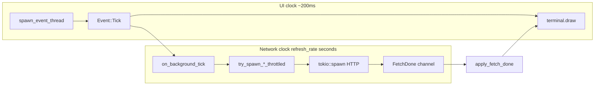
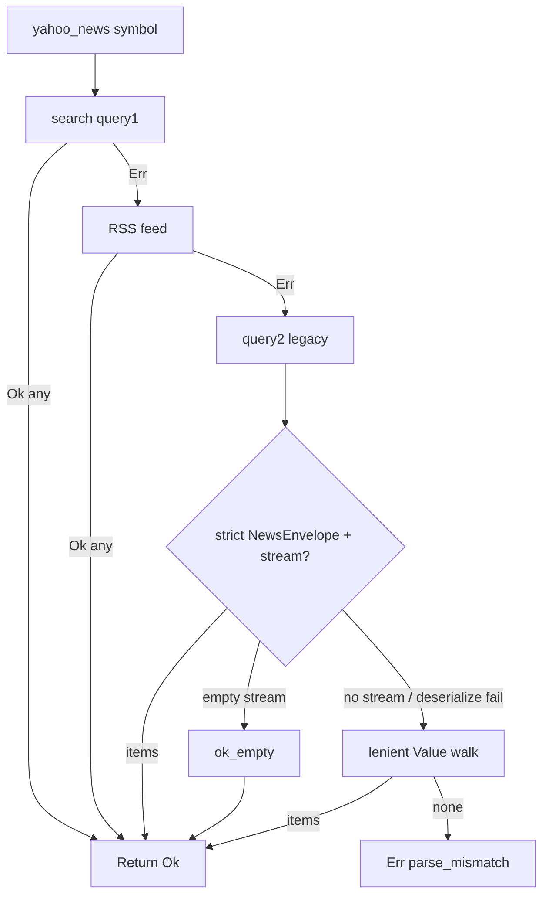

# SPEC — StockTerm (Issue #3 baseline + follow-ons)

**[#204](https://github.com/FelipeMorandini/stockterm/issues/204)** — Config: canonicalize persisted symbols on load (**§67** follow-up — **§73**; **shipped** — manual QA [`docs/QA_PLAN.md`](QA_PLAN.md) Issue **#204** sign-off **2026-05-28**). **[#24](https://github.com/FelipeMorandini/stockterm/issues/24)** — Custom dashboard panes (composable watchlist / chart / news / portfolio / alerts panels — **§70**; **Phases A–C shipped** 2026-05-26–27 — all v1 read-only pane kinds + `market_overview` preset; manual QA [`docs/QA_PLAN.md`](QA_PLAN.md) Issue **#24** sign-off **2026-05-27**; **PR:** [#207](https://github.com/FelipeMorandini/stockterm/pull/207), [#210](https://github.com/FelipeMorandini/stockterm/pull/210)). **Phase D shipped** (2026-05-27 — in-app pane editor **§71**; manual QA [`docs/QA_PLAN.md`](QA_PLAN.md) Issue **#208** pending sign-off; **PR:** [#211](https://github.com/FelipeMorandini/stockterm/pull/211)). **[#209](https://github.com/FelipeMorandini/stockterm/issues/209)** — Dashboard: gate historical/news background fetch on active dashboard pane kinds (**§70** performance follow-up — **§72**; **shipped** — manual QA [`docs/QA_PLAN.md`](QA_PLAN.md) Issue **#209** sign-off **2026-05-27**; **PR:** [#212](https://github.com/FelipeMorandini/stockterm/pull/212)). **[#194](https://github.com/FelipeMorandini/stockterm/issues/194)** — Saved named filters + optional regex mode for Portfolio / Stock View tables (**§23** follow-up — **§69**; **shipped** — manual QA [`docs/QA_PLAN.md`](QA_PLAN.md) Issue **#194** sign-off **2026-05-26**; **PR:** [#206](https://github.com/FelipeMorandini/stockterm/pull/206)). **[#79](https://github.com/FelipeMorandini/stockterm/issues/79)** — Unicode / full case-folding for ticker normalization (**§11.12.4** / [#74](https://github.com/FelipeMorandini/stockterm/issues/74) follow-up — **§67**; **shipped** — manual QA [`docs/QA_PLAN.md`](QA_PLAN.md) Issue **#79** sign-off **2026-05-25**; **PR:** [#205](https://github.com/FelipeMorandini/stockterm/pull/205)). **[#191](https://github.com/FelipeMorandini/stockterm/issues/191)** — Optional `CancellationToken` for superseded quote batches (**§16.1** follow-up — **§68**; **planned / deferred** — implement only if overlapping quote batches become a product requirement; manual QA [`docs/QA_PLAN.md`](QA_PLAN.md) Issue **#191** after approval). **[#192](https://github.com/FelipeMorandini/stockterm/issues/192)** — `Config::save`: stop silently dropping I/O errors; audit `let _ = try_save_*` call sites (**§22** / **§4.15** follow-up — **§66**; **shipped** — manual QA [`docs/QA_PLAN.md`](QA_PLAN.md) Issue **#192** sign-off **2026-05-25**). **[#199](https://github.com/FelipeMorandini/stockterm/issues/199)** — Charts: precompute candle layout off the 60fps render path (**§63** follow-up — **§64**; shipped — manual QA [`docs/QA_PLAN.md`](QA_PLAN.md) Issues **#199, #200** — sign-off **2026-05-25**; **PR:** [#202](https://github.com/FelipeMorandini/stockterm/pull/202)). **[#200](https://github.com/FelipeMorandini/stockterm/issues/200)** — `HistoricalData::t`: normalize bar timestamp unit at provider ingest (**§63** follow-up — **§65**; shipped — same PR as **#199**). **[#190](https://github.com/FelipeMorandini/stockterm/issues/190)** — Charts: terminal candlestick visual density polish (**§63**; shipped — manual QA [`docs/QA_PLAN.md`](QA_PLAN.md) Issue **#190** — sign-off **2026-05-25**; **PR:** [#201](https://github.com/FelipeMorandini/stockterm/pull/201)). **[#195](https://github.com/FelipeMorandini/stockterm/issues/195)** — Options: lazy `options_theme_stamp` compare to skip redundant table rebuilds (**§56.7** follow-up — **§61**; shipped — manual QA [`docs/QA_PLAN.md`](QA_PLAN.md) Issue **#195** — sign-off **2026-05-24**; **PR:** [#198](https://github.com/FelipeMorandini/stockterm/pull/198)). **[#196](https://github.com/FelipeMorandini/stockterm/issues/196)** — Theme: audit watchlist/portfolio/alerts draw paths + commit hook (**§56.7** follow-up — **§62**; shipped — manual QA [`docs/QA_PLAN.md`](QA_PLAN.md) Issue **#196** — sign-off **2026-05-24**; **PR:** [#198](https://github.com/FelipeMorandini/stockterm/pull/198)). **[#189](https://github.com/FelipeMorandini/stockterm/issues/189)** — M7 Phase 2: expand `insta` snapshots (Stock View status + portfolio dialog) — **§59** (shipped — manual QA [`docs/QA_PLAN.md`](QA_PLAN.md) Issue **#189** — sign-off **2026-05-24**; **PR:** [#197](https://github.com/FelipeMorandini/stockterm/pull/197)). **[#193](https://github.com/FelipeMorandini/stockterm/issues/193)** — CI: enforce blocking `cargo fmt --check` — **§60** (shipped — manual QA [`docs/QA_PLAN.md`](QA_PLAN.md) Issue **#193** — sign-off **2026-05-24**; **PR:** [#197](https://github.com/FelipeMorandini/stockterm/pull/197)). **[#181](https://github.com/FelipeMorandini/stockterm/issues/181)** — GitHub Actions CI (`cargo test` + `clippy -D warnings`) — **§57** (shipped — manual QA [`docs/QA_PLAN.md`](QA_PLAN.md) Issue **#181** — sign-off **2026-05-23**; **PR:** [#188](https://github.com/FelipeMorandini/stockterm/pull/188)). **[#184](https://github.com/FelipeMorandini/stockterm/issues/184)** — `TestBackend` draw snapshot tests (error overlay first) — **§58** (shipped — manual QA [`docs/QA_PLAN.md`](QA_PLAN.md) Issue **#184** — sign-off **2026-05-23**; **PR:** [#188](https://github.com/FelipeMorandini/stockterm/pull/188)). **[#183](https://github.com/FelipeMorandini/stockterm/issues/183)** — Options: rebuild display tables when theme preset changes (**§53.2** / **§21** follow-up — **§56**; shipped — manual QA [`docs/QA_PLAN.md`](QA_PLAN.md) Issue **#183** — sign-off **2026-05-23**; **PR:** [#187](https://github.com/FelipeMorandini/stockterm/pull/187)). **[#182](https://github.com/FelipeMorandini/stockterm/issues/182)** — Portfolio row edit UI for existing holdings (**§13** / **§15** follow-up — **§55**; shipped — manual QA [`docs/QA_PLAN.md`](QA_PLAN.md) Issue **#182** — sign-off **2026-05-23**). **[#180](https://github.com/FelipeMorandini/stockterm/issues/180)** — Persist Charts **`time_range`** and **`chart_mode`** in **`~/.stockterm.json`** (**§11** follow-up — **§54**; shipped — manual QA [`docs/QA_PLAN.md`](QA_PLAN.md) Issue **#180** — sign-off **2026-05-23**; **PR:** [#185](https://github.com/FelipeMorandini/stockterm/pull/185)). **[#65](https://github.com/FelipeMorandini/stockterm/issues/65)** — Polygon historical response size limit + free-tier messaging (**§11** follow-up — **§52**; shipped — manual QA [`docs/QA_PLAN.md`](QA_PLAN.md) Issue **#65** — sign-off **2026-05-22**). **Options tab polish** (post-**§48** / **§50** / **§51** UX hardening — **§52.2**; same PR as **#65**). **[#176](https://github.com/FelipeMorandini/stockterm/issues/176)** — Polygon historical `next_url` pagination loop (**§52** follow-up — **§53.1**; shipped — manual QA [`docs/QA_PLAN.md`](QA_PLAN.md) Issue **#176** — sign-off **2026-05-22**; **PR:** [#179](https://github.com/FelipeMorandini/stockterm/pull/179)). **[#177](https://github.com/FelipeMorandini/stockterm/issues/177)** — Options tab zero-clone draw path (**§52.2** follow-up — **§53.2**; shipped — manual QA [`docs/QA_PLAN.md`](QA_PLAN.md) Issue **#177** — sign-off **2026-05-22**; **PR:** [#179](https://github.com/FelipeMorandini/stockterm/pull/179)). **[#171](https://github.com/FelipeMorandini/stockterm/issues/171)** — Polygon options expiration list session cache (**§50** follow-up — **§51**; manual QA [`docs/QA_PLAN.md`](QA_PLAN.md) Issue **#171** — sign-off **2026-05-22**; **PR:** [#173](https://github.com/FelipeMorandini/stockterm/pull/173)). **[#168](https://github.com/FelipeMorandini/stockterm/issues/168)** — Yahoo options expiration slice cache (**§48** follow-up — **§49.2**; shipped — manual QA [`docs/QA_PLAN.md`](QA_PLAN.md) Issue **#168** — sign-off **2026-05-21**; **PR:** [#170](https://github.com/FelipeMorandini/stockterm/pull/170)). **[#167](https://github.com/FelipeMorandini/stockterm/issues/167)** — Polygon.io options chain provider (**§48** follow-up — **§50**; manual QA [`docs/QA_PLAN.md`](QA_PLAN.md) Issue **#167** — sign-off **2026-05-22**; **PR:** [#172](https://github.com/FelipeMorandini/stockterm/pull/172)). **[#165](https://github.com/FelipeMorandini/stockterm/issues/165) / [#168](https://github.com/FelipeMorandini/stockterm/issues/168)** — §47 / §48 follow-ons: backtest golden metric fixtures + Yahoo options expiration slice cache (**§49**; manual QA [`docs/QA_PLAN.md`](QA_PLAN.md) Issues **#165, #168** — sign-off **2026-05-21**; **PR:** [#170](https://github.com/FelipeMorandini/stockterm/pull/170)). **[#22](https://github.com/FelipeMorandini/stockterm/issues/22)** — options chains + **Options** tab (calls/puts table, expiration selector, Greeks toggle — **§48**; manual QA [`docs/QA_PLAN.md`](QA_PLAN.md) Issue **#22** — sign-off **2026-05-21**; **PR:** [#169](https://github.com/FelipeMorandini/stockterm/pull/169)). **[#25](https://github.com/FelipeMorandini/stockterm/issues/25)** — backtesting engine + **Backtest** tab (strategy trait, SMA crossover / RSI mean-reversion, equity curve, CSV/JSON export — **§47**; manual QA [`docs/QA_PLAN.md`](QA_PLAN.md) Issue **#25** — sign-off **2026-05-21**; **PR:** [#166](https://github.com/FelipeMorandini/stockterm/pull/166)). **[#21](https://github.com/FelipeMorandini/stockterm/issues/21)** — technical indicators (SMA / EMA / RSI / MACD) on the Charts tab (**§46**; manual QA [`docs/QA_PLAN.md`](QA_PLAN.md) Issue **#21** — sign-off **2026-05-21**; **PR:** [#164](https://github.com/FelipeMorandini/stockterm/pull/164)). **Issue #3** — Multi-symbol watchlist & multi-row quote table (§§1–7). **[#160](https://github.com/FelipeMorandini/stockterm/issues/160) / [#161](https://github.com/FelipeMorandini/stockterm/issues/161)** — §44 follow-ons: clear **`symbol_kind_cache`** on Settings provider change + Polygon crypto **`X:`** wire mapping in **`resolve_provider_symbol`** (**§45**; manual QA [`docs/QA_PLAN.md`](QA_PLAN.md) Issues **#160, #161** — sign-off **2026-05-20**; **PR:** [#163](https://github.com/FelipeMorandini/stockterm/pull/163)). **[#157](https://github.com/FelipeMorandini/stockterm/issues/157) / [#158](https://github.com/FelipeMorandini/stockterm/issues/158)** — provider-aware symbol resolver (Yahoo vs Polygon HTTP namespaces) + **`SymbolKind`** from Yahoo **`quoteType`** metadata with heuristic fallback (**§44**; manual QA [`docs/QA_PLAN.md`](QA_PLAN.md) Issues **#157, #158** — sign-off **2026-05-20**; **PR:** [#162](https://github.com/FelipeMorandini/stockterm/pull/162)). **[#23](https://github.com/FelipeMorandini/stockterm/issues/23)** — cryptocurrency quotes via Yahoo-style symbols (`BTC-USD`), adaptive price formatting, **`SymbolKind`** UI label, Stock View hyphen entry, §43.13 quote-cache alignment (**§43**; manual QA [`docs/QA_PLAN.md`](QA_PLAN.md) Issue **#23** — sign-off **2026-05-19**; **PR:** [#159](https://github.com/FelipeMorandini/stockterm/pull/159)). **[#51](https://github.com/FelipeMorandini/stockterm/issues/51) / [#28](https://github.com/FelipeMorandini/stockterm/issues/28)** — global **`q`/`Q`** quit via **`should_global_quit`**, Tab meta policy, **`STOCKTERM_API_KEY`** runtime overlay (no env merge on load — **§42**; manual QA [`docs/QA_PLAN.md`](QA_PLAN.md) Issues **#51, #28** — sign-off **2026-05-19**; **PR:** [#156](https://github.com/FelipeMorandini/stockterm/pull/156)). **[#32](https://github.com/FelipeMorandini/stockterm/issues/32) / [#33](https://github.com/FelipeMorandini/stockterm/issues/33) / [#55](https://github.com/FelipeMorandini/stockterm/issues/55)** — **`get_current_price`** symbol/ticker alignment, **`ProviderError`** **`thiserror`** migration, API error taxonomy audit (**§41**; manual QA [`docs/QA_PLAN.md`](QA_PLAN.md) Issues **#32, #33, #55** — sign-off **2026-05-19**; **PR:** [#155](https://github.com/FelipeMorandini/stockterm/pull/155)). **[#36](https://github.com/FelipeMorandini/stockterm/issues/36) / [#56](https://github.com/FelipeMorandini/stockterm/issues/56) / [#106](https://github.com/FelipeMorandini/stockterm/issues/106)** — Charts timestamp panic hardening + regression tests, explicit quote-batch **`Semaphore`** acquire failures, §18.15 post-audit **`centered_rect`** release clamp + incremental notify **`body`** assembly (**§40**; manual QA [`docs/QA_PLAN.md`](QA_PLAN.md) Issues **#36, #56, #106** — sign-off **2026-05-19**; **PR:** [#154](https://github.com/FelipeMorandini/stockterm/pull/154)). **[#108](https://github.com/FelipeMorandini/stockterm/issues/108) / [#78](https://github.com/FelipeMorandini/stockterm/issues/78) / [#87](https://github.com/FelipeMorandini/stockterm/issues/87)** — event-thread clean shutdown, inflight recovery when both **`FetchDone`** and **`InflightRecovery`** sends fail, and **`mpsc`** back-pressure policy (**§39**; manual QA [`docs/QA_PLAN.md`](QA_PLAN.md) Issues **#108, #78, #87** — sign-off **2026-05-19**; **PR:** [#153](https://github.com/FelipeMorandini/stockterm/pull/153)). **[#76](https://github.com/FelipeMorandini/stockterm/issues/76) / [#85](https://github.com/FelipeMorandini/stockterm/issues/85) / [#86](https://github.com/FelipeMorandini/stockterm/issues/86) / [#117](https://github.com/FelipeMorandini/stockterm/issues/117) / [#118](https://github.com/FelipeMorandini/stockterm/issues/118)** — async/HTTP reliability tail: **`tracing`** for dropped fetch results, cap **`STOCKTERM_DEBUG_HTTP_DELAY_MS`**, dev panic payload logging, **408** retry, structured **`reqwest` Client** init (**§38**; manual QA [`docs/QA_PLAN.md`](QA_PLAN.md) Issues **#76, #85, #86, #117, #118** — sign-off **2026-05-18**; **PR:** [#152](https://github.com/FelipeMorandini/stockterm/pull/152)). **[#81](https://github.com/FelipeMorandini/stockterm/issues/81) / [#82](https://github.com/FelipeMorandini/stockterm/issues/82) / [#83](https://github.com/FelipeMorandini/stockterm/issues/83)** — Stock View narrow-terminal status hints, plain-**Tab** portfolio dialog focus, **`add_to_portfolio`** false-path contract (**§37**; manual QA [`docs/QA_PLAN.md`](QA_PLAN.md) Issues **#81–#83** — sign-off **2026-05-18**; **PR:** [#151](https://github.com/FelipeMorandini/stockterm/pull/151)). **[#54](https://github.com/FelipeMorandini/stockterm/issues/54)** — Yahoo news: resilient **`query2`** parsing + **`STOCKTERM_DEBUG_YAHOO_NEWS`** (**§36**; manual QA [`docs/QA_PLAN.md`](QA_PLAN.md) Issue **#54** — sign-off **2026-05-18**; **PR:** [#150](https://github.com/FelipeMorandini/stockterm/pull/150)). **[#4](https://github.com/FelipeMorandini/stockterm/issues/4)** — configurable **`refresh_rate`** vs UI tick (**§35**; manual QA [`docs/QA_PLAN.md`](QA_PLAN.md) Issue **#4** — sign-off **2026-05-18**; **PR:** [#149](https://github.com/FelipeMorandini/stockterm/pull/149)). **[#90](https://github.com/FelipeMorandini/stockterm/issues/90) / [#91](https://github.com/FelipeMorandini/stockterm/issues/91)** — Yahoo quote adapter: **`STOCKTERM_DEBUG_YAHOO_QUOTE`** v7→v8 stderr + v7 multi-row **symbol** match (**§34**; manual QA [`docs/QA_PLAN.md`](QA_PLAN.md) Issues **#90, #91** — sign-off **2026-05-18**). **[#60](https://github.com/FelipeMorandini/stockterm/issues/60)** — Search **Esc** must not clear cross-tab runtime errors (**§33**; manual QA [`docs/QA_PLAN.md`](QA_PLAN.md) Issue **#60** — sign-off **2026-05-18**). **[#89](https://github.com/FelipeMorandini/stockterm/issues/89)** — Yahoo **`yahoo_latest_quote`** **v7→v8** orchestration integration test (**§32**; manual QA [`docs/QA_PLAN.md`](QA_PLAN.md) Issue **#89** — sign-off **2026-05-18**). **[#15](https://github.com/FelipeMorandini/stockterm/issues/15)** — **layout / widget visibility** (`Config.layout`, shell + pane splits, optional Settings presets — **§31**; manual QA [`docs/QA_PLAN.md`](QA_PLAN.md) Issue **#15** — sign-off **2026-05-17**). **[#138](https://github.com/FelipeMorandini/stockterm/issues/138)** — keymap **compile-time default chord table** (remove runtime `Box::leak` — **§30**; manual QA [`docs/QA_PLAN.md`](QA_PLAN.md) Issue **#138** — sign-off 2026-05-17). **[#134](https://github.com/FelipeMorandini/stockterm/issues/134)** — keymap **per-context overlay propagation** (portfolio list vs remove-armed shared row nav — **§25**; manual QA [`docs/QA_PLAN.md`](QA_PLAN.md) Issue **#134**). **Issue #44** — Stock View & Alerts keyboard modifiers (§8, shipped). **Issues #48 / #6** — Portfolio tab: keyboard parity (§12, shipped); add dialog, confirm remove, quote coverage (§13, shipped). **Issue #31** — Yahoo Finance default provider & Polygon fallback (§9, shipped). **Issues #29 / #5 / #11 / #12** — Search typeahead, News list, Settings editor (§10, shipped — see §10.9 PR). **Issues #9 / #8 / #7** — Historical time ranges, chart viewport (zoom/pan), real candlestick widget (§11, shipped — see §11.10 PR). **Issues #62 / #63 / #64** — Charts polish: symbol/series coherence, Yahoo W1 empty fallback, historical fetch resilience (§11.11, shipped — see §11.11.7). **Issues #71 / #72 / #73 / #74** — Charts/async hardening: inflight recovery on channel send failure, remove dead sync historical fetch, Yahoo W1 unit tests, watchlist add without spurious chart clear (§11.12, shipped — see §11.12.8). **Issues #43 / #49 / #50 / #67 / #69** — Alerts titles & copy, Stock View watchlist typing hint, Portfolio dialog Tab/Shift+Tab field focus, commit inline errors and optional numeric caps (§15, shipped — see §15.8). **Issues #17 / #46 / #77** — Non-blocking loop completion, quote-batch panic-safety, and `stock_refresh_pending` on stock inflight recovery (§16, shipped — see §16.8). **Issue #2** — Latest-session stock quotes via provider adapters (§17, shipped — see §17.9). **Issues #10 / #42** — Alerts: add dialog + bell/desktop notify + Settings toggle; Status column from latched `triggered` (§18, shipped — see §18.12). **Issues #93 / #94 / #95** — Shared modal `centered_rect`, alert dialog **←/→** on Condition, optional stderr when desktop **`show()`** fails (§18.13, shipped — see §18.13.8). **Issues #96 / #97 / #98** — Alerts tab banner + optional save retry after `try_save` failure, coalesced desktop toast per quote batch, sanitized notify text (§18.14, implemented — see §18.14.9 and [PR #105](https://github.com/FelipeMorandini/stockterm/pull/105); sign-off **2026-05-18**). **Issues #100 / #101 / #104** — `centered_rect` percent contract (`debug_assert!`), README **Developer / debug** env vars, total cap on coalesced desktop notify **`body`** (§18.15, implemented — see §18.15.8). **Issue #18** — API robustness: shared HTTP tuning, **`Retry-After`** on 429, exponential backoff + jitter, non-JSON error bodies, extended **`ProviderError`** (**§19** — shipped [PR #115](https://github.com/FelipeMorandini/stockterm/pull/115); **manual QA** [`docs/QA_PLAN.md`](QA_PLAN.md) Issue #18 sign-off). **Issues #110 / #111 / #112 / #113 / #114 / #116** — §19 post-audit hardening (bounded error-body reads, **`Retry-After`** ceiling + sub-second **`Display`**, HTTP-date tolerance, paused-**`tokio`** test docs, retry **`unreachable!`**, query redaction on **`Debug`** / stored URL — **§19.13**, shipped — see §19.13.7; **manual QA** [`docs/QA_PLAN.md`](QA_PLAN.md) Issues **#110–#116** sign-off). **Issue #14** — Theme system: palette model, JSON hex slots, built-in presets, Settings picker, theme-aware draw helpers (**§21** — shipped — see §21.11 / [PR #126](https://github.com/FelipeMorandini/stockterm/pull/126)). **Issues [#19](https://github.com/FelipeMorandini/stockterm/issues/19) / [#103](https://github.com/FelipeMorandini/stockterm/issues/103)** — config persistence polish + coordination of sticky alerts-save failures with other runtime errors (**§22** — partial ship: #103 + session fields + README; manual QA [`docs/QA_PLAN.md`](QA_PLAN.md) **Issues #19, #103**). **[#34](https://github.com/FelipeMorandini/stockterm/issues/34) / [#35](https://github.com/FelipeMorandini/stockterm/issues/35) / [#40](https://github.com/FelipeMorandini/stockterm/issues/40) / [#129](https://github.com/FelipeMorandini/stockterm/issues/129)** — operator-facing API-key docs, load-failure UX audit, optional async config I/O, session-write coalescing (**§22.7** follow-ons). **[#16](https://github.com/FelipeMorandini/stockterm/issues/16)** — Portfolio + Stock View watchlist **substring filter** (`/`, live table, Esc clear, Enter commit, Tab-safe — **§23**; manual QA [`docs/QA_PLAN.md`](QA_PLAN.md) Issue **#16**). **[#13](https://github.com/FelipeMorandini/stockterm/issues/13)** — **Configurable keymap** (`Action`, `BindingLayer`, `~/.stockterm.json` **`keymap`** — **§24**; manual QA [`docs/QA_PLAN.md`](QA_PLAN.md) Issue **#13** — sign-off **2026-05-18**. **[#136](https://github.com/FelipeMorandini/stockterm/issues/136)** — **Keymap phase 2** (symbol buffers + modal digit/symbol entry under `Action` / hybrid policy — **§26**; manual QA [`docs/QA_PLAN.md`](QA_PLAN.md) Issue **#136** — sign-off **2026-05-18**. **[#137](https://github.com/FelipeMorandini/stockterm/issues/137)** — **Keymap: remappable filter-input mode** (`BindingLayer::FilterInput` — **§28**; manual QA [`docs/QA_PLAN.md`](QA_PLAN.md) Issue **#137** — sign-off **2026-05-18**. **[#58](https://github.com/FelipeMorandini/stockterm/issues/58) / [#59](https://github.com/FelipeMorandini/stockterm/issues/59)** — News **clipboard copy** + **non-blocking** browser open with **`http`/`https`** allowlist (**§27**; manual QA [`docs/QA_PLAN.md`](QA_PLAN.md) Issues **#58, #59** — sign-off **2026-05-18**). **[#3](https://github.com/FelipeMorandini/stockterm/issues/3)** — shipped watchlist baseline; re-run §3 / QA **Issue #3** when touching session save or watchlist persistence (**§22.7.5**).

**Sources (Issue #3):**

- [GitHub Issue #3](https://github.com/FelipeMorandini/stockterm/issues/3) — `Watchlist` in config, fan-out quotes, Stock View table, navigation, persistence, bounded concurrency, non-blocking refresh.

**Related issues (dependencies / alignment):**

- [#4](https://github.com/FelipeMorandini/stockterm/issues/4) — `Config.refresh_rate` drives network poll cadence (seconds); UI tick stays ~200 ms — **§35** (canonical plan; shipped in-tree with #3 / #12 / #16 / #17).
- [#17](https://github.com/FelipeMorandini/stockterm/issues/17) — Network I/O must not sit inline between redraws; input stays responsive during slow API.
- [#18](https://github.com/FelipeMorandini/stockterm/issues/18) — Shared HTTP client, timeouts, 429/backoff, concurrency cap (this SPEC adopts a **minimal** cap for watchlist fan-out; full `ProviderError` work can extend #18).
- [#19](https://github.com/FelipeMorandini/stockterm/issues/19) — Surface `Config::try_save` failures via `App::error_message()` / `active_runtime_error`; avoid silent persistence loss; session fields in **§22**. [#103](https://github.com/FelipeMorandini/stockterm/issues/103) — Do not drop **`Failed to save alerts:`** when quote errors overwrite runtime error (**§22.2**). [#34](https://github.com/FelipeMorandini/stockterm/issues/34) — document plaintext **`api_key`** + **`STOCKTERM_API_KEY`** (**§22.7.1**). [#35](https://github.com/FelipeMorandini/stockterm/issues/35) — no silent **`try_load`** failures on the **`App::new`** path (**§22.7.2**). [#40](https://github.com/FelipeMorandini/stockterm/issues/40) — optional non-blocking **`try_save`** (**§22.7.3**). [#129](https://github.com/FelipeMorandini/stockterm/issues/129) — debounce / coalesce frequent session JSON writes (**§22.7.4**).

**Overlap note:** Issue #3 acceptance requires refresh to respect `refresh_rate` and not block input. **As of the §11.12 tree**, [`App::run`](../src/app/app.rs) uses **`tokio::select!`** over **`tokio::sync::mpsc`** event / `FetchDone` / `InflightRecovery` channels, and quote / historical / news / search HTTP runs inside **`tokio::spawn`** tasks — **no HTTP `await` on the path between `draw` and the next `select!` branch**. Remaining **#17** work is **acceptance polish** (documented smoke delay, optional `CancellationToken`, clippy lock hygiene) — see **§16**.

---

## 1. Current gaps (verified in tree)

| Area | Location | Problem |
|------|----------|---------|
| Single symbol | `App::symbol` only | No persisted list; Stock View is a single-symbol paragraph ([`src/app/ui.rs`](../src/app/ui.rs) `draw_stock_view`). |
| Config | [`src/config/config.rs`](../src/config/config.rs) | No `watchlist` field; older JSON files must still deserialize after adding the field (`serde(default)`). |
| Quote cache | `App::ticker_data: Option<TickerResponse>` | Only one response; watchlist needs per-symbol quote cache for the table **and** for `get_current_price` ([`src/app/alerts.rs`](../src/app/alerts.rs)) for non-active alert symbols. |
| Keys | [`src/app/handlers.rs`](../src/app/handlers.rs) `handle_stock_view_keys` | No `w` / remove / table navigation. |
| Fan-out | `fetch_ticker_data` | Single `get_ticker_data(&self.symbol, …)` only. |
| Non-blocking (#17) | `App::run` | **Shipped baseline:** async `select!` + background fetches (see §16.1). **Remaining:** smoke harness, optional cancel token, clippy `await_holding_lock` gate. |

**Already helpful in tree:** `data_poll_interval()` uses `config.refresh_rate` with a minimum of 5 seconds ([`src/app/app.rs`](../src/app/app.rs)); `Config::try_save` exists for safe persistence.

---

## 2. Crate & module layout

- **Single package:** `stockterm` (no new crate).
- **`src/config/config.rs`:** Add `watchlist: Vec<String>` with `#[serde(default)]`; document default (empty). Optionally coordinate `default_symbol` with #19 — out of scope for #3 unless the same PR touches `App::new`.
- **`src/app/app.rs`:** Watchlist state, fan-out fetch orchestration, throttle integration, `symbol` / selection invariants, portfolio back-fill from cached quotes where applicable.
- **`src/app/ui.rs`:** Split Stock View into a **watchlist table** + **detail** region (or dedicated `draw_watchlist` in `src/app/stock_view.rs` if the module grows — optional file split).
- **`src/app/handlers.rs`:** Stock View key bindings: add/remove/list navigation; avoid conflicting with existing `A`–`Z` symbol typing (see §3.5).
- **`src/app/alerts.rs`:** Extend `get_current_price` to consult the watchlist quote cache before returning `None`.
- **`src/api/polygon.rs`:** No schema change to `TickerResponse`; reuse `get_ticker_data`. Concurrency limiting may use a small helper or `tokio::sync::Semaphore` in `api` or `app` (prefer one shared semaphore for all Polygon quote calls if #18 lands later).

---

## 3. Implementation plan (Rust)

### 3.1 Config & migration

- Add `pub watchlist: Vec<String>` to `Config` with `#[serde(default)]` so missing field → empty vec on `try_load`.
- Normalize symbols when persisting: uppercase, trim, reject empty strings; dedupe on add.
- After any add/remove/reorder that should persist, assign `self.config.watchlist = self.watchlist.clone()` (or use config as single source of truth) and call **`self.config.try_save()`**; on `Err`, set `self.error_message` (align with #19 / `save_alerts` pattern).

### 3.2 Application state

- **`watchlist: Vec<String>`** — Loaded from `config.watchlist` in `App::new`; kept in sync with `config` on save.
- **`watchlist_state: ratatui::widgets::TableState`** — Selection index into `watchlist` (same pattern as `portfolio_state` / `alerts_state`).
- **`watchlist_quotes: std::collections::HashMap<String, TickerResponse>`** (or `HashMap<String, TickerResult>` if only the latest bar is needed) — Last successful quote per symbol; clear or mark stale per product decision (recommended: update in place on each successful fan-out; on per-symbol error keep previous bar and optionally store a side-channel error map or a single aggregated status string).

**Active symbol (`App::symbol`):**

- Continues to drive Charts, News, alerts add (`'a'`), portfolio context, and the **detail** pane on Stock View.
- **Invariant:** When the user moves the watchlist selection (`j`/`k` or arrows), set `self.symbol` to `watchlist[i]` so the rest of the app tracks the highlighted row.
- **Typing buffer:** Today uppercase letters append to `symbol` and Backspace pops ([`handlers.rs`](../src/app/handlers.rs)). With a table, either:
  - **Recommended:** Treat typing as editing the “pending” ticker: still mutate `symbol`; when the user confirms with **Enter**, fetch and optionally move selection to that symbol if it exists in the watchlist; **or**
  - Keep selection and typed string in sync only when navigating rows (simpler UX: row change overwrites `symbol`).

Document the chosen behavior in QA steps.

### 3.3 Fan-out fetch & throttle

- Replace or extend the single-symbol path with **`fetch_watchlist_quotes`** (name flexible) that:
  1. Builds the distinct set of symbols to refresh: **all `watchlist` entries** plus **`symbol`** if it is non-empty and not already in the set (so the typed ticker still gets a quote before `w` adds it).
  2. Respects **bounded concurrency**: e.g. `const MAX_CONCURRENT_QUOTES: usize = 2` (tunable; Polygon free tier is 5 req/min — sequential or 2-wide fan-out is safer than unbounded `join_all`).
  3. Uses `futures::stream::FuturesUnordered` + `buffer_unordered(N)`, or chunks of `N` with `futures::future::join_all`, or a `Semaphore` with `acquire_owned` around each `get_ticker_data` — all acceptable; pick one style and use it consistently.
  4. Merges successes into `watchlist_quotes` and updates `ticker_data` for **`self.symbol`** from the cached map (or last fetch result) so existing code that reads `ticker_data` for the detail pane keeps working.
  5. After successful updates, **portfolio `current_price` back-fill**: for each portfolio row whose symbol has a fresh quote in the map, update `current_price` (same idea as today’s single-symbol path in `fetch_ticker_data`).
  6. Calls **`check_alerts()`** once after the batch (prices for multiple symbols may now exist via `watchlist_quotes` — see §3.4).

- **Throttle:** Reuse `last_stock_network_poll` + `data_poll_interval()` so watchlist refresh runs on the same cadence as today’s stock poll for `Tab::StockView | Tab::Alerts` (and any other tab that the implementation decides needs fresh quotes — keep parity with current behavior unless SPEC is extended).

- **In-flight guard (#4):** If a watchlist fetch is still running, do not start another full fan-out; optionally set a flag or use a generation counter so only the **latest** completed batch applies (pairs with #17 cancellation semantics).

### 3.4 `get_current_price` & alerts

Extend `get_current_price` order roughly to:

1. If `ticker_data` matches the requested symbol (existing logic) → use it.
2. Else if `watchlist_quotes.get(symbol)` has a latest bar → `Some(bar.c)`.
3. Else portfolio `current_price` (existing).

Then `check_alerts` can evaluate alerts for watchlist symbols without requiring that symbol to be the single global `ticker_data` row.

### 3.5 UI — Stock View

- **Layout:** Vertical split (e.g. `Layout`) — **top:** `Table` with columns **Symbol | Last | Change | % Change | Volume** (values from latest daily bar: `c`, `c-o`, percent vs `o`, `v` rounded).
- **Bottom:** Existing detail block (open/high/low/volume narrative) for **`symbol`**, driven by `ticker_data` or by row lookup in `watchlist_quotes`.
- **Highlight:** `TableState` selection; highlight style consistent with portfolio/alerts tables.
- **Empty watchlist:** Show empty-state hint (“Press `w` to add current symbol”) and still allow typing a symbol and Enter to fetch detail.

### 3.6 Key bindings (Stock View)

| Key | Action |
|-----|--------|
| `w` | Add current `symbol` (normalized) to `watchlist` if not duplicate; persist with `try_save`. |
| `x` or `Shift+d` (`D`) | Remove selected watchlist row; adjust selection; set `symbol` to new selection or first remaining; persist. |
| `j` / `k` or `Up` / `Down` | Move selection; update `symbol` to selected ticker. |

**Conflict check:** Lowercase `a`–`z` are not used today for symbol input (only uppercase). `w`, `x`, `j`, `k` are safe. Use `Shift+d` for delete if `d` would collide with future bindings.

### 3.7 Non-blocking UI (#17)

- **Requirement:** No `await` on `get_quote` / other HTTP on the path between `terminal.draw(…)` and the next **input-capable** turn of the main loop.
- **Shipped pattern (tree):** [`spawn_event_thread`](../src/app/event.rs) bridges crossterm into **`tokio::sync::mpsc::unbounded_channel`**. **`App::run`** uses **`tokio::select!`** over **input/tick**, **`FetchDone`**, and **`InflightRecovery`**. Stock batch (**`run_stock_quote_batch`**), historical, news, and search use **`tokio::spawn`** + **`FetchDone`** variants.
- **Loading:** While **`stock_refresh_inflight`** (or other inflight flags) is true, status UI may show a short “Refreshing…” / busy hint; **ticks keep firing** (~200 ms).
- **Remaining acceptance (#17 / §16):** Artificial-delay smoke test, optional **`tokio_util::sync::CancellationToken`** (or stricter generation docs) for superseded work, **`cargo clippy`** without **`await_holding_lock`** (and similar) on touched code.

If the §16 checklist is not satisfied, QA keeps marking the **#17 smoke** row **fail** until fixed.

### 3.8 API robustness (#18) — minimal slice for #3

- **Canonical plan:** **§19** (Issue #18) — retries, **`RateLimited`**, client timeouts, and shared fetch helpers supersede the historical “minimal slice” bullets below.
- **Today:** A single **`reqwest::Client`** (**[`src/api/http.rs`](../src/api/http.rs)** **`shared_client`**) already exists; watchlist still multiplies call volume — testers on Polygon free tier should keep conservative **`refresh_rate`** and small watchlists. **§19** implementation: [PR #115](https://github.com/FelipeMorandini/stockterm/pull/115) (sign-off **2026-05-18**.
- Concurrency cap (§3.3 / **`MAX_CONCURRENT_QUOTES`**) remains mandatory and aligns with §19.6.

---

## 4. Automated verification

- `cargo build --release`
- `cargo clippy -- -D warnings`
- Optional: unit test for watchlist normalization / dedupe if pure functions are extracted.

---

## 5. Out of scope

- Yahoo migration / `MarketDataProvider` trait (ROADMAP §7).
- Settings UI to edit watchlist (#12 / M3).
- Full **`ProviderError`** extensions + 429/backoff (#18) — tracked in **§19** (same PR as #3 is no longer required; #3 shipped earlier).
- Watchlist ordering UI (drag/sort) — not required; optional stable sort by symbol.

---

## 6. Approval

After maintainer approval of this SPEC, implementation may proceed per `.cursor/rules/sdd_workflow.mdc` and [`docs/QA_PLAN.md`](QA_PLAN.md).

---

## 7. Shipment

- **Status:** Implemented; closes [Issue #3](https://github.com/FelipeMorandini/stockterm/issues/3). Manual verification: [`docs/QA_PLAN.md`](QA_PLAN.md).
- **PR:** https://github.com/FelipeMorandini/stockterm/pull/47
- **Follow-ups:** [Issue #44](https://github.com/FelipeMorandini/stockterm/issues/44) — specified in **§8** below (Stock View / Alerts modifier keys). **§16** — [#17](https://github.com/FelipeMorandini/stockterm/issues/17) / [#46](https://github.com/FelipeMorandini/stockterm/issues/46) / [#77](https://github.com/FelipeMorandini/stockterm/issues/77). [#18](https://github.com/FelipeMorandini/stockterm/issues/18) (429/backoff / richer `ProviderError`).

### Prior reference

Alerts loop + table layout (Issues #30 / #37 / #38): [PR #45](https://github.com/FelipeMorandini/stockterm/pull/45).

---

## 8. Next milestone — Issue #44: Stock View & Alerts keyboard modifiers

**Sources:**

- [GitHub Issue #44](https://github.com/FelipeMorandini/stockterm/issues/44) — accept `SHIFT` with letter keys, accept lowercase `a`–`z` for symbol typing and Alerts hotkeys, normalize tickers to uppercase, reject Ctrl/Alt/Meta/Super/Hyper chords.

**Related:**

- [#19](https://github.com/FelipeMorandini/stockterm/issues/19) — `default_symbol` at startup (separate).

### 8.1 Problem (verified in tree)

[`handle_stock_view_keys`](../src/app/handlers.rs) and [`handle_alerts_events`](../src/app/alerts.rs) match `KeyModifiers::NONE` for most `KeyCode::Char` arms. Many terminals report **Shift+letter** with `KeyModifiers::SHIFT` set (and sometimes an uppercase `Char`). Symbol entry only accepts `c.is_ascii_uppercase()` with `NONE`, so **lowercase** and **Shift-held** typing fail. Alerts **`a`** / **`d`** similarly ignore Shift-only and mixed case.

### 8.2 Acceptance

- **Stock View:** Watchlist actions (`w`, `x`, `j`, `k`), symbol buffer input, **Enter**, and **Backspace** behave consistently when the user types with **Shift** or **Caps Lock** (within normal terminal variance): letters append as **uppercase** ticker characters. **Hotkeys stay the lowercase letters** `w`/`x`/`j`/`k` (Issue #3 convention): uppercase `W`/`X`/`J`/`K` are **symbol input**, not shortcuts. Shifted uppercase may still carry `KeyModifiers::SHIFT`; that is allowed for the generic letter arm as long as meta keys are clear.
- **Alerts:** **`a`** (add) and **`d`** (delete selected) work with the same modifier rule and case normalization (`a`/`A`, `d`/`D`).
- **Safety:** Combinations with **Control, Alt, Meta, Hyper, or Super** (as exposed by `crossterm::event::KeyModifiers`) must **not** trigger these letter bindings or append to the symbol buffer.
- **No new crate** — logic stays in `stockterm` binary.

### 8.3 Crate & module layout

- **`src/app/handlers.rs`:** Refactor `handle_stock_view_keys` to use a shared predicate for “plain letter key” (Shift allowed, meta disallowed). Optionally move the predicate to a tiny `src/app/keyboard.rs` or `handlers` private `fn` if it is shared with alerts.
- **`src/app/alerts.rs`:** Update `handle_alerts_events` to use the same predicate and case-insensitive `Char` matching for `a`/`d`.

### 8.4 Implementation plan (Rust)

1. **Modifier predicate**  
   Define a `const` mask of disallowed modifiers, e.g.  
   `KeyModifiers::CONTROL | KeyModifiers::ALT | KeyModifiers::META | KeyModifiers::HYPER | KeyModifiers::SUPER`  
   (verify against `crossterm 0.27` `KeyModifiers` — include every non-Shift flag that indicates a chord).  
   **`letter_key_plain(m: KeyModifiers) -> bool`:** `!m.intersects(DISALLOWED_MODIFIERS)` (and optionally document that **Shift may or may not** be set for uppercase letters depending on terminal).

2. **Watchlist / navigation keys (Stock View)** — **before** the generic letter arm  
   Match **`Char('w')`, `Char('x')`, `Char('j')`, `Char('k')`** explicitly with `letter_key_plain(modifiers)` (same behavior as today). **Do not** treat uppercase `W`/`X`/`J`/`K` as these shortcuts — they belong to the symbol buffer (preserves tickers like **WMT**, **XOM**, etc., and matches pre–#44 behavior where only uppercase was typed).  
   **Remove row:** **`x`** = `Char('x')` + plain modifiers; **`Shift+d`** = `Char(c)` where `c.eq_ignore_ascii_case('d') && modifiers.contains(KeyModifiers::SHIFT) && letter_key_plain(modifiers)` so terminals that emit `'D'` vs `'d'` both work.

3. **Symbol buffer (Stock View)**  
   **After** the hotkey arms, match:  
   `KeyCode::Char(c) if c.is_ascii_alphabetic() && letter_key_plain(modifiers)` → `app.symbol.push(c.to_ascii_uppercase())`.  
   **Edge case:** An all-lowercase ticker that **starts** with `w`, `x`, `j`, or `k` (e.g. `wmt`) cannot be entered with a leading lowercase `w`/`x`/`j`/`k` because those keys are shortcuts; use **Shift** for the first letter (**`Wmt`** → **WMT**) or type in uppercase. Document in QA.

4. **Alerts**  
   For add/remove, match `Char(c)` with `c.eq_ignore_ascii_case('a')` / `eq_ignore_ascii_case('d')` and `letter_key_plain(modifiers)`.

5. **Enter / Backspace**  
   Leave **`KeyModifiers::NONE`** (or equivalent “no meta chord”) for **Enter** and **Backspace** so `Ctrl+Enter` / `Alt+Backspace` do not trigger app actions unintentionally. If the product later wants Shift+Enter, extend in a separate issue.

6. **Async / channels**  
   No change — pure input-path refactor.

### 8.5 Automated verification

- `cargo build --release`
- `cargo clippy -- -D warnings`
- **Unit tests** (in `handlers.rs` or `keyboard.rs`): `letter_key_plain(KeyModifiers::NONE)` and `letter_key_plain(KeyModifiers::SHIFT)` are true; false when `CONTROL`, `ALT`, or `SUPER` (etc.) are set alone or combined with `SHIFT`.

### 8.6 Out of scope

- **Portfolio** tab (`handle_portfolio_events` in [`src/app/portfolio.rs`](../src/app/portfolio.rs)) — same pattern may be applied later for parity; not required by Issue #44.
- Tab switching, arrow keys, or mouse — unchanged.
- Remapping keys in `Config` (ROADMAP M6).

### 8.7 Approval

After maintainer approval of §8, implementation may proceed per `.cursor/rules/sdd_workflow.mdc` and [`docs/QA_PLAN.md`](QA_PLAN.md) Issue #44 section.

### 8.8 Shipment

- **Status:** Implemented; closes [Issue #44](https://github.com/FelipeMorandini/stockterm/issues/44). Manual verification: [`docs/QA_PLAN.md`](QA_PLAN.md) (Issue #44 section).
- **PR:** https://github.com/FelipeMorandini/stockterm/pull/52
- **Code:** `src/app/keyboard.rs` (`letter_key_plain`), updates to [`src/app/handlers.rs`](../src/app/handlers.rs) and [`src/app/alerts.rs`](../src/app/alerts.rs).
- **Follow-ups:** [#48](https://github.com/FelipeMorandini/stockterm/issues/48) (Portfolio keyboard parity), [#49](https://github.com/FelipeMorandini/stockterm/issues/49) (Stock View hints), [#50](https://github.com/FelipeMorandini/stockterm/issues/50) (Alerts copy), [#51](https://github.com/FelipeMorandini/stockterm/issues/51) (global quit/tab modifiers).

---

## 9. Issue #31 — Yahoo Finance default provider (engineer migration playbook)

**Product decision (locked):** **`provider` defaults to `yahoo`**. Existing configs **without** a `provider` field deserialize as **`yahoo`** via `serde(default)` so users are **not** required to obtain a Polygon key to run the app. Polygon remains an **explicit opt-in** (`"provider": "polygon"` + API key).

**Sources:**

- [GitHub Issue #31](https://github.com/FelipeMorandini/stockterm/issues/31)
- [`docs/ROADMAP.md`](ROADMAP.md) §7 — API strategy

**Related:** [#18](https://github.com/FelipeMorandini/stockterm/issues/18) (429/backoff — follow-up), [#17](https://github.com/FelipeMorandini/stockterm/issues/17) (non-blocking UI — already landed; only swap call sites).

---

### 9.1 Problem inventory (verified in tree)

| Area | Location | Issue |
|------|----------|--------|
| HTTP | [`src/api/polygon.rs`](../src/api/polygon.rs) | `reqwest::get` — **no** connect/request timeout; errors are raw **`reqwest::Error`**. |
| Gating | [`src/app/app.rs`](../src/app/app.rs) | **`polygon_key_configured()`** blocks **`spawn_stock_fetch_task`**, **`try_spawn_historical_fetch`**, **`try_spawn_news_fetch`**, and sync **`search_symbols` / `fetch_news`** (if present) — unusable without a key. |
| Batch quotes | [`run_stock_quote_batch`](../src/app/app.rs) | Calls **`get_ticker_data`** from Polygon only. |
| Models | [`src/models/`](../src/models/) | **`TickerResponse`**, **`HistoricalResponse`**, **`SymbolSearchResponse`**, **`NewsResponse`** are **app-internal contracts**; adapters **construct** these types (they need not `Deserialize` Yahoo JSON directly into them — prefer **wire structs + mapping fns**). |

---

### 9.2 Acceptance criteria (closure checklist)

- [x] **`Config`** exposes **`provider: MarketProviderKind`** (or equivalent) with serde **`"yahoo"` \| `"polygon"`**, **`Default`** = **`Yahoo`**. Missing JSON field → Yahoo.
- [x] **Single shared `reqwest::Client`** (timeouts + User-Agent). **No** `reqwest::get` in provider code paths.
- [x] **`ProviderError`** enum + **`Display`**; HTTP non-2xx, JSON parse failures, and empty/invalid Yahoo payloads surfaced clearly on **`App.error_message`**.
- [x] **Yahoo** implements **quote**, **historical (daily)**, **symbol search**, **news** (see §9.10–9.13); maps into **existing** model types without breaking UI.
- [x] **Polygon** path preserved: same models, refactored to shared client + **`ProviderError`**; **`api_key`** required only when **`provider == Polygon`**.
- [x] **`provider_ready()`** replaces **`polygon_key_configured()`**: returns **`true`** for Yahoo always; for Polygon requires **`effective_api_key()`** non-empty.
- [x] **`cargo build --release`**, **`cargo clippy -- -D warnings`**, **`cargo test`** pass; unit tests for Yahoo mapping fixtures + error classification per §9.18.
- [x] **`docs/QA_PLAN.md`** Issue #31 manual verification (see sign-off in QA Plan).

---

### 9.3 Configuration (`src/config/config.rs`)

**New type (recommended):**

```rust
#[derive(Debug, Clone, Copy, PartialEq, Eq, Serialize, Deserialize)]
#[serde(rename_all = "lowercase")]
pub enum MarketProviderKind {
    Yahoo,
    Polygon,
}

impl Default for MarketProviderKind {
    fn default() -> Self {
        Self::Yahoo
    }
}
```

**On `Config`:**

- Add **`#[serde(default)] pub provider: MarketProviderKind`**.
- Keep **`api_key: String`** as today; document that **`effective_api_key()`** is used **only for Polygon** network calls.
- Optional doc comment: **`STOCKTERM_API_KEY`** env still overrides empty file key for Polygon users (existing behavior).

**Migration:** Users with old JSON **without** `provider` get **Yahoo** — may change behavior vs former Polygon-only workflow; acceptable per product decision above.

---

### 9.4 Dependencies (`Cargo.toml`)

- **`async-trait = "0.1"`** — if using **`dyn MarketDataProvider`** + trait objects (**recommended** for clarity and testing with mock providers later).
- **No** extra HTTP crate required; reuse **`reqwest`** with shared **`Client`**.
- Optional: **`once_cell`** only if **`std::sync::OnceLock`** is avoided for MSRV/readability — otherwise prefer **`OnceLock`** (Rust 1.70+) for the global client.

---

### 9.5 Module layout & exports

| Path | Responsibility |
|------|----------------|
| [`src/api/mod.rs`](../src/api/mod.rs) | `pub mod error; pub mod http; pub mod provider; pub mod yahoo; pub mod polygon;` + re-export **`ProviderError`**, **`market_provider_for(config)`** (name flexible). |
| `src/api/http.rs` | **`fn shared_client() -> &'static reqwest::Client`** built with **`OnceLock`**, timeouts, User-Agent. |
| `src/api/error.rs` | **`ProviderError`** + **`type ProviderResult<T>`**. |
| `src/api/provider.rs` | **`#[async_trait::async_trait] pub trait MarketDataProvider`** with four methods below; **`pub fn market_provider_for(kind: MarketProviderKind) -> Arc<dyn MarketDataProvider + Send + Sync>`** (or **`Box`** — prefer **`Arc`** if sharing across spawned tasks without cloning config-heavy state). |
| `src/api/yahoo.rs` | Wire **`Deserialize`** structs (private), **`pub async fn`** impl methods, **pure** `map_*` into `models::*`. |
| `src/api/polygon.rs` | Refactor existing URLs to use **`shared_client()`**, return **`ProviderError`**, implement **`MarketDataProvider`**. |

**Trait surface (exact signatures):**

```rust
async fn get_quote(&self, symbol: &str, config: &Config) -> ProviderResult<TickerResponse>;
async fn get_historical(&self, symbol: &str, from: &str, to: &str, timespan: &str, config: &Config) -> ProviderResult<HistoricalResponse>;
async fn search_symbols(&self, query: &str, config: &Config) -> ProviderResult<SymbolSearchResponse>;
async fn get_news(&self, symbol: &str, config: &Config) -> ProviderResult<NewsResponse>;
```

**Note:** `config` may be ignored for Yahoo (`get_quote` does not need a key) but keep the parameter for a uniform trait and future provider options.

---

### 9.6 `ProviderError` design (`src/api/error.rs`)

Define variants sufficient for debugging **and** user-visible strings:

| Variant | When |
|---------|------|
| **`Timeout`** | `reqwest::Error::is_timeout()` or equivalent |
| **`Http { status: u16, url: String }`** | `status()` after **`error_for_status()`** or manual check — **do not** dump full body in UI; optional **`body_preview: Option<String>`** truncated ≤120 chars for logs/tests only |
| **`Json`** | `serde_json::Error` / wrong schema |
| **`ApiMessage(String)`** | HTTP 200 but Yahoo/Polygon logical error, empty quote list, or `chart.error` in Yahoo payload |
| **`Transport(String)`** | Other **`reqwest::Error`** (DNS, connection reset) — **`Display`** = short message |

Implement **`impl Display for ProviderError`** with stable, copy-pastable English phrases (the TUI shows **`error_message`**).

**`From` impls:** `reqwest::Error`, `serde_json::Error` where convenient.

---

### 9.7 Shared HTTP client (`src/api/http.rs`)

**Constants (starting point):**

- **Connect timeout:** `Duration::from_secs(10)`
- **Pool idle / overall request:** use **`reqwest::ClientBuilder::timeout(Duration::from_secs(30))`** as **total per request** (covers connect + transfer).

**User-Agent (required):** set a non-empty string, e.g. **`stockterm/<crate_version> (+https://github.com/FelipeMorandini/stockterm)`** — reduces anonymous blocking.

**TLS:** keep **`rustls-tls`** feature on **`reqwest`** as today.

**Pattern:**

```rust
static CLIENT: OnceLock<reqwest::Client> = OnceLock::new();

pub fn shared_client() -> &'static reqwest::Client {
    CLIENT.get_or_init(|| {
        reqwest::Client::builder()
            .timeout(Duration::from_secs(30))
            .connect_timeout(Duration::from_secs(10))
            .user_agent(format!("stockterm/{} (...)", env!("CARGO_PKG_VERSION")))
            .build()
            .expect("reqwest Client builder")
    })
}
```

Every provider **`get`** / **`post`** uses **`shared_client()`**.

---

### 9.8 Yahoo Finance — general rules

**Hosts:** Primary **`https://query1.finance.yahoo.com`**. Some secondary routes use **`query2.finance.yahoo.com`** (e.g. news). **Verify URLs with `curl` during implementation** — unofficial endpoints change.

**Symbol encoding:** Path segments must be **URL-encoded** (e.g. **`BRK-B`** → **`BRK%2FB`** depending on Yahoo symbol format — use Yahoo’s convention: often **`BRK-B`** in path; **test two tickers with `-` and `.`**).

**Timestamps:** Yahoo **chart** endpoints use Unix seconds in **`timestamp`** arrays. Internal **`TickerResult.t`** / **`HistoricalData.t`** are **`u64`** and used with **`latest_result()`** by **max timestamp** — Polygon uses **milliseconds**. **Standardize on milliseconds** in mapped output: **`t_yahoo_secs * 1000`**.

**Null bars:** Chart arrays may contain **`null`** in OHLCV — **skip** indices where **`close`** is null or pair-wise invalid.

---

### 9.9 Yahoo — quotes / watchlist (`get_quote` → `TickerResponse`)

**Endpoint:**

`GET https://query1.finance.yahoo.com/v7/finance/quote?symbols={SYMBOL}`

For multiple symbols in one HTTP request (optimization): comma-separated, URL-encoded list — see §9.16.

**Wire JSON (conceptual):** root **`quoteResponse.result`** = array of quote objects; **`quoteResponse.error`** may exist.

**Mapping into [`TickerResponse`](../src/models/ticker.rs) / [`TickerResult`](../src/models/ticker.rs):**

Build **`results: vec![TickerResult { ... }]`** with **one row** representing the **latest regular session snapshot** (sufficient for Stock View “Last” and **`latest_result()`**):

| `TickerResult` field | Yahoo source (typical field names) | Notes |
|----------------------|-----------------------------------|--------|
| **`o`** | `regularMarketOpen` | If missing, fallback **`regularMarketPreviousClose`** or **`postMarketPrice`** — document chosen precedence in code comment |
| **`h`** | `regularMarketDayHigh` | |
| **`l`** | `regularMarketDayLow` | |
| **`c`** | `regularMarketPrice` | Primary “last” |
| **`v`** | `regularMarketVolume` | Default **`0.0`** if null |
| **`t`** | `regularMarketTime` | Unix **seconds** → **multiply by 1000** |

Set **`TickerResponse.ticker`** from Yahoo **`symbol`** string (fallback: requested symbol uppercase). **`status`** = **`"OK"`**; **`error`** = **`None`** on success.

**Empty result:** If **`result`** empty or symbol unknown → **`ProviderError::ApiMessage`** with text like **`Unknown symbol: AAPL`** (use requested symbol in message).

---

### 9.10 Yahoo — historical / Charts (`get_historical` → `HistoricalResponse`)

**Endpoint:**

`GET https://query1.finance.yahoo.com/v8/finance/chart/{SYMBOL}?period1={START_UNIX}&period2={END_UNIX}&interval={INTERVAL}`

**Parameters:**

- **`period1` / `period2`**: Unix **seconds** (inclusive/exclusive semantics per Yahoo — align **period2** to **end-of-day** for daily range).
- **`interval`**: For **`timespan == "day"`** (only case required for parity with current app): **`1d`**.

**Date inputs:** Call sites today pass **`from_date`**, **`to_date`** as **`YYYY-MM-DD`** strings via **`try_spawn_historical_fetch`** ([`src/app/app.rs`](../src/app/app.rs)). Parse with **`chrono::NaiveDate`**, convert to UTC midnight timestamps **consistently** (document: use **UTC** boundary **or** US market calendar — pick **UTC midnight** for simplicity; note intraday drift in comments).

**Wire JSON (conceptual):** **`chart.result[0]`** contains **`timestamp`** (Vec of seconds), **`indicators.quote[0]`** with parallel arrays **`open`**, **`high`**, **`low`**, **`close`**, **`volume`**. Handle **`chart.error`**.

**Mapping into [`HistoricalResponse`](../src/models/historical.rs) / [`HistoricalData`](../src/models/historical.rs):**

| Field | Source |
|-------|--------|
| **`HistoricalResponse.ticker`** | `chart.result[0].meta.symbol` or requested symbol |
| **`HistoricalResponse.status`** | **`"OK"`** if successful |
| **`HistoricalResponse.request_id`** | **`""`** |
| **`HistoricalResponse.count`** | number of valid bars |
| **`HistoricalData.o/h/l/c/v`** | aligned arrays index **`i`** |
| **`HistoricalData.t`** | **`timestamp[i] * 1000`** |
| **`HistoricalData.vw`** | use **`close`** as VWAP proxy **or** **`(o+h+l+c)/4`** — document (Polygon supplies VWAP; Yahoo chart includes separate adjclose — optional improvement) |
| **`HistoricalData.n`** | **`None`** |

**Order:** Preserve **chronological order** ascending (charts may assume order — match existing Polygon ordering if any code depends on it).

---

### 9.11 Yahoo — symbol search (`search_symbols` → `SymbolSearchResponse`)

**Endpoint:**

`GET https://query1.finance.yahoo.com/v1/finance/search?q={QUERY}&quotesCount=10`

**Wire:** **`quotes`** array (and optionally **`news`**, **`mutualfunds`** — ignore for MVP).

**Mapping into [`SymbolSearchResponse`](../src/models/search.rs):**

- **`status`**: **`"OK"`**
- **`count`**: **`quotes.len()` as u32**
- For each Yahoo quote row, build **`SymbolResult`**:

| `SymbolResult` | Yahoo / fallback |
|----------------|------------------|
| **`ticker`** | `symbol` |
| **`name`** | `shortname` **or** `longname` |
| **`market`** | `exchDisp` **or** `exchange` **or** `""` |
| **`locale`** | **`"us"`** if absent |
| **`primary_exchange`** | `exchDisp` **or** `""` |
| **`type_`** | `quoteType` **or** `typeDisp` **or** **`"EQUITY"`** |
| **`active`** | **`true`** |
| **`currency_name`** | `currency` **or** **`"USD"`** |
| **`cik`**, **`composite_figi`**, **`share_class_figi`** | **`None`** |
| **`last_updated_utc`** | **`""`** |

---

### 9.12 Yahoo — news (`get_news` → `NewsResponse`)

**Goal:** Populate [`NewsResponse`](../src/models/news.rs) / [`NewsItem`](../src/models/news.rs) without Polygon.

**Approach (implementation order):** `query2` **`/v2/finance/news`** often returns **HTTP 500**; the provider therefore tries, in order:

1. **`GET https://query1.finance.yahoo.com/v1/finance/search?q={SYMBOL}&newsCount=20&quotesCount=0`** — JSON **`news`** array (`title`, `publisher`, `link`, `providerPublishTime`).
2. **RSS:** `GET https://feeds.finance.yahoo.com/rss/2.0/headline?s={SYMBOL}&region=US&lang=en-US` — parse `<item>` / `<title>` / `<link>` / `<pubDate>`.
3. **Legacy:** `GET https://query2.finance.yahoo.com/v2/finance/news?symbols={SYMBOL}` — existing stream JSON mapper.

If endpoints shift: fix parsers + fixtures; on HTTP success with a **valid, empty** feed (parsed structure with zero items), **`Ok`** with zero results is acceptable per empty-news UX. **Do not** treat **JSON shape drift** (HTTP 200 + `{…}` body that does not map to known news wire) as **`Ok(empty)`** — see **§36** ([Issue #54](https://github.com/FelipeMorandini/stockterm/issues/54)). Surface **`ProviderError`** when **all** orchestration attempts fail or the last-resort path cannot parse.

**Mapping highlights:**

- **`NewsItem.id`**: hash URL or use Yahoo id if present.
- **`publisher`**: map nested **`name`**, **`homepage_url`**, **`logo_url`**, **`favicon_url`** — use **`""`** for unknown URLs.
- **`published_utc`**: RFC3339 string from Yahoo field **`providerPublishTime`** / **`pubDate`** / equivalent — normalize to **ISO-8601** string as today’s UI expects.

---

### 9.13 Polygon adapter refactor (`src/api/polygon.rs`)

- Replace **`reqwest::get`** with **`shared_client().get(url)`** + **`.send().await`** + **`error_for_status()`**.
- Map **`reqwest::Error`** → **`ProviderError`**.
- Deserialize JSON as today, then if **`TickerResponse.api_error_message()`** returns **`Some`**, convert to **`ProviderError::ApiMessage`** **or** keep legacy behavior by letting **`App`** layers handle **`TickerResponse`** errors — **preferred:** return **`Ok(TickerResponse)`** only when logically OK; otherwise **`Err(ApiMessage(...))`** for consistency.
- Implement **`MarketDataProvider`** for **`struct PolygonProvider`** (zero-sized or holds nothing).

---

### 9.14 Application wiring (`src/app/app.rs`) — mechanical checklist

**Imports:** Remove direct **`crate::api::polygon::*`**. Import **`market_provider_for`** (or equivalent) + **`MarketProviderKind`**.

**`run_stock_quote_batch`:**

- Accept **`MarketProviderKind`** or **`Arc<dyn MarketDataProvider>`** — simplest: **`clone `** `config` already has **`provider`**; inside batch, **`let p = market_provider_for(cfg.provider);`** then **`p.get_quote(&sym, &cfg).await`**.
- Map **`Err(e)`** → **`errors.push(format!("{sym}: {e}"))`** (same as today).

**`spawn_stock_fetch_task` (~L259):**

- Replace **`if !self.polygon_key_configured()`** with **`if !self.provider_ready()`** where **`provider_ready`** is **`false`** only for **Polygon + empty key**.
- For **Yahoo**, **never** short-circuit with “missing API key”.

**`try_spawn_historical_fetch`**, **`try_spawn_news_fetch`**, **`search_symbols`**, **`fetch_news`:**

- Same gating: **`provider_ready()`** instead of Polygon-only.
- Replace **`get_historical_data` / `get_news` / `search_symbols`** calls with **`market_provider_for(self.config.provider)`** trait methods.
- Spawns already pass **`Config`** — ensure **`provider`** is included in **`clone`**.

**Constants / messages:**

- Rename **`MISSING_POLYGON_KEY_MSG`** → e.g. **`MISSING_API_KEY_FOR_POLYGON_MSG`** and show **only** when **`provider == Polygon`** and key missing.

**`lib.rs`:** Re-export nothing new unless tests need it.

---

### 9.15 Issue [#53](https://github.com/FelipeMorandini/stockterm/issues/53) — Batched Yahoo quotes (fewer HTTP round-trips)

**Sources:** [GitHub Issue #53](https://github.com/FelipeMorandini/stockterm/issues/53) — when **`provider == Yahoo`**, collapse watchlist / portfolio quote refresh from **N** parallel **`get_quote`** calls into **one primary** **`v7/finance/quote`** request (comma-separated **`symbols`**) per batch; **Polygon** unchanged (**`JoinSet` + `Semaphore`**).

**Acceptance (issue):** Fewer HTTP round-trips for multi-symbol watchlists; preserve bounded concurrency for Polygon; Yahoo fallback behavior remains acceptable vs today’s per-symbol **`yahoo_latest_quote`** parity (§9.15.4).

#### 9.15.1 Wiring ([`src/app/app.rs`](../src/app/app.rs))

- **`run_stock_quote_batch`** (today ~**L243**): keep **`maybe_debug_http_delay().await`** once at entry (§16 / §19.5 interaction unchanged).
- **Branch on `cfg.provider`:**
  - **`MarketProviderKind::Polygon`** — retain existing **`JoinSet`** over **`symbols`**, **`Arc<Semaphore>`** with **`MAX_CONCURRENT_QUOTES`**, **`get_quote(&sym, &cfg).await`**, merge into **`FetchDone::Stock { quotes, errors }`** — **no** semantic change.
  - **`MarketProviderKind::Yahoo`** — call a **`pub(crate)`** batch helper in [`src/api/yahoo.rs`](../src/api/yahoo.rs) (e.g. **`yahoo_latest_quotes_for_symbols(symbols: &[String], config: &Config)`** returning **`(HashMap<String, TickerResponse>, Vec<(String, ProviderError)>)`** for **`run_stock_quote_batch`** to pack into **`FetchDone::Stock`**) so **`spawn_stock_fetch_task`** / **`apply_stock_fetch_done`** stay unchanged.

**Avoid** extending **`MarketDataProvider`** with a default batch method unless tests strongly benefit; **provider-kind branch in `app.rs`** keeps **`async_trait`** surface minimal and matches “Polygon path unchanged.”

#### 9.15.2 Yahoo `v7` batch HTTP

- **URL:** `{QUERY1}/v7/finance/quote?symbols=` + comma-joined **per-symbol** **`urlencoding::encode`** segments (encode each symbol **once**; join with raw **`,`**).
- **Transport:** reuse **`fetch_text` → `execute_get_text_with_retry`** (§19) so timeouts, 429, **`Retry-After`**, and body snippets behave like single-symbol **`yahoo_quote_v7`**.
- **Deserialize:** existing **`V7QuoteEnvelope`**; **`quote_response.result`** is **`Option<Vec<V7QuoteItem>>`**. Row order is **not** guaranteed — **never** assume **`items[i]`** matches **`symbols[i]`**.

#### 9.15.3 Parsing — multi-row `v7`

- Extract from **`v7_envelope_to_ticker`** ([`yahoo.rs`](../src/api/yahoo.rs) ~**L138**) a pure helper **`v7_item_to_ticker_response(item: &V7QuoteItem, requested: &str) -> ProviderResult<TickerResponse>`** using the same OHLCV / volume / timestamp rules as the single-row path.
- Add **`v7_envelope_items_by_symbol(env: &V7QuoteEnvelope) -> ProviderResult<HashMap<String, &V7QuoteItem>>`** (or **`BTreeMap`**) keyed by **`item.symbol`** normalized (**ASCII uppercase** trim) for lookup.
- For each **requested** symbol (in **`collect_symbols_for_quote_fetch`** order if needed for deterministic **`errors`** ordering — optional), resolve row by **case-insensitive** key match; on missing row or **`v7_item_to_ticker_response`** **`Err`**, record **`(sym, err)`** and/or mark symbol for **§9.15.4** fallback.

**Wire error / unusable batch envelope:** If **`quote_response.error`** is present **or** the batched **`v7`** response cannot be parsed as **`V7QuoteEnvelope`**, treat the **whole chunk** like a failed **`v7`** attempt: queue **every** symbol in that chunk for **§9.15.4** **`yahoo_latest_quote`** (so **`v8`** may still succeed), instead of surfacing only **`ApiMessage`** without **`v8`**.

#### 9.15.4 Fallback parity (`v7` empty / per-row miss → `v8` chart)

Single-symbol path: **`yahoo_latest_quote`** = **`yahoo_quote_v7`** then, if empty **`results`** or error, **`yahoo_quote`** ( **`v8`** `range=1d&interval=1d` ).

**Batch policy (recommended):**

1. After a **successful** **`v7`** JSON parse, for each requested symbol **without** a mapped **`TickerResponse`** with non-empty **`results`**, invoke existing **`yahoo_latest_quote(sym).await`** (reuse **§17** behavior).
2. Run fallbacks under a **`Semaphore::new(MAX_CONCURRENT_QUOTES)`** (same constant as **`app.rs`**) so worst-case HTTP concurrency stays bounded when many symbols miss **`v7`** rows.
3. If the **batched** **`v7`** **`fetch_text`** returns **`Err`** (e.g. **HTTP 401** on multi-symbol **`v7`**) **or** JSON parse of the batch body fails **or** **`quote_response.error`** is set, queue **all** symbols in that chunk for **`yahoo_latest_quote`** (same **`v7`→`v8`** parity as single-symbol **`get_quote`**), rather than recording **`errors`** immediately from the batch failure alone. Final **`errors`** come only from **`yahoo_latest_quote`** / **`api_error_message`** outcomes.

**Non-goal:** **`v8`** multi-symbol chart batching.

#### 9.15.5 URL length / chunking

- If the encoded **`symbols=`** query string exceeds a **`YAHOO_V7_QUOTE_SYMBOLS_MAX_URL_BYTES`** constant (e.g. **3000**, tunable), **split** **`symbols`** into chunks under the limit, issue **one `GET` per chunk** **sequentially** (simple, predictable rate behavior), merge **`HashMap`** / **`errors`**. Document the constant in Rustdoc (CDN / proxy limits vary).

#### 9.15.6 Concurrency note vs §19.6

- **§19.6** “at most **`MAX_CONCURRENT_QUOTES`** **`get_quote`** calls” applies to **Polygon** and to **Yahoo per-symbol fallbacks** in §9.15.4. The **primary** Yahoo **`v7`** batch is **one in-flight GET per chunk** (not **`N`**).

#### 9.15.7 Automated tests

- **`yahoo.rs`** **`#[cfg(test)]`**: fixture JSON with **≥ 2** symbols, **`result`** array **out of order** vs request list — assert correct **`HashMap`** keys and OHLCV mapping.
- **Missing row:** one requested symbol absent from **`result`** — assert fallback path is invoked when tests mock **`fetch_text`** (split tests: parser-only vs integration **`wiremock`** if already used in crate — follow **`retry.rs`** / **`http_fetch`** patterns from §19.8).
- **Regression:** **`quote_response.result == None`** or empty **`Vec`** — align with single-symbol empty-**`v7`** → **`v8`** behavior for symbols that need a quote.

#### 9.15.8 Shipment checklist

- **`cargo clippy -- -D warnings`**, **`cargo test`**
- Manual QA: [`docs/QA_PLAN.md`](QA_PLAN.md) — **Issue #53** section.

### 9.15.9 Shipment record

- **Status:** Shipped (code + manual QA 2026-05-13) — [Issue #53](https://github.com/FelipeMorandini/stockterm/issues/53).
- **Code:** [`src/api/yahoo.rs`](../src/api/yahoo.rs) — **`yahoo_latest_quotes_for_symbols`**, **`chunk_symbols_for_v7_quote_url`**, **`yahoo_quote_v7_batch_chunk`**; batched **`v7`** HTTP/parse failure or **`quote_response.error`** → per-symbol **`yahoo_latest_quote`** ( **`v7`→`v8`** parity); unit tests **`v7_batch_maps_rows_by_symbol_out_of_order`**, **`v7_chunk_splits_when_url_budget_small`**. [`src/app/app.rs`](../src/app/app.rs) — **`run_stock_quote_batch`** Yahoo branch.
- **Manual QA:** [`docs/QA_PLAN.md`](QA_PLAN.md) Issue #53 — sign-off 2026-05-13.
- **PR:** https://github.com/FelipeMorandini/stockterm/pull/127

### 9.16 Edge cases & QA hints

- **International tickers:** Yahoo suffix conventions (**`7203.T`**, **`SAP.DE`**) — user types symbol as today; **do not** second-guess beyond encoding.
- **`TickerResponse.latest_result()`** assumes **`t`** comparable — ms timestamps required.
- **Charts empty:** If no bars (delisted window) → **`ApiMessage`** or **`Ok`** with empty **`results`** — pick one and ensure **`draw_charts`** doesn’t panic (existing code paths).
- **Rate limits:** Yahoo may throttle abusive IPs; respectful **`refresh_rate`** still matters.

---

### 9.17 Implementation phases (recommended order)

1. **`http.rs` + `error.rs`** — shared client + **`ProviderError`**.
2. **`Config` + `MarketProviderKind`** — default Yahoo; **`serde`** round-trip test / manual JSON sample.
3. **`provider` trait + `PolygonProvider`** wrapping old logic — prove parity with **`cargo test`** / manual Polygon still works.
4. **`yahoo.rs`** — **`get_quote`** + fixtures → **`TickerResponse`**; wire **`run_stock_quote_batch`** + **`spawn_stock_fetch_task`** gating.
5. **`get_historical`** (chart) + Charts tab smoke.
6. **`search_symbols`** + Search tab.
7. **`get_news`** + News tab.
8. Cleanup strings, clippy, **`docs/QA_PLAN.md`** run.

---

### 9.18 Automated testing expectations

- **Fixture tests** (stored `&str` JSON snippets in `yahoo.rs` **`#[cfg(test)]`**): quote mapping, chart mapping (include **null** volume row), search mapping.
- **`ProviderError::Display`** smoke test.
- **Optional:** **`wiremock`** integration test — out of scope for #31 unless quick — prefer fixtures first.

---

### 9.19 Out of scope

- Exponential backoff / 429 ([#18](https://github.com/FelipeMorandini/stockterm/issues/18)).
- Settings UI for provider.
- New providers beyond Yahoo + Polygon.
- Intraday intervals and multi-range charts — **Issue #31** shipped daily-only Yahoo history; intraday + **1D/1W/1M/1Y** switching is specified in **§11** (Issues [#9](https://github.com/FelipeMorandini/stockterm/issues/9) / [#8](https://github.com/FelipeMorandini/stockterm/issues/8) / [#7](https://github.com/FelipeMorandini/stockterm/issues/7)).

---

### 9.20 Shipment record

- **Status:** Shipped — manual QA per [`docs/QA_PLAN.md`](QA_PLAN.md) Issue #31; PR [#57](https://github.com/FelipeMorandini/stockterm/pull/57).
- **Issue:** https://github.com/FelipeMorandini/stockterm/issues/31
- **Dependencies:** `async-trait` **0.1.89** (see `Cargo.lock`).
- **Code:** `src/api/{http,error,provider,yahoo}.rs`, refactored [`src/api/polygon.rs`](../src/api/polygon.rs); [`src/config/config.rs`](../src/config/config.rs) `MarketProviderKind`; [`src/app/app.rs`](../src/app/app.rs) `provider_ready` / `market_provider_for`; fixtures under [`tests/fixtures/`](../tests/fixtures/).
- **PR:** https://github.com/FelipeMorandini/stockterm/pull/57

---

## 10. M3 — Search, News, Settings tabs (Issues #29, #5, #11, #12)

**Umbrella:** [Issue #29](https://github.com/FelipeMorandini/stockterm/issues/29) — replace stub panes with real UIs and tab-local key handling.

**Child issues (acceptance detail):**

- [Issue #5](https://github.com/FelipeMorandini/stockterm/issues/5) — Search: typeahead, debounce, list navigation, Enter → Stock View.
- [Issue #11](https://github.com/FelipeMorandini/stockterm/issues/11) — News: scrollable headlines, loading/empty states, Enter → open URL or copy (best-effort).
- [Issue #12](https://github.com/FelipeMorandini/stockterm/issues/12) — Settings: edit `refresh_rate` / `default_symbol`, placeholders for theme/keymap, persist via `Config::try_save`.

**Related:** [#17](https://github.com/FelipeMorandini/stockterm/issues/17) — search/news/settings fetches must stay off the draw/input hot path (extend existing `FetchDone` + `tokio::spawn` pattern). [#19](https://github.com/FelipeMorandini/stockterm/issues/19) — surface `try_save` failures on `App.error_message`. Keyboard parity: reuse [`letter_key_plain`](../src/app/keyboard.rs) where letter keys must not fire under Ctrl/Alt/Meta chords.

**Verified baseline (tree):**

| Area | Location | State |
|------|----------|--------|
| Search UI | [`src/app/ui.rs`](../src/app/ui.rs) `draw_search` | Empty stub. |
| News UI | `draw_news` | Empty stub. |
| Settings UI | `draw_settings` | Empty stub. |
| Search API | [`FetchDone::Search`](../src/app/app.rs) + `spawn_search_task` | Debounced tick on `Tab::Search`; stale guard on generation + query string. |
| News fetch | `try_spawn_news_fetch`, `FetchDone::News` | Background fetch on `Tab::News` only; data never rendered. |
| State | `App` | `search_query`, `search_results`, `news_data`, `news_refresh_inflight` exist; `selected_index` is **unused** — replace or repurpose for list selection. |

---

### 10.1 Crate & module layout

- **Single package** `stockterm`; no new crate unless clipboard/open requires a tiny helper crate (prefer **no** new dependency: shell out to `open` / `xdg-open` / `cmd.exe /c start` for URLs).
- **`src/app/ui.rs`:** Implement `draw_search`, `draw_news`, `draw_settings` (layout: `Block`, `Paragraph`, `Table` or `List`, `Layout`, consistent with Stock/Portfolio panes).
- **`src/app/handlers.rs`:** Dispatch `Tab::Search`, `Tab::News`, `Tab::Settings` to new `handle_search_events`, `handle_news_events`, `handle_settings_events` (mirror `handle_portfolio_events` style).
- **Optional file split:** If `handlers.rs` grows, add `src/app/search_tab.rs`, `news_tab.rs`, `settings_tab.rs` exporting only the `handle_*` + small helpers — optional; keep diff focused.
- **`src/app/app.rs`:**
  - Extend **`FetchDone`** with **`Search { generation: u64, query: String, result: Result<SymbolSearchResponse, String> }`** (or `Err` maps to same string pattern as `News`).
  - Add search-specific fields: e.g. **`search_list_state: ratatui::widgets::ListState`**, **`search_request_generation: u64`**, **`search_refresh_inflight: bool`**, **`search_debounce_deadline: Option<Instant>`** (or a single **`search_pending_query: Option<String>`** + deadline).
  - Add **`news_list_state: ListState`** for News selection (do **not** overload `watchlist_state`).
  - Settings: **`settings_row: usize`**, **`settings_editing: Option<SettingsEdit>`** enum (`RefreshRate`, `DefaultSymbol`) with **`edit_buffer: String`**, optional **`settings_saved_flash_until: Option<Instant>`** for a short “Saved” hint.
- **`src/config/`:** No schema change required for MVP beyond existing `refresh_rate`, `default_symbol`, `theme: Option<Theme>`, `provider`. Settings screen may show **`provider`** as **read-only** text (editing provider belongs to a later issue unless explicitly extended).

---

### 10.2 Search tab (Issue #5) — behavior & async

**UI:**

- Top: single-line **query** bound to `App.search_query` (prefix with label e.g. `Query:`).
- Below: **results table** from `search_results` — columns **Symbol | Name | Type | Exchange** (map `SymbolResult`: `ticker`, `name`, `type_`, `primary_exchange` or `market`).
- Footer/status: **`Searching…`** when `search_refresh_inflight`; **`No results`** when response is success with empty `results`; provider error on `error_message` line.

**Keys (Search tab only):**

- Printable ASCII that belongs in company/ticker search: **letters, digits, space, `-`, `.`** — append to `search_query` when `letter_key_plain` allows, with an explicit arm for **digits and punctuation** that still requires **no** Ctrl/Alt/Meta (same safety as Stock View).
- **Backspace** — pop char (modifiers: **NONE** only for Backspace/Enter/Esc, matching Issue #44 §8.5).
- **Esc** — clear `search_query`, clear results, reset list selection, cancel pending debounced request (bump generation so stale responses drop).
- **Enter** — if results non-empty, take **highlighted** row’s ticker: `normalize_symbol`, set `app.symbol`, set `active_tab = Tab::StockView`, clear or keep query per UX (recommend **keep** query for repeat searches), call **`request_immediate_stock_poll()`** (same as Stock View Enter path).
- **Up/Down** or **j/k** (with `letter_key_plain` for `j`/`k`) — move `search_list_state` selection within bounds.

**Debounce & concurrency:**

- **Debounce interval:** **250 ms** from last mutation to `search_query` (character add/remove/clear).
- On each qualifying tick (`Event::Tick`) while `active_tab == Tab::Search`, if deadline elapsed and query non-empty and `provider_ready()`:
  - If `search_refresh_inflight`, **do not** stack another request; optionally set a **“pending retry”** flag when the in-flight query ≠ current query (when current completes, if query changed, schedule again).
  - Else increment **`search_request_generation`**, spawn **`tokio::spawn`** that calls `provider.search_symbols(&query, &cfg).await`, send **`FetchDone::Search { generation, query, result }`**.
- **`apply_fetch_done`:** For `Search`, clear `search_refresh_inflight`. Apply result **only if** `generation == search_request_generation` **and** `query == search_query` (stale guard). On success, replace `search_results`; clamp `search_list_state` selection; on error, set `error_message` and clear or keep last results (recommend **clear** results on error to avoid misleading rows).

**Empty query:** Do not call API; set `search_results = None` and show hint text.

**Polygon gate:** If `!provider_ready()`, mirror existing `MISSING_API_KEY_FOR_POLYGON_MSG` on `error_message` and skip spawn.

---

### 10.3 News tab (Issue #11) — behavior

**UI:**

- **`List`** (or table) of items from `news_data.results`: **publisher name** (truncate), **title** (truncate with ellipsis), **published_utc** (short form), optional **URL** column or footer line for selection.
- **`news_list_state`** for highlight.
- While **`news_refresh_inflight`:** show **Loading…** (reuse pattern from Stock refresh if any).
- **Empty:** `news_data` present with `results.is_empty()` or count 0 → **No news available** message; distinguish from “not yet loaded”.

**Keys:**

- **Up/Down**, **j/k** — navigate list (`letter_key_plain` for `j`/`k`).
- **Enter** — **best-effort** open article:
  - **macOS:** `Command::new("open").arg(url)`  
  - **Windows:** `cmd /C start "" <url>` (or `start` pattern that avoids injection — use single arg).  
  - **Unix (non-mac):** `xdg-open <url>` if desired, else skip.  
  - If spawn fails, set a short `error_message` (“Could not open URL”).  
  - **Optional:** If open fails or user prefers copy, try clipboard via **`pbcopy`** / **`wl-copy`** / **`xclip -selection clipboard`** when `which` succeeds — document in QA as platform-dependent; **not** required for closure if open works on primary dev OS.

**Refresh semantics:**

- Keep **`try_spawn_news_fetch`** on **`Tab::News`** tick with existing throttle (`data_poll_interval`).
- **When `symbol` changes** while user is on News (e.g. after returning from Search): stale responses are already ignored in `apply_fetch_done` by symbol match — additionally **reset `news_list_state`**, and either **clear `news_data`** until next fetch or **force** immediate news poll when `symbol` changes and `active_tab == News` (recommend **clear + reset `last_news_network_poll` to None** for instant refresh on next tick, or call a small `request_immediate_news_poll` helper).

---

### 10.4 Settings tab (Issue #12) — behavior

**UI:**

- Menu of rows (numbered or plain list): **Refresh interval (seconds)**, **Default symbol**, **Desktop alert toasts** (toggle), **Theme** (summary per [`Theme`](../src/config/theme.rs); full picker in **§21** / Issue #14), **Provider** (read-only: `yahoo` / `polygon`), **Keymap** (read-only summary per **§24** once shipped — until then placeholder / issue reference).
- **Enter** on editable row enters **edit mode** (`settings_editing`). In edit mode, typing fills **`edit_buffer`**; **Enter** commits, **Esc** cancels edit.
- **Refresh rate editor:** numeric only; validate **integer ≥ 1** (document interaction with existing **`data_poll_interval`** minimum of **5** seconds in [`App::data_poll_interval`](../src/app/app.rs) — UI may allow typing `3` but effective poll remains 5; show inline note “Minimum effective: 5s” or clamp on commit with message).
- **Default symbol:** `normalize_symbol` on commit; reject empty after trim with inline error.
- **Persist:** On successful commit, assign `self.config.refresh_rate` / `self.config.default_symbol`, call **`Config::try_save()`**; on `Err`, set **`error_message`** (Issue #19). On success, set **`settings_saved_flash_until = now + 2s`** (tunable).
- **Live default symbol:** Changing `default_symbol` updates config only; **current session** `symbol` unchanged until next app launch — matches Issue #12 acceptance (“on next launch, `App::new` uses it”). Optionally document in QA.

**Theme row:** Per **§21** — preset ring (**←/→** or **h**/**l**) with **live preview** on Settings row **3** while focused; **Enter** commits preset to `Config.theme` and **`try_save`** (see §21.5). Summary label shows active preset.

---

### 10.5 Keyboard & global keys

- **Tab / Shift+Tab** — already switch tabs; ensure Search/News/Settings do not consume these.
- **`q`** — global quit unchanged (**NONE** only).
- Reuse **`letter_key_plain`** for Search/News letter keys consistent with Issues #3/#44.

---

### 10.6 Out of scope

- Editing **`provider`** or **`api_key`** in Settings (security / validation — separate issue).
- In-Settings **keymap editor** UI — **out of scope for §10**; file-backed keymap is **§24 / Issue [#13](https://github.com/FelipeMorandini/stockterm/issues/13)** (Settings row may remain summary-only until a follow-on).
- Watchlist management from Settings (Issue #3 / `w` only).
- ~~Changing Yahoo batch quote N→1~~ — **shipped:** [Issue #53](https://github.com/FelipeMorandini/stockterm/issues/53) / **§9.15.9** (watchlist **`v7`** batch + fallbacks).

---

### 10.7 Automated verification

- `cargo build --release`
- `cargo clippy -- -D warnings`
- `cargo test`
- **Unit tests (recommended):** stale-search generation helper (pure fn), optional `normalize_symbol` / settings validation if extracted.

---

### 10.8 Approval

After maintainer approval of §10, implementation may proceed per `.cursor/rules/sdd_workflow.mdc` and [`docs/QA_PLAN.md`](QA_PLAN.md) (M3 / Issues #29, #5, #11, #12 section).

### 10.9 Shipment record

- **Status:** Shipped — manual QA per [`docs/QA_PLAN.md`](QA_PLAN.md) (M3 sign-off, 2026-05-10).
- **Tracking:** [Issue #29](https://github.com/FelipeMorandini/stockterm/issues/29), [#5](https://github.com/FelipeMorandini/stockterm/issues/5), [#11](https://github.com/FelipeMorandini/stockterm/issues/11), [#12](https://github.com/FelipeMorandini/stockterm/issues/12).
- **PR:** https://github.com/FelipeMorandini/stockterm/pull/61
- **Code:** `src/app/{app,handlers,ui,open_url}.rs`; `FetchDone::Search`; Settings via `Config::try_save`; Yahoo `get_news` uses `query1` search + RSS before `query2` (`src/api/yahoo.rs`).
- **Follow-up issues:** [#58](https://github.com/FelipeMorandini/stockterm/issues/58) / [#59](https://github.com/FelipeMorandini/stockterm/issues/59) — **shipped §27** (see §27.9); [#60](https://github.com/FelipeMorandini/stockterm/issues/60) — Search **Esc** vs global error — **§33**.

---

## 11. M4 — Charts: time ranges (#9), viewport (#8), candlesticks (#7)

**Tracking (GitHub):**

- [Issue #9](https://github.com/FelipeMorandini/stockterm/issues/9) — `TimeRange` (1D / 1W / 1M / 1Y), provider window + bar granularity, Charts tab keys `1`–`4`, title/status reflects range.
- [Issue #8](https://github.com/FelipeMorandini/stockterm/issues/8) — `ChartViewport` indices, zoom `+`/`-`, pan `h`/`l` (and/or arrows), reset `0`, y-axis from visible window, visible date range in UI.
- [Issue #7](https://github.com/FelipeMorandini/stockterm/issues/7) — Custom `ratatui` candlestick `Widget`, green/red bodies + wicks, toggle vs line (`c`), remove or demote text-table `draw_candlestick`.

**Related:** [#17](https://github.com/FelipeMorandini/stockterm/issues/17) — historical fetch stays on `tokio::spawn` + `FetchDone::Historical` (no change to hot-path blocking). [#18](https://github.com/FelipeMorandini/stockterm/issues/18) — intraday may increase request volume; respect `refresh_rate` / provider limits.

**Verified baseline (tree):**

| Area | Location | State |
|------|----------|--------|
| Historical window | [`try_spawn_historical_fetch`](../src/app/app.rs) | Hard-coded **30 days**, **`"day"`** only (pre–`TimeRange`; superseded by §11). |
| Yahoo history | [`YahooProvider::get_historical`](../src/api/yahoo.rs) | Rejects **`timespan != "day"`**; URL uses **`interval=1d`** only. |
| Polygon history | [`PolygonProvider::get_historical`](../src/api/polygon.rs) | **`range/1/{timespan}/`** — supports Polygon **`minute` / `hour` / `day`** (etc.) per API; today call site always passes **`"day"`**. |
| Charts keys | [`handlers.rs`](../src/app/handlers.rs) `Tab::Charts` | **No** tab-local handler — must add `handle_charts_events`. |
| Line chart | [`draw_charts`](../src/app/charts.rs) | Full-series min/max x/y; no viewport. |
| Candlestick | [`draw_candlestick`](../src/app/charts.rs) | OHLC **text table**; unused from [`ui.rs`](../src/app/ui.rs). |

---

### 11.1 Recommended delivery order

1. **#9 (data contract)** — Introduce `TimeRange`, map to `(from, to, bar_resolution)` per provider, extend **`get_historical`** (or add a parallel method) so Yahoo can request **`interval=1m`** / **`5m`** / **`1d`** / **`1wk`** via v8 chart. Wire **`try_spawn_historical_fetch`** to use `App.time_range`. Add Charts tab range keys and on-range-change **invalidate / refit** viewport (step 2).
2. **#8 (viewport)** — Add `ChartViewport`, slice `historical_data.results` for drawing, key bindings, dynamic y-bounds, visible-range label. Works for **line** mode first; candlestick reuses the same slice.
3. **#7 (rendering)** — Implement `CandlestickChart` widget consuming the **viewport-sliced** `&[HistoricalData]`, wire **`c`** toggle, delete or gate the old text-table helper.

This order avoids building a candlestick widget twice (full series vs windowed).

---

### 11.2 Crate & module layout

- **`src/models/time_range.rs`** (or `src/app/chart_state.rs` if you prefer app-only):  
  `#[derive(Clone, Copy, Debug, PartialEq, Eq, Default, Serialize, Deserialize)] pub enum TimeRange { D1, W1, M1, Y1 }` with **`Default = M1`** (parity with today’s ~30-day daily habit). Optionally reserve variants **`M3`, `M6`, `Ytd`, `Y5`** behind `#[non_exhaustive]` for growth without breaking match exhaustiveness in `non_exhaustive` style — only **`D1`–`Y1`** required for closure.
- **`src/app/app.rs`:** `time_range: TimeRange`, `chart_viewport: ChartViewport`, `chart_mode: ChartDisplayMode` (`Line` | `Candlestick`). On successful `FetchDone::Historical`, **reset viewport** to full range (`0..results.len()`); on **`time_range` change** before fetch completes, clear or keep stale data per existing Historical stale-guard pattern.
- **`src/app/charts.rs`:** `draw_charts` takes **`&ChartViewport`**, **`ChartDisplayMode`**, **`TimeRange`** (for title), slices data, dispatches to line `Chart` or candlestick widget. Extract **`visible_slice(results, viewport) -> &[HistoricalData]`** (empty-safe).
- **`src/app/handlers.rs`:** `handle_charts_events` — range keys, viewport keys, mode toggle; use **`letter_key_plain`** for **`h`/`l`/`c`** where applicable; **`+`/`-`/`0`/`1`–`4`** typically **`KeyModifiers::NONE`** only (avoid `Ctrl++` collisions — document).
- **`src/api/provider.rs`:** Extend historical API so providers receive enough to fetch intraday + daily windows. **Recommended shape:**

```rust
/// Bar size for chart history (Yahoo `interval` string; Polygon multiplier+timespan derived in adapter).
pub struct HistoricalQuery<'a> {
    pub from: &'a str, // YYYY-MM-DD and/or document when intraday uses same-day bounds
    pub to: &'a str,
    pub bar_interval: &'a str, // e.g. "1m", "5m", "1d", "1wk" — provider maps
}
```

Replace the loose **`timespan: &str`** argument in **`get_historical`** with **`HistoricalQuery`** **or** add an overload `get_historical_v2` and migrate call sites in one PR — pick one to avoid dual paths. This SPEC assumes a **single** trait method taking **`HistoricalQuery`** (or equivalent **`interval: &str`** + date pair) after refactor.

- **`src/api/yahoo.rs`:** Remove the **`timespan != "day"`** guard; build chart URL with **`interval={bar_interval}`** from query; keep **`period1`/`period2`** as Unix seconds (extend helpers for “start of session” vs calendar midnight where needed for **D1**).
- **`src/api/polygon.rs`:** Map **`HistoricalQuery.bar_interval`** to Polygon **`multiplier` + `timespan`** (`minute`/`hour`/`day`/`week`) per [Polygon aggregates docs](https://polygon.io/docs/stocks/get_v2_aggs_ticker__stocksticker__range__multiplier___timespan___from___to); validate free-tier limits in comments.

---

### 11.3 TimeRange → provider mapping (#9)

**Goal:** Keys **`1`/`2`/`3`/`4`** set **`D1` / `W1` / `M1` / `Y1`** respectively. Show active range in chart **block title** or **status** line (e.g. **`M1 · daily · 2026-04-10 → 2026-05-10`**).

**Suggested mapping (tune during implementation; document final table in code comments):**

| `TimeRange` | Calendar window (anchor: local `now`) | Yahoo `interval` (v8 chart) | Notes |
|-------------|--------------------------------------|-----------------------------|--------|
| **D1** | Current session window: `period1` ≈ start of **current trading day** (US **Eastern** recommended for US equities) through `period2` = now | **`1m`** or **`5m`** | Yahoo may cap intraday points; clamp or subsample if payload huge. Acceptance: **intraday bars** visible. |
| **W1** | ~7 calendar days ending today | **`30m`** or **`1h`** | Coarser bars reduce noise; if empty, fall back to **`1d`** for the same window. |
| **M1** | ~30 calendar days (match old behavior) | **`1d`** | Parity with pre–M4 default. |
| **Y1** | ~365 calendar days | **`1d`** or **`1wk`** | **`1wk`** reduces point count for line/candles; pick one and keep axis labels honest. |

**Polygon:** For each row, choose **`multiplier`** and **`timespan`** to approximate the same bar count (e.g. D1 → `1`/`minute` or `5`/`minute` over ISO date range). **Empty / illiquid** responses: return **`Ok`** with empty **`results`** where appropriate; UI shows existing “No historical data” copy — **no panic**.

**Stale fetch:** If `FetchDone::Historical` arrives after **`symbol`** or **`time_range`** changed, drop result (mirror **`FetchDone::News`** / **`Search`** generation pattern) — add **`hist_request_epoch`** or compare **`(symbol, time_range)`** tuple in **`apply_fetch_done`**.

---

### 11.4 ChartViewport (#8)

**State:**

```rust
#[derive(Clone, Copy, Debug, Default)]
pub struct ChartViewport {
    /// Inclusive start index into the **sorted** `historical_data.results` vector.
    pub start: usize,
    /// Exclusive end index (Rust half-open range: `start..end`).
    pub end: usize,
}
```

- **Invariant:** `start < end` when `results.len() >= 2`; if `results.len() <= 1`, viewport equals `0..len` or full range; drawing shows message for fewer than 2 points when zoom/pan is meaningless.
- **`+` zoom:** Shrink window around **center** of current `start..end` (e.g. new width = max(2, (end-start)/2)); clamp to `0..len`.
- **`-` zoom:** Grow window symmetrically; cap at full `0..len`.
- **`h` / `l`** (and optionally **Left/Right**): shift window by **one bar** (or **N** bars); clamp at dataset edges — **no wrap**, **no panic**.
- **`0` reset:** `start = 0`, `end = results.len()` after each successful load and when user presses **`0`**.
- **Y-axis:** **`min`/`max`** price computed **only** from visible OHLC (use **low**/**high** per bar, not close-only) with small padding (reuse ~10% padding from current `draw_charts`).
- **X-axis labels:** Derive from **first/last/mid** visible bar timestamps (format adapts to intraday vs daily).
- **Title / status:** Append visible date range from first/last visible bar (timezone: **UTC** or **local** — pick one, document in QA).

**On `time_range` change (#9):** After user presses **`1`–`4`**, set `time_range`, bump stale token, **reset viewport** to full range (or `0..0` until data arrives), clear `last_charts_network_poll` / force refresh so new range fetches immediately (same pattern as “immediate poll” helpers elsewhere).

---

### 11.5 Candlestick widget (#7)

- Implement **`struct CandlestickChart<'a>`** implementing **`Widget`** (or **`StatefulWidget`** if selection is needed later). Input: **draw `Rect`**, **visible `&[HistoricalData]`**, **x as bar index 0..n-1** mapped to pixel columns (or Braille blocks), **y** from price scale (viewport y-bounds).
- **Body:** vertical segment from **`open` → `close`** (thick column or two cells); **wick:** **`low` → `high`** (thin). **Green** if **`close >= open`**, **red** otherwise (reuse `Color::Green` / `Color::Red` or theme later).
- **Toggle:** **`c`** cycles **`Line` ↔ `Candlestick`**; persisted in **`~/.stockterm.json`** per **§54** / [#180](https://github.com/FelipeMorandini/stockterm/issues/180) (was in-memory only at §11 ship time).
- **Line chart polish (optional in same PR):** Improve axis labels when viewport is active; ensure line dataset uses **same** slice as candles.
- **Remove** unused import of **`draw_candlestick`** from **`ui.rs`** or replace call path so dead code is eliminated.

---

### 11.6 Keyboard summary (Charts tab only)

| Key | Action |
|-----|--------|
| `1`–`4` | Set **`TimeRange`** **D1** / **W1** / **M1** / **Y1**; trigger refetch + viewport reset. |
| `+` / `-` | Zoom in / out. |
| `h` / `l` | Pan left / right ( **`letter_key_plain`** ). |
| `0` | Full range. |
| `c` | Toggle line / candlestick. |
| Arrows | Optional alias for pan (recommended for accessibility). |

**Global:** **`Tab` / Shift+Tab**, **`q`** unchanged. Do not bind **`1`–`4`** on other tabs (Charts-only dispatch).

---

### 11.7 Automated verification

- `cargo build --release`
- `cargo clippy -- -D warnings`
- `cargo test`
- **Unit tests:** `visible_slice` / viewport clamping (pure fn); `TimeRange` → `HistoricalQuery` mapping (table-driven); optional Yahoo URL builder test with fixed clock (if injectable).

---

### 11.8 Out of scope

- Persisting **`chart_viewport`** (zoom/pan window) or indicator toggles — see **§46** (indicators remain session-only); **`time_range`** / **`chart_mode`** persistence is **§54** / [#180](https://github.com/FelipeMorandini/stockterm/issues/180).
- Touch/mouse drag on chart.
- Volume histogram pane, MACD, indicators.
- Changing **`MarketDataProvider`** trait without migrating both Yahoo and Polygon in the same change (avoid Yahoo-only intraday).

---

### 11.9 Approval

After maintainer approval of §11, implementation may proceed per `.cursor/rules/sdd_workflow.mdc` and [`docs/QA_PLAN.md`](QA_PLAN.md) (Issues #7, #8, #9 section).

### 11.10 Shipment record

- **Status:** Shipped — manual QA per [`docs/QA_PLAN.md`](QA_PLAN.md) (M4 / Issues #7, #8, #9); closes [#7](https://github.com/FelipeMorandini/stockterm/issues/7), [#8](https://github.com/FelipeMorandini/stockterm/issues/8), [#9](https://github.com/FelipeMorandini/stockterm/issues/9).
- **PR:** https://github.com/FelipeMorandini/stockterm/pull/66
- **Code:** `src/models/time_range.rs`, `src/api/historical_query.rs`, `src/api/{yahoo,polygon,provider}.rs`, `src/app/{app,charts,handlers}.rs`.
- **Follow-ups:** [#62](https://github.com/FelipeMorandini/stockterm/issues/62), [#63](https://github.com/FelipeMorandini/stockterm/issues/63), [#64](https://github.com/FelipeMorandini/stockterm/issues/64) — specified in **§11.11**. [#65](https://github.com/FelipeMorandini/stockterm/issues/65) (Polygon limits / payload size) — shipped **§52** (manual QA [`docs/QA_PLAN.md`](QA_PLAN.md) Issue **#65** — sign-off **2026-05-22**). [#180](https://github.com/FelipeMorandini/stockterm/issues/180) (`time_range` / `chart_mode` persistence) — **§54**.
- **Behavior note (post-audit):** Periodic historical refresh preserves zoom/pan via `chart_viewport_after_refresh` unless the view was full-range or the ticker changed; see `src/app/charts.rs`.

---

### 11.11 M4 follow-ups — Issues #62, #63, #64 (Charts polish)

**Tracking (GitHub):**

- [Issue #62](https://github.com/FelipeMorandini/stockterm/issues/62) — Clear or gate stale `historical_data` when `App.symbol` changes so chart chrome and OHLC series never disagree.
- [Issue #63](https://github.com/FelipeMorandini/stockterm/issues/63) — Yahoo **W1**: if primary intraday request returns **zero** bars, retry same window with **daily** bars (§11.3 already suggested this).
- [Issue #64](https://github.com/FelipeMorandini/stockterm/issues/64) — Transient historical errors, empty `HistoricalResponse.ticker` in viewport logic, and `mpsc` send failure vs `hist_refresh_inflight`.

**Verified baseline (symbol vs charts):**

| Area | Location | Problem |
|------|----------|---------|
| Symbol changes | `search_pick_symbol_go_stock`, `add_current_to_watchlist`, `remove_selected_watchlist_row`, `watchlist_select_*`, Portfolio **Enter** → Stock (`portfolio.rs`) | These paths call `notify_symbol_changed_for_news()` but do **not** clear `historical_data` / `chart_viewport`. |
| Charts draw | `draw_charts` (`charts.rs`) | Title uses `app.symbol`; series comes from `app.historical_data` — mismatch until `FetchDone::Historical` applies. |
| W1 Yahoo | `TimeRange::W1` → `yahoo_range: "5d"`, `bar_interval: "30m"` (`time_range.rs`) | Illiquid symbols may get **empty** intraday series; no second request today. |
| Historical error | `apply_fetch_done` / `FetchDone::Historical` (`app.rs`) | On `Err`, clears **`historical_data`** and viewport — user loses last-good chart during transient failures. |
| Viewport refresh | `chart_viewport_after_refresh` (`charts.rs`) | Compares `prev.ticker` to `new_data.ticker` with `eq_ignore_ascii_case`; if Yahoo leaves **`ticker` empty**, comparison fails and viewport resets to full range unnecessarily. |

---

#### 11.11.1 Issue #62 — Symbol / series coherence

**Goal:** After any **effective** change to the active ticker (`App.symbol`), the Charts tab must not render OHLC from a **different** ticker until a fetch for the new symbol succeeds.

**Recommended approach (single helper):**

- Add **`App::on_active_symbol_changed_for_charts(&mut self)`** (name flexible) that:
  - Sets **`historical_data = None`**
  - Sets **`chart_viewport = ChartViewport::default()`** (or `full(0)` equivalent — match existing “empty” conventions in `draw_charts`)
  - Sets **`last_charts_network_poll = None`** so the next Charts poll schedules immediately when the user lands on Charts (optional but aligns with “loading” state)
  - Does **not** alone flip **`hist_refresh_inflight`** — in-flight tasks still complete; **`apply_fetch_done`** already drops stale responses when `symbol != self.symbol` or `time_range` mismatches.

**Call sites (audit each `self.symbol = …` in `app.rs`, `portfolio.rs`, and any future navigators):**

- After **`search_pick_symbol_go_stock`** assigns `self.symbol`
- After **`add_current_to_watchlist`** / **`remove_selected_watchlist_row`** / **`watchlist_select_prev`** / **`watchlist_select_next`** when `symbol` changes
- Portfolio **Enter** path when jumping to Stock View with a new holding symbol

**Alternative (not preferred unless profiling demands it):** In **`draw_charts`**, render the chart body **only if** `historical_data.as_ref().map(|h| effective_ticker_for_draw(h, &app.symbol))` matches **`normalize_symbol` / case-insensitive** `app.symbol`; otherwise show **Loading…** / empty-state. The helper approach avoids duplicating match logic in the widget layer.

**Keys / typing:** Character-by-character edits to `symbol` on Stock View without confirming **Enter** may keep old series until fetch — acceptable if chrome shows the **typed** buffer consistently; if product wants “clear as soon as buffer diverges,” extend the helper to partial clears — **out of scope** unless Issue #62 acceptance is expanded.

---

#### 11.11.2 Issue #63 — Yahoo W1 empty intraday fallback

**Goal:** For **`TimeRange::W1`**, when the primary Yahoo request (`range=5d`, `interval=30m`) returns **`Ok`** with **`results.is_empty()`**, issue a **second** request for the **same** rolling window with **`interval=1d`** (daily bars for ~the same calendar span). If the second response has bars, return that **`HistoricalResponse`**; if still empty, return empty **`Ok`** (same as today — UI shows “no data”). **No panic.**

**Implementation placement (pick one, avoid dual call sites):**

- **`src/api/yahoo.rs`:** Inside the **`yahoo_historical_range`** path (or a small private **`yahoo_historical_range_with_empty_fallback`** used only from **`get_historical`** when `query.yahoo_range == Some("5d")` and `query.bar_interval == "30m"`), after parsing the first envelope:
  - If `results.len() == 0`, call **`yahoo_historical_range(symbol, "5d", "1d")`** (or build URL twice without duplicating fetch helpers).
- **Polygon:** No change required for #63 (issue scope is Yahoo); if Polygon W1 returns empty, existing empty-state UI applies.

**Tests:** Unit-test URL builder or injectable fetch seam if present; otherwise table-driven test that **`chart_to_historical` empty → second interval** is invoked (mock provider or internal fn).

---

#### 11.11.3 Issue #64 — Historical fetch resilience

**1) Transient errors vs last-good series**

- **Chosen behavior:** On **`FetchDone::Historical` with `Err(err)`**, **do not** clear **`historical_data`** or **`chart_viewport`** if **`historical_data` is already `Some`** for the **current** `(symbol, time_range)` (i.e. we previously had a successful load for this selection). Set **`error_message`** to a short prefix + provider error (reuse existing string style).
- **First load failure** (no prior series for this selection): keep **`historical_data = None`** and default viewport — same as today.
- **Success after error:** Clear **`error_message`** for this path (already done on Ok branch).
- Rationale: matches Issue #64 acceptance (“keep last-good series and surface error until retry succeeds”) without hiding stale **symbol** data — combined with **§11.11.1**, after a symbol change the series is already cleared, so “last-good” is always for the **current** symbol.

**2) Empty `HistoricalResponse.ticker` in `chart_viewport_after_refresh`**

- Extend **`chart_viewport_after_refresh`** (or a thin wrapper) to accept **`requested_symbol: &str`** (the **`FetchDone::Historical.symbol`** / spawn capture).
- **Effective ticker** for comparison: `if new_data.ticker.is_empty() { requested_symbol } else { new_data.ticker.as_str() }` (trim if needed). Use that for **`eq_ignore_ascii_case`** against **`prev.ticker`** when deciding ticker-change vs append-only refresh.
- Optionally normalize **`HistoricalResponse.ticker`** in **`chart_to_historical`** to **`requested.to_uppercase()`** when meta symbol missing — only if it does not break Polygon payloads; otherwise rely on **requested_symbol** at call site.

**3) `hist_refresh_inflight` when `tx.send` fails**

- Background tasks use **`let _ = tx.send(FetchDone::Historical { … })`**. If the **`UnboundedSender`** is disconnected (shutting down or abnormal), **`hist_refresh_inflight` stays `true`** forever.
- **Minimal mitigation:** In the **`tokio::spawn`** block, **`match tx.send(...)`** — on **`Err`**, **do not** rely on `App` mutation; document that shutdown drops the receiver. Optional: **`eprintln!`** / **`tracing::warn!`** if tracing is added later.
- **Stronger (optional):** Send a synthetic **`FetchDone::Historical { result: Err("disconnected") }`** is impossible without a live sender — instead, ensure **`App::run`** sets **`fetch_done_tx = None`** only on exit after draining — **out of scope** unless reproducible stuck state appears in production.

---

#### 11.11.4 Crate & module layout

| Item | Module | Change |
|------|--------|--------|
| #62 | `src/app/app.rs` | New **`on_active_symbol_changed_for_charts`** (or merged **`on_active_symbol_changed`** that also calls **`notify_symbol_changed_for_news`** pattern — avoid double-clear). Wire from every **`symbol`** mutation that affects the active ticker. |
| #62 | `src/app/portfolio.rs` | Portfolio **Enter** → call the same helper after **`symbol`** assignment. |
| #63 | `src/api/yahoo.rs` | W1 empty → retry **`5d`/`1d`**; keep **`ProviderResult`** semantics. |
| #64 | `src/app/app.rs` | Adjust **`apply_fetch_done`** Historical **`Err`** branch per §11.11.3.1. |
| #64 | `src/app/charts.rs` | **`chart_viewport_after_refresh(prev_vp, new_data, requested_symbol)`** signature update + tests in same file `#[cfg(test)]`. |

---

#### 11.11.5 Automated verification

- `cargo build --release`
- `cargo clippy -- -D warnings`
- `cargo test`
- **Unit tests:** `chart_viewport_after_refresh` with **empty `new_data.ticker`** and non-empty **`requested_symbol`**; optional Yahoo fallback test seam.

---

#### 11.11.6 Approval

After maintainer approval of §11.11, implementation may proceed per `.cursor/rules/sdd_workflow.mdc` and [`docs/QA_PLAN.md`](QA_PLAN.md) (Issues #62 / #63 / #64 section).

### 11.11.7 Shipment record

- **Status:** Shipped — manual QA per [`docs/QA_PLAN.md`](QA_PLAN.md) (Issues #62 / #63 / #64 section, 2026-05-11).
- **Tracking:** Closes [#62](https://github.com/FelipeMorandini/stockterm/issues/62), [#63](https://github.com/FelipeMorandini/stockterm/issues/63), [#64](https://github.com/FelipeMorandini/stockterm/issues/64).
- **PR:** https://github.com/FelipeMorandini/stockterm/pull/75
- **Code:** `src/app/{app,charts,portfolio}.rs`, `src/api/yahoo.rs`.
- **Follow-ups (shipped in §11.12):** [#71](https://github.com/FelipeMorandini/stockterm/issues/71)–[#74](https://github.com/FelipeMorandini/stockterm/issues/74) — see **§11.12.8**. New polish backlog: [#76](https://github.com/FelipeMorandini/stockterm/issues/76)–[#79](https://github.com/FelipeMorandini/stockterm/issues/79).

---

### 11.12 M4 follow-ups — Issues #71, #72, #73, #74 (async hardening, tests, UX)

**Tracking (GitHub):**

- [Issue #71](https://github.com/FelipeMorandini/stockterm/issues/71) — When `FetchDone` (or stock batch completion) **`send`** fails, matching **`*_inflight`** flags must not stay stuck; unify logging vs silent `let _ = tx.send`.
- [Issue #72](https://github.com/FelipeMorandini/stockterm/issues/72) — Remove dead **`App::fetch_historical_data`** (or isolate behind **`#[cfg(test)]`**) so only **`try_spawn_historical_fetch`** + **`FetchDone::Historical`** define production historical loads.
- [Issue #73](https://github.com/FelipeMorandini/stockterm/issues/73) — Unit tests for Yahoo **W1** empty intraday → **daily** retry (**#63**) without live HTTP.
- [Issue #74](https://github.com/FelipeMorandini/stockterm/issues/74) — **`add_current_to_watchlist`**: if normalization only changes **case**, skip **`on_active_symbol_changed_for_charts`** to avoid chart flicker; preserve **#62** behavior for real symbol changes.

**Related:** [#17](https://github.com/FelipeMorandini/stockterm/issues/17) (async UX), [#63](https://github.com/FelipeMorandini/stockterm/issues/63) / §11.11.2 (W1 fallback under test), [#62](https://github.com/FelipeMorandini/stockterm/issues/62) / §11.11.1 (symbol/chart coherence).

---

#### 11.12.1 Issue #71 — Inflight flags vs `mpsc` send failures

**Problem (verified in tree):** `try_spawn_historical_fetch` sets **`hist_refresh_inflight = true`**, then **`tokio::spawn`** runs HTTP and **`tx.send(FetchDone::Historical { ... })`**. On **`Err(SendError)`**, the task logs to **stderr** but **`apply_fetch_done`** never runs, so **`hist_refresh_inflight`** can remain **`true`** and block further chart fetches. **`spawn_stock_fetch_task`**, **`try_spawn_news_fetch`**, and **`spawn_search_task`** use **`let _ = tx.send(...)`** with **no** inflight recovery and **no** logging.

**Acceptance:**

- Every background path that sets **`hist_refresh_inflight`**, **`stock_refresh_inflight`**, **`news_refresh_inflight`**, or **`search_refresh_inflight`** must **clear** that flag on the **main** async loop if the result cannot be delivered via **`FetchDone`** (same semantics: user can retry on next tick).
- Replace ad-hoc **`eprintln!`** with a **single** style: **`tracing::warn!`** if the crate adds **`tracing`** (optional per issue); otherwise keep **`eprintln!`** with a consistent **`stockterm:`** prefix.

**Implementation plan (Rust):**

1. **Recovery channel (recommended):** Introduce **`#[derive(Debug, Clone, Copy)] enum InflightRecovery { Historical, News, Search, Stock }`** and a second **`tokio::sync::mpsc::unbounded_channel<InflightRecovery>`** — **`inflight_recovery_rx`** merged into **`App::run`**’s **`tokio::select!`** alongside **`fetch_rx`**. Store **`Option<UnboundedSender<InflightRecovery>>`** on **`App`**, cloned into each fetch **`tokio::spawn`** alongside **`fetch_done_tx`**. After **`fetch_tx.send(...).map_err(|e| { warn!(...); let _ = recovery_tx.send(InflightRecovery::Historical); })`** — the **`select!`** arm **`Some(InflightRecovery::Historical) => { self.hist_refresh_inflight = false; }`** (mirror for **`Stock`**, **`News`**, **`Search`**). Optionally set a one-line **`error_message`** (“Fetch result dropped — retrying”) if product wants visible feedback; **default:** clear flag only, same as a no-op completion for throttle purposes.
2. **Alternative:** **Stale-inflight watchdog** in **`on_background_tick`** (e.g. clear if inflight and **no** progress for **N** seconds). Prefer only if a second channel is unacceptable; document **N** and false-positive risk on slow networks.
3. **Stock batch:** Apply the **same** **`send` + recovery** pattern to **`spawn_stock_fetch_task`** (today **`stock_refresh_inflight`** can stick like historical).
4. **Tests:** **`#[cfg(test)]`** can expose a helper **`send_fetch_done_or_recover`**; optional integration test with **dropped receiver** is **out of scope** unless trivial.

**Modules:** **`src/app/app.rs`** (primary); optional **`src/app/fetch_channels.rs`** if **`App::run`** grows too large.

---

#### 11.12.2 Issue #72 — Remove or isolate `App::fetch_historical_data`

**Problem:** **`pub async fn fetch_historical_data`** ([`src/app/app.rs`](../src/app/app.rs)) duplicates **`try_spawn_historical_fetch`** + **`apply_fetch_done`** semantics and is **not** called from **`App::run`**.

**Acceptance:** No second production entry point for historical loads; **`cargo clippy -- -D warnings`** passes (no unjustified **`dead_code`**).

**Implementation plan:**

1. Confirm **no** callers (**`rg fetch_historical_data`**) across the workspace.
2. **Preferred:** **Delete** the method; keep a **single** pipeline: **`try_spawn_historical_fetch`** → **`FetchDone::Historical`** → **`apply_fetch_done`**.
3. **Alternative:** If tests need inline history, add **`#[cfg(test)]`** helpers that call **`MarketDataProvider::get_historical`** directly **without** mutating **`App`** through a parallel code path.

**Docs:** Legacy SPEC bullets that named **`fetch_historical_data`** are updated in this revision to reference **`try_spawn_historical_fetch`** only.

---

#### 11.12.3 Issue #73 — Unit tests for Yahoo W1 empty intraday → daily fallback

**Goal:** Lock **#63** / §11.11.2 behavior: primary **`5d` / `30m`** response with **zero** bars triggers a **second** request with **`5d` / `1d`**.

**Implementation plan:**

1. **Extract** a **pure** decision function (name flexible), e.g. **`fn yahoo_w1_daily_fallback_interval(yahoo_range: Option<&str>, bar_interval: &str, first_result_count: usize) -> Option<&'static str>`** returning **`Some("1d")`** only when **`yahoo_range == Some("5d")`**, **`bar_interval == "30m"`**, and **`first_result_count == 0`**; otherwise **`None`**.
2. **`YahooProvider::get_historical`** (or inner helper) calls this after parsing the first envelope; on **`Some("1d")`**, issue the follow-up fetch using existing URL builders.
3. **`#[cfg(test)] mod tests`** in **`src/api/yahoo.rs`**: table-driven tests for **(range, interval, len) →** expected next interval / no retry.

**Automated:** **`cargo test`** includes these cases; **no** live Yahoo HTTP.

---

#### 11.12.4 Issue #74 — Watchlist add: skip chart invalidation on case-only normalization

**Problem:** **`add_current_to_watchlist`** assigns **`self.symbol = sym`** (normalized) and always calls **`on_active_symbol_changed_for_charts()`**, which clears **`historical_data`** / viewport. If the buffer was already the same ticker in different case (**`aapl`** → **`AAPL`**), the chart clears unnecessarily (**minor flicker**).

**Acceptance:** If the **effective** ticker is unchanged under **ASCII case-insensitive** equality, **do not** call **`on_active_symbol_changed_for_charts`**. If the ticker **actually** changes, keep **#62** / §11.11.1 behavior (clear stale series).

**Implementation plan (Rust):**

1. At entry, **`let prev_effective = self.symbol.clone();`**
2. After **`let Some(sym) = normalize_symbol(...)`**, if **`prev_effective.eq_ignore_ascii_case(&sym)`**, **skip** **`on_active_symbol_changed_for_charts`**; otherwise call it **after** state updates as today.
3. Still **`push`**, **`try_save`**, update **`watchlist_state`**, **`notify_symbol_changed_for_news`**, and set **`self.symbol = sym`** for consistent casing.

**Module:** **`src/app/app.rs`** — **`add_current_to_watchlist`**.

---

#### 11.12.5 Crate & module layout (summary)

| Issue | Module(s) |
|-------|-----------|
| #71 | `src/app/app.rs` (+ optional `fetch_channels.rs`) |
| #72 | `src/app/app.rs` |
| #73 | `src/api/yahoo.rs` |
| #74 | `src/app/app.rs` |

---

#### 11.12.6 Automated verification

- `cargo build --release`
- `cargo clippy -- -D warnings`
- `cargo test` (includes **#73** table tests)

---

#### 11.12.7 Approval

After maintainer approval of §11.12, implementation may proceed per `.cursor/rules/sdd_workflow.mdc` and [`docs/QA_PLAN.md`](QA_PLAN.md) (Issues #71 / #72 / #73 / #74 section).

### 11.12.8 Shipment record

- **Status:** Shipped — manual QA per [`docs/QA_PLAN.md`](QA_PLAN.md) (Issues #71–#74 section, 2026-05-11).
- **Tracking:** Closes [#71](https://github.com/FelipeMorandini/stockterm/issues/71), [#72](https://github.com/FelipeMorandini/stockterm/issues/72), [#73](https://github.com/FelipeMorandini/stockterm/issues/73), [#74](https://github.com/FelipeMorandini/stockterm/issues/74).
- **PR:** https://github.com/FelipeMorandini/stockterm/pull/80
- **Code:** [`src/app/app.rs`](../src/app/app.rs) (`InflightRecovery`, fetch send + recovery channel, `add_current_to_watchlist` case-only skip), [`src/api/yahoo.rs`](../src/api/yahoo.rs) (`yahoo_w1_daily_fallback_interval` + unit tests).
- **Deferred (scratchpad → issues):** [#76](https://github.com/FelipeMorandini/stockterm/issues/76) → **§38.1** (tracing for dropped **`FetchDone`**), **[#77](https://github.com/FelipeMorandini/stockterm/issues/77) → §16.3** (`stock_refresh_pending` vs `InflightRecovery::Stock`), [#78](https://github.com/FelipeMorandini/stockterm/issues/78) → **§39.2**, [#87](https://github.com/FelipeMorandini/stockterm/issues/87) → **§39.3**, [#108](https://github.com/FelipeMorandini/stockterm/issues/108) → **§39.1**, [#79](https://github.com/FelipeMorandini/stockterm/issues/79) → **§67** (Unicode tickers), [#191](https://github.com/FelipeMorandini/stockterm/issues/191) → **§68** (`CancellationToken`), [#24](https://github.com/FelipeMorandini/stockterm/issues/24) → **§70** (custom dashboard panes). **§16 audit follow-ups:** [#85](https://github.com/FelipeMorandini/stockterm/issues/85) / [#86](https://github.com/FelipeMorandini/stockterm/issues/86) → **§38.2–§38.3**. **§19 tail:** [#117](https://github.com/FelipeMorandini/stockterm/issues/117) / [#118](https://github.com/FelipeMorandini/stockterm/issues/118) → **§38.4–§38.5**.

---

## 12. Issue #48 — Portfolio tab keyboard parity (Issue #44 follow-up)

**Sources:**

- [GitHub Issue #48](https://github.com/FelipeMorandini/stockterm/issues/48) — reuse `letter_key_plain` for Portfolio `a` / `d` (and any future letter hotkeys); same modifier rules as Stock View / Alerts.
- **Baseline:** [Issue #44](https://github.com/FelipeMorandini/stockterm/issues/44) (shipped, §8) — `src/app/keyboard.rs::letter_key_plain`.

**Related:** [Issue #6](https://github.com/FelipeMorandini/stockterm/issues/6) — broader portfolio UX; may land in the same PR or after #48.

### 12.1 Problem (verified in tree)

[`handle_portfolio_events`](../src/app/portfolio.rs) matches `KeyCode::Char('a')` / `Char('d')` with **`KeyModifiers::NONE` only**. Terminals that report **Shift+letter** with `KeyModifiers::SHIFT`, or lowercase **`a`** / **`d`**, do not match — add/remove feel broken compared to Alerts.

**Already correct:** `Up` / `Down` use `..` for modifiers (arrow parity with other tables).

### 12.2 Acceptance

- **`a` (add)** and **`d` (delete)** accept the same modifier surface as §8.4: `letter_key_plain(modifiers)` is **true**, and character match is **ASCII case-insensitive** (`eq_ignore_ascii_case('a')`, `eq_ignore_ascii_case('d')`).
- **Chord safety:** Control / Alt / Meta / Hyper / Super (per `crossterm`) must **not** trigger `a` / `d` actions.
- **Reuse** `crate::app::keyboard::letter_key_plain` — no duplicated bitmask logic.
- **`Enter`** (jump to Stock View for highlighted row): keep **`KeyModifiers::NONE` only** (parity with §8.5 / Settings — avoid accidental `Ctrl+Enter`).
- **No async / HTTP changes** for #48 alone.

### 12.3 Implementation plan (Rust)

1. In [`src/app/portfolio.rs`](../src/app/portfolio.rs), `use crate::app::keyboard::letter_key_plain`.
2. Replace the two `KeyEvent { code: Char('a'|'d'), modifiers: NONE, .. }` arms with `Char(c)` patterns gated by `letter_key_plain(key.modifiers)` and `c.eq_ignore_ascii_case('a')` / `eq_ignore_ascii_case('d')`.
3. When **§13** lands (portfolio add dialog), **`a`** while a dialog is open should be handled by the dialog first (see §13.4) — do not double-add.

### 12.4 Automated verification

- `cargo build --release`, `cargo clippy -- -D warnings`, `cargo test`.
- Extend **unit tests** only if new helpers are introduced; otherwise rely on existing `keyboard.rs` tests + manual QA.

### 12.5 Out of scope

- **`j` / `k`** row navigation (optional parity with Stock View — track under §13 or a follow-up).
- Global tab switching / quit modifier rules — **§42.1** ([#51](https://github.com/FelipeMorandini/stockterm/issues/51)).

### 12.6 Approval

After maintainer approval of §12, implementation may proceed per `.cursor/rules/sdd_workflow.mdc` and [`docs/QA_PLAN.md`](QA_PLAN.md) (Issue #48 section).

### 12.7 Shipment record

- **Status:** Shipped — manual QA per [`docs/QA_PLAN.md`](QA_PLAN.md) (Issue #48 section); closes [#48](https://github.com/FelipeMorandini/stockterm/issues/48) (PR [#70](https://github.com/FelipeMorandini/stockterm/pull/70), same as §13).
- **Code:** [`src/app/portfolio.rs`](../src/app/portfolio.rs) — `letter_key_plain` on Portfolio `a`/`d`/armed keys + **`j`**/**`k`** navigation.
- **Follow-ups:** [#67](https://github.com/FelipeMorandini/stockterm/issues/67) — **§15.4** (Tab / BackTab in add dialog).

---

## 13. Issue #6 — Portfolio UX: add dialog, confirm remove, quote coverage

**Sources:**

- [GitHub Issue #6](https://github.com/FelipeMorandini/stockterm/issues/6) — replace hard-coded `(1.0, 100.0)` add; confirm-before-remove; refresh prices after add; navigation.

**Supersedes outdated bullets in the GitHub issue body** (as of 2026-05-10 tree audit):

- **`handle_portfolio_events` is wired** from [`handlers.rs`](../src/app/handlers.rs) when `active_tab == Tab::Portfolio`.
- **No `fetch_ticker_data().await` in the handler** — quotes use **`spawn_stock_fetch_task`** + `FetchDone::Stock` ([#17](https://github.com/FelipeMorandini/stockterm/issues/17) pattern); [`apply_stock_fetch_done`](../src/app/app.rs) already back-fills **`portfolio[].current_price`** from **`watchlist_quotes`**.
- **Remaining gap:** [`collect_symbols_for_quote_fetch`](../src/app/app.rs) includes **watchlist + `symbol` only** — **not** every **portfolio** symbol. Holdings whose tickers are neither on the watchlist nor the active `symbol` can stay stale until the user selects that ticker. §13 requires unioning **all distinct portfolio symbols** into the quote batch (deduped with watchlist / `symbol`).

**Related:** [#19](https://github.com/FelipeMorandini/stockterm/issues/19) — surface `Config::try_save` errors via `App.error_message` (today `add_to_portfolio` / `remove_from_portfolio` call `Config::save()` which can panic on I/O — align with `try_save` when touching these paths). [#48](https://github.com/FelipeMorandini/stockterm/issues/48) / §12 — keyboard parity (land before or with §13).

### 13.1 Acceptance criteria

- **`a` on Portfolio** opens an **in-app input flow** (modal / overlay), **not** an immediate `add_to_portfolio(1.0, 100.0)`.
- **Symbol** shown in the dialog is the **active** `App.symbol` (read-only label), **normalized** (uppercase); if `symbol` is empty or invalid, show an inline error and do not open numeric fields (or open with disabled commit until Stock View sets a symbol — pick one and document in QA).
- **Shares** and **purchase price** are user-entered **positive floats** (digits + one `.`, Backspace, reasonable max length).
- **Field focus:** **`;`** (semicolon, no modifiers) cycles **Shares** ↔ **Price**. **`Tab`** / **`Shift+Tab`** (`BackTab`) do the same **when the add dialog is open**, without switching app tabs (**Issue #67**, §15.4). When the dialog is closed, **Tab** / **BackTab** keep switching app tabs as today. **Enter** on **Shares** moves to **Price**; **Enter** on **Price** **commits**; **Esc** **cancels** (clear dialog state, no mutation).
- On **commit:** call existing **`add_to_portfolio(shares, price)`** logic (weighted average when symbol already exists); persist via **`Config::try_save`**; on `Err`, set **`error_message`** and keep dialog open or close per UX choice (document in QA).
- After successful add: call **`request_immediate_stock_poll()`** so a quote batch runs soon and **`apply_stock_fetch_done`** updates the new row’s **`current_price`** (with §13.3 ensuring the symbol is in the batch).
- **`d` remove:** **two-step confirm** — first `d` arms removal for the **selected** row (status hint); second `d` **or** **`y`** confirms; **`n`** or **`Esc`** cancels the armed state. While armed, other keys are ignored or only safety keys work (document). **Chord / case rules** for `d` / `y` / `n` follow §12 (`letter_key_plain` + case-insensitive where applicable).
- **Row navigation:** keep **Up/Down**; add **`j` / `k`** with `letter_key_plain` (optional but recommended for parity with Stock View / Search).
- **Totals** in `draw_portfolio` reflect new data immediately after commit (same frame after state update; price may fill on next `FetchDone::Stock`).

### 13.2 Crate & module layout

- **`src/app/app.rs`:** New fields on `App`, for example:
  - `portfolio_dialog: Option<PortfolioAddDialog>` where `PortfolioAddDialog` holds `shares_buffer: String`, `price_buffer: String`, `focused: PortfolioAddField` (`Shares` | `Price`), and optionally `inline_error: Option<String>`.
  - `portfolio_remove_armed: bool` (or `Option<usize>` if selection must be snapshotted — prefer bool if arm always targets **current** `portfolio_state.selected()`).
- **`src/app/portfolio.rs`:** `draw_portfolio` draws an **overlay** (centered `Block` or extra `Layout` split) when `portfolio_dialog` is `Some` or `portfolio_remove_armed`; `handle_portfolio_events` dispatches to **`handle_portfolio_dialog_keys`** / **`App` methods** when dialog active or remove armed.
- **`src/app/handlers.rs`:** **Issue #67** (§15.4) requires a **narrow** change: when **`Tab`/`BackTab`** would switch tabs, **guard** with `active_tab == Tab::Portfolio && portfolio_dialog.is_some()` and route to field-cycle instead of `next_tab`/`prev_tab`. **`q`** and other globals unchanged.

### 13.3 Quote batch — include all portfolio symbols

Extend **`collect_symbols_for_quote_fetch`** to iterate **`self.portfolio`** and push **normalized** `item.symbol` into the same **deduped** list as watchlist + `symbol`. Order: existing watchlist order, then `symbol`, then portfolio symbols not yet seen (stable order aids debugging). Keeps **`MAX_CONCURRENT_QUOTES`** behavior unchanged.

### 13.4 Input routing precedence

When `portfolio_dialog.is_some()`:

1. **Esc** → cancel dialog, clear buffers.
2. **Field cycle:** **`;`** (semicolon, no modifiers) cycles `focused` between Shares and Price. **`Tab`** / **`BackTab`:** when the dialog is open, **`handle_event`** must cycle fields instead of app tabs (**§15.4**, Issue #67). When the dialog is closed, Tab / BackTab switch app tabs as today.
3. **Digits / `.`** → append to active buffer (validate no multiple `.`).
4. **Backspace** → pop from active buffer (`KeyModifiers::NONE` only recommended).
5. **Enter** → if focus is **Price**, parse both buffers and commit; if focus is **Shares`, move focus to **Price** (alternative: Enter always advances field — document one behavior in QA).

When `portfolio_remove_armed` and no dialog:

- **Esc** / **`n`** → disarm.
- **`d`** or **`y`** → confirm remove for selected index, then `remove_from_portfolio`, `try_save`, disarm.

**Letter `a` while armed:** Either disarm first or ignore — pick one (recommend **ignore** until user clears arm, to avoid accidental add).

### 13.5 Persistence

- Replace **`Config::save()`** in **`add_to_portfolio`** / **`remove_from_portfolio`** with **`try_save`**, matching **`save_alerts`** / watchlist patterns: on failure set **`error_message`**, do not panic.

### 13.6 Automated verification

- `cargo build --release`, `cargo clippy -- -D warnings`, `cargo test`.
- **Unit tests (recommended):** pure fn for **parsing** shares/price strings; optional test that **`collect_symbols_for_quote_fetch`** includes a portfolio-only symbol fixture (if extracted for testability).

### 13.7 Out of scope

- Full **editing** of existing rows (shares/price) — new issue.
- **OS dialogs** or external TUI crates — stay **ratatui** + existing patterns.
- **Portfolio** symbol different from `App.symbol` in the add dialog (Issue #6 text mentions symbol in dialog; this SPEC pins symbol to **active `App.symbol`** — user switches symbol on Stock View first, or via Enter from portfolio row).

### 13.8 Approval

After maintainer approval of §13, implementation may proceed per `.cursor/rules/sdd_workflow.mdc` and [`docs/QA_PLAN.md`](QA_PLAN.md) (Issue #6 section).

### 13.9 Shipment record

- **Status:** Shipped — manual QA per [`docs/QA_PLAN.md`](QA_PLAN.md) (Issue #6 section); closes [#6](https://github.com/FelipeMorandini/stockterm/issues/6). **PR:** [#70](https://github.com/FelipeMorandini/stockterm/pull/70).
- **Code:** [`src/app/portfolio.rs`](../src/app/portfolio.rs) (`PortfolioAddDialog`, overlay, two-step remove); [`src/app/app.rs`](../src/app/app.rs) (`collect_symbols_for_quote_fetch` includes portfolio symbols; `add_to_portfolio` / `remove_from_portfolio` + **`try_save`**).
- **Related closure:** [#39](https://github.com/FelipeMorandini/stockterm/issues/39) (portfolio **`try_save`** parity — addressed in same delivery).
- **Follow-ups:** [#67](https://github.com/FelipeMorandini/stockterm/issues/67) / [#69](https://github.com/FelipeMorandini/stockterm/issues/69) — **§15**. [#68](https://github.com/FelipeMorandini/stockterm/issues/68) — optional decimal money display (out of §15 scope).

---

## 14. Issue #44 — reference (shipped)

**Issue #44** is **closed**; behavior is specified in **§8** and verified in [`docs/QA_PLAN.md`](QA_PLAN.md). **§12** and **§13** must stay consistent with §8 for modifier semantics on letter keys.

---

## 15. Issues #43, #49, #50, #67, #69 — Alerts polish, Stock View hints, Portfolio dialog input

**Sources:**

- [Issue #43](https://github.com/FelipeMorandini/stockterm/issues/43) — unify **`draw_alerts`** block titles (empty vs table).
- [Issue #49](https://github.com/FelipeMorandini/stockterm/issues/49) — Stock View status/footer: watchlist hotkeys + **A–Z symbol typing** + §8.4 edge case (leading `w`/`x`/`j`/`k`).
- [Issue #50](https://github.com/FelipeMorandini/stockterm/issues/50) — Alerts empty-state copy: **`a` / `A`** (Shift-friendly) for add.
- [Issue #67](https://github.com/FelipeMorandini/stockterm/issues/67) — Portfolio add dialog: **Tab** / **Shift+Tab** cycle Shares/Price; precedence over global tab bar when dialog open.
- [Issue #69](https://github.com/FelipeMorandini/stockterm/issues/69) — Portfolio add: **inline_error** on commit when `add_to_portfolio` fails for non–`try_save` reasons; optional **max shares / max price** caps.

**Non-goals:** No API/provider changes; no new async tasks; no OS notifications.

### 15.1 Issue #43 — Alerts block titles

- **Current:** [`src/app/alerts.rs`](../src/app/alerts.rs) — empty branch wraps content in `Block::title("Price Alerts")`; non-empty branch renders `Table` with inner `Block::title("Alerts")`.
- **Target:** One consistent user-visible title on both branches (recommended: **"Price Alerts"** on both, or a single outer `Block` title and inner blocks without conflicting titles). If two nested titles remain, add a **short code comment** documenting the hierarchy.
- **Verification:** Visual only; no handler changes.

### 15.2 Issue #50 — Alerts empty-state copy

- Update the yellow helper line so users know add matches **`a`** and **`A`** / Shift-friendly input (same semantics as `letter_key_plain` in [`handlers.rs`](../src/app/handlers.rs) / [`alerts.rs`](../src/app/alerts.rs)).
- **Verification:** Empty `app.alerts` on **Alerts** tab.

### 15.3 Issue #49 — Stock View status bar

- **Location:** [`src/app/ui.rs`](../src/app/ui.rs) **`draw_status_bar`**, `Tab::StockView` branch (today: `w` add, `x`/`D` remove, `j`/`k` move, Enter fetch).
- **Add:** Explicit note that **ticker symbols use A–Z** (and link visually to existing hotkey spans). One-line reminder of **§8.4**: symbols starting with **`w`**, **`x`**, **`j`**, or **`k`** — type the first letter with **Shift** when using lowercase (`Wmt` → WMT), because those keys are watchlist shortcuts.
- **Layout:** Prefer a **single** `Line` of `Span`s; if width is tight on small terminals, use **DarkGray** for the edge-case clause or truncate responsibly — record the chosen UX in QA.

### 15.4 Issue #67 — Tab / BackTab in Portfolio add dialog (sync routing)

**Problem:** [`handle_event`](../src/app/handlers.rs) matches **`KeyCode::Tab`** and **`BackTab`** before the `match app.active_tab` dispatch, so [`handle_portfolio_dialog_keys`](../src/app/portfolio.rs) never receives Tab.

**Algorithm:**

1. In **`handle_event`**, replace the unconditional `Tab` → `next_tab` / `BackTab` → `prev_tab` arms with:
   - If **`app.active_tab == Tab::Portfolio`** && **`app.portfolio_dialog.is_some()`**:
     - **Tab** (any modifiers policy: match existing global Tab arm — today unrestricted): cycle **`PortfolioAddField`** forward (Shares → Price → Shares).
     - **BackTab:** cycle backward.
     - Clear **`inline_error`** on cycle (same as **`;`** handler).
   - Else: **`app.next_tab()`** / **`app.prev_tab()`** unchanged.
2. Keep **`;`** in **`handle_portfolio_dialog_keys`** as an alternate cycle (shipped §13 behavior).
3. Update dialog overlay help text in **`draw_portfolio`** to mention **Tab** / **Shift+Tab** and **`;`**.

**Crates / types:** No new dependencies. Optional **`fn cycle_portfolio_dialog_focus(app: &mut App, forward: bool)`** in `portfolio.rs` (or **`App`** impl in `app.rs`) to share logic between **`;`** and Tab.

**Async:** None.

### 15.5 Issue #69 — Commit failures and optional caps

**Commit path:** [`try_commit_portfolio_dialog`](../src/app/portfolio.rs) — after **`parse_holding_decimal`** succeeds for both fields and **`add_to_portfolio(shares, price)`** returns **`false`**:

| Condition | Action |
|-----------|--------|
| **`app.error_message.is_some()`** | **`try_save`** failed inside `add_to_portfolio`; message already set; **keep dialog open**; do not clear **`error_message`**. |
| **`error_message` is `None`** | e.g. **`normalize_symbol(&app.symbol)`** is **`None`** at commit time — set **`portfolio_dialog.inline_error`** with a clear, user-facing string (dialog must not **no-op** silently). |

**Optional caps (recommended in same delivery):** After parse, before `add_to_portfolio`, reject if **shares** or **price** exceed **`const`** ceilings (pick conservative values, e.g. `1e9` shares and `1e12` USD per share — tune for realism). On violation set **`inline_error`** only (no **`error_message`**). Document constants in QA.

**Tests:** Unit tests in **`portfolio.rs`** (or extracted pure **`fn`**) for cap boundaries and for “`add_to_portfolio` false + no error_message ⇒ caller sets inline error” if testable without full **`App`** (otherwise manual QA emphasis).

### 15.6 Automated verification

- `cargo build --release`, `cargo clippy -- -D warnings`, `cargo test`.

### 15.7 Approval

After maintainer approval of §15, implementation may proceed per `.cursor/rules/sdd_workflow.mdc` and [`docs/QA_PLAN.md`](QA_PLAN.md) (Issues #43, #49, #50, #67, #69 section).

### 15.8 Shipment record

- **Status:** Shipped (implementation 2026-05-11). **PR:** [#84](https://github.com/FelipeMorandini/stockterm/pull/84). Manual QA: [`docs/QA_PLAN.md`](QA_PLAN.md) (Issues #43, #49, #50, #67, #69 section).
- **Issues:** [#43](https://github.com/FelipeMorandini/stockterm/issues/43), [#49](https://github.com/FelipeMorandini/stockterm/issues/49), [#50](https://github.com/FelipeMorandini/stockterm/issues/50), [#67](https://github.com/FelipeMorandini/stockterm/issues/67), [#69](https://github.com/FelipeMorandini/stockterm/issues/69).
- **Code:** [`src/app/alerts.rs`](../src/app/alerts.rs) (#43, #50), [`src/app/ui.rs`](../src/app/ui.rs) (#49 status bar), [`src/app/handlers.rs`](../src/app/handlers.rs) + [`src/app/portfolio.rs`](../src/app/portfolio.rs) (#67, #69 — `cycle_portfolio_dialog_focus`, `validate_holding_limits`, `try_commit_portfolio_dialog`), [`src/app/app.rs`](../src/app/app.rs) (unit test for failed add without `try_save`).

---

## 16. Issues #17, #46, #77 — Async main loop polish (non-blocking completion, quote robustness, pending coalescing)

**Sources:**

- [Issue #17](https://github.com/FelipeMorandini/stockterm/issues/17) — Non-blocking UI: decouple network fetch from input loop.
- [Issue #46](https://github.com/FelipeMorandini/stockterm/issues/46) — Watchlist quote batch: panic-safety and inflight flag cleanup.
- [Issue #77](https://github.com/FelipeMorandini/stockterm/issues/77) — Clear or drain **`stock_refresh_pending`** when stock **`FetchDone`** send fails (**`InflightRecovery::Stock`**).

**Related:** [#71](https://github.com/FelipeMorandini/stockterm/issues/71) / §11.12 (recovery channel), [#3](https://github.com/FelipeMorandini/stockterm/issues/3) / §3.3 (generation + single-flight), [#4](https://github.com/FelipeMorandini/stockterm/issues/4) (throttle).

### 16.1 Issue #17 — Current tree vs GitHub acceptance

**Already implemented (verify during implementation; do not regress):**

| Item | Location | Notes |
|------|----------|--------|
| Async event channel | [`src/app/event.rs`](../src/app/event.rs) | `tokio::sync::mpsc::UnboundedSender<Event>`; blocking **`event::poll` / `read`** on a **std thread**, not on the async runtime worker that runs **`draw`**. |
| `tokio::select!` | [`src/app/app.rs`](../src/app/app.rs) **`App::run`** | Arms: **`event_rx`**, **`fetch_rx`**, **`recovery_rx`**. |
| HTTP off hot path | **`app.rs`** | **`run_stock_quote_batch`**, historical / news / search tasks: **`tokio::spawn`** + **`FetchDone`**; **`apply_fetch_done`** on receive. |
| Stale quote results | **`apply_stock_fetch_done`** | **`generation != stock_fetch_generation`** → ignore payload; **do not** apply stale quotes to **`watchlist_quotes`**. |
| Coalesced refresh | **`request_immediate_stock_poll`** | Sets **`stock_refresh_pending`** when a batch is already in flight; **`apply_stock_fetch_done`** tail may spawn a follow-up. |

**Remaining / explicit close-out for #17:**

1. **Smoke test (mandatory for closing #17):** **`STOCKTERM_DEBUG_HTTP_DELAY_MS`** — non-negative integer read once per process (via **`std::sync::OnceLock`**). When **> 0**, **`maybe_debug_http_delay`** (**`src/api/http.rs`**) **`tokio::time::sleep`** s that long **once per quote batch** at the start of **`run_stock_quote_batch`** (before per-symbol fan-out). Default when unset or invalid: **0**. Effective delay is **`min(parsed, MAX_DEBUG_HTTP_DELAY_MS)`** with **`MAX_DEBUG_HTTP_DELAY_MS = 120_000`** (§38.2 / Issue #85). With **≥ 5000** ms (and **≤ 120_000**), confirm **rapid keypresses** (tab switch, watchlist **`j`/`k`**, symbol typing) keep updating the TUI and **`select!`** keeps receiving **Tick** / **Input** while quotes are in flight.
2. **Cancellation / supersede (product minimum today):** Document that **`stock_fetch_generation`** + ignore-stale-result is the **supported** supersede model for quote batches under the **single-flight** invariant (**§68.2**). Optional follow-up **[#191](https://github.com/FelipeMorandini/stockterm/issues/191) / §68:** **`tokio_util::sync::CancellationToken`** passed into **`run_stock_quote_batch`** and cancelled when **`stock_fetch_generation`** bumps — **only** if the product introduces **true** overlapping HTTP quote batches; **not** required while **`stock_refresh_inflight`** prevents concurrent spawns (today’s tree).
3. **Clippy:** **`cargo clippy -- -D warnings`** on touched modules; fix any **`await_holding_lock`** / **`mutex_lock`** across **`await`** if introduced during refactors.
4. **GitHub issue body:** After ship, update Issue #17 checklist to point at **`event.rs` + `App::run`** so future readers are not misled by the original “sync `mpsc`” wording.

### 16.2 Issue #46 — Panic-safety and inflight invariants

**Problems (from issue + code audit):**

1. A **panic** inside the spawned stock task **after** `run_stock_quote_batch` returns but **before** **`tx.send`** — rare — or a panic that **aborts** the task without hitting **`send`**, leaves **`stock_refresh_inflight == true`** until **`InflightRecovery::Stock`** (only if recovery **`send`** succeeds) or restart.
2. **`apply_stock_fetch_done`** early-return on **`generation != stock_fetch_generation`** intentionally **does not** clear **`stock_refresh_inflight`** — correct **only** while a **newer** batch is still in flight. Document this invariant in a **short comment** on **`apply_stock_fetch_done`** and in §16.2.1.

#### 16.2.1 Single-flight invariant (document)

- At most **one** quote batch task is “authoritative” for clearing **`stock_refresh_inflight`** via **`apply_stock_fetch_done`** for a given **`stock_fetch_generation`**.
- When **`generation`** is stale, either a **newer** batch is in flight (**inflight stays `true`**) or the app incremented generation without spawning (should not happen — audit **`spawn_stock_fetch_task`** guards).

#### 16.2.2 Implementation options (pick one in PR)

**A (recommended):** Inside the **`tokio::spawn`** closure, structure the **`async move { ... }`** so **`run_stock_quote_batch(...).await`** is followed by **`send`** in all non-abort paths. Add **`std::panic::AssertUnwindSafe`** + **`std::panic::catch_unwind`** around a **`pin!`**’d boxed future (or a small **`async fn`** shim) if needed so a **panic** in the batch still reaches a **`send(FetchDone::Stock { … empty quotes, errors: ["…"] })`** or **`InflightRecovery::Stock`** tail — **avoid** new dependencies unless the chosen pattern already matches a transitive crate (e.g. **`futures`** only if added deliberately).

**B:** Rely on **`JoinSet::join_next`** **`Err(JoinError)`** for per-symbol panics (already pushes to **`errors`**) **plus** an outer guard that guarantees **`send`** after the **`while let Some(joined)`** loop completes; document that panics **outside** that loop require **A** or a **`finally`**-equivalent.

**Tests:** **`#[cfg(test)]`** — unit test a small **`async fn`** helper that panics mid-batch and assert the completion path clears **`stock_refresh_inflight`** when wired through a test **`UnboundedChannel`** (optional if too heavy — then **manual QA** + code review sign-off).

### 16.3 Issue #77 — `stock_refresh_pending` vs `InflightRecovery::Stock`

**Bug:** [`apply_inflight_recovery`](../src/app/app.rs) for **`InflightRecovery::Stock`** clears **`stock_refresh_inflight`** but **not** **`stock_refresh_pending`**. If the user coalesced a refresh (**`stock_refresh_pending = true`**) and the background task’s **`FetchDone::Stock`** **`send`** fails, recovery clears inflight but **pending stays `true`** until a later **`apply_stock_fetch_done`** — **no follow-up spawn** if no other completion arrives.

**Target behavior (choose one, document in QA):**

| Option | Behavior |
|--------|----------|
| **A (recommended)** | In **`apply_inflight_recovery(Stock)`**, after **`stock_refresh_inflight = false`**, if **`stock_refresh_pending`**, set it **`false`** and call **`request_immediate_stock_poll()`** (or inline the same tail as **`apply_stock_fetch_done`**) so coalesced user intent becomes a **new** spawn now that the channel is healthy again. |
| **B** | Clear **`stock_refresh_pending`** without spawning; rely on **`on_background_tick`** + throttle for the next refresh. Simpler but **may delay** an explicit user-driven coalesced refresh. |

**Implementation:** **`src/app/app.rs`** only — extend **`apply_inflight_recovery`** (or a tiny **`fn reconcile_stock_refresh_after_recovery(&mut self)`** called from there).

### 16.4 Crate & module layout (summary)

| Issue | Primary module(s) | Optional |
|-------|-------------------|----------|
| #17 | `src/app/app.rs`, `src/app/event.rs`, `src/api/*` (debug delay behind cfg/env) | `Cargo.toml` feature **`slow-network`** |
| #46 | `src/app/app.rs` (`spawn_stock_fetch_task` closure, `run_stock_quote_batch`) | `src/app/app.rs` **`#[cfg(test)]`** |
| #77 | `src/app/app.rs` (`apply_inflight_recovery`) | — |

### 16.5 Automated verification

- `cargo build --release`
- `cargo clippy -- -D warnings`
- `cargo test` (include new §16.2 tests if added)

### 16.6 Out of scope

- **#18** rate-limit / backoff taxonomy — specified in **§19** (Issue #18).
- Replacing **`UnboundedChannel`** with bounded back-pressure (**#87** — see **§39.3**).

### 16.7 Approval

After maintainer approval of §16, implementation may proceed per `.cursor/rules/sdd_workflow.mdc` and [`docs/QA_PLAN.md`](QA_PLAN.md) (Issues #17 / #46 / #77 section).

### 16.8 Shipment record

- **Status:** Shipped (implementation 2026-05-11) — **`STOCKTERM_DEBUG_HTTP_DELAY_MS`**, quote-batch **`catch_unwind`** + synthetic **`FetchDone::Stock`** on panic, **`apply_inflight_recovery(Stock)`** drains **`stock_refresh_pending`** into **`spawn_stock_fetch_task`**, stale-generation comment on **`apply_stock_fetch_done`**.
- **PR:** https://github.com/FelipeMorandini/stockterm/pull/88
- **Tracking:** Closes [#17](https://github.com/FelipeMorandini/stockterm/issues/17), [#46](https://github.com/FelipeMorandini/stockterm/issues/46), [#77](https://github.com/FelipeMorandini/stockterm/issues/77) after merge; manual QA: [`docs/QA_PLAN.md`](QA_PLAN.md) (Issues #17 / #46 / #77 section).
- **Follow-ups (audit):** [#85](https://github.com/FelipeMorandini/stockterm/issues/85) / [#86](https://github.com/FelipeMorandini/stockterm/issues/86) → **§38.2–§38.3**; [#87](https://github.com/FelipeMorandini/stockterm/issues/87) / [#78](https://github.com/FelipeMorandini/stockterm/issues/78) / [#108](https://github.com/FelipeMorandini/stockterm/issues/108) → **§39**.

---

## 17. Issue #2 — Latest-session quotes (provider adapters; no UI schema change)

**Sources:**

- [GitHub Issue #2](https://github.com/FelipeMorandini/stockterm/issues/2) — replace stale / EOD-only quote semantics with **latest trading-session** prices for Stock View + watchlist batch; map into existing **`TickerResult`**; eliminate fixed historical calendar windows in **`src/api/`**; document Yahoo field mapping at the adapter.

**Related:** [#31](https://github.com/FelipeMorandini/stockterm/issues/31) (**`MarketDataProvider`** — quote path is **`get_quote`**), [#3](https://github.com/FelipeMorandini/stockterm/issues/3) (**`run_stock_quote_batch`** / **`watchlist_quotes`**), [#18](https://github.com/FelipeMorandini/stockterm/issues/18) (429/backoff — out of scope unless merged here).

### 17.1 Tree audit vs GitHub issue body (supersedes outdated bullets)

| Issue #2 text (historical) | Current tree (2026-05-11) |
|----------------------------|---------------------------|
| Polygon pinned to **`2023-01-01..2023-12-31`** | **`PolygonProvider::get_quote`** uses a **rolling ~30 calendar days** of **1/day** aggregates anchored to **`chrono::Local::now()`** ([`src/api/polygon.rs`](../src/api/polygon.rs)). |
| `App::fetch_ticker_data` | Quotes flow through **`run_stock_quote_batch`** → **`Arc<dyn MarketDataProvider>::get_quote`** ([`src/app/app.rs`](../src/app/app.rs)); no separate **`fetch_ticker_data`** symbol. |
| Yahoo **`v7/finance/quote`** | Yahoo default quote uses **`v8/finance/chart`** with **`range=1d&interval=1d`**, then **`chart_to_ticker`** maps **chart meta** → one **`TickerResult`** ([`src/api/yahoo.rs`](../src/api/yahoo.rs)). |

**Conclusion:** Much of #2 is **already satisfied** for the default Yahoo path (session fields from chart meta). This §17 defines **explicit acceptance**, **optional v7 primary**, **Polygon tightening/docs**, and **tests** so #2 can be **closed with evidence** without changing **`TickerResult`** call sites in **`ui.rs`** / **`alerts.rs`**.

### 17.2 Product acceptance (unchanged public types)

1. **`models/ticker.rs`** — **`TickerResponse`** / **`TickerResult`** field names and meaning at **UI** boundaries stay **`o` / `h` / `l` / `c` / `v` / `t`** (ms since epoch for bar timestamp, consistent with Polygon). **Do not** change **`draw_stock_detail`** / watchlist row math to require new fields; adapters absorb provider differences.
2. **No hard-coded multi-year quote windows** in **`src/api/`** (e.g. no fixed `2023-..` range literals for **live** quotes). Rolling **`Local::now()`** / **UTC-relative** windows are allowed. **Regression:** `rg '20[0-9]{2}-[0-9]{2}-[0-9]{2}.*20[0-9]{2}-[0-9]{2}-[0-9]{2}' src/api` should stay **empty** for quote URLs (historical calendar **`period1`/`period2`** built from **`NaiveDate`** args are fine).
3. **Semantics:** For liquid US equities during market hours, **`latest_result()`**’s **`c`** reflects **Yahoo regular market price** (or Polygon **latest daily bar close** for the most recent session bar), not a years-old frozen snapshot.
4. **Symbol change:** Changing **`App.symbol`** or watchlist selection triggers the **existing** batch path; Open/High/Low/Volume update from the **new** symbol’s adapter output without code changes outside **`api/`**.

### 17.3 Yahoo — implementation plan (Rust)

**Files:** [`src/api/yahoo.rs`](../src/api/yahoo.rs) only (plus tests in the same module’s **`#[cfg(test)]`** block).

1. **Primary quote path (recommended for #2 closure):** Implement **`yahoo_quote_v7(symbol) -> ProviderResult<TickerResponse>`** calling **`GET {QUERY1}/v7/finance/quote?symbols={enc(symbol)}`**. Deserialize into **private** structs (e.g. `QuoteEnvelope { quote_response: QuoteResponse }` with **`result: Option<Vec<QuoteItem>>`** — match real Yahoo JSON; camelCase via **`serde(rename)`** as needed).
2. **Field mapping** (adapter boundary — document in **`///`** on the mapper fn):

   | Yahoo (typical v7 field) | `TickerResult` |
   |--------------------------|----------------|
   | `regularMarketOpen` | **`o`** |
   | `regularMarketDayHigh` | **`h`** |
   | `regularMarketDayLow` | **`l`** |
   | `regularMarketPrice` | **`c`** |
   | `regularMarketVolume` | **`v`** (as **`f64`**) |
   | `regularMarketTime` (Unix **seconds**) | **`t`** = **`secs.saturating_mul(1000)`** (ms) |

   If any OHLC leg is missing, use the same **fallback** rules as today’s **`chart_to_ticker`** (e.g. high/low default to **`c`**, open fall back to **`chartPreviousClose`** / **`c`**).

3. **Orchestration:** Rename or wrap the public async path used by **`YahooProvider::get_quote`** as **`yahoo_latest_quote(symbol)`**: **try v7** first; on **`ProviderError`** or empty **`result`**, **fall back** to existing **`yahoo_quote`** (v8 chart **`chart_to_ticker`**). Keeps resilience if Yahoo changes v7 behavior.
4. **Async:** Single **`reqwest`** GET per attempt; reuse **`fetch_text`** / **`shared_client`**; no **`tokio::spawn`** inside the provider (callers already spawn batch work).

### 17.4 Polygon — implementation plan (Rust)

**Files:** [`src/api/polygon.rs`](../src/api/polygon.rs).

1. **Correctness:** Keep **daily** aggregates as today; ensure **`latest_result()`** (max **`t`**) is the canonical “display bar” — document in **`///`** on **`PolygonProvider::get_quote`** that **`c`** is the **close of the most recent returned bar** (typically last **US session** trading day in the window, depending on Polygon calendar).
2. **Optional optimization:** If the REST API allows, prefer **`sort=desc`** + **`limit=1`** (or smallest **`limit`** that guarantees at least one bar when the market is open) to shrink JSON; otherwise keep current **`limit=120`** + **`latest_result`** — product-neutral.
3. **Out of scope for #2:** Polygon **WebSocket** / **real-time** trades (#2 stays **REST latest-session**, not streaming).

### 17.5 Application layer

**No change required** for #2 if adapters meet §17.2 — **`run_stock_quote_batch`**, **`apply_stock_fetch_done`**, **`resolve_quote`**, and **`get_current_price`** already consume **`TickerResponse`**.

### 17.6 Automated verification

- `cargo build --release`
- `cargo clippy -- -D warnings`
- **`cargo test`:** add **`#[cfg(test)]`** fixtures in **`yahoo.rs`**:
  - v7 JSON snippet → mapped **`TickerResult`** matches expected floats and **`t`** scaling.
  - v7 empty / error-shaped body → fallback path returns same shape as v8 success **or** returns the same error variant as today’s chart path (pick one and assert).
- **Two-request orchestration (deferred at #2 ship):** covered by **§32** / [Issue #89](https://github.com/FelipeMorandini/stockterm/issues/89) — **`wiremock`** asserts **`yahoo_latest_quote`** issues a failing **`v7`** GET then a successful **`v8`** GET and returns the chart-mapped **`TickerResponse`** (no live network).

### 17.7 Out of scope

- WebSocket / true streaming quotes.
- Changing **`Config.refresh_rate`** throttle (#4).
- Further **watchlist-only** Yahoo quote optimizations beyond **§9.15** (e.g. **`v8`** multi-symbol batching) — not required while per-symbol **`yahoo_latest_quote`** remains the contract for **`MarketDataProvider::get_quote`**.

### 17.8 Approval

After maintainer approval of §17, implementation may proceed per `.cursor/rules/sdd_workflow.mdc` and [`docs/QA_PLAN.md`](QA_PLAN.md) (Issue #2 section).

### 17.9 Shipment record

- **Status:** Shipped (code + manual QA 2026-05-11) — closes [Issue #2](https://github.com/FelipeMorandini/stockterm/issues/2). **PR:** https://github.com/FelipeMorandini/stockterm/pull/92
- **Code:** [`src/api/yahoo.rs`](../src/api/yahoo.rs) — **`yahoo_quote_v7`**, **`v7_envelope_to_ticker`**, **`yahoo_latest_quote`** (v7 then v8 **`yahoo_quote`**); unit tests for v7 JSON mapping / empty / error. [`src/api/polygon.rs`](../src/api/polygon.rs) — **`get_quote`** doc + **`limit=5`** with **`sort=desc`**.
- **Manual QA:** [`docs/QA_PLAN.md`](QA_PLAN.md) (Issue #2 section — sign-off 2026-05-11).

---

## 18. Issues #10, #42 — Alerts: add dialog, notifications, latched Status

**Sources:**

- [GitHub Issue #10](https://github.com/FelipeMorandini/stockterm/issues/10) — persistence, evaluation on refresh, input UX, optional OS notification (issue body predates several fixes; see §18.1).
- [GitHub Issue #42](https://github.com/FelipeMorandini/stockterm/issues/42) — **`draw_alerts`** Status must match persisted **`Alert.triggered`** (latched fire), not live price vs threshold.

**Related:** [#27](https://github.com/FelipeMorandini/stockterm/issues/27) / [#30](https://github.com/FelipeMorandini/stockterm/issues/30) / [#38](https://github.com/FelipeMorandini/stockterm/issues/38) / [#3](https://github.com/FelipeMorandini/stockterm/issues/3) (quote batch + **`check_alerts`** wiring — already in tree). **§15** shipped title/copy only (no notifications).

### 18.1 Tree audit vs Issue #10 (supersedes outdated checklist)

| #10 task (GitHub) | Current tree (2026-05-11 audit) | §18 action |
|-------------------|-----------------------------------|------------|
| Implement **`save_alerts`** | **`save_alerts`** assigns **`config.alerts`** and **`try_save`**, sets **`error_message`** on failure ([`src/app/alerts.rs`](../src/app/alerts.rs)). | None (verify no regressions). |
| Call **`save_alerts`** after add/remove | **`add_alert`** / **`remove_alert`** call it. | None. |
| Drive **`check_alerts`** on refresh | **`apply_stock_fetch_done`** calls **`check_alerts()`** after **`watchlist_quotes`** / portfolio price updates ([`src/app/app.rs`](../src/app/app.rs)). | None. |
| Dispatch **`handle_alerts_events`** | **`handlers.rs`** routes **`Tab::Alerts`**. | None. |
| Replace hard-coded **`(Above, 100.0)`** | Still **`add_alert(app.symbol.clone(), Above, 100.0)`** on **`a`**. | **Implement** add dialog (§18.4). |
| Bell + optional **`notify-rust`** | Not present. | **Implement** (§18.5–18.6). |
| **`Config.notifications_enabled`** | Missing. | **Add** field + Settings row (§18.3, §18.7). |
| Visually distinguish triggered vs armed | **`draw_alerts`** derives Status from **live** price vs threshold, not **`triggered`**. | **Fix** per #42 (§18.2). |

**Latch semantics (unchanged):** **`check_alerts`** remains the **only** writer that flips **`triggered`** from **`false` → `true`** when the threshold is crossed with a known quote. There is **no** “reset when price uncrosses” unless a future issue explicitly requests it.

### 18.2 Issue #42 — Status column and styling

**Problem:** [`draw_alerts`](../src/app/alerts.rs) sets **`is_triggered`** from **`current_price`** vs **`alert.price`**, while **`check_alerts`** sets **`alert.triggered`** once on first crossing and persists. After a crossing, price can move back so live comparison shows “Waiting” while JSON still has **`triggered: true`**.

**Target:**

1. **Primary Status text** — If **`alert.triggered`**: show **`TRIGGERED`** (same red emphasis as today). If **not** **`triggered`** and **`get_current_price`** returns **Some**: show **`Armed`**. If **not** **`triggered`** and **`get_current_price`** is **`None`**: show **`No quote`** in **DarkGray**.
2. **Do not** use live **`current_price > alert.price`** (or Below mirror) for the **main** Status label; optional **secondary** hint is allowed: e.g. a trailing DarkGray parenthetical **`(live)`** only for debugging — default build should keep the row to **five** columns without clutter; prefer **no** live-derived label for “fired” semantics.
3. **`models::Alert::is_triggered(price)`** may remain for tests or future “preview” UI; **`draw_alerts`** must not contradict **`alert.triggered`**.

**Files:** [`src/app/alerts.rs`](../src/app/alerts.rs) (**`draw_alerts`** only for #42; **`check_alerts`** touch only if notification hooks share the transition site).

### 18.3 Config — `notifications_enabled`

**Schema:** Add to [`Config`](../src/config/config.rs):

```rust
#[serde(default = "default_notifications_enabled")]
pub notifications_enabled: bool,
```

with **`fn default_notifications_enabled() -> bool { true }`** so existing **`~/.stockterm.json`** files deserialize without migration.

**Persistence:** Toggle commits via **`Config::try_save`** with the same **`error_message`** pattern as other settings.

### 18.4 Alert add dialog (replaces hard-coded add)

**Pattern:** Reuse the **modal overlay** approach from **`PortfolioAddDialog`** ([`src/app/portfolio.rs`](../src/app/portfolio.rs)): a small struct on **`App`** (e.g. **`Option<AlertAddDialog>`**) with **`AlertAddField`** enum **`Symbol | Condition | Threshold`**, **`inline_error`**, and **`settings_row`-style** focus cycling.

| Field | Behavior |
|-------|----------|
| **Symbol** | Initial buffer = **`normalize_symbol(&app.symbol).unwrap_or_default()`** (or empty); commit requires **`normalize_symbol`** **Some**; store uppercase in **`Alert.symbol`**. |
| **Condition** | Cycle **Above / Below** with **`;`** (and **Tab** / **Shift+Tab** if aligned with §15 portfolio dialog — same **`letter_key_plain`** / global Tab rules: if a dialog is open, tab bar must not steal Tab). |
| **Threshold** | Parse as **`f64`** \> **0** (reject NaN / inf); reuse a local parse helper or mirror **`parse_holding_decimal`** semantics where sensible. |
| **Keys** | **`Esc`** cancel (clear dialog, no mutation). **`Enter`** on last field or global “commit” key: validate → **`add_alert(symbol, condition, price)`** (existing fn sets **`triggered: false`**). |

**Handler split:** In **`handle_alerts_events`**, if **`alert_add_dialog.is_some()`**, delegate to **`handle_alert_dialog_keys`** (new **`fn`** in **`alerts.rs`**); else **`a`**/**`A`** opens dialog (instead of calling **`add_alert`** immediately). **`d`** delete behavior unchanged when dialog closed.

**Drawing:** Add **`draw_alert_add_overlay`** (or inline in **`draw_alerts`**) — bounded **`Rect`** centered or upper-third; show field labels + buffer + helper line (**`Esc`** cancel, **`Tab`** / **`;`** cycle, **`Enter`** commit).

**Follow-up:** Issue #94 / §18.13.2 adds **Left**/**Right** (no modifiers) on **Condition** and updates overlay copy; Issue #93 / §18.13.1 centralizes **`centered_rect`**.

### 18.5 Terminal bell on first fire

When **`check_alerts`** transitions **`alert.triggered`** from **`false` → `true`** (same **`updated`** batch where **`save_alerts`** runs):

- Emit **BEL** (**`\x07`**) once **per newly triggered alert** in that batch (not per tick while already true).
- Implementation: **`use std::io::{self, Write};`** **`let _ = io::stdout().write_all(b"\x07");`** **`let _ = io::stdout().flush();`** or **`crossterm::queue!`/`execute!`** with a bell-capable command — prefer **minimal** deps; BEL on raw-mode TTY is acceptable on macOS/Linux.

**Tests:** Optional unit test on a pure **`fn`** that computes “newly triggered indices” from before/after slices; bell itself is **manual QA**.

### 18.6 Desktop notification (`notify-rust`)

**Dependency:** Add **`notify-rust`** to **[`Cargo.toml`](../Cargo.toml)** (pin a current **4.x** release). **Optional:** gate behind **`[features] desktop-notify`** default **`true`** so headless/CI can **`--no-default-features`** if desktop crates cause pain — document in QA.

**Call site:** Same **`check_alerts`** transition as §18.5, **only if** **`self.config.notifications_enabled`**:

- **`Notification::new()`** (or builder) with **`summary("StockTerm")`** and **`body`** including **symbol**, **Above/Below**, **threshold**, and **last price** if known. When **multiple** alerts newly fire in the **same** **`check_alerts`** batch, **do not** spawn one thread + one toast per row — use the coalescing rules in **§18.14.3** / [Issue #97](https://github.com/FelipeMorandini/stockterm/issues/97). **Symbol** (and any user-derived fragment in **`body`**) must pass **`sanitize_alert_notify_display_text`** per **§18.14.4** / [Issue #98](https://github.com/FelipeMorandini/stockterm/issues/98).
- **`show()`** errors: swallow in production — **optional gated `eprintln!`:** see **§18.13.3** / [Issue #95](https://github.com/FelipeMorandini/stockterm/issues/95). Do **not** block the TUI loop indefinitely; if **`show()`** is synchronous and slow, run in **`std::thread::spawn`** with **`Clone`** data (symbol strings only).

**Platform note:** macOS may require terminal permissions for notifications; QA documents “allow if prompted”.

### 18.7 Settings tab — toggle row

Extend **[`SETTINGS_ROW_COUNT`](../src/app/app.rs)** and **[`draw_settings`](../src/app/ui.rs)** with a new row (recommended index **2**, renumber **Theme → 3**, **Provider → 4**, **Keymap → 5**):

- Label: **`Desktop alert toasts`** (or equivalent).
- Display **`on`/`off`** from **`config.notifications_enabled`**.
- **`settings_begin_edit` / commit:** For this row, **`Enter`** **toggles** the bool and **`try_save`** immediately (no multi-char buffer), or treat **`Enter`** as “edit mode” that flips on second **Enter** — prefer **single Enter toggles** when row selected and not in text-edit mode for consistency with boolean UX.

Update **`settings_row_prev`/`next`** bounds and **`settings_try_enter_row`** match arms.

### 18.8 Crate & module layout (Rust)

| Area | Module / type | Notes |
|------|----------------|-------|
| #42 UI | **`src/app/alerts.rs`** | **`draw_alerts`** Status from **`alert.triggered`** + quote presence. |
| Dialog | **`src/app/alerts.rs`** + **`App`** fields in **`app.rs`** | **`AlertAddDialog`**, overlay draw, key routing. |
| **`check_alerts`** | **`src/app/alerts.rs`** (`impl App`) | Bell + optional **`notify`** after mutating **`triggered`**. |
| Config | **`src/config/config.rs`** | **`notifications_enabled`** + default. |
| Settings UI | **`src/app/ui.rs`**, **`src/app/app.rs`**, **`src/app/handlers.rs`** | Row count, toggle, **`SettingsEdit`** only if text rows need enum extension — bool row may skip **`SettingsEdit`**. |

**Async:** No new **`tokio::spawn`** for alerts logic; quote batch already async. Desktop notify may use **`std::thread`** only to avoid blocking **`apply_stock_fetch_done`** for hundreds of ms.

### 18.9 Automated verification

- **`cargo build --release`**, **`cargo clippy -- -D warnings`**, **`cargo test`**.
- **Unit tests (recommended):** **`check_alerts`** — mock **`get_current_price`** via **`App`** test harness or extract a small **`fn evaluate_alerts(prices: &[(String,f64)], alerts: &mut [Alert]) -> Vec<usize>`** returning indices newly triggered for bell/notify assertions.

### 18.10 Out of scope

- Clearing **`triggered`** when price returns below/above threshold (explicit product change).
- Watchlist / quote batching / **#18** rate limits.
- Replacing **BEL** with configurable sound file.

### 18.11 Approval

After maintainer approval of §18, implementation may proceed per `.cursor/rules/sdd_workflow.mdc` and [`docs/QA_PLAN.md`](QA_PLAN.md) (Issues #10 / #42 section).

### 18.12 Shipment record

- **Status:** Shipped (implementation + manual QA 2026-05-11) — [Issue #10](https://github.com/FelipeMorandini/stockterm/issues/10), [Issue #42](https://github.com/FelipeMorandini/stockterm/issues/42). **PR:** https://github.com/FelipeMorandini/stockterm/pull/99 — manual QA: [`docs/QA_PLAN.md`](QA_PLAN.md) (Issues #10 / #42 section).
- **Code:** [`src/app/alerts.rs`](../src/app/alerts.rs) — latched **Status**, **`AlertAddDialog`**, **`check_alerts`** bell + optional **`notify-rust`** (feature **`desktop-notify`**); [`src/app/app.rs`](../src/app/app.rs) — dialog state, **`settings_toggle_notifications`**, **`SETTINGS_ROW_COUNT`**, Tab routing; [`src/app/handlers.rs`](../src/app/handlers.rs) — **`cycle_alert_dialog_focus`** on Tab when dialog open; [`src/config/config.rs`](../src/config/config.rs) — **`notifications_enabled`**; [`src/app/ui.rs`](../src/app/ui.rs) — Settings row **2**; [`src/models/alerts.rs`](../src/models/alerts.rs) — **`process_alert_crossings`** + unit test; [`Cargo.toml`](../Cargo.toml) — optional **`notify-rust`** behind default feature.

### 18.13 Issues #93, #94, #95 — Alerts follow-up polish (shared layout, dialog arrows, notify debug)

**Sources:**

- [GitHub Issue #93](https://github.com/FelipeMorandini/stockterm/issues/93) — deduplicate **`centered_rect`** used by portfolio and alert add overlays.
- [GitHub Issue #94](https://github.com/FelipeMorandini/stockterm/issues/94) — **Left** / **Right** adjust **Above** / **Below** when the Condition field is focused.
- [GitHub Issue #95](https://github.com/FelipeMorandini/stockterm/issues/95) — optional **`eprintln!`** of the **`Result`** from **`Notification::show()`** when **`STOCKTERM_DEBUG_ALERT_NOTIFY=1`**, for OS permission / desktop environment diagnosis.

**Depends on:** §18.12 (shipped alerts UI + **`desktop-notify`**). **Related:** §18.4 (dialog keys today: **`;`**, **`a`/`b`** on Condition).

#### 18.13.1 Issue #93 — `app::layout::centered_rect`

**Problem:** The same **`fn centered_rect(area: Rect, percent_x, percent_y) -> Rect`** exists in [`src/app/portfolio.rs`](../src/app/portfolio.rs) and [`src/app/alerts.rs`](../src/app/alerts.rs) (identical **`Layout`** / **`Constraint::Percentage`** math). Overlay **sizes** already differ by call site (**`55, 40`** vs **`55, 42`**).

**Implementation:**

1. Add **`src/app/layout.rs`** with **`pub(crate) fn centered_rect(area: Rect, percent_x: u16, percent_y: u16) -> Rect`** — single copy of the implementation (vertical outer split, horizontal inner split, return middle **`Rect`**).
2. Add **`mod layout;`** to [`src/app/mod.rs`](../src/app/mod.rs) (module stays **crate-private**; no **`pub use`**).
3. Remove the private **`centered_rect`** from **`portfolio.rs`** and **`alerts.rs`**; **`use crate::app::layout::centered_rect`** (or equivalent path) in each file.
4. **Preserve call sites:** **`draw_portfolio`** overlay keeps **`centered_rect(area, 55, 40)`**; **`draw_alert_add_overlay`** keeps **`centered_rect(area, 55, 42)`**.

**Verification:** **`cargo clippy -- -D warnings`**; visual spot-check that both modals still center with the same proportions as before.

#### 18.13.2 Issue #94 — Arrow keys on Condition

**Goal:** Improve discoverability for **Above** / **Below** beyond **`;`** and **`a`**/**`b`** ([`handle_alert_dialog_keys`](../src/app/alerts.rs)).

**Behavior** (when **`alert_add_dialog`** is **`Some`** and **`focused == AlertAddField::Condition`**):

| Key | Action |
|-----|--------|
| **`KeyCode::Left`** | Set **`condition = Below`** |
| **`KeyCode::Right`** | Set **`condition = Above`** |

**Rationale:** Matches a horizontal “scale” (lower threshold sensitivity on the left, upper on the right) and complements **`;`** (toggle) without duplicating the same mapping on both arrows.

**Modifiers:** **`key.modifiers == KeyModifiers::NONE`** only — same strict policy as **`Enter`** / **`Backspace`** on the dialog, so **Alt**/terminal chord prefixes do not change condition accidentally.

**Drawing:** Update **`draw_alert_add_overlay`** helper copy: first **`Line`** and the **`DarkGray`** hint on the Condition row must mention **`←`**/**`→`** alongside **`;`** / **`a`**/**`b`**.

**Out of scope for #94:** Changing **`Tab`**/**`Shift+Tab`** / **`Enter`** advance behavior.

#### 18.13.3 Issue #95 — Debug logging for **`show()`**

**Goal:** When desktop notifications fail (permissions, missing bus, etc.), developers can see **`notify-rust`** errors without instrumenting the binary.

**Environment variable:** **`STOCKTERM_DEBUG_ALERT_NOTIFY`**. Treat as **enabled** when **`std::env::var("STOCKTERM_DEBUG_ALERT_NOTIFY")`** yields **`Ok(s)`** with **`s == "1"`** (exact string; no trim). After **`Notification::…show()`** inside the existing **`std::thread::spawn`** closure in **`spawn_desktop_alert_notification`**, if enabled, **`eprintln!`** the **`Result`** (log both **`Ok`** and **`Err`** so success is visible when debugging permission issues).

**When unset or any other value:** no stderr output (current behavior).

**Feature gate:** Only compiled inside **`#[cfg(feature = "desktop-notify")]`**; **`cargo test --no-default-features`** must remain valid.

**Docs:** Record the variable in this subsection; **QA_PLAN** lists a manual smoke step. README update is **not** required to close #95; cross-discoverability is tracked as [Issue #101](https://github.com/FelipeMorandini/stockterm/issues/101) / **§18.15.2**.

#### 18.13.4 Crate / module summary

| Issue | Primary touch |
|-------|----------------|
| #93 | **`src/app/layout.rs`** (new), **`src/app/mod.rs`**, **`portfolio.rs`**, **`alerts.rs`** |
| #94 | **`src/app/alerts.rs`** — **`handle_alert_dialog_keys`**, **`draw_alert_add_overlay`** |
| #95 | **`src/app/alerts.rs`** — **`spawn_desktop_alert_notification`** |

**Async / threading:** No new **`tokio::spawn`**; #95 logging stays inside the existing notify thread.

#### 18.13.5 Automated verification

- **`cargo build --release`**, **`cargo clippy -- -D warnings`**, **`cargo test`** with default features ( **`desktop-notify`** on).
- **`cargo clippy --no-default-features -- -D warnings`** (and **`cargo test --no-default-features`** if CI exercises it) to ensure #95 **`cfg`** does not break lean builds.

#### 18.13.6 Out of scope

- **`tracing`** subscription for notify errors (possible future charts/logging work).
- Changing modal percentage constants or merging portfolio vs alert modal sizes.

#### 18.13.7 Approval

After maintainer approval of §18.13, implementation may proceed per `.cursor/rules/sdd_workflow.mdc` and [`docs/QA_PLAN.md`](QA_PLAN.md) (Issues #93–#95 section).

#### 18.13.8 Implementation record

- **Status:** Shipped on branch — **[PR #102](https://github.com/FelipeMorandini/stockterm/pull/102)**. Automated checks pass; **manual QA passed 2026-05-12** per [`docs/QA_PLAN.md`](QA_PLAN.md) Issues **#93–#95** sign-off. Security audit **PASS** 2026-05-12 (no hard fails; advisories triaged to **#100**–**#101** / **#104** and comments on **#81** / **#97** / **#98** — **#97** / **#98** product follow-up is **§18.14**).
- **Code:** [`src/app/layout.rs`](../src/app/layout.rs) — **`centered_rect`** + unit test; [`src/app/mod.rs`](../src/app/mod.rs) — **`mod layout`**; [`src/app/portfolio.rs`](../src/app/portfolio.rs) / [`src/app/alerts.rs`](../src/app/alerts.rs) — shared helper; **`alerts.rs`** — **`Left`**/**`Right`** on **Condition**, overlay copy; **`STOCKTERM_DEBUG_ALERT_NOTIFY=1`** → **`eprintln!`** of **`show()`** **`Result`** (feature **`desktop-notify`**).

### 18.14 Issues #96, #97, #98 — Alerts save-failure UX, batched desktop notify, sanitized notification text

**Sources:**

- [GitHub Issue #96](https://github.com/FelipeMorandini/stockterm/issues/96) — when **`try_save`** fails inside **`save_alerts`** after **`check_alerts`** has latched **`triggered = true`**, memory and disk diverge; surface clearly and optionally retry persistence.
- [GitHub Issue #97](https://github.com/FelipeMorandini/stockterm/issues/97) — one quote batch can newly trigger many alerts; avoid **N** OS toasts + **N** notify threads.
- [GitHub Issue #98](https://github.com/FelipeMorandini/stockterm/issues/98) — **`symbol`** in notification **`body`** is user-entered; strip control characters before **`notify-rust`**.

**Depends on:** §18.12–§18.13 (shipped alerts + polish). **Related:** [Issue #19](https://github.com/FelipeMorandini/stockterm/issues/19) (general **`try_save`** / **`error_message`** product pass).

#### 18.14.1 Problem statement (current tree)

- **`save_alerts`** ([`src/app/alerts.rs`](../src/app/alerts.rs)) assigns **`config.alerts`** and calls **`Config::try_save`**. On **`Err`**, it sets **`error_message`** to **`format!("Failed to save alerts: {e}")`** — visible in the **global** status bar ([`src/app/ui.rs`](../src/app/ui.rs)). There is **no** in-tab callout on **Alerts** today.
- **`check_alerts`** rings **BEL** once per newly triggered index, then (if **`notifications_enabled`**) loops **`spawn_desktop_alert_notification`** once per index — **N** threads + **N** toasts.
- **`spawn_desktop_alert_notification`** interpolates **`symbol`** into **`body`** without sanitization.

#### 18.14.2 Issue #96 — Persistence mismatch after failed alert save

**Goal:** Users who see **TRIGGERED** in the table understand that **disk** may still be stale until **`try_save`** succeeds; reduce silent “I restarted and the latch vanished” confusion.

**Stable contract:** Keep the user-visible prefix **`Failed to save alerts:`** on the **`error_message`** string set from **`save_alerts`** (or introduce a dedicated **`App::alerts_save_error: Option<String>`** and still mirror into **`error_message`** for the status bar — either way, **`draw_alerts`** must be able to detect “this failure is alert persistence” without fragile substring matching on **`{e}`**). Recommended: **`const ALERTS_SAVE_ERROR_PREFIX: &str = "Failed to save alerts:"`** shared by **`save_alerts`** and the banner predicate.

**Alerts-tab banner:** In **`draw_alerts`**, when the predicate is true, **split** the content **`Rect`** vertically: reserve **1–2 rows** at the **top** for a **`Paragraph`** / **`Line`** (e.g. **Yellow** foreground) with short copy: e.g. **“Alert state may not be saved to disk yet (TRIGGERED shown in memory). Fix path/permissions/quota or retry.”** Then draw the existing empty state / table / overlay below. Do **not** consume the full pane; keep table scroll behavior unchanged.

**Status bar:** Retain the existing **`error_message`** behavior (no regression for users on other tabs).

**Soft retry (recommended):** Add **`alerts_save_retry_pending: bool`** on **`App`** ([`src/app/app.rs`](../src/app/app.rs)): set **`true`** in **`save_alerts`** when **`try_save`** returns **`Err`**; set **`false`** when **`try_save`** returns **`Ok`** from **`save_alerts`**. In **`apply_stock_fetch_done`** ([`src/app/app.rs`](../src/app/app.rs)), **after** quotes are merged and **`check_alerts`** has run for that tick (existing order), if **`alerts_save_retry_pending`**, call **`save_alerts()`** **once** — gives another disk attempt on the next successful quote batch without a tight loop inside **`check_alerts`**. If the retry **succeeds**, clear **`error_message`** **only when** it was the alerts failure (prefix match) so unrelated API errors are not wiped.

**Out of scope for #96:** Full transactional “rollback **`triggered`** if save fails” (would fight latched UX); generic **`#19`** error taxonomy.

#### 18.14.3 Issue #97 — Coalesce desktop notifications per batch

**Goal:** At most **one** **`std::thread::spawn`** + **one** **`Notification::show()`** per **`check_alerts`** invocation that fires desktop notify, regardless of how many rows **`process_alert_crossings`** newly triggered.

**Terminal bell:** Keep **§18.5** semantics — **one BEL per newly triggered alert** (unchanged). Issue #97 scopes **desktop toasts** only.

**Desktop body construction** (feature **`desktop-notify`**):

1. Build a **`Vec`** of display lines from **`newly`** indices (same **`last`** price lookup pattern as today’s per-alert path). Each line: **`"{symbol} {Above|Below} ${threshold:.2}"`** plus optional **`" · last ${p:.2}"`**. Apply **`sanitize_alert_notify_display_text`** to **`symbol`** (§18.14.4).
2. If **len == 1**: **`summary("StockTerm")`**, **`body`** = that single line (equivalent to today’s shape).
3. If **len > 1**: **`summary`** e.g. **`format!("StockTerm — {} alerts", len)`**; **`body`** = newline-separated listing of the **first K = 5** lines, then a final line **`"… and {M} more"`** when **`M = len - K` > 0**.
4. Spawn **one** thread; inside it, build **`Notification`**, call **`show()`**, apply **`STOCKTERM_DEBUG_ALERT_NOTIFY`** logging **once** for that **`Result`** (§18.13.3).

**Further hardening:** total UTF-8 byte cap on the joined **`body`** string — **§18.15.3** / [Issue #104](https://github.com/FelipeMorandini/stockterm/issues/104).

**Async:** No **`tokio::spawn`**; coalescing stays on the **`check_alerts`** thread before spawning the single std thread.

#### 18.14.4 Issue #98 — Sanitize user symbol text for notify **`body`**

**Pure function** (crate-private, unit-tested), e.g. **`sanitize_alert_notify_display_text(s: &str) -> String`** in [`src/app/alerts.rs`](../src/app/alerts.rs) (preferred colocation with notify) **or** [`src/models/alerts.rs`](../src/models/alerts.rs) if you want model-layer reuse:

- Drop characters where **`c.is_control()`** is **`true`** (covers ASCII **NUL**–**US** and Unicode control categories).
- Replace any remaining **horizontal whitespace** runs (including Unicode space classes if you use **`char::is_whitespace`** carefully — **do not** treat **`\n`** as “horizontal” after step 1) with a **single ASCII space** **`' '`**, then **`trim`** ends.
- Optional hardening: **cap output length** (e.g. **32** graphemes or bytes — pick **byte** cap with **UTF-8** safe truncation or use **`chars().take(n)`** to avoid splitting codepoints) and append **`"…"`** when truncated.

**Call sites:** Every code path that builds **`notify-rust`** **`body`** (single-alert and coalesced multi-alert) must pass **`symbol`** through this helper. **Table / JSON** storage of **`Alert.symbol`** remains unchanged unless a separate issue requests normalizing stored symbols.

#### 18.14.5 Crate / module summary

| Issue | Primary touch |
|-------|----------------|
| #96 | [`src/app/alerts.rs`](../src/app/alerts.rs) — **`draw_alerts`** banner layout; [`src/app/app.rs`](../src/app/app.rs) — **`alerts_save_retry_pending`**, hook in **`apply_stock_fetch_done`** |
| #97 | [`src/app/alerts.rs`](../src/app/alerts.rs) — refactor **`check_alerts`** notify loop → one **`spawn_…`** |
| #98 | [`src/app/alerts.rs`](../src/app/alerts.rs) (or **`models/alerts.rs`**) — **`sanitize_alert_notify_display_text`** + **`#[cfg(test)]`** cases |

#### 18.14.6 Automated verification

- **`cargo build --release`**, **`cargo clippy -- -D warnings`**, **`cargo test`** with default features.
- **`cargo test --no-default-features`** (and clippy if CI runs it) — sanitizer **`#[cfg(test)]`** must compile without **`desktop-notify`**; **`#[cfg(feature = "desktop-notify")]`** paths unchanged for lean builds except any **import** hygiene.

#### 18.14.7 Out of scope

- Changing **BEL** count or merging bells into one chime.
- **`tracing`** / structured logs for save failures.
- Sanitizing **`Alert.symbol`** in the **TUI table** (only notify **`body`** required for #98).

#### 18.14.8 Approval

After maintainer approval of §18.14, implementation may proceed per `.cursor/rules/sdd_workflow.mdc` and [`docs/QA_PLAN.md`](QA_PLAN.md) (Issues #96–#98 section).

#### 18.14.9 Implementation record

- **Status:** Implemented — **`cargo test`** / **`cargo clippy -- -D warnings`** pass with default features and with **`--no-default-features`** (2026-05-12). **Pull request:** [#105](https://github.com/FelipeMorandini/stockterm/pull/105). **Manual QA** per [`docs/QA_PLAN.md`](QA_PLAN.md) Issues **#96–#98** — maintainer sign-off **2026-05-18** in that section’s table.
- **Code:** [`src/app/alerts.rs`](../src/app/alerts.rs) — **`ALERTS_SAVE_ERROR_PREFIX`**, **`sanitize_alert_notify_display_text`** (`#[cfg(any(test, feature = "desktop-notify")))]`), **`alerts_tab_banner_active`**, **`draw_alerts`** banner strip, **`check_alerts`** coalesced desktop notify (**`spawn_desktop_alert_notifications_batch`**), **`save_alerts`** / **`retry_alerts_save_if_pending`**; [`src/app/app.rs`](../src/app/app.rs) — **`alerts_save_retry_pending`**, **`preserves_alerts_save_banner`**, skip clearing **`active_runtime_error`** on **successful** quote batches when the active error is alerts-save (**`Failed to save alerts:`** prefix), call **`retry_alerts_save_if_pending`** after **`check_alerts`** in **`apply_stock_fetch_done`**. **#103 follow-up (§22.2, shipped 2026-05-13):** **`apply_stock_fetch_done`** merges quote errors with the alerts-save line when both apply (**`AppError::Internal`** combined string) so the banner predicate stays true.

### 18.15 Issues #100, #101, #104 — Ship triage: layout contract, README debug env, notify body size cap

**Sources:**

- [GitHub Issue #100](https://github.com/FelipeMorandini/stockterm/issues/100) — **`debug_assert!`** (or test-only **`assert!`**) that **`centered_rect`** **`percent_x`** / **`percent_y`** are **≤ 100** so **`(100 - percent)`** never wraps in **`u16`** arithmetic.
- [GitHub Issue #101](https://github.com/FelipeMorandini/stockterm/issues/101) — document supported **`STOCKTERM_DEBUG_*`** environment variables in **`README.md`** (repo root currently may lack a README; create **`README.md`** if missing, else add a subsection).
- [GitHub Issue #104](https://github.com/FelipeMorandini/stockterm/issues/104) — cap **total** assembled desktop-notification **`body`** length (coalesced batch path) so OS UIs do not receive unbounded multi-line strings.

**Depends on:** §18.13 (**`centered_rect`**, **`STOCKTERM_DEBUG_ALERT_NOTIFY`**) and §18.14 (**`spawn_desktop_alert_notifications_batch`**) shipped / implemented. **Related:** [Issue #103](https://github.com/FelipeMorandini/stockterm/issues/103) (scratch triage), §16 (**`STOCKTERM_DEBUG_HTTP_DELAY_MS`**).

#### 18.15.1 Issue #100 — Assert **`centered_rect`** percents **≤ 100**

**Problem:** [`src/app/layout.rs`](../src/app/layout.rs) uses **`Constraint::Percentage((100 - percent_y) / 2)`** (and the symmetric **`percent_x`** split). If a future caller passes **`percent_* > 100`**, subtraction wraps in **`u16`** and **`ratatui::Layout`** constraints become meaningless (zero-size or misplaced modals).

**Implementation:**

1. At the top of **`pub(crate) fn centered_rect(area: Rect, percent_x: u16, percent_y: u16) -> Rect`**, add **`debug_assert!(percent_x <= 100 && percent_y <= 100, "centered_rect: percent_x and percent_y must be ≤ 100");`** (message optional but helps if a test trips).
2. Extend the existing doc comment on **`centered_rect`** with one line: **`percent_x`** and **`percent_y`** must be in **`0..=100`** (inclusive); values **> 100** are a contract violation.
3. Do **not** use **`assert!`** in non-test release code (keep **`debug_assert!`** so **`cargo build --release`** is unchanged); if a **`#[cfg(test)]`** wants to assert panic on **`> 100`**, that is optional ( **`debug_assert!`** is inactive in release tests for overflow — prefer a **unit test** that documents the contract by calling with **`101`** only under **`#[cfg(debug_assertions)]`** or test **`<= 100`** paths only).

**Async / threading:** None.

#### 18.15.2 Issue #101 — **`README.md`** Developer / debug environment variables

**Goal:** Developers discover **`STOCKTERM_DEBUG_*`** without opening SPEC or source.

**Implementation:**

1. Ensure a **`README.md`** exists at the repository root (minimal project blurb + link to **`docs/SPEC.md`** if the file is new).
2. Add a subsection **Developer / debug** (or equivalent) listing at minimum:
   - **`STOCKTERM_DEBUG_ALERT_NOTIFY`** — enabled only when **`std::env::var`** yields **`Ok(s)`** with **`s == "1"`** (exact string, no trim). When set, stderr may log **`Notification::show()`** **`Result`** for **both** single-alert and coalesced batch paths (including **`Ok(())`**), per §18.13.3. **`#[cfg(feature = "desktop-notify")]`** only.
   - **`STOCKTERM_DEBUG_HTTP_DELAY_MS`** — non-negative integer; milliseconds slept **once per quote batch** before fan-out (§16.1 / [`src/api/http.rs`](../src/api/http.rs)). **`0`** or unset / invalid = no delay.
3. State explicitly that other **`STOCKTERM_DEBUG_*`** names are **not** supported unless listed in SPEC/README.

**Crate / files:** **`README.md`** only (no Rust changes required for #101).

#### 18.15.3 Issue #104 — Cap coalesced desktop **`body`** size

**Problem:** §18.14.3 limits to **K = 5** detail lines plus **`… and M more`**, but each line can still be long (sanitized symbol + threshold + optional last price). Some hosts truncate or render oddly.

**Implementation** (feature **`desktop-notify`**, [`src/app/alerts.rs`](../src/app/alerts.rs)):

1. After **`body_lines.join("\n")`** inside **`spawn_desktop_alert_notifications_batch`** (before **`Notification::body`**), apply a **total UTF-8 byte cap** on the final string. Recommended default: **`1024`** bytes (crate-private **`const NOTIFY_BATCH_BODY_MAX_BYTES: usize = 1024`** next to the spawn helper).
2. Truncate **UTF-8-safely** if over cap: e.g. iterate **`char_indices`** accumulating **`char.len_utf8()`** until adding the next character would exceed **`cap - 3`** (room for ellipsis **`…`**) — or use a small **`truncate_utf8_by_bytes(s: &str, max: usize) -> String`** helper in the same module.
3. If truncation occurred, append **`…`** (single grapheme; three ASCII bytes is acceptable per §18.14.4 style).
4. **`STOCKTERM_DEBUG_ALERT_NOTIFY`** logging should reflect the **same** string passed to **`body()`** (so stderr matches what the OS received).

**Out of scope:** Grapheme-cluster boundary perfection beyond UTF-8 scalar safety; changing **K = 5** line count; single-alert path unless it shares the same **`body`** builder (optional unify for one cap site).

#### 18.15.4 Crate / module summary

| Issue | Primary touch |
|-------|----------------|
| #100 | [`src/app/layout.rs`](../src/app/layout.rs) — **`centered_rect`** |
| #101 | **`README.md`** (root) |
| #104 | [`src/app/alerts.rs`](../src/app/alerts.rs) — **`spawn_desktop_alert_notifications_batch`** |

#### 18.15.5 Automated verification

- **`cargo build --release`**, **`cargo clippy -- -D warnings`**, **`cargo test`** with default features.
- **`cargo test --no-default-features`** / **`cargo clippy --no-default-features`** — #104 and #100 must not introduce **`desktop-notify`-only** compile failures in lean builds (#104 helper lives under **`#[cfg(feature = "desktop-notify")]`** alongside **`spawn_desktop_alert_notifications_batch`**).

#### 18.15.6 Out of scope

- **`tracing`** for layout or notify.
- Capping **`summary`** line length (hosts usually truncate summary separately).
- Rewriting §18.14.3 line format (only total **`body`** size is in scope for #104).

#### 18.15.7 Approval

After maintainer approval of §18.15, implementation may proceed per `.cursor/rules/sdd_workflow.mdc` and [`docs/QA_PLAN.md`](QA_PLAN.md) (Issues #100, #101, #104 section).

#### 18.15.8 Implementation record

- **Status:** Implemented (2026-05-12) — **`cargo test`** / **`cargo clippy -- -D warnings`** with default features and **`--no-default-features`**. **Pull request:** [#107](https://github.com/FelipeMorandini/stockterm/pull/107). Manual steps and sign-off: [`docs/QA_PLAN.md`](QA_PLAN.md) Issues **#100–#104**.
- **Code:** [`src/app/layout.rs`](../src/app/layout.rs) — **`debug_assert!`** **`percent_* <= 100`** + doc contract (**#100**); [`src/app/alerts.rs`](../src/app/alerts.rs) — **`truncate_utf8_notify_body_to_max_bytes`**, **`NOTIFY_BATCH_BODY_MAX_BYTES`** in **`spawn_desktop_alert_notifications_batch`** (**#104**); **[`README.md`](../README.md)** — **Developer / debug** (**#101**).
- **Tracking:** [Issue #100](https://github.com/FelipeMorandini/stockterm/issues/100), [Issue #101](https://github.com/FelipeMorandini/stockterm/issues/101), [Issue #104](https://github.com/FelipeMorandini/stockterm/issues/104).

---

## 19. Issue #18 — API robustness: timeouts, 429 / `Retry-After`, backoff, structured errors

**Sources:**

- [GitHub Issue #18](https://github.com/FelipeMorandini/stockterm/issues/18) — shared **`reqwest::Client`** with connect + request timeouts; **`ProviderError`** taxonomy including **`RateLimited { retry_after }`**; status + body on non-2xx **before** JSON parse; exponential backoff with jitter (transient 5xx, timeouts, rate limits); in-process concurrency cap; clear **`App.error_message`** strings.
- [`docs/ROADMAP.md`](ROADMAP.md) §4.14 — gap list vs **`MarketDataProvider`** / **`reqwest`**.

**Related:** [#31](https://github.com/FelipeMorandini/stockterm/issues/31) (**`MarketDataProvider`**), [#3](https://github.com/FelipeMorandini/stockterm/issues/3) / **`run_stock_quote_batch`** (watchlist fan-out), [#53](https://github.com/FelipeMorandini/stockterm/issues/53) (Yahoo **`v7`** multi-symbol batching — **§9.15**). [#20](https://github.com/FelipeMorandini/stockterm/issues/20) — structured **error UX** (categories, log, retry, auto-clear) — **§20**; **not** required for #18 ship bar (#18 is **`ProviderError`** + **`Display`** + HTTP policy per §19.7).

### 19.0 GitHub Issue #18 — checklist traceability

The [issue body](https://github.com/FelipeMorandini/stockterm/issues/18) technical tasks and acceptance criteria map to this section as follows:

| Issue #18 item | SPEC anchor |
|----------------|-------------|
| Shared **`reqwest::Client`** connect + request timeouts (**5 s** / **10 s** in issue) | §19.1 (retune **[`http.rs`](../src/api/http.rs)**), §19.4 (helper uses **`shared_client()`** only) |
| **`ProviderError`** including **`RateLimited { retry_after }`**; status + body before JSON | §19.3, §19.4 |
| **`Result`** from public **`api/`** surfaces (already **`ProviderResult`** on providers) | §19.4 call-site refactor; no change to **`MarketDataProvider`** trait shape required |
| **429** + **`Retry-After`** → **`RateLimited`**; caller-backed retries | §19.4–19.5 |
| Exponential backoff + jitter, max **5** attempts, transient set | §19.5 |
| In-process concurrency cap (**`Semaphore`**) | §19.6 (**[`app.rs`](../src/app/app.rs)** — verify **`MAX_CONCURRENT_QUOTES`**) |
| Check HTTP status before **`serde`**; non-2xx body in error | §19.4 (centralize; today **`fetch_json`** / **`fetch_text`** already gate on **`is_success()`** but omit body — see §19.1) |
| Clear **`App.error_message`** / batch errors | §19.7 |
| Issue note “depends on **#20** for categorization” | **Split delivery:** #18 satisfies API/HTTP bar with **`ProviderError`** + **`Display`** (§19.7); **#20 / §20** add UI taxonomy, ring buffer, retry, and auto-clear **without** changing §19 retry semantics |
| Acceptance: **429** + **`Retry-After: 10`**, **500** retries, **10 s** stall → **`Timeout`**, non-JSON **4xx**, concurrency cap | §19.2, §19.8; **[`docs/QA_PLAN.md`](QA_PLAN.md)** Issue #18 |

### 19.1 Tree audit vs Issue #18 (2026-05-12)

| #18 requirement | Current tree | §19 action |
|-------------------|--------------|------------|
| Single shared **`reqwest::Client`** with timeouts | **[`src/api/http.rs`](../src/api/http.rs)** — **`OnceLock`**, **`HTTP_CONNECT_TIMEOUT`** (**5 s**), **`HTTP_REQUEST_TIMEOUT`** (**10 s**) | **Shipped** — tune only with SPEC update. |
| Check HTTP status before JSON | **[`src/api/polygon.rs`](../src/api/polygon.rs)** **`fetch_json`**, **[`src/api/yahoo.rs`](../src/api/yahoo.rs)** **`fetch_text`** — **`!status.is_success()`** returns **`Http`** **before** **`text()`** + parse | **Keep behavior**; centralize in §19.4 helper so new endpoints cannot skip the gate; on non-success, read bounded **`.text().await`** for **`body_snippet`** (today errors omit body). |
| Non-2xx body in errors (not misleading **`serde`**) | **`ProviderError::Http`** carries **`status`** + **`url`** only — **no** response body | Extend **`Http`** (or add **`Status`**) with a **short** body snippet (e.g. first **256** bytes UTF-8–safe, control chars stripped); **`Display`** must still **strip query strings** from URLs (see existing **`url_without_query`** in **[`src/api/error.rs`](../src/api/error.rs)**). |
| **`RateLimited` + `Retry-After`** | Not modeled — 429 becomes **`Http { status: 429, … }`** | Parse **`Retry-After`** (**integer seconds** and **HTTP-date** per RFC); map to **`ProviderError::RateLimited { retry_after: Option<Duration> }`**. |
| Exponential backoff + jitter, max attempts | No retry loop | New **`src/api/retry.rs`** (or **`http_fetch.rs`**) — §19.5. |
| Concurrency cap | **`run_stock_quote_batch`** — **`Semaphore::new(MAX_CONCURRENT_QUOTES)`** with **`MAX_CONCURRENT_QUOTES = 2`** ([**`src/app/app.rs`](../src/app/app.rs)**) | **Verify** cap remains under §19; optionally share **`Arc<Semaphore>`** with historical/news in a later iteration if burst traffic still trips quotas (document as optional). |
| **`ProviderError` enum shape** | **`Timeout`**, **`Http`**, **`Json`**, **`ApiMessage`**, **`Transport`** — close to issue intent | Evolve enum per §19.3; keep **`ProviderResult<T>`** alias. |

### 19.2 Product acceptance

1. **No hang:** A server that accepts TCP but never completes a response must hit **`ProviderError::Timeout`** (or **`reqwest`** timeout mapped to **`Timeout`**) within the configured request timeout — not an indefinite stall.
2. **429:** When the server returns **429** with **`Retry-After: 10`**, the client **waits at least ~10 s** (respecting **`Retry-After`**) before a retry attempt, applies **jittered exponential backoff** for further transient failures, and **does not panic**; after success or exhaustion, the UI shows a single readable **`error_message`** line per symbol (existing **`FetchDone::Stock`** **`errors`** vector).
3. **500:** Transient **5xx** responses retry up to **5** attempts with backoff (base **500 ms**, factor **2**, cap **30 s**, jitter — values from Issue #18; tune only with SPEC update).
4. **4xx non-JSON:** A **401**/**403** with **`text/plain`** body surfaces **`Display`** text that includes a **snippet** of the body, **not** **`Invalid JSON response:`** from **`serde_json`** on the HTML/plain body.
5. **Secrets:** **`apiKey=`** and other query parameters must **never** appear in **`ProviderError`** **`Display`** output (preserve **`url_without_query`** behavior).

### 19.3 `ProviderError` — target variants ([`src/api/error.rs`](../src/api/error.rs))

**Goal:** Match Issue #18 semantics while minimizing churn at call sites.

| Variant | Meaning |
|---------|---------|
| **`Timeout`** | Request or connect timeout (**`reqwest`** **`is_timeout()`** or equivalent). |
| **`Transport(String)`** | Other **`reqwest::Error`** (DNS, connection reset) — keep string concise. |
| **`Json(serde_json::Error)`** | Success HTTP status but body fails **`serde`** (rare for Polygon/Yahoo if schemas drift). |
| **`ApiMessage(String)`** | Provider-specific logical error already parsed from JSON (existing **`api_error_message`** paths). |
| **`Http { status, url, body_snippet }`** | Non-success HTTP: **`status`**, **`url`** without query, optional **`body_snippet`** (truncated, sanitized). **429** may **either** map here for “give up” after retries **or** be exclusively **`RateLimited`** before retries — pick **one** documented path; recommended: map **429** → **`RateLimited`** first, and only emit **`Http(429, …)`** if **`Retry-After`** absent and retries exhausted. |
| **`RateLimited { retry_after: Option<Duration> }`** | Parsed from **429** + **`Retry-After`** header; **`None`** if header missing (caller uses backoff schedule). |

**`map_reqwest`:** Continue to map timeouts; ensure **`send().await`** errors that are **not** timeouts still become **`Transport`**.

### 19.4 Shared HTTP GET helper (Rust)

**New module (recommended):** **`src/api/http_fetch.rs`** (exported from **`src/api/mod.rs`** / **`lib.rs`** as **`pub(crate) mod http_fetch`**).

Responsibilities:

1. **`GET`** using **[`shared_client()`](../src/api/http.rs)** only (no ad-hoc **`Client::new()`** in providers).
2. **`send().await`** → **`map_reqwest`** on failure.
3. Read **`StatusCode`**; if **429**, parse **`Retry-After`**: try **decimal seconds** (`u64`); if invalid, try **HTTP-date** (use **`chrono`** already in **`Cargo.toml`** — e.g. parse RFC 1123 / IMF-fixdate subset); if still invalid, **`None`** retry delay.
4. If status is **not success** and **not** treated as JSON envelope success: read the body **only up to `MAX_ERROR_BODY_BYTES` (4096)** for snippet construction via **`drain_error_body`** (**`Response::chunk()`** loop — §19.13.1 / Issue **#110**); then build **`Http { …, body_snippet }`** or **`RateLimited`**.
5. If success: return response **body text** to the caller for **`serde_json::from_str`** — **`Json`** errors then reflect real schema mismatch.

**Call sites:** Refactor **[`polygon.rs`](../src/api/polygon.rs)** **`fetch_json`** and **[`yahoo.rs`](../src/api/yahoo.rs)** **`fetch_text`** (and any other raw **`shared_client().get`** loops) to use the helper so **all** provider HTTP shares status/body behavior.

### 19.5 Retry policy (Rust)

**Module:** **`src/api/retry.rs`** (or private functions inside **`http_fetch.rs`** if small).

**Constants (Issue #18 defaults):**

- **`MAX_ATTEMPTS`:** **5**
- **Base delay:** **500 ms**
- **Multiplier:** **2**
- **Cap:** **30 s**
- **Jitter:** apply **±25%** (or fixed jitter from **`Instant`** nanos modulo span) — **avoid** adding a **`rand`** dependency unless already present.

**Transient classification (retry):**

- **`Timeout`**
- **`Transport`** where underlying failure is likely transient (optional: always retry **once** for unknown transport)
- **`Http`** with **5xx** status
- **`Http`** with status **408 Request Timeout** — treat as transient (same backoff cap as 5xx; see **§38.4** / Issue #117)
- **`RateLimited`** — sleep **`retry_after`** if **`Some`**, else use same exponential schedule from attempt counter; **do not** spin-tight.

**Non-retry (fail fast):**

- **4xx** except **429** (and except documented Polygon “logical” JSON errors already mapped to **`ApiMessage`**)
- **`Json`** after a **2xx** response

**Implementation shape:** `async fn get_with_retries<F, Fut, T>(mut send: F) -> ProviderResult<T>` where **`F`** closes over URL and returns **`Fut`** resolving to **`ProviderResult<ResponsePayload>`** — **or** simpler: **`execute_get_text_with_retry(url: &str) -> ProviderResult<String>`** then providers parse JSON. Keep **`async_trait`** on **`MarketDataProvider`** implementations unchanged.

**Interaction with §16:** Preserve **`maybe_debug_http_delay`** at the **batch** level (**`run_stock_quote_batch`**) — retries are **per HTTP attempt**, not an extra cross-batch delay.

### 19.6 Concurrency ([`src/app/app.rs`](../src/app/app.rs))

- Keep **`MAX_CONCURRENT_QUOTES`** semaphore around **`get_quote`** tasks in **`run_stock_quote_batch`** for **Polygon** (existing **`JoinSet`** + **`Semaphore`** pattern).
- **Yahoo ([Issue #53](https://github.com/FelipeMorandini/stockterm/issues/53) / §9.15):** primary quote refresh uses **one `v7/finance/quote` GET per chunk** (not **N** concurrent **`get_quote`**); per-symbol **`yahoo_latest_quote`** fallbacks remain capped by **`MAX_CONCURRENT_QUOTES`**.
- **§19 acceptance (Polygon):** With **N** symbols, at most **`MAX_CONCURRENT_QUOTES`** **`get_quote`** calls await network concurrently. If **`http_fetch`** adds a second semaphore, document clearly to avoid **deadlock** (nested permits) — **recommended:** one cap at the **app** batch layer only for v1.

### 19.7 Application / UI ([`src/app/app.rs`](../src/app/app.rs))

- **`FetchDone::Stock`** **`errors`** already push **`format!("{sym}: {e}")`** for **`ProviderError: Display`** — extend **`Display`** implementations so operators see **`HTTP 401`**, body snippet, **`rate limited (retry after …)`**, etc., without raw URLs with secrets.
- **[#20](https://github.com/FelipeMorandini/stockterm/issues/20)** — categorized status line, error log, retry affordance, and auto-clear: **§20** (implemented after §19; may refactor **`error_message`** into **`AppError`**).

### 19.8 Automated verification

- **`cargo build --release`**, **`cargo clippy -- -D warnings`**, **`cargo test`**
- **Integration-style tests:** add **`dev-dependencies`**: **`wiremock`** (or **`mockito`** if preferred — pick one, **`wiremock`** recommended for **`async`**). Use **`#[tokio::test(start_paused = true)]`** (or **`time::pause`**) where it pairs cleanly with **`reqwest`** (e.g. **`Timeout`** on a **short-timeout** test client — see **`retry::wiremock_tests::stall_triggers_timeout`**). For **429 + `Retry-After`**, **`retry::wiremock_tests::retry_after_one_second_before_success`** uses **`Retry-After: 1`** with **wall-clock** sleep (asserts **≥ ~900 ms** elapsed) so **`tokio::time::advance`** does not race a production-scale per-request timeout on an in-flight **`GET`**.
  - **429 + `Retry-After`:** first response 429, second 200 — assert elapsed time **≥ ~1 s** before success (scaled from Issue #18’s **10 s** example for CI speed).
  - **500 twice then 200:** assert attempt count / mock hit count **≤ 5**.
  - **Stall beyond timeout:** mock delays response longer than client request timeout — assert **`Timeout`** variant (may require **`wiremock`** delay responders or **`tokio::time::sleep`** inside mock handler with paused clock — document pattern in test comments).
  - **401 plain text:** assert error path does **not** surface **`serde_json::Error`** as the primary message.
- **Unit tests:** **`Retry-After`** parsing — integer, HTTP-date, malformed → **`None`**.
- **Test harness vs real time (Issue #113):** **`#[tokio::test(start_paused = true)]`** with **`time::advance`** can advance the runtime clock while a **`reqwest`** request is still “in flight”, causing **spurious `Timeout`** if the test client uses a production-scale **`timeout`**. Mitigations already used in-tree: (**a**) wall-clock **`Retry-After: 1`** in **`retry_after_one_second_before_success`**; (**b**) an isolated **`Client`** with a **short** request timeout in **`stall_triggers_timeout`**. Document any new paused-time tests beside §19.8 / **§19.13.3**.

### 19.9 Out of scope

- **WebSocket** / streaming quotes.
- **Global** cross-tab semaphore unifying charts + quotes (optional note in §19.6 only).

### 19.10 Implementation sequence (Rust, single crate)

**Crate:** workspace package **`stockterm`** (library + binary under **`src/`**). **No new top-level crate** for #18 — add modules under **`src/api/`** and wire from **`src/api/mod.rs`**.

Recommended PR-sized order (minimize broken intermediate states):

1. **`src/api/error.rs`** — Add **`RateLimited`**, extend **`Http`** with **`body_snippet: Option<String>`** (or equivalent); update **`Display`** / **`map_reqwest`**; extend unit tests (query stripping, new variants).
2. **`src/api/http.rs`** — Retune **`connect_timeout`** / **`timeout`** to issue defaults (**5 s** / **10 s**); rebuild **`shared_client()`** tests if any assert old values.
3. **`src/api/http_fetch.rs`** (new) — **`GET`** via **`shared_client()`**, status handling, bounded error **`text()`**, **`Retry-After`** parser (unit-tested per §19.8); export **`pub(crate)`** from **`mod.rs`**.
4. **`src/api/retry.rs`** (new) — Backoff constants + **`is_transient`** policy per §19.5; thin wrapper around **`http_fetch`** (or merge into one module if the combined module stays small — prefer two files for review clarity).
5. **`polygon.rs` / `yahoo.rs`** — Replace **`fetch_json`** / **`fetch_text`** internals with **`http_fetch`** + **`get_with_retries`** (or re-exported combo) so **all** provider HTTP shares one path; preserve **`MarketDataProvider`** signatures.
6. **`Cargo.toml`** — **`dev-dependencies`**: **`wiremock`** (per §19.8); integration tests under **`src/api/`** **`#[cfg(test)]`** module or **`tests/http_retry.rs`** — pick one style consistent with repo (prefer **`tests/`** for **`wiremock`** server lifecycle if cleaner).
7. **`app.rs`** — Re-verify **`MAX_CONCURRENT_QUOTES`** + **`JoinSet`** + **`Semaphore`**; adjust only if §19.6 notes demand.
8. **Docs** — **`README.md`** one line on HTTP timeouts if user-visible; flip §19.12 + QA sign-off after **`cargo clippy`** / **`cargo test`** green.

### 19.11 Approval

After maintainer approval of §19, implementation may proceed per `.cursor/rules/sdd_workflow.mdc` and [`docs/QA_PLAN.md`](QA_PLAN.md) (Issue #18 section).

### 19.12 Shipment record

- **Status:** **Implemented (code)** — **`cargo test`** / **`cargo clippy -- -D warnings`** (default + **`--no-default-features`**); **pull request:** [#115](https://github.com/FelipeMorandini/stockterm/pull/115). **manual QA** per [`docs/QA_PLAN.md`](QA_PLAN.md) Issue #18 until sign-off.
- **Code:** [`src/api/http.rs`](../src/api/http.rs) — **`HTTP_CONNECT_TIMEOUT`** / **`HTTP_REQUEST_TIMEOUT`** (**5 s** / **10 s**); [`src/api/error.rs`](../src/api/error.rs) — **`Http { body_snippet }`**, **`RateLimited`**; [`src/api/http_fetch.rs`](../src/api/http_fetch.rs) — **`get_text_once`**, **`Retry-After`** parsing; [`src/api/retry.rs`](../src/api/retry.rs) — **`execute_get_text_with_retry`** (max **5** attempts, exponential backoff + jitter per §19.5); [`src/api/polygon.rs`](../src/api/polygon.rs) / [`src/api/yahoo.rs`](../src/api/yahoo.rs) — **`fetch_json`** / **`fetch_text`** call **`execute_get_text_with_retry`**; **`wiremock`** tests in **`retry.rs`** (**`dev-dependencies`** in **[`Cargo.toml`](../Cargo.toml)**). **Polygon:** **`MAX_CONCURRENT_QUOTES`** in [`src/app/app.rs`](../src/app/app.rs). **Yahoo batch quotes:** [Issue #53](https://github.com/FelipeMorandini/stockterm/issues/53) / **§9.15** (post-#115).
- **Manual QA:** [`docs/QA_PLAN.md`](QA_PLAN.md) — Issue #18 sign-off table (**sign-off 2026-05-18**).
- **Tracking:** [Issue #18](https://github.com/FelipeMorandini/stockterm/issues/18).
- **Follow-up engineering (post-audit):** [#110](https://github.com/FelipeMorandini/stockterm/issues/110), [#111](https://github.com/FelipeMorandini/stockterm/issues/111), [#112](https://github.com/FelipeMorandini/stockterm/issues/112), [#113](https://github.com/FelipeMorandini/stockterm/issues/113), [#114](https://github.com/FelipeMorandini/stockterm/issues/114), [#116](https://github.com/FelipeMorandini/stockterm/issues/116) — detailed plan **§19.13** (does **not** block closing #18 once §19.12 manual QA passes, unless maintainer bundles them).

### 19.13 Issues #110–#114, #116 — §19 HTTP hardening (Rust implementation plan)

**Sources:** [#110](https://github.com/FelipeMorandini/stockterm/issues/110) bounded error reads, [#111](https://github.com/FelipeMorandini/stockterm/issues/111) **`Retry-After`** cap + **`RateLimited` `Display`**, [#112](https://github.com/FelipeMorandini/stockterm/issues/112) HTTP-date variants, [#113](https://github.com/FelipeMorandini/stockterm/issues/113) test/docs for **`tokio`** paused time + **`reqwest`**, [#114](https://github.com/FelipeMorandini/stockterm/issues/114) unreachable cleanup in **`retry.rs`**, [#116](https://github.com/FelipeMorandini/stockterm/issues/116) query secrets in **`Debug`** / stored URL.

**Goal:** One focused PR (or two: **#110–#112** transport + **#113–#116** docs/chore/security) under **`src/api/`** + **`docs/`**, preserving §19.5 retry semantics and §19.7 **`Display`** contracts.

#### 19.13.1 #110 — Bounded read for 4xx / 429 error bodies ([`http_fetch.rs`](../src/api/http_fetch.rs))

- **Problem (pre-fix):** `drain_error_body` used **`Response::bytes().await`**, buffering the **entire** response before truncating to **`MAX_ERROR_BODY_BYTES`** for UTF-8 lossy decode → snippet.
- **Implementation:** Use **`Response::chunk().await`** in a loop ( **`reqwest` 0.11** default API — no **`stream`** Cargo feature): accumulate **`Bytes`** until **`acc.len() >= max_bytes`**, then **`break`** without reading the rest of the body into memory. **Hardening:** skip **empty** chunks with **`continue`**, and cap total **`chunk()`** polls (**`min(max_bytes * 2 + 256, 10_000)`**) so a pathological peer cannot spin CPU. (Alternative **`bytes_stream()`** exists behind **`reqwest`**’s optional **`stream`** feature; prefer **`chunk`** to avoid extra transitive deps.)
- **429 path:** Same helper used from **`get_text_once`** for both **429** and non-success branches so behavior stays symmetric.
- **Success path:** Keep **`resp.text().await`** after **`is_success()`** branch (large JSON payloads are expected); this issue targets **error** bodies only.
- **Tests:** **`wiremock`** handler returns a body **> `MAX_ERROR_BODY_BYTES`** with **`Content-Length`** huge — assert memory stays bounded indirectly via test completing quickly; optional **`#[cfg(test)]`** counter if a test-only hook is added (prefer black-box stream read without hooks).

#### 19.13.2 #111 — Cap integer **`Retry-After`** + fix **`RateLimited` `Display`** ([`http_fetch.rs`](../src/api/http_fetch.rs), [`error.rs`](../src/api/error.rs))

- **Cap:** After parsing **`u64`** seconds, clamp to **`MAX_RETRY_AFTER_PARSE = 86_400`** seconds (**24 h**) before **`Duration::from_secs`**. Parsed HTTP-date delays should clamp to the same ceiling when converted to **`Duration`** (if date is far future, treat as **24 h** max or document “use backoff” — pick **min(computed, 24h)** for consistency).
- **`Display`:** For **&lt; 1 s** wall time, show **`{ms}ms`** (**`as_millis().max(1)`**); for **≥ 1 s**, show whole seconds **rounded up** when **`subsec_nanos() > 0`** so operators are not told **`1s`** for **1.5 s** delays.
- **Tests:** Unit tests for **`u64::MAX` → capped`**, **`Retry-After: 0`**, **`0.5`** (if decimal supported — **not** required by RFC; skip unless added), **`Duration` of 400ms** → **`Display`** contains **`ms`**; **`Duration` of 1500ms** → **`Display`** contains **`retry after 2s`** (ceiling).

#### 19.13.3 #112 — HTTP-date **`Retry-After`** normalization + #113 docs

- **Normalization pipeline** in **`parse_retry_after_value`** (non-integer branch): trim; case-fold **` GMT` / ` UTC` / ` gmt` / ` utc`** suffix handling; optional: replace single-digit day variants that **`chrono`** rejects with a documented “best effort” path or call **`httpdate::parse_http_date`** (new **dev-only** dependency **not** recommended — prefer **`chrono`** + small string fixes).
- **Accept at minimum:** **`Wed, 01 Jul 2099 12:00:00 UTC`**, **`… gmt`** lowercase, existing **`GMT`** line.
- **#113:** Add **§19.8** cross-links (already inserted above) plus **`README.md`** **Developer** bullet: “Paused **`tokio`** tests vs **`reqwest`** timeouts — see SPEC §19.8 / §19.13.3.”

#### 19.13.4 #114 — Post-loop path in [`retry.rs`](../src/api/retry.rs)

- Replace final **`Err(ProviderError::Transport("HTTP retry loop exhausted…"))`** after **`for attempt in 0..MAX_ATTEMPTS`** with **`unreachable!("MAX_ATTEMPTS > 0 ensures loop returns")`** (or **`debug_assert!(false);` then `unreachable!()`** if preferred for extra guard).
- **`cargo clippy -- -D warnings`** must remain green (**`unreachable!`** is allowed).

#### 19.13.5 #116 — Query secrets: **`Debug`** and stored URL ([`error.rs`](../src/api/error.rs))

- **`ProviderError::Http { url, … }`:** **`Display`** already uses **`url_without_query`** — good.
- **Risk:** **`#[derive(Debug)]`** on **`ProviderError`** prints full **`url`** (includes **`apiKey=`**). **`tracing::debug!(?err)`** or panic paths can leak.
- **Recommended approach (single change set):** implement **manual `Debug` for `ProviderError`** that prints **`status`**, **`body_snippet`**, and **query-stripped URL** for **`Http`** (mirror **`Display`** policy). Keep **`Clone`** behavior unchanged; ensure **`Http`** tests still construct URLs with queries and assert **`format!("{e:?}")`** does **not** contain **`SECRET`** / **`apiKey=`** substrings.
- **Alternative (heavier API):** store **`url_display: String`** without query at construction sites only — duplicates logic with **`http_fetch`**; prefer **`Debug`** impl unless profiling shows hot path.

#### 19.13.6 Verification

- **`cargo test`**, **`cargo clippy -- -D warnings`**, **`cargo build --release`** (default + **`--no-default-features`** if CI matrix includes it).
- **Manual / spot:** [`docs/QA_PLAN.md`](QA_PLAN.md) — “Issues #110–#114, #116” section.

#### 19.13.7 Shipment record

- **Status:** **Implemented (code)** — Issues **#110–#114**, **#116**; **`cargo test`** / **`cargo clippy -- -D warnings`** (default + **`--no-default-features`**). **Manual QA:** [`docs/QA_PLAN.md`](QA_PLAN.md) — “Issues #110 … #116” sign-off table.
- **Code:** [`src/api/http_fetch.rs`](../src/api/http_fetch.rs) — **`drain_error_body`** via **`chunk()`** + empty-skip + poll cap; **`parse_retry_after_value`** clamp + **`GMT`/`UTC`** normalization; [`src/api/error.rs`](../src/api/error.rs) — manual **`Debug`**, **`RateLimited`** **`Display`** (**`ms`** &lt; 1s, ceiling seconds ≥ 1s); [`src/app/app_error.rs`](../src/app/app_error.rs) — **`retry_hint_suffix`** aligned (**`retry in {ms}ms`** / ceiling **`s`**); [`src/api/retry.rs`](../src/api/retry.rs) — post-loop **`unreachable!`**; [`README.md`](../README.md) — Developer note for paused **`tokio`** vs **`reqwest`** timeouts (#113).
- **Tracking:** [#110](https://github.com/FelipeMorandini/stockterm/issues/110) [#111](https://github.com/FelipeMorandini/stockterm/issues/111) [#112](https://github.com/FelipeMorandini/stockterm/issues/112) [#113](https://github.com/FelipeMorandini/stockterm/issues/113) [#114](https://github.com/FelipeMorandini/stockterm/issues/114) [#116](https://github.com/FelipeMorandini/stockterm/issues/116).
- **Further tail (not in #128):** [#117](https://github.com/FelipeMorandini/stockterm/issues/117) / [#118](https://github.com/FelipeMorandini/stockterm/issues/118) → **§38.4–§38.5**.

---

## 20. Issue #20 — Error UX: categories, retry affordance, error log, auto-clear

**Sources:**

- [GitHub Issue #20](https://github.com/FelipeMorandini/stockterm/issues/20) — **`AppError`** taxonomy; status bar **prefixes** + **retry hints**; **ring buffer** of recent errors; **retry** key chord; **auto-clear** transient errors; **startup** vs **runtime** distinction.
- [`docs/ROADMAP.md`](ROADMAP.md) §4.16 — “clear errors” gap (string-only **`error_message`**, no log, no retry UX).

**Prerequisite:** [`docs/SPEC.md`](SPEC.md) §19 / **`ProviderError`** (Issue #18) — **`RateLimited { retry_after }`**, **`Http { body_snippet }`**, etc., so UI can derive **`[rate] retry in …`** without parsing English **`Display`** strings.

**Related:** [#18](https://github.com/FelipeMorandini/stockterm/issues/18) (provider errors), [#19](https://github.com/FelipeMorandini/stockterm/issues/19) (persistence UX overlap on failed saves — keep **`AppError::ConfigSave`** compatible with alerts **`try_save`** banner §18.14).

### 20.0 Product goals

1. Operators see **what class** of failure occurred (**network**, **rate limit**, **HTTP/API**, **parse**, **config**) at a glance via a **short bracket prefix** on the status line.
2. **Rate limits** show a **retry countdown-style hint** derived from **`ProviderError::RateLimited::retry_after`** (not a raw **`reqwest`** error string).
3. **Retry** re-dispatches the **last failed fetch** for the **active tab’s** domain (quotes vs historical vs news vs search) without restarting the app.
4. **Error log** lists the **last N** (default **20**) errors with **timestamps** in a **non-blocking overlay**.
5. **Transient** errors **auto-clear** after a timeout; **sticky** errors remain until the underlying condition improves or the user succeeds with **retry**.
6. **Startup** failures (e.g. corrupt config JSON) are visually distinct from **runtime** fetch failures.

### 20.1 Keyboard bindings vs symbol / search typing

**Stock View** binds plain **`A–Z`** to **`app.symbol`** ([`handlers.rs`](../src/app/handlers.rs) **`handle_stock_view_keys`**). **Search** binds plain letters to **`search_query`**. Therefore **plain `e` / `r` cannot be the global defaults** on those tabs without breaking typing.

**SPEC resolution (Issue #20 v1):**

| Action | Binding | Rationale |
|--------|---------|-----------|
| Toggle **error log** overlay | **`Ctrl+E`** | Works on **all** tabs; does not collide with **`letter_key_plain`** symbol/search input. |
| **Retry** last failed fetch | **`Ctrl+R`** | Same. |
| Close overlay | **`Esc`** when overlay focused | Matches modal patterns elsewhere; must not quit the app. |

**Documentation:** Surface **`^E` / `^R`** (or “Ctrl+E / Ctrl+R”) in the **status bar hint** row and/or **Settings** placeholder until a full keymap editor ships. [Issue #20](https://github.com/FelipeMorandini/stockterm/issues/20) acceptance text that says “Pressing **`e`** / **`r`**” is interpreted in **`QA_PLAN.md`** as these **canonical chords** (GitHub issue used **`e`/`r`** as examples).

**Out of scope (v1):** Tab-specific single-key **`r`** on tabs without alphabetic buffers — optional follow-up to avoid dual meanings in QA.

### 20.2 `AppError` — enum shape (Rust)

**New module (recommended):** **`src/app/app_error.rs`**, `pub use` from **`src/app/mod.rs`**.

```text
pub enum AppError {
    /// Market-data / HTTP stack (wraps api::ProviderError).
    Provider(ProviderError),
    /// Config disk I/O or serialize failures (try_save, load).
    ConfigSave(String),
    /// Defensive / join / invariant breaches not worth panicking in the TUI.
    Internal(String),
}
```

**Optional extension (same PR or follow-up):** **`OpenUrl(String)`** for “could not open URL” paths today using raw strings in **`App::open_news_url`** — map into **`AppError`** for consistent **`[api]`** vs **`[net]`** if the platform error is classified, else **`Internal`**.

**`From<&ProviderError>` → `UiErrorCategory`:** used for **prefix** selection (next section). **`AppError::Provider`** keeps the **structured** error for tests and for **retry hint** extraction.

### 20.3 `UiErrorCategory` → status prefix

**New type:** **`UiErrorCategory`** — bracket literals **`[net]`**, **`[api]`**, **`[rate]`**, **`[parse]`**, **`[cfg]`**, **`[int]`** (shown on the status line).

| **`ProviderError` variant / condition** | Category | Status prefix |
|----------------------------------------|----------|---------------|
| **`Timeout`**, **`Transport(_)`** | Network | **`[net]`** |
| **`RateLimited { retry_after }`** | Rate limit | **`[rate]`** |
| **`Http { .. }`** (any status) | Remote HTTP | **`[api]`** |
| **`Json(_)`** | Parse / schema | **`[parse]`** |
| **`ApiMessage(_)`** | Provider logical | **`[api]`** |
| **`AppError::ConfigSave`** | Config disk | **`[cfg]`** |
| **`AppError::Internal`** | Other | **`[int]`** |

**Status line text (single line, UTF-8 safe truncation as today):**

1. **`{prefix} {body}`** where **`body`** is a **concise** human message (may reuse **`ProviderError` `Display`** text **without** repeating the prefix, or a shortened form — avoid doubling “Network error:”).
2. **Rate limit hint:** append **` retry in Ns`** when **`retry_after == Some(d)`** and **`d > 0`** (integer seconds acceptable; match operator mental model with Issue #20 AC **`retry in 10s`**).
3. **Secrets:** inherit §19 / **`url_without_query`** rules — prefixes must **not** encourage logging query strings.

**Acceptance mapping:** A **429** path that surfaces as **`RateLimited`** after policy must render like **`[rate] … retry in 10s`** (not **`reqwest::…`**).

### 20.4 Ring buffer + overlay UI

**Fields on `App` (conceptual):**

- **`error_log: VecDeque<ErrorLogEntry>`** with **`const ERROR_LOG_CAP: usize = 20`**.
- **`ErrorLogEntry`:** **`when: chrono::DateTime<chrono::Local>`** (or **`Utc`** + display local — pick one and document), **`tab: Tab`**, **`category: UiErrorCategory`**, **`summary: String`** (bounded length e.g. **256** chars UTF-8 safe), optional **`retry_hint: Option<String>`**.
- **`error_log_overlay_open: bool`**.
- On every transition into a **new** surfaced error (status bar / banner), **`push_back`** a log entry; **pop_front** when **`len > ERROR_LOG_CAP`**.

**Drawing:** **`src/app/ui.rs`** — new **`draw_error_log_overlay`**, reuse **`app::layout::centered_rect`** (§18.13). Overlay: title **“Recent errors”**, scrollable list (**`j`/`k`** or arrows), **Esc** closes. Overlay must **not** steal the async event loop; it is a **pure render + input** branch.

**When overlay is open:** **`handlers.rs`** routes **Esc**, **j/k**, **Ctrl+E** (toggle), and **PgUp/PgDn** (optional) before tab handlers; **`Ctrl+R`** should still work for retry if SPEC’d as global.

### 20.5 Retry — `LastFailedFetch` + `Ctrl+R`

**New enum `LastFailedFetch`** (private to **`app.rs`** or in **`app_error.rs`**):

- **`StockQuoteBatch`** — last **`FetchDone::Stock`** had **non-empty `errors`** or **empty quotes with errors** (mirror existing “partial failure” semantics).
- **`Historical`** — current symbol + **`TimeRange`** (or “whatever **`hist_refresh`** last attempted”).
- **`News { symbol: String }`**
- **`Search { query: String, generation: u64 }`** — align with **`search_request_generation`** stale guard (§10.2).
- **`None`**

**On `Ctrl+R`:** If **`LastFailedFetch`** is **`Some`**, call the **same** spawn helpers used for successful refresh paths: e.g. **`request_immediate_stock_poll`**, **`try_spawn_historical_fetch`**, **`try_spawn_news_fetch`**, **`spawn_search_task`** — **no new HTTP client**; respect existing **`refresh_rate`** / inflight flags unless the implementation explicitly documents a **user-driven retry bypass** (recommended: **one** immediate retry attempt even when throttle would otherwise block — note in handler / `LastFailedFetch` docs).

**Clearing:** Set **`LastFailedFetch::None`** when a **matching** **`FetchDone`** succeeds (no error for that domain) or when the user changes symbol/tab in a way that invalidates the pending action (document per-domain rules in code comments).

### 20.6 Auto-clear: transient vs sticky

**Constants:** **`ERROR_TRANSIENT_TTL = Duration::from_secs(10)`** (configurable later via **`Config`** — **out of scope** unless Issue #20 expands).

| Error flavor | Policy |
|--------------|--------|
| **`Timeout`**, **`Transport`**, **`RateLimited`**, transient **`Http` 5xx** after user-visible message | **Transient** — clear status **`active_error`** when **TTL elapses** **or** any **successful** network **`FetchDone`** for the **same tab domain** clears it (whichever comes first). |
| **`Http`** **401** / **403**, **`ApiMessage`** for invalid key / entitlement, **`ConfigSave`**, missing Polygon key string, **`Internal`** | **Sticky** — remain until **retry succeeds** or **user fixes config** / switches provider. |

**Implementation note:** Track **`error_shown_since: Option<Instant>`** + **`ErrorPersistence::{Transient, Sticky}`** alongside **`Option<AppError>`** (or merged into a small **`ActiveErrorState`** struct) updated in **`App::tick`** or the main **`select!`** wake path (~200 ms) — reuse existing UI tick cadence from **`event.rs`** / **`App::run`**.

**Ring buffer:** entries are **never** auto-removed by TTL (history); only capped by **20**.

### 20.7 Startup vs runtime presentation

- **`startup_error: Option<AppError>`** — set during **`App::new`** when **`Config::load()`** fails or when an invariant requires aborting normal config (mirror today’s behavior if **`Config::load`** is infallible with defaults — then **`startup_error`** may stay **`None`** until **`main`** gains explicit load reporting).
- **Runtime `active_error`** — fetch failures, save failures during session.
- **Visual:** startup: **full-width banner** (top **1–2** lines, distinct **style** / **title** “Config error”) vs runtime: **status bar** only — both use **`AppError`** + category prefixes for message body.

### 20.8 Integration with existing call sites

| Location today | §20 change |
|----------------|------------|
| **`App.error_message: Option<String>`** | Replace with **`active_error: Option<ActiveErrorState>`** or **`Option<AppError>`** + side metadata — **migration:** keep a **`fn status_error_line(&self) -> Option<String>`** for minimal **`ui.rs`** churn if needed. |
| **`apply_stock_fetch_done`**, **`apply_fetch_done`** (`Historical` / `News` / `Search`) | Build **`AppError::Provider`** from **`ProviderError`** / string conversion; set **`LastFailedFetch`** on failure paths only. |
| **`alerts.rs`** / **`ALERTS_SAVE_ERROR_PREFIX`** | Either map to **`AppError::ConfigSave`** + **`[cfg]`** or keep parallel **inline** banner per §18.14 — **recommended:** unify to **`AppError`** so error log captures save failures. |
| **Portfolio `inline_error`** | Remains **field-local** (add-holding validation) — **out of scope** for ring buffer unless trivial to pipe **`push_log`**. |

### 20.9 Non-blocking invariant

Error UX must **not** introduce **blocking** **`await`** on the UI thread beyond what **`App::run`** already does. Overlays are **draw-time only**.

### 20.10 Automated verification

- **Unit tests** in **`app_error.rs`:** mapping **`ProviderError::RateLimited { Some(10s) }`** → category + **`retry in 10s`** fragment; **`Transport("connection refused")`** → **`[net]`** substring.
- **Unit tests:** ring buffer eviction order at **21** pushes.
- **Unit tests (optional):** **`ActiveErrorState`** TTL clear using **`tokio::time::pause`** if tick plumbing is async-test friendly.
- **No new `wiremock` requirement** — HTTP semantics remain §19.

### 20.11 Implementation sequence (Rust, single crate)

1. **`src/app/app_error.rs`** — **`AppError`**, **`UiErrorCategory`**, **`ErrorLogEntry`**, **`status_line(&AppError) -> String`**, **`retry_hint(&ProviderError) -> Option<String>`**.
2. **`src/app/app.rs`** — replace / wrap **`error_message`**; add **`error_log`**, **`error_log_overlay_open`**, **`last_failed_fetch`**, **`active_error_meta`**, **`startup_error`**; helpers **`push_error_log`**, **`note_fetch_outcome`**, **`tick_error_ttl`**.
3. **`apply_fetch_done` / `apply_stock_fetch_done` / `open_news_url` / save paths`** — route through helpers.
4. **`src/app/handlers.rs`** — global **`Ctrl+E`**, **`Ctrl+R`**, overlay **`Esc`** / scroll; ensure **Stock View** symbol typing unchanged for **plain** letters.
5. **`src/app/ui.rs`** — status bar prefix rendering; **`draw_error_log_overlay`**; startup banner.
6. **`README.md`** one-line **operator** note for **`^E` / `^R`** (only if not duplicating §18.15 table excessively).

### 20.12 Out of scope

- Persisted keymap / user-rebind (**Settings** row is placeholder only).
- File-based **`tracing`** / disk crash logs.
- Push notifications for errors.
- Grapheme-perfect truncation beyond UTF-8 scalar safety.

### 20.13 Approval

After maintainer approval of §20, implementation may proceed per `.cursor/rules/sdd_workflow.mdc` and [`docs/QA_PLAN.md`](QA_PLAN.md) (Issue #20 section).

### 20.14 Implementation record

- **Status:** **Implemented** in-tree — `AppError` / `ActiveErrorState`, `error_message()` status line, `startup_error` banner, `error_log` + `Ctrl+E` overlay (`draw_error_log_overlay`), `Ctrl+R` → `retry_last_failed_fetch`, transient TTL tick, `LastFailedFetch` wiring in fetch paths; alerts/portfolio save paths use `surface_runtime_error`.
- **Tracking:** [Issue #20](https://github.com/FelipeMorandini/stockterm/issues/20). **Pull request:** [#124](https://github.com/FelipeMorandini/stockterm/pull/124).

### 20.15 Issues #120, #121, #122, #123 — Error log overlay & `ProviderError::Clone` post-ship polish

**Sources (post-ship `/audit` 2026-05-12 of [PR #124](https://github.com/FelipeMorandini/stockterm/pull/124)):**

- [GitHub Issue #120](https://github.com/FelipeMorandini/stockterm/issues/120) — error log overlay: unify visible-row count for keyboard scroll bound (today: fixed **`ERROR_LOG_OVERLAY_VISIBLE_ROWS = 12`** in [`src/app/handlers.rs`](../src/app/handlers.rs)) with the value used by [`src/app/ui.rs`](../src/app/ui.rs) `draw_error_log_overlay` (today: derived from **`inner.height - footer_h`** of the live layout). After a terminal resize, **`j`/`k`** can disagree with what was painted until the next frame.
- [GitHub Issue #121](https://github.com/FelipeMorandini/stockterm/issues/121) — error log overlay: **`draw_error_log_overlay`** mutates **`app.error_log_scroll`** when clamping to **`max_scroll`**. Render must not mutate scroll state; clamp must live with input.
- [GitHub Issue #122](https://github.com/FelipeMorandini/stockterm/issues/122) — document or narrow **`ProviderError::Clone`** **`Json` → `ApiMessage`** mapping in [`src/api/error.rs`](../src/api/error.rs). Today **`Clone`** turns **`Json(serde_json::Error)`** into **`ApiMessage(format!("Invalid JSON response: {e}"))`** so any code matching on **`ProviderError::Json`** *after a clone* will silently miss the variant.
- [GitHub Issue #123](https://github.com/FelipeMorandini/stockterm/issues/123) — UX: while **`error_log_overlay_open`**, **`handle_event`** routes to overlay-only keys, so **`q`** does not quit until the user closes the overlay with **Esc**. Decision needed: treat **`q`** as always-quit, or document **Esc**-first.

**Depends on:** §20.1 (global **`Ctrl+E`** / **`Ctrl+R`** + overlay key routing), §20.4 (**`error_log` ring + overlay**), §19.3 (**`ProviderError`** taxonomy). **Related:** [Issue #103](https://github.com/FelipeMorandini/stockterm/issues/103) (older scratch coordination).

#### 20.15.1 Issue #120 — Single source of truth for overlay visible rows

**Problem.** [`src/app/handlers.rs`](../src/app/handlers.rs) clamps **`error_log_scroll`** with the constant **`ERROR_LOG_OVERLAY_VISIBLE_ROWS = 12`**:

```rust
let max_scroll = total.saturating_sub(
    ERROR_LOG_OVERLAY_VISIBLE_ROWS.min(total.max(1)),
);
```

…while [`src/app/ui.rs`](../src/app/ui.rs) `draw_error_log_overlay` uses the live layout:

```rust
let footer_h = 2u16;
let list_h = inner.height.saturating_sub(footer_h);
let visible = list_h.max(1) as usize;
```

On any terminal where `inner.height - footer_h ≠ 12` (which is essentially every non-default size after the **70%** popup constant in `centered_rect`), the input bound and the painted window disagree.

**Implementation (Rust):**

1. **`src/app/app.rs`** — add a new field on `App`:

   ```rust
   /// Issue #120 — last layout-derived row count of the error log overlay's
   /// list area (excludes border + footer). Updated by `draw_error_log_overlay`
   /// every frame the overlay is open; consumed by overlay key handlers in
   /// `handlers.rs`. Defaults to `1` (a safe, non-zero floor) when the overlay
   /// has never been drawn at the current size.
   pub(crate) error_log_visible_rows: usize,
   ```

   Initialize to **`1`** in `App::new` (alongside the existing **`error_log_scroll: 0`**).

2. **`src/app/app.rs`** — add a small helper:

   ```rust
   /// Issue #120 / #121 — clamp `error_log_scroll` against the most recently
   /// rendered visible-row count and the current `error_log` length. Idempotent;
   /// safe to call from input handlers and on overlay open/toggle.
   pub(crate) fn clamp_error_log_scroll(&mut self) {
       let total = self.error_log.len();
       let visible = self.error_log_visible_rows.max(1);
       let max_scroll = total.saturating_sub(visible);
       if self.error_log_scroll > max_scroll {
           self.error_log_scroll = max_scroll;
       }
   }
   ```

3. **`src/app/handlers.rs`** — replace the file-private constant with computation against the stored value, and call `clamp_error_log_scroll` after each scroll mutation:

   ```rust
   // Remove ERROR_LOG_OVERLAY_VISIBLE_ROWS. Keep ERROR_LOG_OVERLAY_PAGE_ROWS
   // as the *default* page step; derive an adaptive page step at small heights
   // so PgDn never overshoots a tiny visible window.
   const ERROR_LOG_OVERLAY_PAGE_ROWS: usize = 10;

   fn overlay_page_rows(app: &App) -> usize {
       // One row of context overlap, like vim's Ctrl-D/F.
       let visible = app.error_log_visible_rows.max(1);
       ERROR_LOG_OVERLAY_PAGE_ROWS.min(visible.saturating_sub(1).max(1))
   }
   ```

   Inside `handle_error_log_overlay_keys`:

   - **Function-entry clamp (canonical pattern, round-2 audit refinement):** Call `app.clamp_error_log_scroll()` *first*, before the `match key` block. This guarantees every overlay input acts on a value freshly clamped against the most recent layout-derived `error_log_visible_rows` published by `draw_error_log_overlay`. Without this, a recent terminal **resize-larger** (which shrinks `max_scroll` but not `error_log_scroll`, since draw is scroll-read-only per §20.15.2) would leave `k` / `PageUp` "dead" for many key presses — `saturating_sub` would walk down a stale field while the local-clamp in draw masks the staleness for *rendering* only.
   - On **`j`/`Down`**: `app.error_log_scroll = app.error_log_scroll.saturating_add(1); app.clamp_error_log_scroll();` (post-mutation clamp left in place as defense-in-depth; idempotent.)
   - On **`k`/`Up`**: `app.error_log_scroll = app.error_log_scroll.saturating_sub(1);` (entry-clamp covers the upper bound; `saturating_sub` covers the lower bound.)
   - On **`PageDown`**: `app.error_log_scroll = app.error_log_scroll.saturating_add(overlay_page_rows(app)); app.clamp_error_log_scroll();`
   - On **`PageUp`**: `app.error_log_scroll = app.error_log_scroll.saturating_sub(overlay_page_rows(app));`

4. **`src/app/handlers.rs`** — when **`Ctrl+E`** *opens* the overlay (today the toggle in `handle_event`), call `app.clamp_error_log_scroll()` right after `app.error_log_overlay_open = !app.error_log_overlay_open;` so a stale `error_log_scroll` (e.g., from a long log earlier this session before ring evictions) does not paint past `max_scroll` on the first frame.

5. **First-frame contract.** Until the overlay's *first* draw, `error_log_visible_rows` retains its initialized value of **`1`** (or whatever the previous open of the overlay observed). Pressing **`j`** before the first frame can therefore advance by at most one row; the next draw immediately re-clamps via §20.15.2 read-only logic. This is the documented one-frame staleness window — acceptable per §20.4 ("pure render + input" branch).

**Async / threading:** None — overlay key handling and draw both run on the UI loop.

#### 20.15.2 Issue #121 — Render must not mutate `error_log_scroll`

**Problem.** [`src/app/ui.rs`](../src/app/ui.rs) `draw_error_log_overlay` currently writes:

```rust
app.error_log_scroll = app.error_log_scroll.min(max_scroll);
```

This makes draw a side-effecting function of state, complicating future `ratatui::backend::TestBackend` snapshot tests (M7) and bypassing the input-side single source of truth from §20.15.1.

**Implementation (Rust):**

1. **`src/app/ui.rs`** — `draw_error_log_overlay` becomes **read-only with respect to scroll**:

   ```rust
   fn draw_error_log_overlay(f: &mut Frame, app: &mut App, full: Rect) {
       // ... existing block / inner / footer layout ...
       let visible = list_h.max(1) as usize;

       // Issue #120 — publish the *layout-derived* visible row count for the
       // input handlers in `handlers.rs`; `error_log_scroll` itself is NOT
       // touched here (Issue #121).
       app.error_log_visible_rows = visible;

       let total = app.error_log.len();
       let max_scroll = total.saturating_sub(visible);
       let scroll = app.error_log_scroll.min(max_scroll); // local read clamp
       // ... use `scroll` (not `app.error_log_scroll`) in `.skip(scroll).take(visible)` ...
   }
   ```

   Rationale: writing the *layout metadata* (`error_log_visible_rows`) on each frame is necessary plumbing for §20.15.1 and is **not** scroll state. Writing `error_log_scroll` is scroll state and is forbidden in draw.

2. **`src/app/app.rs`** — provide the `clamp_error_log_scroll()` helper from §20.15.1 and *also* call it in any path that **shrinks** the log (today: only the ring eviction in `push_error_log`; if a future "Clear log" action lands, that path must call `clamp_error_log_scroll` too — note in code).

3. **No QA-visible behavior change** for operators when the bound from §20.15.1 already matches the live layout — pass criterion is "behavior unchanged for operators" (Issue #121 acceptance).

**Async / threading:** None.

#### 20.15.3 Issue #122 — Document `ProviderError::Clone` Json mapping

**Problem.** [`src/api/error.rs`](../src/api/error.rs) `impl Clone for ProviderError` lossily maps the `Json(serde_json::Error)` arm to `ApiMessage`:

```rust
ProviderError::Json(e) => {
    ProviderError::ApiMessage(format!("Invalid JSON response: {e}"))
}
```

This is required because `serde_json::Error` is **not** `Clone`, and `FetchDone` / `AppError::Provider(ProviderError)` *must* be `Clone` (e.g., to surface the same error in both `active_runtime_error` and `error_log`). The post-clone surface is therefore an `ApiMessage`, which today maps to **`[api]`** + `Sticky` (see [`src/app/app_error.rs`](../src/app/app_error.rs) `category_from_provider` / `persistence_for_provider`).

**Decision (this slice):** Keep current behavior (no `Arc<serde_json::Error>` rework yet), but make the contract explicit so future code does not silently regress.

**Implementation (Rust, doc-only behavior; no logic change):**

1. **`src/api/error.rs`** — add Rustdoc `///` comments above:

   - The `Json(serde_json::Error)` variant declaration:

     ```rust
     /// JSON deserialization failure. **Caveat:** this variant is *not*
     /// preserved across `Clone`. `serde_json::Error` is not `Clone`, so
     /// `<ProviderError as Clone>::clone` lossily maps it to
     /// [`ProviderError::ApiMessage`] with body `"Invalid JSON response: {e}"`.
     /// Callers that want to branch on parse failure MUST do so on the *first*
     /// observation of the error (before it is moved into `FetchDone`,
     /// `AppError::Provider`, or any field that may be cloned later).
     /// The pre-clone parse-failure path renders as **`[parse]`** on the
     /// status line ([`crate::app::app_error::category_from_provider`]); the
     /// post-clone surface renders as **`[api]`** + sticky.
     Json(serde_json::Error),
     ```

   - The `impl Clone for ProviderError` block:

     ```rust
     /// Lossy `Clone` for the JSON arm: see [`ProviderError::Json`] for the
     /// rationale. All other variants are deep-cloned faithfully. If a future
     /// caller requires structured JSON-failure data to survive cloning,
     /// switch the variant to `Json(std::sync::Arc<serde_json::Error>)` (or
     /// equivalent) — that is an opt-in, breaking-API change tracked
     /// separately from Issue #122.
     impl Clone for ProviderError { ... }
     ```

2. **`src/app/app_error.rs`** — add a one-line `///` to `category_from_provider` noting that `ApiMessage` arms include any *cloned* `Json` errors per [`crate::api::error::ProviderError::Json`]. This keeps `[api]` mapping consistent and auditable.

3. **No new unit test** is required by the Issue #122 acceptance ("docs updated; no silent surprises in new match arms"). A `#[test]` that constructs `ProviderError::Json(serde_json::from_str::<u8>("not a number").unwrap_err())`, `clone()`s it, and asserts `matches!(cloned, ProviderError::ApiMessage(_))` is **recommended** as a cheap regression guard for the documented contract; place under `#[cfg(test)] mod tests` next to the existing `Display` tests.

**Crate / files:** [`src/api/error.rs`](../src/api/error.rs) (docs + optional test); [`src/app/app_error.rs`](../src/app/app_error.rs) (doc only).

#### 20.15.4 Issue #123 — `q` should quit while error log overlay is open

**Decision.** **Adopt Option 1 from the issue body:** treat **`q`** as always-quit, handled *before* the overlay early-return, mirroring the global handling of **`Ctrl+E`** (toggle) and **`Ctrl+R`** (retry). Rationale:

- Consistency with the rest of the app: every modeless overlay/dialog in [`src/app/portfolio.rs`](../src/app/portfolio.rs) (add) and [`src/app/alerts.rs`](../src/app/alerts.rs) (add) only swallow text-input keys, not the global quit.
- The `[Issue #123]` body lists "Treat **q** as always quit" as the first option; product preference is fewer Esc-then-q drills.
- `Esc` retains its current meaning ("close overlay") — symmetric with `SettingsEdit` text-buffer Esc.

**Implementation (Rust):**

1. **`src/app/handlers.rs`** — in `handle_event`, *before* the existing `Ctrl+E` / `Ctrl+R` global block (or grouped immediately after them), add a global match:

   ```rust
   if matches!(
       key,
       KeyEvent {
           code: KeyCode::Char('q'),
           modifiers: KeyModifiers::NONE,
           ..
       }
   ) {
       app.should_quit = true;
       return;
   }
   ```

   - This must fire *whether or not* the overlay is open.
   - **`Shift+Q`** / **`Ctrl+Q`** are deliberately **not** handled here (no behavior change vs today).
   - Inside `handle_error_log_overlay_keys`, the existing match arms on `Esc` / `j` / `k` / `PageUp` / `PageDown` are unchanged — `q` no longer reaches that function.

2. **`src/app/handlers.rs`** — remove the now-dead bare-`q` arm from the post-overlay `match key` block (the global handler claimed it). All other tab-handler `q` typing is **already** unreachable for plain `q` (Stock View typed `q` would be lowercased then uppercased to `Q`; with the global handler, plain `q` quits and `Shift+Q` continues to insert as today).

3. **Stock View typing regression check.** Stock View `handle_stock_view_keys` matches `KeyEvent { code: KeyCode::Char(c), modifiers, .. } if c.is_ascii_alphabetic() && letter_key_plain(modifiers)` and pushes `c.to_ascii_uppercase()`. Plain `q` previously hit the `KeyCode::Char('q'), modifiers: NONE` arm in the top-level match (quit), so this is **not** a regression — typing `q` into the symbol buffer is already *not* possible today. Document this in the QA cross-check (§QA — Manual — Issue #123 regression).

4. **Search tab.** `search_query_char(c)` returns true for ASCII alphanumerics; `q` *would* have been appendable today *if* it weren't already swallowed by the top-level quit handler. The global `q`-quit preserves this behavior — typing `q` while on Search continues to quit, not to append `Q` to the query. (If product later wants alphabetic search to include `q`, that requires a separate decision and SPEC update — out of scope for #123.)

**Crate / files:** [`src/app/handlers.rs`](../src/app/handlers.rs) only.

**Async / threading:** None.

#### 20.15.5 Crate / module summary

| Issue | Primary touch |
|-------|----------------|
| #120 | [`src/app/app.rs`](../src/app/app.rs) — new `error_log_visible_rows` field + `clamp_error_log_scroll()` helper; [`src/app/handlers.rs`](../src/app/handlers.rs) — drop fixed visible-rows constant, derive page step. |
| #121 | [`src/app/ui.rs`](../src/app/ui.rs) — `draw_error_log_overlay` becomes scroll-read-only; publishes `error_log_visible_rows` only. |
| #122 | [`src/api/error.rs`](../src/api/error.rs) — Rustdoc on `Json` variant + `Clone` impl; optional clone-mapping `#[test]`. [`src/app/app_error.rs`](../src/app/app_error.rs) — one-line doc on `category_from_provider`. |
| #123 | [`src/app/handlers.rs`](../src/app/handlers.rs) — global plain-`q` quit branch before overlay early-return; remove redundant bare-`q` arm in tab dispatch. |

#### 20.15.6 Automated verification

- **`cargo build --release`**, **`cargo clippy -- -D warnings`**, **`cargo test`** with default features and **`--no-default-features`**.
- **New unit tests (recommended, in [`src/app/app.rs`](../src/app/app.rs) `#[cfg(test)] mod tests` or a new `mod overlay_tests`):**
  - `clamp_error_log_scroll` is idempotent and respects `error_log_visible_rows`:
    1. Push **30** entries to `app.error_log` (cap is **20**; expect 20 retained).
    2. Set `app.error_log_visible_rows = 5;` and `app.error_log_scroll = 99;` → call `clamp_error_log_scroll()` → expect `app.error_log_scroll == 15` (`20 - 5`).
    3. Set `app.error_log_visible_rows = 100;` → `clamp_error_log_scroll()` → expect `app.error_log_scroll == 0`.
    4. Empty log + `error_log_visible_rows = 1` → `error_log_scroll` clamps to **0** (no underflow).
- **Optional unit test in [`src/api/error.rs`](../src/api/error.rs):** `clone_of_json_becomes_api_message` — see §20.15.3 step 3.
- **No new `wiremock` integration** — HTTP semantics unchanged.

#### 20.15.7 Out of scope

- Replacing `ProviderError::Json(serde_json::Error)` with `Arc<serde_json::Error>` (deferred; would require auditing every match arm; Issue #122 explicitly lists this as an alternative future path).
- `ratatui::backend::TestBackend` snapshot test for the overlay — shipped in **§58** / Issue **#184** (§20.15.2 was a *prerequisite*).
- Persisting overlay open/scroll across sessions.
- Adding a "Clear error log" action.
- A keymap config for `q` vs `Esc` (no `Config` schema change).

#### 20.15.8 Approval

After maintainer approval of §20.15, implementation may proceed per [`.cursor/rules/sdd_workflow.mdc`](../.cursor/rules/sdd_workflow.mdc) and [`docs/QA_PLAN.md`](QA_PLAN.md) (Issues #120, #121, #122, #123 section).

#### 20.15.9 Implementation record

- **Status:** Implemented (2026-05-12). **`cargo build --release`**, **`cargo clippy -- -D warnings`** (default + **`--no-default-features`**), and **`cargo test`** (75 passing on both feature configurations). Manual sign-off: [`docs/QA_PLAN.md`](QA_PLAN.md) "Issues #120, #121, #122, #123" — **pending operator**.
- **Code:**
  - **#120:** [`src/app/app.rs`](../src/app/app.rs) — new `App.error_log_visible_rows: usize` (init `1`) + `pub(crate) fn clamp_error_log_scroll(&mut self)` helper. [`src/app/handlers.rs`](../src/app/handlers.rs) — dropped `ERROR_LOG_OVERLAY_VISIBLE_ROWS = 12`; added adaptive `overlay_page_rows(&App)` (clamped to `min(10, visible.saturating_sub(1).max(1))`); clamp on **`Ctrl+E`** open.
  - **#121:** [`src/app/ui.rs`](../src/app/ui.rs) — `draw_error_log_overlay` is now scroll-read-only (publishes `error_log_visible_rows` from layout; uses a *local* `let scroll = app.error_log_scroll.min(max_scroll);` for `.skip(...)`).
  - **Round-2 audit follow-up (function-entry clamp):** [`src/app/handlers.rs`](../src/app/handlers.rs) `handle_error_log_overlay_keys` — calls `app.clamp_error_log_scroll()` *before* the input `match`, fixing dead `k` / `PageUp` after a terminal resize-larger (the local-clamp in draw masks staleness for rendering only).
  - **#122:** [`src/api/error.rs`](../src/api/error.rs) — Rustdoc on `ProviderError::Json` (lossy-clone caveat + `[parse]` → `[api]` consequence + deferred `Arc<serde_json::Error>` follow-up) and on `impl Clone for ProviderError`. [`src/app/app_error.rs`](../src/app/app_error.rs) — one-line `///` on `category_from_provider`; collapsed pre-existing `if_same_then_else` lint in `persistence_for_app_error` (semantics-preserving).
  - **#123:** [`src/app/handlers.rs`](../src/app/handlers.rs) — global plain-`q` quit branch placed *before* the overlay early-return; redundant bare-`q` arm removed from tab dispatch. **`Esc`** still closes the overlay; **`Ctrl+R`** still retries while overlay is open.
- **Tests:** Five new helper unit tests in [`src/app/app.rs`](../src/app/app.rs) `mod tests` (`clamp_error_log_scroll_clamps_to_total_minus_visible`, `..._visible_exceeds_total_resets_to_zero`, `..._empty_log_no_underflow`, `..._is_idempotent`, `error_log_visible_rows_initial_floor_is_nonzero`). Two scenario regression tests (`push_error_log_then_clamp_keeps_bottom_anchored`, `resize_larger_does_not_strand_k_against_stale_scroll` — drives `handle_event` end-to-end). One `Clone`-contract guard in [`src/api/error.rs`](../src/api/error.rs) (`clone_of_json_becomes_api_message`).
- **Tracking:** [Issue #120](https://github.com/FelipeMorandini/stockterm/issues/120), [Issue #121](https://github.com/FelipeMorandini/stockterm/issues/121), [Issue #122](https://github.com/FelipeMorandini/stockterm/issues/122), [Issue #123](https://github.com/FelipeMorandini/stockterm/issues/123). **Pull request:** [PR #125](https://github.com/FelipeMorandini/stockterm/pull/125).

---

## 21. Issue #14 — Theme system: palette, JSON, Settings picker, draw-time styles

**Sources:**

- [GitHub Issue #14](https://github.com/FelipeMorandini/stockterm/issues/14) — define `Theme`, built-in light/dark/high-contrast, replace raw `Color::*` in draw modules with theme lookups, read `Config.theme`, Settings picker, persist via `Config::try_save`.

**Depends on:** [Issue #12](https://github.com/FelipeMorandini/stockterm/issues/12) (Settings tab shell — shipped §10.9). **Related:** [Issue #19](https://github.com/FelipeMorandini/stockterm/issues/19) (surface `try_save` failures — reuse `surface_runtime_error` / `AppError::ConfigSave` on theme save).

**Verified baseline (tree, 2026-05-13):**

| Area | Location | State |
|------|----------|--------|
| Config field | [`Config::theme: Option<Theme>`](../src/config/config.rs) | Present. |
| Theme type | [`src/config/theme.rs`](../src/config/theme.rs) | Minimal struct (`accent_hex`, `background_hex` only) — placeholder; **not** wired into widgets. |
| Draw colors | [`ui.rs`](../src/app/ui.rs), [`charts.rs`](../src/app/charts.rs), [`portfolio.rs`](../src/app/portfolio.rs), [`alerts.rs`](../src/app/alerts.rs), [`app_error.rs`](../src/app/app_error.rs) | Hard-coded `ratatui::style::Color::*` throughout. |
| Settings Theme row | [`draw_settings`](../src/app/ui.rs), row index **3** | Display-only string from `config.theme`; **Enter** does not edit (see [`settings_try_enter_row`](../src/app/app.rs)). |

---

### 21.1 Goals & acceptance (Issue #14)

1. **`Theme`** is a first-class, documented palette; **`Config.theme: Option<Theme>`** remains; crate compiles with **no** dead `theme` field.
2. **Built-in presets:** at least **`ThemePreset::Default`**, **`Dark`**, **`Light`**, **`HighContrast`** — each maps to a full resolved palette (see §21.3). Storing a preset in JSON may use either a dedicated serde representation (recommended: `{"preset":"dark"}` alongside optional hex overrides) **or** only hex fields with built-ins applied from Settings UI by writing explicit hex into `Theme` — pick **one** approach, document in §21.8, and add migration for the current two-field `Theme` JSON.
3. **Settings:** On the **Theme** row (**index 3** after refresh / default symbol / notifications), user can **change the active theme without restarting** — cycle or confirm built-ins and/or preview custom JSON (recommended: **←/→** or **`h`/`l`** with `letter_key_plain` cycles **preset**; **Enter** writes `config.theme` + `try_save()` immediately for presets; optional **second mode** for raw JSON edit is **out of scope** unless trivial).
4. **Persistence:** Successful theme change calls **`Config::try_save()`**; on `Err`, revert in-memory selection and **`surface_runtime_error`** (Issue #19 pattern).
5. **Draw modules:** No remaining **`Color::`** literals in **TUI draw paths** — all foreground/background/border/chart colors come from a **`ResolvedTheme`** (or equivalent) obtained from **`app.config.theme`** with fallback to **`ThemePreset::Default`** when `None` or when deserialization yields a partial/invalid custom theme (per-slot fallback, not silent panic).
6. **Custom JSON:** User can set arbitrary valid hex strings per slot in `~/.stockterm.json`; on next launch (and after save from Settings), colors apply. Invalid hex for a slot falls back to that slot’s default preset color (unit-test the parser).

**Non-goals (§21 out of scope):** terminal OSC true-color detection; per-widget user overrides beyond the shared palette; animated transitions.

---

### 21.2 Crate & module layout

- **Single package** `stockterm`.
- **`src/config/theme.rs`** (expand in place):
  - **`ThemePalette`** (or nested **`Theme`**): named fields **`background`**, **`foreground`**, **`accent`**, **`positive`**, **`negative`**, **`border`**, **`selection`**, **`muted`** — each stored as **`Option<String>`** hex in JSON (e.g. `"#1e1e1e"`) **or** a small **`HexColor`** newtype implementing **`Serialize`/`Deserialize`** with validation on **`Deserialize`** (fail open: treat as `None` for that field via custom deserialize or post-pass sanitize).
  - **`#[serde(default)]`** on all new fields for **back-compat** with existing files that only had `accent_hex` / `background_hex` — map legacy keys into **`accent`** / **`background`** during one release (serde **`alias`** or **`flatten`** migration struct), then document removal timeline as “optional cleanup”.
  - **`ThemePreset`** enum (`Copy`, **`Serialize`/`Deserialize`**, `#[serde(rename_all = "snake_case")]`) + **`impl ThemePreset { fn palette(self) -> ThemePalette }`** returning fully populated defaults (ratatui **`Color::Rgb`** values encoded as hex constants in code for clarity).
  - **`pub struct Theme`** as the **on-disk** shape: either **`{ "preset": "dark", "overrides": { ... optional partial ... } }`** **or** flat hex-only — **recommended:** `preset: Option<ThemePreset>` + **`overrides: ThemePalette`** where missing override leaves preset slot unchanged.
  - **`impl Theme { fn resolve(&self) -> ResolvedTheme }`** — merges preset + overrides; used every frame or cached on `App` when `config.theme` generation changes (micro-optimization optional).
- **`src/config/config.rs`** — unchanged field name **`theme: Option<Theme>`**; document default **`None`** → **`ThemePreset::Default`** resolution.
- **`src/app/theme_tokens.rs`** (new, optional name) **or** `src/app/styles.rs`:
  - **`ResolvedTheme`** — holds **`ratatui::style::Color`** (not hex) per slot, **`Copy` or cheap clone**.
  - **`impl ResolvedTheme { fn style_fg(self, slot: FgSlot) -> Style }`** — thin helpers to avoid repeating **`Style::default().fg(...)`**; keep **ratatui** types out of `config/` to avoid coupling serde layer to TUI crate if desired (preferred: **`config/theme.rs`** returns **`[u8; 3]`** or hex, **`app/styles.rs`** maps to **`Color::Rgb`** once).
- **`src/app/app.rs`**
  - Extend **`SettingsEdit`** with **`ThemePresetPick`** (or reuse a single enum holding preset index) if edit-mode is used; **alternative (simpler):** no edit mode — on Theme row only, **arrow keys** adjust **`settings_theme_cursor: usize`** into a static **`PRESET_LABELS`** slice and **Enter** commits — avoids typing in **`settings_edit_buffer`** clash.
  - **`settings_try_enter_row`:** row **3** → apply selected preset (or toggle cycle on **Enter** only — document one UX).
  - Optional: **`fn resolved_theme(&self) -> ResolvedTheme`** on **`App`** delegating to **`self.config.theme`**.

**Files touched for color migration (mechanical):**

| Module | Role |
|--------|------|
| [`src/app/ui.rs`](../src/app/ui.rs) | Stock / Search / News / Settings / status / overlays — replace every **`Color::`** with **`resolved.*`** or **`theme.style_*()`**. |
| [`src/app/charts.rs`](../src/app/charts.rs) | Line chart, axes, candlestick up/down — **`positive`/`negative`/`muted`/`foreground`**. |
| [`src/app/portfolio.rs`](../src/app/portfolio.rs) | Table headers, P/L colors, dialogs. |
| [`src/app/alerts.rs`](../src/app/alerts.rs) | Status column colors (**TRIGGERED** / **Armed** / **No quote**) map to **`negative`/`accent`/`muted`**. |
| [`src/app/app_error.rs`](../src/app/app_error.rs) | Startup / runtime error styles — must participate in “no raw **`Color::`** in draw helpers” rule (expose **`error_style(resolved)`**). |

---

### 21.3 Color model & ratatui mapping

- **Target terminals:** assume **256-color** or **truecolor** capable; use **`Color::Rgb(r, g, b)`** for palette slots. Document that legacy 16-color terminals may approximate poorly (acceptable for Issue #14).
- **Parser:** `fn parse_hex_color(s: &str) -> Option<Color>` — accept **`#rgb`**, **`#rrggbb`**, optional whitespace trim, reject out-of-range; used at **resolve** time only (not per keystroke).
- **Built-in presets:** codify RGB triples in **`const`** arrays or **`include_str!`** is unnecessary — plain Rust literals suffice. **High contrast** should maximize luminance separation (WCAG-inspired, not a formal audit).

---

### 21.4 Wiring into `draw`

- **Signature pattern:** Prefer **`draw_*(f, app, area, theme: ResolvedTheme)`** only if it reduces churn; otherwise **`let t = app.resolved_theme();`** once at the top of **`draw`** in [`ui.rs`](../src/app/ui.rs) and pass **`&t`** into sub-drawers (`draw_stock_detail`, `draw_settings`, …). **Charts** entry point already receives **`&App`** — thread **`ResolvedTheme`** into **`draw_charts`** / candlestick path.
- **Block borders / list selection:** map **`border`**, **`selection`** to **`Block::border_style`**, table row highlight, and **`List`** highlight style consistently.
- **Positive / negative:** all up/down, P/L, candle body/wick up/down use **`positive`/`negative`** only (no **`Color::Green`/`Red`** left in those modules).

---

### 21.5 Settings UX (Theme row)

- **Row index:** Keep **Theme** at index **3** (0 refresh, 1 default symbol, 2 notifications, **3 theme**, 4 provider, 5 keymap) — update [`SETTINGS_ROW_COUNT`](../src/app/app.rs) only if rows are added/removed elsewhere in the same PR.
- **Interaction (recommended):**
  - When **`settings_row == 3`** and **`settings_editing.is_none()`**: **`Char('h')` / `Char('l')`** (with **`letter_key_plain`**) **or** **`KeyCode::Left` / `Right`** cycle **`ThemePreset`** in a ring; show **live preview** by applying to **`config.theme`** in-memory **without save** on each arrow (optional: debounce save — simpler: preview in **`App`** scratch field **`settings_theme_preview: Option<Theme>`** and only commit on **Enter**).
  - **Enter** on Theme row: persist **`config.theme = Some(Theme::from_preset(current_preset))`** (or merge overrides), **`try_save()`**, clear preview, set **`settings_saved_flash_until`** on success.
  - **Esc:** if only preview dirty, revert preview to **`config.theme`** (no disk write).
- **Display string:** Settings row shows **`preset name`** + short hint (**`h`/`l`**: change, **`Enter`**: save).

---

### 21.6 Async / threading

- **None** for theme work — pure CPU + disk on save. Must **not** block **`tokio::select!`** with synchronous disk I/O beyond what existing **`try_save`** already does on other Settings rows.

---

### 21.7 Automated verification

- **`cargo build --release`**, **`cargo clippy -- -D warnings`**, **`cargo test`**.
- **Unit tests in `config/theme.rs` (or `theme_palette_tests.rs`):**
  - Hex parser: valid **`#0f0`**, **`#00ff00`**, invalid garbage → `None`.
  - **`Theme::resolve`:** preset only → all slots non-default; partial overrides replace only listed slots.
  - **Serde round-trip:** minimal legacy JSON **`{"accent_hex":"#aabbcc","background_hex":null}`** migrates or resolves without panic.
- **Repo hygiene test (optional):** `grep -R "Color::" src/app` in CI script **or** a **`#[test]`** that fails if any **`Color::`** remains under **`src/app/`** after allowlist (fragile — prefer **clippy** lint **disallowed_methods** scoped to `ui.rs` if feasible; otherwise manual QA emphasis).

---

### 21.8 JSON schema (document for operators)

Example **preset + overrides** (illustrative — exact keys follow implementation):

```json
"theme": {
  "preset": "dark",
  "overrides": {
    "accent": "#ffcc00"
  }
}
```

Example **explicit-only** flat shape if implementation chooses flat hex without preset enum in file — still must satisfy “custom theme loads on startup” acceptance.

---

### 21.9 Out of scope

- **Issue #13** — full keymap **`Config`** editing — see **§24** (this bullet defers detail to §24).
- **README** exhaustive env table update — optional one-line “Theme JSON” pointer only if README already lists operator concerns (§18.15 style).
- **Desktop notify** toast colors (OS-controlled).

---

### 21.10 Approval

After maintainer approval of §21, implementation may proceed per [`.cursor/rules/sdd_workflow.mdc`](../.cursor/rules/sdd_workflow.mdc) and [`docs/QA_PLAN.md`](QA_PLAN.md) (Issue #14 section).

### 21.11 Implementation record

- **Status:** **Shipped** (2026-05-13). **`cargo build`**, **`cargo clippy -- -D warnings`**, **`cargo test`** (83 tests). Manual QA: [`docs/QA_PLAN.md`](QA_PLAN.md) Issue #14 — **signed 2026-05-13**.
- **Tracking:** [Issue #14](https://github.com/FelipeMorandini/stockterm/issues/14). **PR:** [#126](https://github.com/FelipeMorandini/stockterm/pull/126).
- **Code:** [`src/config/theme.rs`](../src/config/theme.rs) — `ThemePreset`, `ThemePalette`, `Theme`, `parse_hex_rgb`, `PaletteRgb`, serde legacy + preset/overrides; [`src/app/styles.rs`](../src/app/styles.rs) — `ResolvedTheme`; [`src/app/app.rs`](../src/app/app.rs) — `settings_theme_draft`, `theme_palette_for_render`, theme save/cycle/sync; [`src/app/handlers.rs`](../src/app/handlers.rs) — Settings row 3 **h**/**l**/**←**/**→** + **Enter** save + **Esc** revert draft; [`src/app/ui.rs`](../src/app/ui.rs) + [`charts.rs`](../src/app/charts.rs) + [`portfolio.rs`](../src/app/portfolio.rs) + [`alerts.rs`](../src/app/alerts.rs) — theme-colored draw paths; [`app_error.rs`](../src/app/app_error.rs) — removed hard-coded banner colors (banner uses `ResolvedTheme::startup_banner` from UI).

---

## 22. Issues #19, #103 — Config persistence polish & competing runtime errors

**Sources:**

- [GitHub Issue #19](https://github.com/FelipeMorandini/stockterm/issues/19) — `Config` / `~/.stockterm.json` hardening: no silent persistence loss, `default_symbol` and session restore fields, schema documentation, `serde(default)` discipline, optional `load_or_default`-style ergonomics.
- [GitHub Issue #103](https://github.com/FelipeMorandini/stockterm/issues/103) — When **`Failed to save alerts:`** is active, other paths (**quote batch errors**, successful watchlist saves) must not hide that signal unintentionally.
- [GitHub Issue #34](https://github.com/FelipeMorandini/stockterm/issues/34) — User-facing documentation for **`api_key`** storage and **`STOCKTERM_API_KEY`**.
- [GitHub Issue #35](https://github.com/FelipeMorandini/stockterm/issues/35) — Surface **`Config::try_load`** failures instead of silent defaults (product path).
- [GitHub Issue #40](https://github.com/FelipeMorandini/stockterm/issues/40) — Consider non-blocking config writes if profiling shows UI stalls.
- [GitHub Issue #129](https://github.com/FelipeMorandini/stockterm/issues/129) — Optional debounce / coalesce for high-frequency session JSON writes (**`last_tab`** / **`last_symbol`** sync).

**Depends on:** §18.14 (**alerts save banner + retry** — shipped [PR #105](https://github.com/FelipeMorandini/stockterm/pull/105)), §20 (**`ActiveErrorState`**, **`surface_runtime_error`**, **`App::error_message()`** as view over `active_runtime_error`). **Related:** §21 (theme persistence already uses **`try_save`** + **`surface_runtime_error`**).

---

### 22.1 Verified baseline vs Issue #19 (tree, 2026-05-13)

| GitHub #19 bullet | Current tree | Notes |
|-------------------|--------------|-------|
| `Config::save` panics on I/O | **Shipped (§66)** | [`Config::save`](../src/config/config.rs) is **`#[deprecated]`**; logs **`try_save`** failures via **`tracing::error!`**. |
| Surface failures via status / no silent loss | **Shipped (§66)** | Watchlist, Settings, theme, portfolio, alerts unchanged; **`persist_config_interactive`** / **`persist_config_on_shutdown`** close Backtest + quit paths. |
| `default_symbol` in `App::new` | **Shipped** | [`App::new`](../src/app/app.rs): startup symbol = first **`watchlist`** row else **`normalize_symbol(&config.default_symbol).unwrap_or_else(|| "AAPL".to_string())`**. |
| `last_tab` / `last_symbol` restore | **Partial** | **`Config`** fields + **`App::new`** restore + **`try_save_config_with_session`** on saves / tab / quit; symbol persistence when **`watchlist` empty** only (per §22.3). |
| Theme unusable until #14 | **Obsolete** | §21 shipped — **`Config.theme`** + Settings row **3**. |
| Document `~/.stockterm.json` | **Partial** | README / inline **`Config`** docs exist in places; Issue #19 asks for a **field-by-field** operator table (README + struct rustdoc). |
| `Config::load_or_default` helper | **Addressed** | **`load_or_default`** is an alias for **`load`** (both wrap **`try_load().unwrap_or_default()`**); **`App::new`** uses **`try_load`**. |
| #35 **`try_load` visible on launch** | **Addressed (main path)** | [`App::new`](../src/app/app.rs) uses **`Config::try_load`**; failures set **`startup_error`** (surfaced via startup banner in [`draw`](../src/app/ui.rs)). **`Config::load`** remains infallible for tests / legacy callers — rustdoc should steer authors to **`try_load`**. |

---

### 22.2 Issue #103 — Rust behavior (implementation plan)

**Problem (confirmed in [`apply_stock_fetch_done`](../src/app/app.rs)):** On **`!errors.is_empty()`**, the code calls **`surface_runtime_error(…)`** with the quote/primary diagnostic **without** checking **`preserves_alerts_save_banner()`**, so a sticky **`AppError::ConfigSave`** whose message starts with **`ALERTS_SAVE_ERROR_PREFIX`** (**`Failed to save alerts:`**) is **replaced** and the Alerts tab banner predicate (`alerts_tab_banner_active`) can go false until a later batch.

**Watchlist success paths:** [`add_current_to_watchlist`](../src/app/app.rs) / [`remove_selected_watchlist_row`](../src/app/app.rs) clear **`active_runtime_error`** only when **`source_domain == ErrorSourceDomain::Portfolio`** — they **must not** clear **`Alerts`** domain errors; re-verify after any refactor.

**Recommended fix (pick one in implementation; default A):**

- **(A) Merged primary line:** If **`preserves_alerts_save_banner()`** and quote errors exist, build a **single** **`AppError::Internal`** (or **`ConfigSave`**-free **`Internal`**) status line that **prefixes** the alerts-save human text (or **`[cfg]`** category via structured composition) then appends a short separator (**` · `**) and the first quote error summary (respect **`truncate_line_utf8`** budget in [`app_error.rs`](../src/app/app_error.rs)). Push **one** additional error-log line for the quote batch if today’s behavior already logs per-symbol lines (avoid duplicate floods — prefer **batch** line only when merging).
- **(B) Dual-slot (larger change):** Introduce optional **`secondary_runtime_hint: Option<String>`** on **`App`** for “also: quote batch had failures” — only if (A) hits **`Display`** / category UX conflicts.
- **(C) Priority-only:** Keep alerts-save as **`active_runtime_error`** and **do not** call **`surface_runtime_error`** for the quote batch while alerts-save is active; rely on **`push_error_log`** from existing per-error logging — **only** if the error log already receives the batch (today it does via **`push_error_log`** inside the **`!errors.is_empty()`** branch) **and** QA accepts “status line stays on alerts until cleared”.

**Tests:** Add a **`#[cfg(test)]`** scenario on **`App`**: seed **`active_runtime_error`** with **`ConfigSave(ALERTS_SAVE_ERROR_PREFIX + " …")`**, invoke **`apply_stock_fetch_done`** with non-empty **`errors`**, assert **`error_message()`** (or **`preserves_alerts_save_banner()`** + merged substring) still exposes **`Failed to save alerts:`** per chosen strategy. **Shipped:** also cover a second failing batch when the active error is already merged **`Internal`** — extraction must use the same predicate as **`preserves_alerts_save_banner`** (**`active_alerts_save_failure_message`**); strip any prior **` · {quote}`** tail via **`alerts_disk_failure_head_for_quote_merge`** before re-appending the new quote digest.

**Async:** Unchanged — still **`FetchDone::Stock`** on the main **`select!`** thread.

---

### 22.3 Issue #19 — Remaining Rust tasks (implementation plan)

1. **`Config` schema (`src/config/config.rs`)**  
   - Add **`#[serde(default)]`**-friendly optional fields: e.g. **`last_tab: Option<String>`** (serde string for **`Tab`** discriminant) or **`Option<Tab>`** with a small custom **`Serialize`/`Deserialize`** wrapper; **`last_symbol: Option<String>`** (normalized uppercase).  
   - On **`App::new`**: after building **`symbol`** / **`watchlist`**, set **`active_tab`** from **`config.last_tab`** when **`Some`** and valid; clamp invalid enum strings to **`Tab::StockView`**. Restore **`symbol`** from **`last_symbol`** when watchlist empty **or** when issue acceptance demands “remember typed symbol” — document the precedence: **watchlist non-empty → first row wins** vs **last_symbol** (match Issue #19 acceptance; if ambiguous, prefer **last_symbol** only when watchlist empty).  
   - On every **`next_tab` / `prev_tab`** / tab key handler commit, and on **`symbol`** changes that should survive restart, assign **`config.last_*`** and call **`try_save`** (throttle if needed — **no** throttle on normal quit path: persist in **`should_quit`** handling before drop).

2. **Persistence call-site audit**  
   - Grep **`try_save`** / **`Config::save`**; ensure each failure path calls **`surface_runtime_error`** with **`AppError::ConfigSave`** and correct **`Tab`** + **`ErrorSourceDomain`** (reuse §20.2 patterns).  
   - Remove or quarantine any remaining **`unwrap`** on config I/O outside tests.

3. **Documentation**  
   - README subsection **Config file (`~/.stockterm.json`)** — table: field, type, default, notes (include **`provider`**, **`notifications_enabled`**, **`theme`**, **`alerts`**, **`watchlist`**, **`portfolio`**, **`refresh_rate`**, **`api_key`**, **`last_tab`**, **`last_symbol`**, **`default_symbol`**).  
   - Rustdoc on **`struct Config`** mirroring the same defaults.

4. **`load_or_default`**  
   - Either add **`pub fn load_or_default() -> Self`** as **`load()`** alias with doc **or** document that **`Config::load`** is the supported entry — keep **one** canonical name in **`App::new`**.

**Out of scope for this slice (defer to new issues if needed):** full **`AppError`** taxonomy from #19’s “#20 once it lands” (§20 already shipped); row-level portfolio edit UI; changing **`refresh_rate`** semantics beyond documentation.

---

### 22.4 Crate / module summary

| Issue | Primary files |
|-------|----------------|
| #103 | [`src/app/app.rs`](../src/app/app.rs) — **`apply_stock_fetch_done`**, helpers **`preserves_alerts_save_banner`** / **`surface_runtime_error`**; optional tests in same module |
| #19 | [`src/config/config.rs`](../src/config/config.rs), [`src/app/app.rs`](../src/app/app.rs), [`src/app/handlers.rs`](../src/app/handlers.rs) (tab keys), **[`README.md`](../README.md)** |
| #34 | **[`README.md`](../README.md)** (and optionally **`docs/`** user note linked from README) — no code unless copy changes |
| #35 | [`src/config/config.rs`](../src/config/config.rs) (**`Config::load`** rustdoc), [`src/app/app.rs`](../src/app/app.rs), [`src/app/ui.rs`](../src/app/ui.rs) — verify startup banner contract; add tests only if gaps |
| #40 | [`src/config/config.rs`](../src/config/config.rs) and/or async save wrapper in [`src/app/app.rs`](../src/app/app.rs) — **only if** profiling justifies |
| #129 | [`src/app/app.rs`](../src/app/app.rs) — **`persist_session_to_disk`**, **`try_save_config_with_session`**, event tick or **`tokio::time`** debounce state |

---

### 22.5 Automated verification

- **`cargo build --release`**, **`cargo clippy -- -D warnings`**, **`cargo test`** (default + **`--no-default-features`** if CI runs it).  
- New **unit tests:** #103 regression (**`apply_stock_fetch_done`** + alerts-save active + batch errors); #19 serde round-trip for minimal JSON missing **`last_tab`** / **`last_symbol`**.

---

### 22.6 Manual QA pointer

[`docs/QA_PLAN.md`](QA_PLAN.md) — **Issues #19, #103** section (sign-off table). **Issues #34, #35, #40, #129 + #3 regression** — [`docs/QA_PLAN.md`](QA_PLAN.md) **Issues #34, #35, #40, #129** bundle (below).

---

### 22.7 Issues #34, #35, #40, #129 (+ #3 regression) — documentation, load UX, optional I/O, write coalescing

**Depends on:** §22.1–§22.3 baseline (session fields + **`try_save`** patterns). **Related:** [Issue #3](https://github.com/FelipeMorandini/stockterm/issues/3) (watchlist + **`try_save`** on add/remove — regression when changing persistence cadence).

#### 22.7.1 Issue #34 — API key storage (`README` / operator docs)

**Goal:** Operators understand how Polygon credentials are stored and overridden.

**Deliverables:**

1. **`README.md`** — Add a short **Security — API keys** subsection (after the config table or under **Developer / debug**): state explicitly that **`api_key`** is written **in plaintext** inside **`~/.stockterm.json`**; that **`STOCKTERM_API_KEY`** supplies the effective key when the file field is empty (**[`Config::effective_api_key`](../src/config/config.rs)**); recommend **`chmod 600`** on the config file where applicable; warn against committing real keys to git / pasting into logs.
2. **Cross-link:** Point to [`docs/SPEC.md`](SPEC.md) §9 / §31 for provider behavior; no new binary surface required.

**Async / crates:** None (documentation only).

#### 22.7.2 Issue #35 — `Config::try_load` failures surfaced (verification + residual)

**Goal:** Corrupt JSON, permission errors on read, and missing home must not look like a “fresh install” without explanation on the interactive **`App`** path.

**Verified behavior (implementer checklist):**

- [`App::new`](../src/app/app.rs) matches **`Config::try_load()`**; on **`Err`**, constructs **`startup_error: Some(AppError::ConfigSave(...))`** and uses **`Config::default()`** for in-memory state.
- [`src/app/ui.rs`](../src/app/ui.rs) reserves space and draws the startup banner when **`startup_error`** is **`Some`** (§20 shipped UX).

**Residual work (if any):**

- Audit for any future **`Config::load()`** use in non-test code; keep **`Config::load`** rustdoc as **“infallible fallback — prefer `try_load` for user-visible errors”**.
- Optional unit test: **`try_load`** error path strings include I/O vs serde distinction (already encoded in **`ConfigError`**).

**Async:** Unchanged — load runs before **`tokio::runtime`**.

#### 22.7.3 Issue #40 — non-blocking **`Config::try_save`** (optional, evidence-driven)

**Goal:** Avoid rare UI stalls when **`fs::write`** blocks on slow or networked home directories.

**Gate:** Ship documentation in SPEC only until a maintainer reproduces measurable jank (e.g. **`STOCKTERM_DEBUG_HTTP_DELAY_MS`**-style local probe on save path, or OS instrumentation). If implemented:

1. **Preserve semantics:** Callers still learn **`Result<(), ConfigError>`**; failures still route through **`surface_runtime_error`** / existing **`persist_session_to_disk`** behavior.
2. **Preferred Rust approaches (pick one):**
   - **`tokio::task::spawn_blocking`** — move **`serde_json::to_string_pretty` + `fs::write`** into the blocking pool; **`App`** awaits completion via **`oneshot`** or maps a join error to **`ConfigSave`**; **do not** lose ordering relative to a subsequent quit-save without a flush barrier.
   - **`tokio::fs::write`** — only if the call site is already **`async`** and you buffer the serialized **`Vec<u8>`** on the async task first; ensure directory creation (**`create_dir_all`**) remains correct (may stay sync or use **`tokio::fs`** consistently).

**Out of scope:** Changing JSON schema, atomic-rename write strategy (separate hardening issue unless combined for safety).

#### 22.7.4 Issue #129 — debounce / coalesce session **`~/.stockterm.json`** writes

**Problem:** [`persist_session_to_disk`](../src/app/app.rs) / **`try_save_config_with_session`** may run on **every** tab change, watchlist row move (**`j`/`k`**), and Stock View **Enter** — correct but chatty on slow disks.

**Design options (pick one for implementation; default A):**

- **(A) Idle debounce:** Track **`session_dirty`** + **`last_session_change`**. On UI tick (existing ~200 ms cadence) or a dedicated **`tokio::time::sleep`** (**300–500 ms**) after the last session mutation, coalesce to **one** **`try_save_config_with_session`**. **Must** force an immediate flush when **`should_quit`** is set (normal quit path already persists — extend so debounced state cannot skip the final write).
- **(B) Event subset:** Persist **`last_tab`** / **`last_symbol`** only on quit + on “high-value” commits (Settings save, watchlist add/remove, portfolio mutations) while keeping tab navigation in-memory only until exit — **larger UX tradeoff** (crash loses last tab); document if chosen.

**Modules:** [`src/app/app.rs`](../src/app/app.rs) — small **`SessionWriteCoalescer`** struct or **`Option<Instant>`** fields on **`App`**; wire from **`persist_session_to_disk`** call sites; avoid debouncing **alerts** / **portfolio** saves that require immediate durability for §18.14 — restrict debounce to **session-only** fields if **`try_save_config_with_session`** is shared: either split **`sync_session_fields_into_config`** + **`try_save`** paths (session-only vs full config) **or** debounce only entry points that **only** touch session fields (document which).

**Tests:** **`#[cfg(test)]`** — with mocked time if available, assert **N** rapid tab switches produce **≤ ceil(N / window) + 1** saves (bounded); assert quit forces **≥ 1** write after dirty.

#### 22.7.5 Issue #3 — regression scope when touching §22.7

Any change to **`try_save`**, watchlist persistence, or session debounce **must** re-verify [§3](SPEC.md) / [`docs/QA_PLAN.md`](QA_PLAN.md) **Issue #3** smoke (multi-row table, **`w`/`x`/`j`/`k`**, **`refresh_rate`**, non-blocking input).

---

### 22.8 Approval

After maintainer approval of §22 (including §22.7 follow-ons when in scope), implementation may proceed per [`.cursor/rules/sdd_workflow.mdc`](../.cursor/rules/sdd_workflow.mdc) and [`docs/QA_PLAN.md`](QA_PLAN.md).

### 22.9 Implementation record

- **Status:** Partial (2026-05-13). **#103 shipped:** merged quote-batch diagnostics with active **`Failed to save alerts:`** line in **`apply_stock_fetch_done`** (§22.2 option **A**). **#19 partial:** **`Config.last_tab`** / **`last_symbol`**, restore on launch, sync into **`config`** on every **`try_save_config_with_session`**, tab-change + quit persistence, README config table + struct rustdoc table. **Tracking:** [Issue #19](https://github.com/FelipeMorandini/stockterm/issues/19), [Issue #103](https://github.com/FelipeMorandini/stockterm/issues/103).
- **§22.7 follow-on ship (2026-05-13):** **#34** — README **Security — API keys** (plaintext, **`STOCKTERM_API_KEY`**, hygiene, SPEC §9/§31 pointer). **#35** — **`Config::load`** / **`load_or_default`** rustdoc steers to **`try_load`**; unit test **`load_config_from_path_invalid_json_returns_serde_error`** (exercises the same parse path as **`try_load`** without mutating process **`HOME`**). **#129** — debounced session disk sync (**400 ms** tail, **`flush_session_persist_if_due`** on background tick; quit clears deadline and **`try_save_config_with_session`**). **#40** — not implemented (profiling gate per §22.7.3).
- **Code:** [`src/app/app.rs`](../src/app/app.rs) — **`Tab::as_config_str`** / **`from_config_str`**, **`sync_session_fields_into_config`** (**`last_symbol`** via **`normalize_symbol`**), **`try_save_config_with_session`**, **`persist_session_to_disk`** (debounced schedule), **`flush_session_persist_if_due`**, **`session_persist_deadline`**, **`active_alerts_save_failure_message`** + **`preserves_alerts_save_banner`**, **`alerts_disk_failure_head_for_quote_merge`**, **`apply_stock_fetch_done`** merge path, **`App::run`** event **`recv` = `None`**: clear session debounce deadline + best-effort **`try_save_config_with_session`** (audit fix 2026-05-13), unit tests; [`src/app/alerts.rs`](../src/app/alerts.rs) — **`save_alerts`** uses **`try_save_config_with_session`**; [`src/config/config.rs`](../src/config/config.rs) — **`last_tab`**, **`last_symbol`**, **`load_or_default`**, **`load_config_from_path`**, serde default tests + corrupt-json path test (no **`HOME`** mutation); **[`README.md`](../README.md)** — config table + security subsection (stable **`Config::effective_api_key`** link).
- **Manual QA:** [`docs/QA_PLAN.md`](QA_PLAN.md) section **Issues #19, #103** — maintainer sign-off **2026-05-18**. **Issues #34, #35, #40, #129** bundle — run after this ship; **#40** may be **N/A**.
- **Follow-on spec (this plan):** **§22.7** — Issues [#34](https://github.com/FelipeMorandini/stockterm/issues/34), [#35](https://github.com/FelipeMorandini/stockterm/issues/35), [#40](https://github.com/FelipeMorandini/stockterm/issues/40), [#129](https://github.com/FelipeMorandini/stockterm/issues/129); **#3** regression when implementing persistence cadence changes.

---

## 23. Issue [#16](https://github.com/FelipeMorandini/stockterm/issues/16) — Filter stocks (Portfolio holdings + Stock View watchlist)

**Sources:** [GitHub Issue #16](https://github.com/FelipeMorandini/stockterm/issues/16); [`docs/ROADMAP.md`](ROADMAP.md) §4.12 (pre-ship gap: no filter input).

**Goal:** Case-insensitive **substring** filter over the **symbol** column so long watchlists and portfolios can be narrowed (e.g. `aa` matches `AAPL`). Filter state is **ephemeral** (not persisted in `~/.stockterm.json`).

### 23.1 Problem (verified in tree)

- **Portfolio:** [`draw_portfolio`](../src/app/portfolio.rs) iterates **`app.portfolio`** directly; [`handle_portfolio_events`](../src/app/portfolio.rs) uses **`portfolio_state`** as row index into the **full** `Vec` (see **`portfolio_move_up` / `portfolio_move_down`**, **Enter** → `app.portfolio[selected]`).
- **Stock View:** [`draw_watchlist_table`](../src/app/ui.rs) maps **`app.watchlist`**; [`handle_stock_view_keys`](../src/app/handlers.rs) drives **`watchlist_state`** + **`watchlist_select_*`** in [`App`](../src/app/app.rs) against the **full** watchlist order.
- **Global keys:** [`handle_event`](../src/app/handlers.rs) handles **Tab** / **BackTab** **before** tab dispatch — filter mode must **not** break tab cycling.

### 23.2 Acceptance criteria (closure checklist)

1. **`/`** on **Portfolio** (no add/remove modal, not **`portfolio_remove_armed`**) and on **Stock View** enters **filter input mode** (see §23.3).
2. While in filter input mode, **ASCII alphanumeric** keys and **Backspace** edit the in-memory query; the holdings / watchlist **table re-renders** to rows whose **symbol** contains the current query (**case-insensitive** Unicode-safe rule: normalize both sides with **`str::to_ascii_lowercase`** on the query; compare against **`symbol.to_ascii_lowercase()`** **or** compare via **`eq_ignore_ascii_case`** per character slice — document the chosen helper).
3. **Enter** exits filter input mode and **keeps** the committed filter string applied to the table (empty string after Esc means “no filter”).
4. **Esc** clears **`filter_query`**, exits filter input mode, and restores the **full** list (matches Issue #16 acceptance).
5. Optional second clear path (Issue #16 suggestion): **`/`** again while **`filter_query`** is already empty **and** input mode is active exits input mode (no-op if already cleared — document one behavior).
6. **Tab** / **Shift+Tab** still switch tabs globally (unchanged ordering in **`next_tab` / `prev_tab`**).
7. **Selection validity:** `TableState` selection indexes the **filtered** row list (0..`filtered_len-1`). **j/k**, arrows, **Enter** (Portfolio → Stock View jump), **d**/**armed remove**, **x**/**D** (watchlist remove) operate on the **underlying** row identified by the filtered index mapping. When the filter string changes or rows are removed, **clamp** selection so `selected() < filtered_len` (if `filtered_len == 0`, **`select(None)`** or equivalent empty-table UX).
8. **Tab switch:** On **any** **`next_tab` / `prev_tab`** transition, clear **`filter_query`** and exit filter input mode (Issue #16: “cleared on tab switch”). Optionally also clear when leaving Portfolio via the same paths as **`clear_portfolio_tab_transient`** — the global tab rule is sufficient if **`filter_query`** is reset on every tab change.
9. **Modal precedence:** When **`portfolio_dialog`** is **`Some`**, **`alert_add_dialog`**, **`portfolio_remove_armed`**, or **error log overlay** consumes keys, **`/`** does **not** enter stock/portfolio filter (or is ignored).

### 23.3 Application state (`src/app/app.rs`)

Add fields on **`App`** (exact names flexible; keep grep-friendly):

| Field | Type | Semantics |
|-------|------|-----------|
| **`filter_query`** | **`String`** | Active substring; **cleared** on tab switch. |
| **`filter_input_mode`** | **`bool`** | **`true`** after **`/`** until **Enter** (commit + leave input mode) or **Esc** (clear + leave). While **`true`**, Stock View **must not** treat **`A`–`Z`** as symbol-buffer append (see §23.5). |

**Optional** (implementation choice): keep a **`filter_edit_buffer: String`** separate from committed **`filter_query`** so the table only updates on **Enter**; Issue #16 text prefers **live** re-render while typing — implement **live** by driving the predicate from the same string being edited (no separate buffer required).

### 23.4 Filtered row mapping

**Pure helper (recommended for tests):**

```rust
/// Returns indices into `portfolio` / `watchlist` where the ticker symbol contains `query` (ASCII case-folding).
fn filter_symbol_indices(symbols: &[impl AsRef<str>], query: &str) -> Vec<usize>;
```

- **Portfolio:** `symbols[i] = portfolio[i].symbol`.
- **Watchlist:** `symbols[i] = watchlist[i]`.

**Rendering:** Build **`Table`** rows only from **`filter_symbol_indices`**; pass **`TableState`** whose selected index is **into the filtered list**, not the backing `Vec`.

**Actions that need mapping:**

- **`remove_from_portfolio(actual_index)`** — map filtered selected → **`portfolio` index** before call.
- **Portfolio remove armed + confirm** — same mapping for the selected row.
- **`remove_selected_watchlist_row`** — refactor to remove by **filtered** selected index (or add **`remove_watchlist_row_at_filtered`**).
- **Portfolio Enter → Stock View:** resolve **`symbol`** from **`portfolio[actual_index].symbol`**.

After mutating **`portfolio`** or **`watchlist`**, re-run clamp logic if the filter is non-empty.

### 23.5 Keyboard wiring

**Portfolio** — extend [`handle_portfolio_events`](../src/app/portfolio.rs) (or a tiny `portfolio_filter.rs` if the module grows):

- **`/`** (`KeyCode::Char('/')`, plain modifiers): if no dialog / not armed → set **`filter_input_mode = true`** (idempotent if already true).
- While **`filter_input_mode`**: **Esc** → clear **`filter_query`**, **`filter_input_mode = false`**; **Enter** → **`filter_input_mode = false`** only; **Backspace** → pop **`filter_query`**; **`Char(c)`** if **`c.is_ascii_alphanumeric()`** → push (enforce a reasonable max length, e.g. **32** or **64**, to avoid pathological allocations).
- **j/k**, arrows, **d**, **a**, **Enter** on row: only when **`filter_input_mode` is `false`** — preserve existing behavior on the **filtered** list via mapping.

**Stock View** — extend [`handle_stock_view_keys`](../src/app/handlers.rs):

- Same **`/`** / **Esc** / **Enter** / edit keys while **`filter_input_mode`**.
- While **`filter_input_mode`**, **do not** run the **`c.is_ascii_alphabetic()`** branch that appends to **`symbol`**.
- **`w`**, **`x`**, **`D`**, **j/k**, arrows: only when **`filter_input_mode` is `false`** (or document if product allows **`w`** during filter — default **false** for predictability).

**Tab switch** — in **`App::next_tab` / `prev_tab`** ([`app.rs`](../src/app/app.rs)), after updating **`active_tab`**, call **`self.clear_table_filter()`** (new private method) that sets **`filter_query.clear()`** and **`filter_input_mode = false`**.

### 23.6 UI copy

- **Holdings block title** (Portfolio): when **`!filter_query.is_empty()`**, append **`(filter: "…")`** to the title per Issue #16; **escape** embedded quotes in the title string for display (use **`\"`** inside the title or strip control chars).
- **Watchlist block title** (Stock View): same pattern.
- **Empty filtered set:** Short hint (e.g. “No symbols match filter — **Esc** clears”) without panicking.

### 23.7 Async / data paths

- **No HTTP / `await` changes.** Filtering is synchronous over in-memory **`Vec`s** between redraws.
- **`collect_symbols_for_quote_fetch`** remains keyed off the **full** watchlist + portfolio symbols (do **not** shrink the quote batch to visible filtered rows only — alerts and prices for off-screen symbols must stay fresh unless product explicitly changes later).

### 23.8 Automated verification

- **`cargo build --release`**, **`cargo clippy -- -D warnings`**, **`cargo test`**.
- **Unit tests** for **`filter_symbol_indices`** (empty query → all indices; **`aa`** vs **`AAPL`**; no match → empty vec; multi-row mixed case).

### 23.9 Out of scope

- Persisted saved filters and regex mode — **§69** / [Issue #194](https://github.com/FelipeMorandini/stockterm/issues/194) (extends §23; does not replace substring default).
- Fuzzy match; filter on non-symbol columns (shares, P/L).
- Search / News / Alerts tables.
- ~~Changing **ROADMAP** §4.12 text until ship — update roadmap row when QA signs off.~~ **§4.12 updated 2026-05-14** (implementation shipped; QA sign-off still tracked in [`docs/QA_PLAN.md`](QA_PLAN.md) Issue **#16**).

### 23.10 Approval

After maintainer approval of §23, implementation may proceed per [`.cursor/rules/sdd_workflow.mdc`](../.cursor/rules/sdd_workflow.mdc) and [`docs/QA_PLAN.md`](QA_PLAN.md) Issue **#16**.

### 23.11 Shipment record

- **Status:** [PR #132](https://github.com/FelipeMorandini/stockterm/pull/132) (2026-05-14). **Manual QA:** [`docs/QA_PLAN.md`](QA_PLAN.md) Issue **#16** — maintainer sign-off **2026-05-18**.
- **Code:** [`src/app/table_filter.rs`](../src/app/table_filter.rs); [`App`](../src/app/app.rs) filter fields, `clear_table_filter`, `watchlist_filter_indices` / `portfolio_filter_indices`, `consume_filter_input_key`, watchlist add/remove/navigate + `sync_watchlist_selection_to_symbol`; [`portfolio.rs`](../src/app/portfolio.rs); [`handlers.rs`](../src/app/handlers.rs); [`ui.rs`](../src/app/ui.rs); [`mod.rs`](../src/app/mod.rs).

---

## 24. Issue [#13](https://github.com/FelipeMorandini/stockterm/issues/13) — Configurable keyboard shortcuts / keymap in `Config`

**Sources:**

- [GitHub Issue #13](https://github.com/FelipeMorandini/stockterm/issues/13) — `Action` enum, `Keymap` in `src/config`, `Config.keymap` JSON, replace hard-coded `KeyCode` matches, baked-in default, README + rustdoc, optional Settings surfacing.

**Related:** [Issue #12](https://github.com/FelipeMorandini/stockterm/issues/12) / **§10** (Settings row **Keymap** placeholder today). [Issue #44](https://github.com/FelipeMorandini/stockterm/issues/44) / **§8** — `letter_key_plain` and modifier rules must remain authoritative for **letter-class** actions after keymap resolution. **§23** — filter **`/`** must remain distinguishable from remapped keys (document collision rules). **§20** — error overlay keys (`Esc`, `PageUp`/`PageDown`, `j`/`k`) should be keymap-eligible only where product accepts changing them; **minimum** slice: global **`Quit`**, **`NextTab`**, **`PrevTab`**, and per-tab actions from Issue #13 checklist.

---

### 24.1 Problem (verified in tree, 2026-05-14)

| Area | Location | State |
|------|----------|-------|
| Global + tab dispatch | [`src/app/handlers.rs`](../src/app/handlers.rs) `handle_event` | Hard-coded **`KeyCode` / `KeyModifiers`** (`q`, `Ctrl+e`, `Ctrl+r`, `Tab` / `BackTab`, Stock View `j`/`k`/…). |
| Charts | [`handle_charts_events`](../src/app/handlers.rs) | Hard-coded range **`1`–`4`**, viewport **`+`/`-`/`=`/`0`**, pan **`h`/`l`/arrows**, mode **`c`**. |
| Search / News / Settings | same module | Hard-coded list nav + editors. |
| Portfolio | [`src/app/portfolio.rs`](../src/app/portfolio.rs) | Hard-coded **`a`**, **`d`**, **`/`**, **`j`/`k`**, arrows, **`Enter`**, dialog **`Tab`**, remove flow. |
| Alerts | [`src/app/alerts.rs`](../src/app/alerts.rs) | Hard-coded add/delete, arrows, dialog cycling. |
| Error log overlay | [`src/app/app.rs`](../src/app/app.rs) (overlay key match) | Hard-coded **`Esc`**, **`Enter`**, **`Backspace`**, **`/`**, **`PageUp`/`PageDown`**, **`j`/`k`**, alphanumeric for jump-to-symbol. |
| Config | [`src/config/config.rs`](../src/config/config.rs) | No **`keymap`** field; ROADMAP §4.10 lists shortcuts as non-customizable. |

**User value:** Non-QWERTY layouts, accessibility, and muscle memory from other TUIs (`vim`, `k9s`, etc.).

---

### 24.2 Acceptance criteria (closure checklist)

1. **File remap:** Editing **`~/.stockterm.json`** so the chord bound to **`Quit`** becomes **`:`** (per Issue #13 example) results in **`:`** quitting the app on **next launch** (with **`KeyModifiers::NONE`** unless the chord syntax documents otherwise).
2. **Default parity:** With **`keymap` absent** or **`null`**, every action behaves **identically** to the pre–#13 tree (golden path: run manual QA “default keymap regression” matrix in [`docs/QA_PLAN.md`](QA_PLAN.md) Issue **#13**).
3. **Dispatch:** `handle_event`, **`handle_charts_events`**, **`handle_search_events`**, **`handle_news_events`**, **`handle_settings_events`**, **`handle_portfolio_events`**, **`handle_alerts_events`**, and error-overlay handling **do not** match raw `KeyCode::Char('q')` for product actions — they resolve **`KeyEvent` → `Option<Action>`** (or equivalent) via the **active resolved keymap**, then **`match` on `Action`**. *Exception (documented):* symbol-buffer **`Char`** wildcard may remain a generic arm **after** all keymap-resolved actions are tried, so arbitrary tickers still type; keymap entries **must not** steal keys needed for symbol typing without documenting the conflict (see §24.6).
4. **Invalid config:** Unknown **action** name, unknown **chord** token, or duplicate chord mapping → **non-panicking** load: log or **`startup_error`** / status message with a **short, grep-friendly** prefix (e.g. **`keymap:`**), then **fall back to the baked-in default keymap** for the whole map (do not partially apply ambiguous files unless tests lock a different behavior).
5. **Documentation:** **`README.md`** — subsection **Keymap (`keymap` field)** with chord grammar, examples, and a table of **`Action`** discriminant names. **`Config` / `Keymap` rustdoc** mirrors the grammar.
6. **(Optional)** Settings row **Keymap** — read-only summary (“N overrides” / path hint) or “see README §Keymap”; full editor remains **out of scope** unless explicitly expanded in a follow-on issue.

---

### 24.3 Data model (`src/config`)

**New module (recommended):** [`src/config/keymap.rs`](../src/config/keymap.rs) (re-export from [`src/config/mod.rs`](../src/config/mod.rs) if present).

#### 24.3.1 `Action` — closed enum

Define **`#[derive(Clone, Copy, Debug, PartialEq, Eq, Hash, Serialize, Deserialize)] pub enum Action`** with **serde** using **string discriminant** names matching README (PascalCase or `SCREAMING_SNAKE` — pick **one** and use `#[serde(rename_all = "...")]` consistently).

**Minimum set** (must cover every user-visible binding in §24.1; extend as needed during implementation so no handler keeps a “shadow” hard-coded action key):

- **Global:** `Quit`, `OpenErrorLog` (today **`Ctrl+e`**), `ForceRefresh` (**`Ctrl+r`**), `NextTab`, `PrevTab`.
- **Stock View:** `StockRowDown`, `StockRowUp`, `StockPageDown`, `StockPageUp`, `WatchlistAdd`, `WatchlistRemove`, `WatchlistRemoveShift`, `StockFilterToggle` (**`/`** per §23), `StockEnter`, `StockBackspace` — *or* group list nav as shared `ListDown`/`ListUp` **only if** all tabs share identical semantics (prefer **explicit per-context `Action`** variants to avoid accidental coupling).
- **Charts:** `ChartRangeD1` … `ChartRangeY1`, `ChartResetViewport`, `ChartZoomIn`, `ChartZoomOut`, `ChartPanLeft`, `ChartPanRight`, `ChartToggleCandle`.
- **Search / News / Settings:** row up/down, confirm, cancel, edit keys as required by current handlers.
- **Portfolio / Alerts:** mirror existing **`letter_key_plain`** hotkeys and dialog **`Tab`** / **`Shift+Tab`** if those are considered part of the keymap surface (Issue #13 asks for **`AddPortfolio`**, **`RemovePortfolio`**, **`AddAlert`**, **`RemoveAlert`** — map 1:1 to current `a`/`d`/armed flows).

**Serde for file format:** Prefer the JSON shape **`{ "bindings": [ { "keys": "…", "action": "Quit" }, … ] }`** *or* a flat map **`{ "q": "Quit", "shift+semicolon": "Quit" }`** — pick **one** in implementation and document it; Issue #13 suggests string→string — **`HashMap<String, String>`** keyed by **chord** with value **action name** is acceptable if duplicate-key handling is defined (reject file → default).

#### 24.3.2 Chord parsing

- **Syntax (SPEC contract):** Document stable tokens, e.g. **`char:x`** for a single Unicode character with **`NONE`** modifiers; **`shift+x`**, **`ctrl+x`**, **`alt+x`** combinations using `+` (order-insensitive after normalization). Special keys: **`tab`**, **`backtab`**, **`esc`**, **`enter`**, **`backspace`**, **`up`**, **`down`**, **`left`**, **`right`**, **`pageup`**, **`pagedown`**. **Case:** normalize chord parse input to **ASCII lowercase** except inside quoted character payloads if needed.
- **Rust type:** `pub struct KeyChord { pub code: KeyCode, pub modifiers: KeyModifiers }` (or store raw `KeyEvent` equality) in a **`ChordDef`** that round-trips parse ↔ display for error messages.
- **`fn parse_chord(s: &str) -> Result<KeyChord, KeymapParseError>`** — unit-tested for regression cases (`shift+d` vs `D` with shift, `ctrl+e`).

#### 24.3.3 `Keymap` / `ResolvedKeymap`

- **`KeymapLayer`:** deserialized from JSON + **`Keymap::default()`** static (compile-time table: chord → `Action`).
- **`ResolvedKeymap`:** built at **`Config::try_load`** / **`App::new`** time: merge **default** then **user overrides** (user wins on duplicate chord), or **replace entirely** if file supplies full map — **document chosen merge rule** in rustdoc; recommended: **user map overlays default** so omitting a key keeps stock behavior.
- **Lookup:** `fn action_for(&self, key: &KeyEvent) -> Option<Action>` — must run **after** existing safety gates (e.g. do not fire `Quit` on `Ctrl+q` unless explicitly bound).

---

### 24.4 `Config` integration

- Add **`pub keymap: Option<KeymapFile>`** (name flexible) with **`#[serde(default)]`** — **`None`** → use **`Keymap::default()`** only.
- **`try_load` path:** If **`keymap`** fails validation, record **`ConfigError`** variant or map to **`startup_error`** with **`keymap:`** prefix and load **`None`** for keymap field so **`App`** still runs with defaults.
- **No async change** — keymap resolution is sync on startup + O(1) hash lookup per key event.

---

### 24.5 Application wiring (`src/app`)

1. **`App` field:** `resolved_keymap: ResolvedKeymap` (or `Arc<ResolvedKeymap>` if sharing — unlikely needed).
2. **Construction:** Build from **`&Config`** in **`App::new`** after config load; rebuild if future code hot-reloads config (out of scope unless #40-style async save adds reload).
3. **`handle_event` / per-tab handlers:** Replace **`match key.code`** arms that denote **product actions** with **`if let Some(a) = app.resolved_keymap.action_for(&key) { match a { … } }`** pattern; keep **`letter_key_plain`** checks **inside** the handler for actions that require plain letters (Issue #44).
4. **Symbol buffer (Stock View):** After keymap resolution, if **no** action matched, retain current behavior: **`Char`** + **`letter_key_plain`** appends to **`symbol`** with uppercase normalization — ensure keymap cannot accidentally bind **`Action::StockRowDown`** to **`Char('j')`** and also leave **`j`** in symbol path; **single winner** is keymap-first **or** document “keymap takes precedence; symbol typing loses that key”.
5. **Error overlay:** Either keymap-driven actions for overlay-only keys **or** document **frozen** overlay bindings in §24.9 if overlay complexity is too high for v1.

---

### 24.6 Collision & modifier policy

- Reuse **`letter_key_plain`** from [`src/app/keyboard.rs`](../src/app/keyboard.rs) for any **`Action`** that today requires “no Ctrl/Alt/Meta…” (Issues #44, #8).
- **`Quit`:** Default **`q`** + **`NONE`** only (match today); if user binds **`Quit`** to **`:`**, **`:`** must not also append to symbol buffer on Stock View — keymap match **short-circuits** before symbol wildcard.
- **§23 filter `/`:** If user remaps **`StockFilterToggle`**, the filter feature follows the new chord; QA updates accordingly.
- **Duplicate chords in user file:** Reject entire user keymap layer → default (§24.2) **or** last-wins with warning — pick one and test.

---

### 24.7 Automated verification

- **`cargo build --release`**, **`cargo clippy -- -D warnings`**, **`cargo test`**.
- **Unit tests (required):**
  - `parse_chord` round-trip / errors for representative strings.
  - `Action` serde from JSON string values (unknown → error).
  - **`ResolvedKeymap`:** overlay merge + duplicate detection per §24.6.
  - **Regression:** default **`ResolvedKeymap`** produces the same `Action` (or same handler outcome) as today's hard-coded keys for a matrix of `KeyEvent` samples (table-driven test in `keymap.rs` or `handlers` test module).

---

### 24.8 Manual QA pointer

[`docs/QA_PLAN.md`](QA_PLAN.md) — **Issue #13** section (default regression + remap **`Quit`** + invalid file fallback).

---

### 24.9 Out of scope

- Mouse / touch bindings.
- Context-sensitive **modes** (e.g. different maps in dialog vs list) **unless** implemented as separate `Action` variants resolved by handler **after** mode check (v2).
- Cloud sync or multiple profiles.
- In-app keymap recording (“press a key” capture UI).

---

### 24.10 Approval

After maintainer approval of §24, implementation may proceed per [`.cursor/rules/sdd_workflow.mdc`](../.cursor/rules/sdd_workflow.mdc) and [`docs/QA_PLAN.md`](QA_PLAN.md) Issue **#13**.

---

### 24.11 Shipment record

- **Status:** Shipped in-tree (2026-05-14). **PR:** [#133](https://github.com/FelipeMorandini/stockterm/pull/133). **Manual QA:** [`docs/QA_PLAN.md`](QA_PLAN.md) Issue **#13** — maintainer sign-off **2026-05-18**.
- **Tracking:** [Issue #13](https://github.com/FelipeMorandini/stockterm/issues/13).
- **Code:** [`src/config/keymap.rs`](../src/config/keymap.rs) — `Action`, `BindingLayer`, `Chord`, `parse_chord`, `ResolvedKeymap`; [`src/config/config.rs`](../src/config/config.rs) — `keymap` field + rustdoc; [`src/app/app.rs`](../src/app/app.rs) — `resolved_keymap`, startup merge on parse failure; [`src/app/handlers.rs`](../src/app/handlers.rs), [`portfolio.rs`](../src/app/portfolio.rs), [`alerts.rs`](../src/app/alerts.rs) — dispatch by layer; **[`README.md`](../README.md)** — Keymap subsection.
- **Post-audit (2026-05-14):** Handlers must not re-check literal `KeyCode` / `Char` after `ResolvedKeymap::action` returns an [`Action`](../src/config/keymap.rs) (Alerts add/remove, portfolio remove-armed cancel/decline/confirm, portfolio main list `PortfolioRowUp` / `PortfolioRowDown`, `WatchlistRemoveShift`). [`chord_lookup_candidates`](../src/config/keymap.rs) uses `contains(SHIFT)` for Tab→BackTab aliasing (idiomatic for `KeyModifiers` bitflags and tolerant if crossterm adds modifier bits later).
- **Follow-up:** [Issue #134](https://github.com/FelipeMorandini/stockterm/issues/134) — user remaps for actions registered in more than one [`BindingLayer`](../src/config/keymap.rs) in **`default_bindings()`** (e.g. **`PortfolioRowDown`** on list **and** remove-armed) must apply to **all** those layers — **§25**.
- **Follow-up:** [Issue #136](https://github.com/FelipeMorandini/stockterm/issues/136) — keymap phase 2 for dialog digits and Settings edit buffers (**§26**); documented wildcards remain for Stock/Search symbols and alert dialog letters.

---

## 25. Issue [#134](https://github.com/FelipeMorandini/stockterm/issues/134) — Keymap per-context overlay propagation (shared actions across layers)

**Sources:**

- [GitHub Issue #134](https://github.com/FelipeMorandini/stockterm/issues/134) — user `keymap` JSON remaps row navigation on the main portfolio table but those chords **do not** apply while **remove-confirm** is armed.
- [`docs/ROADMAP.md`](ROADMAP.md) §4.10 — follow-up to **§24** / [Issue #13](https://github.com/FelipeMorandini/stockterm/issues/13) / [PR #133](https://github.com/FelipeMorandini/stockterm/pull/133).

**Related:** **§24** — `ResolvedKeymap`, `action_binding_layer`, `apply_user_overlay`. [`handle_portfolio_remove_armed_keys`](../src/app/portfolio.rs) resolves **`BindingLayer::PortfolioRemoveArmed`** only.

---

### 25.1 Problem (verified in tree, 2026-05-15)

| Area | Location | State |
|------|----------|-------|
| Canonical layer | [`action_binding_layer`](../src/config/keymap.rs) | Each [`Action`](../src/config/keymap.rs) maps to **one** [`BindingLayer`](../src/config/keymap.rs) (e.g. `PortfolioRowDown` → **`Portfolio`**). |
| User overlay | [`apply_user_overlay`](../src/config/keymap.rs) | Updates **only** that canonical layer’s `LayerMap`. |
| Built-in defaults | [`default_bindings()`](../src/config/keymap.rs) | The **same** `Action` may appear in **multiple** layers — today **`PortfolioRowUp`** / **`PortfolioRowDown`** are bound on **`Portfolio`** **and** **`PortfolioRemoveArmed`** (lines ~427–439). |
| Armed handler | [`handle_portfolio_remove_armed_keys`](../src/app/portfolio.rs) | Looks up **`PortfolioRemoveArmed`**; after a user remap of row-down on **`Portfolio`**, the armed layer still serves **stale default chords** (`j` / arrows). |

**User-visible bug:** Remap e.g. `"char:n": "PortfolioRowDown"` in `~/.stockterm.json` — **`n`** moves rows on the holdings table, but **`j`** still moves rows (or **`n`** does nothing) while **“Remove armed”** is active.

**Root cause:** §24 chose **one layer per action** for JSON overlay targeting, but §24.11 shipped **duplicate default registrations** for shared semantics without propagating user overrides to sibling layers.

---

### 25.2 Acceptance criteria

1. **Shared default actions:** For every [`Action`](../src/config/keymap.rs) that appears in **more than one** entry of [`default_bindings()`](../src/config/keymap.rs), a user chord override in **`Config.keymap`** updates **every** layer that lists that action in defaults (remove old chord, insert new chord, per layer).
2. **Single-layer actions:** Actions that appear in only one default layer (e.g. **`PortfolioRemoveConfirm`**) behave unchanged — overlay touches **only** that layer.
3. **Default parity:** With **`keymap` absent**, portfolio list and remove-armed row navigation remain **identical** to today (still duplicate default rows in **`default_bindings()`**).
4. **Invalid overlay:** If propagating a remap to **any** sibling layer would violate §24 duplicate-chord rules, **reject the entire user `keymap`** and fall back to baked-in defaults with a **`keymap:`** message (no partial apply).
5. **Documentation:** [`README.md`](../README.md) Keymap subsection — one sentence: remaps for actions used in multiple UI modes (e.g. portfolio row nav while remove is armed) apply everywhere that action is bound by default.

---

### 25.3 Design (recommended — multi-layer overlay propagation)

**Rejected for this slice:** Splitting into per-context `Action` variants (e.g. `PortfolioRowDownArmed`) — forces users to remap twice and expands the public `Action` surface without product benefit.

**Chosen:** Keep the existing [`Action`](../src/config/keymap.rs) enum and [`BindingLayer`](../src/config/keymap.rs) dispatch; fix **`ResolvedKeymap::build`** so user overlays target **all default layers** for that action.

#### 25.3.1 `action_overlay_layers`

Add in [`src/config/keymap.rs`](../src/config/keymap.rs):

```rust
/// Layers that receive user `keymap` updates for `action` (all layers where
/// `default_bindings()` registers that action).
fn action_overlay_layers(action: Action) -> &'static [BindingLayer];
```

- **Build time (preferred):** Scan `default_bindings()` once (const / `lazy_static` / private `fn overlay_layer_index() -> HashMap<Action, Vec<BindingLayer>>` populated at first `insert_defaults` call) and cache **unique** layers per `Action`.
- **Keep** [`action_binding_layer`](../src/config/keymap.rs) as the **primary** layer for rustdoc / README (“home” layer) — must remain one of the entries in `action_overlay_layers(action)`.

**Inventory (2026-05-15 tree):** Only **`PortfolioRowUp`** and **`PortfolioRowDown`** are duplicated across layers today (`Portfolio` + `PortfolioRemoveArmed`). The indexer must remain **data-driven** so future duplicate defaults (e.g. Stock View + another mode) pick up propagation without a second issue.

#### 25.3.2 `apply_user_overlay` algorithm change

For each `(chord_s, action_s)` in the user map (unchanged parse/serde):

1. `chord = parse_chord(chord_s)?`, `action = parse Action`.
2. `targets = action_overlay_layers(action)` (non-empty; assert in debug).
3. **For each** `layer` in `targets`:
   - `map = out.entry(layer).or_default()`.
   - If `map.get(&chord)` is `Some(existing)` and `existing != action` → **return Err** (whole-file reject).
   - `map.retain(|c, a| !(*a == action && *c != chord))` (drop prior chord for this action **in this layer**).
   - `map.insert(chord, action)`.
4. If **any** layer step fails, do not mutate `out` (transactional apply) — match §24.2 fallback.

**Do not** change handler layer selection: [`handle_portfolio_remove_armed_keys`](../src/app/portfolio.rs) continues to call `action(PortfolioRemoveArmed, …)`; armed layer maps must simply **mirror** list-layer remaps after build.

#### 25.3.3 Optional defensive lookup (out of scope unless QA finds gaps)

A helper `action_with_fallback(layers: &[BindingLayer], key)` trying layers in order is **not required** if §25.3.2 keeps armed maps in sync. Do not add fallback that masks overlay bugs.

---

### 25.4 Crate & module layout

- **Single package:** `stockterm`.
- **`src/config/keymap.rs`:** `action_overlay_layers`, transactional `apply_user_overlay`, unit tests (§25.6).
- **`src/config/mod.rs`:** Re-export only if tests or docs need `action_overlay_layers` (prefer `pub(crate)`).
- **`README.md`:** Keymap bullet on multi-layer propagation (§25.2.5).
- **No** `App` struct field changes; **no** handler `match` churn beyond what tests require.

---

### 25.5 Application wiring

**No handler changes required** when overlay propagation is correct.

**Regression guard:** [`handle_portfolio_remove_armed_keys`](../src/app/portfolio.rs) already handles `Action::PortfolioRowUp` / `PortfolioRowDown` from the armed layer — verify manually that remapped chords reach this `match` after §25.3.2.

**Portfolio filter (§23):** Row nav while **`filter_input_mode`** stays disabled in both list and armed paths — unchanged.

---

### 25.6 Automated verification

- `cargo build --release`, `cargo clippy -- -D warnings`, `cargo test`.
- **New unit tests** in `keymap.rs`:
  1. **`overlay_layers_include_portfolio_and_armed_for_row_actions`** — `action_overlay_layers(PortfolioRowDown)` contains both `Portfolio` and `PortfolioRemoveArmed`.
  2. **`remap_portfolio_row_down_propagates_to_armed_layer`** — user map `"char:n": "PortfolioRowDown"` → `action(Portfolio, n)` and `action(PortfolioRemoveArmed, n)` both `Some(PortfolioRowDown)`; old `j` absent on **both** layers.
  3. **`remap_portfolio_remove_confirm_only_armed_layer`** — user map for `PortfolioRemoveConfirm` does **not** add chords to `Portfolio` layer.
  4. **`propagation_rejects_on_sibling_chord_conflict`** — e.g. remap `PortfolioRowDown` to `char:d` while armed layer still has default `PortfolioRemoveConfirm` on `d` → build returns `Err`, defaults restored (exact scenario may require clearing confirm binding in test setup per implementation).

---

### 25.7 Manual QA pointer

[`docs/QA_PLAN.md`](QA_PLAN.md) — **Issue #134** section.

---

### 25.8 Out of scope

- New `Action` variants per UI mode.
- In-app keymap editor or layer names in JSON (users still remap by **`Action`** name only).
- Propagating remaps to layers that **do not** list the action in `default_bindings()` (no implicit “parent layer” inheritance).
- Stock View / Alerts armed flows (no duplicate-layer defaults today).

---

### 25.9 Approval

After maintainer approval of §25, implementation may proceed per [`.cursor/rules/sdd_workflow.mdc`](../.cursor/rules/sdd_workflow.mdc) and [`docs/QA_PLAN.md`](QA_PLAN.md) Issue **#134**.

---

### 25.11 Shipment record

- **Status:** Implemented in-tree (2026-05-15). **PR:** [#135](https://github.com/FelipeMorandini/stockterm/pull/135). **Manual QA:** [`docs/QA_PLAN.md`](QA_PLAN.md) Issue **#134** — maintainer sign-off **2026-05-18**.
- **Tracking:** [Issue #134](https://github.com/FelipeMorandini/stockterm/issues/134).
- **Code:** [`src/config/keymap.rs`](../src/config/keymap.rs) — `overlay_layer_index`, `action_overlay_layers`, `apply_user_remap` (multi-layer propagation), release `Err` when overlay targets empty; [`README.md`](../README.md) Keymap note; **§25** / **§24.11** cross-links.
- **Audit:** Re-audit **AUDIT PASSED** (2026-05-15) — zero hard fails, zero minor nits after `/fix`.

---

## 26. Issue [#136](https://github.com/FelipeMorandini/stockterm/issues/136) — Keymap phase 2: symbol buffers & modal digit/symbol entry

**Sources:**

- [GitHub Issue #136](https://github.com/FelipeMorandini/stockterm/issues/136) — extend **§24** / **§25** so Stock View / Search / Settings text buffers and portfolio + alert add dialogs do not rely on **shadow** `KeyCode::Char` matches after `ResolvedKeymap::action` where product accepts full keymap control; preserve **§23** filter behavior, **§8** modifier rules, and **§25** overlay propagation.

**Related:** **§24** / [Issue #13](https://github.com/FelipeMorandini/stockterm/issues/13) — configurable keymap. **§25** / [Issue #134](https://github.com/FelipeMorandini/stockterm/issues/134) — per-context overlay propagation (**unchanged** by this slice). **§8** / [Issue #44](https://github.com/FelipeMorandini/stockterm/issues/44) — `letter_key_plain` remains authoritative for letter-class hotkeys and symbol typing. **§23** / [Issue #16](https://github.com/FelipeMorandini/stockterm/issues/16) — `filter_input_mode` + `consume_filter_input_key`. [Issue #12](https://github.com/FelipeMorandini/stockterm/issues/12) — in-app keymap editor remains out of scope.

---

### 26.1 Problem inventory (verified in tree, 2026-05-15)

| Surface | Location | Gap |
|---------|----------|-----|
| **Stock View** symbol buffer | [`handle_stock_view_keys`](../src/app/handlers.rs) | After `BindingLayer::StockView` lookup, **generic** `KeyCode::Char` + `letter_key_plain` appends to `symbol` — correct per §24.5 **wildcard**, but **`PortfolioDialogDigitOrDot`-style** keys (none today) cannot be remapped independently of “any letter”. |
| **Search** query buffer | [`handle_search_events`](../src/app/handlers.rs) | `SearchEsc` / `SearchBackspace` / `SearchEnter` require `KeyModifiers::NONE` (stricter than `letter_key_plain` on row nav). Post-keymap **wildcard** `search_query_char` + `letter_key_plain` handles alnum / space / `-` / `.` — **not** represented as `Action` rows. |
| **Settings** edit buffers | [`handle_settings_events`](../src/app/handlers.rs) | `SettingsEdit*` actions match with `NONE` on Esc/Enter/Backspace. **Digit / symbol** entry for `RefreshRate` / `DefaultSymbol` is duplicated: once inside the `if let Some(a) = … match` **`_`** arm and again in a **second** `match app.settings_editing` block after the early `return` — same literals twice. |
| **Portfolio add dialog** | [`handle_portfolio_dialog_keys`](../src/app/portfolio.rs) | `Action::PortfolioDialogDigitOrDot` exists in [`Action`](../src/config/keymap.rs) but has **no** rows in [`default_bindings()`](../src/config/keymap.rs); digits and `.` are accepted only via **`KeyCode::Char` + `KeyModifiers::NONE`** after keymap (no Shift/Caps parity with §8 for numeric entry). |
| **Alert add dialog** symbol / threshold / condition | [`handle_alert_dialog_keys`](../src/app/alerts.rs) | Structured actions through **`AlertDialogBackspace`** / **`Enter`** / **`Tab`**; **threshold** and **symbol** field input still uses a trailing **`KeyCode::Char`** block with `letter_key_plain` — cannot remap per-digit chords without stealing the whole wildcard contract. |
| **§23 filter mode** | [`App::consume_filter_input_key`](../src/app/app.rs) | **Hard-coded** `Esc` / `Enter` / `Backspace` / `/` / alnum while `filter_input_mode` — intentional for v1 filter UX; must **not** regress when Stock/Portfolio handlers are refactored (dispatch order stays: **filter consumer first** where already wired). |

---

### 26.2 Product model — hybrid keymap + documented wildcards

1. **Keymap-first, then wildcard (unchanged from §24.5):** For each `KeyEvent`, handlers call `resolved_keymap.action(layer, &key)` first; **only** on `None` may a buffer append wildcard run.
2. **Numeric / punctuation that should be remappable:** Represent **default** chords explicitly in [`default_bindings()`](../src/config/keymap.rs) mapping to a **small** set of `Action` variants (e.g. one action **`PortfolioDialogDigitOrDot`** shared by `char:0`…`char:9` and `char:.` — multiple chords → one `Action` is allowed by the existing layer map). Handler **`match`es** that `Action` and reads **`key.code`** / `KeyEvent` to append with the same validation as today (`append_numeric_char`, dot rules).
3. **Stock View symbol typing:** Keep the **letter wildcard** (ASCII alphabetic + `letter_key_plain`) as the §24.5 exception — **do not** add per-letter `Action` rows (explodes JSON surface; collides with watchlist hotkeys). Document in README that remapping **`StockRowDown`** away from `j` does **not** free `j` for symbol typing if another action still binds `j` — **single winner** is always the resolved action.
4. **Search query typing:** **Default:** keep wildcard for the query charset (`search_query_char`). **Optional stretch (same PR only if trivial):** add **`SearchQueryAppend`** (or reuse a single **`SearchQueryChar`** with chord-gated dispatch) **without** default rows — enables power-user JSON only; not required for closure if README states wildcard policy.
5. **Settings edit typing:** Remove duplicate code paths; route digit / symbol entry through **`SettingsEditBackspace` / `SettingsEditEnter` / `SettingsEditEsc`** already resolved, and add **`SettingsEditDigit`** (refresh row) + **`SettingsEditSymbolChar`** (default symbol row) **or** one combined **`SettingsEditBufferChar`** with field dispatch — pick **one** enum shape, add explicit **`char:0`…`char:9`** defaults for refresh digits, and **alnum + `.` + `-`** defaults for default-symbol row mirroring current `if` predicates. Modifier policy: **`letter_key_plain`** for alnum append (Shift/Caps parity with §8); Esc/Enter/Backspace remain **`NONE`** only unless QA proves terminals need Shift+Enter (out of scope).
6. **Alert dialog threshold:** Add **`AlertDialogThresholdChar`** (name flexible) with default chords `0`–`9` and `.` (same multi-chord → one action pattern as portfolio). **Symbol** field: either (a) keep wildcard for `append_symbol_char` charset, or (b) add **`AlertDialogSymbolChar`** + default alnum/dot/dash rows — **(b)** preferred for parity with portfolio dialog remapping at the cost of ~40 default rows; engineer may ship **(a)** if row count is rejected, but then README must say symbol typing is wildcard-only.
7. **Alert dialog condition letters `a`/`b`:** Today inside the wildcard block. Prefer mapping to **`AlertDialogLeft` / `AlertDialogRight`** semantics only on **Condition** focus, or add **`AlertDialogConditionBelow` / `AlertDialogConditionAbove`** actions with default `char:a` / `char:b` — avoid leaving a raw `eq_ignore_ascii_case` branch if those keys become user-remappable consistently.

---

### 26.3 Acceptance criteria (closure checklist)

1. **No shadow literals after a keymap hit:** If `resolved_keymap.action(layer, &key) == Some(a)`, the handler must **not** also run a second `match key.code` for the **same** product effect (§24.11 post-audit rule extends to dialog digit paths fixed in this issue).
2. **Portfolio dialog:** Digits and `.` enter shares/price only through **`Action::PortfolioDialogDigitOrDot`** (or successor) with **`letter_key_plain`** / modifier policy aligned to §8 for Shifted digits; **`NONE`-only** shadow block **removed** or reduced to unreachable defensive `debug_assert!` only.
3. **Settings edit:** Single code path for buffer mutation; default keymap restores today’s behavior (digits on refresh row; alnum + `.` + `-` on default symbol row).
4. **Alert dialog:** Threshold entry keymap-driven per §26.2; symbol entry per chosen (a)/(b); condition **`a`/`b`** either keymap actions or documented frozen with tests unchanged from today’s UX.
5. **Search:** At minimum, **dedupe** modifier policy (document Esc/Enter/Backspace `NONE` vs §8); optional `SearchQueryAppend` documented in README if implemented.
6. **§23:** With default keymap, **`/`** → filter mode, type substring, **Esc** clears, **Enter** commits — identical to Issue #16 QA. With user-remapped **`StockFilterToggle`** / **`PortfolioFilterToggle`**, filter still toggles on the **remapped** chord only (existing §24.6); **inside** `filter_input_mode`, keys were **literal** at #136 ship — remappable via **§28** / [Issue #137](https://github.com/FelipeMorandini/stockterm/issues/137).
7. **§25:** No change to `action_overlay_layers` / merge semantics; no new duplicate-layer defaults required for #136.
8. **Build:** `cargo clippy -- -D warnings`, `cargo test` green; README Keymap table updated for any **new** `Action` names.

---

### 26.4 Implementation plan (Rust)

#### 26.4.1 `src/config/keymap.rs`

- Extend [`default_bindings()`](../src/config/keymap.rs) with rows **`(PortfolioDialog, "char:N", PortfolioDialogDigitOrDot)`** for `N` in `0`…`9` and **`char:.`**.
- Add new `Action` variants only as needed by §26.2 (threshold / settings / optional search); run `action_binding_layer` + ensure `action_overlay_layers` indexer picks up any duplicate-layer registrations if defaults repeat an action across layers (unlikely for dialogs).
- **Serde / README:** PascalCase names consistent with existing `Action` exports.

#### 26.4.2 `src/app/portfolio.rs`

- In **`handle_portfolio_dialog_keys`**, after existing `PortfolioDialogEsc` / `FocusNext` / `Backspace` / `Enter` arms, handle **`PortfolioDialogDigitOrDot`**: `if letter_key_plain(key.modifiers) { if let KeyCode::Char(c) = key.code { … append_numeric_char … } }`.
- Delete the trailing **`KeyCode::Char` + `NONE`** block once defaults cover all digits and dot.

#### 26.4.3 `src/app/alerts.rs`

- Implement **`AlertDialogThresholdChar`** (or chosen name) in the `match` on `action`; default bindings for `0`–`9` and `.` on **`BindingLayer::AlertDialog`**.
- Symbol field: per §26.2 **(a)** or **(b)**; remove duplicate semantics from wildcard where superseded.
- Condition **`a`/`b`:** implement as explicit actions or keep wildcard with rustdoc **“frozen”** — if explicit, add defaults and handler arms.

#### 26.4.4 `src/app/handlers.rs`

- **`handle_settings_events`:** Refactor so edit-buffer character appends are **not** copy-pasted; unify `BindingLayer::SettingsEdit` dispatch.
- **`handle_search_events`:** Align comments + modifier tests; optional new action wiring.
- **`handle_stock_view_keys`:** No structural change if wildcard retained; add comments referencing §26 / collision rules when touching the file for dialog-related imports.

#### 26.4.5 `src/app/app.rs`

- **`consume_filter_input_key`:** No behavioral change in #136 unless a follow-on explicitly adds filter-layer keymap (out of **this** slice; see §26.3 checklist item **§23** / filter literals). Add a one-line comment cross-linking §26 / §23 if touched.

#### 26.4.6 Async / channels

- **None** — synchronous input dispatch only.

---

### 26.5 Automated verification

- `cargo build --release`, `cargo clippy -- -D warnings`, `cargo test`.
- **Unit tests (`keymap.rs`):** Default map contains `PortfolioDialogDigitOrDot` for `char:0` and `char:.` (spot-check + count **11** chords for digit+dot family if all digits registered).
- **Regression tests (optional, `handlers` / `portfolio` / `alerts` test modules):** Resolved action for sample `KeyEvent` digits on dialog layers matches new actions; settings edit buffer receives digit after `SettingsEdit*` dispatch refactors.

---

### 26.6 Manual QA pointer

[`docs/QA_PLAN.md`](QA_PLAN.md) — **Issue #136** section (default parity + remap spot checks per surface).

---

### 26.7 Out of scope (at #136 ship; superseded for filter by §28)

- **`BindingLayer::FilterInput`** — filed as [Issue #137](https://github.com/FelipeMorandini/stockterm/issues/137); spec **§28**.
- **Per-Unicode** ticker keymap entries for Stock View symbol buffer.
- Changing **§25** propagation algorithm or adding new multi-layer duplicated defaults for Stock/Alerts “armed” flows.
- In-app keymap capture UI ([Issue #12](https://github.com/FelipeMorandini/stockterm/issues/12)).

---

### 26.8 Approval

After maintainer approval of §26, implementation may proceed per [`.cursor/rules/sdd_workflow.mdc`](../.cursor/rules/sdd_workflow.mdc) and [`docs/QA_PLAN.md`](QA_PLAN.md) Issue **#136**.

---

### 26.9 Shipment record

- **Status:** Implemented in-tree. **PR:** [#140](https://github.com/FelipeMorandini/stockterm/pull/140). **Manual QA:** [`docs/QA_PLAN.md`](QA_PLAN.md) Issue **#136** — maintainer sign-off **2026-05-18**.
- **Tracking:** [Issue #136](https://github.com/FelipeMorandini/stockterm/issues/136).
- **Code:** [`src/config/keymap.rs`](../src/config/keymap.rs) — **`DEFAULT_BINDINGS`** (compile-time table; extended rows via macros), **`SettingsEditDigit`**, **`SettingsEditSymbolChar`**, **`AlertDialogDigitOrDot`**, default chord rows; [`src/app/portfolio.rs`](../src/app/portfolio.rs) — **`PortfolioDialogDigitOrDot`** dispatch; [`src/app/alerts.rs`](../src/app/alerts.rs) — **`AlertDialogDigitOrDot`** dispatch; [`src/app/handlers.rs`](../src/app/handlers.rs) — Settings edit refactor + Stock View §26 comment; [`src/app/app.rs`](../src/app/app.rs) — filter literal note; **[`README.md`](../README.md)** — Keymap wildcard note.
- **Follow-ups:** [#138](https://github.com/FelipeMorandini/stockterm/issues/138) — compile-time default chord table — **§30** (shipped — **§30.10**). [#139](https://github.com/FelipeMorandini/stockterm/issues/139) — explicit alert symbol/condition keymap actions — **§29** (shipped — **§29.9**). **#137** shipped — **§28.11**.

---

## 27. Issues [#58](https://github.com/FelipeMorandini/stockterm/issues/58), [#59](https://github.com/FelipeMorandini/stockterm/issues/59) — News: clipboard copy + non-blocking URL open

**Sources:**

- [GitHub Issue #58](https://github.com/FelipeMorandini/stockterm/issues/58) — best-effort **copy article URL** to the system clipboard (`pbcopy` / `wl-copy` / `xclip`), dedicated key and/or fallback when browser open fails (deferred from M3 / Issue #11).
- [GitHub Issue #59](https://github.com/FelipeMorandini/stockterm/issues/59) — run **`open` / `xdg-open` / `cmd start`** off the Tokio runtime task via **`spawn_blocking`**; surface failures on **`App`** asynchronously; optional **`http` / `https`** scheme allowlist before invoking the OS handler (audit note 2026-05-12).

**Related:** **§10** / [Issue #11](https://github.com/FelipeMorandini/stockterm/issues/11) — News tab shipped with synchronous **`open_article_url`** ([`src/app/open_url.rs`](../src/app/open_url.rs), [`App::news_try_open_selected`](../src/app/app.rs)). **§20** — runtime errors use **`ErrorSourceDomain::NewsOpenUrl`** today for open failures. **§24** — add **`NewsCopyUrl`** to the keymap; default **`char:c`** on **`BindingLayer::News`**. **§16** — main loop already uses **`tokio::select!`**; this slice adds a **second** unbounded channel for OS URL work (do **not** overload **`FetchDone`**).

---

### 27.1 Problem inventory (verified in tree, 2026-05-16)

| Area | Location | Gap |
|------|----------|-----|
| **Blocking open** | [`open_article_url`](../src/app/open_url.rs) → [`news_try_open_selected`](../src/app/app.rs) | **`Command::status()`** runs **inline** on the Tokio worker handling input; slow or hung helpers freeze redraw/input (**#59**). |
| **No clipboard** | — | Issue #11 acceptance mentioned copy when open is undesirable; only open path exists (**#58**). |
| **No scheme guard** | [`open_article_url`](../src/app/open_url.rs) | Any non-empty string is passed to the OS; **`javascript:`**, **`file:`**, etc. are not rejected (**#59** optional allowlist). |
| **UI hints** | [`draw_news`](../src/app/ui.rs), status bar **`Tab::News`** | Title shows **`Enter open`** only; no **`c` copy** hint. |
| **Keymap** | [`Action`](../src/config/keymap.rs) | **`NewsEnter`** exists; no **`NewsCopyUrl`**. |

---

### 27.2 Product behavior

#### 27.2.1 URL validation (Issue #59)

- Add **`validate_article_url(url: &str) -> Result<(), &'static str>`** (pure, unit-tested):
  - Reject **empty** / whitespace-only.
  - Parse with a **lightweight** check (no new crate required): trim, require case-insensitive prefix **`http://`** or **`https://`**, and reject embedded **NUL** / raw **control** characters in the remainder.
  - **Out of scope for v1:** full WHATWG URL parsing, punycode, credential stripping, or IDN normalization.
- Call validation **before** spawning any OS work (open **or** copy). On failure, **`surface_runtime_error`** with **`ErrorSourceDomain::NewsOpenUrl`** and message like **`Only http(s) URLs can be opened`** (exact copy per implementation).

#### 27.2.2 Non-blocking open (Issue #59)

- **`news_try_open_selected`** (rename optional → keep name) becomes **enqueue-only**:
  1. Resolve selected **`NewsItem::article_url`** (same selection rules as today).
  2. **`validate_article_url`**; return early on error.
  3. If **`news_url_op_inflight`**, ignore duplicate **Enter** (no queue stacking).
  4. Set **`news_url_op_inflight = true`**, **`tokio::spawn`** a task that runs **`tokio::task::spawn_blocking(|| open_article_url_blocking(&url))`** (blocking body extracted from today’s **`open_article_url`**).
  5. Send **`UrlOpDone { kind: Open, result }`** on a dedicated **`mpsc::UnboundedSender`** wired into **`App::run`**’s **`select!`** (same pattern as **`FetchDone`** / **`InflightRecovery`**).
- **`apply_url_op_done`** on the main task:
  - Clear **`news_url_op_inflight`**.
  - On **`Ok(())`**: clear **`NewsOpenUrl`** sticky runtime error if present; optional short **success** status flash (**`Copied URL`** / **`Opened URL`**) for **2 s** (reuse an existing flash field or add **`news_url_flash_until: Option<Instant>`** — prefer **one** flash helper shared by open/copy).
  - On **`Err`**: for **`Open`**, attempt **clipboard fallback** (§27.2.3) **once** before surfacing final error; if fallback **`Ok`**, flash **“Opened failed; URL copied”** (wording tunable) instead of hard error.

#### 27.2.3 Clipboard copy (Issue #58)

- Dedicated key **`NewsCopyUrl`** (default chord **`char:c`**, **`KeyModifiers::NONE`**, **`BindingLayer::News`**) — same validation + **`spawn_blocking`** path with **`UrlOpKind::Copy`**.
- **`copy_article_url_blocking(url: &str) -> Result<(), String>`** in [`open_url.rs`](../src/app/open_url.rs):
  - **macOS:** `pbcopy` (stdin write).
  - **Linux:** try **`wl-copy`** first (Wayland), else **`xclip -selection clipboard`** if executable discovery succeeds; if neither exists, return a clear **`No clipboard helper found`** error.
  - **Windows:** **`clip.exe`** via stdin (no **`pbcopy`**).
  - **No** runtime `which` crate — use **`std::process::Command::new("wl-copy").arg("--version")`** (or **`--help`**) style probe, or document fixed command order per platform QA.
- **Open-failure fallback:** when **`Open`** returns **`Err`** and copy helper exists, spawn **one** blocking copy of the same URL; only if **both** fail, surface **`Could not open URL: …`** (append copy error if useful).
- **Success UX:** status line flash **“URL copied”** (2 s); do **not** open the browser on copy-only path.

#### 27.2.4 Keymap & handlers

- **`src/config/keymap.rs`:** `Action::NewsCopyUrl`, default **`(News, "char:c", NewsCopyUrl)`**, **`action_binding_layer`** arm.
- **`handle_news_events`:** `NewsCopyUrl if key.modifiers == KeyModifiers::NONE => app.news_try_copy_selected()` (symmetric helper next to open).
- User may remap **`NewsCopyUrl`** via **`keymap`** JSON per **§24**; README Keymap table gains one row.

#### 27.2.5 UI copy

- List block title: **`(j/k · Enter open · c copy)`** (or keymap-aware summary if copy chord is remapped — v1 may stay static literal like other tabs).
- Status bar **`Tab::News`:** add **`c copy URL`** between **Enter** and **j/k**.

---

### 27.3 Acceptance criteria (closure checklist)

1. **Responsiveness (#59):** With **`STOCKTERM_DEBUG_HTTP_DELAY_MS`** unset, on **News**, press **Enter** on a row with a valid **`https://`** URL — TUI **continues** accepting **j/k**, **Tab**, and **q** while the browser opens (no multi-second freeze attributable to **`Command::status()`** on the runtime thread).
2. **Validation (#59):** Feed or test row with **`javascript:alert(1)`** or empty URL — **Enter** does **not** spawn OS handler; categorized error on status line; no panic.
3. **Copy key (#58):** **c** (default) copies **`article_url`** to clipboard on macOS dev kit **or** documented Linux helper; status flash confirms.
4. **Open fallback (#58):** When open fails (simulate: unset **`DISPLAY`** on Linux CI optional, or unit-test the orchestration), copy is attempted; user sees copy success or combined error.
5. **Inflight guard:** Rapid double **Enter** does not spawn unbounded blocking tasks.
6. **§24 regression:** Remap **`NewsEnter`** / **`NewsCopyUrl`** in JSON — behavior follows remap; invalid map still falls back per §24.2.
7. **Build:** `cargo clippy -- -D warnings`, `cargo test` green.

---

### 27.4 Implementation plan (Rust)

#### 27.4.1 `src/app/open_url.rs`

- Split **`open_article_url`** → **`open_article_url_blocking`** (existing platform **`Command`** bodies).
- Add **`copy_article_url_blocking`**, **`validate_article_url`**, and (test-only if needed) **`clipboard_helper_available()`**.
- Keep module **crate-private** (`pub(crate)`); no new dependencies.

#### 27.4.2 `src/app/app.rs`

- Types:

  ```rust
  pub(crate) enum UrlOpKind { Open, Copy }
  pub(crate) struct UrlOpDone {
      pub kind: UrlOpKind,
      pub result: Result<(), String>,
  }
  ```

- Fields: **`url_op_tx: Option<UnboundedSender<UrlOpDone>>`**, **`news_url_op_inflight: bool`**, optional **`news_url_flash_until: Option<Instant>`**.
- Methods: **`news_try_open_selected`**, **`news_try_copy_selected`**, **`spawn_url_op(kind, url: String)`**, **`apply_url_op_done`**, **`news_selected_article_url() -> Option<String>`** (shared selection/index logic).
- **`App::run`:** create **`url_op` channel**; add **`select!`** branch **`Some(msg) = url_op_rx.recv()`** → **`apply_url_op_done`**.
- Error domain: reuse **`ErrorSourceDomain::NewsOpenUrl`** for validation, open, and copy failures (message distinguishes).

#### 27.4.3 `src/app/handlers.rs` + `src/config/keymap.rs` + `src/app/ui.rs`

- Wire **`NewsCopyUrl`** as in §27.2.4–27.2.5.
- Status rendering: prefer **`news_url_flash_until`** over generic loading line when set.

#### 27.4.4 Async / channels

- **No** change to **`FetchDone`** or news **HTTP** inflight flags.
- OS work **only** via **`spawn_blocking`** + **`UrlOpDone`** channel (bounded fan-out: at most one in-flight news URL op).

---

### 27.5 Automated verification

- `cargo build --release`, `cargo clippy -- -D warnings`, `cargo test`.
- **Unit tests (`open_url.rs`):**
  - **`validate_article_url`** accepts `https://example.com/path`, `http://host`, rejects `javascript:…`, `file:///etc/passwd`, `""`, `"   "`, strings with embedded control chars.
  - Optional: **`copy_article_url_blocking`** / **`open_article_url_blocking`** behind **`#[cfg(test)]`** mocks are **not** required if platform CI is unreliable — document manual clipboard QA.
- **Unit tests (`keymap.rs`):** default map binds **`NewsCopyUrl`** to **`char:c`** on **`News`** layer.

---

### 27.6 Manual QA pointer

[`docs/QA_PLAN.md`](QA_PLAN.md) — **Issues #58, #59** section (clipboard, non-blocking open, validation, fallback).

---

### 27.7 Out of scope

- In-app browser, **`curl`** download, or opening non-http(s) schemes “safely”.
- Rust clipboard crates (**`arboard`**, etc.) — shell helpers only per Issue #58.
- Queued URL-op backlog, progress UI, or cancel-in-flight.
- Remappable per-URL chooser dialog.
- [Issue #60](https://github.com/FelipeMorandini/stockterm/issues/60) — Search **Esc** vs global error — **shipped §33** (see §33.10).

---

### 27.8 Approval

After maintainer approval of §27, implementation may proceed per [`.cursor/rules/sdd_workflow.mdc`](../.cursor/rules/sdd_workflow.mdc) and [`docs/QA_PLAN.md`](QA_PLAN.md) Issues **#58** and **#59**.

### 27.9 Shipment record

- **Status:** Implemented in-tree. **PR:** [#141](https://github.com/FelipeMorandini/stockterm/pull/141). **Manual QA:** [`docs/QA_PLAN.md`](QA_PLAN.md) Issues **#58, #59** — maintainer sign-off **2026-05-18**.
- **Tracking:** [Issue #58](https://github.com/FelipeMorandini/stockterm/issues/58), [Issue #59](https://github.com/FelipeMorandini/stockterm/issues/59).
- **Code:** [`src/app/open_url.rs`](../src/app/open_url.rs) — `normalize_article_url`, `open_article_url_blocking`, `copy_article_url_blocking`, `run_open_with_copy_fallback`; [`src/app/app.rs`](../src/app/app.rs) — `UrlOpDone` channel, `NewsUrlOpInflightGuard`, `InflightRecovery::NewsUrlOp`; [`src/config/keymap.rs`](../src/config/keymap.rs) — **`NewsCopyUrl`**; [`src/app/handlers.rs`](../src/app/handlers.rs), [`src/app/ui.rs`](../src/app/ui.rs); **[`README.md`](../README.md)** — News tab keymap note.

---

## 28. Issue [#137](https://github.com/FelipeMorandini/stockterm/issues/137) — Keymap: remappable filter-input mode (`BindingLayer::FilterInput`)

**Sources:**

- [GitHub Issue #137](https://github.com/FelipeMorandini/stockterm/issues/137) — deferred from [Issue #136](https://github.com/FelipeMorandini/stockterm/issues/136) / **§26.7**.
- **§23** / [Issue #16](https://github.com/FelipeMorandini/stockterm/issues/16) — table substring filter on Portfolio holdings and Stock View watchlist.
- **§24** / [Issue #13](https://github.com/FelipeMorandini/stockterm/issues/13) — configurable keymap; **`StockFilterToggle`** / **`PortfolioFilterToggle`** already enter filter mode from **`BindingLayer::StockView`** / **`Portfolio`**.
- **§26** — hybrid keymap + wildcard policy; filter literals were intentionally frozen in #136.

**Related:** **§25** — overlay propagation unchanged (filter actions register only on **`FilterInput`**). **§8** — `letter_key_plain` remains authoritative where this slice documents Shift/Caps parity; filter query append keeps **`KeyModifiers::NONE`** only (§23.5 parity). Follow-ons: [#138](https://github.com/FelipeMorandini/stockterm/issues/138) compile-time default chord table — **§30**; [#139](https://github.com/FelipeMorandini/stockterm/issues/139) alert symbol/condition keymap actions — **§29** (shipped).

---

### 28.1 Problem inventory (verified in tree, 2026-05-17)

| Area | Location | Gap |
|------|----------|-----|
| **Filter mode keys** | [`App::consume_filter_input_key`](../src/app/app.rs) | While **`filter_input_mode`**, **`Esc`**, **`Enter`**, **`Backspace`**, **`/`**, and ASCII alnum are matched with **literal** `KeyCode` arms — not **`ResolvedKeymap`**. |
| **Filter enter** | [`handle_stock_view_keys`](../src/app/handlers.rs), [`handle_portfolio_events`](../src/app/portfolio.rs) | **`StockFilterToggle`** / **`PortfolioFilterToggle`** are keymap-driven **before** filter mode; **inside** mode, behavior is not. |
| **Swallow policy** | [`consume_filter_input_key`](../src/app/app.rs) | Unmatched keys return **`true`** (consume) so watchlist/portfolio actions do not leak — must be preserved after keymap routing. |
| **Docs** | [`README.md`](../README.md) | States filter-in-mode keys are literal (§26); needs update for **`FilterInput`** layer and new **`Action`** names. |

---

### 28.2 Product model

1. **Two layers, two phases:**
   - **Enter filter mode:** unchanged — **`StockFilterToggle`** on **`BindingLayer::StockView`**, **`PortfolioFilterToggle`** on **`BindingLayer::Portfolio`** (user may remap **`/`** via existing §24.6 rules).
   - **While `filter_input_mode`:** all filter-editing keys resolve on **`BindingLayer::FilterInput`** only.
2. **Keymap-first inside filter mode:** Replace literal `match key.code` in **`consume_filter_input_key`** with **`resolved_keymap.action(BindingLayer::FilterInput, key)`** → **`match` on `Action`**. No second literal path for the same effect (§24.11 / §26.3 rule 1).
3. **Swallow unmatched keys:** If **`filter_input_mode`** and **`action(...)`** is **`None`**, return **`true`** without mutating filter state (same as today’s **`_ => true`**).
4. **Default parity:** Built-in defaults on **`FilterInput`** reproduce §23 / Issue #16 UX exactly (including **`/`** with empty query exiting input mode).
5. **No wildcard append:** Filter query characters are explicit default chords (multi-chord → one **`Action`**, same pattern as **`PortfolioDialogDigitOrDot`** / §26) — not a post-keymap wildcard — so users can remap individual letters if desired.
6. **§25:** **`action_overlay_layers`** for new filter **`Action`** values is a single layer (**`FilterInput`**); no sibling propagation.

---

### 28.3 New `Action` variants and defaults

Add to [`Action`](../src/config/keymap.rs) (names fixed for JSON / README):

| `Action` | Default chord(s) on **`FilterInput`** | Effect (unchanged from §23) |
|----------|----------------------------------------|-----------------------------|
| **`FilterClear`** | **`esc`** | Clear **`filter_query`**, **`filter_input_mode = false`**, clamp selections. |
| **`FilterCommit`** | **`enter`** | **`filter_input_mode = false`** only; keep **`filter_query`**, clamp selections. |
| **`FilterBackspace`** | **`backspace`** | Pop one char from **`filter_query`**, clamp. |
| **`FilterSlash`** | **`slash`** | If **`filter_query.is_empty()`** → exit input mode; always consume (idempotent **`/`** when query non-empty). |
| **`FilterQueryChar`** | **`char:0`…`char:9`**, **`char:a`…`char:z`** (lowercase chord keys only) | Append char when **`filter_query.len() < MAX_FILTER_QUERY_LEN`** ([`table_filter::MAX_FILTER_QUERY_LEN`](../src/app/table_filter.rs)); **`KeyModifiers::NONE`** only. |

**`action_binding_layer`:** all five map to **`BindingLayer::FilterInput`**.

**`default_bindings()`:** register the rows above on **`FilterInput`** only. Do **not** duplicate filter **`Action`** rows on **`StockView`** / **`Portfolio`** (toggle actions stay there).

**Modifier policy:** **`FilterClear`**, **`FilterCommit`**, **`FilterBackspace`**, **`FilterSlash`**, and **`FilterQueryChar`** handlers require **`key.modifiers == KeyModifiers::NONE`** (match §23.5). Shifted alnum does not append (same as pre-#137).

---

### 28.4 Dispatch order (must not regress §23)

**Stock View** ([`handle_stock_view_keys`](../src/app/handlers.rs)) and **Portfolio** ([`handle_portfolio_events`](../src/app/portfolio.rs)):

1. Modal / armed guards (unchanged).
2. **`if app.consume_filter_input_key(&key) { return; }`** — when **`filter_input_mode`**, this path resolves **`FilterInput`** only and **always returns `true`** for handled or swallowed keys.
3. Tab-layer keymap (**`StockView`** / **`Portfolio`**) — includes **`StockFilterToggle`** / **`PortfolioFilterToggle`** when not in filter mode.

**`consume_filter_input_key` refactor** ([`app.rs`](../src/app/app.rs)):

```text
if !filter_input_mode → return false
if let Some(a) = resolved_keymap.action(FilterInput, key) → apply effect per Action; return true
return true  // swallow unknown
```

Remove the literal **`KeyCode`** arms once defaults + tests cover parity.

---

### 28.5 Acceptance criteria

1. **Default keymap:** Issue **#16** / §23 manual QA matrix passes unchanged (filter toggle, live substring, **Esc** clear, **Enter** commit, **Backspace**, empty-**`/`** exit, tab switch clears filter, modal **`/`** blocked).
2. **Remappable filter-mode keys:** User can remap at least **`FilterClear`** and **`FilterCommit`** (e.g. **`char:x`** / **`char:z`**) in **`~/.stockterm.json`**; relaunch; filter editing uses new chords; old chords do not perform the effect.
3. **Remappable toggle (regression):** User-remapped **`StockFilterToggle`** / **`PortfolioFilterToggle`** still enters filter mode from list view only (§24.6 / §26.3 item 6 — toggle half unchanged).
4. **Swallow:** While in filter mode, a key with **no** **`FilterInput`** binding does **not** trigger watchlist **`w`**, portfolio **`a`**, or symbol-buffer append.
5. **Invalid keymap:** Duplicate chord or unknown action → full default fallback (§24.2); filter UX still works on defaults.
6. **Build:** `cargo clippy -- -D warnings`, `cargo test` green; README Keymap paragraph updated.

---

### 28.6 Implementation plan (Rust)

#### 28.6.1 `src/config/keymap.rs`

- Add **`FilterInput`** to **`BindingLayer`** (serde not required on layer enum today).
- Extend **`Action`** with **`FilterClear`**, **`FilterCommit`**, **`FilterBackspace`**, **`FilterSlash`**, **`FilterQueryChar`**.
- Update **`action_binding_layer`** and **`DEFAULT_BINDINGS`** (or its successor) with **`FilterInput`** rows per §28.3.
- **Unit tests:**
  1. Default map: **`FilterClear`** on **`esc`**, **`FilterCommit`** on **`enter`**, **`FilterQueryChar`** on **`char:a`** and **`char:5`**.
  2. Count spot-check: **36** **`FilterQueryChar`** chords (`0`–`9`, `a`–`z`).
  3. User remap: `"char:x": "FilterClear"` → **`action(FilterInput, x)`** is **`FilterClear`**; default **`esc`** no longer clears (unless also remapped).

#### 28.6.2 `src/app/app.rs`

- Rewrite **`consume_filter_input_key`** to use **`BindingLayer::FilterInput`** dispatch per §28.4.
- Update module rustdoc (remove “literal / out of scope for #136”; point to §28).

#### 28.6.3 `src/app/handlers.rs` / `src/app/portfolio.rs`

- No structural change to call order; verify **`StockFilterToggle`** / **`PortfolioFilterToggle`** arms still set **`filter_input_mode = true`** only when **`!filter_input_mode`** (redundant guard optional).
- Status / title strings unchanged (§23.6).

#### 28.6.4 `README.md`

- Keymap section: document **`BindingLayer::FilterInput`** (active only while **`filter_input_mode`** on Stock View or Portfolio).
- List new **`Action`** names; note filter **toggle** vs **edit** layers; state that filter query typing uses explicit **`FilterQueryChar`** chords (not a wildcard).

#### 28.6.5 Async / channels

- **None** — synchronous input only.

---

### 28.7 Automated verification

- `cargo build --release`, `cargo clippy -- -D warnings`, `cargo test`.
- **`keymap.rs`** tests per §28.6.1.
- Optional: thin test that **`consume_filter_input_key`** returns **`false`** when **`!filter_input_mode`** and **`true`** for an unmapped key when mode is active (if test harness can construct **`App`** minimally; otherwise manual-only).

---

### 28.8 Manual QA pointer

[`docs/QA_PLAN.md`](QA_PLAN.md) — **Issue #137** section.

---

### 28.9 Out of scope

- Per-Unicode filter charset beyond ASCII alnum (§23 scope).
- Persisting filter strings in **`~/.stockterm.json`**.
- **`letter_key_plain`** / Shifted filter typing (would change §23 UX).
- In-app keymap editor ([Issue #12](https://github.com/FelipeMorandini/stockterm/issues/12)).
- [#138](https://github.com/FelipeMorandini/stockterm/issues/138) — **§30** (compile-time default table; orthogonal).

---

### 28.10 Approval

After maintainer approval of §28, implementation may proceed per [`.cursor/rules/sdd_workflow.mdc`](../.cursor/rules/sdd_workflow.mdc) and [`docs/QA_PLAN.md`](QA_PLAN.md) Issue **#137**.

---

### 28.11 Shipment record

- **Status:** Implemented in-tree (2026-05-17). **PR:** [#142](https://github.com/FelipeMorandini/stockterm/pull/142). **Manual QA:** [`docs/QA_PLAN.md`](QA_PLAN.md) Issue **#137** — maintainer sign-off **2026-05-18**.
- **Tracking:** [Issue #137](https://github.com/FelipeMorandini/stockterm/issues/137).
- **Code:** [`src/config/keymap.rs`](../src/config/keymap.rs) — `BindingLayer::FilterInput`, **`FilterClear`** / **`FilterCommit`** / **`FilterBackspace`** / **`FilterSlash`** / **`FilterQueryChar`** + default chords; [`src/app/app.rs`](../src/app/app.rs) — `consume_filter_input_key` keymap dispatch; **[`README.md`](../README.md)** — filter layer + duplicate-chord note.

---

## 29. Issue [#139](https://github.com/FelipeMorandini/stockterm/issues/139) — Keymap phase 3: explicit alert dialog symbol + condition actions

**Sources:**

- [GitHub Issue #139](https://github.com/FelipeMorandini/stockterm/issues/139) — optional follow-up from [Issue #136](https://github.com/FelipeMorandini/stockterm/issues/136) / **§26.2.6–7** (SPEC option **(b)**).
- **§26** — shipped **`AlertDialogDigitOrDot`** for digits and **`.`** on symbol **and** threshold fields; alert **symbol letters** and condition **`a`/`b`** remain a post-keymap **wildcard** in [`handle_alert_dialog_keys`](../src/app/alerts.rs).
- **§8** / [Issue #44](https://github.com/FelipeMorandini/stockterm/issues/44) — **`letter_key_plain`** remains authoritative for letter-class typing (Shift/Caps parity).
- **§24** / [Issue #13](https://github.com/FelipeMorandini/stockterm/issues/13) — user `keymap` JSON overrides.

**Related:** **§25** — no new duplicate-layer defaults expected. **§28** — filter layer unchanged. [#138](https://github.com/FelipeMorandini/stockterm/issues/138) — compile-time default chord table — **§30** (orthogonal).

---

### 29.1 Problem inventory (verified in tree, 2026-05-17)

| Area | Location | Gap |
|------|----------|-----|
| **Symbol letters** | [`handle_alert_dialog_keys`](../src/app/alerts.rs) trailing wildcard | After **`AlertDialogDigitOrDot`**, any **`KeyCode::Char` + `letter_key_plain`** appends to **`symbol_buffer`** — not individually remappable via **`~/.stockterm.json`**. |
| **Condition `a`/`b`** | Same wildcard block | **`eq_ignore_ascii_case`** sets **Above** / **Below** on **Condition** focus — not **`Action`** rows. |
| **`AlertDialogDigitOrDot`** | [`keymap.rs`](../src/config/keymap.rs) + handler | Correctly keymap-driven for **0–9** and **`.`**, but handler still routes digits to **symbol** and **threshold** via focus — acceptable; **symbol letters** are the main gap. |
| **Chord collision `a`/`b`** | — | **`a`** is both a ticker letter and the **Above** shortcut on **Condition** focus today. Remapping must use **focus dispatch** on explicit condition **`Action`**s (see §29.2.3). |
| **Docs** | [`README.md`](../README.md) | Still lists alert symbol + condition **`a`/`b`** as §26 wildcards. |

---

### 29.2 Product model

1. **Keymap-first, minimal wildcard (§24.5 + §26):** After **`resolved_keymap.action(AlertDialog, &key)`**, handlers apply **`Action`** effects only. **Remove** the trailing alert-dialog **`KeyCode::Char`** wildcard block once defaults + optional Shift fallback cover parity.
2. **Three new `Action` variants** (names fixed for JSON / README):

| `Action` | Default chord(s) on **`AlertDialog`** | Handler focus / effect |
|----------|----------------------------------------|-------------------------|
| **`AlertDialogSymbolChar`** | **`char:c`…`char:z`** (24 letters **excluding** `a` and `b`), **`char:-`** | **Symbol** focus only: **`letter_key_plain`** + **`append_symbol_char`**. **Condition** / **Threshold**: no-op. |
| **`AlertDialogConditionAbove`** | **`char:a`** | **Condition** focus: set **`AlertCondition::Above`**. **Symbol** focus: **`append_symbol_char`** with **`A`** (Shift/Caps parity via **`letter_key_plain`**). **Threshold**: no-op. |
| **`AlertDialogConditionBelow`** | **`char:b`** | **Condition** focus: set **`Below`**. **Symbol** focus: append **`B`**. **Threshold**: no-op. |

3. **`AlertDialogDigitOrDot` (existing):** Keep **11** default chords (**`char:0`…`char:9`**, **`char:.`**). **Narrow handler** to:
   - **Threshold** focus → **`append_threshold_char`** (unchanged).
   - **Symbol** focus → **`append_symbol_char`** (digits / dot only — same as today).
   - **Condition** focus → no-op.
   - **Do not** register digits on **`AlertDialogSymbolChar`** (same-layer duplicate chords forbidden — mirror **§26** / **Settings** split: **`SettingsEditDigit`** vs **`SettingsEditSymbolChar`**).
4. **Remapping semantics (acceptance driver):**
   - User remaps **`AlertDialogSymbolChar`** chord (e.g. remap all symbol letters by remapping one chord — only that chord changes; document per-chord remap like other multi-chord actions).
   - User remaps **`AlertDialogConditionAbove`** from **`a`** to **`char:u`**: on **Condition** focus **`u`** sets **Above**; **`a`** is **unbound** on **`AlertDialog`** → optional **Shift+letter** wildcard may append **`a`** on **Symbol** focus only (see §29.4.3).
   - User remaps condition keys without breaking **§8**: handler arms keep **`letter_key_plain`** checks (not **`NONE`-only**).
5. **§25:** **`action_overlay_layers`** unchanged — each new action appears on **`AlertDialog`** only.

---

### 29.3 Acceptance criteria (closure checklist)

1. **Default parity:** Alert add dialog UX matches pre–#139 tree: type **`AAPL`** on **Symbol** (letters + Shift/Caps), **`a`**/**`b`** on **Condition**, **`150.25`** on **Threshold**, **Tab** / **←/→** / **`;`** cycle unchanged; **Enter** commits.
2. **No shadow wildcard:** With default keymap, **no** trailing **`match key.code`** block runs for effects already covered by **`Action`** defaults (wildcard removed or reduced to Shift-only fallback per §29.4.3).
3. **Remappable symbol letters:** Remap **`AlertDialogSymbolChar`** for **`char:z`** to another chord; relaunch; **`z`** no longer appends on **Symbol**; new chord appends.
4. **Remappable condition:** Remap **`AlertDialogConditionAbove`** from **`a`** to **`char:u`**; on **Condition** focus **`u`** sets **Above**, **`a`** does not (unless wildcard / remapped).
5. **§8 regression:** Shift/Caps **`a`** on **Symbol** still appends **`A`** when **`char:a`** maps to **`AlertDialogConditionAbove`** (focus dispatch on condition action).
6. **Digit parity:** **`0`–`9`** and **`.`** on **Threshold** still via **`AlertDialogDigitOrDot`** only; **`.`** on **Symbol** via same action on **Symbol** focus.
7. **Invalid keymap:** Duplicate chord or unknown action → full default fallback (§24.2).
8. **Build:** `cargo clippy -- -D warnings`, `cargo test` green; README Keymap paragraph updated.

---

### 29.4 Implementation plan (Rust)

#### 29.4.1 `src/config/keymap.rs`

- Add **`AlertDialogSymbolChar`**, **`AlertDialogConditionAbove`**, **`AlertDialogConditionBelow`** to **`Action`**.
- Update **`action_binding_layer`** — all three → **`BindingLayer::AlertDialog`**.
- Extend **`build_default_bindings_extended`**:
  - **`AlertDialogConditionAbove`** ← **`char:a`**; **`AlertDialogConditionBelow`** ← **`char:b`**.
  - **`AlertDialogSymbolChar`** ← **`char:c`…`char:z`** and **`char:-`** (do **not** add **`char:a`/`char:b`** or digits).
  - Keep existing **`AlertDialogDigitOrDot`** rows for **`char:0`…`char:9`** and **`char:.`**.
- Update **`AlertDialogDigitOrDot`** rustdoc — threshold + symbol **digit/dot** only; symbol **letters** via **`AlertDialogSymbolChar`** / condition actions.
- **Unit tests:**
  1. **`char:z`** → **`AlertDialogSymbolChar`**; **`char:a`** → **`AlertDialogConditionAbove`**; **`char:5`** → **`AlertDialogDigitOrDot`**.
  2. Count: **25** **`AlertDialogSymbolChar`** (`c`–`z` + `-`), **2** condition actions, **11** **`AlertDialogDigitOrDot`** on **`AlertDialog`**.
  3. User remap: `"char:u": "AlertDialogConditionAbove"` → **`action(AlertDialog, u)`** is **Above**; default **`a`** no longer **Above** unless also remapped.

#### 29.4.2 `src/app/alerts.rs`

- Add handler arms for the three new **`Action`**s with focus dispatch per §29.2.
- Refactor **`AlertDialogDigitOrDot`** arm: drop **Condition** branch; keep **Symbol** + **Threshold** paths.
- **Delete** the trailing wildcard **`match key.code`** block (lines ~501–523 today).
- **Optional Shift fallback** (recommended, mirrors Settings edit):

  ```text
  if action(AlertDialog, key).is_none() && letter_key_plain(modifiers) {
      match focused { Symbol => append_symbol_char; Threshold => append_threshold_char; _ => {} }
  }
  ```

  Only when **no** keymap hit — preserves Shift/Caps typing for keys user unbound from defaults.

#### 29.4.3 `README.md`

- Keymap bullet: remove alert symbol + condition **`a`/`b`** from the §26 wildcard list.
- Document **`AlertDialogSymbolChar`**, **`AlertDialogConditionAbove`**, **`AlertDialogConditionBelow`**, and note **`a`/`b`** on **Symbol** still type **`A`/`B`** via condition-action focus dispatch; remapping condition keys frees **`a`/`b`** for symbol entry when unbound.

#### 29.4.4 Async / channels

- **None** — synchronous input dispatch only.

---

### 29.5 Automated verification

- `cargo build --release`, `cargo clippy -- -D warnings`, `cargo test`.
- **`keymap.rs`** tests per §29.4.1.
- Optional: thin test that **`handle_alert_dialog_keys`** does not double-append when keymap returns **`Some`** (if harness exists; otherwise manual-only).

---

### 29.6 Manual QA pointer

[`docs/QA_PLAN.md`](QA_PLAN.md) — **Issue #139** section.

---

### 29.7 Out of scope

- Per-Unicode ticker symbols beyond ASCII alnum + **`.`** + **`-`** (unchanged [`append_symbol_char`](../src/app/alerts.rs) charset).
- Splitting **`AlertDialogDigitOrDot`** into a renamed **`AlertDialogThresholdDigitOrDot`** enum variant (behavioral narrow only; rename optional).
- In-app keymap editor ([Issue #12](https://github.com/FelipeMorandini/stockterm/issues/12)).
- [#138](https://github.com/FelipeMorandini/stockterm/issues/138) — **§30** (compile-time default table; orthogonal).

---

### 29.8 Approval

After maintainer approval of §29, implementation may proceed per [`.cursor/rules/sdd_workflow.mdc`](../.cursor/rules/sdd_workflow.mdc) and [`docs/QA_PLAN.md`](QA_PLAN.md) Issue **#139**.

---

### 29.9 Shipment record

- **Status:** Implemented in-tree (2026-05-17). **PR:** [#143](https://github.com/FelipeMorandini/stockterm/pull/143). **Manual QA:** [`docs/QA_PLAN.md`](QA_PLAN.md) Issue **#139** — maintainer sign-off **2026-05-18**.
- **Tracking:** [Issue #139](https://github.com/FelipeMorandini/stockterm/issues/139).
- **Code:** [`src/config/keymap.rs`](../src/config/keymap.rs) — **`AlertDialogSymbolChar`**, **`AlertDialogConditionAbove`**, **`AlertDialogConditionBelow`** + default chords; [`src/app/alerts.rs`](../src/app/alerts.rs) — focus dispatch, wildcard removed, unmatched-key fallback; **[`README.md`](../README.md)** — Keymap paragraph updated.

---

## 30. Issue [#138](https://github.com/FelipeMorandini/stockterm/issues/138) — Keymap: compile-time default chord table (remove runtime `Box::leak`)

**Sources:**

- [GitHub Issue #138](https://github.com/FelipeMorandini/stockterm/issues/138) — deferred tech debt from [Issue #136](https://github.com/FelipeMorandini/stockterm/issues/136) audit.
- **§24** / [Issue #13](https://github.com/FelipeMorandini/stockterm/issues/13) — configurable keymap baseline.
- **§26** / [Issue #136](https://github.com/FelipeMorandini/stockterm/issues/136) — programmatic digit/symbol default rows for dialogs, Settings edit, and filter query.
- **§28** / [Issue #137](https://github.com/FelipeMorandini/stockterm/issues/137) — **`FilterInput`** layer rows (merged into the same extended default table today).
- **§29** / [Issue #139](https://github.com/FelipeMorandini/stockterm/issues/139) — alert dialog symbol/condition rows (same extended table).

**Related:** **§25** — `overlay_layer_index` / `action_overlay_layers` unchanged (still derived from [`default_bindings()`](../src/config/keymap.rs)). **§28.9** / **§29.7** — this slice is **internal-only**; no new `Action` variants or handler changes.

---

### 30.1 Problem inventory (verified in tree, 2026-05-17)

| Area | Location | Gap |
|------|----------|-----|
| **Runtime table build** | [`build_default_bindings_extended`](../src/config/keymap.rs) | Clones **`CORE_DEFAULTS`** into a **`Vec`**, then **`Box::leak`s** ~90 chord strings (`format!("char:{d}")`, `format!("char:{c}")`, etc.) and finally **`Box::leak`s** the slice — first call via **`OnceLock`** in **`default_bindings()`**. |
| **Init cost** | `default_bindings()` → `insert_defaults` / `ResolvedKeymap::build` | ~40+ heap allocations on cold start (issue estimate); behavior is correct but avoidable. |
| **Maintainability** | Split **`CORE_DEFAULTS`** + runtime extended builder | Two sources of truth for “full default map”; easy to drift row counts vs §26 / §28 / §29 tests. |

**Non-goals:** Changing chord strings, `Action` assignments, layer placement, or user-visible keymap semantics.

---

### 30.2 Product model

1. **Single compile-time table:** Replace **`build_default_bindings_extended`** + **`OnceLock<&'static [_]>`** with one **`const DEFAULT_BINDINGS: &[(BindingLayer, &'static str, Action)]`** (name may differ) that contains **all** rows today returned by **`default_bindings()`**.
2. **`default_bindings()`** becomes a trivial accessor:

   ```rust
   fn default_bindings() -> &'static [(BindingLayer, &'static str, Action)] {
       DEFAULT_BINDINGS
   }
   ```

3. **No `Box::leak` in the default-binding construction path** — chord literals are **`&'static str`** tokens produced at compile time (macro `concat!`, repeated macro arms, or checked-in `include!` output).
4. **`CORE_DEFAULTS`:** Either inlined into **`DEFAULT_BINDINGS`** or kept as a **`const`** sub-slice **only** if merged without runtime allocation (preferred: one macro expansion emits core + extended rows in one `&[...]`).
5. **`overlay_layer_index`:** May keep its existing **`OnceLock<HashMap<…>>`** (built once from **`default_bindings()`**); out of scope unless a trivial const map is already available — not required for #138 acceptance.

---

### 30.3 Row inventory (must match pre-refactor semantics)

The static table must reproduce **exactly** the same multiset of **`(BindingLayer, chord, Action)`** rows as the union of **`CORE_DEFAULTS`** and the current **`build_default_bindings_extended`** output (duplicate detection in **`insert_defaults`** depends on identical `(layer, chord)` pairs; row order in the slice is not semantically significant).

**A. Core rows (`CORE_DEFAULTS` today, **93** rows)** — global, tabs, portfolio, alerts shell, alert dialog chrome (`esc`, `tab`, arrows, `char:;`, `enter`, `backspace`), etc. — **unchanged** chord strings.

**B. Extended rows (today appended after core clone)**

| Block | Layers | Chords | `Action` |
|-------|--------|--------|----------|
| Filter mode chrome | **`FilterInput`** | `esc`, `enter`, `backspace`, `slash` | **`FilterClear`**, **`FilterCommit`**, **`FilterBackspace`**, **`FilterSlash`** |
| Digits `0`–`9` | **`PortfolioDialog`**, **`AlertDialog`**, **`SettingsEdit`**, **`FilterInput`** | `char:0` … `char:9` (10 each) | **`PortfolioDialogDigitOrDot`**, **`AlertDialogDigitOrDot`**, **`SettingsEditDigit`**, **`FilterQueryChar`** |
| Dot | **`PortfolioDialog`**, **`AlertDialog`** | `char:.` | **`PortfolioDialogDigitOrDot`**, **`AlertDialogDigitOrDot`** |
| Alert condition | **`AlertDialog`** | `char:a`, `char:b` | **`AlertDialogConditionAbove`**, **`AlertDialogConditionBelow`** |
| Alert symbol letters | **`AlertDialog`** | `char:c` … `char:z`, `char:-` | **`AlertDialogSymbolChar`** (25 rows) |
| Settings symbol | **`SettingsEdit`** | `char:a` … `char:z`, `char:.`, `char:-` | **`SettingsEditSymbolChar`** (28 rows) |
| Filter query letters | **`FilterInput`** | `char:a` … `char:z` | **`FilterQueryChar`** (26 rows) |

**Spot-check counts** (existing unit tests must stay green):

| `Action` | Layer filter | Expected count |
|----------|--------------|----------------|
| **`PortfolioDialogDigitOrDot`** | any | **11** |
| **`AlertDialogDigitOrDot`** | **`AlertDialog`** | **11** |
| **`SettingsEditDigit`** | any | **10** |
| **`FilterQueryChar`** | **`FilterInput`** | **36** |
| **`AlertDialogSymbolChar`** | **`AlertDialog`** | **25** |
| **`AlertDialogConditionAbove`** / **`Below`** | **`AlertDialog`** | **1** each |

**Total row count:** **`DEFAULT_BINDINGS.len() == 220`** (93 core + 127 extended); add a unit test locking this constant so future edits update the spec intentionally.

---

### 30.4 Acceptance criteria (closure checklist)

1. **Semantic parity:** With **`keymap` absent**, every tab/dialog/filter path behaves **identically** to the pre–#138 tree (re-run [`docs/QA_PLAN.md`](QA_PLAN.md) Issues **#13**, **#136**, **#137**, **#139** regression spot-checks — see §30.8).
2. **No runtime leak path:** `rg 'Box::leak' src/config/keymap.rs` returns **no matches** inside default-binding construction (module-level tests may still use heap elsewhere — none expected).
3. **No `OnceLock` for default table:** `default_bindings()` does not call `get_or_init` on the binding slice.
4. **Duplicate safety:** `insert_defaults` still rejects duplicate `(BindingLayer, Chord)` pairs; `ResolvedKeymap::build(None)` succeeds.
5. **Existing tests:** All **`issue136_*`**, **`issue137_*`**, **`issue139_*`**, overlay propagation, and parse/remap tests in [`keymap.rs`](../src/config/keymap.rs) pass unchanged (except new §30.6 assertions).
6. **Build:** `cargo clippy -- -D warnings`, `cargo test` green.
7. **Docs:** No README change required (user-facing chord grammar unchanged); module rustdoc updated to cite §30 and remove “programmatic leak” wording.

---

### 30.5 Implementation plan (Rust)

#### 30.5.1 `src/config/keymap.rs` — macro helpers (recommended)

Add private `macro_rules!` helpers at the top of the module (after imports), for example:

```rust
/// One default row: `(BindingLayer, chord_literal, Action)`.
macro_rules! bind_row {
    ($layer:ident, $chord:literal, $action:ident) => {
        (BindingLayer::$layer, $chord, Action::$action)
    };
}

/// `char:0` … `char:9` on one layer → one action.
macro_rules! bind_digit_rows {
    ($layer:ident, $action:ident) => {
        bind_row!($layer, "char:0", $action),
        bind_row!($layer, "char:1", $action),
        // … through char:9 …
    };
}

/// `char:a` … `char:z` on one layer → one action.
macro_rules! bind_lowercase_letter_rows {
    ($layer:ident, $action:ident) => { /* 26 arms */ };
}
```

Then define:

```rust
const DEFAULT_BINDINGS: &[(BindingLayer, &'static str, Action)] = &[
    // Former CORE_DEFAULTS rows (copy verbatim or `include!` once)
    bind_row!(Global, "q", Quit),
    // …
    bind_row!(FilterInput, "esc", FilterClear),
    bind_row!(FilterInput, "enter", FilterCommit),
    bind_row!(FilterInput, "backspace", FilterBackspace),
    bind_row!(FilterInput, "slash", FilterSlash),
    bind_digit_rows!(PortfolioDialog, PortfolioDialogDigitOrDot),
    bind_digit_rows!(AlertDialog, AlertDialogDigitOrDot),
    bind_digit_rows!(SettingsEdit, SettingsEditDigit),
    bind_digit_rows!(FilterInput, FilterQueryChar),
    bind_row!(PortfolioDialog, "char:.", PortfolioDialogDigitOrDot),
    bind_row!(AlertDialog, "char:.", AlertDialogDigitOrDot),
    bind_row!(AlertDialog, "char:a", AlertDialogConditionAbove),
    bind_row!(AlertDialog, "char:b", AlertDialogConditionBelow),
    bind_lowercase_letter_rows!(AlertDialog, AlertDialogSymbolChar), // skip a,b in macro or add rows manually
    bind_row!(AlertDialog, "char:-", AlertDialogSymbolChar),
    bind_lowercase_letter_rows!(SettingsEdit, SettingsEditSymbolChar),
    bind_row!(SettingsEdit, "char:.", SettingsEditSymbolChar),
    bind_row!(SettingsEdit, "char:-", SettingsEditSymbolChar),
    bind_lowercase_letter_rows!(FilterInput, FilterQueryChar),
];
```

**Alert symbol letters:** `bind_lowercase_letter_rows!` must emit **`char:c`…`char:z`** only (not **`a`/`b`**, which are condition actions). Implement via a dedicated `bind_alert_symbol_letter_rows!` macro or explicit `c`…`z` arms.

**Alternative (acceptable):** `build.rs` or `xtask` writes `keymap_defaults.inc.rs` with a `&[...]` literal and `include!` it — only if macros become unwieldy; prefer in-module macros for this repo size.

#### 30.5.2 Delete runtime builder

- Remove **`build_default_bindings_extended`**, the **`ALL` `OnceLock`**, and **`CORE_DEFAULTS`** as a separate merge source once folded into **`DEFAULT_BINDINGS`**.
- Update module docs (lines 1–4) to cite **Issue #138 / §30**.

#### 30.5.3 `overlay_layer_index`

- Leave **`OnceLock<HashMap<Action, Vec<BindingLayer>>>`** as-is unless a drive-by const map is trivial; behavior must remain identical.

#### 30.5.4 Async / channels

- **None.**

---

### 30.6 Automated verification

- `cargo build --release`, `cargo clippy -- -D warnings`, `cargo test`.
- **Keep** all existing **`keymap.rs`** tests (§26 / §28 / §29 counts and remap cases).
- **Add:**
  1. **`default_bindings_total_row_count`** — `assert_eq!(default_bindings().len(), 220);`
  2. **`default_bindings_slice_is_static`** — call `default_bindings()` twice; `assert_eq!(a.as_ptr(), b.as_ptr());` (guards accidental reintroduction of `OnceLock` init).
  3. Optional: **`insert_defaults_succeeds_on_static_table`** — `insert_defaults(&mut HashMap::new())` is `Ok(())` (duplicate detector smoke).

---

### 30.7 Manual QA pointer

[`docs/QA_PLAN.md`](QA_PLAN.md) — **Issue #138** section (regression-only; no new product keys).

---

### 30.8 Out of scope

- New `Action` variants or handler dispatch changes.
- In-app keymap editor ([Issue #12](https://github.com/FelipeMorandini/stockterm/issues/12)).
- Const-building **`overlay_layer_index`** (separate optimization).
- Changing **`parse_chord`** or JSON overlay grammar.

---

### 30.9 Approval

After maintainer approval of §30, implementation may proceed per [`.cursor/rules/sdd_workflow.mdc`](../.cursor/rules/sdd_workflow.mdc) and [`docs/QA_PLAN.md`](QA_PLAN.md) Issue **#138**.

---

### 30.10 Shipment record

- **Status:** Implemented in-tree (2026-05-17). **PR:** [#144](https://github.com/FelipeMorandini/stockterm/pull/144). **Manual QA:** [`docs/QA_PLAN.md`](QA_PLAN.md) Issue **#138** — sign-off **2026-05-17**.
- **Tracking:** [Issue #138](https://github.com/FelipeMorandini/stockterm/issues/138).
- **Code:** [`src/config/keymap.rs`](../src/config/keymap.rs) — **`DEFAULT_BINDINGS`** (single `const` slice, 220 rows); removed **`build_default_bindings_extended`** and per-chord **`Box::leak`**; **`default_bindings_total_row_count`** / **`default_bindings_slice_is_static`** tests.

---

## 31. Issue [#15](https://github.com/FelipeMorandini/stockterm/issues/15) — Layout / widget visibility customization

**Sources:**

- [GitHub Issue #15](https://github.com/FelipeMorandini/stockterm/issues/15) — configurable shell chrome and per-tab pane sizing; persist in `~/.stockterm.json`; optional Settings presets.
- [`docs/ROADMAP.md`](ROADMAP.md) §4.11 — theme (#14) shipped; **layout customization missing** (hard-coded in [`ui.rs`](../src/app/ui.rs)).
- **§21** / [Issue #14](https://github.com/FelipeMorandini/stockterm/issues/14) — Settings **draft + live preview + Enter commit** pattern to mirror for layout presets.
- **§22** / [Issue #19](https://github.com/FelipeMorandini/stockterm/issues/19) — `try_save_config_with_session` + README config table for new fields.

**Related:** [Issue #12](https://github.com/FelipeMorandini/stockterm/issues/12) (Settings tab). **Not** a keymap change — no new `Action` variants required for MVP (JSON + optional Settings row only).

**Note:** An older QA heading **“Regression (#15 / §8)”** under the Alerts milestone refers to **keyboard regression after §8 (Issue #44)** — it is **not** this layout issue. Layout QA lives in [`docs/QA_PLAN.md`](QA_PLAN.md) **Issue #15** (§31).

---

### 31.1 Problem inventory (verified in tree, 2026-05-17)

| Surface | Location | Today |
|---------|----------|--------|
| **Global shell** | [`draw`](../src/app/ui.rs) ~L34–45 | Fixed vertical split: tab bar **`Length(3)`**, startup banner **`Length(0\|2)`**, body **`Min(0)`**, status **`Length(1)`** — always allocated. |
| **Stock View panes** | [`draw_stock_view`](../src/app/ui.rs) ~L203–210 | **`Percentage(42)`** watchlist (top) + **`Min(6)`** detail (bottom). **Vertical** split only — issue text “width” means **pane share**, not horizontal columns. |
| **Charts tab** | [`draw_charts`](../src/app/charts.rs) | Chart block uses **full** tab `area`; **no** inner `Layout::split`. Title string carries key hints in the border. |
| **News on Stock View** | — | **Does not exist** — News is a **separate tab** ([`draw_news`](../src/app/ui.rs)). |
| **Config** | [`Config`](../src/config/config.rs) | No `layout` field. |
| **Settings** | [`draw_settings`](../src/app/ui.rs), [`SETTINGS_ROW_COUNT`](../src/app/app.rs) | Six rows (refresh, symbol, notifications, theme, provider, keymap); **no** layout row. |

---

### 31.2 Product model & scope

**In scope (MVP for #15):**

1. **`Config.layout`** — persisted JSON object (see §31.4) with visibility toggles and pane **height percentages** for the surfaces that exist today.
2. **`ResolvedLayout`** — runtime, clamped values derived once per frame (or cached on `App` when config/draft changes) and passed into draw helpers.
3. **Shell:** optional hide **tab bar** and **status bar** across **all** tabs (acceptance: `show_status_bar = false` removes the status row everywhere).
4. **Stock View:** configurable **watchlist pane share** (`stock_view_watchlist_pct`, default **42**, same visual as today).
5. **Charts:** introduce an **inner vertical split** when `charts_chart_pct < 100`: top = chart widget, bottom = **chrome strip** (key-hint / range summary — content may move from the block title). Default **`charts_chart_pct: 100`** → **no** inner split (identical to today).
6. **Defaults:** `Layout::default()` + `LayoutPreset::Default` reproduce current hard-coded behavior for users who omit `layout` in JSON.
7. **Docs:** README `~/.stockterm.json` table + §31.8 JSON examples (depends on #19 doc pattern; same PR is fine).
8. **Optional (issue checkbox — include in same slice if low risk):** **Settings** row **“Layout”** with preset ring (**`compact`**, **`wide`**, **`chart_focused`**, **`default`**) — mirror §21.5 theme UX: **←/→** / **`h`/`l`** live preview, **Enter** → `try_save_config_with_session()`.

**Out of scope (explicit non-goals):**

- **Embedded News pane on Stock View** — requires new data wiring and layout; track as a **follow-up issue**, not #15.
- **Horizontal** watchlist/detail columns, drag-resize, or mouse splitters.
- **Per-tab status bars** or hiding individual tab bodies.
- **Remapping layout via keymap** (no `Action` for “toggle status bar” in MVP).
- **Layout in session-only fields** (`last_tab` / `last_symbol`) — layout is **config**, not session hints.

---

### 31.3 Acceptance criteria (closure checklist)

1. **`show_status_bar: false`** in `~/.stockterm.json` → status row height **0** on every tab; body expands; **no** empty bordered strip.
2. **`show_tab_bar: false`** → tab row height **0**; user navigates tabs via existing **`Tab` / `Shift+Tab`** (or keymap **`NextTab`/`PrevTab`**) only.
3. **`stock_view_watchlist_pct: 60`** (valid range) → watchlist band visibly larger than default **42** on Stock View; detail pane still **`Min(6)`** floor.
4. **`charts_chart_pct: 70`** → Charts tab chart area uses ~**70%** of body height; bottom strip shows hints; changing from **40** to **70** visibly enlarges the chart (issue acceptance text).
5. **`charts_chart_pct: 100`** (default) → Charts tab matches pre-#15 layout (single full-area chart block).
6. **Fresh install / missing `layout` key** → pixel-equivalent to today (regression matrix in QA).
7. **Invalid JSON values** (pct &lt; min or &gt; max, unknown preset) → clamp or fall back per §31.5 without panic.
8. **Persistence:** Editing layout in Settings (if shipped) or hand-editing JSON survives restart via `Config::try_save` / load.
9. **README** documents every `layout` field with type, default, and valid range.

---

### 31.4 JSON schema — `Config.layout`

New module **`src/config/layout.rs`**, re-exported from **`src/config/mod.rs`** (or `config.rs`).

```rust
/// Persisted layout preferences (Issue #15 / §31).
#[derive(Debug, Clone, PartialEq, Eq, Serialize, Deserialize)]
#[serde(default)]
pub struct Layout {
    /// Show the top tab strip (3 rows). Default: true.
    pub show_tab_bar: bool,
    /// Show the bottom status line (1 row). Default: true.
    pub show_status_bar: bool,
    /// Stock View: top watchlist pane height percent (20–80). Default: 42.
    pub stock_view_watchlist_pct: u8,
    /// Charts tab: chart pane height percent when &lt; 100 enables inner split (30–100). Default: 100.
    pub charts_chart_pct: u8,
    /// Optional named preset; when set in JSON, applied then fields above act as overrides.
    #[serde(default, skip_serializing_if = "Option::is_none")]
    pub preset: Option<LayoutPreset>,
}

#[derive(Debug, Clone, Copy, PartialEq, Eq, Serialize, Deserialize)]
#[serde(rename_all = "snake_case")]
pub enum LayoutPreset {
    Default,
    Compact,
    Wide,
    ChartFocused,
}
```

**`Config` change** ([`config.rs`](../src/config/config.rs)):

```rust
#[serde(default)]
pub layout: Layout,
```

- **`#[serde(default)]`** on `layout` so existing files without the key load as **`Layout::default()`**.
- Extend the struct doc table with a **`layout`** row pointing to §31.

**Preset definitions** (applied in **`Layout::resolve()`** before field overrides):

| Preset | `show_tab_bar` | `show_status_bar` | `stock_view_watchlist_pct` | `charts_chart_pct` |
|--------|----------------|-------------------|----------------------------|--------------------|
| **Default** | true | true | 42 | 100 |
| **Compact** | true | **false** | 35 | 100 |
| **Wide** | true | true | **30** | 100 |
| **ChartFocused** | true | true | 35 | **85** |

User-supplied scalar fields in JSON **override** the preset for that slot after preset merge (same mental model as **`Theme.preset` + overrides** in §21).

---

### 31.5 `ResolvedLayout` — clamping & constraints

**`src/app/layout.rs`** (expand existing module that hosts **`centered_rect`**):

```rust
/// Clamped layout inputs for one frame (Issue #15).
#[derive(Debug, Clone, Copy, PartialEq, Eq)]
pub struct ResolvedLayout {
    pub show_tab_bar: bool,
    pub show_status_bar: bool,
    pub stock_view_watchlist_pct: u16,
    pub charts_chart_pct: u16,
}

impl Layout {
    pub fn resolve(&self) -> ResolvedLayout { /* preset merge + clamp */ }
}
```

**Clamping rules:**

| Field | Clamp |
|-------|--------|
| `stock_view_watchlist_pct` | **20..=80** (inclusive) |
| `charts_chart_pct` | **30..=100**; values **100** mean “no inner split” |

**Shell constraint builder** (private in `ui.rs` or `layout.rs`):

```rust
pub fn shell_vertical_constraints(
    resolved: &ResolvedLayout,
    startup_h: u16,
) -> [Constraint; 4] {
    [
        Constraint::Length(if resolved.show_tab_bar { 3 } else { 0 }),
        Constraint::Length(startup_h),
        Constraint::Min(0),
        Constraint::Length(if resolved.show_status_bar { 1 } else { 0 }),
    ]
}
```

- When **`show_tab_bar`** is false, **do not** call `Tabs::render` (skip widget; chunk height 0).
- When **`show_status_bar`** is false, skip **`draw_status_bar`**.

**Stock View** — replace literal **`Percentage(42)`**:

```rust
Constraint::Percentage(resolved.stock_view_watchlist_pct),
Constraint::Min(6),
```

**Charts** — at top of **`draw_charts`**:

```rust
if resolved.charts_chart_pct >= 100 {
    draw_charts_inner(f, app, area, theme);
} else {
    let chunks = Layout::vertical([
        Constraint::Percentage(resolved.charts_chart_pct),
        Constraint::Min(2),
    ]).split(area);
    draw_charts_inner(f, app, chunks[0], theme);
    draw_charts_chrome_strip(f, app, chunks[1], theme); // hints moved from title
}
```

Extract current chart body into **`draw_charts_inner`** to avoid duplication.

---

### 31.6 Crate & module wiring

| File | Change |
|------|--------|
| [`src/config/layout.rs`](../src/config/layout.rs) | **New** — `Layout`, `LayoutPreset`, `Default`, `resolve`, unit tests. |
| [`src/config/config.rs`](../src/config/config.rs) | `layout: Layout` field + doc table row. |
| [`src/lib.rs`](../src/lib.rs) / [`src/config/mod.rs`](../src/config/mod.rs) | `pub mod layout;` re-export. |
| [`src/app/layout.rs`](../src/app/layout.rs) | `ResolvedLayout` + `shell_vertical_constraints` (or keep helpers next to `centered_rect`). |
| [`src/app/app.rs`](../src/app/app.rs) | `layout_for_render() -> ResolvedLayout` (reads `config.layout`; when Settings layout row focused, merge **`settings_layout_draft`** like theme — §31.7). |
| [`src/app/ui.rs`](../src/app/ui.rs) | `draw` uses `shell_vertical_constraints`; pass `ResolvedLayout` into `draw_stock_view`, `draw_charts`, etc. |
| [`src/app/charts.rs`](../src/app/charts.rs) | Inner split + `draw_charts_chrome_strip`. |
| [`src/app/handlers.rs`](../src/app/handlers.rs) | Settings keys for layout row (if §31.7 shipped). |
| [`README.md`](../README.md) | Config table: `layout` object + preset names. |

**No changes** to `portfolio.rs` / `alerts.rs` / `draw_search` / `draw_news` pane splits in MVP (issue listed them as “identify surfaces”; only shell + Stock + Charts are configurable in v1).

---

### 31.7 Settings UX (optional but recommended)

Mirror **§21.5**:

- Add row index **6** **`Layout`**; bump **`SETTINGS_ROW_COUNT`** to **7** (provider → **4**, keymap → **5**, layout → **6** — **verify indices** in code when implementing).
- **`App.settings_layout_draft: LayoutPreset`** (or full `Layout` draft) initialized from `config.layout` in **`App::new`**.
- On layout row, not editing: **←/→** / **`h`/`l`** cycle preset with **live preview** via `layout_for_render()`; **Enter** writes `config.layout`, **`try_save_config_with_session()`**, surfaces save errors like theme.
- **Esc** reverts draft from saved config.
- Row label example: **`6. Layout: chart_focused (h/l · Enter save)`**.

If Settings row is deferred, #15 still closes via **JSON-only** configuration + README (issue optional checkbox).

---

### 31.8 JSON examples (operators)

**Defaults omitted** (same as today):

```json
{}
```

**Hide status bar globally:**

```json
"layout": {
  "show_status_bar": false
}
```

**Chart-focused:**

```json
"layout": {
  "preset": "chart_focused"
}
```

**Hand-tuned:**

```json
"layout": {
  "show_tab_bar": true,
  "show_status_bar": true,
  "stock_view_watchlist_pct": 55,
  "charts_chart_pct": 70
}
```

---

### 31.9 Async / threading

- **None** — layout is pure layout math on the UI thread. Saves use existing synchronous **`try_save`** path (§22).

---

### 31.10 Automated verification

- `cargo build --release`, `cargo clippy -- -D warnings`, `cargo test`.
- **Unit tests in `config/layout.rs`:**
  - `Layout::default()` resolves to **`show_tab_bar/status_bar == true`**, **`stock_view_watchlist_pct == 42`**, **`charts_chart_pct == 100`**.
  - Clamp: `stock_view_watchlist_pct: 5` → **20**; `charts_chart_pct: 200` → **100**.
  - Preset **`compact`** → `show_status_bar == false` after resolve.
  - Serde: `{}` round-trip → defaults; partial object merges with defaults.
- **Unit test in `app/layout.rs` (optional):** `shell_vertical_constraints` with both flags false → tab and status lengths **0**.

---

### 31.11 Manual QA pointer

[`docs/QA_PLAN.md`](QA_PLAN.md) — **Issue #15** section.

---

### 31.12 Out of scope / follow-ups

- Stock View **embedded News** split pane.
- Portfolio / Alerts / Search **internal** pane sizing.
- Keymap actions **`ToggleStatusBar`** / in-app layout editor beyond preset ring.
- OSC / terminal size auto-layout.

---

### 31.13 Approval

After maintainer approval of §31, implementation may proceed per [`.cursor/rules/sdd_workflow.mdc`](../.cursor/rules/sdd_workflow.mdc) and [`docs/QA_PLAN.md`](QA_PLAN.md) Issue **#15**.

---

### 31.14 Shipment record

- **Status:** Implemented in-tree (2026-05-17). **PR:** [#145](https://github.com/FelipeMorandini/stockterm/pull/145). **Manual QA:** [`docs/QA_PLAN.md`](QA_PLAN.md) Issue **#15** — sign-off **2026-05-17**.
- **Tracking:** [Issue #15](https://github.com/FelipeMorandini/stockterm/issues/15).
- **Code:** [`src/config/layout.rs`](../src/config/layout.rs) — `Layout`, `LayoutPreset`, `resolve`; [`src/app/layout.rs`](../src/app/layout.rs) — `shell_vertical_constraints`; [`src/app/ui.rs`](../src/app/ui.rs), [`src/app/charts.rs`](../src/app/charts.rs) — draw paths; [`src/app/app.rs`](../src/app/app.rs) — Settings layout row + `layout_for_render`; [`README.md`](../README.md) — `layout` config table.

---

## 32. Issue [#89](https://github.com/FelipeMorandini/stockterm/issues/89) — Yahoo `yahoo_latest_quote` v7→v8 integration test

**Sources:**

- [GitHub Issue #89](https://github.com/FelipeMorandini/stockterm/issues/89) — integration-style coverage for the **two-request** quote orchestration deferred at [Issue #2](https://github.com/FelipeMorandini/stockterm/issues/2) ship (2026-05-11).
- [`docs/SCRATCHPAD.md`](SCRATCHPAD.md) — filed from #2 ship notes.

**Related:** [Issue #2](https://github.com/FelipeMorandini/stockterm/issues/2) / **§17** (v7 primary + v8 fallback — **shipped** [PR #92](https://github.com/FelipeMorandini/stockterm/pull/92)); [Issue #53](https://github.com/FelipeMorandini/stockterm/issues/53) / **§9.15** (batched **`v7`** + per-symbol **`yahoo_latest_quote`** fallback — separate scope); [Issue #90](https://github.com/FelipeMorandini/stockterm/issues/90) (fallback observability / tracing); [Issue #91](https://github.com/FelipeMorandini/stockterm/issues/91) (v7 row symbol match). **§19.8** — existing **`wiremock`** patterns in [`src/api/retry.rs`](../src/api/retry.rs) and [`src/api/http_fetch.rs`](../src/api/http_fetch.rs).

### 32.1 Tree audit vs Issue #89

| Requirement | Current tree (2026-05-17) | §32 action |
|-------------|---------------------------|------------|
| **`yahoo_latest_quote`** tries **`v7`** then **`v8`** on failure or empty bars | Implemented in [`src/api/yahoo.rs`](../src/api/yahoo.rs) (`yahoo_quote_v7` → `yahoo_quote` / `chart_to_ticker`) | **Verify** via new tests; **no** product behavior change unless tests expose a bug |
| Unit tests for **`v7_envelope_to_ticker`** / batch mapping | Present in **`yahoo.rs`** `#[cfg(test)]` | **Keep** |
| Integration test: stub **`v7`** fail + stub **`v8`** OK → mapped **`TickerResponse`** | **Missing** | **Add** |
| **`cargo test`** without network | Retry/http_fetch already use **`wiremock`**; Yahoo quote paths hard-code **`QUERY1`** | **Add** test-only base URL seam (§32.3) |
| **`wiremock`** only in **`dev-dependencies`** | Already in [`Cargo.toml`](../Cargo.toml) | **Reuse** |

**Conclusion:** Production orchestration is in place; #89 closes the **test gap** left in §17.6 with black-box HTTP stubs. **No** UI / **`TickerResult`** schema changes.

### 32.2 Product acceptance

1. **Behavior unchanged** for operators — same Yahoo quote semantics as §17 / §9.15.4.
2. **Automated proof** that when **`v7/finance/quote`** does not yield a usable bar, the code performs a second GET to **`v8/finance/chart/{symbol}?range=1d&interval=1d`** and returns **`chart_to_ticker`** output.
3. **`YahooProvider::get_quote`** remains a thin delegate to **`yahoo_latest_quote`** (one smoke test optional).

### 32.3 Implementation plan (Rust)

**Files:** [`src/api/yahoo.rs`](../src/api/yahoo.rs) only (tests colocated; no new crate).

#### 32.3.1 Test seam — injectable `query1` base (no production env vars)

Today URLs are built as `{QUERY1}/v7/...` and `{QUERY1}/v8/...`. **`wiremock::MockServer::uri()`** must replace **`QUERY1`** in tests without touching live Yahoo hosts.

1. Add **private** helpers (production + test):

   ```rust
   fn v7_quote_url(query_base: &str, symbol: &str) -> String { ... }
   fn v8_chart_latest_url(query_base: &str, symbol: &str) -> String { ... }
   ```

2. Refactor **`yahoo_quote_v7`**, **`yahoo_quote`**, and **`yahoo_latest_quote`** into **`_*_at(symbol, query_base)`** internals; public wrappers call **`_*_at(..., QUERY1)`**:

   ```rust
   async fn yahoo_latest_quote(symbol: &str) -> ProviderResult<TickerResponse> {
       yahoo_latest_quote_at(symbol, QUERY1).await
   }

   async fn yahoo_latest_quote_at(symbol: &str, query_base: &str) -> ProviderResult<TickerResponse> {
       match yahoo_quote_v7_at(symbol, query_base).await {
           Ok(t) if !t.results.is_empty() => Ok(t),
           Ok(_) | Err(_) => yahoo_quote_at(symbol, query_base).await,
       }
   }
   ```

3. **`#[cfg(test)]`** — `pub(crate) use` or thin alias so the **`wiremock`** module can call **`yahoo_latest_quote_at`** / **`YahooProvider::get_quote`** against **`mock_base`**. **Do not** export test hooks from **`lib.rs`**; keep **`pub(crate)`** inside **`api::yahoo`**.

4. **Batch path** (`yahoo_latest_quotes_for_symbols`, **`yahoo_quote_v7_batch_chunk`**) continues to use **`QUERY1`** only — out of scope for #89 (orchestration under test is **single-symbol** `yahoo_latest_quote`).

#### 32.3.2 `wiremock` test module

Add **`#[cfg(test)] mod wiremock_quote_fallback_tests`** in **`yahoo.rs`** (mirror **`retry::wiremock_tests`** — same file, not a new **`tests/*.rs`** binary, unless lifecycle becomes awkward).

**Harness:**

- `MockServer::start().await`
- `mock_base = srv.uri()` (no trailing slash)
- Mount **path** matchers (not full Yahoo host):
  - **`GET`** `/v7/finance/quote` — failure response(s) per scenario
  - **`GET`** `/v8/finance/chart/{SYMBOL}` — **`200`** + body from [`tests/fixtures/yahoo_chart_aapl.json`](../tests/fixtures/yahoo_chart_aapl.json) (reuse existing fixture; **`include_str!`** in test)

**Prefer fast, non-retry v7 failures for CI** (§19.5 retries **5xx** up to **`MAX_ATTEMPTS`** with backoff — avoid making #89’s primary case a lone **500** unless the mock expects **5** v7 responses and the team accepts wall-clock delay):

| Test name (suggested) | v7 stub | v8 stub | Assert |
|----------------------|---------|---------|--------|
| **`v7_malformed_json_falls_back_to_v8`** | **`200`** + body `not-json` → **`ProviderError::Json`** (non-transient) | **`200`** + chart fixture | **`yahoo_latest_quote_at("AAPL", &mock_base)`** → **`Ok`**; **`latest_result().c`** matches fixture meta (**~293.32**); mock **`v7`** **1×**, **`v8`** **1×** |
| **`v7_empty_result_falls_back_to_v8`** | **`200`** + `{"quoteResponse":{"result":[],"error":null}}` | chart fixture | Same price assertion; **2** GETs total |
| **`v7_api_error_envelope_falls_back_to_v8`** | **`200`** + `quoteResponse.error` (logged-in style) | chart fixture | Same; confirms **`Err` from mapper** triggers fallback |
| **`yahoo_provider_get_quote_delegates_to_latest`** (optional) | same as malformed case | chart fixture | **`YahooProvider.get_quote("AAPL", &Config::default()).await`** with **`query_base` seam** — if provider cannot see mock base without seam, call **`yahoo_latest_quote_at`** only and document provider test as duplicate of orchestration test |

**Mock expectations:** use **`.expect(1)`** on each mount so accidental extra Yahoo calls fail the test.

**Symbol:** use **`AAPL`** consistently; encode path as `/v8/finance/chart/AAPL` (URL-encoded symbol in query not required for path-style v8 URL used in tree).

#### 32.3.3 Dependencies & async

- **`wiremock`** — already **`dev-dependencies`**; **no** new crates.
- Tests: **`#[tokio::test]`** async; reuse production **`fetch_text` → `execute_get_text_with_retry`** (hits **`shared_client()`** — fine for **`wiremock`** localhost).
- **No** `println!` / stderr in tests.

### 32.4 Automated verification

```bash
cargo build --release
cargo clippy -- -D warnings
cargo test
```

**New tests must pass offline.** Filter locally:

```bash
cargo test yahoo_latest_quote wiremock_quote_fallback v7_malformed v7_empty v7_api_error
```

### 32.5 Manual QA pointer

[`docs/QA_PLAN.md`](QA_PLAN.md) — **Issue #89** (automated-first; optional live Yahoo smoke).

### 32.6 Out of scope

- Changing **`yahoo_latest_quote`** fallback rules or §9.15 batch semantics.
- **`wiremock`** coverage for **`yahoo_latest_quotes_for_symbols`** chunk / **401** batch path (track under #53 regression QA).
- [Issue #90](https://github.com/FelipeMorandini/stockterm/issues/90) / [Issue #91](https://github.com/FelipeMorandini/stockterm/issues/91) — v7→v8 fallback observability + v7 row **`symbol`** match — **§34** (planned).
- Moving **`wiremock`** to a non–**`dev-dependencies`** crate.
- v7 **HTTP 500** as the **only** required CI case (acceptable as an optional slow test; malformed JSON satisfies Issue #89 AC).

### 32.7 Approval

After maintainer approval of §32, implementation may proceed per [`.cursor/rules/sdd_workflow.mdc`](../.cursor/rules/sdd_workflow.mdc) and [`docs/QA_PLAN.md`](QA_PLAN.md) Issue **#89**.

### 32.8 Shipment record

- **Status:** Implemented in-tree (2026-05-17). **PR:** [#146](https://github.com/FelipeMorandini/stockterm/pull/146). **Manual QA:** [`docs/QA_PLAN.md`](QA_PLAN.md) Issue **#89** (sign-off **2026-05-18**).
- **Tracking:** [Issue #89](https://github.com/FelipeMorandini/stockterm/issues/89).
- **Code:** [`src/api/yahoo.rs`](../src/api/yahoo.rs) — `v7_quote_url` / `v8_chart_latest_url`, `yahoo_quote_v7_at` / `yahoo_quote_at` / `yahoo_latest_quote_at`; `wiremock_quote_fallback_tests` (malformed JSON, empty v7, API error envelope → v8 chart fixture).

---

## 33. Issue [#60](https://github.com/FelipeMorandini/stockterm/issues/60) — Search Esc must not clear cross-tab runtime errors

**Sources:**

- [GitHub Issue #60](https://github.com/FelipeMorandini/stockterm/issues/60) — deferred from post-M3 audit / [`docs/SCRATCHPAD.md`](SCRATCHPAD.md).
- **§10** / M3 Search tab — **`SearchEsc`** → [`App::search_esc_reset`](../src/app/app.rs).
- **§20** / [Issue #20](https://github.com/FelipeMorandini/stockterm/issues/20) — **`ActiveErrorState`** + **`ErrorSourceDomain`** for domain-aware success/clear paths.

**Related:** [Issue #103](https://github.com/FelipeMorandini/stockterm/issues/103) / **§22.2** — alerts-save banner must survive unrelated fetch errors (orthogonal; **`preserves_alerts_save_banner`** is separate from Search Esc). Portfolio watchlist save clears only **`ErrorSourceDomain::Portfolio`** (§22.2 audit note).

### 33.1 Problem (verified)

Historically, **`search_esc_reset`** cleared the global status error whenever the operator pressed **Esc** on the Search tab. **`App::error_message()`** is a single **`active_runtime_error`** slot shared across tabs (§20). A quote/API failure surfaced on **Stock View** (`ErrorSourceDomain::Stock`) could disappear when the user cleared the Search query with **Esc** — confusing cross-tab UX.

### 33.2 Product acceptance

1. **Esc on Search** still clears the query buffer, results table, debounce timer, and invalidates in-flight search responses (**unchanged** M3 behavior).
2. **Esc on Search** clears the status-line runtime error **only** when the active error’s **`source_domain == ErrorSourceDomain::Search`** (e.g. failed typeahead / missing Polygon key while on Search).
3. **Esc on Search** does **not** clear runtime errors from **Stock**, **Charts**, **News**, **Portfolio**, **Alerts**, **Settings**, or **`NewsOpenUrl`** domains.
4. When a **Search**-domain error is active, **Esc** clears it (operator dismisses the search failure together with the query).
5. **Error log** (`Ctrl+E` overlay) is **unchanged** — Esc does not prune historical log lines; only the **active** status slot is domain-gated.

### 33.3 Design decision (reject per-tab error slots)

Issue #60 listed alternatives: per-tab error slots, “only clear Search-originated errors”, or skip clearing when unrelated.

**Chosen (v1):** Reuse existing **`ErrorSourceDomain`** on **`ActiveErrorState`** — same pattern as successful **`FetchDone::Search`** (clears only Search domain), Settings edit cancel, Portfolio watchlist mutations, and News URL ops. **No** new `HashMap<Tab, AppError>` or second status line.

**Rejected for v1:**

| Alternative | Why not |
|-------------|---------|
| Per-tab error map | Duplicates §20 single status line; larger migration; no product ask beyond Search Esc |
| Never clear on Search Esc | Leaves stale Search errors after query cleared |
| Heuristic match on error text | Fragile vs **`[net]`** / merged §22.2 strings |

### 33.4 Tree audit (2026-05-18)

| Area | Location | State |
|------|----------|--------|
| Search Esc handler | [`handle_search_events`](../src/app/handlers.rs) → **`SearchEsc`** | Calls **`search_esc_reset()`** |
| Domain-gated clear | [`App::search_esc_reset`](../src/app/app.rs) | Clears **`active_runtime_error`** only when **`source_domain == ErrorSourceDomain::Search`** |
| Search success clear | [`apply_fetch_done`](../src/app/app.rs) **`FetchDone::Search`** | Same domain check + **`clear_active_runtime_unless_alerts_save()`** |
| Stock quote errors | **`surface_runtime_error(..., ErrorSourceDomain::Stock, ...)`** | Must survive Search Esc |
| Unit tests | [`app.rs`](../src/app/app.rs) **`#[cfg(test)]`** | **`search_esc_reset_preserves_stock_runtime_error`**, **`search_esc_reset_clears_search_domain_error`**, **`search_esc_reset_preserves_alerts_save_banner`** — shipped 2026-05-18 |

### 33.5 Implementation plan (Rust)

**Files:** [`src/app/app.rs`](../src/app/app.rs) (primary), optional one-line comment in [`src/app/handlers.rs`](../src/app/handlers.rs) beside **`SearchEsc`** if helpful — **no** keymap / UI copy change required.

#### 33.5.1 `search_esc_reset` contract (document + keep)

```rust
pub fn search_esc_reset(&mut self) {
    self.search_query.clear();
    self.search_results = None;
    self.search_table_state.select(None);
    self.search_debounce_deadline = None;
    self.search_request_generation = self.search_request_generation.wrapping_add(1);
    if self
        .active_runtime_error
        .as_ref()
        .is_some_and(|a| a.source_domain == ErrorSourceDomain::Search)
    {
        self.active_runtime_error = None;
    }
}
```

**Do not** call **`clear_active_runtime_unless_alerts_save()`** here — Search Esc is an explicit user dismiss; alerts-save sticky errors use **`ErrorSourceDomain::Alerts`**, not Search, so they are already preserved.

#### 33.5.2 Unit tests (`app.rs` `#[cfg(test)]`) — shipped

**`search_esc_reset_preserves_stock_runtime_error`**:

1. Construct **`App`** via existing test helpers (minimal config).
2. Seed **`active_runtime_error`** with **`AppError::Provider(...)`** or **`Internal("quote failed")`**, **`ErrorSourceDomain::Stock`**, **`ErrorPersistence::Sticky`**.
3. Set **`search_query`** to non-empty, optional dummy **`search_results`**.
4. Call **`search_esc_reset()`**.
5. **Assert:** **`search_query`** empty, **`search_results`** **`None`**, **`error_message()`** still **`Some`** and unchanged substance.

**`search_esc_reset_clears_search_domain_error`**:

1. Seed **`active_runtime_error`** with **`ErrorSourceDomain::Search`**.
2. Call **`search_esc_reset()`**.
3. **Assert:** **`error_message()`** is **`None`**.

Optional: **`search_esc_reset_preserves_alerts_save_banner`** — seed **`ErrorSourceDomain::Alerts`** with **`ALERTS_SAVE_ERROR_PREFIX`** line; Esc → banner predicate still true.

#### 33.5.3 Regression guard

- Grep / review: **`search_esc_reset`** must remain the **only** Search Esc clear path; no unconditional **`active_runtime_error = None`** in that function.
- **M3 QA** “Search: Esc clears query” still passes; add §33 manual case for cross-tab error persistence.

### 33.6 Automated verification

```bash
cargo build --release
cargo clippy -- -D warnings
cargo test search_esc_reset
```

### 33.7 Manual QA pointer

[`docs/QA_PLAN.md`](QA_PLAN.md) — **Issue #60** section.

### 33.8 Out of scope

- Changing **`ErrorSourceDomain`** enum or adding per-tab status bars.
- Remapping **`SearchEsc`** (§24 / §26).
- Clearing **`error_log`** ring buffer on Search Esc.
- **`Ctrl+R`** retry semantics (§20).
- Auto-clear TTL behavior for transient Stock errors (§20 tick).

### 33.9 Approval

After maintainer approval of §33, implementation may proceed per [`.cursor/rules/sdd_workflow.mdc`](../.cursor/rules/sdd_workflow.mdc) and [`docs/QA_PLAN.md`](QA_PLAN.md) Issue **#60**.

### 33.10 Shipment record

- **Status:** Implemented in-tree (2026-05-18). **PR:** [#147](https://github.com/FelipeMorandini/stockterm/pull/147). **Manual QA:** [`docs/QA_PLAN.md`](QA_PLAN.md) Issue **#60** (sign-off **2026-05-18**).
- **Tracking:** [Issue #60](https://github.com/FelipeMorandini/stockterm/issues/60).
- **Code:** [`src/app/app.rs`](../src/app/app.rs) — **`search_esc_reset`** (domain-gated clear) + **`search_esc_reset_*`** unit tests; [`src/app/handlers.rs`](../src/app/handlers.rs) — **`SearchEsc`**.

---

## 34. Issues [#90](https://github.com/FelipeMorandini/stockterm/issues/90) and [#91](https://github.com/FelipeMorandini/stockterm/issues/91) — Yahoo quote adapter: v7→v8 observability + v7 row symbol match

**Sources:**

- [GitHub Issue #90](https://github.com/FelipeMorandini/stockterm/issues/90) — operators cannot tell whether live quote traffic used **`v7/finance/quote`** or fell back to **`v8/finance/chart`** without packet capture.
- [GitHub Issue #91](https://github.com/FelipeMorandini/stockterm/issues/91) — single-symbol **`v7_envelope_to_ticker`** uses **`items.first()`**; if Yahoo returns multiple rows for one **`symbols=`** query, the first row may not match the requested ticker.
- [`docs/SCRATCHPAD.md`](SCRATCHPAD.md) — filed from [Issue #2](https://github.com/FelipeMorandini/stockterm/issues/2) ship audit (2026-05-11).

**Related:** **§17** / [Issue #2](https://github.com/FelipeMorandini/stockterm/issues/2) (v7 primary + v8 fallback — shipped [PR #92](https://github.com/FelipeMorandini/stockterm/pull/92)); **§9.15** / [Issue #53](https://github.com/FelipeMorandini/stockterm/issues/53) (batched **`v7`** already maps rows by symbol via **`v7_rows_by_symbol_key`**); **§32** / [Issue #89](https://github.com/FelipeMorandini/stockterm/issues/89) (**`wiremock`** proof of v7→v8 orchestration — shipped [PR #146](https://github.com/FelipeMorandini/stockterm/pull/146)); **§18.15** / [Issue #101](https://github.com/FelipeMorandini/stockterm/issues/101) (**`STOCKTERM_DEBUG_*`** README table).

### 34.1 Tree audit (2026-05-18)

| Requirement | Current tree | §34 action |
|-------------|--------------|------------|
| **`yahoo_latest_quote_at`** tries **`v7`** then **`v8`** on empty bars or **`Err`** | [`src/api/yahoo.rs`](../src/api/yahoo.rs) lines ~400–407 | **Keep** orchestration; **add** optional stderr diagnostic on fallback path (#90) |
| Batched **`yahoo_latest_quotes_for_symbols`** maps rows by normalized **`symbol`** | **`v7_rows_by_symbol_key`** + per-chunk lookup (#53) | **No change** (#91 is single-symbol envelope path only) |
| **`v7_envelope_to_ticker`** picks **`items.first()`** | ~207–209 | **Replace** with symbol-aware selection (#91) |
| **`tracing`** crate / file logger | **Not** in [`Cargo.toml`](../Cargo.toml) or `src/` | **Do not** introduce tracing infra for #90; reuse **`STOCKTERM_DEBUG_*`** + **`eprintln!`** pattern (§18.13 / §18.15) |
| **`STOCKTERM_DEBUG_YAHOO_QUOTE`** documented | **Missing** from [`README.md`](../README.md) | **Add** row in **Developer / debug** (#90) |

**Conclusion:** Small, **`yahoo.rs`**-local changes only. **No** UI, **`TickerResult`** schema, or batch URL semantics changes.

### 34.2 Product acceptance — Issue #90

1. **Default builds stay quiet** — no stderr output from quote fallback unless the debug env is enabled.
2. When **`STOCKTERM_DEBUG_YAHOO_QUOTE=1`** (exact string, no trim — same contract as **`STOCKTERM_DEBUG_ALERT_NOTIFY`**), each **v7→v8** fallback in **`yahoo_latest_quote_at`** emits **one** line to **stderr** with at least: requested **symbol**, coarse **reason** (`empty_v7` vs `v7_error`), and that the **v8 chart** path is being used.
3. **Do not** log full HTTP bodies, API keys, or raw **`ProviderError`** chains on stderr (avoid secret/noise leakage; operators enable debug only locally).
4. Document **`STOCKTERM_DEBUG_YAHOO_QUOTE`** in [`README.md`](../README.md) **Developer / debug** and cross-reference **§34** here.
5. **Release / normal `cargo run`** without the env var: behavior and quote prices **unchanged** from §17 / §32.

### 34.3 Product acceptance — Issue #91

1. **`v7_envelope_to_ticker(env, requested)`** selects the **`V7QuoteItem`** whose **`symbol`** matches **`requested`** with **`normalize_v7_symbol_key`** (trim + uppercase), when such a row exists.
2. When **no** row matches (missing **`symbol`** field, alias mismatch, or empty list), behavior matches today: **empty** → **`empty_v7_ticker_response()`**; **non-empty but no match** → use **`items.first()`** as a last-resort fallback (Issue #91 AC).
3. **Single-row** envelopes: unchanged mapping (fast path — no regression vs existing **`v7_envelope_maps_regular_market_fields`** test).
4. **Batch path** (`yahoo_latest_quotes_for_symbols`) continues to use **`v7_rows_by_symbol_key`** — out of scope to refactor in #91 unless a shared helper deduplicates logic (optional refactor, not required for AC).

### 34.4 Implementation plan — Issue #90 (Rust)

**File:** [`src/api/yahoo.rs`](../src/api/yahoo.rs) only.

#### 34.4.1 Debug gate

Add a private helper mirroring [`alerts.rs`](../src/app/alerts.rs) **`STOCKTERM_DEBUG_ALERT_NOTIFY`** semantics:

```rust
fn yahoo_quote_fallback_debug_enabled() -> bool {
    std::env::var("STOCKTERM_DEBUG_YAHOO_QUOTE")
        .map(|s| s == "1")
        .unwrap_or(false)
}
```

Use **`std::sync::OnceLock<bool>`** only if env reads on hot path are a concern; otherwise a direct read per fallback is acceptable (fallback is rare).

#### 34.4.2 Fallback reason + stderr line

Introduce a small private enum (crate-private):

```rust
enum YahooV7FallbackReason {
    EmptyV7,   // Ok(t) with t.results.is_empty()
    V7Failed,  // Err from yahoo_quote_v7_at
}
```

Add **`fn maybe_log_yahoo_v7_fallback(symbol: &str, reason: YahooV7FallbackReason)`** that, when **`yahoo_quote_fallback_debug_enabled()`**, does:

```rust
eprintln!(
    "stockterm: yahoo quote {symbol}: v7 unusable ({reason}), using v8 chart",
    ...
);
```

Map **`reason`** to stable snake-case tokens in the message (`empty_v7`, `v7_error`).

#### 34.4.3 Wire into orchestration

In **`yahoo_latest_quote_at`**:

```rust
match yahoo_quote_v7_at(symbol, query_base).await {
    Ok(t) if !t.results.is_empty() => Ok(t),
    Ok(_) => {
        maybe_log_yahoo_v7_fallback(symbol, YahooV7FallbackReason::EmptyV7);
        yahoo_quote_at(symbol, query_base).await
    }
    Err(_) => {
        maybe_log_yahoo_v7_fallback(symbol, YahooV7FallbackReason::V7Failed);
        yahoo_quote_at(symbol, query_base).await
    }
}
```

**Scope:** log only on the **single-symbol** orchestration path above. **Do not** log inside **`yahoo_latest_quotes_for_symbols`** per-symbol fallbacks unless product later asks (would duplicate noise during batch recovery). Batch operators can still observe per-symbol behavior via **`yahoo_latest_quote`** when a symbol is fetched alone.

#### 34.4.4 Tests (#90)

| Test (suggested) | Assert |
|------------------|--------|
| **`yahoo_quote_fallback_debug_enabled_respects_exact_one`** | With **`STOCKTERM_DEBUG_YAHOO_QUOTE=1`** → true; unset / `0` / `true` → false |
| **`maybe_log_yahoo_v7_fallback_no_panic_when_disabled`** | Call with debug off (default in test thread) — no panic |

Avoid asserting **`eprintln!`** bytes in parallel **`cargo test`** unless tests use **`#[serial]`**; testing the gate + reason enum is sufficient.

### 34.5 Implementation plan — Issue #91 (Rust)

**File:** [`src/api/yahoo.rs`](../src/api/yahoo.rs).

#### 34.5.1 Shared row selection helper

Add **private**:

```rust
/// Pick the v7 row for `requested`, or `None` when `items` is empty.
fn v7_select_item_for_symbol<'a>(
    items: &'a [V7QuoteItem],
    requested: &str,
) -> Option<&'a V7QuoteItem> {
    if items.is_empty() {
        return None;
    }
    if items.len() == 1 {
        return Some(&items[0]);
    }
    let key = normalize_v7_symbol_key(requested);
    items
        .iter()
        .find(|it| {
            it.symbol
                .as_deref()
                .map(normalize_v7_symbol_key)
                .as_ref()
                == Some(&key)
        })
        .or_else(|| items.first())
}
```

**Note:** Reuse **`normalize_v7_symbol_key`** (already used by batch index). Optional follow-up: delegate batch index building to the same helper for one code path — **not** required for #91 AC.

#### 34.5.2 Update **`v7_envelope_to_ticker`**

Replace **`items.first()`** with:

```rust
let Some(q) = v7_select_item_for_symbol(items, requested) else {
    return Ok(empty_v7_ticker_response());
};
v7_item_to_ticker_response(q, requested)
```

#### 34.5.3 Tests (#91)

| Test (suggested) | Fixture | Assert |
|------------------|---------|--------|
| **`v7_envelope_picks_matching_symbol_among_many`** | Two rows (**MSFT** then **AAPL**), `requested = "AAPL"` | **`c == 195.5`** (AAPL row), not MSFT |
| **`v7_envelope_case_insensitive_symbol_match`** | Row **`symbol": "aapl"`**, `requested = "AAPL"` | Maps successfully |
| **`v7_envelope_no_symbol_match_falls_back_to_first`** | Rows for **MSFT** + **GOOG**, `requested = "AAPL"` | Uses **first** row price (MSFT **400.0**) — documents fallback |
| **Regression** | Existing **`v7_envelope_maps_regular_market_fields`** | Still passes unchanged |

Reuse inline JSON from **`v7_batch_maps_rows_by_symbol_out_of_order`** where practical.

### 34.6 Dependencies & constraints

- **No** new crates.
- **`eprintln!`** only behind **`STOCKTERM_DEBUG_YAHOO_QUOTE=1`** (TUI rule: no unconditional stderr in quote hot path).
- **Clippy:** `cargo clippy -- -D warnings`.

### 34.7 Automated verification

```bash
cargo build --release
cargo clippy -- -D warnings
cargo test
```

Filter locally:

```bash
cargo test v7_envelope yahoo_quote_fallback STOCKTERM_DEBUG_YAHOO
cargo test wiremock_quote_fallback   # §32 regression
```

### 34.8 Manual QA pointer

[`docs/QA_PLAN.md`](QA_PLAN.md) — **Issues #90 and #91** (automated-first; optional live stderr smoke for #90).

### 34.9 Out of scope

- Metrics / OpenTelemetry / structured log files for quote paths.
- **`tracing`** dependency and rotating log setup (future project-wide work).
- Changing **when** fallback runs (§17 / §32 semantics).
- **`wiremock`** tests that assert stderr lines (#90 is env-gated manual smoke).
- **`v8`** chart row selection (separate concern; **`chart_to_ticker`** still uses **`results.first()`**).
- Batch **`v7`** chunking, **401** recovery, or **`yahoo_latest_quotes_for_symbols`** observability (#53).

### 34.10 Approval

After maintainer approval of §34, implementation may proceed per [`.cursor/rules/sdd_workflow.mdc`](../.cursor/rules/sdd_workflow.mdc) and [`docs/QA_PLAN.md`](QA_PLAN.md) Issues **#90** and **#91**.

### 34.11 Shipment record

- **Status:** Implemented in-tree (2026-05-18). **PR:** [#148](https://github.com/FelipeMorandini/stockterm/pull/148).
- **Tracking:** [Issue #90](https://github.com/FelipeMorandini/stockterm/issues/90), [Issue #91](https://github.com/FelipeMorandini/stockterm/issues/91).
- **Code:** [`src/api/yahoo.rs`](../src/api/yahoo.rs) — **`v7_select_item_for_symbol`**, **`yahoo_latest_quote_orchestrate`** (single-symbol stderr via **`STOCKTERM_DEBUG_YAHOO_QUOTE=1`**; batch uses **`yahoo_latest_quote_at`** without logging); [`README.md`](../README.md) — debug env table.

---

## 35. Issue [#4](https://github.com/FelipeMorandini/stockterm/issues/4) — Configurable data refresh interval (`Config.refresh_rate`)

**Sources:**

- [GitHub Issue #4](https://github.com/FelipeMorandini/stockterm/issues/4) — decouple UI redraw cadence from quote (and related) network refresh; honor **`refresh_rate`** in seconds; skip overlapping fetches; surface in-flight state.
- [`docs/ROADMAP.md`](ROADMAP.md) §4.1 — “Partial — configurable refresh” (this §35 closes the gap analysis).

**Related:** **§3** / [Issue #3](https://github.com/FelipeMorandini/stockterm/issues/3) (watchlist fan-out + throttle hooks); **§10** / [Issue #12](https://github.com/FelipeMorandini/stockterm/issues/12) (Settings editor for **`refresh_rate`**); **§16** / [#17](https://github.com/FelipeMorandini/stockterm/issues/17) / [#46](https://github.com/FelipeMorandini/stockterm/issues/46) / [#77](https://github.com/FelipeMorandini/stockterm/issues/77) (non-blocking **`tokio::spawn`** + **`stock_refresh_inflight`** / **`stock_refresh_pending`**); **§19** / [Issue #18](https://github.com/FelipeMorandini/stockterm/issues/18) (HTTP robustness — failures must not stop the poll loop); **§20** — **`Ctrl+R`** retry respects throttle unless documented bypass.

**Note:** The GitHub issue body (2026-05-09) states **`refresh_rate` is unused** — that is **stale**. The tree audit below reflects the current codebase (2026-05-18).

### 35.1 Problem (original vs tree)

| Concern | Issue #4 text | Tree (2026-05-18) |
|---------|---------------|-------------------|
| **`refresh_rate` wired** | “currently unused” | **Used** via **`App::data_poll_interval()`** and **`last_*_network_poll`** throttles |
| **UI tick** | Hard-coded 200 ms in **`event.rs`** | **Still 200 ms** — **`spawn_event_thread`** emits **`Event::Tick`** only for redraw/input |
| **Data refresh timer** | Separate background timer | **Tick-driven throttle** on **`on_background_tick`** (no second OS timer — acceptable; see §35.3) |
| **Settings exposure** | Depends on #12 | **Shipped** — Settings row **0** edits **`refresh_rate`**, persists **`try_save_config_with_session`** |
| **In-flight guard** | Skip if previous fetch running | **`stock_refresh_inflight`** + **`hist_refresh_inflight`** + **`news_refresh_inflight`**; quote path also **`stock_refresh_pending`** |
| **Status indicator** | Surface skip/pile-up | **Shipped** — status line **“Refreshing quotes…”** when **`stock_refresh_inflight`** ([`draw_status_line`](../src/app/ui.rs)); News **“Loading news…”** |

### 35.2 Acceptance criteria (product)

1. **`refresh_rate = 5`** in config → watchlist / active-symbol quotes refresh on a cadence of **≥ 5 s** between successful batch completions (see §35.4 floor).
2. **`refresh_rate = 60`** → refresh roughly every **60 s** on **Stock View** / **Alerts** while those tabs are active.
3. **UI redraw** remains **~200 ms** regardless of **`refresh_rate`** (tabs, cursor, status animations).
4. **Network failure** on one poll does **not** panic and does **not** permanently stop later polls (**`last_stock_network_poll`** still advances on batch completion; errors surface via §20).
5. **No pile-up:** while a quote batch is in flight, **`try_spawn_stock_poll_throttled`** does not start a second batch; user **`request_immediate_stock_poll`** sets **`stock_refresh_pending`** for one follow-up after completion.
6. **Settings:** user can change **`refresh_rate`** at runtime (integer **≥ 1**); value persists to **`~/.stockterm.json`**.

### 35.3 Architecture — two clocks


```mermaid
flowchart LR
  subgraph ui [UI clock ~200ms]
    ET[spawn_event_thread]
    T[Event::Tick]
    D[terminal.draw]
    ET --> T --> D
  end
  subgraph net [Network clock refresh_rate seconds]
    OB[on_background_tick]
    TS[try_spawn_*_throttled]
    SP[tokio::spawn HTTP]
    FD[FetchDone channel]
    OB --> TS --> SP --> FD
  end
  T --> OB
  FD --> APPLY[apply_fetch_done]
  APPLY --> D
```

- **UI clock:** [`src/app/event.rs`](../src/app/event.rs) — **`tick_rate = Duration::from_millis(200)`**; blocking **`event::poll`** with timeout; emits **`Event::Tick`** when elapsed. **No HTTP** in this thread.
- **Network clock:** Not a separate **`tokio::time::interval`** task. On each **`Event::Tick`**, [`App::on_background_tick`](../src/app/app.rs) checks whether **`last_<domain>_network_poll.elapsed() >= data_poll_interval()`** before spawning work. This is **intentional** (single loop, §16 pattern): effective period is **`refresh_rate`** plus up to **one tick** (~200 ms) jitter.
- **Tab gating:** Quote throttle runs on **`Tab::StockView | Tab::Alerts`**; historical on **`Tab::Charts`**; news on **`Tab::News`**; search uses its own debounce (**§10**), not **`refresh_rate`**.

### 35.4 `data_poll_interval()` contract

**Location:** private **`App::data_poll_interval`** in [`src/app/app.rs`](../src/app/app.rs).

| `config.refresh_rate` | Effective interval |
|-----------------------|--------------------|
| **`0`** (JSON default / unset) | **30 s** |
| **`1`…`4`** | **5 s** (floor — protects APIs / Polygon free tier) |
| **`n ≥ 5`** | **`n` s** |

```rust
fn data_poll_interval(&self) -> Duration {
    let secs = match self.config.refresh_rate {
        0 => 30,
        s => s,
    };
    Duration::from_secs(secs.max(5))
}
```

**Documentation deltas vs Issue #4 GitHub text:**

- Default when absent: issue suggests **15 s**; product uses **`0` → 30 s** (document in README + Settings row helper text — §35.5.3).
- Minimum: issue examples use **5 s**; code enforces **`max(5)`** even when Settings allows typing **`1`…`4`** (§10.4 inline note — optional polish).

### 35.5 Tree audit — modules & fields

| Piece | Location | Role |
|-------|----------|------|
| Config field | [`src/config/config.rs`](../src/config/config.rs) **`refresh_rate: u64`** | Persisted seconds; serde default **0** |
| Poll interval | [`src/app/app.rs`](../src/app/app.rs) **`data_poll_interval`** | Maps config → **`Duration`** |
| Quote throttle | **`try_spawn_stock_poll_throttled`**, **`last_stock_network_poll`** | Stock/Alerts tab ticks |
| Quote spawn | **`spawn_stock_fetch_task`**, **`run_stock_quote_batch`** | **`tokio::spawn`** + generation |
| In-flight | **`stock_refresh_inflight`**, **`stock_fetch_generation`** | Single-flight + stale drop (§16.2.1) |
| Pending coalesce | **`stock_refresh_pending`**, **`request_immediate_stock_poll`** | User Enter / portfolio jump |
| Charts throttle | **`try_spawn_historical_fetch`**, **`last_charts_network_poll`**, **`hist_refresh_inflight`** | Same **`data_poll_interval`** |
| News throttle | **`try_spawn_news_fetch`**, **`last_news_network_poll`**, **`news_refresh_inflight`** | Same interval |
| Status UI | [`src/app/ui.rs`](../src/app/ui.rs) **`draw_status_line`** | **“Refreshing quotes…”** / **“Loading news…”** |
| Settings | **`settings_commit_edit`** **`SettingsEdit::RefreshRate`** | Parse **≥ 1**, **`try_save_config_with_session`** |
| README | [`README.md`](../README.md) config table | **`refresh_rate`** row exists |

### 35.6 Implementation plan (build slice)

**Status:** Core behavior **already shipped** with Issues #3, #12, #16, and #17. The build phase is **verification closure** plus optional polish — **no** second background timer or new crate.

#### 35.6.1 Required for Issue #4 close

1. **Unit tests** (`src/app/app.rs` **`#[cfg(test)]`** or small pure helper in `app`):
   - **`data_poll_interval_zero_means_thirty_seconds`**
   - **`data_poll_interval_enforces_five_second_floor`**
   - **`data_poll_interval_honors_configured_value`**
   Extract **`data_poll_interval_secs(refresh_rate: u64) -> u64`** if needed to avoid constructing full **`App`** in tests.

2. **Manual QA** — dedicated [**Issue #4**](../QA_PLAN.md) section (promoted from Issue #3 “Refresh cadence” subsection).

3. **ROADMAP** — mark §4.1 configurable refresh **Implemented** after sign-off.

#### 35.6.2 Recommended polish (same PR or follow-up)

| Item | Rationale | Sketch |
|------|-----------|--------|
| **Reset poll clocks on Settings commit** | Changing **`refresh_rate`** mid-session should not wait for the **previous** interval to elapse | On successful **`SettingsEdit::RefreshRate`** commit: **`last_stock_network_poll = None`**, **`last_charts_network_poll = None`**, **`last_news_network_poll = None`** (next tick may spawn immediately if inflight false) |
| **Settings effective-interval hint** | §10.4 documents floor; UI does not show it yet | When row **0** focused or editing, append muted **“(effective ≥ 5s; 0 → 30s default)”** in [`draw_settings`](../src/app/ui.rs) |
| **README default note** | Align operator docs with §35.4 | Extend **`refresh_rate`** row: **`0` = 30 s effective** |

#### 35.6.3 Explicit non-goals

- Separate **`refresh_rate`** per domain (quotes vs charts vs news) — single interval is acceptable for MVP.
- Sub-second **`refresh_rate`** or wall-clock **`tokio::interval`** task — tick-coalesced throttle is the shipped design.
- Charts tab status **“Loading chart…”** for **`hist_refresh_inflight`** — optional UX; not required to close #4 (quotes status is the issue’s primary indicator).

### 35.7 Failure & recovery (must hold)

- **`apply_stock_fetch_done`**: always clears **`stock_refresh_inflight`** for matching **`generation`**; sets **`last_stock_network_poll`** even when **`errors`** non-empty.
- **Panic in batch task:** **`catch_unwind`** → empty/partial **`FetchDone`**; **`InflightRecovery::Stock`** if channel closed (§16).
- **Provider errors:** surface on status line; **next** throttle window still schedules via **`on_background_tick`** (no “stuck stopped” state).

### 35.8 Automated verification

```bash
cargo build --release
cargo clippy -- -D warnings
cargo test data_poll_interval
```

Full suite before merge:

```bash
cargo test
```

### 35.9 Manual QA pointer

[`docs/QA_PLAN.md`](QA_PLAN.md) — **Issue #4** section. Re-run **Issue #3** sign-off row **`refresh_rate` honored** as regression when touching throttle code.

### 35.10 Out of scope

- WebSocket / streaming quotes.
- Provider-specific rate-limit dashboards.
- Changing **`SEARCH_DEBOUNCE`** or search inflight rules under #4.

### 35.11 Approval

After maintainer approval of §35, the **engineer** may proceed per [`.cursor/rules/sdd_workflow.mdc`](../.cursor/rules/sdd_workflow.mdc): add §35.6.1 tests, optional §35.6.2 polish, run QA, then close [Issue #4](https://github.com/FelipeMorandini/stockterm/issues/4).

### 35.12 Shipment record

- **Status:** Shipped (2026-05-18) — §35.6.1 unit tests, §35.6.2 polish (poll-clock reset on Settings commit, Settings hint, README). **Manual QA:** [`docs/QA_PLAN.md`](QA_PLAN.md) Issue **#4** (sign-off **2026-05-18**).
- **Tracking:** [Issue #4](https://github.com/FelipeMorandini/stockterm/issues/4). **PR:** [#149](https://github.com/FelipeMorandini/stockterm/pull/149).
- **Code (primary):** [`src/app/event.rs`](../src/app/event.rs), [`src/app/app.rs`](../src/app/app.rs) (`data_poll_interval`, `on_background_tick`, inflight flags), [`src/app/ui.rs`](../src/app/ui.rs) (status line), [`src/config/config.rs`](../src/config/config.rs), Settings commit in **`app.rs`**.

---

## 36. Issue [#54](https://github.com/FelipeMorandini/stockterm/issues/54) — Yahoo Finance news: resilient `query2` parsing & attempt observability

**Sources:**

- [GitHub Issue #54](https://github.com/FelipeMorandini/stockterm/issues/54) — ship audit / [Issue #31](https://github.com/FelipeMorandini/stockterm/issues/31): **`yahoo_news_query2`** returns **`Ok(empty)`** when JSON parses as **`{`** but does not match **`NewsEnvelope`**, hiding parse/shape drift.
- [`docs/SPEC.md`](SPEC.md) **§9.12** — news orchestration order (search → RSS → `query2`).
- [`docs/SPEC.md`](SPEC.md) **§10.3** / [Issue #11](https://github.com/FelipeMorandini/stockterm/issues/11) — News tab UX: **“No news available”** vs provider error on status line (**§20**).

**Related:** **§31** / [Issue #31](https://github.com/FelipeMorandini/stockterm/issues/31) (Yahoo provider shipped — search + RSS + `query2` already exist); **§27** / [#58](https://github.com/FelipeMorandini/stockterm/issues/58) / [#59](https://github.com/FelipeMorandini/stockterm/issues/59) (News tab open/copy — unchanged); **§34** / [#90](https://github.com/FelipeMorandini/stockterm/issues/90) (**`STOCKTERM_DEBUG_YAHOO_QUOTE`** pattern for stderr diagnostics); **§18.15** / [#101](https://github.com/FelipeMorandini/stockterm/issues/101) (**`STOCKTERM_DEBUG_*`** README table).

**Note:** Issue #54’s “optionally add RSS” is **already implemented** as the **second** attempt in **`yahoo_news`**. This slice **tightens** the **`query2`** last-resort path and adds operator-visible attempt logging — not a fourth HTTP endpoint unless a future issue captures a new Yahoo route.

---

### 36.1 Problem inventory (verified in tree, 2026-05-18)

| Symptom | Location | Gap |
|---------|----------|-----|
| **Silent empty on drift** | [`yahoo_news_query2`](../src/api/yahoo.rs) ~907–914 | When body starts with **`{`** but **`NewsEnvelope`** deserialize fails (or envelope parses with **no** `data.main.stream`), code returns **`Ok(NewsResponse { count: 0 })`** instead of **`Err`**. User sees **“No news available”** with no status-line error. |
| **Legitimate empty vs failure** | [`apply_fetch_done`](../src/app/app.rs) **`FetchDone::News`** | **`Ok(empty)`** and **`Err`** are handled differently — conflating drift with empty feed breaks §20 retry semantics (**`LastFailedFetch::News`** only on **`Err`**). |
| **Swallowed upstream errors** | [`yahoo_news`](../src/api/yahoo.rs) ~740–747 | **`if let Ok(r) = attempt`** — failed search/RSS are **skipped** (correct), but when both fail and `query2` returns fake empty, operator cannot tell **which** path failed. |
| **Search short-circuit** | **`yahoo_news_via_search`** | **`Ok(empty)`** after successful JSON parse returns immediately — RSS/`query2` never run. Acceptable for “symbol has no headlines in search API”; optional polish to fall through on zero rows (§36.6.2 — **out of scope** unless product asks). |
| **Debug env** | [`README.md`](../README.md) | No **`STOCKTERM_DEBUG_YAHOO_NEWS`** row yet. |
| **Fixtures** | [`tests/fixtures/`](../tests/fixtures/) | Chart + search fixtures exist; **no** `yahoo_news_*` JSON for `query2` / drift. |

---

### 36.2 Product acceptance

1. **Distinguish outcomes** (operator / logs):
   - **`ok_items(n)`** — parsed feed with **n > 0** items.
   - **`ok_empty`** — HTTP success + known wire shape + **zero** items (true empty feed).
   - **`parse_mismatch`** — HTTP success + JSON object/array body that does **not** yield items after strict + lenient mappers.
   - **`http_error`** / **`transport_error`** — existing **`ProviderError`** paths unchanged.
2. **`query2` last resort:** When search **and** RSS have already failed, **`yahoo_news_query2` must not** return **`Ok(empty)`** solely because the body starts with **`{`**. Return **`ProviderError::ApiMessage`** with a concise reason (e.g. **`Yahoo news (query2): response shape did not match known news JSON`**) unless lenient extraction finds items.
3. **`query2` strict path preserved:** When **`NewsEnvelope` → `data.main.stream`** maps rows, behavior unchanged (**`map_news_stream`**).
4. **Lenient drift recovery (in scope):** After strict deserialize fails or stream is absent, attempt **`serde_json::from_str::<serde_json::Value>`** and walk **documented** alternate paths (§36.4.3). Success → **`Ok`** with mapped items; failure → **`Err`** as in (2).
5. **Optional stderr trail (#54 observability):** When **`STOCKTERM_DEBUG_YAHOO_NEWS=1`** (exact string, same contract as **`STOCKTERM_DEBUG_YAHOO_QUOTE`**), emit **one line per orchestration attempt** (search / RSS / query2) with: **symbol**, **source**, **outcome** token, and **item count** when applicable. **No** full response bodies or secrets on stderr.
6. **Default builds:** No stderr from news unless debug env enabled; happy-path news for common symbols (**AAPL**, **MSFT**) unchanged when Yahoo endpoints cooperate.
7. **UI contract:** No new tabs/keys. **`FetchDone::News` `Err`** continues to surface **`ErrorSourceDomain::News`**; **`Ok(empty)`** still shows **“No news available”** only for true empty feeds.
8. **README:** Document **`STOCKTERM_DEBUG_YAHOO_NEWS`** in **Developer / debug** (§18.15 table).

---

### 36.3 Architecture — news orchestration


```mermaid
flowchart TD
  A[yahoo_news symbol] --> B[search query1]
  B -->|Ok any| R[Return Ok]
  B -->|Err| C[RSS feed]
  C -->|Ok any| R
  C -->|Err| D[query2 legacy]
  D --> E{strict NewsEnvelope + stream?}
  E -->|items| R
  E -->|empty stream| F[ok_empty]
  E -->|no stream / deserialize fail| G[lenient Value walk]
  G -->|items| R
  G -->|none| H[Err parse_mismatch]
  F --> R
```

- **Primary data path** remains **`MarketDataProvider::get_news` → `yahoo_news`** ([`src/api/yahoo.rs`](../src/api/yahoo.rs)); **no** `App` or **`NewsResponse`** schema changes.
- **Attempt logging** is **`api/yahoo.rs`**-local; **`App`** does not parse stderr.

---

### 36.4 Implementation plan (Rust)

**Files:** [`src/api/yahoo.rs`](../src/api/yahoo.rs) (primary), [`tests/fixtures/yahoo_news_query2_stream.json`](../tests/fixtures/yahoo_news_query2_stream.json) (new), [`tests/fixtures/yahoo_news_query2_drift.json`](../tests/fixtures/yahoo_news_query2_drift.json) (new), [`README.md`](../README.md) (debug row). **No** new crates.

#### 36.4.1 Internal attempt model (crate-private)

Add small enums (names illustrative):

```rust
enum YahooNewsSource { Search, Rss, Query2 }

enum YahooNewsOutcome {
    OkItems { count: u32 },
    OkEmpty,
    ErrMessage(String), // already formatted for ProviderError::ApiMessage
}

struct YahooNewsAttempt {
    source: YahooNewsSource,
    outcome: YahooNewsOutcome,
}
```

Refactor **`yahoo_news`** to:

1. Run **`yahoo_news_via_search`**, record attempt, **`return Ok`** on **`Ok`** (preserve today’s short-circuit).
2. On **`Err`**, run **`yahoo_news_via_rss`**, record attempt, **`return Ok`** on **`Ok`**.
3. On **`Err`**, run **`yahoo_news_query2`**, record attempt, return its **`Result`**.
4. Call **`maybe_log_yahoo_news_attempts(symbol, &[attempts])`** when debug enabled.

Keep **`yahoo_news_via_*`** signatures; optionally add **`yahoo_news_via_*_labeled`** wrappers that return **`YahooNewsAttempt`** for tests — prefer minimal diff.

#### 36.4.2 Fix `yahoo_news_query2` (remove silent empty)

Replace the block:

```rust
if text.trim_start().starts_with('{') {
    return Ok(NewsResponse { count: 0, ... });
}
```

with:

1. **Strict:** existing **`NewsEnvelope`** + **`map_news_stream`** when `stream` is **`Some`** (including **empty vec** → **`OkEmpty`**).
2. **Strict envelope without stream:** fall through to lenient (do **not** return empty yet).
3. **Lenient:** **`query2_extract_stream_lenient(&text)`** → **`Option<Vec<NewsStreamItem>>`** (§36.4.3).
4. If lenient finds items → **`Ok`**; if lenient finds explicit empty array at known path → **`OkEmpty`**; else **`Err(ProviderError::ApiMessage(...))`**.
5. Non-JSON body → keep existing **“not valid JSON”** error.

#### 36.4.3 Lenient `query2` extractor

**Function:** **`fn query2_extract_stream_lenient(text: &str) -> Result<Option<Vec<NewsStreamItem>>, serde_json::Error>`** (or split parse error vs “no path matched”).

Parse to **`serde_json::Value`**, then probe **in order**:

| Path | Action |
|------|--------|
| `data.main.stream` | Deserialize array elements as **`NewsStreamItem`** (reuse struct) |
| `data.stream` | Same |
| `main.stream` | Same |
| Top-level `stream` array | Same |
| Top-level `items` / `news` arrays | Map via a thin wire struct or manual field walk (`title`, `link` / `canonicalUrl`, `provider`) into **`NewsItem`** directly if stream items differ |

**Cap** traversal work: do not scan unbounded maps; stop after first matching path. **No** network I/O.

Document any newly discovered path in a code comment + fixture.

#### 36.4.4 Debug env — `STOCKTERM_DEBUG_YAHOO_NEWS`

```rust
fn yahoo_news_debug_enabled() -> bool {
    std::env::var("STOCKTERM_DEBUG_YAHOO_NEWS")
        .map(|s| s == "1")
        .unwrap_or(false)
}
```

**`maybe_log_yahoo_news_attempts(symbol, attempts)`** — when enabled:

```text
stockterm: yahoo news AAPL: search ok_items(12)
stockterm: yahoo news AAPL: rss err(Yahoo RSS headline feed returned no items)
stockterm: yahoo news AAPL: query2 parse_mismatch
```

Use stable snake-case tokens: **`ok_items`**, **`ok_empty`**, **`parse_mismatch`**, **`err(...)`** (truncate long messages to ~120 chars). **Do not** log article URLs in bulk.

#### 36.4.5 Search / RSS behavior

- **Search:** keep **`Err`** on JSON parse failure (**`ProviderError::ApiMessage`** today). **`Ok(empty)`** after successful parse remains valid.
- **RSS:** keep **`Err`** when zero items (forces fall-through to `query2` today) — unchanged.
- **Do not** change Polygon **`get_news`** (if any) — Yahoo-only slice.

#### 36.4.6 Unit tests (`src/api/yahoo.rs` `#[cfg(test)]`)

| Test | Assert |
|------|--------|
| **`yahoo_news_query2_maps_fixture_stream`** | `include_str!("../../tests/fixtures/yahoo_news_query2_stream.json")` → **`Ok`**, **`count > 0`** |
| **`yahoo_news_query2_drift_uses_lenient_path`** | drift fixture → **`Ok`**, **`count > 0`** |
| **`yahoo_news_query2_parse_mismatch_errors`** | minimal `{"foo":1}` → **`Err`**, message mentions shape/parse |
| **`yahoo_news_query2_empty_stream_is_ok_empty`** | strict envelope, `"stream":[]` → **`Ok`**, **`count == 0`** |
| **`yahoo_news_debug_enabled_respects_exact_one`** | env `1` vs unset/`0`/`true` |
| **Existing** `yahoo_search_news_maps_wire_row`, `yahoo_rss_parses_minimal_item` | remain green (regression) |

Optional **`wiremock`** integration test is **out of scope** for #54 (prefer fixtures); file a follow-up if live Yahoo flakiness demands it.

#### 36.4.7 Fixtures

Capture **redacted** real responses during implementation (or hand-author minimal shapes):

- **`yahoo_news_query2_stream.json`** — canonical `data.main.stream` with ≥1 item.
- **`yahoo_news_query2_drift.json`** — JSON object that **fails** `NewsEnvelope` strict deserialize but matches one lenient path from §36.4.3.

---

### 36.5 Automated verification

```bash
cargo build --release
cargo clippy -- -D warnings
cargo test yahoo_news yahoo_search_news yahoo_rss
cargo test
```

---

### 36.6 Out of scope / optional polish

| Item | Rationale |
|------|-----------|
| **Search `Ok(empty)` → try RSS** | Product change; file separately if needed |
| **`tracing` / file logger** | Use **`STOCKTERM_DEBUG_*`** only (§34 precedent) |
| **News tab copy for “parse mismatch”** | Status line already shows **`ProviderError`** string |
| **`wiremock` live Yahoo** | Fixtures-first per §36.4.6 |
| **Polygon news** | N/A — Yahoo path only |

---

### 36.7 Manual QA pointer

[`docs/QA_PLAN.md`](QA_PLAN.md) — **Issue #54** section.

---

### 36.8 Approval

After maintainer approval of §36, the **engineer** may implement per [`.cursor/rules/sdd_workflow.mdc`](../.cursor/rules/sdd_workflow.mdc), run §36.5 + QA Plan Issue **#54**, then open PR and close [Issue #54](https://github.com/FelipeMorandini/stockterm/issues/54).

### 36.9 Shipment record

- **Status:** Shipped (2026-05-18). **PR:** [#150](https://github.com/FelipeMorandini/stockterm/pull/150). **Manual QA:** [`docs/QA_PLAN.md`](QA_PLAN.md) Issue **#54** (sign-off **2026-05-18**).
- **Tracking:** [Issue #54](https://github.com/FelipeMorandini/stockterm/issues/54).
- **Code:** [`src/api/yahoo.rs`](../src/api/yahoo.rs) — `yahoo_news` attempt logging, `yahoo_news_query2_from_text`, `query2_extract_stream_lenient`, **`STOCKTERM_DEBUG_YAHOO_NEWS`**; [`tests/fixtures/yahoo_news_query2_stream.json`](../tests/fixtures/yahoo_news_query2_stream.json), [`tests/fixtures/yahoo_news_query2_drift.json`](../tests/fixtures/yahoo_news_query2_drift.json); [`README.md`](../README.md) debug row.

---

## 37. Issues [#81](https://github.com/FelipeMorandini/stockterm/issues/81), [#82](https://github.com/FelipeMorandini/stockterm/issues/82), [#83](https://github.com/FelipeMorandini/stockterm/issues/83) — Portfolio / Stock View polish (§15 follow-ups)
**Sources:**

- [Issue #81](https://github.com/FelipeMorandini/stockterm/issues/81) — Stock View status bar readable on **~80-column** terminals (deferred from §15 / [Issue #49](https://github.com/FelipeMorandini/stockterm/issues/49)).
- [Issue #82](https://github.com/FelipeMorandini/stockterm/issues/82) — Portfolio add dialog: **plain Tab / BackTab only** for Shares ↔ Price focus (post-ship audit of [Issue #67](https://github.com/FelipeMorandini/stockterm/issues/67)).
- [Issue #83](https://github.com/FelipeMorandini/stockterm/issues/83) — Document **`add_to_portfolio` → `false`** paths vs **`try_commit_portfolio_dialog`** **`inline_error`** contract ([Issue #69](https://github.com/FelipeMorandini/stockterm/issues/69)).

**Related:** **§15** (shipped [#43](https://github.com/FelipeMorandini/stockterm/issues/43)–[#69](https://github.com/FelipeMorandini/stockterm/issues/69)); **§8** / [Issue #44](https://github.com/FelipeMorandini/stockterm/issues/44) (`letter_key_plain` modifier policy); **§24** / [Issue #13](https://github.com/FelipeMorandini/stockterm/issues/13) (`GlobalTab` / `GlobalBackTab` keymap chords); **§31** / [Issue #15](https://github.com/FelipeMorandini/stockterm/issues/15) (`show_status_bar` — status row may grow to **2** lines only when §37.1 applies; layout preset still gates visibility).

**Non-goals:** No API/provider changes; no new persisted config fields; no `?` help overlay (Issue #81 non-goal); no app-wide `thiserror` for dialog strings (Issue #83 non-goal).

### 37.1 Issue #81 — Stock View status bar on narrow terminals

#### 37.1.1 Problem

[`draw_status_bar`](../src/app/ui.rs) builds one long `Line` for **`Tab::StockView`**: global chrome (`q` · `Tab` · `^E` / `^R`), watchlist keys (`w` / `x` / `D` / `j` / `k` / `Enter`), **A–Z** typing, and the §8.4 **Shift** tip (`tickers w/x/j/k: Shift+1st letter if lower`). On terminals **under ~100 columns** the paragraph wraps inside a **single** shell row (`Constraint::Length(1)` in [`shell_vertical_constraints`](../src/app/layout.rs)), producing clipped or stacked glyphs.

#### 37.1.2 Acceptance

1. On **Stock View**, with a typical **80×24** terminal, all shipped hints from §15.3 / Issue #49 remain **readable** without overlapping the main pane.
2. The §8.4 **Shift** edge-case hint is **not dropped** unless replaced by equivalent text on a second line (non-goal: dedicated `?` help key).
3. Other tabs’ status lines stay **one row** (errors, inflight messages, Search/News/Settings hints unchanged).
4. When **`layout.show_status_bar == false`** (§31), behavior unchanged — no status rows.

#### 37.1.3 Design — dynamic two-line Stock View status

**Preferred UX (this slice):** When the terminal is narrow, allocate **two** status rows for **Stock View** only; keep a **single** line on wide terminals.

| Width | Stock View status rows | Content |
|-------|------------------------|---------|
| `area.width >= STOCK_VIEW_STATUS_SINGLE_LINE_COLS` | **1** | Current single-line layout (§15.3) |
| `area.width < STOCK_VIEW_STATUS_SINGLE_LINE_COLS` | **2** | **Line 1:** primary keys + global `^E` / `^R` suffix. **Line 2:** muted §8.4 Shift tip (full clause or shortened copy — see below). |

**Constant:** `STOCK_VIEW_STATUS_SINGLE_LINE_COLS: u16 = 100` in [`src/app/ui.rs`](../src/app/ui.rs) (tune in QA if 80-col still wraps; must pass **80** manual check).

**When narrow + non-hint status:** If `error_message()`, `stock_refresh_inflight`, or `news_url_flash_line()` would replace the hint line (see existing `draw_status_bar` branches), use **one** row only — those messages are short.

**Line copy (narrow, line 2 — recommended):**

```text
Symbols starting w/x/j/k: type 1st letter with Shift (e.g. Wmt → WMT)
```

Wide single-line keeps today’s longer `tickers w/x/j/k: Shift+1st letter if lower` span.

#### 37.1.4 Implementation — modules & layout

1. **`stock_view_status_lines(width: u16, rt: &ResolvedTheme) -> Vec<Line>`** (pure, `ui.rs` or `ui/status.rs` if file grows):
   - Returns `vec![line]` or `vec![line1, line2]` per §37.1.3.
   - Reuse existing `Span` styling (`rt.canvas()`, `rt.fg_border()`, `rt.fg_muted()`).
   - Append global **` · ^E error log · ^R retry`** suffix to **line 1** only (same as today).

2. **`status_bar_row_count(app: &App, term_width: u16) -> u16`** (`ui.rs`):
   - `0` if `!layout.show_status_bar`.
   - `2` if `active_tab == StockView` && `term_width < STOCK_VIEW_STATUS_SINGLE_LINE_COLS` && `stock_view_status_is_hint_mode(app)` (no error / inflight override).
   - Else `1`.

3. **`shell_vertical_constraints`** — extend signature:

   ```rust
   pub fn shell_vertical_constraints(
       resolved: &ResolvedLayout,
       startup_h: u16,
       status_rows: u16,
   ) -> [Constraint; 4]
   ```

   Replace hard-coded `Constraint::Length(1)` for the status slot with `Constraint::Length(status_rows)`.

4. **`draw`** ([`src/app/ui.rs`](../src/app/ui.rs)):
   - Before vertical split: `let status_rows = status_bar_row_count(app, size.width);`
   - Pass `status_rows` into `shell_vertical_constraints`.
   - **`draw_status_bar`:** for Stock View hint mode, `Paragraph::new(lines)` may be **multi-line**; `area` height must equal `status_rows` (ratatui clips excess — do not rely on clipping for the 2-line case).

5. **Unit tests** (`ui.rs` `#[cfg(test)]`):
   - `stock_view_status_lines_wide_is_one_line` — `width = 120` → `len() == 1`.
   - `stock_view_status_lines_narrow_is_two_lines` — `width = 80` → `len() == 2`, second line contains `Shift` (or shortened copy).
   - Optional: `status_bar_row_count_stock_view_narrow_is_two`.

**Async / crates:** None. No new dependencies.

### 37.2 Issue #82 — Plain Tab / BackTab only in Portfolio add dialog

#### 37.2.1 Problem

[`handle_event`](../src/app/handlers.rs) routes **`Action::GlobalTab`** / **`GlobalBackTab`** to **`cycle_portfolio_dialog_focus`** whenever `portfolio_dialog.is_some()` **without** checking modifiers. Terminals that deliver **Tab** with **Control** / **Alt** / **Meta** chords (or user keymap overlays) can still cycle dialog fields instead of being ignored; unmodified **Tab** should be the only field-cycle trigger, aligned with **`PortfolioDialogFocusNext`** (`;` path), which already requires **`key.modifiers == KeyModifiers::NONE`** in [`handle_portfolio_dialog_keys`](../src/app/portfolio.rs).

**Note:** [`ResolvedKeymap::action`](../src/config/keymap.rs) matches default **`tab`** as **`KeyModifiers::NONE`** only; the gap is the **handler** arms, not the default chord table.

#### 37.2.2 Acceptance

1. Portfolio add dialog open: **Tab** (no meta modifiers) cycles **Shares ↔ Price**; **Shift+Tab** / **BackTab** cycles backward (existing keymap alias behavior).
2. **Ctrl+Tab**, **Alt+Tab**, **Meta+Tab**, and other meta chords: **do not** cycle dialog fields and **do not** call **`next_tab` / `prev_tab`** while the dialog is open (swallow / no-op for that key event).
3. Dialog **closed:** **Tab** / **Shift+Tab** still switch app tabs (regression §15 / QA #67).
4. **`;`** alternate cycle unchanged (**`PortfolioDialogFocusNext`**, plain only).

#### 37.2.3 Implementation

1. **`tab_key_plain(m: KeyModifiers) -> bool`** in [`src/app/keyboard.rs`](../src/app/keyboard.rs):
   - **Same rules as [`letter_key_plain`](../src/app/keyboard.rs)** (reject Control / Alt / Meta / Super / Hyper; **allow** Shift for terminals that report Shift+Tab before alias normalization).
   - Re-export for handlers; add unit tests mirroring `letter_key_plain_*`.

2. **`handle_event`** — guard dialog branches:

   ```rust
   Some(Action::GlobalTab) if tab_key_plain(key.modifiers) => { /* alert/portfolio cycle or next_tab */ }
   Some(Action::GlobalBackTab) if tab_key_plain(key.modifiers) => { /* … */ }
   ```

   When `portfolio_dialog.is_some()` && `!tab_key_plain(key.modifiers)`: **return** early (no tab switch, no cycle).

3. **Optional same-PR alignment:** Apply the same guard to **Alerts** add-dialog **`cycle_alert_dialog_focus`** arms (same pattern as Portfolio; not required to close #82 but recommended to avoid audit drift).

**Keymap:** No default chord changes. User remaps of **`tab`** remain **`NONE`**-only per `parse_chord`.

### 37.3 Issue #83 — `add_to_portfolio` false-path documentation

#### 37.3.1 Problem

[`try_commit_portfolio_dialog`](../src/app/portfolio.rs) sets **`inline_error`** when **`add_to_portfolio`** returns **`false`** and **`error_message()`** is **`None`**, with copy implying an invalid ticker. Today **`add_to_portfolio`** has only one such path (**`normalize_symbol(&self.symbol)`** fails). A future **`false`** branch without **`error_message`** would show misleading dialog text.

#### 37.3.2 Acceptance

1. **`add_to_portfolio`** `///` doc comment lists every **`false`** outcome and whether **`error_message` / `active_runtime_error`** is set.
2. **`try_commit_portfolio_dialog`** documents the **caller contract** (table below) and references the shared user-facing string constant.
3. Existing regression test **`portfolio_try_commit_sets_inline_error_when_add_fails_without_try_save`** ([`src/app/app.rs`](../src/app/app.rs)) remains green; doc comment links it to Issue #83.

#### 37.3.3 Contract (canonical)

| `add_to_portfolio` outcome | `error_message` / runtime error | `try_commit_portfolio_dialog` duty |
|----------------------------|----------------------------------|-----------------------------------|
| **`true`** — holding updated, **`try_save_config_with_session`** OK | unchanged | Close dialog; **`request_immediate_stock_poll`**. |
| **`false`** — **`normalize_symbol(&self.symbol)`** is **`None`** | **not** set | Set **`portfolio_dialog.inline_error`** to **`PORTFOLIO_ADD_INVALID_SYMBOL_INLINE`**; keep dialog open. |
| **`false`** — **`try_save_config_with_session`** **`Err`** | set via **`surface_runtime_error`** (Portfolio domain) | Keep dialog open; **do not** set **`inline_error`**; do not clear runtime error. |

**Constant** (e.g. in [`portfolio.rs`](../src/app/portfolio.rs)):

```rust
/// Shown when commit fails because `App.symbol` does not normalize (Issue #69 / #83).
pub(crate) const PORTFOLIO_ADD_INVALID_SYMBOL_INLINE: &str =
    "Cannot add holding: no valid ticker is set. Pick a symbol on Stock View.";
```

**`add_to_portfolio` rustdoc sketch:**

```rust
/// Adds or merges a holding for the active [`App::symbol`] and persists config.
///
/// # Returns
/// - `true` if the holding was applied and config save succeeded.
/// - `false` if:
///   1. `normalize_symbol(&self.symbol)` is `None` — **does not** set `error_message`; caller
///      (`try_commit_portfolio_dialog`) must set `portfolio_dialog.inline_error`.
///   2. `try_save_config_with_session` fails — sets runtime error via `surface_runtime_error`;
///      caller must **not** overwrite with `inline_error`.
///
/// Any new `false` branch must either set `error_message` or extend this contract and QA.
```

**Future `false` paths:** If a new validation is added inside **`add_to_portfolio`**, either surface **`error_message`** or add a distinct **`inline_error`** string in **`try_commit_portfolio_dialog`** — never reuse **`PORTFOLIO_ADD_INVALID_SYMBOL_INLINE`** for unrelated failures.

### 37.4 Tree audit (2026-05-18)

| Piece | Location | Gap |
|-------|----------|-----|
| Stock View status | [`ui.rs`](../src/app/ui.rs) `draw_status_bar` | Single long line; shell status height fixed at **1** |
| Tab dialog routing | [`handlers.rs`](../src/app/handlers.rs) `GlobalTab` / `GlobalBackTab` | No `tab_key_plain` guard |
| `;` dialog cycle | [`portfolio.rs`](../src/app/portfolio.rs) | Already **`modifiers == NONE`** |
| `add_to_portfolio` | [`app.rs`](../src/app/app.rs) | Minimal `///` comment |
| Inline error test | [`app.rs`](../src/app/app.rs) `portfolio_try_commit_*` | Exists; needs doc cross-ref |

### 37.5 Implementation plan (build slice)

| Step | Issue | Files |
|------|-------|-------|
| 1 | #83 | [`app.rs`](../src/app/app.rs), [`portfolio.rs`](../src/app/portfolio.rs) — rustdoc + `PORTFOLIO_ADD_INVALID_SYMBOL_INLINE` |
| 2 | #82 | [`keyboard.rs`](../src/app/keyboard.rs), [`handlers.rs`](../src/app/handlers.rs) — `tab_key_plain` + guards |
| 3 | #81 | [`layout.rs`](../src/app/layout.rs), [`ui.rs`](../src/app/ui.rs) — `status_rows`, `stock_view_status_lines`, tests |
| 4 | All | `cargo clippy`, `cargo test` |

**Suggested PR grouping:** One PR for **#81–#83** (small, same §15 polish theme) or two PRs (**#83** docs-only first, then **#81+#82** UX).

### 37.6 Automated verification

```bash
cargo build --release
cargo clippy -- -D warnings
cargo test stock_view_status
cargo test tab_key_plain
cargo test portfolio_try_commit
```

Full suite: `cargo test`.

### 37.7 Manual QA pointer

[`docs/QA_PLAN.md`](QA_PLAN.md) — **Issues #81, #82, #83** section. Re-run **Issues #43, #49, #50, #67, #69** Stock View / Portfolio rows as regression when touching status or dialog input.

### 37.8 Out of scope

- Truncating hints with ellipsis **instead of** a second row (acceptable alternative but not chosen for #81).
- Remappable **Tab** in portfolio dialog layer (stays **Global** + §37.2 guard).
- Structured `thiserror` for dialog errors (#83 non-goal).

### 37.9 Approval

After maintainer approval of §37, the **engineer** may implement per [`.cursor/rules/sdd_workflow.mdc`](../.cursor/rules/sdd_workflow.mdc) and run [`docs/QA_PLAN.md`](QA_PLAN.md) Issues **#81–#83** before merge.

### 37.10 Shipment record

- **Status:** Shipped (2026-05-18). **PR:** [#151](https://github.com/FelipeMorandini/stockterm/pull/151). **Manual QA:** [`docs/QA_PLAN.md`](QA_PLAN.md) Issues **#81–#83** (sign-off **2026-05-18**).
- **Tracking:** [Issue #81](https://github.com/FelipeMorandini/stockterm/issues/81), [Issue #82](https://github.com/FelipeMorandini/stockterm/issues/82), [Issue #83](https://github.com/FelipeMorandini/stockterm/issues/83).
- **Code:** [`src/app/ui.rs`](../src/app/ui.rs) (`stock_view_status_lines`, `status_bar_row_count`), [`src/app/layout.rs`](../src/app/layout.rs) (`shell_vertical_constraints` + `status_rows`), [`src/app/handlers.rs`](../src/app/handlers.rs) + [`src/app/keyboard.rs`](../src/app/keyboard.rs) (`tab_key_plain`), [`src/app/portfolio.rs`](../src/app/portfolio.rs) + [`src/app/app.rs`](../src/app/app.rs) (contract docs + constant).

---

## 38. Issues [#76](https://github.com/FelipeMorandini/stockterm/issues/76), [#85](https://github.com/FelipeMorandini/stockterm/issues/85), [#86](https://github.com/FelipeMorandini/stockterm/issues/86), [#117](https://github.com/FelipeMorandini/stockterm/issues/117), [#118](https://github.com/FelipeMorandini/stockterm/issues/118) — Async / HTTP reliability tail

**Sources:**

- [Issue #76](https://github.com/FelipeMorandini/stockterm/issues/76) — Replace **`eprintln!`** for dropped **`FetchDone`** / inflight-recovery sends with structured **`tracing::warn!`** (deferred from §11.12.1).
- [Issue #85](https://github.com/FelipeMorandini/stockterm/issues/85) — Cap **`STOCKTERM_DEBUG_HTTP_DELAY_MS`** to prevent dev/CI self-DoS (§16 audit).
- [Issue #86](https://github.com/FelipeMorandini/stockterm/issues/86) — Under **`debug_assertions`**, log panic payload from quote-batch **`catch_unwind`** (§16.2).
- [Issue #117](https://github.com/FelipeMorandini/stockterm/issues/117) — Retry on HTTP **408 Request Timeout** in **`execute_get_text_with_retry`** (§19.5 tail).
- [Issue #118](https://github.com/FelipeMorandini/stockterm/issues/118) — Surface **`reqwest::Client`** build failure at startup instead of **`shared_client().expect(...)`** panic.

**Related:** **§11.12** (shipped recovery channel — [#71](https://github.com/FelipeMorandini/stockterm/issues/71)), **§16** (shipped **`STOCKTERM_DEBUG_HTTP_DELAY_MS`** + **`catch_unwind`** — [#17](https://github.com/FelipeMorandini/stockterm/issues/17) / [#46](https://github.com/FelipeMorandini/stockterm/issues/46)), **§19** / **§19.13** (HTTP retry stack — [#18](https://github.com/FelipeMorandini/stockterm/issues/18), [#110](https://github.com/FelipeMorandini/stockterm/issues/110)–[#116](https://github.com/FelipeMorandini/stockterm/issues/116)), **§39** ([#78](https://github.com/FelipeMorandini/stockterm/issues/78) / [#87](https://github.com/FelipeMorandini/stockterm/issues/87) / [#108](https://github.com/FelipeMorandini/stockterm/issues/108)). **Out of scope here:** full migration of every **`STOCKTERM_DEBUG_*`** **`eprintln!`** to tracing.

**Non-goals:** Rotating log shipping to a remote sink; changing TUI status-line copy for 408/transport errors beyond existing **`ProviderError::Display`**; retrying **401** / **403** / other **4xx** (except **429**, unchanged).

### 38.0 Tree audit (2026-05-18)

| Piece | Location | Gap |
|-------|----------|-----|
| Fetch drop logging | [`app.rs`](../src/app/app.rs) `warn_fetch_channel_closed`, `warn_inflight_recovery_send_failed` | **`eprintln!`** to stderr — violates [`rust_tui.mdc`](../.cursor/rules/rust_tui.mdc) long-term; #76 |
| Tracing subscriber | [`Cargo.toml`](../Cargo.toml), [`main.rs`](../src/main.rs) | No **`tracing`** init — `tracing` only transitive via lockfile |
| Debug delay cap | [`http.rs`](../src/api/http.rs) `debug_http_delay_ms` | Uncapped **`u64`** parse |
| Panic payload | [`app.rs`](../src/app/app.rs) `catch_unwind` **`Err(_)`** | Discards box; no dev diagnostics (#86) |
| **408** transient | [`retry.rs`](../src/api/retry.rs) `is_transient` | Only **5xx** for **`Http`** |
| Client build | [`http.rs`](../src/api/http.rs) `shared_client` | **`.expect("reqwest Client builder")`** on first use (#118) |

### 38.1 Issue #76 — `tracing` for dropped fetch / recovery sends

#### 38.1.1 Problem

§11.12 shipped **`InflightRecovery`** and **`warn_fetch_channel_closed`** using **`eprintln!("stockterm: …")`**. That corrupts TUI stderr semantics and does not align with project rules (**`tracing`** to an external log file). Messages must stay free of secrets (no URLs with **`apiKey=`**).

#### 38.1.2 Acceptance

1. Crate adds **`tracing`** + **`tracing-subscriber`** (and **`tracing-appender`** for file output per [`rust_tui.mdc`](../.cursor/rules/rust_tui.mdc)).
2. **`main.rs`** calls **`stockterm::logging::init()`** (new small module) **before** terminal setup; failure to create the log file prints one line to **stderr** and continues with a **stderr-only** fallback subscriber (document in README — do not abort the TUI for log-dir permission errors on supported platforms).
3. **`warn_fetch_channel_closed`** and **`warn_inflight_recovery_send_failed`** become **`tracing::warn!(target: "stockterm::fetch", …)`** with fields **`context`**, **`kind`** (recovery only) — **no** full **`SendError`** debug that might embed channel payloads.
4. Default filter: **`warn`** for **`stockterm`**; respect **`RUST_LOG`** when set (standard **`EnvFilter`**).
5. Log file path (default): **`{cache_dir}/stockterm/logs/stockterm.log`** via **`dirs::cache_dir()`**; override with **`STOCKTERM_LOG_DIR`** (absolute or `~`-expanded path) — document in README **Developer / debug** table.
6. **Do not** remove **`STOCKTERM_DEBUG_*`** **`eprintln!`** paths in this slice (Yahoo news/quote, alert notify) — #76 scope is fetch/recovery only.

#### 38.1.3 Implementation

| Step | File | Detail |
|------|------|--------|
| 1 | [`Cargo.toml`](../Cargo.toml) | `tracing`, `tracing-subscriber` (`env-filter`, `fmt`), `tracing-appender` |
| 2 | `src/logging.rs` (new) | `pub fn init()` — non-blocking file appender + optional stderr duplicate at **WARN+** only when **`STOCKTERM_LOG_STDERR=1`** (optional; default **off** to keep TUI clean); file failures fall back to stderr without aborting the TUI |
| 3 | [`lib.rs`](../src/lib.rs) | `mod logging;` + `pub use logging::init` |
| 4 | [`main.rs`](../src/main.rs) | `stockterm::init();` before **`enable_raw_mode`** |
| 5 | [`app.rs`](../src/app/app.rs) | Replace **`warn_*`** helpers with **`tracing::warn!`** |

**Message shape (stable):**

```text
WARN stockterm::fetch: dropped fetch result (channel closed) context=stock quote batch result
WARN stockterm::fetch: inflight recovery send failed kind=stock
```

### 38.2 Issue #85 — Cap `STOCKTERM_DEBUG_HTTP_DELAY_MS`

#### 38.2.1 Problem

[`debug_http_delay_ms`](../src/api/http.rs) accepts any **`u64`**. A typo like **`999999999`** blocks the quote-batch task for days — acceptable only as an explicit foot-gun.

#### 38.2.2 Acceptance

1. **`pub(crate) const MAX_DEBUG_HTTP_DELAY_MS: u64 = 120_000`** (2 minutes) in [`http.rs`](../src/api/http.rs).
2. Effective delay: **`parsed_ms.min(MAX_DEBUG_HTTP_DELAY_MS)`** inside **`maybe_debug_http_delay`** (and document in §16.1 / README).
3. **`#[cfg(test)]`**: `debug_http_delay_effective_caps_at_max` — env or direct helper returns **`120_000`** when raw parse would be larger (test may call a **`#[cfg(test)] pub(crate) fn effective_debug_http_delay_ms_for_test(raw: u64) -> u64`** to avoid mutating process env).

#### 38.2.3 Implementation

- Single function **`effective_debug_http_delay_ms() -> u64`** used by **`maybe_debug_http_delay`**.
- README row for **`STOCKTERM_DEBUG_HTTP_DELAY_MS`**: add “capped at **120000** ms”.

### 38.3 Issue #86 — Dev-only panic payload logging (quote batch)

#### 38.3.1 Problem

[`spawn_stock_fetch_task`](../src/app/app.rs) maps **`catch_unwind` `Err(_)`** to a synthetic **`FetchDone::Stock`** with **`ApiMessage("quote batch task panicked")`** — correct for production stability, opaque for local debugging.

#### 38.3.2 Acceptance

1. **`#[cfg(debug_assertions)]`**: on **`Err(payload)`**, call **`log_quote_batch_panic(&payload)`** before building synthetic **`FetchDone`**.
2. **`log_quote_batch_panic`** uses **`tracing::warn!`** (requires §38.1) with **`downcast_ref::<&str>()`** / **`String`** / fallback “non-string payload”.
3. **`cargo build --release`**: **no** extra log lines vs today ( **`cfg(debug_assertions)`** only).
4. **Do not** change the user-visible **`ApiMessage`** string or status-bar behavior.

#### 38.3.3 Implementation

- Add **`fn log_quote_batch_panic(payload: &(dyn std::any::Any + Send))`** in [`app.rs`](../src/app/app.rs) under **`#[cfg(debug_assertions)]`**.
- Optional **`#[cfg(test)]`** unit test with **`panic::catch_unwind`** around a closure that **`panic!("test-panic-86")`** — assert function does not panic (log side-effect not asserted in CI unless log capture added — optional).

### 38.4 Issue #117 — Retry HTTP 408 Request Timeout

#### 38.4.1 Problem

§19.5 classifies **5xx**, **`Timeout`**, **`Transport`**, and **429** as transient. Some CDNs return **408** for overload; today that becomes **`ProviderError::Http { status: 408, … }`** and **fails fast** in [`is_transient`](../src/api/retry.rs).

#### 38.4.2 Product stance

**Treat 408 as transient** — same **`MAX_ATTEMPTS`**, base delay, cap, and jitter as **5xx**. **Do not** add **408** to sticky-error auto-clear exceptions in §20 (still surfaces as **`Http`** after exhaustion).

#### 38.4.3 Implementation

1. [`retry.rs`](../src/api/retry.rs) — extend **`is_transient`**:

   ```rust
   ProviderError::Http { status, .. } => *status == 408 || (500..600).contains(status),
   ```

2. **`wiremock`** test **`four_zero_eight_retries_then_success`**: first response **408**, second **200** with body **`ok`**; assert **`expect(2)`** and **`Ok("ok")`**.
3. Update §19.5 bullet (done in this SPEC revision).

**Non-goals:** Retry **409 Conflict**, **425 Too Early**, or other rare **4xx**.

### 38.5 Issue #118 — Structured `reqwest::Client` initialization

#### 38.5.1 Problem

[`shared_client()`](../src/api/http.rs) uses **`OnceLock::get_or_init(|| … .expect("reqwest Client builder"))`**. TLS / native root misconfiguration panics on **first HTTP** (mid-session), not at startup with a readable error.

#### 38.5.2 Acceptance

1. **`pub fn init_shared_client() -> Result<(), ClientInitError>`** (or **`Result<&'static Client, _>`**) builds the client once; stores **`Result<Client, ClientInitError>`** in **`static CLIENT: OnceLock<...>`**.
2. **`pub fn shared_client() -> &'static Client`** — **`expect`** only with message **“call init_shared_client from main before HTTP”** if init was skipped (programmer error); **not** TLS panic.
3. **`main.rs`**: after **`logging::init`**, **`stockterm::api::http::init_shared_client().map_err(|e| { eprintln!("stockterm: {e}"); std::process::exit(1) })?`** **before** **`enable_raw_mode`** (no alternate-screen corruption).
4. **`ClientInitError`**: **`Display`** + **`std::error::Error`**; message mentions TLS / HTTPS / proxy hints without dumping stack by default.
5. **`cargo clippy -- -D warnings`** green.

#### 38.5.3 Implementation

```rust
// src/api/http.rs (sketch)
static CLIENT: OnceLock<Result<reqwest::Client, String>> = OnceLock::new();

pub fn init_shared_client() -> Result<(), ClientInitError> {
    CLIENT.get_or_init(|| build_client().map_err(|e| e.to_string()));
    CLIENT.get().unwrap().as_ref().map_err(ClientInitError::from_stored)
}

fn build_client() -> Result<reqwest::Client, reqwest::Error> {
    reqwest::Client::builder()
        .timeout(HTTP_REQUEST_TIMEOUT)
        .connect_timeout(HTTP_CONNECT_TIMEOUT)
        .user_agent(user_agent())
        .build()
}

pub fn shared_client() -> &'static reqwest::Client {
    CLIENT.get()
        .and_then(|r| r.as_ref().ok())
        .expect("init_shared_client must run before shared_client")
}
```

- **`execute_get_text_with_retry`** unchanged call site — still uses **`shared_client()`** after init.
- **Tests:** **`#[cfg(test)]`** may call **`init_shared_client()`** in a **`#[ctor]`** or test helper if wiremock tests need it (today tests build their own **`Client`** — no change required unless integration tests share **`shared_client`**).

**Exit code:** **1** on init failure; document in README.

### 38.6 Crate & module layout (summary)

| Issue | Primary modules | New deps |
|-------|-----------------|----------|
| #76 | `src/logging.rs`, `src/main.rs`, `src/app/app.rs` | `tracing`, `tracing-subscriber`, `tracing-appender` |
| #85 | `src/api/http.rs` | — |
| #86 | `src/app/app.rs` | — (uses #76 tracing) |
| #117 | `src/api/retry.rs` | — |
| #118 | `src/api/http.rs`, `src/main.rs` | — |

**Suggested PR:** One PR **“§38 async/HTTP reliability tail”** closes all five issues (tight coupling on logging init).

### 38.7 Implementation sequence

1. **#118** — `init_shared_client` + `main` call (unblocks safe HTTP in tests of init order).
2. **#76** — logging module + migrate **`warn_*`** helpers.
3. **#86** — panic payload hook (depends on tracing).
4. **#85** — delay cap (independent; can land before #76).
5. **#117** — `is_transient` + wiremock test.
6. **Docs** — README debug table (`STOCKTERM_LOG_DIR`, delay cap, startup failure).
7. **`cargo clippy`**, **`cargo test`**.

### 38.8 Automated verification

```bash
cargo build --release
cargo build  # debug — enables #86 hooks
cargo clippy -- -D warnings
cargo test
cargo test four_zero_eight  # #117
cargo test debug_http_delay  # #85
```

### 38.9 Manual QA pointer

[`docs/QA_PLAN.md`](QA_PLAN.md) — **Issues #76, #85, #86, #117, #118** section. Regression: **Issues #17, #46, #77** (§16 smoke delay), **Issue #18** / **#110–#116** (HTTP retry).

### 38.10 Out of scope

- [#78](https://github.com/FelipeMorandini/stockterm/issues/78) / [#87](https://github.com/FelipeMorandini/stockterm/issues/87) / [#108](https://github.com/FelipeMorandini/stockterm/issues/108) — see **§39**.
- File-based crash telemetry / panic hook beyond existing terminal restore (future).
- Converting **`STOCKTERM_DEBUG_YAHOO_*`** to tracing (separate issues).

### 38.11 Approval

After maintainer approval of §38, the **engineer** may implement per [`.cursor/rules/sdd_workflow.mdc`](../.cursor/rules/sdd_workflow.mdc) and run [`docs/QA_PLAN.md`](QA_PLAN.md) Issues **#76, #85, #86, #117, #118** before merge.

### 38.12 Shipment record

- **Status:** Shipped (2026-05-18). **PR:** [#152](https://github.com/FelipeMorandini/stockterm/pull/152). **Manual QA:** [`docs/QA_PLAN.md`](QA_PLAN.md) Issues **#76, #85, #86, #117, #118** (sign-off **2026-05-18**).
- **Tracking:** [Issue #76](https://github.com/FelipeMorandini/stockterm/issues/76), [Issue #85](https://github.com/FelipeMorandini/stockterm/issues/85), [Issue #86](https://github.com/FelipeMorandini/stockterm/issues/86), [Issue #117](https://github.com/FelipeMorandini/stockterm/issues/117), [Issue #118](https://github.com/FelipeMorandini/stockterm/issues/118).
- **Code:** [`src/logging.rs`](../src/logging.rs), [`src/lib.rs`](../src/lib.rs), [`src/main.rs`](../src/main.rs), [`src/api/http.rs`](../src/api/http.rs), [`src/api/retry.rs`](../src/api/retry.rs), [`src/app/app.rs`](../src/app/app.rs), [`README.md`](../README.md).

---

## 39. Issues [#108](https://github.com/FelipeMorandini/stockterm/issues/108), [#78](https://github.com/FelipeMorandini/stockterm/issues/78), [#87](https://github.com/FelipeMorandini/stockterm/issues/87) — Event-loop lifecycle & channel hardening

**Sources:**

- [Issue #108](https://github.com/FelipeMorandini/stockterm/issues/108) — Stop the crossterm **event thread** cleanly when **`App::run`** returns (no infinite poll loop after the async side drops **`UnboundedSender<Event>`**).
- [Issue #78](https://github.com/FelipeMorandini/stockterm/issues/78) — Harden **§11.12** inflight recovery when **both** **`fetch_tx.send(FetchDone::…)`** and **`recovery_tx.send(InflightRecovery::…)`** fail in the same spawned task (stuck **`*_refresh_inflight`** today).
- [Issue #87](https://github.com/FelipeMorandini/stockterm/issues/87) — Evaluate **`tokio::sync::mpsc`** back-pressure vs documenting unbounded queues as acceptable for the TUI MVP.

**Related:** **§11.12** ([#71](https://github.com/FelipeMorandini/stockterm/issues/71) recovery channel — shipped), **§16** / **§38** (async loop + tracing for dropped sends), **§27** (`UrlOpDone` / `NewsUrlOpInflightGuard`), [`spawn_event_thread`](../src/app/event.rs), [`App::run`](../src/app/app.rs).

**Verified baseline (tree):**

| Area | Current behavior | Gap |
|------|------------------|-----|
| Event thread | [`spawn_event_thread`](../src/app/event.rs) **`loop { … }`** forever; **`tx.send`** failures ignored on key path; tick only gates **`last_tick`** on **`is_ok()`** | Thread keeps **`event::poll`** after **`App::run`** drops **`event_tx`** |
| Fetch delivery | Each **`tokio::spawn`** does **`fetch_tx.send` → `recovery_tx.send`** with **`tracing::warn!`** on failure | If **both** fail, inflight flag stays **`true`** until restart |
| Channels | **`unbounded_channel`** for **Event**, **FetchDone**, **InflightRecovery**, **UrlOpDone** | No documented policy; #87 asks for evaluation |
| Terminal teardown | [`main.rs`](../src/main.rs) enables raw mode + alt screen on **main** thread; restores after **`app.run().await`** | Event thread never joined; ordering undocumented for embedders |

**Non-goals:** Splitting **`App::run`** into multiple event loops; **`CancellationToken`** for in-flight HTTP (§16 optional follow-up); bounded **input** channel (dropping keys is unacceptable); rewriting **`NewsUrlOpInflightGuard`** beyond aligning **`eprintln!`** with **`tracing`** if touched.

---

### 39.1 Issue #108 — Event thread clean shutdown

**Problem:** [`spawn_event_thread`](../src/app/event.rs) spawns a **`std::thread`** that never exits. When **`App::run`** returns (user **`q`**, or **`event_rx.recv() == None`**), **`event_tx`** is dropped at the end of **`run`**, but the thread continues polling crossterm at ~200 ms cadence until process exit. Acceptable for the CLI binary; unacceptable for tests, library embedders, or repeated **`App::run`** in one process.

**Acceptance:**

1. When **`App::run`** returns **`Ok(())`**, the crossterm bridge thread **stops within a bounded time** (default **2 s** join timeout; no busy-spin on a closed channel).
2. **No** new **`Event::Input`** / **`Event::Tick`** are delivered after **`event_tx`** is dropped.
3. **Document** terminal teardown ordering: **raw mode / alt screen** remain owned by the caller ([`main.rs`](../src/main.rs) today); the event thread **only** calls **`event::poll`** / **`event::read`** — it must **not** call **`disable_raw_mode`** or **`LeaveAlternateScreen`**.

**Implementation plan (Rust):**

1. **`spawn_event_thread` signature** — Return **`std::thread::JoinHandle<()>`** (or a small **`EventThreadHandle`** newtype wrapping **`JoinHandle<()>`** + optional shutdown **`AtomicBool`** if needed for tests).
2. **Exit condition** — On **`tx.send(Event::Input(key)).is_err()`** or **`tx.send(Event::Tick).is_err()`**, **`break`** the loop (receiver dropped). Do **not** ignore send failures on the key path (replace **`let _ = tx.send`**).
3. **`App::run` shutdown path** — Before **`return Ok(())`** on quit (and on **`event_rx == None`**), **`drop(event_tx)`** explicitly if still held (or rely on scope end), then **`join_event_thread(handle)`**:
   - **`join()`** with **`thread::JoinHandle`**; on timeout (optional **`STOCKTERM_EVENT_JOIN_MS`**, default **2000**), log **`tracing::warn!`** and continue (process exit still tears down the thread on Unix in practice — document best-effort).
4. **Tests** — **`#[cfg(test)]`**: spawn thread + drop **`tx`**, assert **`join`** completes within timeout (no crossterm required if **`event::poll`** is not called — may need **`cfg`** test-only stub or integration test marked **`ignore`** on CI without TTY; prefer a **unit** test that only checks send-failure breaks the loop by injecting a mock sender type is **out of scope** — use **join-after-drop** smoke in **`event.rs`** `#[cfg(test)]` behind **`#[ignore]`** if crossterm requires a terminal).
5. **Docs** — Add **“Terminal lifecycle”** subsection to [`README.md`](../README.md) Developer area: main thread owns setup/teardown; event thread is input-only.

**Thread-ordering contract (document verbatim):**

```
main thread:  enable_raw_mode → EnterAlternateScreen → App::run → disable_raw_mode → LeaveAlternateScreen
event thread: poll/read keys + ticks only (no terminal mode changes)
```

---

### 39.2 Issue #78 — Inflight recovery when both channel sends fail

**Problem (§11.12 tail):** Background tasks set **`*_refresh_inflight = true`**, then **`fetch_tx.send`**. On failure, they **`recovery_tx.send(InflightRecovery::…)`**. If **both** channels are closed (abnormal teardown, future split loops, or test harness dropping one receiver early), **`warn_inflight_recovery_send_failed`** runs but **`apply_inflight_recovery`** never executes — UI blocks further fetches for that domain.

**Acceptance:**

1. Under normal **`App::run`** lifetime (both receivers alive), behavior unchanged from §11.12.
2. If **both** sends fail, the UI must **eventually** clear the matching inflight flag without requiring process restart — via a **main-loop stale-inflight watchdog** (recommended).
3. **Single** delivery helper used by all fetch spawns (stock, historical, news, search) and documented for **`UrlOpDone`** parity where applicable.
4. **`NewsUrlOpInflightGuard`** recovery failure uses **`tracing::warn!`** (not **`eprintln!`**) if that file is edited in the same PR.

**Implementation plan (Rust):**

1. **`src/app/fetch_delivery.rs`** (new, crate-private) — Centralize:

   ```rust
   pub(crate) fn deliver_fetch_done(
       fetch_tx: &UnboundedSender<FetchDone>,
       recovery_tx: Option<&UnboundedSender<InflightRecovery>>,
       done: FetchDone,
       recovery: InflightRecovery,
   ) {
       if fetch_tx.send(done).is_ok() {
           return;
       }
       warn_fetch_channel_closed(/* context from FetchDone variant */, &…);
       if let Some(rtx) = recovery_tx {
           if rtx.send(recovery).is_ok() {
               return;
           }
           warn_inflight_recovery_send_failed(/* kind */, …);
       }
       // Both failed — main-loop watchdog must clear inflight (§39.2.2).
   }
   ```

   Replace duplicated blocks in **`spawn_stock_fetch_task`**, **`try_spawn_historical_fetch`**, **`try_spawn_news_fetch`**, **`spawn_search_task`**.

2. **Inflight timestamps on `App`** — When setting **`stock_refresh_inflight`**, **`hist_refresh_inflight`**, **`news_refresh_inflight`**, or **`search_refresh_inflight`** to **`true`**, set matching **`Option<Instant>`** (e.g. **`stock_inflight_since`**). Clear timestamp when flag cleared in **`apply_*`** / **`apply_inflight_recovery`**.

3. **Stale watchdog** — **`fn recover_stale_inflight_flags(&mut self)`** called from **`on_background_tick`** (after TTL/session flush):

   - Constant **`INFLIGHT_STALE_AFTER: Duration = Duration::from_secs(120)`** (document; optional env **`STOCKTERM_INFLIGHT_STALE_SECS`** for tests only).
   - For each domain: if **`*_refresh_inflight`** and **`inflight_since.elapsed() > INFLIGHT_STALE_AFTER`**, clear flag + timestamp, **`tracing::warn!(target: "stockterm::fetch", domain, "cleared stale inflight after channel delivery failure")`**.
   - **Stock:** also apply §16.3 rules — clear **`stock_refresh_pending`** or schedule respawn per existing **`apply_inflight_recovery(Stock)`** semantics (call shared helper or **`apply_inflight_recovery`** inline after clear).

4. **Shutdown ordering (document)** — On **`App::run`** exit, drop **`fetch_tx`** / **`recovery_tx`** **after** the main loop ends so in-flight tasks prefer recovery over watchdog; watchdog covers stragglers on a **subsequent** run only if embedder re-enters **`run`** without resetting **`App`** state (document “reset **`App`** between sessions”).

5. **Tests** — **`#[cfg(test)]`** in **`fetch_delivery.rs`**: dropped receiver → recovery invoked; both dropped → no panic. **`recover_stale_inflight_flags`** unit test with **`Instant::now() - INFLIGHT_STALE_AFTER - 1s`**.

**Alternative (not chosen unless watchdog rejected):** Document-only “acceptable stuck inflight during teardown” — **rejected** because #78 explicitly asks for hardening when recovery becomes realistic.

---

### 39.3 Issue #87 — Back-pressure policy (`mpsc` bounded vs unbounded)

**Problem:** **`UnboundedSender`** for **`FetchDone`** and UI **`Event`** avoids back-pressure. A pathological stall in **`draw`** could grow queues. Issue asks for **evaluation**, not mandatory bounded channels.

**Decision (MVP — ship in this slice):**

| Channel | Choice | Rationale |
|---------|--------|-----------|
| **`Event`** (keys/ticks) | **Stay unbounded** | Dropping or blocking input is worse than memory growth; consumer runs every **`select!`** iteration. |
| **`FetchDone`** | **Stay unbounded** for MVP | Single consumer; each message is O(apply); coalescing stock batches already limits spawn rate. Document acceptance. |
| **`InflightRecovery`** | **Stay unbounded** | Low volume; paired with #78 watchdog. |
| **`UrlOpDone`** | **Stay unbounded** | At most one op per user action. |

**Acceptance:**

1. [`README.md`](../README.md) **Developer** section documents the policy above and states that **bounded channels** are deferred until profiling or embedder requirements justify **`try_send`** + drop/coalesce semantics.
2. **Optional env (document only, implement if trivial):** **`STOCKTERM_FETCH_CHANNEL_CAP`** — if set in a **future** issue, switches **`FetchDone`** to **`mpsc::channel(cap)`** with **`try_send`** → **`deliver_fetch_done`** failure path. **Not required** for #87 closure in this PR unless maintainer expands scope during build.

**Non-goal for #87:** Changing queue types without a measured problem; blocking **`tokio::spawn`** tasks on a full **`FetchDone`** queue (could pin thread pool under load).

---

### 39.4 Crate & module layout (summary)

| Issue | Primary modules | New deps |
|-------|-----------------|----------|
| #108 | `src/app/event.rs`, `src/app/app.rs`, `README.md` | — |
| #78 | `src/app/fetch_delivery.rs` (new), `src/app/app.rs`, `src/app/mod.rs` | — |
| #87 | `README.md` | — |

**Suggested PR:** One PR **“§39 event loop & channel lifecycle”** closes all three issues (shared touch of **`App::run`** shutdown and channel policy).

---

### 39.5 Implementation sequence

1. **#108** — Event thread break-on-send-fail + **`JoinHandle`** join from **`App::run`**.
2. **#78** — **`deliver_fetch_done`** + inflight timestamps + **`recover_stale_inflight_flags`** + migrate spawns.
3. **#87** — README channel policy (can land with #78 in same commit).
4. **`cargo clippy`**, **`cargo test`**.
5. **Manual QA** — [`docs/QA_PLAN.md`](QA_PLAN.md) Issues **#108, #78, #87**.

---

### 39.6 Automated verification

```bash
cargo build --release
cargo clippy -- -D warnings
cargo test
cargo test fetch_delivery   # #78 unit tests (name flexible)
```

---

### 39.7 Manual QA pointer

[`docs/QA_PLAN.md`](QA_PLAN.md) — **Issues #108, #78, #87** section. Regression: **Issues #71, #17, #76** (inflight recovery + tracing + responsive UI during **`STOCKTERM_DEBUG_HTTP_DELAY_MS`**).

---

### 39.8 Out of scope

- [#79](https://github.com/FelipeMorandini/stockterm/issues/79) Unicode ticker normalization — **§67** (shipped).
- [#191](https://github.com/FelipeMorandini/stockterm/issues/191) **`CancellationToken`** for overlapping HTTP batches — **§68** (planned / deferred).
- Bounded **`Event`** channel or key coalescing.

---

### 39.9 Approval

After maintainer approval of §39, the **engineer** may implement per [`.cursor/rules/sdd_workflow.mdc`](../.cursor/rules/sdd_workflow.mdc) and run [`docs/QA_PLAN.md`](QA_PLAN.md) Issues **#108, #78, #87** before merge.

### 39.10 Shipment record

- **Status:** Shipped (2026-05-19). **PR:** [#153](https://github.com/FelipeMorandini/stockterm/pull/153).
- **Tracking:** [Issue #108](https://github.com/FelipeMorandini/stockterm/issues/108), [Issue #78](https://github.com/FelipeMorandini/stockterm/issues/78), [Issue #87](https://github.com/FelipeMorandini/stockterm/issues/87).
- **Manual QA:** [`docs/QA_PLAN.md`](QA_PLAN.md) Issues **#108, #78, #87** (sign-off **2026-05-19**).
- **Code:** [`src/app/event.rs`](../src/app/event.rs), [`src/app/fetch_delivery.rs`](../src/app/fetch_delivery.rs), [`src/app/app.rs`](../src/app/app.rs), [`README.md`](../README.md).

---

## 40. Issues [#36](https://github.com/FelipeMorandini/stockterm/issues/36), [#56](https://github.com/FelipeMorandini/stockterm/issues/56), [#106](https://github.com/FelipeMorandini/stockterm/issues/106) — Charts timestamp safety, quote semaphore correctness, §18.15 post-audit hardening

**Sources:**

- [Issue #36](https://github.com/FelipeMorandini/stockterm/issues/36) — **`charts.rs`**: avoid panic on invalid aggregate timestamps when rendering chart axes (migrated from **`docs/SCRATCHPAD.md`** at ship).
- [Issue #56](https://github.com/FelipeMorandini/stockterm/issues/56) — **`run_stock_quote_batch`**: handle **`Semaphore::acquire().await`** failures explicitly instead of **`ok()`** silently dropping concurrency permits (audit Issue #31).
- [Issue #106](https://github.com/FelipeMorandini/stockterm/issues/106) — §18.15 post-audit follow-ups: release-safe **`centered_rect`** percent math; lower peak allocation for coalesced desktop notify **`body`** assembly.

**Related:** **§11** / Issues **#7–#9** (Charts), **§9.15** / [#53](https://github.com/FelipeMorandini/stockterm/issues/53) (Yahoo batched quotes + per-symbol fallback), **§16** / [#17](https://github.com/FelipeMorandini/stockterm/issues/17) (quote batch concurrency), **§18.15** / [#100](https://github.com/FelipeMorandini/stockterm/issues/100)–[#104](https://github.com/FelipeMorandini/stockterm/issues/104) (shipped layout + notify cap).

**Verified baseline (tree, 2026-05-19):**

| Area | Current behavior | Gap |
|------|------------------|-----|
| Chart time labels | [`format_time_axis`](../src/app/charts.rs) uses **`DateTime::from_timestamp` → `Option`** and returns **`"?"`** on failure — **no** `.expect("timestamp")` remains | Missing **unit tests** documenting the contract; issue acceptance asks for regression coverage |
| Polygon quote fan-out | [`run_stock_quote_batch`](../src/app/app.rs) **`let _permit = sem.acquire().await.ok();`** then always calls **`get_quote`** | Acquire failure (semaphore closed) runs quote **without** permit and hides the error |
| Yahoo fallback fan-out | [`yahoo_latest_quotes_for_symbols`](../src/api/yahoo.rs) same **`acquire().await.ok()`** pattern on per-symbol **`yahoo_latest_quote`** tasks | Same as #56 |
| Modal layout | [`centered_rect`](../src/app/layout.rs) — **`debug_assert!(percent_* <= 100)`** only (**§18.15.1** / #100) | Release builds: **`percent > 100`** can wrap **`(100 - percent)`** in **`u16`** |
| Notify body | [`spawn_desktop_alert_notifications_batch`](../src/app/alerts.rs) — **`body_lines.join("\n")`** then **`truncate_utf8_notify_body_to_max_bytes`** (#104) | Peak memory **`O(joined len)`** before cap (#106 item 2) |

**Non-goals:** Changing chart data providers; altering **`K = 5`** coalesced alert line count; bounded **`FetchDone`** channels; rewriting candlestick layout algorithms.

**Suggested PR:** One PR **“§40 charts + quote semaphore + layout/notify hardening”** closes all three issues (small, defensive diffs across four modules).

---

### 40.1 Issue #36 — Charts: invalid timestamps must not panic

**Problem (historical):** Early **`charts.rs`** used **`DateTime::from_timestamp(...).expect("timestamp")`**, which could panic the TUI process when Yahoo/Polygon returned out-of-range **`HistoricalData.t`** values (seconds/ms confusion, corrupt JSON, or sentinel timestamps).

**Current tree:** [`format_time_axis`](../src/app/charts.rs) already returns **`"?"`** when **`from_timestamp`** returns **`None`**. Line-chart x-axis labels and the **`UTC {vis_from} → {vis_to}`** title all route through this helper (directly or via **`format_time`** closure multiplying seconds back to ms).

**Acceptance:**

1. **No panic** from timestamp conversion anywhere in **`src/app/charts.rs`** on any **`f64` / `u64`** input (including **`i64::MAX`**, **`0`**, negative ms when cast).
2. Invalid / out-of-range timestamps render as **`"?"`** on axis labels and in **`vis_from` / `vis_to`** strings — chart still draws when OHLC values are finite (**`price_bounds`** already gates bad prices).
3. **Regression unit tests** in **`charts.rs` `#[cfg(test)]`** cover **`format_time_axis`** (and stay **`#[cfg(test)]`**-only — no new public API required unless tests need **`pub(crate)`** visibility).

**Implementation plan (Rust):**

1. **Keep** the existing **`let Some(dt) = … else { return "?".into(); }`** pattern in **`format_time_axis`**; add a one-line doc comment: *milliseconds since Unix epoch; out-of-range → `"?"`*.
2. **Optional clarity (recommended):** Rename parameter **`ts_ms: f64`** stays; document that callers passing **seconds** (line chart closure) multiply by **`1000.0`** before calling — no behavior change.
3. **Unit tests** (new module **`format_time_axis_tests`** or inline in existing **`tests` mod**):

   | Input `ts_ms` | Expected substring |
   |---------------|-------------------|
   | Valid recent ms (e.g. `1_700_000_000_000.0`) | Not **`"?"`**; contains **`/`** (date) |
   | `f64::NAN` / negative / `9e18` (overflow **`i64`**) | **`"?"`** |
   | `0.0` | Valid epoch date or **`"?"`** — assert stable, non-panicking |

4. **Do not** filter bars out of **`visible_slice`** for bad **`t`** in this slice — axis degradation is sufficient; skipping bars would shift viewport indices (out of scope unless manual QA finds unreadable charts).

**Async / threading:** None (pure render helpers).

---

### 40.2 Issue #56 — Quote batch: explicit `Semaphore` acquire handling

**Problem:** Both quote fan-out sites use:

```rust
let _permit = sem.acquire().await.ok();
// always proceeds to HTTP
```

**`tokio::sync::Semaphore::acquire`** returns **`Err`** only when the semaphore is **closed** (all **`Arc<Semaphore>`** dropped while tasks still run). That is rare in StockTerm’s **`JoinSet`** pattern but is exactly the failure mode #56 targets: silently proceeding **without** a permit breaks the concurrency cap and hides teardown bugs.

**Acceptance:**

1. When **`acquire().await`** returns **`Err`**, the per-symbol task **does not** call the provider; it returns **`(symbol, ProviderError::Transport(...))`** with a stable message (e.g. **`"quote concurrency semaphore closed"`**).
2. **`run_stock_quote_batch`** (Polygon path in [`app.rs`](../src/app/app.rs)) and **`yahoo_latest_quotes_for_symbols`** fallback loop ([`yahoo.rs`](../src/api/yahoo.rs)) share the **same** semantics.
3. **`tracing::warn!`** (target **`stockterm::fetch`**) once per batch when any acquire fails — include **`symbol`** and **`provider`** context where cheap.
4. Normal **`Ok(permit)`** path unchanged: **`MAX_CONCURRENT_QUOTES`** still respected.

**Implementation plan (Rust):**

1. **Shared helper** (pick one home; recommended **`src/app/app.rs`** crate-private, re-used from **`yahoo.rs`** via `pub(crate)` in **`app`** or small **`src/api/concurrency.rs`** — prefer **duplicating 5 lines** over a new module unless clippy nags):

   ```rust
   async fn acquire_quote_permit<'a>(
       sem: &'a Semaphore,
   ) -> Result<tokio::sync::SemaphorePermit<'a>, ProviderError> {
       sem.acquire().await.map_err(|_| {
           ProviderError::Transport("quote concurrency semaphore closed".into())
       })
   }
   ```

2. **`run_stock_quote_batch`** — Inside each **`JoinSet`** task:

   ```rust
   let _permit = match acquire_quote_permit(&sem).await {
       Ok(p) => p,
       Err(e) => return (sym, Err(e)),
   };
   let res = provider.get_quote(&sym, &cfg).await;
   ```

3. **`yahoo_latest_quotes_for_symbols`** — Same pattern before **`yahoo_latest_quote_at`**.

4. **Tests:**
   - **`#[tokio::test]`** in **`app.rs`** or **`yahoo.rs`**: create **`Semaphore::new(1)`**, **`drop(sem)`** (close), spawn task that calls helper → **`Transport`** error, no HTTP (mock not required).
   - Existing quote / wiremock tests must still pass.

**Out of scope:** Replacing **`Semaphore`** with a different limiter; changing **`MAX_CONCURRENT_QUOTES`** constant.

---

### 40.3 Issue #106 — §18.15 post-audit: `centered_rect` release clamp + notify body assembly

**Context:** [#100](https://github.com/FelipeMorandini/stockterm/issues/100) shipped **`debug_assert!`**; [#104](https://github.com/FelipeMorandini/stockterm/issues/104) shipped post-**`join`** byte cap. #106 closes the remaining audit bullets without changing user-visible defaults for valid call sites.

#### 40.3.1 `centered_rect` — release-safe percent math

**Problem:** **`Constraint::Percentage((100 - percent_y) / 2)`** uses **`u16`** subtraction. **`debug_assert!`** catches **`percent > 100`** in debug builds only; release callers with a bug get wrap → nonsense modal geometry.

**Acceptance:**

1. **`centered_rect`** clamps **`percent_x`** and **`percent_y`** to **`min(percent, 100)`** at function entry (release + debug).
2. Outer/inner splits use **`100u16.saturating_sub(clamped)`** (or equivalent) so arithmetic never wraps.
3. **`debug_assert!`** remains for **contract documentation** (callers should still pass **`≤ 100`**).
4. Existing **`centered_rect_fits_inside_area`** test still passes; add test **`centered_rect_clamps_overflow_percents`** calling **`centered_rect(area, 150, 150)`** — inner rect still inside **`area`** (same as **`55, 42`** smoke).

**Implementation** ([`src/app/layout.rs`](../src/app/layout.rs)):

```rust
let px = percent_x.min(100);
let py = percent_y.min(100);
// use px, py in all Constraint::Percentage((100u16.saturating_sub(py)) / 2) expressions
```

#### 40.3.2 Notify `body` — cap without full `join` first

**Problem:** [`spawn_desktop_alert_notifications_batch`](../src/app/alerts.rs) allocates the full joined string, then truncates — peak memory scales with uncapped join length even though OS **`body`** is capped at **`NOTIFY_BATCH_BODY_MAX_BYTES` (1024)**.

**Acceptance:**

1. New crate-private helper (same module, **`#[cfg(feature = "desktop-notify")]`**):

   **`assemble_notify_body_capped(lines: &[String], max_bytes: usize) -> String`**

   - Append lines with **`'\n'`** separators, stopping before exceeding **`max_bytes`** UTF-8 (same boundary rules as **`truncate_utf8_notify_body_to_max_bytes`**).
   - If truncated mid-assembly, append **`…`** so final length **`≤ max_bytes`**.
   - **Empty `lines`:** return **`""`**.
2. **`spawn_desktop_alert_notifications_batch`** calls the assembler instead of **`join` + truncate** (may keep **`truncate_utf8_notify_body_to_max_bytes`** as a final safety net **or** fold logic into one function — avoid double ellipsis).
3. **`STOCKTERM_DEBUG_ALERT_NOTIFY`** logs the **exact** string passed to **`Notification::body()`** (unchanged §18.15.3 rule).
4. Extend **`notify_body_cap_tests`** with a case where **`lines`** sum to **> 1024** bytes without building a single huge line — assert output **`.len() <= NOTIFY_BATCH_BODY_MAX_BYTES`**.

**Out of scope for #106 item 2:** Per-line caps before assembly (optional future); changing **`NOTIFY_BATCH_BODY_MAX_BYTES`**; capping **`summary`**.

---

### 40.4 Crate & module layout (summary)

| Issue | Primary modules | New deps |
|-------|-----------------|----------|
| #36 | [`src/app/charts.rs`](../src/app/charts.rs) | — |
| #56 | [`src/app/app.rs`](../src/app/app.rs), [`src/api/yahoo.rs`](../src/api/yahoo.rs) | — |
| #106 | [`src/app/layout.rs`](../src/app/layout.rs), [`src/app/alerts.rs`](../src/app/alerts.rs) | — |

---

### 40.5 Implementation sequence

1. **#36** — Doc comment + **`format_time_axis`** unit tests (verify existing non-panic behavior).
2. **#56** — **`acquire_quote_permit`** + migrate **`app.rs`** + **`yahoo.rs`** + unit test with closed semaphore.
3. **#106.1** — **`centered_rect`** clamp + layout unit test.
4. **#106.2** — **`assemble_notify_body_capped`** + wire spawn helper + extend notify tests.
5. **`cargo clippy -- -D warnings`**, **`cargo test`**, **`cargo test --no-default-features`** (layout tests always; notify tests behind feature).
6. **Manual QA** — [`docs/QA_PLAN.md`](QA_PLAN.md) Issues **#36, #56, #106**.

---

### 40.6 Automated verification

```bash
cargo clippy -- -D warnings
cargo test
cargo test format_time_axis   # #36 (name flexible)
cargo test centered_rect      # #106 layout
cargo test notify_body        # #106 alerts (feature desktop-notify)
cargo test --no-default-features
cargo build --release
```

---

### 40.7 Manual QA pointer

[`docs/QA_PLAN.md`](QA_PLAN.md) — **Issues #36, #56, #106** section. Regression: **Charts §11** (load AAPL, zoom/pan), **Stock View quotes** (#3 / #53), **Alerts desktop notify** (#97 / #104), **Portfolio / Alerts modals** (#93 **`centered_rect`**).

---

### 40.8 Out of scope

- Historical provider timestamp normalization (fix upstream in **`api/`** separately).
- **`CancellationToken`** for overlapping quote batches (§16 optional).
- Replacing **`debug_assert!`** in **`centered_rect`** with **`assert!`** in release.

---

### 40.9 Approval

After maintainer approval of §40, the **engineer** may implement per [`.cursor/rules/sdd_workflow.mdc`](../.cursor/rules/sdd_workflow.mdc) and run [`docs/QA_PLAN.md`](QA_PLAN.md) Issues **#36, #56, #106** before merge.

### 40.10 Shipment record

- **Status:** Shipped (2026-05-19). **PR:** [#154](https://github.com/FelipeMorandini/stockterm/pull/154).
- **Tracking:** [Issue #36](https://github.com/FelipeMorandini/stockterm/issues/36), [Issue #56](https://github.com/FelipeMorandini/stockterm/issues/56), [Issue #106](https://github.com/FelipeMorandini/stockterm/issues/106).
- **Manual QA:** [`docs/QA_PLAN.md`](QA_PLAN.md) Issues **#36, #56, #106** (sign-off **2026-05-19**).
- **Code:** [`src/app/charts.rs`](../src/app/charts.rs) — `format_time_axis` hardening + tests (**#36**); [`src/api/concurrency.rs`](../src/api/concurrency.rs), [`src/app/app.rs`](../src/app/app.rs), [`src/api/yahoo.rs`](../src/api/yahoo.rs) — `acquire_quote_permit` (**#56**); [`src/app/layout.rs`](../src/app/layout.rs), [`src/app/alerts.rs`](../src/app/alerts.rs) — release `centered_rect` clamp + `assemble_notify_body_capped` (**#106**).

---

## 41. Issues [#32](https://github.com/FelipeMorandini/stockterm/issues/32), [#33](https://github.com/FelipeMorandini/stockterm/issues/33), [#55](https://github.com/FelipeMorandini/stockterm/issues/55) — Quote price lookup hardening + `ProviderError` thiserror polish

**Sources:**

- [Issue #32](https://github.com/FelipeMorandini/stockterm/issues/32) — **`get_current_price`** must not miss prices when Polygon/Yahoo omit or mismatch the JSON **`ticker`** field vs the requested symbol (migrated from **`docs/SCRATCHPAD.md`** at ship).
- [Issue #33](https://github.com/FelipeMorandini/stockterm/issues/33) — API/domain failures should stay **typed** through the provider layer into **`AppError::Provider`** (not ad-hoc **`reqwest`** strings on the status line).
- [Issue #55](https://github.com/FelipeMorandini/stockterm/issues/55) — Replace manual **`Display`/`Error`** on **`ProviderError`** with **`thiserror::Error`** (align with **`ConfigError`** / **`KeymapError`**).

**Related:** **§3.4** / [#3](https://github.com/FelipeMorandini/stockterm/issues/3) (**`watchlist_quotes`** + **`get_current_price`**), **§17** / [#2](https://github.com/FelipeMorandini/stockterm/issues/2) (quote adapters), **§18** / [#10](https://github.com/FelipeMorandini/stockterm/issues/10) [#42](https://github.com/FelipeMorandini/stockterm/issues/42) (alerts **Armed** / **No quote**), **§19–§20** / [#18](https://github.com/FelipeMorandini/stockterm/issues/18) [#20](https://github.com/FelipeMorandini/stockterm/issues/20) (**`ProviderError`** + **`AppError`** UX), **§34** / [#91](https://github.com/FelipeMorandini/stockterm/issues/91) (Yahoo v7 row symbol match — parallel “requested symbol wins” policy).

**Verified baseline (tree, 2026-05-19):**

| Area | Current behavior | Gap |
|------|------------------|-----|
| Quote batch keys | [`run_stock_quote_batch`](../src/app/app.rs) inserts into **`watchlist_quotes`** with **normalized** symbol keys; backfills **`data.ticker = sym`** when empty | Good for cache keys; **`get_current_price`** still has inconsistent matching rules |
| **`get_current_price`** | Checks **`ticker_data`** with empty-ticker or **`eq_ignore_ascii_case`**; **`watchlist_quotes`** via **`normalize_symbol`**; **portfolio** via **`item.symbol == symbol`** (exact) | Portfolio / alert symbol casing can miss cached quotes ([#32](https://github.com/FelipeMorandini/stockterm/issues/32#issuecomment-4414234452)) |
| **`resolve_quote`** ([`ui.rs`](../src/app/ui.rs)) | Same empty-ticker / case-insensitive rule for **`ticker_data`**, then **`watchlist_quotes.get(&app.symbol)`** | Duplicated logic; should share helper with **`get_current_price`** |
| **`TickerResponse::symbol_or`** ([`models/ticker.rs`](../src/models/ticker.rs)) | Returns requested symbol when **`ticker`** empty | Exists but not used in alert price lookup |
| **`ProviderError`** ([`api/error.rs`](../src/api/error.rs)) | Full enum + manual **`Display`**, **`Debug`**, **`Error`**, lossy **`Clone`** for **`Json`** | Not **`thiserror`**; duplicates patterns from **`ConfigError`** |
| API → UI path | **`FetchDone`** carries **`ProviderError`**; **`AppError::Provider`** + **`category_from_provider`** (§20) | Largely satisfies #33; audit for stray **`format!("{e}")`** on transport errors only |

**Non-goals:** Rewriting **`AppError`** to **`thiserror`** (optional follow-up); changing **`MarketDataProvider`** trait signatures; new provider variants; normalizing symbols inside **`~/.stockterm.json`** on load (read-time normalization only in this slice).

**Suggested PR:** One PR **“§41 quote lookup + ProviderError thiserror”** closes all three issues (small, mostly **`alerts.rs`** + **`api/error.rs`** + shared matcher helper).

---

### 41.1 Issue #32 — Harden `get_current_price` vs ticker field / case

**Problem:** Alerts and **`check_alerts`** call **`get_current_price(&alert.symbol)`**. Price can exist in **`watchlist_quotes`** under **`"AAPL"`** while the alert row stores **`"aapl"`**, or **`ticker_data.ticker`** may read **`"Msft"`** while the active symbol is **`"MSFT"`**. The portfolio fallback uses **exact** string equality, so **`current_price`** back-fill from quotes may not align with alert evaluation.

**Polygon contract (document in code):** Per [`TickerResponse`](../src/models/ticker.rs), Polygon may omit **`ticker`** on OK HTTP bodies with **`results`**. The app already treats **`ticker`** as optional and backfills on ingest (**`run_stock_quote_batch`**). **`get_current_price`** must not require **`ticker`** to match when the **requested** symbol’s bar is available in cache.

**Acceptance:**

1. **`get_current_price("AAPL")`** returns **`Some(price)`** when **`watchlist_quotes["AAPL"]`** has a latest bar, even if **`alert.symbol`** / portfolio row is **`"aapl"`** (case-insensitive portfolio match).
2. When **`self.symbol`** is active and **`ticker_data`** holds the latest bar for that session, **`get_current_price`** finds the price even if **`ticker_data.ticker`** is **empty** or differs only by ASCII case from the requested symbol.
3. When **`ticker_data`** belongs to a **different** symbol (non-empty **`ticker`** that does not match requested), **`get_current_price`** does **not** return that bar (falls through to cache / portfolio).
4. **Unit tests** in **`src/app/alerts.rs`** (or **`src/models/ticker.rs`** for pure matcher tests) cover matrix cases below — **no** live HTTP.

**Implementation plan (Rust):**

1. **Shared matcher** — Add **`pub(crate) fn ticker_response_matches_symbol(resp: &TickerResponse, requested: &str) -> bool`** in [`src/models/ticker.rs`](../src/models/ticker.rs):

   ```rust
   /// True when `resp` should be treated as quote data for `requested`.
   /// Empty `resp.ticker` matches any requested symbol (Polygon omit case).
   pub fn ticker_response_matches_symbol(resp: &TickerResponse, requested: &str) -> bool {
       resp.ticker.is_empty() || resp.ticker.eq_ignore_ascii_case(requested)
   }
   ```

2. **`get_current_price`** ([`src/app/alerts.rs`](../src/app/alerts.rs)) — Refactor lookup order (unchanged priority, stricter matching):

   1. If **`let Some(td) = &self.ticker_data`** and **`ticker_response_matches_symbol(td, symbol)`** → **`td.latest_result().map(|b| b.c)`**.
   2. Else if **`let Some(sym) = normalize_symbol(symbol)`** and **`watchlist_quotes.get(&sym)`** has a bar → return **`c`** (key already normalized at insert).
   3. Else **portfolio**: **`find(|item| item.symbol.eq_ignore_ascii_case(symbol))`** → **`current_price`**.
   4. Else **`None`**.

3. **`resolve_quote`** ([`src/app/ui.rs`](../src/app/ui.rs)) — Replace inline filter with **`ticker_response_matches_symbol(t, &app.symbol)`** for consistency.

4. **Tests** (new **`#[cfg(test)] mod get_current_price_tests`** in **`alerts.rs`**):

   | Scenario | Setup | Expected |
   |----------|-------|----------|
   | Cache hit, alert lowercase | **`watchlist_quotes["AAPL"]`** with bar; **`get_current_price("aapl")`** | **`Some(c)`** |
   | **`ticker_data` empty ticker** | **`symbol = "MSFT"`**, **`ticker_data.ticker = ""`**, bar present | **`Some`** |
   | **`ticker_data` wrong symbol** | **`ticker_data.ticker = "AAPL"`**, request **`"MSFT"`**, cache has MSFT | Uses cache, not **`ticker_data`** |
   | Portfolio case | **`portfolio[{ symbol: "aapl", current_price: Some(9.0) }]`**, empty caches | **`Some(9.0)`** |

5. **Docs:** One-line **`///`** on **`get_current_price`** referencing §41.1 and Polygon optional **`ticker`**.

**Async / threading:** None (sync read of in-memory caches).

---

### 41.2 Issues #33 and #55 — Typed API errors + `thiserror` on `ProviderError`

**Problem (#33):** Historical scratchpad asked for structured API errors instead of raw **`reqwest::Error`** strings in **`App::error_message`**. **§19** / **§20** shipped **`ProviderError`** and **`AppError::Provider`**, but **`ProviderError`** still uses hand-written **`Display`** / **`Error`** impls.

**Problem (#55):** **`ConfigError`** uses **`thiserror`**; **`ProviderError`** should match for maintainability and consistent **`#[from]`** conversions.

**Acceptance (#33 + #55 combined):**

1. **`ProviderError`** derives **`thiserror::Error`** with **`#[error("…")]`** messages equivalent to today’s user-visible **`Display`** (HTTP status + query-stripped URL, rate-limit hints, transport, JSON, API message).
2. **Secrets:** **`Display`** and manual **`Debug`** for **`Http { url, … }`** continue to use **`url_without_query`** — **no** **`apiKey=`** in operator-facing strings or **`Debug`** output (§19.13 / #116).
3. **Classification preserved:** **`category_from_provider`** and **`persistence_for_provider`** in [`app_error.rs`](../src/app/app_error.rs) behave unchanged for every variant (add/adjust unit tests if enum shape changes).
4. **`map_reqwest`** and **`From<serde_json::Error>`** remain the only **`reqwest` → `ProviderError`** paths in **`src/api/`**; **`cargo rg 'reqwest::Error'`** under **`src/app/`** shows **no** direct formatting into status lines (grep gate in QA).
5. **Lossy `Clone` for `Json`:** Keep explicit **`impl Clone for ProviderError`** mapping **`Json` → `ApiMessage`** (Issue #122 / §20.15.3) — **`thiserror`** does not replace this.
6. **Manual `Debug`:** Keep **`impl Debug for ProviderError`** (or **`#[derive(Debug)]`** only on non-HTTP variants) so **`Http`** URLs stay redacted — mirror §19.13.5 tests.

**Implementation plan (Rust):**

1. **`src/api/error.rs`** — Refactor enum:

   ```rust
   use thiserror::Error;

   #[derive(Error)]
   pub enum ProviderError {
       #[error("Request timed out")]
       Timeout,
       #[error("HTTP {status} ({url})", url = url_without_query(.url))]
       Http { status: u16, url: String, body_snippet: Option<String> },
       #[error(transparent)]  // OR custom #[error("Rate limited…")] matching today
       // … RateLimited, Json, ApiMessage, Transport — preserve Display text exactly
   }
   ```

   - Use **`#[error("…")]`** attributes that call **`url_without_query`** via a small helper or **`display` helper** for **`Http`**.
   - **`RateLimited`:** keep sub-second **`ms`** vs ceiling **`s`** copy from current **`Display`** impl (move into **`#[error]`** or a **`fn rate_limited_message(retry_after: Option<Duration>) -> String`** used by **`#[error("{0}")]`**).
   - Remove hand-written **`impl Display for ProviderError`** once **`thiserror`** covers it; **retain** **`impl Debug`** manually for **`Http`**.

2. **`From` conversions** — **`#[from] serde_json::Error`** on **`Json`** variant; keep **`map_reqwest`** as **`pub fn`** (not **`From`**) if timeout vs transport branching must stay explicit.

3. **Tests** — Migrate existing **`error.rs`** tests; add **`category_from_provider`** / **`status_line`** smoke tests if not already covered in **`app_error.rs`**:

   | **`ProviderError`** | Status prefix | Persistence |
   |---------------------|---------------|-------------|
   | **`Http { status: 401, … }`** | **`[api]`** | Sticky |
   | **`Timeout`** | **`[net]`** | Transient |
   | **`Json(_)`** (pre-clone) | **`[parse]`** | Sticky |

4. **#33 audit (document in PR description):** Confirm **`FetchDone::{Stock, Historical, News, Search}`** all use **`ProviderError`**; **`apply_*`** maps to **`AppError::Provider`** only. **Out of scope:** converting **`AppError::Internal("Polygon provider requires…")`** to a typed variant (still **`Internal`** / **`[cfg]`**).

**Crate deps:** **`thiserror`** already in **`Cargo.toml`** — no new dependency.

---

### 41.3 Crate & module layout (summary)

| Issue | Primary modules | New deps |
|-------|-----------------|----------|
| #32 | `src/models/ticker.rs`, `src/app/alerts.rs`, `src/app/ui.rs` | — |
| #33 | `src/api/error.rs`, `src/app/app_error.rs` (tests only) | — |
| #55 | `src/api/error.rs` | — |

---

### 41.4 Implementation sequence

1. **#32** — **`ticker_response_matches_symbol`** + **`get_current_price`** / **`resolve_quote`** + unit tests.
2. **#55** — **`ProviderError`** **`thiserror`** refactor; delete redundant **`Display`**; keep **`Debug`** + lossy **`Clone`**.
3. **#33** — Grep audit + optional **`app_error`** classification tests; fix any stray string-only API errors found (expect **none**).
4. **`cargo clippy`**, **`cargo test`**.
5. **Manual QA** — [`docs/QA_PLAN.md`](QA_PLAN.md) Issues **#32, #33, #55**.

---

### 41.5 Automated verification

```bash
cargo build --release
cargo clippy -- -D warnings
cargo test
cargo test get_current_price
cargo test ticker_response_matches
cargo test clone_of_json_becomes_api_message   # regression — Issue #122
cargo test http_display_strips_query           # regression — #55 / #116
```

---

### 41.6 Manual QA pointer

[`docs/QA_PLAN.md`](QA_PLAN.md) — **Issues #32, #33, #55** section. Regression: **§18** Alerts (**Armed** / **No quote**), **#3** watchlist quotes, **§20** error prefixes (**`Ctrl+E`** log).

---

### 41.7 Out of scope

- Persisting normalized symbol casing in **`~/.stockterm.json`** on every save.
- **`AppError`** **`thiserror`** migration or new **`OpenUrl`** variant (§20 optional).
- Changing **`ProviderError::Json`** to **`Arc<serde_json::Error>`** (Issue #122 follow-up).
- Polygon API schema changes beyond documenting optional **`ticker`**.

---

### 41.8 Approval

After maintainer approval of §41, the **engineer** may implement per [`.cursor/rules/sdd_workflow.mdc`](../.cursor/rules/sdd_workflow.mdc) and run [`docs/QA_PLAN.md`](QA_PLAN.md) Issues **#32, #33, #55** before merge.

### 41.10 Shipment record

- **Status:** Shipped (2026-05-19). **PR:** [#155](https://github.com/FelipeMorandini/stockterm/pull/155).
- **Tracking:** [Issue #32](https://github.com/FelipeMorandini/stockterm/issues/32), [Issue #33](https://github.com/FelipeMorandini/stockterm/issues/33), [Issue #55](https://github.com/FelipeMorandini/stockterm/issues/55).
- **Manual QA:** [`docs/QA_PLAN.md`](QA_PLAN.md) Issues **#32, #33, #55** (sign-off **2026-05-19**).
- **Code:** [`src/models/ticker.rs`](../src/models/ticker.rs) — `ticker_response_matches_symbol` + `ticker_response_matches_symbol_for_session` (**#32**); [`src/app/alerts.rs`](../src/app/alerts.rs) — `get_current_price` + unit tests; [`src/app/ui.rs`](../src/app/ui.rs) — `resolve_quote`; [`src/api/error.rs`](../src/api/error.rs) — `ProviderError` **`thiserror`** migration (**#33**, **#55**).

---

## 42. Issues [#51](https://github.com/FelipeMorandini/stockterm/issues/51), [#28](https://github.com/FelipeMorandini/stockterm/issues/28) — Global keyboard modifier policy + API key resolution contract

**Sources:**

- [Issue #51](https://github.com/FelipeMorandini/stockterm/issues/51) — Audit follow-up from **§8** / [#44](https://github.com/FelipeMorandini/stockterm/issues/44): global **`q`** quit vs tab switching use inconsistent modifier rules compared with Stock View **`letter_key_plain`** semantics.
- [Issue #28](https://github.com/FelipeMorandini/stockterm/issues/28) — Scratchpad idea: merge **`STOCKTERM_API_KEY`** into **`Config.api_key`** at **`load()`** so on-disk JSON mirrors the effective key.

**Related:** **§8** / [#44](https://github.com/FelipeMorandini/stockterm/issues/44) (`letter_key_plain`), **§24** / [#13](https://github.com/FelipeMorandini/stockterm/issues/13) (configurable keymap + exact chord matching), **§22.7.1** / [#34](https://github.com/FelipeMorandini/stockterm/issues/34) (plaintext **`api_key`** security), **§9** / [#31](https://github.com/FelipeMorandini/stockterm/issues/31) (Polygon requires key via **`effective_api_key`**).

**Verified baseline (tree, 2026-05-19):**

| Area | Current behavior | Gap |
|------|------------------|-----|
| **Quit (`q`)** | [`handle_event`](../src/app/handlers.rs) sets **`should_quit`** when keymap resolves **`Action::Quit`** with **exact** chord match (default chord **`q`** + **`NONE`**) | **Shift+Q** / Caps Lock uppercase **`Q`** does **not** quit unless user remaps — inconsistent with §8 letter actions |
| **Tab / BackTab** | Keymap resolves **`GlobalTab`** / **`GlobalBackTab`**; handler arms require **`tab_key_plain(modifiers)`** (Shift allowed; Ctrl/Alt/Meta rejected) | Behavior is mostly correct but **undocumented**; modal dialogs rely on **`!tab_key_plain`** guard ([#82](https://github.com/FelipeMorandini/stockterm/issues/82) / §37) |
| **`Ctrl+E` / `Ctrl+R`** | Explicit chords in [`DEFAULT_BINDINGS`](../src/config/keymap.rs) | No change |
| **`effective_api_key`** | File field wins; else non-empty **`STOCKTERM_API_KEY`** at call time ([`Config::effective_api_key`](../src/config/config.rs)) | Issue #28 asks whether to **copy env into `api_key` on load** — risks persisting secrets on next **`try_save`** |
| **Settings** | No in-app **`api_key`** editor; operator edits JSON or env | Resolution policy must stay documented in README + rustdoc |

**Product decisions (this slice):**

1. **#51 — Align global quit with §8 letter policy; document tab policy.** **`q`** and **`Q`** (Shift) quit when **`letter_key_plain`**; **Ctrl/Alt/Meta+letter** must **not** quit. **Tab** switching keeps **`tab_key_plain`** (Shift+Tab aliases via [`chord_lookup_candidates`](../src/config/keymap.rs) remain). User remaps (e.g. **`colon` → Quit**) still work via exact chord match.
2. **#28 — Keep runtime overlay; do not merge env into file on load.** **`effective_api_key()`** remains the single resolution path for Polygon HTTP. **`try_load` / `try_save`** never copy **`STOCKTERM_API_KEY`** into **`api_key`** automatically.

**Suggested PR:** One PR **“§42 global quit modifiers + api key resolution docs”** closes both issues (small: **`handlers.rs`**, **`keyboard.rs`**, **`config.rs`**, README).

---

### 42.1 Issue #51 — Global quit and tab modifier policy

**Problem:** Tab handlers already use **`tab_key_plain`**, but **Quit** only fires on an exact **`q` + NONE** chord. Terminals that emit **`Q` + SHIFT** for quit do not match. Global behavior is undocumented in README / SPEC compared with §8.

**Acceptance:**

1. **`q`** and **`Q`** (Shift) set **`should_quit`** on any tab when **`letter_key_plain(key.modifiers)`** and **`c.eq_ignore_ascii_case('q')`**, even if the default chord table did not match (wildcard path).
2. **Custom Quit chord** (user **`keymap`** remap to non-`q` char or **`ctrl+q`**) still quits when **`resolved_keymap.action(Global, &key) == Some(Quit)`** with **exact** chord match (§24 remaps unchanged).
3. **Ctrl+Q / Alt+Q / Super+Q** do **not** quit via the wildcard ( **`letter_key_plain`** false ).
4. **`GlobalTab` / `GlobalBackTab`:** unchanged — require **`tab_key_plain`** after keymap match; **Ctrl+Tab** / **Alt+Tab** do **not** switch app tabs (OS/wm may still steal focus — out of scope).
5. **Modal add dialogs** (Portfolio / Alerts): **`Tab` with meta modifiers** continues to be ignored for field cycle vs app tab (existing **`!tab_key_plain && modal_add_dialog_open`** arms).
6. **Unit tests** in [`src/app/keyboard.rs`](../src/app/keyboard.rs) (or new **`handlers` test module**) for **`global_quit_matches`** / **`global_tab_modifiers_ok`** helpers.
7. **README** Keymap subsection: one sentence on **`q`/`Q`** quit and Tab meta rejection.

**Implementation plan (Rust):**

1. **`src/app/keyboard.rs`** — add:

   ```rust
   /// True when this key should trigger global quit (Issue #51 / §42.1).
   pub fn global_quit_key(key: &KeyEvent) -> bool {
       if let KeyCode::Char(c) = key.code {
           return c.eq_ignore_ascii_case('q') && letter_key_plain(key.modifiers);
       }
       false
   }
   ```

2. **`src/app/handlers.rs`** — replace the early **Quit** block:

   ```rust
   let quit = matches!(
       app.resolved_keymap.action(BindingLayer::Global, &key),
       Some(Action::Quit)
   ) || global_quit_key(&key);
   if quit {
       app.should_quit = true;
       return;
   }
   ```

   - **Do not** apply **`letter_key_plain`** to **`OpenErrorLog`** / **`ForceRefresh`** (Ctrl chords must stay exact).
   - Leave **`GlobalTab` / `GlobalBackTab`** match arms unchanged (already gated by **`tab_key_plain`**).

3. **Tests** (`keyboard.rs`):

   | Input | Expected |
   |-------|----------|
   | `Char('q')`, **NONE** | **`global_quit_key` → true** |
   | `Char('Q')`, **SHIFT** | **true** |
   | `Char('q')`, **CONTROL** | **false** |
   | `Char('Q')`, **ALT \| SHIFT** | **false** |

4. **Optional:** Integration-style test building **`KeyEvent`** + default **`ResolvedKeymap`** — only if cheap; otherwise manual QA suffices.

**Non-goals:** Remapping **Quit** to **`letter_key_plain`** for every possible char (remaps stay exact). Changing **Stock View** symbol buffer rules. Adding **Caps Lock** detection (terminal-dependent).

---

### 42.2 Issue #28 — `STOCKTERM_API_KEY` resolution (no merge on load)

**Problem:** Operators may expect **`~/.stockterm.json`** to show the effective Polygon key after setting env-only auth. Copying env into **`api_key` on load`** would:

- Write secrets to disk on the next **`try_save`** / session persist (violates §22.7.1 hygiene).
- Freeze the key until restart if env changes at runtime.
- Surprise users who use env only in CI and keep an empty file field locally.

**Decision:** **Reject merge-on-load.** Keep **`effective_api_key()`** as the runtime overlay documented in README **Security — API keys**.

**Acceptance:**

1. **`Config::try_load`** / **`load_config_from_path`** do **not** mutate **`api_key`** from **`STOCKTERM_API_KEY`**.
2. **`Config::try_save`** persists **`api_key`** exactly as held in memory (only user-edited or programmatic in-app updates — today none for key).
3. **`effective_api_key()`** order unchanged: non-empty file → non-empty env → empty.
4. **`provider_ready()`** for Polygon continues to use **`!effective_api_key().is_empty()`** ([`app.rs`](../src/app/app.rs)).
5. **Rustdoc** on **`effective_api_key`**, **`try_load`**, and **`Config::api_key`** field documents §42.2 (env overlay, never auto-persisted).
6. **Unit test** `effective_api_key_reads_env_without_mutating_config` — set env in test, call **`effective_api_key()`**, assert **`config.api_key` still empty**.
7. **README** — add one line under Security: env is **not** copied into the file on load/save.

**Implementation plan (Rust):**

1. **`src/config/config.rs`** — expand **`///`** docs on **`api_key`**, **`effective_api_key`**, **`try_load`** (no code path changes unless audit finds accidental merge — expect none).
2. **`#[cfg(test)]`** — env-guarded test:

   ```rust
   #[test]
   fn effective_api_key_reads_env_without_mutating_config() {
       let _guard = EnvVarGuard::set("STOCKTERM_API_KEY", "from-env");
       let c = Config::default();
       assert_eq!(c.effective_api_key().as_ref(), "from-env");
       assert!(c.api_key.is_empty());
   }
   ```

   Use a small test helper (or **`serial_test`** if needed) to avoid parallel env pollution.

3. **Grep gate (QA):** `rg 'STOCKTERM_API_KEY' src/config/` — only **`effective_api_key`** (and tests) may read the var.

**Non-goals:** Settings UI to edit **`api_key`**; encrypting **`api_key`** at rest; **`keyring`** integration.

---

### 42.3 Crate & module layout (summary)

| Issue | Primary modules | New deps |
|-------|-----------------|----------|
| #51 | `src/app/keyboard.rs`, `src/app/handlers.rs`, `README.md` | — |
| #28 | `src/config/config.rs`, `README.md` | — (optional test helper only) |

---

### 42.4 Implementation sequence

1. **#51** — **`global_quit_key`** + **`handle_event`** quit arm + unit tests + README Keymap note.
2. **#28** — rustdoc + env unit test + README Security line (verify no merge code exists).
3. **`cargo clippy -- -D warnings`**, **`cargo test`**.
4. **Manual QA** — [`docs/QA_PLAN.md`](QA_PLAN.md) Issues **#51, #28**.

---

### 42.5 Automated verification

```bash
cargo build --release
cargo clippy -- -D warnings
cargo test
cargo test global_quit
cargo test effective_api_key_reads_env
rg 'STOCKTERM_API_KEY' src/config/
```

**Pass:** `rg` shows reads only in **`effective_api_key`** (+ tests), not in **`try_load`**.

---

### 42.6 Manual QA pointer

[`docs/QA_PLAN.md`](QA_PLAN.md) — **Issues #51, #28** section. Regression: **§8** Stock View letters, **§24** custom **`keymap`**, **§22.7.1** Polygon with env-only key.

---

### 42.7 Out of scope

- Persisting env-sourced API keys into **`~/.stockterm.json`** on load or session save.
- Global **Shift+letter** remaps for **non-quit** actions (remain per-tab §8 / §26).
- OS-level **Alt+Tab** window switching behavior.
- Encrypting or hashing **`api_key`** in JSON.

---

### 42.8 Approval

After maintainer approval of §42, the **engineer** may implement per [`.cursor/rules/sdd_workflow.mdc`](../.cursor/rules/sdd_workflow.mdc) and run [`docs/QA_PLAN.md`](QA_PLAN.md) Issues **#51, #28** before merge.

### 42.10 Shipment record

- **Status:** Shipped (2026-05-19). **PR:** [#156](https://github.com/FelipeMorandini/stockterm/pull/156).
- **Tracking:** [Issue #51](https://github.com/FelipeMorandini/stockterm/issues/51), [Issue #28](https://github.com/FelipeMorandini/stockterm/issues/28).
- **Manual QA:** [`docs/QA_PLAN.md`](QA_PLAN.md) Issues **#51, #28** (sign-off **2026-05-19**).
- **Code:** [`src/app/keyboard.rs`](../src/app/keyboard.rs) — `global_quit_key`, `should_global_quit` (**#51**); [`src/app/handlers.rs`](../src/app/handlers.rs) — global quit arm; [`src/config/config.rs`](../src/config/config.rs) — §42.2 rustdoc + `effective_api_key_reads_env_without_mutating_config` (**#28**); [`README.md`](../README.md) — Keymap + Security notes.

---

## 43. Issue [#23](https://github.com/FelipeMorandini/stockterm/issues/23) — Cryptocurrency quotes (post-MVP)

**Source:** [Issue #23](https://github.com/FelipeMorandini/stockterm/issues/23) — *Advanced: cryptocurrency quotes — post-MVP* (`roadmap` label). ROADMAP **§4.19** / **§6 M8** optional slice.

**Related:** **§3** / [#3](https://github.com/FelipeMorandini/stockterm/issues/3) (watchlist), **§8** / [#44](https://github.com/FelipeMorandini/stockterm/issues/44) (Stock View symbol buffer), **§9** / [#31](https://github.com/FelipeMorandini/stockterm/issues/31) (Yahoo default provider), **§11** (charts / `TimeRange`), **§17** / [#2](https://github.com/FelipeMorandini/stockterm/issues/2) (quotes), **§23** / [#16](https://github.com/FelipeMorandini/stockterm/issues/16) (table filter), ROADMAP **§7** (Yahoo supports crypto natively).

**Product goal:** Track crypto alongside equities in the **same** watchlist, Stock View detail pane, Charts tab, Portfolio, and Alerts — without a separate “crypto mode” or new tab. Yahoo Finance is the **primary** provider for this slice (`provider: "yahoo"`).

**Verified baseline (tree, 2026-05-19):**

| Area | Current behavior | Gap (#23) |
|------|------------------|-----------|
| **Provider HTTP** | Yahoo `v7`/`v8` + Polygon adapters accept arbitrary symbol strings in URLs | No crypto-specific code; **untested** for `BTC-USD` end-to-end |
| **`normalize_symbol`** | Trim + uppercase; keeps `-` and `.` | OK for `BTC-USD` **if** the symbol reaches config |
| **Stock View typing** | Wildcard arm: **`c.is_ascii_alphabetic()` only** ([`handlers.rs`](../src/app/handlers.rs) `handle_stock_view_keys`) | **Cannot type `-`** → user cannot enter `BTC-USD` from keyboard |
| **Search / Settings / Alerts** | Allow `-` and `.` in query / buffers | Parity gap vs Stock View |
| **Watchlist add** | `add_current_to_watchlist` uses `normalize_symbol`; no equity-only gate | OK once symbol is set |
| **Price display** | Fixed `format!("${:.2}", …)` in [`ui.rs`](../src/app/ui.rs), [`portfolio.rs`](../src/app/portfolio.rs), [`charts.rs`](../src/app/charts.rs), [`alerts.rs`](../src/app/alerts.rs) | Micro-prices (`0.0000123`) show as **`$0.00`**; large BTC prices OK at 2 dp but table may clip without width policy |
| **Symbol classification** | None | No `SymbolKind`; crypto not visually distinct |
| **Charts** | Same `TimeRange` → Yahoo `range`/`interval` as equities | Must **verify** 24/7 series (no false “weekend gap” UX); no code change unless QA finds empty W1 |
| **Polygon** | Daily US-equity-style aggregates | Crypto symbol formats differ (`X:BTCUSD`); **document only** for v1 — no Polygon crypto adapter in this slice |
| **README** | Watchlist described as “uppercase” tickers | Missing Yahoo crypto / FX symbol examples |

**Product decisions (this slice):**

1. **Yahoo-first.** Acceptance and manual QA use **`provider: "yahoo"`**. Polygon crypto mapping is **out of scope** (README note only).
2. **Symbol format.** Yahoo **Search** returns hyphenated spot crypto tickers (**`BTC-USD`**, **`ETH-USD`**) for `bitcoin` / `ethereum`. Plain **`BTC`** is a **different** Yahoo instrument (ETF, not spot crypto). Chart/quote HTTP paths require compact symbols (**no spaces** — `BTC - USD` → Yahoo **404**); [`normalize_symbol`](../src/models/symbol.rs) strips whitespace before requests. The app stores the provider symbol as returned or entered (no auto-append of `-USD`). Classification heuristics live in-tree; no network “asset type” lookup.
3. **No special-case quote path.** Crypto uses the same `run_stock_quote_batch` → `yahoo_latest_quotes_for_symbols` / `get_historical` paths as equities.
4. **Visual distinction.** Add a compact **Kind** indicator (column or symbol suffix) derived from `SymbolKind` — not a second price feed.
5. **Adaptive money formatting.** One shared helper for all tabs that show USD prices (watchlist, detail, portfolio, alerts, chart axis labels).

**Suggested PR:** **“§43 crypto symbols + adaptive price format”** — `models/symbol.rs`, `app/format.rs`, `handlers.rs`, `ui.rs`, `table_filter.rs`, README, fixtures + unit tests.

---

### 43.1 Symbol classification (`SymbolKind`)

**New module:** [`src/models/symbol.rs`](../src/models/symbol.rs) (serde-free domain helper).

```rust
/// Asset class inferred from the ticker string (Issue #23 / §43.1).
#[derive(Debug, Clone, Copy, PartialEq, Eq)]
pub enum SymbolKind {
    Equity,
    Crypto,
    Fx,
    Unknown,
}

/// Classify a normalized ticker (uppercase, trimmed).
pub fn classify_symbol(sym: &str) -> SymbolKind;
```

**Heuristics (deterministic, documented in rustdoc):**

| Pattern | `SymbolKind` | Examples |
|---------|--------------|----------|
| Suffix `-USD`, `-USDT`, `-EUR`, `-GBP`, `-BTC` (quote leg) | **Crypto** | `BTC-USD`, `ETH-USDT` |
| Known Yahoo short tickers ([`YAHOO_CRYPTO_SHORT_SYMBOLS`](../src/models/symbol.rs)) | **Crypto** (Kind column only; may be ETF) | `BTC`, `ETH` if stored — prefer **`BTC-USD`** for spot |
| Suffix `=X` or contains `/` (Yahoo FX) | **Fx** | `EURUSD=X`, `EUR/USD` |
| `^[A-Z][A-Z0-9.-]{0,11}$` without crypto/FX signals | **Equity** | `AAPL`, `BRK.B` |
| Empty or non-ASCII | **Unknown** | — |

**Rules:**

- Run **`classify_symbol`** on **normalized** symbols (after `normalize_symbol`).
- **Do not** block watchlist/portfolio add based on kind — classification is **display-only** for this slice.
- **Unit tests** in `symbol.rs`: `BTC-USD` → Crypto; `AAPL` → Equity; `EURUSD=X` → Fx; `""` → Unknown.

**Export:** `pub mod symbol` in [`src/models/mod.rs`](../src/models/mod.rs); re-export `SymbolKind`, `classify_symbol` from [`src/lib.rs`](../src/lib.rs) if other crates/tests need them.

---

### 43.2 Adaptive USD price formatting

**New module:** [`src/app/format.rs`](../src/app/format.rs) (crate-private; used from Update/draw prep, not inside tight per-cell loops without caching).

```rust
/// Format a USD price for table/detail/chart labels (Issue #23 / §43.2).
pub fn format_usd_price(price: f64) -> String;

/// Short kind label for tables (e.g. "CRYPTO", "FX", "").
pub fn symbol_kind_label(kind: SymbolKind) -> &'static str;
```

**`format_usd_price` algorithm (fixed rules, no locale):**

| Condition | Format | Example |
|-----------|--------|---------|
| Non-finite (`NaN`, `±inf`) | `"—"` | — |
| `abs(p) >= 100_000` | `${:.0}` | `$100245` |
| `abs(p) >= 1` | `${:.2}` | `$67234.50` |
| `abs(p) >= 0.01` | `${:.4}` | `$0.1234` |
| else | `${:.8}` trim trailing zeros | `$0.00001230` → `$0.0000123` |

**Constraints:**

- **Pre-compute** formatted strings when building table row vectors in Update handlers (§ rust_tui: avoid heavy `format!` in 60fps draw if rows are rebuilt every frame — today watchlist rows are built in `draw_watchlist_table`; refactor to cache per-quote revision or accept one format per visible row per draw for v1).
- **Column width:** Watchlist **Last** column may widen; prefer **no horizontal overflow** of the terminal — if `format_usd_price` exceeds ~14 chars, use `${:.2}` fallback for that cell only (document in rustdoc).
- Replace **all** user-visible `${:.2}` price literals in Stock View, Portfolio totals/rows, Alerts table/dialog preview, and chart Y-axis labels with **`format_usd_price`** (keep **integer volume** as `{:.0}`).

**Unit tests:** table-driven cases for `0.0000123`, `100_000.45`, `NaN`, `1.0`.

---

### 43.3 Stock View symbol entry (hyphen + dot)

**Problem:** §8 / §24.5 wildcard only accepts **letters**; crypto tickers require **`-`**.

**Acceptance:**

1. Stock View wildcard accepts **`A–Z`**, **`-`**, **`.`** with **`letter_key_plain`** (same as Settings / alert symbol buffers).
2. **Digits** remain **excluded** from the symbol buffer (portfolio dialog digits stay on **`PortfolioDialogDigitOrDot`** only).
3. **Hotkey conflict policy unchanged:** leading `w`/`x`/`j`/`k` still requires Shift for the first letter when typing lowercase shortcuts (§8.4).
4. Empty-state copy updated: “Type a symbol (A–Z, `-`, `.`)” instead of “A–Z” only.
5. **`normalize_symbol`** unchanged (already uppercases `btc-usd` → `BTC-USD`).

**Implementation:**

1. Extract shared helper in [`src/app/keyboard.rs`](../src/app/keyboard.rs) or [`src/app/handlers.rs`](../src/app/handlers.rs):

   ```rust
   pub fn stock_symbol_char_allowed(c: char) -> bool {
       c.is_ascii_alphabetic() || c == '-' || c == '.'
   }
   ```

2. **`handle_stock_view_keys`** wildcard: replace `c.is_ascii_alphabetic()` with `stock_symbol_char_allowed(c)`; push uppercased alpha, else literal `-`/`.` .

3. **Tests:** handler or keyboard unit tests: `-` appends; `5` does not.

---

### 43.4 Table filter + UI distinction

**Filter (§23 / #16):** [`consume_filter_input_key`](../src/app/app.rs) **`FilterQueryChar`** — allow **`-`** and **`.`** in `filter_query` (same charset as symbol), still cap **`MAX_FILTER_QUERY_LEN`**.

**Watchlist table ([`ui.rs`](../src/app/ui.rs)):**

- Add column **`Kind`** (width ~6) **or** embed tag in **Symbol** cell: `BTC-USD` + styled `CRYPTO` via `symbol_kind_label` + theme muted color.
- **Pick one** in implementation (recommend **separate `Kind` column** for narrow terminals: hide column when `area.width < threshold` — same pattern as §37 narrow status).
- Portfolio holdings table: same **Kind** column optional (same helper).

**Search:** No change required; picking a crypto search result already calls `normalize_symbol` on provider symbol.

---

### 43.5 Provider verification & charts (24/7)

**Yahoo endpoints (no new URLs):**

| Operation | Endpoint | Crypto example |
|-----------|----------|----------------|
| Quote | `v7/finance/quote?symbols=BTC-USD` → fallback `v8/.../chart/BTC-USD?range=1d` | Same as §17 / §34 |
| History | `v8/finance/chart/BTC-USD?range=…&interval=…` | Same `TimeRange` mapping ([`models/time_range.rs`](../src/models/time_range.rs)) |

**Engineering tasks:**

1. Add fixture **`tests/fixtures/yahoo_quote_btc_usd.json`** (sanitized v7 or v8 snippet) + unit test that `yahoo_latest_quote` / envelope parse returns a price for `BTC-USD`.
2. Optional **`wiremock`** integration test: mock v7 response for `BTC-USD` in batch path (reuse §32 / §34 patterns).
3. **Charts:** No special “strip weekends” logic in v1 — Yahoo returns timestamps for crypto continuously. **Manual QA** confirms **W1** and **D1** charts show bars across Sat/Sun for `BTC-USD`. If W1 is empty, existing **`yahoo_w1_daily_fallback_interval`** (§11.12) applies unchanged.
4. **Status errors:** Unknown symbol / empty series surface existing **`ProviderError`** / Status copy — no crypto-specific error enum.

**Polygon (document only):** README states crypto on Polygon uses different ticker namespaces; StockTerm does not translate symbols when `provider: "polygon"`.

---

### 43.6 Crate & module layout

| Component | Path | Notes |
|-----------|------|-------|
| `SymbolKind` + `classify_symbol` + `normalize_symbol` | `src/models/symbol.rs` | Pure functions, `#[cfg(test)]` |
| `format_usd_price`, `symbol_kind_label` | `src/app/format.rs` | `mod format` in `src/app/mod.rs` |
| Stock symbol charset | `src/app/handlers.rs`, optional `keyboard.rs` | §43.3 |
| Watchlist / detail prices | `src/app/ui.rs` | §43.2 + §43.4 |
| Portfolio / Alerts prices | `src/app/portfolio.rs`, `src/app/alerts.rs` | §43.2 |
| Chart axis labels | `src/app/charts.rs` | §43.2 |
| Filter `-` / `.` | `src/app/app.rs` | §43.4 |
| Fixture | `tests/fixtures/yahoo_quote_btc_usd.json` | §43.5 |
| Operator docs | `README.md` | §43.7 |

**New dependencies:** none.

---

### 43.7 README — supported symbol formats

Add subsection **Symbols — equities, crypto, FX** under config table:

| Provider | Equities | Crypto (examples) | FX (examples) |
|----------|----------|-------------------|-----------------|
| **yahoo** (default) | `AAPL`, `BRK.B` | Spot: **`BTC-USD`**, **`ETH-USD`** (Search); not plain `BTC` (ETF) | `EURUSD=X` |
| **polygon** | `AAPL` | Not supported in v1 | Not supported in v1 |

Note: symbols are stored **uppercase** in `watchlist` / `portfolio` after `normalize_symbol`.

---

### 43.13 Stock View Enter + quote cache keys (audit fix)

**Problem (pre–§43.13):** On **Enter**, `sync_watchlist_selection_to_symbol` overwrote a typed off-list symbol with the first filtered watchlist row. Yahoo batch fetch compacts symbols via [`normalize_symbol`](../src/models/symbol.rs) while watchlist rows could still use legacy spacing, so `watchlist_quotes` keys did not match table lookups.

**Behavior:**

1. **`commit_stock_symbol_from_input`** ([`app.rs`](../src/app/app.rs)) — normalize `symbol`, call [`sync_watchlist_selection_to_symbol`], chart/news hooks, **`request_immediate_stock_poll`**, session persist. Does **not** replace `symbol` with the first watchlist row when the ticker is off-list.
2. **`sync_watchlist_selection_to_symbol`** — match watchlist rows via **`normalize_symbol`**; if no match, **`watchlist_state.select(None)`** and leave **`symbol`** unchanged.
3. **`collect_symbols_for_quote_fetch`** — push **normalized** watchlist symbols (same as portfolio) so `watchlist_quotes` keys align with Yahoo HTTP.
4. **`watchlist_quote_for_symbol`** ([`ui.rs`](../src/app/ui.rs)) — table lookup by normalized key with fallback to raw row string.

**Tests:** `sync_watchlist_selection_keeps_typed_symbol_not_in_watchlist`, `commit_stock_symbol_from_input_normalizes_and_keeps_off_watchlist` in [`app.rs`](../src/app/app.rs); `normalize_symbol_*` in [`models/symbol.rs`](../src/models/symbol.rs).

---

### 43.8 Implementation sequence

1. **`models/symbol.rs`** + tests (**#23** classification + **`normalize_symbol`**).
2. **`app/format.rs`** + tests; migrate `${:.2}` call sites (**#23** formatting).
3. **Stock View** hyphen entry + empty-state copy (**#23** input).
4. **Filter** charset + **Kind** column / tag (**#23** UX).
5. **Yahoo fixture** + quote parse test (**#23** provider).
6. **`cargo clippy -- -D warnings`**, **`cargo test`**.
7. **Manual QA** — [`docs/QA_PLAN.md`](QA_PLAN.md) Issue **#23**.

---

### 43.9 Automated verification

```bash
cargo build --release
cargo clippy -- -D warnings
cargo test classify_symbol
cargo test format_usd_price
cargo test stock_symbol_char
# Optional live smoke (network):
# STOCKTERM_DEBUG_YAHOO_QUOTE=1 cargo run  # add BTC-USD to watchlist
```

**Pass:** All unit tests green; no new `println!` / `eprintln!` in `src/app` draw path (debug env stderr only per existing policy).

---

### 43.10 Manual QA pointer

[`docs/QA_PLAN.md`](QA_PLAN.md) — **Issue #23** section. Regression: **§3** watchlist, **§8** letter hotkeys, **§11** charts, **§23** filter, **§34** Yahoo quote fallback.

---

### 43.11 Out of scope

- Dedicated crypto tab, per-asset wallets, or on-chain metrics.
- Polygon crypto symbol translation or alternate quote endpoints.
- Automatic conversion between `BTC` / `BTC-USD` / `BTCUSD` forms (app stores the symbol Yahoo returns or the user typed).
- Intraday “market hours” masking for equities (unchanged).
- Search-only crypto discovery UI (use existing Search tab + type `bitcoin`).
- Persisting `SymbolKind` in `~/.stockterm.json`.

---

### 43.12 Status

- **Status:** Shipped (2026-05-19). **PR:** [#159](https://github.com/FelipeMorandini/stockterm/pull/159).
- **Manual QA:** [`docs/QA_PLAN.md`](QA_PLAN.md) Issue **#23** — maintainer sign-off **2026-05-19**.
- **Follow-ups (planned):** [#157](https://github.com/FelipeMorandini/stockterm/issues/157) + [#158](https://github.com/FelipeMorandini/stockterm/issues/158) — **§44** (provider symbol resolver + metadata-driven **`SymbolKind`**).

---

## 44. Issues [#157](https://github.com/FelipeMorandini/stockterm/issues/157) + [#158](https://github.com/FelipeMorandini/stockterm/issues/158) — Provider symbols & metadata-driven `SymbolKind`

**Sources:**

- [Issue #157](https://github.com/FelipeMorandini/stockterm/issues/157) — *Provider-aware symbol resolver (Yahoo vs Polygon ticker namespaces)* (`roadmap`).
- [Issue #158](https://github.com/FelipeMorandini/stockterm/issues/158) — *SymbolKind from provider metadata (`quoteType`) instead of static crypto list* (`roadmap`).

**Related:** **§43** / [#23](https://github.com/FelipeMorandini/stockterm/issues/23) (crypto shipped — heuristic **`SymbolKind`** + **`normalize_symbol`**), **§9** / [#31](https://github.com/FelipeMorandini/stockterm/issues/31) (Yahoo/Polygon providers), **§9.11** (Search `quoteType` → **`SymbolResult.type_`**), **§34** (Yahoo v7 quote adapter), **§3** (watchlist quote batch), **§10** (Search pick → Stock View).

**Product goal:** (1) One canonical function maps **user-facing** tickers (config / UI / `~/.stockterm.json`) to **provider HTTP** symbols so Yahoo and Polygon do not each embed ad hoc rules. (2) The watchlist **Kind** column prefers **provider metadata** (`quoteType` from Search and v7 quotes) over the static **`YAHOO_CRYPTO_SHORT_SYMBOLS`** list so plain **`BTC`** is labeled **EQ** (ETF) while **`BTC-USD`** stays **CRYPTO**.

**Verified baseline (tree, 2026-05-20):**

| Area | Current behavior | Gap |
|------|------------------|-----|
| **Yahoo HTTP symbol** | Private **`yahoo_api_symbol`** in [`yahoo.rs`](../src/api/yahoo.rs) → [`normalize_symbol`](../src/models/symbol.rs) | Not shared; duplicated mental model with app layer |
| **Polygon HTTP symbol** | Raw **`enc(symbol)`** in URL paths ([`polygon.rs`](../src/api/polygon.rs)) | No resolver; crypto namespaces (`X:BTCUSD`) undocumented at call site |
| **App storage key** | [`normalize_symbol`](../src/models/symbol.rs) on watchlist / portfolio / active symbol | Correct for JSON; must stay the **display/config** form |
| **Search metadata** | **`SymbolResult.type_`** holds Yahoo **`quoteType`** ([`map_search_quote`](../src/api/yahoo.rs)) | Discarded on **Enter** pick — not used for **Kind** |
| **v7 quote metadata** | **`V7QuoteItem`** has no **`quoteType`** field | Quote refresh cannot refresh **Kind** from API |
| **Kind display** | [`classify_symbol`](../src/models/symbol.rs) heuristics everywhere ([`ui.rs`](../src/app/ui.rs), [`portfolio.rs`](../src/app/portfolio.rs)) | **`BTC`** → **CRYPTO** (wrong for Yahoo ETF); **`BTC-USD`** OK via suffix |

**Product decisions (this slice):**

1. **Two-layer model:** **`normalize_symbol`** = user/config canonical form (unchanged). **`resolve_provider_symbol(kind, user_symbol)`** = wire symbol for HTTP only. App state, watchlist keys, and `~/.stockterm.json` continue to store the **normalized user** symbol.
2. **Polygon crypto:** Still **unsupported** in v1 (§43.11). Resolver documents **`X:…`** namespaces in README/SPEC; implementation is **identity** for normalized equity tickers (no `BTC-USD` → `X:BTCUSD` translation).
3. **Metadata beats heuristics when present:** Session cache **`symbol_kind_by_symbol: HashMap<String, SymbolKind>`** keyed by normalized symbol. Lookup order: cache → **`classify_symbol`** fallback.
4. **No persisted `SymbolKind`:** Still not written to `~/.stockterm.json` (§43.11). Cache is in-memory; repopulated from Search pick and quote refresh.
5. **Ship together:** #157 and #158 land in one PR — resolver is prerequisite for consistent v7 symbol keys used when writing kind cache from quotes.

**Suggested PR:** **“§44 provider symbol resolver + quoteType Kind”** — `api/symbol.rs`, `models/symbol.rs`, `api/yahoo.rs`, `api/polygon.rs`, `app/app.rs`, `app/ui.rs`, `app/portfolio.rs`, fixtures + tests, README.

---

### 44.1 Issue #157 — Provider-aware symbol resolver

**Problem:** Yahoo compacts symbols via **`yahoo_api_symbol`**; Polygon passes user strings unchanged. As providers diverge (equity `AAPL` vs crypto `X:BTCUSD`), call sites will sprawl.

**New module:** [`src/api/symbol.rs`](../src/api/symbol.rs) (crate-private helpers; re-export **`resolve_provider_symbol`** from [`src/api/mod.rs`](../src/api/mod.rs) if tests need it).

```rust
use crate::config::MarketProviderKind;

/// User/config canonical symbol (trim, dash normalize, uppercase). Re-export of [`crate::models::symbol::normalize_symbol`].
pub fn user_symbol(s: &str) -> Option<String>;

/// Provider HTTP symbol for quote, historical, news, and search-by-ticker paths.
pub fn resolve_provider_symbol(kind: MarketProviderKind, user_symbol: &str) -> String;
```

**Mapping table (v1):**

| `MarketProviderKind` | User / config (after `user_symbol`) | HTTP / wire symbol | Notes |
|----------------------|-------------------------------------|--------------------|-------|
| **Yahoo** | `BTC-USD`, `AAPL`, `BRK.B` | Same as user (compact, uppercase) | Replaces **`yahoo_api_symbol`** |
| **Yahoo** | `btc - usd` (input) | `BTC-USD` | Whitespace stripped before HTTP |
| **Polygon** | `AAPL`, `MSFT` | Same as user | `/v2/aggs/ticker/{symbol}/…` |
| **Polygon** | `BTC-USD` | `BTC-USD` (unchanged) | Likely 404 / empty — documented unsupported |
| **Polygon** | (future crypto) | `X:BTCUSD` etc. | **Document only** in README; no auto-map in v1 |

**Call-site migration (must use resolver):**

| Path | File | Today | After #157 |
|------|------|-------|------------|
| Yahoo quote / batch / v8 chart | [`yahoo.rs`](../src/api/yahoo.rs) | **`yahoo_api_symbol`** | **`resolve_provider_symbol(Yahoo, …)`** |
| Yahoo historical | [`yahoo.rs`](../src/api/yahoo.rs) | **`yahoo_api_symbol`** | same |
| Yahoo news | [`yahoo.rs`](../src/api/yahoo.rs) | **`yahoo_api_symbol`** | same |
| Polygon quote / historical / news | [`polygon.rs`](../src/api/polygon.rs) | **`enc(symbol)`** | **`enc(resolve_provider_symbol(Polygon, …))`** |
| Quote batch spawn | [`app.rs`](../src/app/app.rs) `run_stock_quote_batch` | passes normalized user symbols to provider | provider resolves internally (no duplicate normalize in app) |

**Optional trait hook (non-blocking):** Add **`fn resolve_symbol(&self, user_symbol: &str) -> String`** to [`MarketDataProvider`](../src/api/provider.rs) with default body calling **`resolve_provider_symbol(self.kind(), …)`** only if it reduces duplication; otherwise keep free functions to avoid `async_trait` churn.

**Unit tests** in `api/symbol.rs`:

- Yahoo: `"  btc-usd "` → `"BTC-USD"`.
- Polygon: `"aapl"` → `"AAPL"`.
- Empty trim → fallback `symbol.trim().to_uppercase()` (same as today’s **`yahoo_api_symbol`** guard).

**Non-goals:** Auto-converting `BTC` ↔ `BTC-USD`; Polygon crypto enablement; new HTTP endpoints.

---

### 44.2 Issue #158 — `SymbolKind` from provider metadata

**Problem:** [`classify_symbol`](../src/models/symbol.rs) treats plain **`BTC`** as **Crypto** via **`YAHOO_CRYPTO_SHORT_SYMBOLS`**, but Yahoo **`quoteType`** for that ticker is **`ETF`**, not **`CRYPTOCURRENCY`**. Search already returns **`BTC-USD`** with **`quoteType: CRYPTOCURRENCY`** (verify in fixture during implementation).

**New / extended APIs in [`src/models/symbol.rs`](../src/models/symbol.rs):**

```rust
/// Map Yahoo / Polygon instrument type strings to [`SymbolKind`] (Issue #158 / §44.2).
pub fn classify_from_instrument_type(type_str: &str) -> SymbolKind;

/// Prefer metadata when `Some`, else [`classify_symbol`] heuristics.
pub fn classify_symbol_with_hint(sym: &str, instrument_type: Option<&str>) -> SymbolKind;
```

**Yahoo `quoteType` / `typeDisp` mapping (case-insensitive):**

| Wire value (examples) | `SymbolKind` | UI label |
|-----------------------|--------------|----------|
| `CRYPTOCURRENCY` | **Crypto** | CRYPTO |
| `CURRENCY`, `CURRENCYPAIRS` | **Fx** | FX |
| `EQUITY`, `ETF`, `MUTUALFUND`, `INDEX`, `OPTION` | **Equity** | EQ |
| Unknown / empty | — | Fall back to **`classify_symbol(sym)`** |

**Heuristic change:** Remove **`YAHOO_CRYPTO_SHORT_SYMBOLS`** from the default crypto path (or gate it behind **`classify_symbol_with_hint(..., None)`** only when no metadata exists). **Keep** suffix rules (`-USD`, `-USDT`, …) for hyphenated spot pairs without metadata.

**Session cache on `App`:**

```rust
/// Normalized symbol → kind from Search pick or last quote metadata (Issue #158).
symbol_kind_cache: HashMap<String, SymbolKind>,
```

**Helpers on `App`:**

```rust
fn remember_symbol_kind(&mut self, normalized: &str, kind: SymbolKind);
fn symbol_kind_for_display(&self, sym: &str) -> SymbolKind;
```

- **`symbol_kind_for_display`:** `normalize_symbol(sym)` → lookup cache → **`classify_symbol_with_hint(norm, None)`**.
- **Do not** allocate in `draw_*`; precompute only in **Update** paths.

**Populate cache:**

1. **Search pick** — [`search_pick_symbol_go_stock`](../src/app/app.rs): after `normalize_symbol(&row.ticker)`, **`remember_symbol_kind`** from **`classify_from_instrument_type(&row.type_)`**.
2. **Search results display (optional):** When **`FetchDone::Search`** succeeds, iterate rows and cache kinds (helps highlight before pick).
3. **Quote refresh** — extend **`V7QuoteItem`** with **`quote_type: Option<String>`**; when mapping v7 → ticker, also emit **`(symbol_key, instrument_type)`** side list in batch path or stash on a thin wrapper. In **`apply_stock_fetch_done`**, for each quote key, if v7 had **`quote_type`**, update cache.
4. **Watchlist remove** — **`retain`** cache keys when watchlist row removed (mirror **`watchlist_quotes`** cleanup).

**UI call sites:** Replace **`classify_symbol(sym)`** with **`app.symbol_kind_for_display(sym)`** in [`ui.rs`](../src/app/ui.rs) watchlist/detail and [`portfolio.rs`](../src/app/portfolio.rs) holdings table only (alerts optional — same helper if alert row shows Kind later).

**Wire / fixture work:**

| Fixture | Purpose |
|---------|---------|
| [`tests/fixtures/yahoo_search_apple.json`](../tests/fixtures/yahoo_search_apple.json) | Existing — EQUITY |
| **New** `tests/fixtures/yahoo_search_bitcoin.json` | `BTC-USD` **`quoteType: CRYPTOCURRENCY`**, plain `BTC` **`ETF`** if present |
| [`tests/fixtures/yahoo_quote_btc_usd.json`](../tests/fixtures/yahoo_quote_btc_usd.json) | Extend v7 row with **`"quoteType": "CRYPTOCURRENCY"`** |
| **New** `tests/fixtures/yahoo_quote_btc_etf.json` (optional) | v7 row for **`BTC`** + **`ETF`** |

**Unit tests:**

- `classify_from_instrument_type("CRYPTOCURRENCY")` → Crypto; `"ETF"` → Equity; `"CURRENCY"` → Fx.
- `classify_symbol_with_hint("BTC", Some("ETF"))` → Equity (overrides short-symbol list).
- `classify_symbol_with_hint("BTC-USD", Some("CRYPTOCURRENCY"))` → Crypto.
- `classify_symbol("BTC-USD")` without hint → Crypto (suffix).
- `classify_symbol("AAPL")` → Equity (regression).

**Acceptance (Issue #158):**

- After Search pick **`BTC-USD`**, Kind **CRYPTO**.
- Plain **`BTC`** typed on Stock View: Kind **EQ** (or blank EQ label) once v7/search metadata says ETF; heuristics alone must **not** force CRYPTO when metadata says ETF.
- **`AAPL`**, **`EURUSD=X`** unchanged.

---

### 44.3 Crate & module layout

| Component | Path | Issue |
|-----------|------|-------|
| `resolve_provider_symbol`, `user_symbol` | `src/api/symbol.rs` | #157 |
| `classify_from_instrument_type`, `classify_symbol_with_hint` | `src/models/symbol.rs` | #158 |
| `symbol_kind_cache`, `symbol_kind_for_display` | `src/app/app.rs` | #158 |
| Replace `yahoo_api_symbol` | `src/api/yahoo.rs` | #157 |
| Polygon URL symbol arg | `src/api/polygon.rs` | #157 |
| `V7QuoteItem.quote_type` + batch kind extraction | `src/api/yahoo.rs` | #158 |
| Watchlist / portfolio Kind column | `src/app/ui.rs`, `src/app/portfolio.rs` | #158 |
| Operator docs | `README.md` | #157 + #158 |

**New dependencies:** none.

---

### 44.4 Implementation sequence

1. **`api/symbol.rs`** + tests (#157); switch Yahoo/Polygon adapters.
2. **`classify_from_instrument_type`** + heuristic adjustment + tests (#158).
3. **`App.symbol_kind_cache`** + Search pick + v7 **`quote_type`** + **`apply_stock_fetch_done`** (#158).
4. UI: **`symbol_kind_for_display`** in watchlist/portfolio draw inputs (#158).
5. Fixtures + README mapping table update.
6. **`cargo clippy -- -D warnings`**, **`cargo test`**.
7. **Manual QA** — [`docs/QA_PLAN.md`](QA_PLAN.md) Issues **#157, #158**.

---

### 44.5 Automated verification

```bash
cargo build --release
cargo clippy -- -D warnings
cargo test resolve_provider_symbol
cargo test classify_from_instrument_type
cargo test classify_symbol_with_hint
cargo test classify_symbol
cargo test v7_envelope_maps_btc_usd_fixture
```

**Pass:** All unit tests green; `rg 'yahoo_api_symbol' src/` empty after #157; no `println!` in draw path.

---

### 44.6 Manual QA pointer

[`docs/QA_PLAN.md`](QA_PLAN.md) — **Issues #157, #158** section. Regression: **§43** Issue **#23** crypto smoke, **§3** watchlist batch, **§10** Search pick.

---

### 44.7 Out of scope

- Polygon crypto quote/historical support or automatic `BTC-USD` → `X:BTCUSD` mapping.
- Persisting **`SymbolKind`** or `quoteType` in `~/.stockterm.json`.
- FX/crypto detection for Polygon search (`type_` on Polygon tickers — future).
- Changing price formatting (§43.2) or Stock View charset (§43.3).

---

### 44.8 Approval

After maintainer approval of §44, the **engineer** may implement per [`.cursor/rules/sdd_workflow.mdc`](../.cursor/rules/sdd_workflow.mdc) and run [`docs/QA_PLAN.md`](QA_PLAN.md) Issues **#157, #158** before merge.

### 44.9 Status

- **Status:** Shipped (2026-05-20). **PR:** [#162](https://github.com/FelipeMorandini/stockterm/pull/162).
- **Tracking:** [Issue #157](https://github.com/FelipeMorandini/stockterm/issues/157), [Issue #158](https://github.com/FelipeMorandini/stockterm/issues/158).
- **Manual QA:** [`docs/QA_PLAN.md`](QA_PLAN.md) Issues **#157, #158** — maintainer sign-off **2026-05-20**.
- **Depends on:** **§43** shipped ([#159](https://github.com/FelipeMorandini/stockterm/pull/159)).
- **Follow-ups:** [#160](https://github.com/FelipeMorandini/stockterm/issues/160) (provider switch cache), [#161](https://github.com/FelipeMorandini/stockterm/issues/161) (Polygon crypto wire) — **§45**.

---

## 45. Issues [#160](https://github.com/FelipeMorandini/stockterm/issues/160) + [#161](https://github.com/FelipeMorandini/stockterm/issues/161) — §44 follow-ons (provider switch + Polygon crypto wire)

**Sources:**

- [Issue #160](https://github.com/FelipeMorandini/stockterm/issues/160) — *Clear `symbol_kind_cache` when Settings provider changes* (`roadmap`).
- [Issue #161](https://github.com/FelipeMorandini/stockterm/issues/161) — *Polygon crypto wire symbols (`X:` namespace) in `resolve_provider_symbol`* (`roadmap`).

**Related:** **§44** / [#157](https://github.com/FelipeMorandini/stockterm/issues/157) [#158](https://github.com/FelipeMorandini/stockterm/issues/158) (shipped), **§43** / [#23](https://github.com/FelipeMorandini/stockterm/issues/23) (Yahoo crypto), **§9** / [#31](https://github.com/FelipeMorandini/stockterm/issues/31) (providers), Settings tab ([`draw_settings`](../src/app/ui.rs)), [`resolve_provider_symbol`](../src/api/symbol.rs).

**Product goal:** (1) After switching **`yahoo` ↔ `polygon`**, in-session **Kind** labels must not reuse Yahoo **`quoteType`** metadata until the new provider repopulates the cache. (2) When **`provider: "polygon"`**, user-facing hyphenated crypto tickers (**`BTC-USD`**) map to Polygon **`X:BTCUSD`** wire symbols on quote/historical/news HTTP paths; Yahoo mapping stays unchanged.

**Verified baseline (tree, 2026-05-20):**

| Area | Current behavior | Gap |
|------|------------------|-----|
| **`symbol_kind_cache`** | Populated from Yahoo Search / v7; cleared on watchlist remove only | Survives provider change → stale **CRYPTO** / **EQ** until manual refresh |
| **Settings provider row** | Row **4** labeled **read-only**; no toggle handler | Issue #160 acceptance requires **commit in Settings** — row must become interactive |
| **`resolve_provider_symbol` (Polygon)** | Identity mapping for all symbols ([`symbol.rs`](../src/api/symbol.rs)) | **`BTC-USD`** sent as-is → Polygon agg 404 / empty |
| **README** | “Polygon crypto namespaces **not** auto-translated in v1” | Superseded for #161 scope (Yahoo-style hyphen pairs only) |

**Product decisions (this slice):**

1. **Ship together:** #160 and #161 in one PR — provider toggle is the manual repro for #160; Polygon crypto mapping is the natural regression surface after switch.
2. **Settings provider toggle:** Row **4** — **Enter** cycles **`yahoo` → `polygon` → `yahoo`** (mirror row **2** notifications). Persist via **`try_save_config_with_session`**. Switching to **polygon** without **`effective_api_key()`** shows Settings inline error and **does not** change provider or clear cache.
3. **Cache policy (#160):** On successful provider commit only: **`symbol_kind_cache.clear()`** (full clear, not per-key). Do **not** persist cache to `~/.stockterm.json`. Optionally clear Search-result kind priming is automatic on next Search fetch. **`watchlist_quotes`** may retain last bars until the next batch (acceptable); **Kind** must fall back to heuristics immediately after clear.
4. **Post-switch refresh:** After save — **`reset_network_poll_clocks()`**, **`request_immediate_stock_poll()`** (same pattern as refresh-rate commit). Historical/news inflight flags unchanged unless already running.
5. **Polygon crypto (#161):** Map **only** symbols classified as crypto by existing heuristics ([`is_crypto_symbol_heuristic`](../src/models/symbol.rs) / suffix rules) **after** `normalize_symbol`. Equities (**`AAPL`**) stay identity. **`BTCUSD`** (no hyphen) is **not** auto-mapped in v1 (document in README).
6. **Polygon Kind metadata:** Polygon responses do not supply Yahoo **`quoteType`** in this slice; after provider switch, **Kind** uses heuristics until/unless a future Polygon metadata path is added.

**Suggested PR:** **“§45 provider switch Kind cache + Polygon crypto wire”** — `app/app.rs`, `app/ui.rs`, `app/handlers.rs` (if needed), `api/symbol.rs`, `README.md`, tests.

---

### 45.1 Issue #160 — Clear `symbol_kind_cache` on provider change

**Problem:** [`symbol_kind_cache`](../src/app/app.rs) stores Yahoo-derived **`SymbolKind`** values. If the user switches to Polygon (or back), watchlist **Kind** can show Yahoo labels (e.g. **CRYPTO** for **`BTC-USD`**) until a full quote/search cycle overwrites entries — confusing when Polygon has no equivalent metadata.

**Settings UX change (prerequisite for “commit in Settings”):**

| Row | Today | After #160 |
|-----|-------|------------|
| **4. Provider** | Read-only display | **Enter** toggles provider; hint `(Enter toggles)` |

**New helper on `App`:**

```rust
/// Clears session symbol-kind metadata after provider change (Issue #160 / §45.1).
fn clear_symbol_kind_cache(&mut self) {
    self.symbol_kind_cache.clear();
}
```

**New method — `settings_toggle_provider`:**

1. Compute `next: MarketProviderKind` (toggle Yahoo ↔ Polygon).
2. If `next == Polygon` and `!self.provider_ready()` (empty API key) → set **`settings_inline_error`** to existing Polygon key message; **return** without mutating provider or cache.
3. If `next == self.config.provider` → no-op (should not happen on toggle).
4. **`clear_symbol_kind_cache()`**.
5. Set **`self.config.provider = next`**.
6. **`try_save_config_with_session()`** — on failure, revert provider to previous and restore cache is **not** required (cache already cleared; acceptable: user retries toggle).
7. On success: clear Settings-domain sticky error if any, **`settings_saved_flash_until`**, **`reset_network_poll_clocks()`**, **`request_immediate_stock_poll()`**.

**Wire into Settings:**

- [`settings_try_enter_row`](../src/app/app.rs): add arm **`4 => self.settings_toggle_provider()`**.
- [`draw_settings`](../src/app/ui.rs): change label **`4. Provider (read-only):`** → **`4. Provider:`** + muted **`(Enter toggles)`**.

**Out of scope for #160:** Clearing **`watchlist_quotes`**; Polygon **`quoteType`** ingestion; editing provider only via hand-edited JSON while app runs (no hot-reload). Restarting the app already starts with an empty cache.

**Unit test (optional, `app.rs` `#[cfg(test)]`):**

- Construct `App` with cached kind for **`BTC-USD`**, call **`settings_toggle_provider`** (mock or test-only hook with pre-set API key for Polygon), assert **`symbol_kind_cache.is_empty()`** and **`config.provider`** flipped.

---

### 45.2 Issue #161 — Polygon crypto `X:` wire symbols

**Problem:** Polygon REST uses **`X:PAIR`** tickers (e.g. **`X:BTCUSD`** for Bitcoin/USD). User/config storage remains Yahoo-style **`BTC-USD`**. §44 v1 left Polygon crypto as identity → broken quotes on Polygon for crypto watchlist rows.

**Extend [`resolve_provider_symbol`](../src/api/symbol.rs):**

```rust
/// Polygon crypto: `BTC-USD` → `X:BTCUSD` when normalized user symbol matches crypto heuristics.
fn polygon_crypto_wire_from_user(user: &str) -> Option<String>;

pub fn resolve_provider_symbol(kind: MarketProviderKind, input: &str) -> String {
    let compact = user_symbol(input).unwrap_or_else(|| input.trim().to_uppercase());
    match kind {
        MarketProviderKind::Yahoo => compact,
        MarketProviderKind::Polygon => {
            polygon_crypto_wire_from_user(&compact).unwrap_or(compact)
        }
    }
}
```

**Mapping table (v1 — append to §44.1 / README):**

| User / config (normalized) | Yahoo wire | Polygon wire | Notes |
|--------------------------|------------|----------------|-------|
| `BTC-USD`, `ETH-USD` | Same | `X:BTCUSD`, `X:ETHUSD` | Strip `-` in pair body; prefix **`X:`** |
| `AAPL`, `MSFT` | Same | Same | Equities unchanged |
| `BTC-USD` with spaces in input | `BTC-USD` | `X:BTCUSD` | Via `normalize_symbol` first |
| `BTCUSD` (no hyphen) | N/A on Yahoo | **No map** (identity `BTCUSD`) | Document: use **`BTC-USD`** in watchlist |
| Plain `BTC` | `BTC` | `BTC` | ETF on Yahoo; not crypto heuristic → no **`X:`** map |

**Heuristic gate:** Reuse **`is_crypto_symbol_heuristic`** from `models/symbol.rs` (export as **`pub(crate)`** or duplicate minimal suffix check in `api/symbol.rs` to avoid circular deps). **Do not** use **`YAHOO_CRYPTO_SHORT_SYMBOLS`** for wire mapping.

**Call sites:** No change beyond **`resolve_provider_symbol`** — [`polygon.rs`](../src/api/polygon.rs) already uses **`polygon_wire_symbol`** everywhere.

**Yahoo path:** Unchanged — **`MarketProviderKind::Yahoo`** branch returns compact user symbol only.

**Unit tests** in `api/symbol.rs`:

```rust
#[test]
fn resolve_provider_symbol_polygon_maps_btc_usd_to_x_namespace() {
    assert_eq!(
        resolve_provider_symbol(MarketProviderKind::Polygon, "BTC-USD"),
        "X:BTCUSD"
    );
}

#[test]
fn resolve_provider_symbol_polygon_leaves_equity_identity() {
    assert_eq!(
        resolve_provider_symbol(MarketProviderKind::Polygon, "aapl"),
        "AAPL"
    );
}

#[test]
fn resolve_provider_symbol_yahoo_unchanged_for_crypto() {
    assert_eq!(
        resolve_provider_symbol(MarketProviderKind::Yahoo, "BTC-USD"),
        "BTC-USD"
    );
}
```

**README / operator docs:** Update Symbols table — under **polygon**, crypto examples **`BTC-USD`** → wire **`X:BTCUSD`**; note API key + plan limits; **`BTCUSD`** without hyphen not translated.

**Non-goals:** Polygon Search ticker translation; FX **`C:EURUSD`** mapping; auto **`BTC` → `X:BTCUSD`**; new Polygon endpoints; persisting wire symbols in JSON.

---

### 45.3 Crate & module layout

| Component | Path | Issue |
|-----------|------|-------|
| `settings_toggle_provider`, `clear_symbol_kind_cache` | `src/app/app.rs` | #160 |
| Settings row 4 Enter + label | `src/app/app.rs`, `src/app/ui.rs` | #160 |
| `polygon_crypto_wire_from_user`, Polygon branch | `src/api/symbol.rs` | #161 |
| Crypto heuristic export (if needed) | `src/models/symbol.rs` | #161 |
| Operator docs | `README.md` | #161 (+ #160 toggle note) |

**New dependencies:** none.

---

### 45.4 Implementation sequence

1. **`polygon_crypto_wire_from_user`** + unit tests (#161); update `resolve_provider_symbol` Polygon branch.
2. **`clear_symbol_kind_cache`** + **`settings_toggle_provider`** (#160); wire Settings row 4.
3. README Symbols + provider wire table.
4. **`cargo clippy -- -D warnings`**, **`cargo test`**.
5. **Manual QA** — [`docs/QA_PLAN.md`](QA_PLAN.md) Issues **#160, #161**.

---

### 45.5 Automated verification

```bash
cargo build --release
cargo clippy -- -D warnings
cargo test resolve_provider_symbol
cargo test polygon_crypto
```

**Pass:** Polygon **`BTC-USD` → `X:BTCUSD`** test green; Yahoo crypto test unchanged; no `println!` in draw path.

---

### 45.6 Manual QA pointer

[`docs/QA_PLAN.md`](QA_PLAN.md) — **Issues #160, #161**. Regression: **§44** #157/#158, **§43** Yahoo crypto smoke.

---

### 45.7 Out of scope

- Persisting **`symbol_kind_cache`** or wire symbols to `~/.stockterm.json`.
- Polygon **`quoteType`** / Search metadata for **Kind** (#158 Yahoo-only path remains).
- **`C:`** forex wire symbols on Polygon.
- Provider change via external JSON edit while the app is running (no file watcher).

---

### 45.8 Approval

After maintainer approval of §45, the **engineer** may implement per [`.cursor/rules/sdd_workflow.mdc`](../.cursor/rules/sdd_workflow.mdc) and run [`docs/QA_PLAN.md`](QA_PLAN.md) Issues **#160, #161** before merge.

### 45.9 Status

- **Status:** Shipped (2026-05-20). **PR:** [#163](https://github.com/FelipeMorandini/stockterm/pull/163).
- **Tracking:** [Issue #160](https://github.com/FelipeMorandini/stockterm/issues/160), [Issue #161](https://github.com/FelipeMorandini/stockterm/issues/161).
- **Manual QA:** [`docs/QA_PLAN.md`](QA_PLAN.md) Issues **#160, #161** — maintainer sign-off **2026-05-20**.
- **Depends on:** **§44** shipped ([#162](https://github.com/FelipeMorandini/stockterm/pull/162)).
- **Post-audit:** `apply_stock_fetch_done` applies Yahoo **`instrument_types`** only when **`config.provider == Yahoo`** (stale-batch race, Issue #160).

---

## 46. Issue [#21](https://github.com/FelipeMorandini/stockterm/issues/21) — Technical indicators (SMA / EMA / RSI / MACD)

**Sources:**

- [Issue #21](https://github.com/FelipeMorandini/stockterm/issues/21) — *Advanced: technical indicators (SMA / EMA / RSI / MACD) — post-MVP* (`roadmap`).
- [`docs/ROADMAP.md`](ROADMAP.md) §4.19 / §6 **M8** — indicators explicitly **post-MVP optional**; no in-tree code today.

**Related:** **§11** (Charts tab, line + candlestick, viewport, `TimeRange` keys), **§31** (Charts pane split via `charts_chart_pct`), **§24** (keymap / `BindingLayer::Charts`), **§21** (theme colors for overlay lines).

**Product goal:** On the **Charts** tab, traders can toggle common indicators computed from **close** prices and see them without leaving the terminal: **SMA** and **EMA** overlaid on the **line** price chart; **RSI** and **MACD** in a dedicated sub-pane below the price chart when enabled.

**Verified baseline (tree, 2026-05-21):**

| Area | Current behavior | Gap |
|------|------------------|-----|
| **`src/indicators/`** | Does not exist | No SMA/EMA/RSI/MACD math |
| **`draw_charts_inner`** | Single close-price `Dataset` (line) or `CandlestickChart` widget | No overlay series; no oscillator pane |
| **`App` chart state** | `chart_mode`, `chart_viewport`, `time_range` | No indicator enable flags or precomputed series |
| **§11.8 out of scope** | “MACD, indicators” listed as future | This slice implements that follow-up |
| **Persistence** | `time_range` / `chart_mode` not in `~/.stockterm.json` (planned **§54** / [#180](https://github.com/FelipeMorandini/stockterm/issues/180)) | Indicator toggles remain **session-only** in v1 |

**Product decisions (this slice):**

1. **Close-only input:** All indicators use the **`c`** (close) field from `HistoricalData` in bar order (oldest → newest). Volume/OHLC variants are out of scope.
2. **Default periods (fixed in v1):** SMA **20**, EMA **20**, RSI **14**, MACD **12 / 26 / 9** (fast / slow / signal). No Settings editor for periods in v1 (key toggles only).
3. **Session toggles:** Four independent booleans on `App` (not persisted). Disabling all indicators restores today’s chart layout and datasets.
4. **Line mode overlays:** SMA/EMA render as extra `ratatui::widgets::Chart` `Dataset` lines sharing the **price** Y-axis. **Candlestick mode:** do not draw overlays on the custom candle widget; show a one-line muted hint in the chart block: *“Indicators: press `c` for line chart”* when any overlay toggle is on.
5. **Oscillator sub-pane:** When **RSI** and/or **MACD** is enabled, split the chart **inner** area vertically: price pane ≥ **55%**, indicator pane(s) share the remainder. If both RSI and MACD are on, stack **two** indicator rows (RSI above MACD) within the bottom band.
6. **Viewport alignment:** Compute indicators on the **full** `historical_data.results` series, then **slice** with the same `visible_slice` / index range as the price chart so pan/zoom stays aligned.
7. **Update-phase compute:** Rebuild indicator cache in **`App`** when historical data, symbol, `time_range`, or indicator toggles change — **not** inside `draw_*` (60 fps rule).
8. **Yahoo primary:** No new HTTP endpoints; indicators are derived locally from existing historical fetches.

**Suggested PR:** **“§46 Charts technical indicators (SMA/EMA/RSI/MACD)”** — `src/indicators/*`, `src/lib.rs`, `src/app/charts.rs`, `src/app/app.rs`, `src/app/handlers.rs`, `src/config/keymap.rs`, `tests/fixtures/indicators_*.json`, `README.md` keymap line.

---

### 46.1 Pure indicator library (`src/indicators/`)

**Crate layout:**

| File | Responsibility |
|------|----------------|
| [`src/indicators/mod.rs`](../src/indicators/mod.rs) | `pub mod` wiring; re-export `sma`, `ema`, `rsi`, `macd`, `IndicatorPoint` |
| [`src/indicators/types.rs`](../src/indicators/types.rs) | `IndicatorPoint`, `MacdSeries`, shared constants |
| [`src/indicators/sma.rs`](../src/indicators/sma.rs) | `sma(closes, period)` |
| [`src/indicators/ema.rs`](../src/indicators/ema.rs) | `ema(closes, period)` |
| [`src/indicators/rsi.rs`](../src/indicators/rsi.rs) | `rsi(closes, period)` |
| [`src/indicators/macd.rs`](../src/indicators/macd.rs) | `macd(closes, fast, slow, signal)` |

**Add to [`src/lib.rs`](../src/lib.rs):**

```rust
pub mod indicators;
```

**Shared type — aligned series (warmup = `None`):**

```rust
/// One scalar per input bar; `None` until the indicator has enough history.
pub type IndicatorSeries = Vec<Option<f64>>;

pub struct MacdOutput {
    pub macd: IndicatorSeries,
    pub signal: IndicatorSeries,
    pub histogram: IndicatorSeries,
}
```

**Public functions (all `pub fn`, `///` documented):**

| Function | Signature | Notes |
|----------|-----------|-------|
| `sma` | `sma(closes: &[f64], period: usize) -> IndicatorSeries` | `period == 0` → empty vec; `closes.len() < period` → all `None` |
| `ema` | `ema(closes: &[f64], period: usize) -> IndicatorSeries` | Standard smoothing: \(\alpha = 2 / (period + 1)\); seed SMA at index `period - 1` |
| `rsi` | `rsi(closes: &[f64], period: usize) -> IndicatorSeries` | Wilder smoothing (not simple MA of gains); default caller period **14** |
| `macd` | `macd(closes: &[f64], fast: usize, slow: usize, signal: usize) -> MacdOutput` | MACD line = EMA(fast) − EMA(slow); signal = EMA(signal) of MACD line; histogram = macd − signal |

**Floating-point contract:** Unit tests compare against JSON fixtures with **`approx::assert_relative_eq!`** (add **`approx`** dev-dependency only if not already present; prefer inline `((a - b).abs() <= eps)` in `#[cfg(test)]` to avoid new deps — engineer choice, but tolerance must be documented as **`1e-6` relative** or **`1e-4` absolute** for RSI bounds).

**Reference fixtures:** `tests/fixtures/indicators_sma_20.json`, `indicators_ema_20.json`, `indicators_rsi_14.json`, `indicators_macd_12_26_9.json` — short synthetic close arrays (≥ 35 bars) with expected outputs at tail indices.

**Non-goals:** Streaming/incremental updates; WASM; external TA crates; volume-based indicators.

---

### 46.2 App state & cache invalidation

**New types in `src/app/charts.rs` (or `src/app/chart_indicators.rs` if file grows):**

```rust
/// Session-only indicator toggles (Issue #21 / §46.2).
#[derive(Debug, Clone, Default, PartialEq, Eq)]
pub struct ChartIndicatorToggles {
    pub sma_20: bool,
    pub ema_20: bool,
    pub rsi_14: bool,
    pub macd: bool,
}

impl ChartIndicatorToggles {
    pub fn any_enabled(self) -> bool {
        self.sma_20 || self.ema_20 || self.rsi_14 || self.macd
    }
    pub fn needs_subpane(self) -> bool {
        self.rsi_14 || self.macd
    }
}

/// Precomputed indicator values for the current full series (re-sliced at draw).
pub struct ChartIndicatorCache {
    pub sma_20: IndicatorSeries,
    pub ema_20: IndicatorSeries,
    pub rsi_14: IndicatorSeries,
    pub macd: MacdOutput,
}
```

**`App` fields:**

```rust
pub chart_indicators: ChartIndicatorToggles,
chart_indicator_cache: Option<ChartIndicatorCache>,
```

**Rebuild `chart_indicator_cache` in `App::rebuild_chart_indicator_cache()` (`pub(crate)`):**

1. If `!chart_indicators.any_enabled()` → `chart_indicator_cache = None` (skip math).
2. If `historical_data` is `None` or `results.is_empty()` → `chart_indicator_cache = None`.
3. Else `closes: Vec<f64> = results.iter().map(|b| b.c).collect()`.
4. Fill `ChartIndicatorCache` via `indicators::{sma, ema, rsi, macd}` with default periods.

**Call sites (invalidate + rebuild):**

| Event | Action |
|-------|--------|
| `FetchDone::Historical` success | `rebuild_chart_indicator_cache()` |
| `set_charts_time_range` | clear `historical_data` path already; rebuild after fetch — also clear cache immediately |
| Symbol change clearing `historical_data` | `chart_indicator_cache = None` |
| Toggle method `charts_toggle_sma` / `_ema` / `_rsi` / `_macd` | flip bool; **no** refetch; `sync_chart_indicator_cache_after_toggle()` rebuilds or clears cache |

**Toggle helpers on `App`:**

```rust
pub fn charts_toggle_sma_20(&mut self) {
    self.chart_indicators.sma_20 = !self.chart_indicators.sma_20;
    self.sync_chart_indicator_cache_after_toggle();
}
// ... ema, rsi, macd — same pattern
```

---

### 46.3 Rendering (`src/app/charts.rs`)

**Helper — map visible bars to chart coordinates (reuse line-chart X rule):**

```rust
fn indicator_xy_visible(
    slice: &[HistoricalData],
    series: &[Option<f64>],
    global_start: usize,
) -> Vec<(f64, f64)>
```

- `global_start` = viewport `start` index into full `results`.
- Skip points where `series[i]` is `None` or non-finite.
- X = `t as f64 / 1000.0` (same as close line).

**Price pane (line mode):**

- Build `datasets: Vec<Dataset>` starting with existing **Close** dataset.
- If `chart_indicators.sma_20` → push **SMA(20)** dataset (`theme.fg_muted()` or dedicated secondary color).
- If `chart_indicators.ema_20` → push **EMA(20)** dataset (distinct color, e.g. theme accent variant / yellow slot).
- Extend **Y bounds** to include overlay min/max when overlays present (so SMA/EMA are not clipped).

**Price pane (candlestick + overlay toggles):**

- Render candles as today; append centered `Paragraph` hint (do not overlay on `CandlestickChart` in v1).

**Sub-pane layout:**

When `chart_indicators.needs_subpane()`:

```text
┌─ Charts block ─────────────────────┐
│  Price (line or candles + hint)    │  ≥55% inner height
├────────────────────────────────────┤
│  RSI(14)  [0–100]                  │  split bottom band
│  MACD + signal + histogram         │  if both enabled
└────────────────────────────────────┘
```

- **RSI chart:** Y bounds `[0, 100]`; horizontal reference at **70** and **30** via extra `Dataset` point pairs or `Block` title suffix.
- **MACD chart:** Three datasets — MACD line, signal line, histogram (all `GraphType::Line` with Braille markers; ratatui **0.25** has no bar graph type).
- Title / key hints: extend `charts_key_hints()`:

```text
1-4 range │ +/- zoom │ h l pan │ 0 reset │ c mode │ S SMA │ E EMA │ R RSI │ M MACD
```

**Oscillator placeholder:** When `needs_subpane()` and `chart_indicator_cache` is `None`, render muted **“Waiting for chart data…”** in the RSI/MACD band instead of a blank pane.

**Performance:** `indicator_xy_visible` vectors built once per frame in `draw_charts_inner` is acceptable if length ≤ visible bars (~500); prefer storing sliced `(f64,f64)` in cache only if profiling shows allocation pressure (optional optimization, not required for v1).

---

### 46.4 Keymap & handlers

**New `Action` variants** in [`src/config/keymap.rs`](../src/config/keymap.rs):

```rust
ChartToggleSma,
ChartToggleEma,
ChartToggleRsi,
ChartToggleMacd,
```

**Default chords (`BindingLayer::Charts`):**

| Chord | Action |
|-------|--------|
| `char:s` | `ChartToggleSma` |
| `char:e` | `ChartToggleEma` |
| `char:r` | `ChartToggleRsi` |
| `char:m` | `ChartToggleMacd` |

Requires **`letter_key_plain`** modifier check in [`handle_charts_events`](../src/app/handlers.rs) (same policy as `ChartToggleCandle`).

**Wire:**

```rust
ChartToggleSma => { if letter_key_plain(key.modifiers) { app.charts_toggle_sma_20(); } }
```

**Conflict audit:** `s`/`e`/`r`/`m` are not used on Charts layer today; Search tab uses typed chars in query buffer — no conflict when Charts focused.

**Settings panel:** Out of scope for #21 acceptance (issue lists “or Settings” — ship **keys** first; Settings rows for periods/toggles = follow-up issue).

---

### 46.5 Crate & module summary

| Component | Path |
|-----------|------|
| Indicator math | `src/indicators/*` |
| Toggles + cache | `src/app/charts.rs`, `src/app/app.rs` |
| Draw overlays / sub-pane | `src/app/charts.rs` |
| Keymap + handlers | `src/config/keymap.rs`, `src/app/handlers.rs` |
| Fixtures + unit tests | `tests/fixtures/indicators_*.json`, `#[cfg(test)]` in indicator modules |
| User docs | `README.md` Charts key table |

**New runtime dependencies:** none (stdlib only for math).

**Optional dev-dependency:** `approx` for tests only (engineer discretion).

---

### 46.6 Implementation sequence

1. `src/indicators/` + fixtures + unit tests (acceptance: reference vectors within tolerance).
2. `ChartIndicatorToggles` + `ChartIndicatorCache` + `rebuild_chart_indicator_cache` + invalidation hooks.
3. Keymap actions + `handle_charts_events` toggles.
4. `draw_charts_inner` — line overlays, sub-pane RSI/MACD, candlestick hint.
5. Update `charts_key_hints` / block title; README Charts keys.
6. `cargo clippy -- -D warnings`, `cargo test`.
7. Manual QA — [`docs/QA_PLAN.md`](QA_PLAN.md) Issue **#21**.

---

### 46.7 Automated verification

```bash
cargo build --release
cargo clippy -- -D warnings
cargo test sma
cargo test ema
cargo test rsi
cargo test macd
cargo test indicators
```

**Pass:** All indicator tests green; no `println!` / `dbg!` in `app::charts` draw path.

---

### 46.8 Manual QA pointer

[`docs/QA_PLAN.md`](QA_PLAN.md) — **Issue #21**. Regression: **§11** charts (range, zoom, candle toggle), **§31** layout split, **§40** timestamp safety.

---

### 46.9 Out of scope

- Persisting indicator toggles or periods in `~/.stockterm.json`.
- Settings UI rows for indicator configuration.
- Custom periods, Bollinger Bands, volume profile, Stochastic, etc.
- Overlaying SMA/EMA on **candlestick** widget body (hint-only in v1).
- Polygon/Yahoo new endpoints or intraday indicator-specific data feeds.
- Alert rules on indicator crossings (e.g. RSI &gt; 70).

---

### 46.10 Approval

After maintainer approval of §46, the **engineer** may implement per [`.cursor/rules/sdd_workflow.mdc`](../.cursor/rules/sdd_workflow.mdc) and run [`docs/QA_PLAN.md`](QA_PLAN.md) Issue **#21** before merge.

### 46.11 Status

- **Status:** Shipped (2026-05-21). **PR:** [#164](https://github.com/FelipeMorandini/stockterm/pull/164).
- **Tracking:** [Issue #21](https://github.com/FelipeMorandini/stockterm/issues/21).
- **Manual QA:** [`docs/QA_PLAN.md`](QA_PLAN.md) Issue **#21** — maintainer sign-off **2026-05-21**.
- **Depends on:** **§11** Charts baseline shipped; historical close series available.

---

## 47. Issue [#25](https://github.com/FelipeMorandini/stockterm/issues/25) — Backtesting (strategy engine + Backtest tab)

**Sources:**

- [Issue #25](https://github.com/FelipeMorandini/stockterm/issues/25) — *Advanced: backtesting — post-MVP* (`roadmap`).
- [`docs/ROADMAP.md`](ROADMAP.md) §4.19 / §6 **M8** — backtesting listed as **post-MVP optional**; no in-tree engine today.

**Related:** **§11** (historical OHLC via `MarketDataProvider`, `TimeRange`), **§46** / [Issue #21](https://github.com/FelipeMorandini/stockterm/issues/21) (SMA / RSI math reused by reference strategies), **§24** (keymap / new `BindingLayer::Backtest`), **§31** (layout chrome), **§17** (backtest CPU work must not block the UI thread), **§22** (`last_tab` persistence must accept new tab id).

**Product goal:** Traders can run simple rule-based strategies against **already-fetched** historical bars, see a trade list + summary metrics + equity curve in-terminal, tune capital/fees, and export results for offline analysis — without leaving StockTerm.

**Verified baseline (tree, 2026-05-21 — shipped):**

| Area | Current behavior |
|------|------------------|
| **`src/backtest/`** | `Strategy` trait, `run_backtest`, SMA crossover + RSI mean-reversion, metrics |
| **`Tab::Backtest`** | Eighth tab; `draw_backtest` in `src/app/backtest_ui.rs` |
| **`historical_data`** | Shared series; backtest clears session on symbol/range change and chart refetch |
| **`src/indicators/`** | Reference strategies call `sma` / `rsi` |
| **Export** | `~/.stockterm/backtest_<symbol>_<ts>.{json,csv}` via **`x`** on Backtest tab |
| **Async** | `spawn_blocking` + `FetchDone::Backtest` + inflight recovery |

**Product decisions (this slice):**

1. **Dedicated tab (v1):** Add **`Tab::Backtest`** (tab title **“Backtest”**, short **“BT”**) — not a modal. Keeps Charts for live inspection; Backtest for simulation UX.
2. **Data source:** Backtest consumes **`App::historical_data`** for the **active symbol**. If empty, show **“Load chart data first (Charts tab, Y1 recommended)”** and offer **Run** only after bars exist. **Acceptance default:** operator sets **`TimeRange::Y1`** on Charts (or Backtest copies Charts range — see §47.4), then runs on **`AAPL`** daily bars.
3. **Execution model (v1):** Long-only, **one position max** (0 or 1× notional). Orders fill at bar **close** (`HistoricalData::c`). No shorting, no partial fills, no stop/limit intrabar logic.
4. **Costs:** Per-side **commission** (USD flat) + **slippage** (basis points applied to fill price). Stored in **`Config.backtest`** with serde defaults; persisted in `~/.stockterm.json`.
5. **Position sizing (v1):** **100% of available cash** per entry (all-in). Fractional shares allowed (`f64` quantity). Re-entry only after flat.
6. **Reference strategies:** (a) **SMA crossover** fast/slow periods (defaults **50** / **200**); (b) **RSI mean-reversion** period **14**, buy below **30**, sell above **70**. Both implemented atop **`crate::indicators`**.
7. **Non-blocking run:** Backtest CPU runs in **`tokio::task::spawn_blocking`** (or `spawn` + pure fn) and returns **`FetchDone::Backtest(BacktestReport)`** — never on the draw path or inline in `handle_event` for large series.
8. **Metrics tolerance:** Unit tests compare PnL / max drawdown / win rate / Sharpe against JSON fixtures with **`1e-4` absolute** or **`1e-6` relative** (same policy as §46.1).
9. **Sharpe (v1):** Computed on **per-bar equity returns** (not calendar annualized) unless bar interval is daily; document formula in code. QA hand-check uses the same formula as tests.
10. **Export path:** **`~/.stockterm/backtest_<symbol>_<unix_ts>.json`** and sibling **`.csv`** (trades + summary header). Triggered by **`x`** on Backtest tab (and status confirmation line).

**Suggested PR:** **“§47 Backtest tab + engine (Issue #25)”** — `src/backtest/*`, `src/models/backtest.rs`, `src/app/backtest.rs`, `Tab` / `ui` / `handlers` / `keymap`, `Config.backtest`, fixtures, `README.md`.

---

### 47.1 Domain types (`src/models/backtest.rs`)

Serde DTOs for export + config (no ratatui / tokio imports).

```rust
/// User-tunable simulation parameters (persisted in ~/.stockterm.json).
#[derive(Debug, Clone, PartialEq, Serialize, Deserialize)]
pub struct BacktestConfig {
    pub initial_capital: f64,      // default 10_000.0
    pub commission_per_trade: f64, // default 0.0
    pub slippage_bps: f64,         // default 5.0 (5 bps = 0.05%)
}

#[derive(Debug, Clone, PartialEq, Eq, Serialize, Deserialize)]
#[serde(rename_all = "snake_case")]
pub enum BacktestStrategyKind {
    SmaCrossover,
    RsiMeanReversion,
}

#[derive(Debug, Clone, PartialEq, Serialize, Deserialize)]
pub struct BacktestStrategyParams {
    pub kind: BacktestStrategyKind,
    pub sma_fast: usize,           // default 50
    pub sma_slow: usize,           // default 200
    pub rsi_period: usize,         // default 14
    pub rsi_oversold: f64,         // default 30.0
    pub rsi_overbought: f64,      // default 70.0
}

#[derive(Debug, Clone, PartialEq, Serialize, Deserialize)]
pub struct TradeRecord {
    pub entry_ts: u64,
    pub exit_ts: u64,
    pub side: String,              // "long" in v1
    pub entry_price: f64,
    pub exit_price: f64,
    pub shares: f64,
    pub pnl: f64,
}

#[derive(Debug, Clone, PartialEq, Serialize, Deserialize)]
pub struct BacktestSummary {
    pub symbol: String,
    pub bar_count: usize,
    pub trade_count: usize,
    pub total_pnl: f64,
    pub total_return_pct: f64,
    pub max_drawdown_pct: f64,
    pub win_rate_pct: f64,
    pub sharpe: f64,
}

#[derive(Debug, Clone, PartialEq, Serialize, Deserialize)]
pub struct BacktestReport {
    pub summary: BacktestSummary,
    pub trades: Vec<TradeRecord>,
    pub equity_curve: Vec<(u64, f64)>, // timestamp, equity
}
```

**`Config` extension** in [`src/config/config.rs`](../src/config/config.rs):

```rust
#[serde(default)]
pub backtest: BacktestConfig,
#[serde(default)]
pub backtest_strategy: BacktestStrategyParams,
```

Defaults via `Default` impls; document fields in **`README.md`** `backtest` table.

---

### 47.2 Pure backtest engine (`src/backtest/`)

**Crate layout:**

| File | Responsibility |
|------|----------------|
| [`src/backtest/mod.rs`](../src/backtest/mod.rs) | Re-exports `engine`, `strategy`, `metrics`, built-in strategies |
| [`src/backtest/strategy.rs`](../src/backtest/strategy.rs) | `Strategy` trait, `StrategyContext`, `OrderIntent` |
| [`src/backtest/engine.rs`](../src/backtest/engine.rs) | `run_backtest(bars, config, strategy) -> BacktestReport` |
| [`src/backtest/metrics.rs`](../src/backtest/metrics.rs) | `max_drawdown`, `win_rate`, `sharpe_ratio` |
| [`src/backtest/sma_crossover.rs`](../src/backtest/sma_crossover.rs) | `SmaCrossoverStrategy` |
| [`src/backtest/rsi_reversion.rs`](../src/backtest/rsi_reversion.rs) | `RsiMeanReversionStrategy` |

**Add to [`src/lib.rs`](../src/lib.rs):**

```rust
pub mod backtest;
```

#### 47.2.1 `Strategy` trait

```rust
/// One completed bar in chronological order (oldest → newest).
pub struct Bar<'a> {
    pub index: usize,
    pub data: &'a HistoricalData,
}

pub enum OrderSide {
    Buy,
    Sell,
}

pub struct OrderIntent {
    pub side: OrderSide,
}

/// Mutable portfolio + indicator scratch during simulation.
pub struct StrategyContext<'a> {
    pub cash: f64,
    pub shares: f64,
    pub closes: &'a [f64],
    pub index: usize,
}

pub trait Strategy {
    /// Called once per bar after warmup. Return empty vec for no action.
    fn on_bar(&mut self, bar: Bar<'_>, ctx: &StrategyContext<'_>) -> Vec<OrderIntent>;
}
```

**Warmup rule:** Built-in strategies emit **no** orders until required indicator windows are valid (e.g. SMA slow period − 1).

#### 47.2.2 Simulator (`engine.rs`)

```rust
pub fn run_backtest(
    symbol: &str,
    bars: &[HistoricalData],
    sim: &BacktestConfig,
    strategy: &mut dyn Strategy,
) -> BacktestReport
```

**Algorithm (v1):**

1. Build `closes: Vec<f64>` once.
2. For each bar index `i` in `0..bars.len()`:
   - Build `StrategyContext { cash, shares, closes, index: i }`.
   - `intents = strategy.on_bar(Bar { index: i, data: &bars[i] }, &ctx)`.
   - For each intent: apply fill at `bars[i].c` adjusted by slippage (buy: `price * (1 + bps/10_000)`, sell: `price * (1 - bps/10_000)`), deduct **`commission_per_trade`**, update `cash` / `shares`, append to open trade or close into `TradeRecord`.
3. After loop: if still long, **force flat** on last bar close (document in README).
4. Build `equity_curve` each bar: `cash + shares * close`.
5. Compute **`BacktestSummary`** via `metrics.rs`.

**Errors:** Return `Result<BacktestReport, BacktestError>` with `thiserror` enum (`EmptyBars`, `InvalidConfig` for non-positive capital, etc.). App maps to `active_runtime_error`.

**Non-goals:** Short selling, margin, multi-symbol portfolios, options, walk-forward optimization UI, live paper trading.

#### 47.2.3 Built-in strategies

| Strategy | Signal (v1) | Uses |
|----------|---------------|------|
| **SMA crossover** | Buy when fast SMA crosses **above** slow; sell when crosses **below** | `indicators::sma` |
| **RSI mean-reversion** | Buy when RSI &lt; oversold; sell when RSI &gt; overbought (flat when between) | `indicators::rsi` |

Signal detection compares indicator values at `i` and `i-1` for crossover; RSI uses threshold compare on current value only.

#### 47.2.4 Metrics (`metrics.rs`)

| Metric | Definition (v1) |
|--------|-----------------|
| **Total PnL** | Final equity − `initial_capital` |
| **Total return %** | `total_pnl / initial_capital * 100` |
| **Max drawdown %** | Peak-to-trough on equity curve (percentage of peak) |
| **Win rate %** | Winning closed trades / total closed trades × 100 (0 if no trades) |
| **Sharpe** | `mean(daily_returns) / std(daily_returns) * sqrt(252)` when bar spacing ≥ ~1 day; else per-bar returns with `sqrt(bars_per_year)` documented in `///` |

---

### 47.3 App state, async wiring, historical alignment

**New `App` fields** (`src/app/app.rs`):

```rust
pub backtest_report: Option<BacktestReport>,
pub backtest_inflight: bool,
pub backtest_last_error: Option<String>,
```

**`FetchDone` variant** (`src/app/event.rs`):

```rust
Backtest { report: Result<BacktestReport, BacktestError> },
```

**Run flow (`App::request_backtest_run`):**

1. Guard: `!backtest_inflight`.
2. Require `historical_data.as_ref()` with `!results.is_empty()`.
3. Clone `results`, `config.backtest`, `config.backtest_strategy`, `current_symbol`.
4. Set `backtest_inflight = true`; status **“Running backtest…”**.
5. `tokio::task::spawn_blocking(move || { ... run_backtest ... })` → send `FetchDone::Backtest` on existing `mpsc` (same channel as stock/historical).
6. **`apply_backtest_done`:** store report, clear inflight, set status summary or error.

**Historical alignment:**

- **v1:** Backtest uses whatever series is already in `historical_data` (typically loaded from Charts). Add helper text: **“Uses current chart data (range from Charts tab)”**.
- **Optional enhancement (same PR if small):** When entering **Backtest** tab, if `time_range != Y1`, show hint only — do **not** auto-refetch (avoid surprise network). Manual step: user sets **Y1** on Charts first.

**Precompute in Update, not draw:** Equity curve points for the chart widget are taken from `backtest_report.equity_curve` as-is; no indicator math in `draw_backtest`.

---

### 47.4 TUI — Backtest tab (`src/app/backtest.rs` + `ui.rs`)

**Layout (horizontal split, dynamic `Layout`):**

```text
┌─ Backtest ─────────────────────────────────────────────┐
│  Left (~40%)              │  Right (~60%)               │
│  Strategy: SMA / RSI      │  Summary stats table        │
│  Params (read-only v1)    │  Equity curve (line Chart)  │
│  Capital / fee / slip     │  Trade list (scrollable)    │
│  [Run] hint               │                             │
└────────────────────────────────────────────────────────┘
```

**Draw (`draw_backtest`):**

- **Left pane:** `Paragraph` / `List` — active strategy kind, params from `config.backtest_strategy`, `BacktestConfig` values, key hints.
- **Right top:** `Table` — PnL, return %, max DD, win rate, Sharpe, trade count (from `backtest_report.summary` or `—` if none).
- **Right middle:** `ratatui::widgets::Chart` — equity curve dataset (reuse X rule `t as f64 / 1000.0` from §11 / §46).
- **Right bottom:** `Table` or `List` — trades (symbol, entry/exit dates, PnL); `backtest_trade_list_state` for scroll (**j/k**).

**`Tab` wiring:**

- Extend [`Tab`](../src/app/app.rs): `Backtest` → `as_config_str` **`"backtest"`**, `from_config_str` alias.
- [`ui.rs`](../src/app/ui.rs): tab titles include **“Backtest”**; index **7**; `draw` match arm calls `draw_backtest`.
- [`handlers.rs`](../src/app/handlers.rs): `handle_backtest_events`.

**Status bar:** When report present, append compact **“BT: +12.3% │ 14 trades”** on Backtest tab.

---

### 47.5 Keymap & handlers

**New `BindingLayer::Backtest`** in [`src/config/keymap.rs`](../src/config/keymap.rs).

**New `Action` variants:**

```rust
BacktestRun,
BacktestExport,
BacktestStrategyNext,
BacktestScrollUp,
BacktestScrollDown,
```

**Default chords:**

| Chord | Action |
|-------|--------|
| `Enter` | `BacktestRun` |
| `char:r` | `BacktestRun` (alias) |
| `char:x` | `BacktestExport` |
| `char:n` | `BacktestStrategyNext` (cycle SMA ↔ RSI) |
| `char:j` / `char:k` | scroll trade list |

**Settings editing of capital/fees (v1):** Reuse **Settings** tab rows **or** Backtest digit entry — **recommended:** add Settings rows **7–9** for backtest capital / commission / slippage (persist on Enter) to avoid new modal buffers. If deferred, document session-only editing via increment keys (**`+`/`-`**) on Backtest tab as **follow-up**; minimum acceptance uses **JSON edit** of `~/.stockterm.json` + rerun — engineer must ship at least **Settings rows** OR **Backtest `+/-` on focused field** for “changing capital updates report” acceptance.

**Export (`App::backtest_export_to_disk`):**

1. Require `backtest_report`.
2. Write JSON (full `BacktestReport`) and CSV (trades + summary footer).
3. Status: **“Exported to ~/.stockterm/backtest_AAPL_….csv”** (no `println!`).

---

### 47.6 Export format (CSV)

Header row:

```csv
entry_ts,exit_ts,side,entry_price,exit_price,shares,pnl
```

Summary as `#` comment lines at EOF:

```csv
# symbol,AAPL
# total_pnl,1234.56
# max_drawdown_pct,8.2
```

JSON: serde pretty-print of `BacktestReport` + embed `BacktestConfig` / `BacktestStrategyParams` in export wrapper struct `BacktestExportBundle`.

---

### 47.7 Automated verification

**Fixtures:** `tests/fixtures/backtest_sma_crossover_50_200.json` — synthetic 120-bar close series, expected trade count, final PnL, max DD, Sharpe within tolerance.

```bash
cargo build --release
cargo clippy -- -D warnings
cargo test backtest
cargo test sma_crossover
cargo test rsi_reversion
```

**Unit tests:**

- `run_backtest` on fixture → assert summary fields.
- `max_drawdown` / `sharpe_ratio` isolated tests with known vectors.
- `BacktestConfig` serde round-trip in `config` tests.
- `Tab::from_config_str("backtest")` round-trip.

**Pass:** No `println!` / `dbg!` in `draw_backtest` or engine hot path.

---

### 47.8 Implementation sequence

1. `src/models/backtest.rs` + `Config` fields + README table.
2. `src/backtest/` engine + strategies + metrics + fixtures + unit tests.
3. `FetchDone::Backtest` + `spawn_blocking` run + `apply_backtest_done`.
4. `Tab::Backtest` + `draw_backtest` + trade list state.
5. Keymap layer + handlers + Settings rows for capital/fees (or documented JSON path per §47.5).
6. Export to `~/.stockterm/backtest_*`.
7. `cargo clippy`, `cargo test`, manual QA — [`docs/QA_PLAN.md`](QA_PLAN.md) Issue **#25**.

---

### 47.9 Manual QA pointer

[`docs/QA_PLAN.md`](QA_PLAN.md) — **Issue #25**. Regression: **§11** Charts fetch, **§46** indicators untouched, **§24** tab navigation, **§22** `last_tab` with `"backtest"`.

---

### 47.10 Out of scope

- Short selling, pyramiding, bracket orders, options backtest.
- Intraday tick simulation or bid/ask spread model beyond flat slippage bps.
- Strategy script DSL / WASM / external crates (`ta`, `polars`, etc.).
- In-app strategy parameter editor with full keymap digit buffers (optional follow-up; v1 may use Settings rows + cycle **`n`** only).
- Persisting last `BacktestReport` across sessions (session-only cache on `App`).
- Polygon-specific corporate actions / split adjustment.
- Alerting when backtest Sharpe &gt; threshold.

---

### 47.11 Approval

After maintainer approval of §47, the **engineer** may implement per [`.cursor/rules/sdd_workflow.mdc`](../.cursor/rules/sdd_workflow.mdc) and run [`docs/QA_PLAN.md`](QA_PLAN.md) Issue **#25** before merge.

### 47.12 Status

- **Status:** Shipped (engineer build **2026-05-21**; manual QA sign-off **2026-05-21**; **PR:** [#166](https://github.com/FelipeMorandini/stockterm/pull/166)).
- **Tracking:** [Issue #25](https://github.com/FelipeMorandini/stockterm/issues/25).
- **Depends on:** **§11** historical bars; **§46** `src/indicators/` for reference strategies.
- **Follow-up:** Golden reference vectors — shipped [#165](https://github.com/FelipeMorandini/stockterm/issues/165) / **§49.1**.

---

## 48. Issue [#22](https://github.com/FelipeMorandini/stockterm/issues/22) — Options chains (Options tab)

**Sources:**

- [Issue #22](https://github.com/FelipeMorandini/stockterm/issues/22) — *Advanced: options chains — post-MVP* (`roadmap`).
- [`docs/ROADMAP.md`](ROADMAP.md) §4.19 / §6 **M8** — options chains (**shipped** Issue #22 / §48; follow-ups [#167](https://github.com/FelipeMorandini/stockterm/issues/167), [#168](https://github.com/FelipeMorandini/stockterm/issues/168)).

**Related:** **§9** / **§17** (Yahoo HTTP via `reqwest`, `execute_get_text_with_retry`, query1→query2 404 fallback), **§44** / **§45** (`resolve_provider_symbol` for wire symbols), **§24** (keymap / new `BindingLayer::Options`), **§31** (layout chrome), **§22** (`last_tab` must accept `"options"`), **§39** (`FetchDone` delivery + inflight recovery), **§47** (tab-bar pattern established by **Backtest**).

**Product goal:** Equity traders can inspect the listed options chain for the **active symbol** — available expirations, a selected expiry’s calls/puts by strike with bid/ask/last/volume/OI/IV, optional Greeks — without leaving StockTerm. Illiquid or non-optionable symbols show a clear empty state instead of crashing.

**Shipped baseline (tree, 2026-05-21 — PR [#169](https://github.com/FelipeMorandini/stockterm/pull/169)):**

| Area | Current behavior |
|------|------------------|
| **`src/models/options.rs`** | `OptionContract`, `OptionsChain`, `Expiration`, Greeks |
| **`MarketDataProvider::get_options_chain`** | Yahoo via `src/api/yahoo_options.rs`; Polygon returns explicit error |
| **`Tab::Options`** | Ninth tab; `last_tab: "options"` |
| **Yahoo** | `v7/finance/options` + query2 404 fallback |
| **Polygon** | Shipped [#167](https://github.com/FelipeMorandini/stockterm/issues/167) / **§50** — `v3/snapshot/options` + contracts reference |

**Product decisions (this slice):**

1. **Dedicated tab (v1):** Add **`Tab::Options`** (tab title **“Options”**, short **“OPT”**) — not a Stock View sub-pane. Keeps Stock View for spot quotes; Options for chain inspection.
2. **Symbol scope:** Chain fetch uses **`App::current_symbol`** (normalized). Changing symbol on Stock View clears cached chain + selected expiration; entering **Options** triggers fetch if stale/empty.
3. **Provider (v1):** **Yahoo only** — `GET /v7/finance/options/{symbol}` on `query1`, `query2` fallback on **404** (same policy as quotes). **Polygon options endpoints are out of scope** for v1 (document follow-up issue if needed).
4. **Expiration UX:** Header row lists available expirations (from `expirationDates`); **`[` / `]`** (or **`h` / `l`**) cycles `selected_expiration_ts`. Changing expiration spawns a refetch with `?date={unix_ts}` when the cached payload does not already include that slice.
5. **Layout:** Horizontal split — **left ~48% calls**, **right ~48% puts**, shared strike column or mirrored strike rows; **footer** shows expiration label + key hints. Use dynamic `Layout` / `Constraint::Percentage` — no hardcoded coordinates.
6. **Greeks (v1):** Optional columns **delta, gamma, theta, vega, rho** when Yahoo returns them; **`g`** toggles `options_show_greeks` (session-only, not persisted). When off, table shows core columns only.
7. **Strike navigation:** **`j` / `k`** move a single shared `options_strike_index` across both tables (same strike row highlighted in calls and puts). **`J` / `K`** (Shift) optional page jump — follow existing tab scroll conventions if present; minimum acceptance is **`j`/`k`**.
8. **Non-blocking fetch:** HTTP in **`tokio::spawn`**; result on **`FetchDone::Options`** via existing `mpsc` + `fetch_delivery` helpers. No `println!` / `dbg!` on draw path.
9. **Empty / error:** HTTP **404**, empty `options` array, or symbol with no listed options → centered **“No options available”** + status detail; map other failures to `active_runtime_error` / status (no panic, no infinite spinner).
10. **Precompute in Update:** Format bid/ask/IV/Greek strings in `apply_options_done` / dedicated `OptionsDisplayCache` — **zero `format!` in `draw_options`**.

**Suggested PR:** **“§48 Options tab + Yahoo chain (Issue #22)”** — `src/models/options.rs`, `src/api/yahoo_options.rs` (or `yahoo.rs` submodule), `src/app/options.rs`, `Tab` / `ui` / `handlers` / `keymap`, fixture `tests/fixtures/yahoo_options_aapl.json`, `README.md`.

---

### 48.1 Domain types (`src/models/options.rs`)

Serde DTOs for provider JSON and in-app chain state (no ratatui / tokio imports).

```rust
#[derive(Debug, Clone, Copy, PartialEq, Eq, Serialize, Deserialize)]
#[serde(rename_all = "lowercase")]
pub enum OptionRight {
    Call,
    Put,
}

#[derive(Debug, Clone, PartialEq, Serialize, Deserialize)]
pub struct OptionGreeks {
    pub delta: Option<f64>,
    pub gamma: Option<f64>,
    pub theta: Option<f64>,
    pub vega: Option<f64>,
    pub rho: Option<f64>,
}

#[derive(Debug, Clone, PartialEq, Serialize, Deserialize)]
pub struct OptionContract {
    pub symbol: String,           // OCC / contract symbol when present
    pub strike: f64,
    pub right: OptionRight,
    pub expiration_ts: u64,       // Unix seconds (Yahoo expirationDate)
    pub bid: Option<f64>,
    pub ask: Option<f64>,
    pub last: Option<f64>,
    pub volume: Option<u64>,
    pub open_interest: Option<u64>,
    pub implied_volatility: Option<f64>,
    pub greeks: Option<OptionGreeks>,
}

#[derive(Debug, Clone, PartialEq, Eq, Serialize, Deserialize)]
pub struct Expiration {
    pub ts: u64,
    pub label: String,            // Preformatted "YYYY-MM-DD" in adapter
}

#[derive(Debug, Clone, PartialEq, Serialize, Deserialize)]
pub struct OptionsChainSlice {
    pub underlying: String,
    pub expiration: Expiration,
    pub calls: Vec<OptionContract>,
    pub puts: Vec<OptionContract>,
}

#[derive(Debug, Clone, PartialEq, Serialize, Deserialize)]
pub struct OptionsChain {
    pub underlying: String,
    pub expirations: Vec<Expiration>,
    pub selected_expiration_ts: u64,
    pub slice: OptionsChainSlice,
}
```

**Sorting (adapter):** Calls and puts sorted by **`strike` ascending** before UI receives them.

**`Default` / empty chain:** `expirations.is_empty()` ⇒ UI empty state (no table render).

---

### 48.2 Provider API (`MarketDataProvider` + Yahoo adapter)

**Trait extension** in [`src/api/provider.rs`](../src/api/provider.rs):

```rust
async fn get_options_chain(
    &self,
    symbol: &str,
    expiration_ts: Option<u64>,
    config: &Config,
) -> ProviderResult<OptionsChain>;
```

**Yahoo endpoint (v1):**

| Request | URL pattern |
|---------|-------------|
| Discover expirations + default chain | `{QUERY1}/v7/finance/options/{wire_symbol}` |
| Specific expiration | `{QUERY1}/v7/finance/options/{wire_symbol}?date={expiration_ts}` |

- `wire_symbol` from [`resolve_provider_symbol(MarketProviderKind::Yahoo, symbol)`](../src/api/symbol.rs).
- Use [`fetch_text_query1_or_query2_on_404`](../src/api/yahoo.rs) (or shared helper) for resilience.
- Parse `optionChain.result[0]`:
  - `expirationDates: Vec<i64>` → `Vec<Expiration>` (convert to `u64` seconds; build `label` with `chrono`).
  - `options[0].calls` / `options[0].puts` arrays → `OptionContract` (map `contractSymbol`, `strike`, `bid`, `ask`, `lastPrice`, `volume`, `openInterest`, `impliedVolatility`, nested `greeks` when present).
- If `expiration_ts` is `Some(ts)` but not in `expirationDates`, return `ProviderError::NotFound` or domain variant **`NoOptionsForExpiration`** mapped to user message.
- **404 / empty result:** `ProviderError::NotFound` → app shows **“No options available”**.

**Polygon (§50 / [#167](https://github.com/FelipeMorandini/stockterm/issues/167)):** `src/api/polygon_options.rs` — contracts reference for expirations + snapshot per `expiration_date`; see **§50.1**.

**Module layout:**

| File | Responsibility |
|------|----------------|
| [`src/api/yahoo_options.rs`](../src/api/yahoo_options.rs) | `yahoo_options_chain`, JSON DTOs, `parse_yahoo_options_response` |
| [`src/api/yahoo.rs`](../src/api/yahoo.rs) | Delegate `get_options_chain` to `yahoo_options` |
| [`src/api/polygon.rs`](../src/api/polygon.rs) | `Unsupported` for options in v1 |

**Debug env (optional, same family as §34):**

- **`STOCKTERM_DEBUG_YAHOO_OPTIONS=1`** — log expiration count + selected ts to **`tracing`** (not stderr) on parse success; on failure log status + body snippet cap per §19.

**Fixture:** `tests/fixtures/yahoo_options_aapl.json` — trimmed real response; unit test asserts ≥1 expiration, calls/puts length, strike sort, IV field presence.

---

### 48.3 App state, async wiring, cache invalidation

**New `App` fields** (`src/app/app.rs`):

```rust
pub options_chain: Option<OptionsChain>,
pub options_inflight: bool,
pub options_strike_index: usize,
pub options_show_greeks: bool,
pub options_display: OptionsDisplayCache,  // preformatted rows, see 48.4
```

**`FetchDone` variant** (`src/app/event.rs` / `app.rs`):

```rust
Options {
    symbol: String,
    expiration_ts: Option<u64>,
    result: ProviderResult<OptionsChain>,
},
```

**`InflightRecovery`:** Add **`Options`** arm (mirror **Backtest** / **Historical** — §39).

**Fetch flow (`App::request_options_fetch`):**

1. Guard: `!options_inflight`.
2. `symbol = current_symbol.clone()`; `expiration_ts` from `options_chain.as_ref().map(|c| c.selected_expiration_ts)` or `None` on first load.
3. Set `options_inflight = true`; status **“Loading options…”**.
4. `tokio::spawn` with `market_provider_for(config.provider)` → `get_options_chain(&symbol, expiration_ts, &config)` → `send_fetch_done(FetchDone::Options { ... })`.
5. **`apply_options_done`:**
   - Stale guard: ignore if `symbol != current_symbol`.
   - On `Ok(chain)`: store `options_chain`, reset `options_strike_index` to ATM-ish default (nearest strike to last spot from `ticker_data` / `watchlist_quotes`, else `0`), rebuild `options_display`.
   - On `NotFound` / empty: clear chain, set empty-state flag, status **“No options available”**.
   - On other `Err`: `set_runtime_error`, clear inflight.
   - Always clear `options_inflight`.

**Invalidation:**

- `set_current_symbol` / watchlist Enter path: `options_chain = None`, `options_display.clear()`, do not auto-fetch until **Options** tab active or user presses **`r`** refresh.
- Provider switch in Settings: same as symbol cache clears (**§45** pattern).

**Manual refresh:** **`r`** on Options tab re-runs fetch for current symbol + selected expiration.

---

### 48.4 TUI — Options tab (`src/app/options.rs` + `ui.rs`)

**Layout (dynamic `Layout`):**

```text
┌─ Options — AAPL ─────────────────────────────────────────────────────┐
│  Expirations: 2026-06-20 ◀ ▶ 2026-06-27 2026-07-03 ...  [g Greeks: on] │
├──────────────────────────────┬───────────────────────────────────────┤
│  CALLS                       │  PUTS                                 │
│  Strike  Bid  Ask  Last  IV │  Strike  Bid  Ask  Last  IV  (+Greeks) │
│  ...                         │  ...                                  │
└──────────────────────────────┴───────────────────────────────────────┘
```

**`OptionsDisplayCache` (Update-only):**

```rust
pub struct OptionsRowDisplay {
    pub strike_label: String,
    pub bid_label: String,
    pub ask_label: String,
    pub last_label: String,
    pub iv_label: String,
    pub greek_labels: Option<[String; 5]>,
}
pub struct OptionsDisplayCache {
    pub calls: Vec<OptionsRowDisplay>,
    pub puts: Vec<OptionsRowDisplay>,
    pub expiration_banner: String,
}
```

**Draw (`draw_options` in `src/app/options.rs` or `options_ui.rs`):**

- If `options_inflight`: lightweight spinner text in body (reuse status **“Loading options…”**).
- If `options_chain` is `None` and not inflight: **“Press r to load options chain”** when symbol set.
- If empty / not found: centered **“No options available”**.
- Else: two `Table` widgets (or single grid) with `options_strike_index` row highlight via `Row::styled` / `ListState`.
- **Greeks:** Extra columns only when `options_show_greeks` and `greek_labels` present.

**`Tab` wiring:**

- Extend [`Tab`](../src/app/app.rs): `Options` → `as_config_str` **`"options"`**, `from_config_str` alias **`"Options"`**.
- [`ui.rs`](../src/app/ui.rs): tab titles include **“Options”** at index **8**; `draw` match arm calls `draw_options`.
- [`handlers.rs`](../src/app/handlers.rs): `handle_options_events` on `Tab::Options`.
- [`fetch_delivery.rs`](../src/app/fetch_delivery.rs): context string for `FetchDone::Options`.

**Status bar (Options tab):** `OPT: 2026-06-20 │ 42 strikes │ g Greeks on` when chain loaded.

**Spot price hint:** When `ticker_data` / watchlist has last price, show **“Spot: $xxx.xx”** in header (precomputed string in `options_display`).

---

### 48.5 Keymap & handlers

**New `BindingLayer::Options`** in [`src/config/keymap.rs`](../src/config/keymap.rs).

**New `Action` variants:**

```rust
OptionsRefresh,
OptionsExpirationPrev,
OptionsExpirationNext,
OptionsStrikeUp,
OptionsStrikeDown,
OptionsToggleGreeks,
```

**Default chords:**

| Chord | Action |
|-------|--------|
| `char:r` | `OptionsRefresh` |
| `[` or `char:h` | `OptionsExpirationPrev` |
| `]` or `char:l` | `OptionsExpirationNext` |
| `char:j` | `OptionsStrikeDown` |
| `char:k` | `OptionsStrikeUp` |
| `char:g` | `OptionsToggleGreeks` |

**Handler behavior:**

- Expiration prev/next: clamp index in `options_chain.expirations`, update `selected_expiration_ts`, call `request_options_fetch` with new ts.
- Strike up/down: clamp `options_strike_index` to `calls.len().saturating_sub(1)`.
- Greeks toggle: flip bool, rebuild display cache only (no network).

**Global tab keys:** Unchanged — `Tab` / `Shift+Tab` via `BindingLayer::Global`.

---

### 48.6 Automated verification

```bash
cargo build --release
cargo clippy -- -D warnings
cargo test options
cargo test yahoo_options
```

**Unit tests:**

- `parse_yahoo_options_response` on `tests/fixtures/yahoo_options_aapl.json` → expirations non-empty, calls/puts sorted by strike.
- Empty `optionChain.result` → error mapping consistent with §48.2.
- `Tab::from_config_str("options")` round-trip.
- `OptionsDisplayCache` rebuild does not panic on missing bid/ask (show `—`).

**`wiremock` (optional same PR):** Mock `v7/finance/options/AAPL` → inflight → `FetchDone` path (lightweight; full TUI snapshot not required).

**Pass:** No `println!` / `dbg!` / `eprintln!` in `draw_options`.

---

### 48.7 Implementation sequence

1. `src/models/options.rs` + export from `src/models/mod.rs` and `src/lib.rs` if needed.
2. `src/api/yahoo_options.rs` parser + fixture tests.
3. Extend `MarketDataProvider` + Yahoo impl + Polygon `Unsupported`.
4. `FetchDone::Options` + `InflightRecovery::Options` + `request_options_fetch` / `apply_options_done`.
5. `Tab::Options` + `OptionsDisplayCache` + `draw_options` + handlers.
6. Keymap `BindingLayer::Options` + default chords.
7. README — **Options** tab, keys, Yahoo-only note, debug env.
8. `cargo clippy`, `cargo test`, manual QA — [`docs/QA_PLAN.md`](QA_PLAN.md) Issue **#22**.

---

### 48.8 Manual QA pointer

[`docs/QA_PLAN.md`](QA_PLAN.md) — **Issue #22**. Regression: **§9** provider HTTP, **§24** tab navigation, **§22** `last_tab` with `"options"`, **§47** Backtest tab unaffected.

---

### 48.9 Out of scope

- Polygon.io options snapshots / greeks from alternate vendor.
- Persisting last expiration, Greeks toggle, or chain cache across sessions.
- Options on **crypto** / **FX** underlyings (Yahoo may 404 — empty state only).
- Multi-leg strategies, profit charts, implied vol surface, historical options.
- Trade execution, paper trading, or alert rules on option prices.
- Sub-view embedded in Stock View (v1 uses dedicated tab only).
- Real-time streaming quotes for individual contracts (REST snapshot per expiration only).

---

### 48.10 Approval

After maintainer approval of §48, the **engineer** may implement per [`.cursor/rules/sdd_workflow.mdc`](../.cursor/rules/sdd_workflow.mdc) and run [`docs/QA_PLAN.md`](QA_PLAN.md) Issue **#22** before merge.

### 48.11 Status

- **Status:** Shipped (PR [#169](https://github.com/FelipeMorandini/stockterm/pull/169); manual QA [`docs/QA_PLAN.md`](QA_PLAN.md) Issue **#22** sign-off **2026-05-21**).
- **Tracking:** [Issue #22](https://github.com/FelipeMorandini/stockterm/issues/22).
- **Follow-ups:** None (expiration list cache shipped [#171](https://github.com/FelipeMorandini/stockterm/issues/171) / **§51**; expiration slice cache shipped [#168](https://github.com/FelipeMorandini/stockterm/issues/168) / **§49.2**). Polygon provider shipped [#167](https://github.com/FelipeMorandini/stockterm/issues/167) / **§50**.
- **Depends on:** **§9** Yahoo HTTP stack; **§44** symbol resolution for wire symbols.
- **Blocks:** None (additive tab + provider method).

---

## 50. Issue [#167](https://github.com/FelipeMorandini/stockterm/issues/167) — Polygon.io options chain provider (§48 follow-up)

**Sources:**

- [Issue #167](https://github.com/FelipeMorandini/stockterm/issues/167) — *Polygon.io options chain provider (§48 follow-up)* (`roadmap`).
- [`docs/ROADMAP.md`](ROADMAP.md) §4.19 — options chains shipped Yahoo-only in **§48**; Polygon deferred here.

**Related:** **§48** / [#22](https://github.com/FelipeMorandini/stockterm/issues/22) (shipped Options tab + Yahoo adapter), **§49.2** / [#168](https://github.com/FelipeMorandini/stockterm/issues/168) (session `options_slices_by_ts` cache — reuse for Polygon slices), **§9** / **§19** (`execute_get_text_with_retry`, `ProviderError`, API key), **§44** / **§45** (`resolve_provider_symbol` for Polygon wire tickers), **§17** (existing `PolygonProvider` + `polygon_key`).

**Product goal:** With `provider: polygon` and a valid API key, the **Options** tab loads a listed chain for a liquid equity underlying (calls/puts, expirations, optional Greeks) with the same UX as Yahoo. Yahoo behavior is unchanged. Polygon plan limitations (no options on Basic, delayed data on Starter) surface as clear `ProviderError` / status messages — not silent empty tables.

**Verified baseline (tree, 2026-05-22):**

| Area | Current behavior |
|------|------------------|
| **`PolygonProvider::get_options_chain`** | Returns `ProviderError::Unsupported` — *"Options require Yahoo provider"* |
| **`request_options_fetch`** | Yahoo branch calls `yahoo_options_chain_with_slices`; Polygon uses generic `market_provider_for` → empty `extra_slices` |
| **Options tab / models** | Unchanged from **§48** — `OptionsChain`, `OptionsDisplayCache`, expiration keys, Greeks toggle |
| **README** | States Options are **Yahoo-only** |

**Product decisions (this slice):**

1. **Provider parity, not UI redesign:** Reuse **§48** tab layout, keymap, and `apply_options_done` / `options_select_expiration` paths. No new `Tab`, Settings row, or persisted config fields.
2. **Polygon REST (v1):** Two coordinated endpoints (same host as existing `polygon.rs`):
   - **Expiration discovery:** `GET /v3/reference/options/contracts?underlying_ticker={wire}&sort=expiration_date&order=asc&limit=1000` (paginate `next_url` until exhausted or cap — see §50.3).
   - **Chain snapshot:** `GET /v3/snapshot/options/{wire}?expiration_date={YYYY-MM-DD}&limit=250&sort=strike_price&order=asc` (paginate `next_url` for wide strikes).
3. **Wire symbol:** `resolve_provider_symbol(MarketProviderKind::Polygon, symbol)` — equities pass through; crypto `X:…` symbols are **out of scope** for options (likely empty — show **§48.3** empty state).
4. **Expiration parameter:** Map `expiration_ts` (Unix seconds) → `YYYY-MM-DD` via `chrono::Utc` for the snapshot query. When `None`, pick the **nearest future** expiration from the contracts list (or earliest listed if all past).
5. **Slice cache (#168 alignment):** Populate `FetchDone::Options.extra_slices` with **only the active expiration slice** on each Polygon fetch (Polygon does not return multi-expiration blocks in one payload like Yahoo). Session cache still avoids refetch when user cycles back to a previously loaded expiration.
6. **Greeks:** Map `results[].greeks` when present; omit columns when absent (same **`g`** toggle as **§48**).
7. **Pricing fields:** Prefer `last_quote.bid` / `last_quote.ask`; fallback to `day.close` or `last_trade.price` for `last` when quote fields missing.
8. **Errors:** Missing/invalid API key → existing `polygon_key` message. Empty `results` / `status` not OK → `ProviderError::ApiMessage("No options available")` for UI empty state. HTTP/plan errors → `ProviderError` with Polygon body snippet per **§19**.

**Suggested PR:** **“§50 Polygon options adapter (Issue #167)”** — `src/api/polygon_options.rs`, `src/api/polygon.rs` delegate, `src/app/app.rs` Polygon branch in `request_options_fetch`, fixture `tests/fixtures/polygon_options_aapl_snapshot.json`, `README.md`.

---

### 50.1 API module (`src/api/polygon_options.rs`)

**New file** — Polygon options adapter (mirror layout of `yahoo_options.rs`).

```rust
/// Parsed options chain for one fetch (active view + cacheable slice).
pub struct PolygonOptionsParseResult {
    pub chain: OptionsChain,
    /// Single-slice map for §49.2 (`options_slices_by_ts`); key = `selected_expiration_ts`.
    pub slices_by_ts: HashMap<u64, OptionsChainSlice>,
}

pub async fn polygon_options_chain_with_slices(
    symbol: &str,
    expiration_ts: Option<u64>,
    config: &Config,
) -> ProviderResult<PolygonOptionsParseResult>;
```

**Internal helpers (private):**

| Function | Role |
|----------|------|
| `fetch_contract_expirations` | Paginated contracts reference → `Vec<Expiration>` (unique dates, sorted asc) |
| `fetch_chain_snapshot` | Paginated snapshot for one `expiration_date` → flat contract rows |
| `map_snapshot_row` | One `results[]` entry → `OptionContract` |
| `build_chain` | Join expirations + selected slice → `OptionsChain` |

**DTOs:** `#[derive(Deserialize)]` structs for contracts page + snapshot page only (no ratatui). Follow existing `polygon.rs` pattern: `fetch_json` via `execute_get_text_with_retry` + `serde_json::from_str`.

**Contracts reference URL:**

```text
{BASE}/v3/reference/options/contracts?underlying_ticker={enc_wire}&sort=expiration_date&order=asc&limit=1000&apiKey={key}
```

- Extract `results[].expiration_date` (string `YYYY-MM-DD`) → `Expiration { ts: unix_secs_at_utc_midnight, label }`.
- Deduplicate dates; sort ascending.
- **Pagination cap:** Follow `next_url` until absent or **`POLYGON_OPTIONS_MAX_CONTRACT_PAGES = 10`** (10 × 1000 dates max — sufficient for QA symbols).

**Snapshot URL:**

```text
{BASE}/v3/snapshot/options/{enc_wire}?expiration_date={enc_date}&limit=250&sort=strike_price&order=asc&apiKey={key}
```

- For each `results[]` row:
  - `details.ticker` → `OptionContract.symbol`
  - `details.strike_price` → `strike`
  - `details.contract_type` (`call` / `put`) → `OptionRight`
  - `details.expiration_date` → verify matches requested date → `expiration_ts`
  - `last_quote.bid` / `ask`, `day.close` or `last_trade.price` → bid/ask/last
  - `day.volume` → `volume` (cast to `u64` when finite)
  - `open_interest` → `open_interest`
  - `implied_volatility` → `implied_volatility`
  - `greeks.{delta,gamma,theta,vega}` → `OptionGreeks` (`rho` = `None` unless Polygon adds field)
- Split rows into `calls` / `puts`; **sort each leg by `strike` ascending** (**§48.1**).
- **Pagination cap:** `POLYGON_OPTIONS_MAX_SNAPSHOT_PAGES = 40` (40 × 250 = 10k contracts per expiration — liquid names like SPY).

**Empty chain:** No expirations after contracts fetch, or snapshot returns zero rows for selected date → `ProviderError::ApiMessage("No options available".into())`.

**`ProviderError::NotFound`:** Use when Polygon returns HTTP 404 on contracts/snapshot for unknown underlying.

---

### 50.2 `MarketDataProvider` wiring

**[`src/api/polygon.rs`](../src/api/polygon.rs)** — replace stub:

```rust
async fn get_options_chain(
    &self,
    symbol: &str,
    expiration_ts: Option<u64>,
    config: &Config,
) -> ProviderResult<OptionsChain> {
    Ok(polygon_options::polygon_options_chain_with_slices(symbol, expiration_ts, config)
        .await?
        .chain)
}
```

**[`src/api/mod.rs`](../src/api/mod.rs)** — `pub mod polygon_options;` (crate-private).

**Yahoo:** No changes to `yahoo_options.rs` / `yahoo.rs` delegation.

---

### 50.3 App async path (`src/app/app.rs`)

**`request_options_fetch`** — extend provider branch (today `else` uses generic provider):

```rust
let (result, extra_slices) = match cfg.provider {
    MarketProviderKind::Yahoo => { /* existing yahoo_options_chain_with_slices */ }
    MarketProviderKind::Polygon => {
        match polygon_options::polygon_options_chain_with_slices(&sym, expiration_ts, &cfg).await {
            Ok(parsed) => (Ok(parsed.chain), parsed.slices_by_ts),
            Err(e) => (Err(e), HashMap::new()),
        }
    }
};
```

**`apply_options_done`:** Unchanged — `merge_options_inline_slices` already merges `extra_slices` for any provider.

**Invalidation:** Existing **§48.3** + **§45** provider-switch clears apply to Polygon fetches.

**Debug env (optional):**

| Variable | Behavior |
|----------|----------|
| **`STOCKTERM_DEBUG_POLYGON_OPTIONS=1`** | `tracing::info!` expiration count, selected date, snapshot row count, pagination pages — **not** stderr |

Reuse target `stockterm::polygon_options` (or `stockterm::api::polygon_options`).

---

### 50.4 Domain mapping reference

| `OptionContract` field | Polygon source (priority order) |
|------------------------|----------------------------------|
| `symbol` | `details.ticker` |
| `strike` | `details.strike_price` |
| `right` | `details.contract_type` |
| `expiration_ts` | `details.expiration_date` → UTC midnight unix |
| `bid` / `ask` | `last_quote.bid` / `last_quote.ask` |
| `last` | `last_trade.price`, else `day.close` |
| `volume` | `day.volume` |
| `open_interest` | `open_interest` |
| `implied_volatility` | `implied_volatility` |
| `greeks` | `greeks` object when any field present |

---

### 50.5 Automated verification

```bash
cargo build --release
cargo clippy -- -D warnings
cargo test polygon_options
cargo test options
```

**Fixture:** `tests/fixtures/polygon_options_aapl_snapshot.json` — trimmed Polygon sample response (≥2 calls, ≥2 puts, greeks on at least one row, `expiration_date` field).

**Unit tests (`src/api/polygon_options.rs` `#[cfg(test)]`):**

| Test | Asserts |
|------|---------|
| `parse_snapshot_fixture` | Calls/puts sorted by strike; IV + greeks mapped |
| `expiration_date_to_ts` | `2026-06-20` → stable unix label |
| `build_chain_selects_requested_expiration` | `expiration_ts: Some(ts)` picks matching slice |
| `empty_results_is_no_options` | Maps to `ApiMessage` / empty expirations |

**`wiremock` (optional):** Mock contracts + snapshot URLs for `AAPL` → `get_options_chain` returns `Ok` with non-empty `expirations`.

**Pass:** No `println!` / `dbg!` in options draw path; clippy clean.

---

### 50.6 Implementation sequence

1. Capture trimmed fixture from Polygon docs sample or live key (redact `apiKey`).
2. `src/api/polygon_options.rs` — DTOs, pagination helpers, `map_snapshot_row`, `build_chain`, unit tests.
3. Replace `PolygonProvider::get_options_chain` stub; export module in `api/mod.rs`.
4. `request_options_fetch` Polygon branch (§50.3).
5. `README.md` — Options tab supports **Yahoo and Polygon**; note Polygon **Options Starter+** plan requirement and `STOCKTERM_API_KEY` / `api_key`.
6. `cargo clippy`, `cargo test`, manual QA — [`docs/QA_PLAN.md`](QA_PLAN.md) Issue **#167**.

---

### 50.7 Manual QA pointer

[`docs/QA_PLAN.md`](QA_PLAN.md) — **Issue #167**. Regression: **§48** Yahoo options unchanged; **§49.2** cache behavior on Polygon (cache hit when revisiting same expiration).

---

### 50.8 Out of scope

- Options on **crypto** underlyings (`X:BTCUSD` wire) — empty state only; no dedicated Polygon crypto options mapping.
- Multi-expiration inline blocks in one HTTP response (Yahoo-style); Polygon remains **one expiration per snapshot request**.
- Prefetching all expirations in background.
- Persisting options cache / expiration / Greeks toggle across sessions.
- Changing **§48** tab layout, keymap chords, or `models/options.rs` shapes.
- Real-time streaming per contract; trade execution; vol surface.
- FMV (`results[].fmv`) — Business-plan field; ignore in v1.

---

### 50.9 Approval

After maintainer approval of §50, the **engineer** may implement per [`.cursor/rules/sdd_workflow.mdc`](../.cursor/rules/sdd_workflow.mdc) and run [`docs/QA_PLAN.md`](QA_PLAN.md) Issue **#167** before merge.

### 50.10 Status

- **Status:** Shipped (manual QA [`docs/QA_PLAN.md`](QA_PLAN.md) Issue **#167** sign-off **2026-05-22**; **PR:** [#172](https://github.com/FelipeMorandini/stockterm/pull/172)).
- **Tracking:** [Issue #167](https://github.com/FelipeMorandini/stockterm/issues/167).
- **Follow-up:** None — [Issue #171](https://github.com/FelipeMorandini/stockterm/issues/171) / **§51** shipped (manual QA sign-off **2026-05-22**).
- **Depends on:** **§48** (Options tab), **§9** / **§19** (Polygon HTTP), **§44** (wire symbols), **§49.2** (slice cache plumbing).
- **Blocks:** None.

---

## 51. Issues [#168](https://github.com/FelipeMorandini/stockterm/issues/168) (shipped) + [#171](https://github.com/FelipeMorandini/stockterm/issues/171) — Polygon options expiration list cache (§50 follow-up)

**Sources:**

- [Issue #168](https://github.com/FelipeMorandini/stockterm/issues/168) — *Yahoo options: cache expiration slices to reduce refetch round-trips* — **shipped** in **§49.2** (PR [#170](https://github.com/FelipeMorandini/stockterm/pull/170); manual QA sign-off **2026-05-21**).
- [Issue #171](https://github.com/FelipeMorandini/stockterm/issues/171) — *Polygon options: session-cache expiration list (§50 follow-up)* (`roadmap`, **shipped**).

**Related:** **§48** / [#22](https://github.com/FelipeMorandini/stockterm/issues/22) (Options tab), **§49.2** / [#168](https://github.com/FelipeMorandini/stockterm/issues/168) (shipped `options_slices_by_ts` + `options_select_expiration`), **§50** / [#167](https://github.com/FelipeMorandini/stockterm/issues/167) (shipped Polygon adapter), **§45** / [#160](https://github.com/FelipeMorandini/stockterm/issues/160) (provider toggle clears options session).

**Product goal (#171):** When `provider: polygon`, cycling **`[` / `]`** across expirations should not re-hit `GET /v3/reference/options/contracts` on every cache miss. Reuse the session expiration list keyed by Polygon **wire** symbol; fetch only `GET /v3/snapshot/options/{wire}?expiration_date=…` when the per-expiration **slice** is absent from `options_slices_by_ts` (**§49.2**). Yahoo behavior from **#168** remains unchanged.

**Verified baseline (tree, 2026-05-22):**

| Area | Current behavior | Gap (#171) |
|------|------------------|------------|
| **Slice cache (#168)** | `options_slices_by_ts` + `options_select_expiration` — cache hit skips all HTTP | Shipped; Polygon benefits on revisit |
| **Polygon fetch** | `polygon_options_chain_with_slices` always calls `fetch_contract_expirations` then `fetch_chain_snapshot` | Every expiration **miss** = contracts + snapshot (2 endpoints) |
| **Session invalidation** | `clear_options_session` on symbol change + provider toggle | Must also clear new expiration-list cache |
| **Debug** | `STOCKTERM_DEBUG_POLYGON_OPTIONS=1` logs parse summary | No log when contracts fetch is skipped |

**Product decisions (this slice):**

1. **#168 is done — no rework:** This PR implements **#171** only; Yahoo multi-block parser and `options_slices_by_ts` stay as shipped in **§49.2**.
2. **Two-level cache (Polygon):**
   - **L1 — slice cache (`options_slices_by_ts`):** Unchanged. Cache hit → zero HTTP (same as Yahoo).
   - **L2 — expiration list cache (`options_polygon_expirations_cache`):** New. On slice miss, skip contracts reference when wire key matches.
3. **Cache key:** `(wire_symbol: String, expirations: Vec<Expiration>)` where `wire = resolve_provider_symbol(Polygon, user_symbol)`. User-facing `App.symbol` change or provider toggle clears via `clear_options_session` (**§48.3** / **§45.1**).
4. **First load / full refresh:** `expiration_ts.is_none()` or **`r`** refresh or symbol/provider change → clear slice map (existing) **and** clear expiration-list cache → fetch contracts + snapshot (unchanged).
5. **No UI / keymap / config changes:** Reuse **§48** tab, **`options_expiration_prev/next`**, and `apply_options_done` error preservation.
6. **Yahoo path:** Does not populate `options_polygon_expirations_cache`; adapter signature accepts `cached_expirations: None` for Yahoo (unchanged dual HTTP for Yahoo `?date=` misses).

**Suggested PR:** **“§51 Polygon options expiration list cache (Issue #171)”** — `src/api/polygon_options.rs`, `src/app/app.rs`, `src/app/options.rs`, unit tests; optional README debug note.

---

### 51.1 Shipped dependency — Issue #168 (§49.2 recap)

**Already in tree:**

- `App.options_slices_by_ts: HashMap<u64, OptionsChainSlice>`
- `options_select_expiration` — cache hit updates `options_chain.slice` without `request_options_fetch`
- `merge_options_inline_slices` on `FetchDone::Options` success
- Yahoo `yahoo_options_chain_with_slices` returns `extra_slices` for inline multi-block payloads

**#171 builds on this:** Polygon continues to populate `extra_slices` with a single active slice per fetch (**§50**). L1 slice cache behavior is identical; L2 avoids redundant contracts pagination on slice misses.

---

### 51.2 API — split contracts vs snapshot (`src/api/polygon_options.rs`)

**Refactor `polygon_options_chain_with_slices`:**

```rust
pub async fn polygon_options_chain_with_slices(
    symbol: &str,
    expiration_ts: Option<u64>,
    config: &Config,
    cached_expirations: Option<&[Expiration]>,
) -> ProviderResult<PolygonOptionsParseResult>;
```

**Logic:**

1. `wire = resolve_provider_symbol(Polygon, symbol)`; `key = polygon_key(config)?`.
2. **Expirations:**
   - If `cached_expirations` is `Some(non_empty)` → clone into `expirations` (skip `fetch_contract_expirations`).
   - Else → `expirations = fetch_contract_expirations(&wire, &key).await?` (existing pagination caps **§50.3**).
3. **Selected expiration** — unchanged (`expiration_ts` validation + `select_default_expiration_ts`).
4. **Snapshot only:** `fetch_chain_snapshot(&wire, date_label, &key).await?` → `build_slice_from_contracts` → `PolygonOptionsParseResult`.
5. **Debug** (`STOCKTERM_DEBUG_POLYGON_OPTIONS=1`):

```rust
tracing::info!(
    target: "stockterm::polygon_options",
    contracts_fetch = cached_expirations.is_none(),
    wire = %wire,
    expirations = expirations.len(),
    selected = %date_label,
    "polygon options fetch"
);
```

**Unit tests (extend `#[cfg(test)]` in `polygon_options.rs`):**

| Test | Asserts |
|------|---------|
| `polygon_options_with_cached_expirations_skips_contracts` | Pass pre-built `expirations` slice; mock snapshot only (fixture JSON for snapshot page) — no contracts URL in test harness |
| `expiration_date_to_ts` round-trip | Unchanged regression |
| `expirations_from_contract_rows` dedup | Unchanged regression |

Prefer a small test helper that calls an internal `build_chain_from_expirations_and_snapshot(...)` if needed to avoid live HTTP in unit tests.

**`MarketDataProvider::get_options_chain`:** Unchanged public trait surface — trait impl continues to call `polygon_options_chain_with_slices(..., None)` (always cold contracts on trait entry; tab path uses cache — see §51.3).

---

### 51.3 App session cache (`src/app/app.rs`, `src/app/options.rs`)

**New field on `App`:**

```rust
/// Polygon wire symbol + deduped expiration list (session-only, Issue #171).
/// Cleared by [`clear_options_session`]; unused for Yahoo provider.
pub options_polygon_expirations_cache: Option<(String, Vec<crate::models::options::Expiration>)>,
```

Initialize to `None` in `App::new`.

**`clear_options_session`** ([`src/app/options.rs`](../src/app/options.rs)):

```rust
app.options_polygon_expirations_cache = None;
```

**`request_options_fetch` — Polygon spawn branch:**

Before `tokio::spawn`, synchronously:

```rust
let wire = resolve_provider_symbol(MarketProviderKind::Polygon, &sym);
let cached_expirations = self
    .options_polygon_expirations_cache
    .as_ref()
    .filter(|(w, ex)| w == &wire && !ex.is_empty())
    .map(|(_, ex)| ex.as_slice());
// On full refresh (expiration_ts.is_none()), clear L2 before spawn:
if expiration_ts.is_none() {
    self.options_polygon_expirations_cache = None;
}
```

Pass `cached_expirations` into `polygon_options_chain_with_slices`.

**`apply_options_done` — success path (Polygon only):**

After `merge_options_inline_slices`, when `self.config.provider == Polygon` and `!chain.expirations.is_empty()`:

```rust
let wire = resolve_provider_symbol(MarketProviderKind::Polygon, &self.symbol);
self.options_polygon_expirations_cache =
    Some((wire, chain.expirations.clone()));
```

Populate L2 even when this fetch used cached expirations (idempotent refresh of list from latest chain).

**`options_select_expiration` debug:** Extend cache-hit log to also emit under `STOCKTERM_DEBUG_POLYGON_OPTIONS=1` (or share a single `stockterm::options` target) so Polygon manual QA can distinguish L1 hit vs L2 snapshot-only miss.

**Network decision table (Polygon, same symbol, warm session):**

| User action | L1 `options_slices_by_ts` | L2 `options_polygon_expirations_cache` | HTTP |
|-------------|---------------------------|------------------------------------------|------|
| First **`r`** / tab load | cold | cold | contracts + snapshot |
| **`[` / `]`** to cached expiration | hit | warm | **none** |
| **`[` / `]`** to new expiration | miss | warm | **snapshot only** |
| **`r`** refresh | cleared | cleared | contracts + snapshot |
| Symbol change | cleared (`clear_options_session`) | cleared | contracts + snapshot on next load |
| Provider toggle | cleared | cleared | n/a until Polygon reload |

---

### 51.4 Error preservation (unchanged §48.3)

- Expiration-specific fetch failure with existing chain: `preserve_chain` path in `apply_options_done` — **do not** clear `options_polygon_expirations_cache` on error (list still valid).
- Full-load / symbol mismatch failure: `clear_options_session` clears L1 + L2.
- Invalid `expiration_ts` for Polygon: `ProviderError::ApiMessage` — no cache mutation.

---

### 51.5 Implementation sequence

1. Add `options_polygon_expirations_cache` + `clear_options_session` clear.
2. Refactor `polygon_options_chain_with_slices(..., cached_expirations)` + debug log `contracts_fetch`.
3. Wire `request_options_fetch` / `apply_options_done` per §51.3.
4. Unit tests in `polygon_options.rs` + `app.rs` (`clear_options_session` clears L2).
5. `cargo clippy -- -D warnings`, `cargo test polygon_options`, `cargo test options`.
6. Manual QA — [`docs/QA_PLAN.md`](QA_PLAN.md) Issue **#171**; regression **#168** on Yahoo provider.

---

### 51.6 Manual QA pointer

[`docs/QA_PLAN.md`](QA_PLAN.md) — **Issue #171** (Polygon network observation). **Issue #168** regression: re-run Yahoo cache-hit steps from **#168** sign-off table when touching `options_select_expiration`.

---

### 51.7 Out of scope

- Yahoo parser or slice-cache changes (**#168** shipped).
- Background prefetch of all Polygon expirations / snapshots.
- Persisting expiration list or slices to `~/.stockterm.json`.
- `try_spawn_options_fetch` for Polygon (remains Yahoo-only until a separate issue).
- New tabs, Settings rows, or keymap chords.
- Changing Polygon pagination caps or snapshot field mapping (**§50**).

---

### 51.8 Approval

After maintainer approval of §51, the **engineer** may implement per [`.cursor/rules/sdd_workflow.mdc`](../.cursor/rules/sdd_workflow.mdc) and run [`docs/QA_PLAN.md`](QA_PLAN.md) Issue **#171** before merge.

### 51.9 Status

- **Status:** Shipped (manual QA [`docs/QA_PLAN.md`](QA_PLAN.md) Issue **#171** sign-off **2026-05-22**; **PR:** [#173](https://github.com/FelipeMorandini/stockterm/pull/173)).
- **Tracking:** [Issue #171](https://github.com/FelipeMorandini/stockterm/issues/171); [Issue #168](https://github.com/FelipeMorandini/stockterm/issues/168) (shipped — **§49.2**).
- **Manual QA:** [`docs/QA_PLAN.md`](QA_PLAN.md) Issue **#171**.
- **Depends on:** **§49.2** (#168 slice cache), **§50** (#167 Polygon adapter), **§48** (Options tab).
- **Blocks:** None.

---

## 49. Issues [#165](https://github.com/FelipeMorandini/stockterm/issues/165) + [#168](https://github.com/FelipeMorandini/stockterm/issues/168) — §47 / §48 follow-ons (backtest golden metrics + options expiration cache)

**Sources:**

- [Issue #165](https://github.com/FelipeMorandini/stockterm/issues/165) — *Backtest: golden reference vectors for exact metrics* (`testing`, §47 follow-up).
- [Issue #168](https://github.com/FelipeMorandini/stockterm/issues/168) — *Yahoo options: cache expiration slices to reduce refetch round-trips* (`roadmap`, §48 follow-up).

**Related:** **§47** / [#25](https://github.com/FelipeMorandini/stockterm/issues/25) (shipped backtest engine), **§46.1** (indicator fixture tolerance policy), **§48** / [#22](https://github.com/FelipeMorandini/stockterm/issues/22) (shipped Options tab), **§9** Yahoo HTTP, **§39** `FetchDone` delivery.

**Product goal:** (1) Lock down backtest summary metrics with JSON golden vectors so regressions in PnL / drawdown / Sharpe / win rate are caught in CI, not only by loose final-equity bounds. (2) When Yahoo returns multiple expiration blocks in one `optionChain` payload, cycle **`[` / `]`** across those expirations without extra HTTP when the slice is already in memory.

**Verified baseline (tree, 2026-05-21):**

| Area | Current behavior | Gap |
|------|------------------|-----|
| **Backtest fixtures** | `tests/fixtures/backtest_sma_crossover_50_200.json` bounds `final_equity` + `trade_count_min` only | No golden `total_pnl`, `max_drawdown_pct`, `sharpe`, `win_rate_pct` |
| **Options parser** | `parse_yahoo_options_response` picks **one** `options[]` block (matching `?date=` or first) | Inline blocks for other `expirationDates` are discarded |
| **Expiration cycle** | `options_expiration_prev/next` always `request_options_fetch(Some(ts))` | Unnecessary `?date=` round-trips when slice was in the initial response |
| **Session invalidation** | `clear_options_session` on symbol/provider change | Must also clear new per-expiration slice map |

**Product decisions (this slice):**

1. **Ship together:** #165 and #168 in one PR — both are test/perf hardening with no new tabs or keymap surface.
2. **No UI changes:** Backtest tab and Options tab layouts, keys, and export paths unchanged.
3. **Tolerance policy (#165):** Reuse **§46.1** — `1e-4` absolute **or** `1e-6` relative per scalar (`src/indicators/mod.rs` `test_util::approx_eq` pattern); centralize in `src/backtest/test_util.rs` (crate-private `#[cfg(test)]` or `pub(crate)` for tests only).
4. **Cache scope (#168):** Session-only `HashMap<u64, OptionsChainSlice>` on `App`; **not** persisted to `~/.stockterm.json`. Cleared by existing `clear_options_session` + symbol/provider invalidation (**§48.3**).
5. **Network policy (#168):** `request_options_fetch(Some(ts))` only when `ts` is absent from the slice map **or** user **`r`** refresh / first load / symbol change forces a full refetch (clears map, then repopulates from response).

**Suggested PR:** **“§49 backtest golden metrics + options expiration slice cache (Issues #165, #168)”** — `src/backtest/test_util.rs`, fixtures, `src/api/yahoo_options.rs`, `src/app/app.rs`, `src/app/options.rs`, extended `tests/fixtures/yahoo_options_aapl.json`.

---

### 49.1 Issue #165 — Backtest golden reference vectors

**Problem:** [`run_backtest_fixture_sma_crossover_in_tolerance`](../src/backtest/engine.rs) only asserts `trade_count >= min` and `final_equity` within a wide band. §47.2.4 metrics (`total_pnl`, `max_drawdown_pct`, `sharpe`, `win_rate_pct`) can drift without failing CI.

**Fixture schema** — extend `tests/fixtures/backtest_sma_crossover_50_200.json` (and add optional second file):

```json
{
  "closes": [ ... ],
  "sma_fast": 10,
  "sma_slow": 20,
  "initial_capital": 10000.0,
  "commission_per_trade": 0.0,
  "slippage_bps": 0.0,
  "expected": {
    "trade_count": 4,
    "total_pnl": 123.45,
    "total_return_pct": 1.2345,
    "max_drawdown_pct": 8.765,
    "win_rate_pct": 50.0,
    "sharpe": 0.42,
    "final_equity": 10123.45
  }
}
```

- **`expected` block is required** after this slice ships; remove `expected_trade_count_min` / `expected_final_equity_min` / `expected_final_equity_max` loose bounds.
- **Optional second fixture:** `tests/fixtures/backtest_rsi_mean_reversion_14_30_70.json` — same shape, `kind: "rsi_mean_reversion"` or separate test that sets `BacktestStrategyParams { kind: RsiMeanReversion, ... }` and asserts `expected` (minimum: SMA fixture only is acceptable if RSI golden capture is deferred — engineer must ship **at least one** fully specified golden vector).

**Shared test helper** — new `src/backtest/test_util.rs`:

```rust
/// §46.1 / §49.1 — compare fixture scalars to engine output.
pub fn approx_eq(a: f64, b: f64) -> bool {
    const REL_EPS: f64 = 1e-6;
    const ABS_EPS: f64 = 1e-4;
    if !a.is_finite() || !b.is_finite() {
        return a == b;
    }
    let diff = (a - b).abs();
    diff <= ABS_EPS || diff <= REL_EPS * a.abs().max(b.abs())
}

pub fn assert_summary_matches(
    actual: &BacktestSummary,
    expected: &GoldenSummaryExpect,
) {
    assert_eq!(actual.trade_count, expected.trade_count);
    assert!(approx_eq(actual.total_pnl, expected.total_pnl), ...);
    // same for total_return_pct, max_drawdown_pct, win_rate_pct, sharpe
    let final_eq = /* last equity_curve point */;
    assert!(approx_eq(final_eq, expected.final_equity), ...);
}
```

**Golden capture workflow (engineer, one-time per fixture):**

1. Run `run_backtest` on the fixture bar series with the documented `BacktestConfig` / `BacktestStrategyParams`.
2. Print `summary` + final equity via a temporary `#[test] #[ignore]` or `cargo test -- --nocapture` helper.
3. Commit rounded values to JSON (≥6 significant digits for `f64` fields).
4. Delete the temporary capture test before merge.

**Tests to add/update:**

| Test | Location | Asserts |
|------|----------|---------|
| `run_backtest_fixture_sma_golden_metrics` | `src/backtest/engine.rs` | Full `expected` block via `assert_summary_matches` |
| `metrics_isolated_golden` (optional) | `src/backtest/metrics.rs` | Keep existing unit tests; no change required if engine fixture covers integration |
| `backtest_fixture_deserializes` | `src/backtest/engine.rs` | Serde round-trip of new `expected` struct |

**Commands:**

```bash
cargo test backtest
cargo test run_backtest_fixture
cargo clippy -- -D warnings
```

**Out of scope (#165):** New strategies, UI/backtest tab changes, walk-forward optimization, changing Sharpe formula (tests document current §47.2.4 behavior).

---

### 49.2 Issue #168 — Yahoo options expiration slice cache

**Problem:** Yahoo often returns `expirationDates: [t1, t2, …]` with **multiple** entries in `options[]` (one block per expiration) on the **undated** `GET /v7/finance/options/{symbol}` response. Today only one block becomes `OptionsChain.slice`; cycling expirations triggers `?date={ts}` even when `t2` was already in the first payload.

**Yahoo payload shape (verified in fixture):**

```json
"expirationDates": [1732147200, 1732752000],
"options": [
  { "expirationDate": 1732147200, "calls": [...], "puts": [...] },
  { "expirationDate": 1732752000, "calls": [...], "puts": [...] }
]
```

The shipped `yahoo_options_aapl.json` fixture currently has **one** `options[]` block but **two** `expirationDates` — extend the fixture in this PR to include a second block so parser + cache tests are deterministic.

#### 49.2.1 Parser — extract all inline slices

**New type** in [`src/api/yahoo_options.rs`](../src/api/yahoo_options.rs) (private):

```rust
struct ParsedOptionsPayload {
    underlying: String,
    expirations: Vec<Expiration>,
    slices_by_ts: HashMap<u64, OptionsChainSlice>,
    default_ts: u64,
}
```

**`parse_yahoo_options_response` refactor:**

1. Build `expirations` from `expiration_dates` (unchanged).
2. For **each** `result.options[]` block with `expiration_date` → `ts`:
   - Map calls/puts → `OptionsChainSlice { underlying, expiration, calls, puts }`.
   - Insert into `slices_by_ts` (last write wins if duplicate `ts`).
3. `selected_ts` = `requested_expiration_ts` if `Some` and present in `expirations`, else `default_ts` (first block’s date or first expiration list entry — same rules as §48.2 today).
4. `slice` = `slices_by_ts[&selected_ts]` or error if missing.
5. Return `OptionsChain` **unchanged** at the type level; optionally add **non-serde** field on a wrapper used only inside the adapter:

**Adapter return (internal):**

```rust
pub struct YahooOptionsParseResult {
    pub chain: OptionsChain,
    pub extra_slices: HashMap<u64, OptionsChainSlice>,
}
```

`yahoo_options_chain` returns `OptionsChain` to the trait; **`extra_slices`** are merged in `apply_options_done` (see below). Prefer passing `extra_slices` through `FetchDone::Options` as a new field:

```rust
Options {
    symbol: String,
    expiration_ts: Option<u64>,
    result: ProviderResult<OptionsChain>,
    /// Inline expiration blocks from the same HTTP response (Issue #168).
    extra_slices: HashMap<u64, OptionsChainSlice>,
}
```

If adding a `FetchDone` field is too noisy, merge inside `yahoo_options_chain` by storing slices on `App` only in `apply_options_done` via a side channel — **preferred:** extend `FetchDone::Options` with `extra_slices: HashMap<u64, OptionsChainSlice>` (default empty on Polygon / errors).

#### 49.2.2 App session cache

**New `App` field:**

```rust
/// Per-expiration chain slices for the active symbol (session-only, Issue #168).
pub options_slices_by_ts: HashMap<u64, crate::models::options::OptionsChainSlice>,
```

**`clear_options_session`** ([`src/app/options.rs`](../src/app/options.rs)):

```rust
app.options_slices_by_ts.clear();
```

**`apply_options_done` (success path):**

1. `options_slices_by_ts.clear()` on **first load** (`expiration_ts.is_none()`) **or** symbol mismatch (stale guard already returns).
2. Insert all entries from `extra_slices` + primary `chain.slice` keyed by `chain.selected_expiration_ts`.
3. Store `options_chain = Some(chain)`; rebuild display cache (unchanged).

**New method:**

```rust
/// Select expiration from session cache; network only on cache miss (Issue #168).
pub fn options_select_expiration(&mut self, ts: u64) {
    if self.options_inflight {
        return;
    }
    let Some(chain) = self.options_chain.as_ref() else {
        self.request_options_fetch(Some(ts));
        return;
    };
    if !chain.expirations.iter().any(|e| e.ts == ts) {
        return;
    }
    if let Some(slice) = self.options_slices_by_ts.get(&ts).cloned() {
        if let Some(c) = self.options_chain.as_mut() {
            c.selected_expiration_ts = ts;
            c.slice = slice;
        }
        let spot = self.get_current_price(&self.symbol);
        if let Some(ref c) = self.options_chain {
            self.options_selected_strike =
                Some(crate::app::options::default_selected_strike(c, spot));
        }
        crate::app::options::rebuild_options_display_cache(self);
        // Status: optional short "Expiration updated" — no network
        return;
    }
    self.request_options_fetch(Some(ts));
}
```

**Update expiration cycle:**

```rust
pub fn options_expiration_prev(&mut self) { /* compute ts */ self.options_select_expiration(ts); }
pub fn options_expiration_next(&mut self) { /* compute ts */ self.options_select_expiration(ts); }
```

**`request_options_fetch` / manual `r` refresh:** On successful full reload (`expiration_ts: None`), repopulate map from parser `extra_slices`. On `?date=` success, insert the returned slice for that `ts` only (merge, do not clear other cached expirations unless symbol changed).

**Error preservation (§48.3):** Unchanged — expiration-specific fetch failure with `preserve_chain` keeps prior `options_chain` and **does not** remove unrelated keys from `options_slices_by_ts`.

#### 49.2.3 Observability (optional)

When **`STOCKTERM_DEBUG_YAHOO_OPTIONS=1`**, log cache hit vs miss on `options_select_expiration`:

```text
options expiration cache hit ts=1732752000 slices=2
options expiration cache miss ts=1735689600 spawning fetch
```

Use **`tracing::info!`** only (no stderr).

#### 49.2.4 Automated verification

**Fixture:** Extend `tests/fixtures/yahoo_options_aapl.json` with a second `options[]` block for `1732752000` (distinct strikes so tests can tell slices apart).

**Unit tests (`src/api/yahoo_options.rs`):**

| Test | Asserts |
|------|---------|
| `parse_multi_expiration_inline_blocks` | `extra_slices.len() >= 2` (or `slices_by_ts` internal) |
| `parse_single_block_still_works` | Regression on one-block payloads |

**Unit tests (`src/app/options.rs` or `app.rs` `#[cfg(test)]`):**

| Test | Asserts |
|------|---------|
| `options_select_expiration_cache_hit` | After seeding map + chain, `options_select_expiration` does not set `options_inflight` |
| `options_select_expiration_cache_miss` | Unknown `ts` sets `options_inflight` (or calls fetch guard) |

**Manual proof:** See [`docs/QA_PLAN.md`](QA_PLAN.md) Issue **#168** — network observation with debug env.

**Out of scope (#168):** Polygon options — shipped separately as [#167](https://github.com/FelipeMorandini/stockterm/issues/167) / **§50**; persisting cache across sessions, prefetching all future expirations in background, changing Yahoo URL scheme.

---

### 49.3 Implementation sequence

1. **#165:** `src/backtest/test_util.rs` + golden `expected` in fixture + update `run_backtest_fixture_*` tests; capture golden numbers once.
2. **#168:** Extend Yahoo fixture → parser multi-block → `FetchDone::Options.extra_slices` → `options_slices_by_ts` + `options_select_expiration` → wire prev/next.
3. `cargo clippy`, `cargo test`, manual QA — [`docs/QA_PLAN.md`](QA_PLAN.md) Issues **#165**, **#168**.
4. Update §47.12 / §48.11 follow-up links to **shipped** when PR merges.

---

### 49.4 Manual QA pointer

- [`docs/QA_PLAN.md`](QA_PLAN.md) — **Issue #165** (automated-only; regression §47).
- [`docs/QA_PLAN.md`](QA_PLAN.md) — **Issue #168** (automated + network cache-hit check).

---

### 49.5 Out of scope (combined)

- New tabs, keymap actions, or Settings rows.
- Backtest strategy / parameter UI ([#25](https://github.com/FelipeMorandini/stockterm/issues/25) shipped scope).
- Polygon options provider — planned [#167](https://github.com/FelipeMorandini/stockterm/issues/167) / **§50** (moved out of §49 scope).
- Cross-session options or backtest persistence.

---

### 49.6 Approval

After maintainer approval of §49, the **engineer** may implement per [`.cursor/rules/sdd_workflow.mdc`](../.cursor/rules/sdd_workflow.mdc) and run [`docs/QA_PLAN.md`](QA_PLAN.md) Issues **#165** and **#168** before merge.

### 49.7 Status

- **Status:** Shipped (engineer build **2026-05-21**; manual QA sign-off **2026-05-21**; **PR:** [#170](https://github.com/FelipeMorandini/stockterm/pull/170)).
- **Tracking:** [Issue #165](https://github.com/FelipeMorandini/stockterm/issues/165), [Issue #168](https://github.com/FelipeMorandini/stockterm/issues/168).
- **Manual QA:** [`docs/QA_PLAN.md`](QA_PLAN.md) Issues **#165, #168**.
- **Depends on:** **§47** (backtest engine), **§48** (Options tab + Yahoo adapter).
- **Blocks:** None.

---

## 52. Issue [#65](https://github.com/FelipeMorandini/stockterm/issues/65) + Options tab polish

**Sources:**

- [Issue #65](https://github.com/FelipeMorandini/stockterm/issues/65) — *Polygon historical: response size limit and free-tier messaging* (`roadmap`, deferred from M4 **§11.10**).
- **Options tab polish** — post-ship audit of **§48** / **§50** / **§51** (no separate GitHub issue; bundled with **#65** in one PR for operator-facing Charts + Options quality).

**Related:** **§11** / **§11.3** (`TimeRange` → `HistoricalQuery`), **§9** / **§19** (Polygon HTTP, `ProviderError`), **§48** / [#22](https://github.com/FelipeMorandini/stockterm/issues/22) (Options tab), **§50** / [#167](https://github.com/FelipeMorandini/stockterm/issues/167), **§51** / [#171](https://github.com/FelipeMorandini/stockterm/issues/171), **§64** (last-good chart on transient **Err** — truncation is **`Ok` + notice**, not a hard error).

**Product goal:** (1) Polygon Charts requests must not use `limit=50000` or allocate unbounded JSON for a single bar fetch; when Polygon returns a partial page or plan-related failure, the operator sees an explicit status message. (2) The **Options** tab meets the original **#22** column set (incl. **Vol** / **OI**), keeps the selected strike visible in tall chains, and removes per-frame table clones from the draw path.

**Verified baseline (tree, 2026-05-22):**

| Area | Current behavior | Gap |
|------|------------------|-----|
| **Polygon historical URL** | `limit=50000` hard-coded in [`src/api/polygon.rs`](../src/api/polygon.rs) `get_historical` | Issue **#65** — memory + free-tier truncation risk |
| **`HistoricalResponse`** | `count` + `results`; no `next_url` / `resultsCount` | Cannot detect partial pages from Polygon JSON |
| **Charts `apply_fetch_done`** | Successful historical always clears Charts runtime error | No non-fatal “partial data” notice |
| **Options draw** | `draw_options` clones `call_table_rows` / `put_table_rows` every frame | Violates **§48.4** “draw is style-only” intent |
| **Options columns** | Strike, Bid, Ask, Last, IV (+ optional Greeks) | **#22** also asked for **volume** / **open interest** |
| **Options strike scroll** | Highlight moves with **`j`/`k`** but tables do not scroll | Selected strike can be off-screen on tall chains |
| **Options header** | Key hints built inline in `draw_options` | Should live in `OptionsDisplayCache` (Update-only) |
| **Expiration navigation** | `options_expiration_prev/next` clones full `OptionsChain` | Avoidable allocation on every **`[`/`]`** |

**Product decisions (this slice):**

1. **Single PR:** Ship **#65** and Options polish together — both are UX/safety hardening on existing tabs; no new `Tab`, Settings rows, or provider traits beyond `HistoricalQuery` extension.
2. **Yahoo unchanged:** Limit cap and truncation notice apply only when `config.provider == MarketProviderKind::Polygon`.
3. **Truncation is not failure:** On partial **`Ok`**, keep **`historical_data`** and viewport (**§64**); set a session notice string surfaced on Charts status/title until the next successful full fetch or symbol/range change.
4. **No streaming JSON parse** in v1 (per Issue **#65** proposal) — cap `limit` + detect `next_url` / `resultsCount` after a single GET.
5. **Options polish scope:** Table UX + columns + draw-path hygiene only — no new provider endpoints, no persisted options prefs, no **`Shift+J`/`K`** page jump (follow-up if needed).

**Suggested PR:** **“§52 Polygon chart limits + Options tab polish (Issue #65)”** — `src/api/polygon.rs`, `src/api/historical_query.rs`, `src/models/historical.rs`, `src/models/time_range.rs`, `src/app/app.rs`, `src/app/charts.rs`, `src/app/options.rs`, `README.md`.

---

### 52.1 Issue #65 — Polygon historical `limit` cap + operator messaging

#### 52.1.1 Limit policy

Add crate-private constants in [`src/api/polygon.rs`](../src/api/polygon.rs) (or `src/api/polygon_historical.rs` if the file grows):

```rust
/// Hard ceiling for any single Polygon aggregates request (Issue #65).
pub const POLYGON_AGG_LIMIT_CEILING: u32 = 5_000;

/// Per-`TimeRange` bar caps (sort=asc). Tune from §11.3 windows + ~6.5h session.
pub fn polygon_historical_limit(tr: TimeRange) -> u32 {
    let n = match tr {
        TimeRange::D1 => 500,   // 5m bars × ~5 sessions
        TimeRange::W1 => 400,   // 30m bars × ~8 calendar days
        TimeRange::M1 => 45,    // daily × ~32 days
        TimeRange::Y1 => 60,    // weekly × ~52 weeks
    };
    n.min(POLYGON_AGG_LIMIT_CEILING)
}
```

**Wire into requests:**

- Extend [`HistoricalQuery`](../src/api/historical_query.rs) with **`polygon_limit: u32`** (required field; Yahoo ignores it).
- Set in [`TimeRange::historical_params`](../src/models/time_range.rs): **`polygon_limit: polygon_historical_limit(self)`**.
- Replace `limit=50000` in `PolygonProvider::get_historical` with **`limit={polygon_limit}`**.

**Yahoo:** No `limit` query param change in this PR.

#### 52.1.2 Partial-page detection

Extend [`HistoricalResponse`](../src/models/historical.rs) for Polygon envelope fields (serde defaults preserve Yahoo payloads):

```rust
#[serde(default)]
pub results_count: u32,   // Polygon `resultsCount`
#[serde(default)]
pub next_url: Option<String>,
```

After `fetch_json` in `get_historical`, compute:

```rust
pub fn polygon_page_truncated(resp: &HistoricalResponse, _requested_limit: u32) -> bool {
    resp.next_url.as_ref().is_some_and(|s| !s.is_empty())
        || (resp.results_count > 0 && resp.results_count as usize > resp.results.len())
}
```

**Intentionally omitted:** a `results.len() >= limit - 1` heuristic — it false-positived on full pages with no `next_url`. Under-detection when the API returns exactly `limit` bars with no pagination metadata is deferred to a **`next_url` follow loop** ([`docs/SCRATCHPAD.md`](SCRATCHPAD.md)).

Return **`ProviderResult<HistoricalResponse>`** unchanged on **`Ok`** — truncation is surfaced in the app layer, not `Err`.

#### 52.1.3 App state + Charts copy

**`App` fields (new):**

```rust
/// Cleared on symbol/range change and on historical `Err`.
pub charts_polygon_truncated: bool,
/// Precomputed for status/title (Update only), e.g. "Polygon: partial chart (limit)".
pub charts_polygon_notice: String,
```

**`apply_fetch_done` / `FetchDone::Historical`:**

- On **`Ok(data)`** with **`config.provider == Polygon`**:
  - If `polygon_page_truncated(&data, hq.polygon_limit)` → set **`charts_polygon_truncated = true`**, **`charts_polygon_notice`** to a fixed short string (≤ 48 chars for status bar):
    - **`"Polygon: partial chart (plan/limit)"`**
  - Else clear both fields.
- On **`Err`**: preserve **§64** last-good series; clear truncation flags (error path owns the message).
- **`on_active_symbol_changed_for_charts`** (§11.11.1) and **`time_range`** change: clear truncation flags.

**Surfacing:**

- [`charts_short_title`](../src/app/charts.rs) or status suffix: append **` · {charts_polygon_notice}`** only when **`config.provider == Polygon`**, **`charts_polygon_truncated`**, and notice is non-empty (cleared on provider toggle — §52.1.3).
- Do **not** use `surface_runtime_error` for truncation (not a blocking error).

#### 52.1.4 Free-tier / plan errors

In **`PolygonProvider::get_historical`** (after HTTP, before returning `Ok`):

- If JSON **`status`** is not **`OK`** / **`DELAYED`** (reuse patterns from quote adapter), map to **`ProviderError::ApiMessage`** with operator text:
  - Missing key → existing `polygon_key` message.
  - Plan / entitlement (body contains `NOT_AUTHORIZED`, `does not include`, `subscription`, etc.) → **`"Polygon plan does not include this aggregate window (try a shorter range or upgrade)"`** (truncate body snippet per **§19**).
- HTTP **402** / **403** → same **`ApiMessage`** family (no panic).

**Logging:** `tracing::warn!` with `target = "stockterm::polygon"`, fields `time_range`, `limit`, `results_len`, `results_count`, `has_next_url` — no full JSON body.

#### 52.1.5 Automated verification (#65)

| Test | Location | Asserts |
|------|----------|---------|
| `polygon_historical_limit_ceiling` | `polygon.rs` `#[cfg(test)]` | Each `TimeRange` limit ≤ `POLYGON_AGG_LIMIT_CEILING`; D1 < 50000 |
| `polygon_page_truncated_next_url` | `polygon.rs` or `models/historical.rs` | `next_url: Some(...)` → true |
| `polygon_page_truncated_results_count` | same | `results_count > results.len()` → true |
| `polygon_page_truncated_full_page_not_flagged_without_next_url` | `polygon.rs` | full page at `limit` without `next_url` → false |
| `historical_params_includes_limit` | `time_range.rs` | `historical_params(D1).polygon_limit == 500` (if exposed on params struct) |

**Out of scope (#65):** Multi-page `next_url` pagination loop, changing Yahoo intraday caps, persisting truncation notice, backtest data source changes.

---

### 52.2 Options tab polish (post-§48)

#### 52.2.1 Columns — Vol / OI (Issue #22 parity)

**Update [`OptionsRowDisplay`](../src/app/options.rs):**

```rust
pub vol_label: String,
pub oi_label: String,
```

**Format (Update-only):**

- **Volume:** integer when finite (`format!("{}", v as u64)` or compact **`1.2K`** when ≥ 10_000 — pick one, document in QA).
- **Open interest:** same rules.
- Missing / non-finite → **`—`** (existing em dash constant).

**Table header (core, always on):** `Strike | Bid | Ask | Last | Vol | OI | IV` (+ Greeks when `options_show_greeks`).

**`col_widths`:** switch IV and numeric columns to **`Constraint::Min(4)`** where needed; keep **`Constraint::Length`** on strike.

**Greeks toggle:** Unchanged (**`g`**); rebuild display cache on toggle only.

#### 52.2.2 Strike-visible scrolling

**State (Update-only scroll offsets, not persisted):**

```rust
// In OptionsDisplayCache or App:
pub calls_table_scroll: u16,
pub puts_table_scroll: u16,
```

**Policy:** After strike change (`options_strike_scroll`, `apply_options_done`, Greeks toggle), compute row index of `options_selected_strike` in calls and puts tables (may differ if one side missing that strike — scroll each table independently to its nearest row).

**Draw:** Use ratatui **`Table::scroll`** (or equivalent in 0.25) with precomputed offsets so the highlighted row lies within the visible body height (center when possible, clamp at top/bottom).

**Keys:** Existing **`j`/`k`** only; no new bindings.

#### 52.2.3 Draw-path allocations (ratatui 0.25 interim)

**Shipped (bounded, not zero-clone):**

- Full strike tables live in **`call_table_rows` / `put_table_rows`** (Update-only rebuild).
- **`call_table_visible` / `put_table_visible`**: ~24-row viewport slices rebuilt in **`rebuild_options_table_scroll`** on scroll/strike/Greeks change — not every frame.
- **`draw_options`**: ratatui **`Table::new`** takes owned rows, so draw clones the visible window and header (~48 rows max per frame). Column widths use **`as_slice()`** (no width vec clone).
- **`OptionsDisplayCache.key_hints`**: footer **`│ [ ] h/l exp · j/k strike · r refresh`** moved out of draw (rebuilt in `sync_options_chrome` / cache rebuild).

**Follow-up (SCRATCHPAD):** true zero-clone draw via ratatui upgrade or **`StatefulWidget` + `TableState`** when API allows borrowing cached rows.

#### 52.2.4 Expiration navigation — avoid full chain clone

Refactor [`options_expiration_prev` / `options_expiration_next`](../src/app/app.rs):

- Read **`selected_expiration_ts`** and **`expirations`** via immutable ref; compute neighbor `ts`; call **`options_select_expiration(ts)`** without **`self.options_chain.clone()`**.

#### 52.2.5 Automated verification (Options polish)

| Test | Asserts |
|------|---------|
| `row_from_contract_formats_vol_oi` | `volume: Some(1200)` → non-empty `vol_label` |
| `options_table_scroll_centers_selection` | Pure fn: given `n` rows, `selected_idx`, `viewport_height` → scroll offset |
| `draw_options_no_clone` | Code review + `rg '\.clone\(\)' src/app/options.rs` only in Update paths / tests |
| Existing `canonical_strikes` / cache tests | Still pass |

**Out of scope (Options polish):** New provider methods, **`Shift+J`/`K`** page jump, persisting Greeks/vol visibility, options alerts, vol surface, changing Polygon/Yahoo adapters beyond display.

---

### 52.3 Implementation sequence

1. **#65:** `polygon_historical_limit` + `HistoricalQuery.polygon_limit` + URL cap + `HistoricalResponse` pagination fields + `polygon_page_truncated` + App notice + Charts chrome.
2. **#65:** Plan-error mapping in `get_historical` + unit tests.
3. **Options:** Vol/OI in `OptionsRowDisplay` + cache rebuild + column widths.
4. **Options:** Table scroll offsets + draw borrow + key hints cache + expiration clone removal.
5. `cargo clippy`, `cargo test`, manual QA — [`docs/QA_PLAN.md`](QA_PLAN.md) Issue **#65** + **Options polish** section.
6. Update **§11.10** follow-up **#65** → **shipped** when PR merges; **§48.11** add polish note.

---

### 52.4 Manual QA pointer

- [`docs/QA_PLAN.md`](QA_PLAN.md) — **Issue #65** (Polygon Charts limits + messaging).
- [`docs/QA_PLAN.md`](QA_PLAN.md) — **Options tab polish** (§52.2).

---

### 52.5 Out of scope (combined)

- Polygon multi-page historical pagination (follow `next_url` in a loop).
- Changing `TimeRange` calendar windows (**§11.3** table).
- Options trade execution, streaming quotes, new tabs.
- Pre-parse oversized HTTP bodies without downloading (Issue **#65** optional item).

---

### 52.6 Approval

After maintainer approval of §52, the **engineer** may implement per [`.cursor/rules/sdd_workflow.mdc`](../.cursor/rules/sdd_workflow.mdc) and run [`docs/QA_PLAN.md`](QA_PLAN.md) Issue **#65** and **Options tab polish** before merge.

### 52.7 Status

- **Status:** Shipped (manual QA [`docs/QA_PLAN.md`](QA_PLAN.md) Issue **#65** + Options polish — sign-off **2026-05-22**; **PR:** [#178](https://github.com/FelipeMorandini/stockterm/pull/178)).
- **Tracking:** [Issue #65](https://github.com/FelipeMorandini/stockterm/issues/65); Options polish (§52.2, same PR).
- **Follow-ups:** [#176](https://github.com/FelipeMorandini/stockterm/issues/176), [#177](https://github.com/FelipeMorandini/stockterm/issues/177) — shipped **§53** (sign-off **2026-05-22**; **PR:** [#179](https://github.com/FelipeMorandini/stockterm/pull/179)).
- **Manual QA:** [`docs/QA_PLAN.md`](QA_PLAN.md) Issue **#65**, Options polish section.
- **Depends on:** **§11** (Charts), **§48–§51** (Options tab + caches).
- **Blocks:** None.

---

## 53. Issues [#176](https://github.com/FelipeMorandini/stockterm/issues/176) + [#177](https://github.com/FelipeMorandini/stockterm/issues/177) — §52 follow-ups (Polygon pagination + Options draw)

**Sources:**

- [Issue #176](https://github.com/FelipeMorandini/stockterm/issues/176) — *Polygon historical: follow `next_url` pagination loop* (`roadmap`, parent **#65** / **§52.1**).
- [Issue #177](https://github.com/FelipeMorandini/stockterm/issues/177) — *Options tab: zero-clone draw path (ratatui Table)* (`roadmap`, bundled polish from **§52.2.3**).

**Related:** **§52** / [#65](https://github.com/FelipeMorandini/stockterm/issues/65) (shipped limit cap + truncation notice), **§11** (Charts historical), **§48–§51** (Options tab), **§50.3** / [`polygon_options.rs`](../src/api/polygon_options.rs) (existing `next_url` host allowlist + page caps), **§64** (last-good chart on **Err** — pagination success is **`Ok`**, cap-hit is **`Ok` + notice**).

**Product goal:** (1) When Polygon paginates aggregate responses, StockTerm follows `next_url` until the requested window is complete or a documented cap is hit, so Charts are not silently truncated on multi-page payloads. (2) Options tab draw stops cloning table rows every frame while preserving §52.2.2 strike-centered scroll and highlight behavior.

**Verified baseline (tree, 2026-05-22):**

| Area | Current behavior | Gap |
|------|------------------|-----|
| **`PolygonProvider::get_historical`** | Single `fetch_json` per request | Does not follow `next_url` ([`src/api/polygon.rs`](../src/api/polygon.rs) L72–110) |
| **Truncation notice** | Set when first page has `next_url` or `results_count > len` | Clears only after full pagination; may linger incorrectly if merge completes |
| **`validate_polygon_next_url`** | Private in `polygon_options.rs` | Duplicated policy needed for historical pagination |
| **`draw_options`** | Clones `call_table_visible` / `put_table_visible` + `table_header` each frame | §52.2.3 interim; violates draw-loop guidance |
| **Other tabs** | `render_stateful_widget` + `TableState` (watchlist, portfolio, alerts) | Options is the outlier |

**Product decisions (this slice):**

1. **Two PRs allowed, one preferred:** Ship **#176** and **#177** in separate PRs if review size matters; no cross-feature coupling required.
2. **Yahoo unchanged:** Pagination loop is Polygon-only.
3. **Cap-hit is not hard failure:** When pagination stops at `POLYGON_HISTORICAL_MAX_PAGES` with a non-empty `next_url`, return merged **`Ok`** and keep **§52.1.3** truncation notice (same copy as today).
4. **No `limit - 1` heuristic:** Do not add the deferred full-page detector from §52.1.2; rely on `next_url` / `results_count` after merge.
5. **Options draw:** Prefer aligning with existing `TableState` pattern in [`ui.rs`](../src/app/ui.rs) / [`portfolio.rs`](../src/app/portfolio.rs) before a ratatui major bump; bump only if `Table::new(&[Row])` cannot borrow in 0.25.

**Suggested PRs:**

- **“§53.1 Polygon historical pagination (Issue #176)”** — `src/api/polygon.rs`, `src/api/polygon_pagination.rs` (new, optional), `src/models/historical.rs`, `tests/fixtures/polygon_historical_*`, `src/app/app.rs` (truncation after merge).
- **“§53.2 Options zero-clone draw (Issue #177)”** — `src/app/options.rs`, `src/app/app.rs` (`TableState` fields), possibly `Cargo.toml` if ratatui bump required.

---

### 53.1 Issue #176 — Polygon historical `next_url` pagination

#### 53.1.1 Shared pagination helper

Extract host validation from [`polygon_options.rs`](../src/api/polygon_options.rs) into a small crate-private module (preferred path: **`src/api/polygon_pagination.rs`**):

```rust
/// Reject pagination URLs that are not Polygon REST (SSRF guard).
pub(crate) fn validate_polygon_next_url(next: &str) -> ProviderResult<String>;

/// Append one page of aggregate `results` into `merged` (pre-allocate using `results_count` when known).
pub(crate) fn extend_historical_results(merged: &mut Vec<HistoricalData>, page: &HistoricalResponse);
```

- **`polygon_options.rs`** and **`polygon.rs`** both call `validate_polygon_next_url` (no duplicate allowlist).
- Preserve existing options caps (`POLYGON_OPTIONS_MAX_CONTRACT_PAGES`, `POLYGON_OPTIONS_MAX_SNAPSHOT_PAGES`) unchanged.

#### 53.1.2 Pagination loop in `get_historical`

Replace the single-page body of `PolygonProvider::get_historical` with:

```rust
pub const POLYGON_HISTORICAL_MAX_PAGES: usize = 20;

async fn fetch_polygon_historical_merged(
    initial_url: String,
    requested_limit: u32,
) -> ProviderResult<HistoricalResponse> {
    let mut url = initial_url;
    let mut merged_results: Vec<HistoricalData> = Vec::new();
    let mut last: HistoricalResponse = HistoricalResponse::default();

    for page_idx in 0..POLYGON_HISTORICAL_MAX_PAGES {
        let page: HistoricalResponse = fetch_json(&url).await?;
        // plan / status errors: same mapping as §52.1.4 (return Err)
        extend_historical_results(&mut merged_results, &page);
        last = page;

        if page_idx + 1 >= POLYGON_HISTORICAL_MAX_PAGES {
            break;
        }
        match page.next_url {
            Some(next) if !next.is_empty() => url = validate_polygon_next_url(&next)?,
            _ => break,
        }
    }

    Ok(HistoricalResponse {
        results: merged_results,
        count: merged_results.len() as u32,
        results_count: last.results_count,
        next_url: last.next_url, // None when exhausted; Some when cap hit with more pages
        status: last.status,
        ticker: last.ticker,
        request_id: last.request_id,
        error: None,
        ..Default::default()
    })
}
```

**Constants:**

| Constant | Value | Rationale |
|----------|-------|-----------|
| `POLYGON_HISTORICAL_MAX_PAGES` | `20` | 20 × D1 limit (500) = 10k bars upper bound; aligns with `POLYGON_AGG_LIMIT_CEILING` spirit |
| Per-page `limit` | unchanged (`HistoricalQuery.polygon_limit`) | §52.1.1 table |

**Logging** (`target = "stockterm::polygon"`):

- On loop exit: `pages_fetched`, `results_len`, `results_count`, `stopped_reason` (`"no_next_url"` | `"page_cap"`).
- Optional: `STOCKTERM_DEBUG_POLYGON_HISTORICAL=1` → `tracing::info!` per page URL (path only, strip `apiKey`).

**HTTP:** Reuse `execute_get_text_with_retry` via existing `fetch_json`; pagination URLs from Polygon already include `apiKey` — do not append a second key.

#### 53.1.3 Truncation after merge (app layer)

**`polygon_page_truncated`** (unchanged signature) runs on the **merged** `HistoricalResponse`:

- **`true`** when merged `next_url` is non-empty (cap hit with more pages) **or** `results_count > results.len()`.
- **`false`** when all pages consumed and counts align.

**`apply_fetch_done` / `FetchDone::Historical`:** No new fields; existing `charts_polygon_truncated` + `charts_polygon_notice` logic from §52.1.3 applies to the merged payload.

#### 53.1.4 Automated verification (#176)

| Test | Location | Asserts |
|------|----------|---------|
| `validate_polygon_next_url_rejects_foreign_host` | `polygon_pagination.rs` | Moved from options tests; still passes |
| `merge_historical_pages_concatenates_results` | `polygon.rs` or `models/historical.rs` | Two fixture pages → `results.len() == sum` |
| `fetch_stops_at_page_cap` | `polygon.rs` `#[cfg(test)]` | Page 20 still has `next_url` → merged keeps `next_url` |
| `polygon_page_truncated_false_when_fully_merged` | `models/historical.rs` | Merged page with `next_url: None` and matching counts → false |

**Fixtures** (under `tests/fixtures/`):

- `polygon_historical_page1.json` — `results` length 2, `next_url` → page2 path
- `polygon_historical_page2.json` — `results` length 1, `next_url: null`, `resultsCount: 3`

Unit-test strategy: pure merge/parser tests against fixtures (no live Polygon). Optional `wiremock` integration test deferred unless engineer already has harness wired for aggregates.

#### 53.1.5 Out of scope (#176)

- Changing per-`TimeRange` calendar windows or `polygon_historical_limit` values.
- Streaming / chunked JSON parse without full download.
- Yahoo pagination (N/A).
- Backtest data source changes.

---

### 53.2 Issue #177 — Options tab zero-clone draw

#### 53.2.1 Target draw contract

**`draw_options` must not call `.clone()`** on table rows, header, or column widths. Style-only rendering borrows from `OptionsDisplayCache` and `App` table state.

Align with watchlist/portfolio pattern:

```rust
let table = Table::new(&cache.call_table_rows, widths)
    .header(&cache.table_header)
    .block(calls_block)
    .row_highlight_style(selected_style);
f.render_stateful_widget(table, cols[0], &mut app.options_calls_table_state);
```

If `Table::new(&Vec<Row>)` does not compile on ratatui **0.25.0**, bump to **`ratatui = "0.26.2"`** (crossterm stays **`0.27.0`** per ratatui 0.26 deps) and fix any API churn project-wide in the same PR.

#### 53.2.2 State changes

**`App` (new fields):**

```rust
pub options_calls_table_state: TableState,
pub options_puts_table_state: TableState,
```

**`OptionsDisplayCache` cleanup:**

- Remove **`call_table_visible` / `put_table_visible`** (viewport slicing moves to `TableState` offset/selection).
- Keep **`call_table_rows` / `put_table_rows`** as the single source of truth (Update-only rebuild).
- Keep **`calls_table_scroll` / `puts_table_scroll`** as logical scroll indices **or** derive exclusively from `TableState::offset()` after each strike change — pick one source of truth and document in QA.

**`rebuild_options_table_scroll` (Update):**

1. Find row index for `options_selected_strike` in calls and puts tables.
2. Set `options_calls_table_state.select(Some(idx))` and offset so the row is centered in ~`OPTIONS_TABLE_VIEWPORT_ROWS` (reuse existing pure fn `options_table_scroll_offset`).
3. Mirror for puts (independent indices per §52.2.2).

**Highlight:** Use `Table::highlight_style` / `highlight_symbol` on the selected strike row (same visual as today). Do not reintroduce per-cell style rebuild in draw.

#### 53.2.3 Automated verification (#177)

| Test | Asserts |
|------|---------|
| `options_table_scroll_centers_selection` | Existing pure fn tests still pass |
| `draw_options_no_clone` | `rg '\.clone\(\)' src/app/options.rs` — no matches inside `draw_options` body |
| `cargo clippy -- -D warnings` | Clean |

#### 53.2.4 Out of scope (#177)

- Rebuilding watchlist/portfolio draw paths (they still allocate rows in draw today).
- Changing Options columns, Greeks toggle, or provider adapters.
- `Shift+J`/`K` page jump.

#### 53.2.5 Follow-up — theme preset invalidation ([#183](https://github.com/FelipeMorandini/stockterm/issues/183) / **§56**)

Shipped **§53.2** bakes `ResolvedTheme` colors into `OptionsDisplayCache.calls_table` / `puts_table` at Update time. Theme commits must restyle those widgets — see **§56** (planned).

---


### 53.3 Implementation sequence

1. **#176:** `polygon_pagination.rs` + refactor options to shared validator + `fetch_polygon_historical_merged` + fixtures/tests.
2. **#176:** Confirm Charts notice clears when pagination completes; manual QA Issue **#176**.
3. **#177:** `TableState` on Options + remove visible-row clones + `draw_options` borrow path; ratatui bump only if required.
4. **#177:** `cargo test`, `cargo clippy`, manual QA Issue **#177** + §52.2 regression checklist.
5. Update **§52.7** follow-ups → shipped when both PRs merge.

---

### 53.4 Manual QA pointer

- [`docs/QA_PLAN.md`](QA_PLAN.md) — **Issue #176** (Polygon historical pagination).
- [`docs/QA_PLAN.md`](QA_PLAN.md) — **Issue #177** (Options zero-clone draw).

---

### 53.5 Out of scope (combined)

- Polygon options pagination changes (already paginated in §50).
- Charts viewport / indicator logic changes beyond consuming fuller series.
- Persisting truncation notice across sessions.

---

### 53.6 Approval

After maintainer approval of §53, the **engineer** may implement per [`.cursor/rules/sdd_workflow.mdc`](../.cursor/rules/sdd_workflow.mdc) and run [`docs/QA_PLAN.md`](QA_PLAN.md) Issues **#176** and **#177** before merge.

### 53.7 Status

- **Status:** Shipped (manual QA [`docs/QA_PLAN.md`](QA_PLAN.md) Issues **#176**, **#177** — sign-off **2026-05-22**; **PR:** [#179](https://github.com/FelipeMorandini/stockterm/pull/179)).
- **Tracking:** [Issue #176](https://github.com/FelipeMorandini/stockterm/issues/176), [Issue #177](https://github.com/FelipeMorandini/stockterm/issues/177).
- **Manual QA:** [`docs/QA_PLAN.md`](QA_PLAN.md) Issues **#176**, **#177**.
- **Depends on:** **§52** (shipped **#65** / PR **#178**).
- **Blocks:** None.

---

## 54. Issue [#180](https://github.com/FelipeMorandini/stockterm/issues/180) — Persist Charts `time_range` and `chart_mode` (§11 / §22 follow-up)

**Tracking:**

- [Issue #180](https://github.com/FelipeMorandini/stockterm/issues/180) — *Charts: persist `time_range` and `chart_mode` in `~/.stockterm.json`* (`roadmap`).

**Related:** **§11** (Charts tab, `TimeRange` keys `1`–`4`, line/candlestick toggle **`c`**), **§22.7.4** / [#129](https://github.com/FelipeMorandini/stockterm/issues/129) (debounced `persist_session_to_disk`), **§22** / [#19](https://github.com/FelipeMorandini/stockterm/issues/19) (`last_tab` / `last_symbol` prior art), **§46** (indicator toggles remain session-only).

**Problem (verified in tree):**

| Area | Location | State today |
|------|----------|-------------|
| Runtime chart prefs | `App::time_range`, `App::chart_mode` (`src/app/app.rs`) | Initialized to **`TimeRange::default()`** (`M1`) and **`ChartDisplayMode::default()`** (`Line`) on every launch — user changes are lost. |
| Session sync | `sync_session_fields_into_config` | Writes only **`last_tab`** + **`last_symbol`**. |
| Debounced save | `persist_session_to_disk` → `try_save_config_with_session` | Used for tab/symbol navigation; **not** called from `set_charts_time_range` / `charts_toggle_mode`. |
| Config schema | `src/config/config.rs` | No chart-preference fields. |

**Goal:** After the user selects a **`TimeRange`** (`1`–`4`) or toggles line/candlestick (`c`) on the **Charts** tab, relaunching StockTerm restores those choices (and triggers the correct historical fetch window) alongside existing **`last_tab`** / **`last_symbol`** restoration.

---

### 54.1 Config schema (`~/.stockterm.json`)

Add two optional string fields on [`Config`](../src/config/config.rs) (same lenient pattern as **`last_tab`** — store strings, parse at restore; invalid values are ignored without failing config load):

| Field | JSON type | Written values | Restore |
|-------|-----------|----------------|---------|
| `last_time_range` | string or omitted | `d1`, `w1`, `m1`, `y1` (lowercase; matches [`TimeRange`](../src/models/time_range.rs) `serde(rename_all = "snake_case")`) | `App::time_range` when `Some` and recognized; else **`TimeRange::default()`** (`M1`). |
| `last_chart_mode` | string or omitted | `line`, `candles` (matches [`ChartDisplayMode::label`](../src/app/charts.rs) today) | `App::chart_mode` when recognized; else **`ChartDisplayMode::default()`** (`Line`). |

**Serde:**

```rust
/// Last Charts tab time window (`d1` / `w1` / `m1` / `y1`). Invalid or omitted → app default.
#[serde(default)]
pub last_time_range: Option<String>,

/// Last Charts display mode (`line` / `candles`). Invalid or omitted → app default.
#[serde(default)]
pub last_chart_mode: Option<String>,
```

- Extend the struct rustdoc table (and **README** `~/.stockterm.json` table) with both fields.
- **`Config::default`:** both `None`.
- **Do not** embed typed enums directly in JSON for these fields in v1 — avoids a corrupt enum string failing the entire `serde_json::from_str` for users who hand-edit config.

**Parse helpers (new, unit-tested):**

- [`TimeRange`](../src/models/time_range.rs): `pub fn from_config_str(s: &str) -> Option<Self>` — accept `d1`/`w1`/`m1`/`y1` case-insensitively; reject unknown.
- [`ChartDisplayMode`](../src/app/charts.rs): `pub fn from_config_str(s: &str) -> Option<Self>` — accept `line`, `candles` (and aliases `candlestick` optional); reject unknown.
- `pub fn as_config_str(self) -> &'static str` on both for writes from `sync_session_fields_into_config`.

---

### 54.2 Session sync and debounced persistence

**Extend [`sync_session_fields_into_config`](../src/app/app.rs):**

```rust
self.config.last_time_range = Some(self.time_range.as_config_str().to_string());
self.config.last_chart_mode = Some(self.chart_mode.as_config_str().to_string());
```

(alongside existing `last_tab` / `last_symbol`).

**Call `persist_session_to_disk()` from:**

| Mutation | Function | Notes |
|----------|----------|-------|
| Time range `1`–`4` | `set_charts_time_range` | End of function (after `request_immediate_charts_poll` / viewport logic) — including re-press of the **same** range (already refetches). |
| Line ↔ candlestick | `charts_toggle_mode` | After `chart_mode` toggle. |

**Do not** add immediate `try_save_config_with_session` on these paths — reuse **§22.7.4** debounce (**400 ms** `SESSION_PERSIST_DEBOUNCE`, flush on background tick + quit via existing `flush_session_persist_if_due` / `App::run` teardown).

**Quit / tab / symbol paths:** unchanged — any code path that already calls `try_save_config_with_session` (quit, watchlist durable saves) will pick up chart fields via the extended sync helper.

---

### 54.3 Restore on launch (`App::new`)

After building `active_tab` / `symbol` from config (existing **§22.3** precedence), set:

```rust
time_range: config
    .last_time_range
    .as_deref()
    .and_then(TimeRange::from_config_str)
    .unwrap_or_default(),
chart_mode: config
    .last_chart_mode
    .as_deref()
    .and_then(ChartDisplayMode::from_config_str)
    .unwrap_or_default(),
```

**Fetch behavior:** No change to the main event loop — restored `time_range` is consumed by the first Charts poll (`try_spawn_historical_fetch` already reads `self.time_range`). If the user lands on **Charts** via restored `last_tab`, historical data loads for the restored range; if they start on another tab, the restored range applies when they switch to Charts.

**Out of scope for restore side-effects:** Do **not** call `set_charts_time_range` from `App::new` (would clear `historical_data` and backtest session); only assign fields. First Charts fetch uses the restored values naturally.

---

### 54.4 Module map

| File | Change |
|------|--------|
| [`src/config/config.rs`](../src/config/config.rs) | Fields + `Default` + rustdoc table row; serde round-trip tests (omitted keys, valid keys, unknown strings stored but ignored on read via `from_config_str`). |
| [`src/models/time_range.rs`](../src/models/time_range.rs) | `as_config_str` / `from_config_str` + unit tests. |
| [`src/app/charts.rs`](../src/app/charts.rs) | `ChartDisplayMode::as_config_str` / `from_config_str` (make `label` private or delegate); unit tests. |
| [`src/app/app.rs`](../src/app/app.rs) | `sync_session_fields_into_config`, `App::new` restore, `set_charts_time_range` + `charts_toggle_mode` → `persist_session_to_disk`; optional `#[cfg(test)]` sync test. |
| [`README.md`](../README.md) | Config table rows for `last_time_range`, `last_chart_mode`. |

**No new crates.** No `MarketDataProvider` changes.

---

### 54.5 Acceptance criteria (Issue #180)

- [x] `Config` round-trips `last_time_range` / `last_chart_mode` in unit tests; older JSON without keys still loads.
- [x] Unknown stored strings do not break config load; restore falls back to defaults.
- [x] Changing time range or chart mode schedules debounced session save (visible in `~/.stockterm.json` within ~400 ms + tick, or on quit).
- [x] Relaunch restores both fields on the Charts tab (title shows correct range + mode label).
- [x] Users with no new keys see **`M1`** + **line** (unchanged defaults).
- [x] `cargo test` + `cargo clippy -- -D warnings` green.
- [x] Manual QA [`docs/QA_PLAN.md`](QA_PLAN.md) Issue **#180** signed.

---

### 54.6 Out of scope

- Persisting **`chart_viewport`** (zoom/pan indices) — session-only per **§11.4**.
- Persisting **`chart_indicators`** (SMA/EMA/RSI/MACD toggles) — session-only per **§46**.
- Persisting **`charts_polygon_truncated`** notice text.
- Settings UI rows for chart prefs (keyboard-only changes suffice).
- Migrating or normalizing hand-edited invalid enums at save time (ignore on read only).

---

### 54.7 Implementation sequence

1. Parse/write helpers on `TimeRange` + `ChartDisplayMode` + tests.
2. `Config` fields + serde tests + README table.
3. `sync_session_fields_into_config` + `App::new` restore.
4. Wire `persist_session_to_disk` on chart mutation paths.
5. `cargo test`, `cargo clippy`, manual QA Issue **#180**.

---

### 54.8 Manual QA pointer

- [`docs/QA_PLAN.md`](QA_PLAN.md) — **Issue #180**.

---

### 54.9 Approval

After maintainer approval of **§54**, the **engineer** may implement per [`.cursor/rules/sdd_workflow.mdc`](../.cursor/rules/sdd_workflow.mdc) and run [`docs/QA_PLAN.md`](QA_PLAN.md) Issue **#180** before merge.

### 54.10 Status

- **Status:** Shipped (manual QA [`docs/QA_PLAN.md`](QA_PLAN.md) Issue **#180** — sign-off **2026-05-23**; **PR:** [#185](https://github.com/FelipeMorandini/stockterm/pull/185)).
- **Tracking:** [Issue #180](https://github.com/FelipeMorandini/stockterm/issues/180).
- **Code:** `src/config/config.rs`, `src/models/time_range.rs`, `src/app/charts.rs`, `src/app/app.rs`, `README.md`.
- **Depends on:** **§11** (shipped), **§22.7.4** (session debounce shipped).
- **Blocks:** None.

---

## 55. Issue [#182](https://github.com/FelipeMorandini/stockterm/issues/182) — Portfolio row edit UI (§13 / §15 follow-up)

**Tracking:**

- [Issue #182](https://github.com/FelipeMorandini/stockterm/issues/182) — *Portfolio: row edit UI for existing holdings* (`roadmap`).

**Related:** **§13** (add dialog, two-step remove, `try_save`), **§15** (Tab field cycle, `validate_holding_limits`, inline errors), **§18.13** (`centered_rect` modal layout), **§22.7** (`try_save_config_with_session` / runtime error banner), **§24** (keymap `Action` / `BindingLayer`), **§37** (`add_to_portfolio` false-path contract).

**Problem (verified in tree):**

| Area | Location | State today |
|------|----------|-------------|
| Holdings CRUD | `App::add_to_portfolio`, `App::remove_from_portfolio` (`src/app/app.rs`) | Add merges via **weighted average**; remove is two-step (`d` arm → `d`/`y` confirm). **No edit path.** |
| Modal UX | `PortfolioAddDialog`, `draw_portfolio_add_overlay` (`src/app/portfolio.rs`) | Add-only; symbol comes from **`App::symbol`**, not the selected row. |
| Keymap | `BindingLayer::Portfolio` defaults (`src/config/keymap.rs`) | `a` add, `d` remove arm — **no edit action**. |
| Persistence | `Config::portfolio` via `try_save_config_with_session` | Works for add/remove; edit would reuse the same save path. |

**Goal:** On the **Portfolio** tab, **`e`** opens an edit dialog for the **highlighted holding** with **shares** and **avg cost** (`PortfolioItem.purchase_price`) prefilled. Saving **overwrites** those fields in place (no weighted-average merge), persists to **`~/.stockterm.json`**, and refreshes summary totals / row P/L immediately. Commit uses a **two-step confirm** matching the remove-armed interaction contract.

---

### 55.1 UX flow

**Open edit (Portfolio layer, no dialog / remove armed / filter-only):**

1. User selects a row (`j`/`k` or filter + navigation).
2. **`e`** (`Action::PortfolioRowEdit`, `letter_key_plain` modifiers) resolves the **filtered** selection → underlying **`portfolio` index** (same mapping as remove confirm and **Enter** → Stock View).
3. If portfolio empty or no valid selection → no-op (auto-select row 0 when portfolio non-empty but nothing selected — mirror **`PortfolioRemoveArm`**).
4. Clear **`portfolio_remove_armed`**; open **`portfolio_dialog`** in **Edit** mode (see §55.2).

**Edit dialog (reuse add overlay layout):**

- Title: **"Edit holding"** (add keeps **"Add to portfolio"**).
- **Symbol** line shows the **holding's** normalized symbol (read-only; not `App::symbol`).
- **Shares** / **Price** buffers prefilled from the row (see §55.3).
- Field focus, digit entry, **Tab** / **Shift+Tab** / **`;`** cycle, and **Backspace** behave identically to add (**§13**, **§15.4**).
- Help text documents edit-specific two-step save (below).

**Two-step save (mirror remove armed — §13 / Issue #182):**

| Step | User action | Result |
|------|-------------|--------|
| 1 | **Enter** on **Price** field (values parse + pass caps) | Set **`commit_armed = true`** on the dialog; show inline hint: `Save armed — confirm: Enter or y | cancel: Esc or n` |
| 2 | **Enter** or **`y`** while armed | Call **`try_commit_portfolio_edit_dialog`** → persist |
| Cancel armed | **Esc** or **`n`** while armed | **`commit_armed = false`**; remain in dialog with buffers unchanged |
| Close dialog | **Esc** while not armed | Close dialog; discard edits |

**Add dialog unchanged:** **Enter** on **Price** still commits immediately (no armed step).

**Mutual exclusion:**

- Opening add (`a`) or edit (`e`) clears **`portfolio_remove_armed`** and any open dialog of the other kind.
- While **`portfolio_dialog`** is open, portfolio list keys (`a`, `d`, `e`, **Enter**) are suppressed (existing dialog-first dispatch).
- Leaving **Portfolio** tab clears dialog + remove armed via extended **`clear_portfolio_tab_transient`** (**§55.5**).

---

### 55.2 State model (`src/app/app.rs`, `src/app/portfolio.rs`)

**Extend the existing dialog struct** (keep the name `PortfolioAddDialog` to limit churn; document dual use in rustdoc):

```rust
/// Add vs edit mode for the portfolio holding modal (Issue #182 / §55).
#[derive(Debug, Clone, Copy, PartialEq, Eq)]
pub enum PortfolioDialogKind {
    /// New holding for [`App::symbol`] (Issue #6 / §13).
    Add,
    /// In-place edit of an existing [`PortfolioItem`] by portfolio vec index.
    Edit { portfolio_index: usize },
}

pub struct PortfolioAddDialog {
    pub kind: PortfolioDialogKind,
    pub shares_buffer: String,
    pub price_buffer: String,
    pub focused: PortfolioAddField,
    pub inline_error: Option<String>,
    /// Edit-only: first Enter on Price arms save; second Enter/y commits (§55.1).
    pub commit_armed: bool,
}
```

- **`PortfolioAddDialog::default()`** → **`kind: Add`**, empty buffers, **`commit_armed: false`**.
- **`PortfolioAddDialog::for_edit(item: &PortfolioItem, portfolio_index: usize)`** → **Edit** kind, prefilled buffers, **`focused: Shares`**, **`commit_armed: false`**.

**No new top-level `App` fields** beyond the extended dialog payload (armed state lives on the dialog).

---

### 55.3 Prefill formatting

Add a small pure helper in **`src/app/portfolio.rs`** (unit-tested):

```rust
/// Format a holding numeric field for edit-buffer prefill (no scientific notation).
pub(crate) fn format_holding_input_value(v: f64) -> String
```

- Require **`v.is_finite()`** and **`v > 0.0`**; otherwise fall back to empty string (should not occur for stored holdings).
- Use fixed formatting that preserves user-visible precision without trailing noise (e.g. trim trailing zeros after a decimal point; whole numbers without `.0`).
- Prefill **shares** and **purchase_price** independently from the selected **`PortfolioItem`**.

---

### 55.4 Commit path — direct override (not weighted average)

**New method on `App`:**

```rust
/// Overwrites shares and avg cost for the holding at `index` and persists config.
///
/// # Returns
///
/// - `true` if the row existed and [`Self::try_save_config_with_session`] succeeded.
/// - `false` if index out of range or save failed (save failure sets runtime error — same pattern as
///   [`Self::remove_from_portfolio`]).
pub fn update_portfolio_holding(&mut self, index: usize, shares: f64, purchase_price: f64) -> bool
```

**Behavior:**

1. Bounds-check **`index < self.portfolio.len()`**; else `false` without side effects.
2. **`backup = self.portfolio.clone()`**.
3. Set **`self.portfolio[index].shares = shares`** and **`self.portfolio[index].purchase_price = purchase_price`** — **do not** call **`add_to_portfolio`** (explicit override per Issue #182).
4. Preserve **`current_price`**, **`purchase_date`**, **`notes`** on the row unchanged.
5. **`self.config.portfolio = self.portfolio.clone()`** → **`try_save_config_with_session()`**.
6. On **`Err`**: restore **`backup`**, sync **`config.portfolio`**, **`surface_runtime_error(Tab::Portfolio, ErrorSourceDomain::Portfolio, …)`**, return **`false`**.
7. On **`Ok`**: **`clamp_portfolio_filter_selection()`**; return **`true`**.

**Dialog commit helper** — **`try_commit_portfolio_edit_dialog(app: &mut App)`** in **`portfolio.rs`**:

- Parse with existing **`parse_holding_decimal`** + **`validate_holding_limits`** (same as add).
- On parse/cap error → set **`inline_error`**, clear **`commit_armed`**.
- On success → call **`update_portfolio_holding(portfolio_index, shares, price)`**.
- **`true`** → close dialog; **no** **`request_immediate_stock_poll`** required (cost basis change only; quotes unchanged).
- **`false`** with **`error_message` set** → keep dialog open; do **not** overwrite with **`inline_error`** (mirror **`try_commit_portfolio_dialog`** / §36.3).

**Refactor (recommended):** Extract shared parse/validate tail used by add + edit commit helpers to avoid duplication; keep add calling **`add_to_portfolio`**, edit calling **`update_portfolio_holding`**.

---

### 55.5 Keymap (`src/config/keymap.rs`)

**New `Action` variants:**

| Action | Default layer | Default chord | Notes |
|--------|---------------|---------------|-------|
| **`PortfolioRowEdit`** | **`Portfolio`** | **`char:e`** | Opens edit dialog; `letter_key_plain` in handler |
| **`PortfolioDialogSaveConfirm`** | **`PortfolioDialog`** | **`enter`**, **`char:y`** | Only handled when **`kind == Edit`** && **`commit_armed`** |
| **`PortfolioDialogSaveDecline`** | **`PortfolioDialog`** | **`char:n`** | Disarms edit save |
| **`PortfolioDialogSaveCancel`** | **`PortfolioDialog`** | **`esc`** | Disarms when armed; closes when not armed (existing **`PortfolioDialogEsc`**) |

**Handler wiring (`handle_portfolio_dialog_keys`):**

- When **`commit_armed`**:
  - **`PortfolioDialogSaveConfirm`** → **`try_commit_portfolio_edit_dialog`**
  - **`PortfolioDialogSaveDecline`** → **`commit_armed = false`**
  - **`PortfolioDialogSaveCancel`** / **`PortfolioDialogEsc`** → disarm (do not close unless user presses Esc again — match remove: first Esc cancels armed state only)
- When **not armed** and **`kind == Edit`**:
  - **`PortfolioDialogEnter`** on **Price** → validate; if ok set **`commit_armed = true`**; if parse fail set **`inline_error`**
  - **`PortfolioDialogEnter`** on **Shares** → move focus to **Price** (unchanged)
- When **not armed** and **`kind == Add`**: existing immediate commit on **Price** **Enter**.

**Tab routing (`handlers.rs`):** Existing guard **`portfolio_dialog.is_some()`** already covers edit; no change beyond verifying edit dialog blocks global tab switch.

**Remapping:** Document new action names in default chord table tests; users may remap **`PortfolioRowEdit`** via **`keymap`** JSON like other portfolio actions.

---

### 55.6 Draw path (`draw_portfolio`, overlay)

**`draw_portfolio_add_overlay`:**

- Branch title + first help line on **`dialog.kind`**.
- **Edit:** symbol from **`app.portfolio[portfolio_index].symbol`** (normalize for display).
- When **`commit_armed`**, append the armed hint line (styled with **`theme.fg_border()`** or **`theme.error_text()`** for visibility — not an error state).
- Reuse **`centered_rect`**, **`Clear`**, field highlight styles from add (**§18.13**).

**Optional status hint:** If Portfolio tab gains a dedicated status line later, include **`e` edit**; not required for #182 if the overlay help is sufficient.

---

### 55.7 Module map

| File | Change |
|------|--------|
| [`src/app/app.rs`](../src/app/app.rs) | `PortfolioDialogKind`, extend **`PortfolioAddDialog`**, **`update_portfolio_holding`**, extend **`clear_portfolio_tab_transient`** to reset **`commit_armed`** via dialog clear |
| [`src/app/portfolio.rs`](../src/app/portfolio.rs) | `format_holding_input_value`, `for_edit`, `try_commit_portfolio_edit_dialog`, edit open on **`PortfolioRowEdit`**, armed key branches in **`handle_portfolio_dialog_keys`**, overlay title/help |
| [`src/app/handlers.rs`](../src/app/handlers.rs) | Verify Tab/BackTab dialog guard (likely no diff) |
| [`src/config/keymap.rs`](../src/config/keymap.rs) | New **`Action`** variants, default chords, **`action_binding_layer`**, serde round-trip for remaps |
| [`src/app/mod.rs`](../src/app/mod.rs) | Re-export **`PortfolioDialogKind`** if needed by tests |

**No new crates.** No **`Config`** schema change (holdings array shape unchanged). No provider changes.

---

### 55.8 Tests

**Unit (`src/app/portfolio.rs` or `app.rs` `#[cfg(test)]`):**

- **`format_holding_input_value`**: integers, decimals, trailing-zero trim.
- **`update_portfolio_holding`**: success overwrites shares + price; out-of-range index; save failure restores backup and sets error (mock or temp config path if existing portfolio tests use that pattern).
- **`try_commit_portfolio_edit_dialog`**: cap violation → **`inline_error`**; save failure preserves dialog when **`error_message` set**.

**Keymap (`src/config/keymap.rs` tests):**

- Default **`char:e`** → **`PortfolioRowEdit`** on **`BindingLayer::Portfolio`**.
- **`enter`** / **`char:y`** map to **`PortfolioDialogSaveConfirm`** on **`PortfolioDialog`**.

**Manual:** [`docs/QA_PLAN.md`](QA_PLAN.md) Issue **#182**.

---

### 55.9 Acceptance criteria (Issue #182)

- [x] **`e`** on a selected holding opens edit dialog prefilled with that row's **shares** and **purchase_price**.
- [x] Two-step save: **Enter** on **Price** arms; **Enter** or **`y`** commits; **Esc** / **`n`** disarms.
- [x] Commit **overwrites** fields directly (does **not** weighted-average merge with prior values).
- [x] **`~/.stockterm.json`** updates via **`try_save_config_with_session`**; summary **Total Value / Cost Basis / P/L** refresh on the next frame.
- [x] Save failure surfaces runtime error banner (**§22** / #39 parity); dialog stays open.
- [x] **`validate_holding_limits`** enforced on edit commit.
- [x] Add (`a`), remove (`d`), filter (`/`), and **Enter** → Stock View still work; mutual exclusion holds.
- [x] `cargo test` + `cargo clippy -- -D warnings` green.
- [x] Manual QA [`docs/QA_PLAN.md`](QA_PLAN.md) Issue **#182** signed.

---

### 55.10 Out of scope

- Editing **symbol** (ticker) in place — user removes + re-adds or changes **`App::symbol`** and adds.
- Editing **`purchase_date`** / **`notes`** (fields exist on **`PortfolioItem`** but have no UI).
- Decimal / fixed-point money types ([#68](https://github.com/FelipeMorandini/stockterm/issues/68), deferred).
- Separate **`BindingLayer`** for edit-armed (reuse **`PortfolioDialog`** + in-dialog **`commit_armed`** flag).
- Renaming **`PortfolioAddDialog`** → `PortfolioHoldingDialog` (optional follow-up refactor).

---

### 55.11 Implementation sequence

1. State: **`PortfolioDialogKind`**, extend dialog struct + **`for_edit`** + prefill helper + tests.
2. **`App::update_portfolio_holding`** + unit tests.
3. Keymap actions + default chords.
4. Handler + overlay + armed commit flow.
5. **`clear_portfolio_tab_transient`** / mutual-exclusion audit.
6. `cargo test`, `cargo clippy`, manual QA Issue **#182**.

---

### 55.12 Manual QA pointer

- [`docs/QA_PLAN.md`](QA_PLAN.md) — **Issue #182**.

---

### 55.13 Approval

After maintainer approval of **§55**, the **engineer** may implement per [`.cursor/rules/sdd_workflow.mdc`](../.cursor/rules/sdd_workflow.mdc) and run [`docs/QA_PLAN.md`](QA_PLAN.md) Issue **#182** before merge.

### 55.14 Status

- **Status:** Shipped (manual QA [`docs/QA_PLAN.md`](QA_PLAN.md) Issue **#182** — sign-off **2026-05-23**).
- **Tracking:** [Issue #182](https://github.com/FelipeMorandini/stockterm/issues/182).
- **Code:** `src/app/app.rs`, `src/app/portfolio.rs`, `src/config/keymap.rs`.
- **Depends on:** **§13**, **§15**, **§22.7** (all shipped).
- **Blocks:** None.

---

## 56. Issue [#183](https://github.com/FelipeMorandini/stockterm/issues/183) — Options display cache invalidation on theme commit (§53.2 / §21 follow-up)

**Tracking:**

- [Issue #183](https://github.com/FelipeMorandini/stockterm/issues/183) — *Options: rebuild display tables when theme preset changes* (`roadmap`).

**Related:** **§21** (theme presets, `theme_palette_for_render`, Settings row **3** commit), **§48** / **§52.2** (Options tab), **§53.2** (zero-clone pre-built `Table` widgets in `OptionsDisplayCache`), [PR #179](https://github.com/FelipeMorandini/stockterm/pull/179) (Issue **#177**).

**Problem (verified in tree):**

| Area | Location | State today |
|------|----------|-------------|
| Theme commit | `App::settings_commit_theme_preset` (`src/app/app.rs`) | Persists `Config.theme.preset` via `try_save_config_with_session`; **does not** touch `options_display`. |
| Options cache rebuild | `rebuild_options_display_cache`, `rebuild_options_table_rows` (`src/app/options.rs`) | Resolves palette via `ResolvedTheme::from_palette(app.theme_palette_for_render())` and bakes `Style` into `calls_table` / `puts_table` rows, blocks, and `highlight_style`. |
| Existing rebuild triggers | `apply_options_done`, expiration change, `options_toggle_greeks` (`src/app/app.rs`) | Full cache rebuild on chain / column changes only — **not** on theme commit. |
| Draw contract | `draw_options` (`src/app/options.rs`) | Renders pre-built tables with `render_stateful_widget` — **no** `.clone()` on rows (§53.2). Outer pane block/header borrow live `rt`; **table body colors are stale** until Update rebuild. |

**User-visible gap:** User loads an options chain on **Options**, switches to **Settings**, commits a different theme preset (row **3**, **Enter**), returns to **Options** → CALLS/PUTS tables still show the **previous** preset's foreground, background, selection highlight, and block border colors until another rebuild trigger (e.g. **`r`**, **`g`**, expiration **`h`/`l`**, strike **`j`/`k`** scroll only restyles `TableState`, not baked row styles).

**Goal:** When the **saved** theme preset changes successfully, re-bake `OptionsDisplayCache` table styles from the new palette **without** network I/O and **without** reintroducing `.clone()` in `draw_options`.

---

### 56.1 Design — style-only refresh vs full rebuild

`rebuild_options_display_cache` already splits concerns:

1. **Data path** — rebuild `calls` / `puts` `Vec<OptionsRowDisplay>` from `options_chain` (string labels only; theme-agnostic).
2. **Style path** — `rebuild_options_table_rows(app, &rt)` builds `calls_table` / `puts_table` from cached row displays + current `ResolvedTheme`.

For theme commits, **only the style path is required** when row data is unchanged.

**Add** in `src/app/options.rs`:

```rust
/// Re-bakes CALLS/PUTS [`Table`] styles after [`Config::theme`] changes (Issue #183 / §56).
///
/// No-op when there is no loaded chain and no cached row data. Does not refetch options.
pub fn refresh_options_display_for_theme(app: &mut App)
```

**Behavior:**

1. If `app.options_chain.is_none()` **and** `app.options_display.calls` and `puts` are both empty → **return** (nothing to restyle).
2. Else resolve `let rt = ResolvedTheme::from_palette(app.theme_palette_for_render());`
3. Call `rebuild_options_table_rows(app, &rt)` (existing private fn).
4. **Do not** clear `options_chain`, reformat contracts, or spawn fetches.

**Rationale:** Cheaper than full `rebuild_options_display_cache` (skips `row_from_contract` / header string rebuild). Same visual outcome when chain data is stable.

**Fallback:** If `options_chain` is `Some` but `calls`/`puts` vecs are empty (unexpected), call full `rebuild_options_display_cache(app)` once to recover — document in code comment; should not happen in normal flows.

---

### 56.2 Wiring — `settings_commit_theme_preset`

In `App::settings_commit_theme_preset` (`src/app/app.rs`), **success branch only** (after `try_save_config_with_session` returns `Ok`):

```rust
crate::app::options::refresh_options_display_for_theme(self);
```

**Placement:** After `settings_saved_flash_until` is set (order vs flash irrelevant).

**Failure branch:** When save fails and `self.config.theme` is restored to `previous`, **do not** call refresh (effective palette unchanged).

**Settings draft preview (out of scope for #183):** While focused on Settings row **3**, `theme_palette_for_render` already swaps `settings_theme_draft` for **live** chrome on Settings; Options tables intentionally stay on the **committed** palette until commit. No rebuild on `settings_cycle_theme_draft_*` — avoids thrashing tables while browsing presets.

**`settings_commit_layout_preset`:** **Out of scope** — layout presets change pane percentages only (`layout_for_render`); they do not alter `ResolvedTheme` or baked Options table styles.

---

### 56.3 Draw-loop invariant (§53.2 preserved)

- `draw_options` remains **zero-clone** for table rows/headers/widths.
- Theme refresh runs only in **Update** (`settings_commit_theme_preset` success path), same phase as existing `rebuild_options_display_cache` call sites.
- No new allocations inside `draw_options`.

**Verification (automated):**

```bash
rg '\.clone\(\)' src/app/options.rs
```

Inside the `draw_options` function body: **no matches** (same gate as §53.2.3).

---

### 56.4 Module map

| File | Change |
|------|--------|
| [`src/app/options.rs`](../src/app/options.rs) | `refresh_options_display_for_theme`; optional `#[cfg(test)]` helper to read baked block/row fg for assertions |
| [`src/app/app.rs`](../src/app/app.rs) | Call refresh on successful `settings_commit_theme_preset` |

**No new crates.** No `Config` schema change. No provider / keymap changes.

---

### 56.5 Unit tests (`src/app/options.rs` `#[cfg(test)]`)

| Test | Asserts |
|------|---------|
| `refresh_options_display_for_theme_restyles_tables` | Build `App` with `options_chain = Some(sample_chain())`, `rebuild_options_display_cache`, record `calls_table` block fg (or first row cell fg) for **Dark**; set `config.theme` to **Light** preset; `refresh_options_display_for_theme`; fg (or highlight bg) **differs** from pre-change snapshot |
| `refresh_options_display_for_theme_noop_without_chain` | Default `App::new()` → refresh does not panic; tables stay default-empty |
| `refresh_preserves_row_labels` | After theme refresh, `options_display.calls[0].strike_label` unchanged (data path untouched) |

**Test data:** Reuse `sample_chain()` from existing options tests.

**Optional integration-style test:** Temp-dir `HOME` + `settings_commit_theme_preset` end-to-end — **not required** if direct refresh fn is covered; engineer may add if save harness already exists elsewhere.

---

### 56.6 Acceptance criteria (Issue #183)

- [x] After committing a new theme preset on **Settings**, returning to **Options** shows CALLS/PUTS tables in the **new** preset colors immediately (no refresh/scroll workaround).
- [x] Theme save failure does **not** restyle tables (rollback path unchanged).
- [x] `draw_options` draw path still has **no** `.clone()` on table rows (§53.2).
- [x] `cargo test` + `cargo clippy -- -D warnings` green.
- [x] Unit test(s) in §56.5 pass.
- [x] Manual QA [`docs/QA_PLAN.md`](QA_PLAN.md) Issue **#183** signed.

---

### 56.7 Follow-ons (shipped — Issues [#195](https://github.com/FelipeMorandini/stockterm/issues/195), [#196](https://github.com/FelipeMorandini/stockterm/issues/196))

- **Issue #195 / §61:** Lazy `ThemeStamp` compare for `OptionsDisplayCache` — skip redundant style-only rebuilds when palette unchanged; safety-net sync at `draw_options` entry (shipped — QA sign-off **2026-05-24**).
- **Issue #196 / §62:** Audit theme-sensitive draw caches on watchlist/portfolio/alerts; centralize `on_theme_preset_committed` hook; regression tests proving live-draw tabs pick up committed palette immediately (shipped — QA sign-off **2026-05-24**).

**Still out of scope (unchanged from #183):**

- Settings **draft** preview updating Options tables before commit.
- JSON per-slot theme overrides beyond preset — refresh uses `theme_palette_for_render()` like all other tabs (merged overrides + preset).
- Polygon/Yahoo adapter or Options fetch behavior changes.

---

### 56.8 Implementation sequence

1. Add `refresh_options_display_for_theme` + unit tests (§56.5).
2. Wire success branch of `settings_commit_theme_preset` (§56.2).
3. `cargo test`, `cargo clippy -- -D warnings`.
4. Manual QA Issue **#183** (§56 regression checklist includes §53.2 / §52.2 Options smoke).

---

### 56.9 Manual QA pointer

- [`docs/QA_PLAN.md`](QA_PLAN.md) — **Issue #183**.

---

### 56.10 Approval

After maintainer approval of **§56**, the **engineer** may implement per [`.cursor/rules/sdd_workflow.mdc`](../.cursor/rules/sdd_workflow.mdc) and run [`docs/QA_PLAN.md`](QA_PLAN.md) Issue **#183** before merge.

### 56.11 Status

- **Status:** Shipped (manual QA [`docs/QA_PLAN.md`](QA_PLAN.md) Issue **#183** — sign-off **2026-05-23**; **PR:** [#187](https://github.com/FelipeMorandini/stockterm/pull/187)).
- **Tracking:** [Issue #183](https://github.com/FelipeMorandini/stockterm/issues/183).
- **Code:** `src/app/options.rs`, `src/app/app.rs`.
- **Depends on:** **§21**, **§53.2** (both shipped).
- **Blocks:** None.

---

## 57. Issue [#181](https://github.com/FelipeMorandini/stockterm/issues/181) — GitHub Actions CI (M7)

**Tracking:**

- [Issue #181](https://github.com/FelipeMorandini/stockterm/issues/181) — *M7: GitHub Actions CI (`cargo test` + `clippy -D warnings`)* (`roadmap`).

**Related:** ROADMAP §5 item 2 (CI gap), ROADMAP §6.8 (M7 — Tests & CI), existing per-issue QA sign-off tables in [`docs/QA_PLAN.md`](QA_PLAN.md) that already require `cargo test` + `cargo clippy -- -D warnings`.

**Problem (verified in tree):**

| Area | State today |
|------|-------------|
| `.github/workflows/` | **Absent** — no workflow runs on PRs or `main` pushes. |
| Local test matrix | `cargo test --lib` runs **~317** unit tests (2026-05-23 count) across `src/`, plus `wiremock` integration tests in `src/api/retry.rs` and provider modules. |
| Lint gate | Workspace rule + every QA section require `cargo clippy -- -D warnings`. |
| Feature matrix | Default feature **`desktop-notify`**; several QA sections (Issues **#96–#98**, **#100–#104**, etc.) also require `--no-default-features`. |

**Goal:** Land a minimal **GitHub Actions** workflow so the maintainer’s local gates run automatically on every PR and on pushes to **`main`**.

---

### 57.1 Workflow file — `.github/workflows/ci.yml`

**New file** (no Rust code changes required for CI itself):

```yaml
name: CI

on:
  push:
    branches: [main]
  pull_request:

concurrency:
  group: ${{ github.workflow }}-${{ github.ref }}
  cancel-in-progress: true

jobs:
  default-features:
    name: test + clippy (default features)
    runs-on: ubuntu-latest
    steps:
      - uses: actions/checkout@v4
      - uses: dtolnay/rust-toolchain@stable
        with:
          components: clippy, rustfmt
      - uses: Swatinem/rust-cache@v2
      - name: rustfmt (advisory — see §60 / Issue #193 for blocking follow-on)
        run: cargo fmt --all -- --check
        continue-on-error: true
      - name: clippy
        run: cargo clippy --all-targets -- -D warnings
      - name: test
        run: cargo test --all-features

  no-default-features:
    name: test + clippy (no default features)
    runs-on: ubuntu-latest
    steps:
      - uses: actions/checkout@v4
      - uses: dtolnay/rust-toolchain@stable
        with:
          components: clippy
      - uses: Swatinem/rust-cache@v2
      - name: clippy
        run: cargo clippy --no-default-features --all-targets -- -D warnings
      - name: test
        run: cargo test --no-default-features
```

**Design notes:**

| Choice | Rationale |
|--------|-----------|
| **`ubuntu-latest` only** | Matches issue scope; macOS/Windows matrix is future M7 work. |
| **`dtolnay/rust-toolchain@stable`** | Pins stable + installs `clippy` / `rustfmt` components without custom setup. |
| **`Swatinem/rust-cache@v2`** | Caches registry, git deps, and `target/` — keeps PR feedback fast. |
| **`cargo fmt --check` advisory** | Issue #181 allows non-blocking fmt until the tree is consistently formatted; `continue-on-error: true`. **Follow-on:** **§60** / Issue **#193** makes fmt blocking on both CI jobs. |
| **`clippy` + `test` blocking** | Required acceptance criteria. |
| **`--all-features` on default job** | Ensures `desktop-notify` / `notify-rust` paths compile in CI (default local dev). |
| **Second job `no-default-features`** | Mirrors existing QA_PLAN matrix; **blocking** (not log-only) so alert-notify-free builds stay green. |
| **`concurrency` cancel** | Avoids stacked runs on rapid pushes to the same PR branch. |

**Out of scope for #181:** `cargo build --release`, cross-compilation, caching `~/.stockterm.json`, publishing artifacts, Codecov, nightly toolchain.

---

### 57.2 Documentation

| File | Change |
|------|--------|
| [`README.md`](../README.md) | Under **Developer / debug**, add **Continuous integration** subsection: link to `.github/workflows/ci.yml`; list blocking steps (`clippy`, `test`); note advisory `rustfmt`; document local equivalents. |
| [`docs/ROADMAP.md`](ROADMAP.md) | After merge, move **#181** from §2.1 backlog to a **Shipped** line (engineer responsibility post-merge). |

**README snippet (intent):**

```markdown
### Continuous integration

On every pull request and push to `main`, GitHub Actions runs:

- `cargo clippy --all-targets -- -D warnings` (default features)
- `cargo test --all-features`
- A second job with `--no-default-features` for both clippy and test

`cargo fmt --all -- --check` runs in CI but does not fail the workflow yet.

Reproduce locally:

cargo clippy --all-targets -- -D warnings
cargo test --all-features
cargo clippy --no-default-features --all-targets -- -D warnings
cargo test --no-default-features
```

---

### 57.3 Module / crate map

| Path | Role |
|------|------|
| `.github/workflows/ci.yml` | Workflow definition (only new runtime artifact) |
| `README.md` | Operator + contributor CI docs |
| `Cargo.toml` | Unchanged — features already defined (`desktop-notify`) |

**No application source changes** unless clippy/test failures are uncovered when CI first runs (fix in the same PR).

---

### 57.4 Acceptance criteria (Issue #181)

- [x] `.github/workflows/ci.yml` exists; triggers on `pull_request` and `push` to `main`.
- [x] PR UI shows a required (or de-facto required) status check from the workflow.
- [ ] Workflow passes on `main` after merge (pending merge of PR **#188**).
- [x] `cargo clippy -- -D warnings` failure blocks merge (both jobs).
- [x] `cargo test` failure blocks merge (both jobs).
- [x] `rustfmt` step present but non-blocking (`continue-on-error: true`).
- [x] README documents the workflow; SPEC §57 referenced.
- [x] Manual QA [`docs/QA_PLAN.md`](QA_PLAN.md) Issue **#181** signed (**2026-05-23**; `main` CI re-check after merge).

---

### 57.5 Implementation sequence

1. Add `.github/workflows/ci.yml` (§57.1).
2. Push branch; fix any first-run clippy/test failures uncovered on Linux (if any).
3. Update `README.md` (§57.2).
4. Merge; enable branch protection requiring CI check (maintainer GitHub settings — **not** in-repo code).
5. Manual QA Issue **#181** (verify PR check + green `main`).

**Suggested PR title:** `§57 GitHub Actions CI (Issue #181)`.

---

### 57.6 Manual QA pointer

- [`docs/QA_PLAN.md`](QA_PLAN.md) — **Issue #181**.

---

### 57.7 Approval

After maintainer approval of **§57**, the **engineer** may implement per [`.cursor/rules/sdd_workflow.mdc`](../.cursor/rules/sdd_workflow.mdc) and run [`docs/QA_PLAN.md`](QA_PLAN.md) Issue **#181** before merge.

### 57.8 Status

- **Status:** Shipped (manual QA [`docs/QA_PLAN.md`](QA_PLAN.md) Issue **#181** — sign-off **2026-05-23**; **PR:** [#188](https://github.com/FelipeMorandini/stockterm/pull/188); re-verify `main` CI after merge).
- **Tracking:** [Issue #181](https://github.com/FelipeMorandini/stockterm/issues/181).
- **Code:** `.github/workflows/ci.yml`, `README.md`.
- **Blocks:** None.

---

## 58. Issue [#184](https://github.com/FelipeMorandini/stockterm/issues/184) — `TestBackend` draw snapshot tests (error overlay first)

**Tracking:**

- [Issue #184](https://github.com/FelipeMorandini/stockterm/issues/184) — *M7: TestBackend draw snapshot tests (error overlay first)* (`roadmap`).

**Related:** **§20.15** (error log overlay invariants — Issues **#120–#123** shipped), ROADMAP §6.8 (M7 snapshot tests), prior art in [`src/app/options.rs`](../src/app/options.rs) (`TestBackend` + `Terminal::draw` for theme refresh tests), **§57** / Issue **#181** (CI must run snapshots on every PR).

**Problem (verified in tree):**

| Area | Location | State today |
|------|----------|-------------|
| Overlay draw | `draw_error_log_overlay` in [`src/app/ui.rs`](../src/app/ui.rs) | Private `fn`; scroll-read-only per **§20.15.2**; publishes `error_log_visible_rows` (layout metadata). |
| Error log data | `App::error_log: VecDeque<ErrorLogEntry>` | Entries use `Local::now()` in `push_error_log` — **not** suitable for snapshots unless tests construct entries with fixed `when`. |
| Snapshot tooling | `Cargo.toml` `[dev-dependencies]` | Only `wiremock` today — no `insta`. |
| Deferred work | SPEC §20.15 | Explicitly deferred `TestBackend` coverage until M7 — this section implements it. |

**Goal:** Add at least one **deterministic** `TestBackend` snapshot test for `draw_error_log_overlay`, with human-readable diffs, running in `cargo test` and (after **§57**) on every PR.

**Dependency:** Land **§57** first so snapshot regressions cannot slip past review.

---

### 58.1 Snapshot strategy — `insta` (Option A)

**Decision:** Use the **`insta`** crate (Issue #184 Option A). Hand-written `assert_eq!` on full buffers (Option B) is harder to diff and maintain.

**`Cargo.toml` `[dev-dependencies]`:**

```toml
insta = { version = "1.42", features = ["yaml"] }
```

Pin a current **1.x** release at implementation time; keep `features = ["yaml"]` for readable snapshot files.

**Snapshot storage:** `src/app/snapshots/` (insta default when tests live in `src/app/ui.rs`).

**Review workflow:** Document `cargo insta test` and `cargo insta review` in README (requires `cargo install cargo-insta` once per machine, or use `cargo insta` via alias).

---

### 58.2 Test harness (`src/app/ui.rs` `#[cfg(test)]`)

Add a **`mod snapshot_tests`** (or extend existing test module if present) **in the same file** as `draw_error_log_overlay` so the private draw fn stays private.

**Helpers (test-only):**

```rust
/// Renders the error-log overlay into a fixed-size `TestBackend` buffer.
fn render_error_log_overlay_buf(app: &mut App, width: u16, height: u16) -> Buffer { ... }

/// Deterministic multi-line ASCII (+ optional style tags) for `insta` snapshots.
fn buffer_snapshot_string(buf: &Buffer) -> String { ... }

/// Builds `ErrorLogEntry` rows with fixed timestamps (never call `push_error_log` in snapshots).
fn sample_error_log_entries() -> VecDeque<ErrorLogEntry> { ... }
```

**`render_error_log_overlay_buf` behavior:**

1. `TestBackend::new(width, height)` + `Terminal::new`.
2. `terminal.draw(|f| { let rt = ResolvedTheme::from_palette(app.theme_palette_for_render()); draw_error_log_overlay(f, app, Rect::new(0, 0, width, height), rt); })`.
3. Return `terminal.backend().buffer().clone()`.

**Determinism rules (mandatory):**

| Source of flake | Mitigation |
|-----------------|------------|
| `ErrorLogEntry.when` | Construct entries with `chrono::Local.with_ymd_and_hms(2026, 5, 23, 12, 0, 0).unwrap()` (or `FixedOffset` if needed for CI TZ) |
| Theme palette | Use `App::new()` defaults or set `config.theme` to a fixed `ThemePreset::Dark` before draw |
| Terminal size | Fixed **80×24** for all baseline snapshots |
| Scroll | Set `app.error_log_scroll` explicitly per scenario |
| Random / network | No `App::run`, no async, no `push_error_log` |

**`buffer_snapshot_string`:** Walk `buf.area` row-major; for each cell append `symbol` (replace non-printable with `·`); optionally append compact fg/bg tags only when they affect regression signal (keep snapshots stable — prefer symbol-only lines with a header row of `─` width markers). Engineer may start with **symbol-only** ASCII art; add color tags only if a theme regression test is added later.

---

### 58.3 Snapshot scenarios (minimum set)

| Test name | `App` setup | Asserts |
|-----------|-------------|---------|
| `error_log_overlay_empty` | `error_log` empty, `error_log_scroll = 0` | Title **"Recent errors"**, footer hint line, no list rows |
| `error_log_overlay_three_entries` | 3 fixed entries, mixed `Tab` + `UiErrorCategory`, scroll 0 | All three lines visible; tab abbreviations (`Stock`, `Port`, …) per `error_log_tab_label` |
| `error_log_overlay_scrolled` | ≥12 entries, terminal 80×24, `error_log_scroll` mid-window | Top visible row is **not** the oldest entry; footer unchanged |

**Optional (same PR if cheap, else follow-up):**

- `error_log_overlay_light_theme` — swap preset to **Light**; one snapshot proving border/fg differs from Dark (guards theme wiring).

**Do not snapshot:** full `draw_ui` shell, animated status, or live `Local::now()` via `push_error_log`.

---

### 58.4 Draw invariants preserved (§20.15 regression)

Snapshot tests are **render-only**; they must not reintroduce scroll mutation in draw:

- After `draw_error_log_overlay`, `app.error_log_scroll` is **unchanged** from pre-draw (add a micro-assert in each test).
- `app.error_log_visible_rows` **may** change (published layout metadata) — assert expected value for 80×24 fixture (document expected row count in test comment).

Existing unit tests in [`src/app/app.rs`](../src/app/app.rs) (`clamp_error_log_scroll`, visible-rows floor) remain the authority for input-side scroll; snapshots complement, not replace, them.

---

### 58.5 Module map

| File | Change |
|------|--------|
| [`Cargo.toml`](../Cargo.toml) | `insta` dev-dependency |
| [`src/app/ui.rs`](../src/app/ui.rs) | `#[cfg(test)]` harness + snapshot tests calling `draw_error_log_overlay` |
| `src/app/snapshots/*.snap` | Generated by `insta` (committed) |
| [`README.md`](../README.md) | Snapshot review commands under **Developer / debug** |
| `.github/workflows/ci.yml` | No change beyond §57 — `cargo test` already runs snapshots |

**No production API surface** — do not `pub` export `draw_error_log_overlay` solely for tests.

---

### 58.6 Future snapshot targets (Issue [#189](https://github.com/FelipeMorandini/stockterm/issues/189))

Follow-up issue [#189](https://github.com/FelipeMorandini/stockterm/issues/189) (not #184) — **canonical plan: §59**.

| Target | SPEC / prior issue |
|--------|---------------------|
| Stock View narrow status | §37.1 / shipped [#81](https://github.com/FelipeMorandini/stockterm/issues/81) |
| Portfolio add dialog | §18.13 / shipped [#93](https://github.com/FelipeMorandini/stockterm/issues/93) |
| `draw_options` full tab | §52.2 — larger surface; optional stretch in **§59** |

---

### 58.7 Acceptance criteria (Issue #184)

- [x] `insta` (or agreed equivalent) in `[dev-dependencies]`, pinned.
- [x] ≥3 snapshot scenarios in §58.3 pass locally and in CI.
- [x] No flaky timestamps or TZ-dependent output.
- [x] Snapshot failure produces readable diff (`cargo insta review` workflow documented).
- [x] `draw_error_log_overlay` remains scroll-read-only (§20.15.2).
- [x] `cargo clippy -- -D warnings` green.
- [x] README Developer section documents snapshot workflow.
- [x] Manual QA [`docs/QA_PLAN.md`](QA_PLAN.md) Issue **#184** signed (**2026-05-23**).

---

### 58.8 Implementation sequence

1. Merge **§57** / Issue **#181** (CI green on `main`).
2. Add `insta` + harness (§58.2).
3. Implement §58.3 scenarios; run `cargo insta test` → commit `.snap` files.
4. `cargo test`, `cargo clippy -- -D warnings`.
5. Update README snapshot docs.
6. Manual QA Issue **#184** (including intentional one-line snapshot break to verify diff UX — optional but recommended).

**Suggested PR title:** `§58 error overlay TestBackend snapshots (Issue #184)`.

**May be a separate PR** from #181; must not merge before CI exists.

---

### 58.9 Manual QA pointer

- [`docs/QA_PLAN.md`](QA_PLAN.md) — **Issue #184**.

---

### 58.10 Approval

After maintainer approval of **§58**, the **engineer** may implement per [`.cursor/rules/sdd_workflow.mdc`](../.cursor/rules/sdd_workflow.mdc) and run [`docs/QA_PLAN.md`](QA_PLAN.md) Issue **#184** before merge.

### 58.11 Status

- **Status:** Shipped (manual QA [`docs/QA_PLAN.md`](QA_PLAN.md) Issue **#184** — sign-off **2026-05-23**; **PR:** [#188](https://github.com/FelipeMorandini/stockterm/pull/188)).
- **Tracking:** [Issue #184](https://github.com/FelipeMorandini/stockterm/issues/184).
- **Code:** `Cargo.toml`, `src/app/ui.rs`, `src/app/snapshots/*.snap`, `README.md`.
- **Depends on:** **§57** / Issue **#181**, **§20.15** (shipped).
- **Blocks:** **§59** / Issue **#189** (snapshot expansion builds on §58 harness).

---

## 59. Issues [#189](https://github.com/FelipeMorandini/stockterm/issues/189) — Expand `insta` `TestBackend` snapshots (M7 Phase 2)

**Tracking:**

- [Issue #189](https://github.com/FelipeMorandini/stockterm/issues/189) — *M7 Phase 2: expand insta TestBackend snapshots (status bar, portfolio dialog)* (`roadmap`).

**Related:** **§58** (error overlay snapshots — shipped **#184**), **§37.1** / Issue **#81** (narrow Stock View status), **§18.13** / Issues **#93–#95** (portfolio add overlay + `centered_rect`), **§55** / Issue **#182** (edit dialog variant), **§52.2** (Options tab — optional stretch), prior art in [`src/app/options.rs`](../src/app/options.rs) (`TestBackend` theme refresh tests).

**Problem (verified in tree):**

| Area | State today |
|------|-------------|
| Snapshot coverage | **§58** ships 3 scenarios for `draw_error_log_overlay` only (`src/app/ui.rs` `snapshot_tests`). |
| Stock View status | **§37.1** has span-level unit tests (`stock_view_status_lines_*`, `status_bar_row_count_*`) but **no** pixel/regression snapshots for `draw_status_bar` two-line narrow layout. |
| Portfolio dialog | `draw_portfolio_add_overlay` in [`src/app/portfolio.rs`](../src/app/portfolio.rs) has behavioral tests (`try_commit_portfolio_dialog`, edit flow) but **no** `insta` coverage for modal chrome, field focus styling, or inline error row. |
| Shared harness | `buffer_snapshot_string` lives only in `ui.rs` `snapshot_tests` — portfolio tests would duplicate unless extracted. |

**Goal:** Add **≥2** new deterministic snapshot scenarios (status bar + portfolio dialog minimum) using the same **§58** conventions. Optionally add one `draw_options` snapshot if scope stays small.

**Dependency:** **§58** / Issue **#184** merged (harness + CI `cargo test` gate).

---

### 59.1 Shared test harness — extract from §58

**New file:** [`src/app/snapshot_test_util.rs`](../src/app/snapshot_test_util.rs) (crate-private, `#[cfg(test)]` only via `mod` wiring in [`src/app/mod.rs`](../src/app/mod.rs)).

| Item | Signature / behavior |
|------|----------------------|
| Constants | `pub const SNAPSHOT_WIDTH: u16 = 80;` `pub const SNAPSHOT_HEIGHT: u16 = 24;` (reuse §58 defaults) |
| `buffer_snapshot_string` | Move from `ui.rs` `snapshot_tests` — symbol-only row-major ASCII (§58.2) |
| `render_to_buffer` | Generic helper: `TestBackend::new(w, h)` + `Terminal::draw` closure → `Buffer` |
| `assert_buffer_snapshot` | Thin wrapper: `insta::assert_snapshot!(name, buffer_snapshot_string(&buf))` |

**Refactor (same PR):** Update existing §58 overlay tests in [`src/app/ui.rs`](../src/app/ui.rs) to import the shared helpers — **no** snapshot file renames unless content changes (paths stay `src/app/snapshots/*.snap`).

**Determinism rules (inherit §58.2):**

| Source of flake | Mitigation |
|-----------------|------------|
| Theme | `ThemePreset::Dark` (or `App::new()` default) before draw |
| Terminal size | **80×24** full buffer for dialog/options; **80×2** status-only fixture for narrow status |
| Live clocks | Do not call `push_error_log` / network / `App::run` |
| Symbol label in dialog | Set `app.symbol = "AAPL".into()` (fixed uppercase) |
| Portfolio edit variant | Prefill from a fixed `PortfolioItem` struct in test setup — not `Config::load` |

---

### 59.2 Stock View status bar snapshots (`src/app/ui.rs`)

**Target draw fn:** private `draw_status_bar` (same file — extend existing `snapshot_tests` mod).

**Render helper:**

```rust
fn render_status_bar_buf(app: &App, width: u16, height: u16) -> Buffer {
    render_to_buffer(width, height, |f| {
        let area = Rect::new(0, 0, width, height);
        let rt = ResolvedTheme::from_palette(app.theme_palette_for_render());
        draw_status_bar(f, app, area, rt);
    })
}
```

**Snapshot scenarios (minimum 1, recommend 2):**

| Test name | `App` setup | Geometry | Asserts |
|-----------|-------------|----------|---------|
| `status_bar_stock_view_narrow_two_lines` | `active_tab = StockView`; no runtime error; `stock_refresh_inflight = false`; `news_url_flash_line = None` | **80×2** | Two hint lines visible; line 2 contains `Shift`; line 1 contains `^E` / `^R` suffix (§37.1.3) |
| `status_bar_stock_view_wide_one_line` (recommended) | Same hint-mode flags | **120×1** | Single line; contains `Shift+1st letter` wide copy (regression guard vs narrow split) |

**Optional third scenario (same PR if cheap):**

| Test name | Setup | Asserts |
|-----------|-------|---------|
| `status_bar_stock_view_inflight_one_line` | `stock_refresh_inflight = true` on Stock View | **80×1** — inflight message replaces two-line hint (§37.1.3 “non-hint → one row”) |

**Do not snapshot:** full `draw()` shell, tab bar, or animated status strings tied to `Local::now()`.

---

### 59.3 Portfolio add dialog snapshots (`src/app/portfolio.rs`)

**Target draw fn:** private `draw_portfolio_add_overlay`.

**New module:** `#[cfg(test)] mod snapshot_tests` at bottom of [`src/app/portfolio.rs`](../src/app/portfolio.rs) (same-file pattern as §58 — keep overlay private).

**Render helper:** Full **80×24** buffer; `Clear` + centered popup matches production (`centered_rect(area, 55, 40)`).

**Snapshot scenarios (minimum 1, recommend 2):**

| Test name | `PortfolioAddDialog` setup | Asserts |
|-----------|---------------------------|---------|
| `portfolio_add_dialog_shares_focused` | `PortfolioAddDialog::default()`; `app.symbol = "AAPL"`; `focused = Shares`; buffers empty | Title **"Add to portfolio"**; **Symbol: AAPL**; **Shares** field accent; help line from §18.13 |
| `portfolio_add_dialog_inline_error` | Same + `shares_buffer = "abc"`; `price_buffer = "10"`; `inline_error = Some("Invalid shares")` | Error row visible with dialog still open (§15 / Issue #67 regression) |

**Optional (defer if scope tight):**

| Test name | Setup | Asserts |
|-----------|-------|---------|
| `portfolio_edit_dialog_commit_armed` | `PortfolioAddDialog::for_edit(&item, 0)` + `commit_armed = true` | **"Edit holding"** title; armed-save hint line (§55) |

**Do not snapshot:** full `draw_portfolio` table behind the modal (only overlay path — `draw_portfolio_add_overlay` directly).

---

### 59.4 Optional stretch — `draw_options` snapshot (`src/app/options.rs`)

**Only if §59.2–§59.3 land under ~1 day of engineer time.**

| Test name | Setup | Asserts |
|-----------|-------|---------|
| `options_tab_sample_chain` | Reuse existing `sample_chain()` + `rebuild_options_display_cache`; `app.symbol = "AAPL"`; **80×24** | Calls/puts table headers; at least one strike row; no network |

Prior art: `buffer_contains_bg` theme test — replace or supplement with one **`insta`** symbol snapshot for layout/copy regressions (§52.2 Vol/OI columns).

**If Options snapshot slips:** close Issue **#189** with status + portfolio minimum; file a follow-up issue (do not block #189 acceptance).

---

### 59.5 Module map

| File | Change |
|------|--------|
| [`src/app/snapshot_test_util.rs`](../src/app/snapshot_test_util.rs) | **New** — shared `buffer_snapshot_string`, `render_to_buffer`, constants |
| [`src/app/mod.rs`](../src/app/mod.rs) | `#[cfg(test)] mod snapshot_test_util;` |
| [`src/app/ui.rs`](../src/app/ui.rs) | Refactor §58 tests to shared util; add §59.2 status snapshots |
| [`src/app/portfolio.rs`](../src/app/portfolio.rs) | New `snapshot_tests` mod + §59.3 scenarios |
| [`src/app/options.rs`](../src/app/options.rs) | Optional §59.4 snapshot |
| `src/app/snapshots/*.snap` | New committed snapshots (insta-generated) |
| [`README.md`](../README.md) | Extend **UI snapshot tests** — list new test name prefixes (`status_bar_`, `portfolio_add_dialog_`) |
| [`Cargo.toml`](../Cargo.toml) | Unchanged — `insta` already in `[dev-dependencies]` from §58 |
| `.github/workflows/ci.yml` | Unchanged — `cargo test` runs new snapshots |

**No production API changes** — do not `pub` export private draw fns solely for tests.

---

### 59.6 Acceptance criteria

- [x] SPEC **§59** approved (this section).
- [x] Shared snapshot harness extracted; §58 overlay tests still pass (no unintended snapshot drift).
- [x] **≥2** new snapshot scenarios beyond §58.3 (status + portfolio dialog minimum).
- [x] Fixed geometry; no flaky timestamps or TZ output.
- [x] Snapshots run in CI via existing `cargo test` job.
- [x] `cargo clippy -- -D warnings` green.
- [x] README documents new snapshot test filters.
- [x] Manual QA [`docs/QA_PLAN.md`](QA_PLAN.md) Issue **#189** signed (**2026-05-24**).

---

### 59.7 Implementation sequence

1. Extract `snapshot_test_util.rs`; refactor §58 `ui.rs` tests (run `cargo test error_log_overlay` — snapshots unchanged).
2. Implement §59.2 status scenarios → `cargo insta test` → commit `.snap` files.
3. Implement §59.3 portfolio scenarios → `cargo insta test` → commit `.snap` files.
4. Optional §59.4 if time permits.
5. `cargo test`, `cargo clippy -- -D warnings`.
6. Update README; manual QA Issue **#189**.

**Suggested PR title:** `§59 expand TestBackend snapshots (Issue #189)`.

**May ship in the same PR as §60 / Issue #193** if maintainer prefers one M7 follow-up PR — no hard dependency between #189 and #193.

---

### 59.8 Manual QA pointer

- [`docs/QA_PLAN.md`](QA_PLAN.md) — **Issue #189**.

---

### 59.9 Approval

After maintainer approval of **§59**, the **engineer** may implement per [`.cursor/rules/sdd_workflow.mdc`](../.cursor/rules/sdd_workflow.mdc) and run [`docs/QA_PLAN.md`](QA_PLAN.md) Issue **#189** before merge.

### 59.10 Status

- **Status:** Shipped (manual QA [`docs/QA_PLAN.md`](QA_PLAN.md) Issue **#189** — sign-off **2026-05-24**; **PR:** [#197](https://github.com/FelipeMorandini/stockterm/pull/197)).
- **Tracking:** [Issue #189](https://github.com/FelipeMorandini/stockterm/issues/189).
- **Depends on:** **§58** / Issue **#184** (shipped).
- **Blocks:** None.

---

## 60. Issue [#193](https://github.com/FelipeMorandini/stockterm/issues/193) — CI: blocking `cargo fmt --check` (§57 follow-on)

**Tracking:**

- [Issue #193](https://github.com/FelipeMorandini/stockterm/issues/193) — *CI: enforce blocking cargo fmt --check* (`roadmap`).

**Related:** **§57** / Issue **#181** (CI baseline — advisory fmt shipped in **PR #188**), ROADMAP §5 item 2.

**Problem (verified in tree, 2026-05-24):**

| Area | State today |
|------|-------------|
| `.github/workflows/ci.yml` | `rustfmt` step uses `continue-on-error: true` — format drift merges while clippy/tests pass. |
| `no-default-features` job | **No** fmt step today — only default-features job runs advisory fmt. |
| Local tree | `cargo fmt --all -- --check` **fails** on multiple files under `src/api/`, `src/app/`, etc. — blocking gate requires a **one-time format commit** in the implementing PR. |

**Goal:** Make `rustfmt` a **blocking** CI gate on every PR and push to `main`, matching local contributor expectation that formatted code is required before merge.

**Dependency:** **§57** / Issue **#181** merged (workflow exists).

---

### 60.1 Workflow changes — `.github/workflows/ci.yml`

**Default-features job** — replace advisory step:

```yaml
      - name: rustfmt
        run: cargo fmt --all -- --check
```

Remove `continue-on-error: true` and rename step from `rustfmt (advisory)` → `rustfmt`.

**No-default-features job** — add matching fmt step **before** clippy (install `rustfmt` component):

```yaml
      - uses: dtolnay/rust-toolchain@stable
        with:
          components: clippy, rustfmt
      ...
      - name: rustfmt
        run: cargo fmt --all -- --check
```

**Note:** `cargo fmt` does not accept Cargo's `--locked` flag (unlike `cargo test` / `clippy`). Keep `--locked` on clippy/test steps only.

**Design notes (update §57.1 table):**

| Choice | Rationale |
|--------|-----------|
| **Blocking fmt on both jobs** | Formatting is feature-gated-code agnostic; a `#[cfg(feature = "...")]` block can still drift. |
| **Fmt before clippy** | Fail fast on mechanical diffs; saves CI time on unformatted PRs. |
| **One-time tree format** | Engineer runs `cargo fmt --all` once on the PR branch so the first green CI run establishes baseline. |

---

### 60.2 Documentation

| File | Change |
|------|--------|
| [`README.md`](../README.md) | **Continuous integration** — state `cargo fmt --all -- --check` is **blocking**; add to local reproduce script **before** clippy. |
| [`docs/SPEC.md`](SPEC.md) **§57.1** | Update YAML excerpt + design table: advisory → blocking (cross-ref **§60**). |
| [`docs/QA_PLAN.md`](QA_PLAN.md) **Issue #181** | Historical note: fmt was advisory until **§60** / Issue **#193** (optional footnote at sign-off). |

**README snippet (intent):**

```markdown
On every pull request and push to `main`, GitHub Actions runs (both feature jobs):

- `cargo fmt --all -- --check` (**blocking**)
- `cargo clippy --all-targets -- -D warnings`
- `cargo test --all-features` / `--no-default-features`

Reproduce locally:

cargo fmt --all -- --check
cargo clippy --all-targets -- -D warnings
cargo test --all-features
...
```

---

### 60.3 Module / crate map

| Path | Change |
|------|--------|
| `.github/workflows/ci.yml` | Blocking fmt + second-job fmt step |
| `README.md` | CI docs |
| Entire `src/` (and any formatted test modules) | One-time `cargo fmt --all` — **no** behavioral changes |

**No application logic changes** unless rustfmt exposes a pre-existing bug (unlikely).

---

### 60.4 Acceptance criteria

- [x] SPEC **§60** approved (this section); **§57.1** cross-reference updated.
- [x] `continue-on-error` removed from fmt step(s).
- [x] Both CI jobs run blocking `cargo fmt --all -- --check`.
- [x] Tree formatted — local `cargo fmt --all -- --check` exits **0**.
- [x] CI fails when a contributor introduces unformatted code (verify with intentional whitespace drift on throwaway commit).
- [x] README documents blocking fmt.
- [x] Manual QA [`docs/QA_PLAN.md`](QA_PLAN.md) Issue **#193** signed (**2026-05-24**).

---

### 60.5 Implementation sequence

1. Maintainer approval of **§60**.
2. Run `cargo fmt --all` on the PR branch; commit format-only diff (may be large — separate commit message recommended: `chore: rustfmt entire tree (Issue #193)`).
3. Update `.github/workflows/ci.yml` (§60.1).
4. Update `README.md` + §57.1 excerpt in this SPEC.
5. Push; confirm CI green on both jobs.
6. Optional: introduce intentional fmt violation on throwaway branch → confirm CI red → revert.
7. Manual QA Issue **#193**.

**Suggested PR title:** `§60 blocking rustfmt CI gate (Issue #193)`.

**May combine with §59 / Issue #189** in one PR if desired — run fmt **before** snapshot commits to avoid noisy diffs.

---

### 60.6 Manual QA pointer

- [`docs/QA_PLAN.md`](QA_PLAN.md) — **Issue #193**.

---

### 60.7 Approval

After maintainer approval of **§60**, the **engineer** may implement per [`.cursor/rules/sdd_workflow.mdc`](../.cursor/rules/sdd_workflow.mdc) and run [`docs/QA_PLAN.md`](QA_PLAN.md) Issue **#193** before merge.

### 60.8 Status

- **Status:** Shipped (manual QA [`docs/QA_PLAN.md`](QA_PLAN.md) Issue **#193** — sign-off **2026-05-24**; **PR:** [#197](https://github.com/FelipeMorandini/stockterm/pull/197)).
- **Tracking:** [Issue #193](https://github.com/FelipeMorandini/stockterm/issues/193).
- **Depends on:** **§57** / Issue **#181** (shipped).
- **Blocks:** None.

---

## 61. Issue [#195](https://github.com/FelipeMorandini/stockterm/issues/195) — Options lazy `ThemeStamp` compare (§56.7 optimization)

**Tracking:**

- [Issue #195](https://github.com/FelipeMorandini/stockterm/issues/195) — *Options: lazy `options_theme_stamp` compare to skip redundant rebuilds* (`roadmap`).

**Related:** **§56** (shipped `refresh_options_display_for_theme` on Settings theme commit — [#183](https://github.com/FelipeMorandini/stockterm/issues/183)), **§53.2** (zero-clone `draw_options`), **§21** (`theme_palette_for_render`).

**Problem (verified in tree):**

| Area | Location | State today |
|------|----------|-------------|
| Theme commit | `App::settings_commit_theme_preset` | Always calls `refresh_options_display_for_theme` — full style path even if palette identical (no-op save edge cases rare; repeated calls possible). |
| Options rebuild | `rebuild_options_table_rows` / `refresh_options_display_for_theme` | No record of which palette baked into `calls_table` / `puts_table`. |
| Draw safety | `draw_options` | Assumes Update already restyled tables; no lazy catch-up if a future code path changes `Config.theme` without calling refresh. |

**Goal:** Store a cheap **`ThemeStamp`** fingerprint of the resolved palette used to bake `OptionsDisplayCache` table styles. Skip redundant **`rebuild_options_table_rows`** when stamp matches. When stamp differs, run the existing style-only refresh path from **§56.1**. Preserve **§53.2** (no `.clone()` on table rows inside `draw_options`).

---

### 61.1 Design — `ThemeStamp`

**Add** in [`src/app/styles.rs`](../src/app/styles.rs) (or [`src/config/theme.rs`](../src/config/theme.rs) if preferred — engineer picks one file, document in PR):

```rust
/// Cheap fingerprint of a resolved [`PaletteRgb`] for cache invalidation (Issues #195 / §61).
#[derive(Clone, Copy, Debug, PartialEq, Eq, Hash)]
pub struct ThemeStamp(u64);

impl ThemeStamp {
    /// Deterministic hash of all eight RGB slots (24 bytes) — no `std::collections::hash_map::DefaultHasher`.
    pub fn from_palette(p: &PaletteRgb) -> Self;
}
```

**Hash algorithm (spec requirement):** Fold the 24 palette bytes in fixed slot order (`background` → `muted`) with a stable mix (e.g. FNV-1a 64-bit or explicit byte XOR/shift loop). **Do not** use `Hash` trait on `PaletteRgb` — stability across Rust versions matters for tests.

**Extend** [`OptionsDisplayCache`](../src/app/options.rs):

```rust
pub struct OptionsDisplayCache {
    // ... existing fields ...
    /// Palette fingerprint when `calls_table` / `puts_table` were last styled (Issue #195).
    pub baked_theme_stamp: Option<ThemeStamp>,
}
```

---

### 61.2 Sync helper — `sync_options_display_theme`

**Add** in [`src/app/options.rs`](../src/app/options.rs):

```rust
/// Ensures pre-built Options tables match the current render palette (Issues #195 / §61).
///
/// Compares [`ThemeStamp::from_palette`] against [`OptionsDisplayCache::baked_theme_stamp`].
/// On mismatch, runs the §56.1 style-only path. On match, returns immediately (no table rebuild).
pub fn sync_options_display_theme(app: &mut App)
```

**Behavior:**

1. `let current = ThemeStamp::from_palette(&app.theme_palette_for_render());`
2. If `app.options_display.baked_theme_stamp == Some(current)` → **return** (stamp match — no rebuild).
3. Else delegate to existing **`refresh_options_display_for_theme(app)`** logic (§56.1 guards for empty chain / row data).
4. After successful style bake in **`rebuild_options_table_rows`**, set `app.options_display.baked_theme_stamp = Some(current)`.

**Clear stamp** when row data is cleared (`clear_options_session`, full cache clear branch of `rebuild_options_display_cache` when chain is `None`): set `baked_theme_stamp = None`.

**Refactor:** Implement **`refresh_options_display_for_theme`** as `sync_options_display_theme` (same public name OK for §56 regression) or make refresh a thin wrapper — engineer choice; **§56.5** tests must keep passing.

---

### 61.3 Call sites

| Location | Change |
|----------|--------|
| `draw_options` (`src/app/options.rs`) | **First statement:** `sync_options_display_theme(app);` — lazy safety net (cheap u64 compare on hot path). Outer pane still borrows live `rt` param; table body uses synced cache. |
| `settings_commit_theme_preset` success branch | Keep explicit call (`sync_options_display_theme` or renamed refresh) so tables restyle **before** user switches back to **Options** (same as §56.2). |
| `rebuild_options_display_cache` / `rebuild_options_table_rows` | Set `baked_theme_stamp` after every successful table style bake. |
| `apply_options_done`, `options_toggle_greeks`, expiration change | Unchanged triggers — full or partial rebuild already resets stamp via `rebuild_options_table_rows`. |

**Draw-loop invariant (§53.2 preserved):**

- `sync_options_display_theme` runs **Update-style work** (may rebuild tables) but **only when stamp differs** — not every frame.
- `draw_options` body still has **no** `.clone()` on table rows/headers/widths.

---

### 61.4 Module map

| File | Change |
|------|--------|
| [`src/app/styles.rs`](../src/app/styles.rs) or [`src/config/theme.rs`](../src/config/theme.rs) | `ThemeStamp` + `from_palette` |
| [`src/app/options.rs`](../src/app/options.rs) | `baked_theme_stamp` field; `sync_options_display_theme`; stamp updates in rebuild paths; `draw_options` entry sync |
| [`src/app/app.rs`](../src/app/app.rs) | Call site rename only if refresh wrapper changes (behavior unchanged) |

**No new crates.** No `Config` schema change.

---

### 61.5 Unit tests (`src/app/options.rs` `#[cfg(test)]`)

| Test | Asserts |
|------|---------|
| `theme_stamp_from_palette_differs_by_preset` | `ThemeStamp::from_palette(&dark_rgb) != ThemeStamp::from_palette(&light_rgb)` |
| `sync_options_display_theme_skips_rebuild_when_stamp_unchanged` | Build `App` with sample chain + `rebuild_options_display_cache`; record `calls_table` block fg (or `baked_theme_stamp`); call `sync_options_display_theme` twice; stamp unchanged; block fg unchanged |
| `sync_options_display_theme_rebuilds_when_stamp_changes` | Same setup; mutate `app.config.theme` preset; `sync_options_display_theme`; `baked_theme_stamp` updates; table fg differs (reuse §56.5 assertion helpers) |
| `refresh_preserves_row_labels` | **Keep** — §56.5 regression |
| `refresh_options_display_for_theme_noop_without_chain` | **Keep** — §56.5 regression |

**Optional:** `draw_options` calls sync — covered indirectly via `buffer_contains_bg` tests after theme change without explicit refresh call.

---

### 61.6 Acceptance criteria (Issue #195)

- [x] `ThemeStamp` stored on `OptionsDisplayCache`; updated on every table style bake.
- [x] Same stamp → `sync_options_display_theme` does not rebuild tables (unit test).
- [x] Stamp change → style-only rebuild (unit test); **§56** manual behavior preserved (#183 regression).
- [x] `draw_options` draw path still has **no** `.clone()` on table rows (§53.2).
- [x] `cargo test` + `cargo clippy -- -D warnings` green.
- [x] Manual QA [`docs/QA_PLAN.md`](QA_PLAN.md) Issue **#195** signed.

---

### 61.7 Out of scope

- Settings **draft** preview updating Options before commit (unchanged from §56.7).
- Watchlist/portfolio/alerts caches — **§62** / Issue **#196**.
- JSON per-slot overrides beyond what `theme_palette_for_render()` already merges.

---

### 61.8 Implementation sequence

1. Add `ThemeStamp` + `from_palette` unit test.
2. Add `baked_theme_stamp` + `sync_options_display_theme`; wire rebuild paths to set stamp.
3. Call sync at `draw_options` entry + keep Settings commit hook.
4. Add §61.5 tests; run full `cargo test` + clippy.
5. Manual QA Issue **#195** (includes §56 / #183 regression checklist).

---

### 61.9 Manual QA pointer

- [`docs/QA_PLAN.md`](QA_PLAN.md) — **Issue #195**.

---

### 61.10 Approval

After maintainer approval of **§61**, the **engineer** may implement per [`.cursor/rules/sdd_workflow.mdc`](../.cursor/rules/sdd_workflow.mdc) and run [`docs/QA_PLAN.md`](QA_PLAN.md) Issue **#195** before merge.

### 61.11 Status

- **Status:** Shipped (manual QA [`docs/QA_PLAN.md`](QA_PLAN.md) Issue **#195** — sign-off **2026-05-24**; **PR:** [#198](https://github.com/FelipeMorandini/stockterm/pull/198)).
- **Tracking:** [Issue #195](https://github.com/FelipeMorandini/stockterm/issues/195).
- **Code:** `src/app/styles.rs`, `src/app/options.rs`, `src/app/ui.rs`, `src/app/app.rs`.
- **Depends on:** **§56** (shipped).
- **Blocks:** None.

---

## 62. Issue [#196](https://github.com/FelipeMorandini/stockterm/issues/196) — Theme audit: watchlist / portfolio / alerts (§56.7 follow-up)

**Tracking:**

- [Issue #196](https://github.com/FelipeMorandini/stockterm/issues/196) — *Theme: invalidate watchlist/portfolio/alerts draw caches on preset commit* (`roadmap`).

**Related:** **§21** (`theme_palette_for_render`, Settings row **3** commit), **§56** (Options baked tables — shipped), **§61** (shared `ThemeStamp` + commit hook), **§59** (`insta` snapshots for status bar / portfolio dialog).

**Problem (verified in tree — 2026-05-24 audit):**

| Tab / widget | Draw fn | Theme source | Caches baked `Style`? |
|--------------|---------|----------------|------------------------|
| Stock View watchlist | `draw_watchlist_table` (`ui.rs`) | Live `ResolvedTheme` param from `draw()` | **No** — builds `Table` rows each frame from live `rt` |
| Stock View detail | `draw_stock_detail` | Live `rt` | **No** |
| Portfolio holdings | `draw_portfolio` (`portfolio.rs`) | Live `theme` param | **No** — inline row `map` each frame |
| Portfolio add/edit overlay | `draw_portfolio_add_overlay` | Live `theme` | **No** |
| Alerts table + overlay | `draw_alerts` / `draw_alert_add_overlay` (`alerts.rs`) | Live `theme` | **No** |
| Options CALLS/PUTS | `draw_options` | Mixed: pane chrome live `rt`; **tables baked** | **Yes** — `OptionsDisplayCache` (§56 / §61) |
| Charts / Backtest / Search / News | respective `draw_*` | Live `rt` | **No** pre-built styled tables |

**User-visible gap today:** **None confirmed** for watchlist/portfolio/alerts — those tabs already restyle on the next frame after `settings_commit_theme_preset` because `ui::draw` resolves `theme_palette_for_render()` every frame. Issue **#196** is **preventive**: document the audit, add regression tests so future pre-built caches cannot ship without invalidation, and centralize the theme-commit hook shared with **§61**.

**Goal:**

1. **Document** live-draw vs baked-draw policy in code (`on_theme_preset_committed`).
2. **Prove** watchlist/portfolio/alerts colors track committed palette via automated draw tests.
3. **Centralize** theme-commit side effects (Options sync from §61 + extension point for future caches).

---

### 62.1 Design — `on_theme_preset_committed`

**Add** on `App` in [`src/app/app.rs`](../src/app/app.rs):

```rust
/// Update-phase hook after a successful Settings theme preset save (Issues #196 / §62, #195 / §61).
fn on_theme_preset_committed(&mut self)
```

**Behavior:**

1. `crate::app::options::sync_options_display_theme(self);` — §61 stamp-aware Options refresh.
2. **No-op for watchlist/portfolio/alerts today** — live-draw paths; add `// THEME_BAKED_CACHE:` comment block listing tabs that would need invalidation if pre-built styled widgets are introduced later.
3. **Do not** force full redraw or clear quote caches.

**Wire:** Replace direct `refresh_options_display_for_theme(self)` in `settings_commit_theme_preset` success branch with `self.on_theme_preset_committed()`.

---

### 62.2 Live-draw invariant (document in Rustdoc on hook)

Tabs that build styled widgets **inside draw** using the per-frame `ResolvedTheme` parameter **must not** require explicit invalidation on theme commit. Only tabs with **Update-phase baked** `Style` in persistent caches (currently **Options** only) need sync.

**Engineer checklist** when adding a new display cache:

- If cache stores `Style`, `Span::styled`, or pre-built `Table` rows with colors → register invalidation in `on_theme_preset_committed` (or set/compare `ThemeStamp` like §61).
- If cache stores theme-agnostic strings only → restyle in draw from live `rt`.

---

### 62.3 Module map

| File | Change |
|------|--------|
| [`src/app/app.rs`](../src/app/app.rs) | `on_theme_preset_committed`; wire from `settings_commit_theme_preset` |
| [`src/app/ui.rs`](../src/app/ui.rs) | `#[cfg(test)]` watchlist theme regression test |
| [`src/app/portfolio.rs`](../src/app/portfolio.rs) | `#[cfg(test)]` portfolio summary P/L color regression test |
| [`src/app/alerts.rs`](../src/app/alerts.rs) | `#[cfg(test)]` alerts status column color regression test |

**No new crates.** No `Config` schema change. **No** new display caches in this slice.

---

### 62.4 Unit tests

Reuse **`TestBackend`** + `theme_palette_for_render()` pattern from §56.5 / §59.

| Test | Module | Asserts |
|------|--------|---------|
| `watchlist_table_bg_tracks_committed_theme` | `ui.rs` | App with non-empty watchlist + quote; draw watchlist at **Dark**; capture selection/highlight or canvas bg pixel; set `config.theme` to **Light**; draw again; target color **differs** |
| `portfolio_pl_color_tracks_committed_theme` | `portfolio.rs` | Non-empty portfolio with positive P/L; draw at **Dark** vs **Light**; P/L span fg **differs** |
| `alerts_status_color_tracks_committed_theme` | `alerts.rs` | One armed alert + mock quote; draw at **Dark** vs **Light**; status cell fg **differs** |

**Test helpers:** Small `fn sample_watchlist_app() -> App` fixtures local to each module (avoid cross-module test-only exports unless already established).

---

### 62.5 Acceptance criteria (Issue #196)

- [x] Code audit documented in §62 + `on_theme_preset_committed` Rustdoc.
- [x] `settings_commit_theme_preset` calls centralized hook (Options sync preserved).
- [x] Unit tests in §62.4 pass.
- [x] Manual QA: commit **Dark** ↔ **Light** on Settings → **Stock View** watchlist, **Portfolio**, **Alerts** colors update **without restart** (confirm existing behavior; catch regressions).
- [x] `cargo test` + `cargo clippy -- -D warnings` green.
- [x] Manual QA [`docs/QA_PLAN.md`](QA_PLAN.md) Issue **#196** signed.

---

### 62.6 Out of scope

- Introducing new pre-built styled caches for watchlist/portfolio/alerts (performance work — separate issue if needed).
- Settings **draft** preview on non-Settings tabs before commit.
- Options stamp optimization — **§61** / Issue **#195** (hook calls it; do not duplicate logic).

---

### 62.7 Implementation sequence

1. Add `on_theme_preset_committed` + wire Settings commit (depends on §61 `sync_options_display_theme` landing in same PR or first).
2. Add §62.4 unit tests.
3. `cargo test`, `cargo clippy -- -D warnings`.
4. Manual QA Issue **#196**.

**PR bundling:** **§61** and **§62** may ship in one PR (shared hook + stamp) or two sequential PRs; if split, **§62** depends on §61's `sync_options_display_theme` name.

---

### 62.8 Manual QA pointer

- [`docs/QA_PLAN.md`](QA_PLAN.md) — **Issue #196**.

---

### 62.9 Approval

After maintainer approval of **§62**, the **engineer** may implement per [`.cursor/rules/sdd_workflow.mdc`](../.cursor/rules/sdd_workflow.mdc) and run [`docs/QA_PLAN.md`](QA_PLAN.md) Issue **#196** before merge.

### 62.10 Status

- **Status:** Shipped (manual QA [`docs/QA_PLAN.md`](QA_PLAN.md) Issue **#196** — sign-off **2026-05-24**; **PR:** [#198](https://github.com/FelipeMorandini/stockterm/pull/198)).
- **Tracking:** [Issue #196](https://github.com/FelipeMorandini/stockterm/issues/196).
- **Code:** `src/app/app.rs`, `src/app/ui.rs`, `src/app/portfolio.rs`, `src/app/alerts.rs` (+ shared Options sync in `src/app/options.rs` via **§61**).
- **Depends on:** **§56**, **§61** (both shipped).
- **Blocks:** None.

---

## 63. Issue [#190](https://github.com/FelipeMorandini/stockterm/issues/190) — Charts: candlestick visual density polish

**Tracking:**

- [Issue #190](https://github.com/FelipeMorandini/stockterm/issues/190) — *Charts: terminal candlestick visual density polish* (`roadmap`).

**Related:** **§11** (M4 Charts — `CandlestickChart` widget, viewport, `c` toggle), **§11.5** / **§11.10** (shipped candle path), **§40** (Charts timestamp safety — do not regress), **§46** (indicator overlays remain line-only), **§52.1** (partial-page notice — unchanged), **§54** (`chart_mode` persistence), **§58–§59** (`insta` / `TestBackend` harness).

**Problem (verified in tree — 2026-05-24):**

| Area | Location | Gap |
|------|----------|-----|
| X layout | `CandlestickChart::slot_center_x` (`charts.rs`) | Floating slot centers (`slot * (i + 0.5)`) + global `body_width_cells(area, n)` — body width ignores per-bar slot width; adjacent bars can share columns when `n` approaches `area.width`. |
| Body width | `body_width_cells` | Threshold `slot >= 4.0` uses average slot width, not integer column span — at **80×24** with 40–60 visible bars, bodies stay **1** cell while web UIs use most of each bar column. |
| Wick | `Widget::render` | Single-column `│` wick at `cx` only; no slot clipping — wicks bleed into neighbor columns when slots are 1–2 cells wide. |
| Line vs candle density | `draw_charts_inner` | Line mode uses Braille (`GraphType::Line`); candle mode uses block `█` — perceived sparsity vs line chart at same viewport. |
| Draw cost | `CandlestickChart::render` | Full-area background clear every frame (acceptable today; **no new** `format!` / `Vec` in render path). |

**Goal:** Improve candlestick **wick/body density and column alignment** at common terminal sizes (**80×24**, **120×40**) without changing market-data providers, viewport math, or keyboard bindings.

**Non-goals:** Braille candlesticks, volume histogram, mouse drag, persisting viewport, changing `MarketDataProvider` / historical fetch, overlaying SMA/EMA on candles (**§46.3** hint-only remains).

---

### 63.1 Design — fixed-width body layout (rewrite 2026-05-24)

**Replace** fractional `slot_center_x`, calendar midpoint slots, and half-block doji rendering with **fixed-width bodies** and a **wick always centered on the body** (no separate time-based `cx`).

```rust
struct CandleBarLayout { body_left: u16, body_right: u16 }
fn layout_candles(area: Rect, bars: &[HistoricalData], time_range: TimeRange) -> Vec<CandleBarLayout>;
fn fit_candle_body_and_gap(width: u16, n: usize) -> (body_w, gap, dense);
```

**Layout modes (normative):**

| Condition | Mode |
|-----------|------|
| `n == 0` | empty |
| `n == 1` | centered body, `body_w = w.min(3).max(1)` |
| `n > width` | **dense** — one column partition per bar (`body_left`..`body_right` from index) |
| else, fits `(body_w, gap)` | pick widest `body_w` (≤ **3**), then largest `gap` (≤ **1**) that fits |
| **`D1` / `W1` / `M1`** (non-dense) | **index** — evenly spaced `body_left` with stride `body_w + gap`; mandatory **1-cell** gap between bodies |
| **`Y1`**, median bar gap ≥ **7 days** (ms timestamps detected via `t ≥ 1e12`, gaps converted to seconds) | **time** — centers from `HistoricalData::t` via `time_to_column`; only bump centers forward to prevent body overlap |

**Invariants (must hold in tests):**

- `wick_x == body_left + body_w / 2` (integer division; correct for even-width bodies).
- `body_w` in `1..=3` for index/time modes; dense mode may use wider partition widths.
- Monotonic `body_left` for index mode; time mode may have large gaps between centers.
- Bodies stay inside `[area.left(), area.right() - 1]`.

**Render change:** `CandlestickChart::render` zips `layout_candles(...)` with bars; draws full-height wick at `wick_x`, then `█` body on top.

---

### 63.2 Wick and body drawing

**Order:** background clear → wicks → bodies (bodies paint over wick in body rows).

**Wick:** Full-height `│` at **`wick_x()`** (body center), `y_high`..`y_low` inclusive.

**Body:** Solid `█` on `[body_left, body_right]` × `[body_top, body_bot]`. **No** `▄` / `▀` half-blocks (removed — caused “═” dash artifacts on wide calendar slots).

**Doji:** Expand to **2** rows minimum (`body_bot + 1` clamp); still solid `█`.

**Y mapping:** Keep existing `price_to_row` / `price_bounds(slice)`. Line chart time axis unchanged; candle **index** layout for **D1**/**W1**/**M1**; **time** layout for **Y1** weekly+ only.

---

### 63.3 Performance / Elm constraints

| Rule | Requirement |
|------|-------------|
| Render loop | **No** `format!`, **no** heap `Vec` inside `Widget::render` for per-frame work. |
| `layout_candles` | May allocate `Vec<CandleBarLayout>` in render when `visible_slice.len()` is bounded by viewport (typically &lt; 500). |
| Background clear | Keep full-area clear in v1 (predictable); **optional follow-up:** dirty-cell clear — out of scope for #190. |
| Precompute | **No** new `App` fields required for v1. |

---

### 63.4 Module map

| File | Change |
|------|--------|
| [`src/app/charts.rs`](../src/app/charts.rs) | `CandleBarLayout`, `layout_candles`, refactor `CandlestickChart` render; unit tests §63.5; `insta` snapshots §63.5 |
| [`src/app/snapshot_test_util.rs`](../src/app/snapshot_test_util.rs) | Reuse `render_to_buffer` / `buffer_snapshot_string` (no API change) |
| [`src/app/snapshots/*.snap`](../src/app/snapshots/) | New committed snapshots if §63.5 scenarios added |

**No** `Cargo.toml` dependency changes. **No** `Config` schema. **No** `handlers.rs` / keymap changes.

---

### 63.5 Automated verification

**Unit tests** in `charts.rs` `#[cfg(test)]`:

| Test | Asserts |
|------|---------|
| `layout_candles_partition_80_20` | 20 daily bars in width 60 → 20 layouts, invariants |
| `layout_candles_single_bar` | centered 3-cell body |
| `layout_candles_fit_body_and_gap` | fit math for 60×20, 80×40, dense |
| `layout_candles_wick_centered_on_even_width_body` | `wick_x` on even-width bodies |
| `layout_candles_time_irregular_gap_spread` | **Y1** irregular gap &gt; uniform step |
| `layout_candles_d1_index_stride` | equal stride for intraday **D1** |
| `layout_candles_monotonic` | table-driven index/time |
| `layout_candles_dense_when_more_bars_than_width` | `n > width` partition |

**Optional `insta` snapshots** (recommended — locks density regressions):

| Snapshot name | Terminal | Fixture |
|---------------|----------|---------|
| `candlestick_density_80x24` | 80×24 | 20 synthetic bars (mixed up/down, varying OHLC) |
| `candlestick_density_120x40` | 120×40 | 40 synthetic bars |

Harness: build `CandlestickChart { data: &fixture, min_y, max_y, theme: ResolvedTheme::from_preset(ThemePreset::Dark) }`, `render_to_buffer`, `insta::assert_snapshot!`.

**Regression suite (unchanged behavior):**

- Existing `visible_slice`, `viewport_zoom_*`, `ChartDisplayMode::from_config_str` tests.
- **§40** timestamp tests in `charts.rs` / `app.rs` — must pass untouched.

```bash
cargo test
cargo clippy -- -D warnings
# if snapshots added:
cargo insta test
```

---

### 63.6 Manual verification pointer

- [`docs/QA_PLAN.md`](QA_PLAN.md) — **Issue #190** (80×24 and 120×40 visual checks, zoom/pan / time-range regression).

---

### 63.7 Acceptance criteria (Issue #190)

- [x] SPEC §63 approved before code (SDD).
- [x] Candle bodies use integer slot spans; visible density improvement at **80×24** and **120×40** (maintainer judgment vs pre-change screenshot or side-by-side).
- [x] No overlap smearing between adjacent bars at default zoom on **AAPL** **Y1** and **D1** (20+ visible bars).
- [x] **§11** viewport keys (`+`/`-`, `h`/`l`, `0`, `1`–`4`, `c`) unchanged; **§54** `chart_mode` persist unchanged.
- [x] **§46** candlestick + indicator hint unchanged.
- [x] `cargo test` + `cargo clippy -- -D warnings` green.
- [x] Manual QA [`docs/QA_PLAN.md`](QA_PLAN.md) Issue **#190** signed (**2026-05-25**).

---

### 63.8 Out of scope

- Line chart Braille density parity (separate polish).
- Sub-pixel / truecolor gradients; Unicode block shading beyond `█` / `▄` / `▀`.
- Aggregating bars when `n > width` (viewport should limit visible count; if not, document in QA).
- **§59** expansion to full Charts chrome (only inner price pane snapshots in §63.5).

---

### 63.9 Implementation sequence

1. Add `CandleBarLayout` + `layout_candles` + unit tests (§63.5).
2. Refactor `CandlestickChart::render` (§63.2); remove obsolete `slot_center_x` / `body_width_cells`.
3. Add optional `insta` snapshots; `cargo insta test` → commit `.snap` files.
4. `cargo test`, `cargo clippy -- -D warnings`.
5. Manual QA Issue **#190** at **80×24** and **120×40**.

---

### 63.10 Approval

After maintainer approval of **§63**, the **engineer** may implement per [`.cursor/rules/sdd_workflow.mdc`](../.cursor/rules/sdd_workflow.mdc) and run [`docs/QA_PLAN.md`](QA_PLAN.md) Issue **#190** before merge.

### 63.11 Status

- **Status:** Shipped (manual QA [`docs/QA_PLAN.md`](QA_PLAN.md) Issue **#190** — sign-off **2026-05-25**; **PR:** [#201](https://github.com/FelipeMorandini/stockterm/pull/201)).
- **Tracking:** [Issue #190](https://github.com/FelipeMorandini/stockterm/issues/190).
- **Code:** `src/app/charts.rs` (primary).
- **Depends on:** **§11** (shipped), **§58** (snapshot harness).
- **Follow-ups (shipped):** [#199](https://github.com/FelipeMorandini/stockterm/issues/199) — precompute candle layout off the render path (**§64**). [#200](https://github.com/FelipeMorandini/stockterm/issues/200) — normalize bar timestamp unit at ingest (**§65**).
- **Blocks:** None.

---

## 64. Issue [#199](https://github.com/FelipeMorandini/stockterm/issues/199) — Charts: precompute candle layout off the 60fps render path

**Tracking:**

- [Issue #199](https://github.com/FelipeMorandini/stockterm/issues/199) — *Charts: precompute candle layout off render path (§63 follow-up)* (`roadmap`).

**Related:** **§11** (M4 Charts widget + viewport), **§63** (shipped fixed-width body layout, `CandleBarLayout`, `layout_candles`), **§54** (`chart_mode` persistence), **§58–§59** (`insta` / `TestBackend` harness), workspace rule [`.cursor/rules/rust_tui.mdc`](../.cursor/rules/rust_tui.mdc) §2 (“Pre-compute display strings in the Update phase”).

**Problem (verified in tree — 2026-05-25):**

| Area | Location | Gap |
|------|----------|-----|
| Per-frame allocation | [`src/app/charts.rs`](../src/app/charts.rs) `CandlestickChart::render` (≈ line 1095) | `let layouts = layout_candles(area, self.data, self.time_range);` allocates a `Vec<CandleBarLayout>` **every frame** (~60 fps when redraws coalesce). |
| Per-frame math | `layout_candles` | `median_bar_gap_secs`, `time_to_column` overlap-resolver, and dense partition all recomputed on every draw even when no input changed. |
| Elm constraint | [`.cursor/rules/rust_tui.mdc`](../.cursor/rules/rust_tui.mdc) §2 | Workspace rule: “**Zero allocations where possible.** Pre-compute display strings in the Update phase.” §63.3 deferred this to a follow-up. |

**Goal:** Move `layout_candles(...)` execution out of `Widget::render`. Recompute only in the **Update** phase when one of the cache keys changes (visible bars / viewport / `time_range` / draw area). `Widget::render` reads precomputed spans only.

**Non-goals:** Changing the layout algorithm (§63.1 invariants must hold byte-for-byte). Changing chart input (`HistoricalResponse`, `ChartViewport`, `TimeRange`). New keys / Settings / persistence. Migrating line-chart `Dataset` data (separate work).

---

### 64.1 Design — cached layout, lazy on draw-area change

Store the precomputed layout on `App` (alongside `chart_indicator_cache`); rebuild **only** when input or area changes.

```rust
#[derive(Debug, Clone)]
pub struct ChartCandleLayoutCache {
    /// Inputs that determine layout output (key).
    key: ChartCandleLayoutKey,
    /// Precomputed bodies (`bars.len()` entries, same order as visible slice).
    layouts: Vec<CandleBarLayout>,
}

#[derive(Debug, Clone, Copy, PartialEq, Eq)]
struct ChartCandleLayoutKey {
    area: Rect,
    viewport: ChartViewport,
    bars_len: usize,
    time_range: TimeRange,
    /// Identity stamp for `historical_data` (incremented on every fetch result;
    /// catches symbol changes and same-length refetches with different timestamps).
    series_stamp: u64,
}
```

Add on `App`:

```rust
/// Issue #199 / §64 — precomputed candle body layout for the current Charts draw.
pub chart_candle_layout: Option<ChartCandleLayoutCache>,

/// Monotonically incremented on every successful `apply_stock_fetch_done` historical apply;
/// also bumped on `clear_active_symbol_data` so stale caches invalidate. Used as `series_stamp`.
pub historical_data_stamp: u64,
```

**Rebuild trigger matrix** (Update phase, `App` methods):

| Mutation | Hook in `App` | Action |
|----------|---------------|--------|
| New historical loaded / refreshed | `FetchDone::Historical` (Ok) — same site as `rebuild_chart_indicator_cache` | `historical_data_stamp += 1`; `invalidate_candle_layout()` (drop cache) |
| Symbol change / `clear_active_symbol_data` | existing path (`self.historical_data = None`) | `historical_data_stamp += 1`; `invalidate_candle_layout()` |
| `charts_zoom_in` / `_out` | existing helpers | `invalidate_candle_layout()` |
| `charts_pan_left` / `_right` | existing helpers | `invalidate_candle_layout()` |
| `charts_reset_viewport` | existing helper | `invalidate_candle_layout()` |
| `time_range` change | existing range setter (the one that calls `request_immediate_charts_poll`) | `invalidate_candle_layout()` |
| Terminal resize / pane split change | detected by draw-time key compare | rebuild on draw (one-time per resize) |

`invalidate_candle_layout(&mut self)` simply drops `chart_candle_layout = None` — actual recompute happens the next time the Charts draw path runs. Rationale: layout depends on the **price-pane Rect**, which is only known at draw time. The cache eliminates per-frame work for steady-state frames (the dominant 60 fps case); a single recompute right after a state change (or resize) is acceptable and matches the §11.12 indicator-cache pattern.

---

### 64.2 Draw path — read-only

`CandlestickChart::render` is no longer responsible for computing layout. Two equivalent options; **§64 picks B** (less churn to widget surface):

**Option A (chosen)** — keep widget self-contained, look up `App` cache via a borrowed slice:

```rust
struct CandlestickChart<'a> {
    data: &'a [HistoricalData],
    layouts: &'a [CandleBarLayout],   // **NEW** — must satisfy `layouts.len() == data.len()`.
    min_y: f64,
    max_y: f64,
    theme: ResolvedTheme,
}
```

`time_range` is dropped from the widget (no longer needed at render — layout key encodes it). `Widget::render` body changes:

```rust
// (no allocation; no layout work)
debug_assert_eq!(self.layouts.len(), self.data.len());
for (bar, layout) in self.data.iter().zip(self.layouts.iter()) {
    // … unchanged §63 wick + body drawing …
}
```

**`draw_charts_inner`** computes/refreshes the cache **before** constructing the widget:

```rust
let key = ChartCandleLayoutKey {
    area: price_area, viewport: app.chart_viewport,
    bars_len: slice.len(), time_range: app.time_range,
    series_stamp: app.historical_data_stamp,
};
let layouts = app.ensure_candle_layout(&key, slice);
let chart = CandlestickChart { data: slice, layouts, min_y, max_y, theme };
```

Because `draw_charts_inner` already takes `&App`, the cache field must support interior mutability **or** the helper takes `&mut App`. **§64 picks `&mut App` on the Charts draw path** — same pattern as `rebuild_chart_indicator_cache` (called from Update). Concretely: lift cache refresh **out** of `draw_charts_inner` into a small `prepare_charts_draw_cache(&mut self, price_area: Rect)` that runs as the first line of `draw` for `Tab::Charts`, with the rendered Rect computed once via the existing layout split.

Constraint: `price_area` is known **only after** the `Layout::default()...split()` step. To keep `draw` borrow-checker-clean, factor the Rect computation into a pure helper `charts_price_area(area: Rect, indicators: ChartIndicatorToggles, layout: ResolvedLayout) -> Rect` (no `&App`), call it before `prepare_charts_draw_cache`, then proceed with the existing render. Pure function → unit-testable + zero allocation.

---

### 64.3 Performance / Elm constraints

| Rule | Requirement |
|------|-------------|
| Render loop | **No** `format!`, **no** heap `Vec`, **no** `layout_candles` call inside `Widget::render`. |
| Cache hit fast-path | When `key` matches, return `&self.chart_candle_layout.as_ref().unwrap().layouts` — single `Eq` compare + slice borrow. |
| Cache rebuild | One `Vec<CandleBarLayout>` allocation per state change (zoom / pan / refetch / resize). Visible slice length already bounded by viewport (typically ≤ 500). |
| `historical_data_stamp` | `u64` saturating increment; overflow is statistically impossible (would require ~5×10¹¹ years at one tick per ms). |
| Indicator cache parity | `rebuild_chart_indicator_cache` (§46) is unchanged; layout cache is a sibling concern. |

---

### 64.4 Module map

| File | Change |
|------|--------|
| [`src/app/charts.rs`](../src/app/charts.rs) | Add `ChartCandleLayoutKey`, `ChartCandleLayoutCache`. Drop `time_range` field on `CandlestickChart`, add `layouts: &'a [CandleBarLayout]`. Remove `layout_candles(...)` call from `Widget::render`. Expose pure helper `charts_price_area(area, indicators, layout) -> Rect`. Unit tests §64.6. |
| [`src/app/app.rs`](../src/app/app.rs) | Add `chart_candle_layout: Option<ChartCandleLayoutCache>` + `historical_data_stamp: u64`. Add `ensure_candle_layout`, `invalidate_candle_layout`, `prepare_charts_draw_cache`. Wire `invalidate_*` into `FetchDone::Historical`, `charts_zoom_*` / `pan_*` / `reset_viewport`, `time_range` setter, `clear_active_symbol_data`. |
| [`src/app/ui.rs`](../src/app/ui.rs) | In `draw` for `Tab::Charts`: compute `price_area` via `charts_price_area`, call `app.prepare_charts_draw_cache(price_area)` **before** `draw_charts`. Pass `&App` (immutable) into `draw_charts` as today; widget receives `&[CandleBarLayout]` from cache. |
| [`src/app/snapshot_test_util.rs`](../src/app/snapshot_test_util.rs) | No change. |
| [`src/app/snapshots/*.snap`](../src/app/snapshots/) | `candlestick_density_80x24` / `candlestick_density_120x40` must remain **byte-identical** (regression gate). |

**No** new `Cargo.toml` dependency. **No** `Config` schema change. **No** keymap / handlers change. **No** persistence change.

---

### 64.5 Backwards compatibility / Elm safety

- `Widget::render` becomes a pure function of `(data, layouts, min/max_y, theme)`. The `debug_assert_eq!(layouts.len(), data.len())` invariant from §63 is preserved and tightened (release-mode behaviour: skip cells past the shorter of the two, never panic).
- `prepare_charts_draw_cache` is idempotent within the same `(key)`. Calling it twice in one frame returns the same `&[CandleBarLayout]`.
- If the cache slot is `None` at draw time (cold start, post-resize, post-invalidate), Update populates it; the next render reads the new slice. No silent re-allocation on every frame.

---

### 64.6 Automated verification

**Unit tests** in `charts.rs` `#[cfg(test)]`:

| Test | Asserts |
|------|---------|
| `candle_layout_cache_key_eq` | Same inputs → equal key; differing `area` / `viewport` / `bars_len` / `time_range` / `series_stamp` → distinct. |
| `candle_layout_cache_hit_returns_same_slice` | After `ensure_candle_layout` twice with identical key, second call does **not** push a new `Vec` (assert ptr identity or `Rc<[_]>` equivalent — alternatively, instrument with a build-counter under `#[cfg(test)]`). |
| `candle_layout_cache_invalidates_on_viewport_change` | Build for `vp=full(20)`, then `vp.start=5; vp.end=15` → next `ensure_candle_layout` rebuilds (counter increments). |
| `candle_layout_cache_invalidates_on_bars_len` | `bars_len` change → rebuild. |
| `candle_layout_cache_invalidates_on_time_range` | `M1` → `Y1` → rebuild. |
| `candle_layout_cache_invalidates_on_area_resize` | Same data, `area.width` 80 → 120 → rebuild. |
| `historical_data_stamp_bumps_on_apply` | `FetchDone::Historical` (Ok) twice with identical bars → stamp differs → cache rebuilds (catches identical-length refetches where bar `t` changed). |
| `charts_price_area_pure` | Pure helper produces same Rect as the current §11 layout for `(indicators=off)`, `(rsi_14=true)`, `(macd=true)`, and `(rsi_14+macd)` — table-driven. |

**`insta` snapshot regression (mandatory):**

- `candlestick_density_80x24` and `candlestick_density_120x40` **must** remain byte-identical to the §63 baseline. The harness now sources layouts from a freshly built cache (Option A above), but the visual output cannot change.

```bash
cargo test
cargo clippy -- -D warnings
cargo insta test       # asserts no .snap diff vs §63 baseline
```

---

### 64.7 Manual verification pointer

- [`docs/QA_PLAN.md`](QA_PLAN.md) — **Issue #199** (rebuild trigger checks, terminal resize handling, visual parity with §63).

---

### 64.8 Acceptance criteria (Issue #199)

- [ ] SPEC §64 approved before code (SDD).
- [ ] **No** `Vec` allocation for candle layout inside `CandlestickChart::render` (verified by static read of the function body — no `Vec::new` / `vec!` / `layout_candles` call site).
- [ ] `ensure_candle_layout` skips rebuild when key unchanged (unit test with build counter under `#[cfg(test)]` proves single allocation across N draw calls).
- [ ] Visual parity with §63 at **80×24** and **120×40** — `cargo insta test` exits clean against the existing `candlestick_density_*` snapshots (no diff).
- [ ] All §63 unit tests (`layout_candles_*`, `fit_candle_body_and_gap_*`, etc.) still pass byte-for-byte.
- [ ] `cargo test` + `cargo clippy -- -D warnings` green.
- [ ] Manual QA [`docs/QA_PLAN.md`](QA_PLAN.md) Issue **#199** signed.

---

### 64.9 Out of scope

- Caching the **line-chart** `Dataset` allocation (`Vec<(f64, f64)>` in `draw_charts_inner`) — separate optimization; line mode uses `ratatui::widgets::Chart`, which has its own allocation contract.
- Dirty-cell drawing (§63.3 already deferred).
- Persisting layout across sessions (`Config` change forbidden by §64 non-goals).
- Touching `chart_indicator_cache` invalidation rules — already correct per §46.

---

### 64.10 Implementation sequence

1. Add `ChartCandleLayoutKey` + `ChartCandleLayoutCache` to `src/app/charts.rs`.
2. Add `chart_candle_layout`, `historical_data_stamp` on `App` (`src/app/app.rs`); default both in `App::new` and `clear_active_symbol_data`.
3. Add `App::ensure_candle_layout`, `App::invalidate_candle_layout`, `App::prepare_charts_draw_cache`.
4. Wire `invalidate_candle_layout` + `historical_data_stamp += 1` into `FetchDone::Historical` (Ok branch, next to `rebuild_chart_indicator_cache`).
5. Wire `invalidate_candle_layout` into `charts_zoom_in` / `charts_zoom_out` / `charts_pan_left` / `charts_pan_right` / `charts_reset_viewport` and the `time_range` setter.
6. Refactor `CandlestickChart` to consume `layouts: &'a [CandleBarLayout]`; remove `time_range` field. Render loop reads precomputed layouts only.
7. Lift `charts_price_area` into a pure helper; call `app.prepare_charts_draw_cache(price_area)` from `ui::draw` before `draw_charts` on the Charts tab.
8. Add §64.6 unit tests including a `#[cfg(test)]` build counter on `ensure_candle_layout`.
9. `cargo insta test` — confirm `candlestick_density_*` snapshots unchanged.
10. `cargo test`, `cargo clippy -- -D warnings`.
11. Manual QA Issue **#199**.

---

### 64.11 Approval

After maintainer approval of **§64**, the **engineer** may implement per [`.cursor/rules/sdd_workflow.mdc`](../.cursor/rules/sdd_workflow.mdc) and run [`docs/QA_PLAN.md`](QA_PLAN.md) Issue **#199** before merge.

### 64.12 Status

- **Status:** Shipped — manual QA [`docs/QA_PLAN.md`](QA_PLAN.md) Issue **#199** — sign-off **2026-05-25** (with **#200** in same change set; **PR:** [#202](https://github.com/FelipeMorandini/stockterm/pull/202)).
- **Tracking:** [Issue #199](https://github.com/FelipeMorandini/stockterm/issues/199).
- **Code:** `src/app/charts.rs`, `src/app/app.rs`.
- **Depends on:** **§63** (shipped — `CandleBarLayout`, `layout_candles`), **§58** (snapshot harness), **§46** (indicator cache pattern).
- **Follow-ups:** Optional line-chart `Dataset` cache (out of scope here).
- **Blocks:** None.

---

## 65. Issue [#200](https://github.com/FelipeMorandini/stockterm/issues/200) — `HistoricalData::t`: normalize bar timestamp unit at provider ingest

**Tracking:**

- [Issue #200](https://github.com/FelipeMorandini/stockterm/issues/200) — *HistoricalData: normalize bar timestamp unit at ingest (§63 follow-up)* (`roadmap`).

**Related:** **§63** (shipped `TIMESTAMP_MS_EPOCH_THRESHOLD` + `bar_timestamps_are_millis` heuristics), **§11** (M4 Charts line chart `t as f64 / 1000.0`), **§40** (Charts timestamp panic-hardening — must not regress), **§46** (indicator x-mapping reuses `t / 1000.0`).

**Problem (verified in tree — 2026-05-25):**

| Area | Location | Gap |
|------|----------|-----|
| Unit ambiguity | [`src/models/historical.rs`](../src/models/historical.rs) `HistoricalData::t: u64` — no Rustdoc on unit. | Comment only says `// Timestamp` — does not commit to seconds or ms. |
| Ingest reality | [`src/api/yahoo.rs`](../src/api/yahoo.rs) `chart_to_historical` (`t_ms = (t_sec * 1000)`), Polygon `/v2/aggs/...` returns ms natively (`HistoricalData::t` deserialized as-is). | Both providers **already** produce ms in tree (verified 2026-05-25). |
| Runtime heuristic | [`src/app/charts.rs`](../src/app/charts.rs) `TIMESTAMP_MS_EPOCH_THRESHOLD = 1_000_000_000_000` + `bar_timestamps_are_millis(bars)` + branch in `median_bar_gap_secs`. | Defensive runtime detection is dead code given the ingest contract; adds a per-frame branch (called from `layout_candles`) and a hidden coupling. |
| Test hygiene | `charts.rs` tests use `TS_BASE = 1_700_000_000_000` (ms-realistic). | Tests pass the heuristic only by accident; without the threshold guard, intraday tests with `t < 1e12` would silently flip layout mode. |
| Line chart | `t as f64 / 1000.0` in `data: Vec<(f64, f64)>` + `format_time_axis(*time * 1000.0, ...)`. | Magic `1000.0` repeated without unit doc. |

**Goal:** Document **Unix milliseconds** as the **sole** unit of `HistoricalData::t`. Enforce at provider ingest. Remove `TIMESTAMP_MS_EPOCH_THRESHOLD` / `bar_timestamps_are_millis` runtime detection. Rewrite `median_bar_gap_secs` to assume ms unconditionally.

**Non-goals:** Changing on-disk serialization (`HistoricalResponse` JSON in `tests/fixtures/`). Introducing chrono types in `models/`. Changing the line-chart x-axis unit (still seconds for ratatui `Chart` bounds). Changing line-chart datasets (`Vec<(f64, f64)>` remains seconds — `t_ms / 1000.0`).

---

### 65.1 Design — documented invariant, optional newtype

**§65 picks documented invariant + provider-side guard** (lowest churn; preserves existing `u64` field for serde / fixtures). A `TimestampMs(u64)` newtype is **optional** and deferred to §65.9.

**Invariant (new, normative):**

```text
HistoricalData::t is Unix milliseconds (UTC) since 1970-01-01T00:00:00Z.
Bars are sorted by ascending `t`. Providers MUST convert source units to ms
before constructing HistoricalData. UI / analytics MAY divide by 1_000 to
get seconds; MUST NOT branch on magnitude to guess the unit.
```

**Rustdoc on `HistoricalData::t`** (`src/models/historical.rs`):

```rust
/// Bar timestamp in **Unix milliseconds (UTC)**, per `docs/SPEC.md` §65.
///
/// Yahoo `chart_to_historical` multiplies `t_sec * 1_000`. Polygon `/v2/aggs/...`
/// returns ms natively. Consumers may divide by `1_000.0` for seconds-based axes
/// (e.g. ratatui `Chart::bounds`) but MUST NOT branch on the magnitude.
pub t: u64,
```

**Provider-side guard** (`debug_assert!`-grade in dev, silent normalize in release):

```rust
/// Returns `t` verbatim when already in ms (≥ §65 threshold), else `t * 1_000`.
///
/// Centralizes the §65 invariant. Yahoo callers pass `t_sec`; Polygon callers
/// pass the upstream `t` (already ms). `debug_assert!` traps mistakes in CI.
#[inline]
fn normalize_bar_timestamp_to_ms(t_raw: u64) -> u64 {
    // Threshold pinned to 2001-09-09T01:46:40Z (10^12 ms). Anything ≥ this is ms.
    const MS_EPOCH_FLOOR: u64 = 1_000_000_000_000;
    if t_raw >= MS_EPOCH_FLOOR { t_raw } else { t_raw.saturating_mul(1_000) }
}
```

Live in `src/api/historical_query.rs` (already crate-internal) or a new `src/api/timestamp.rs`. Both providers and **all** future providers must funnel through it. This is the **only** survivor of the §63 heuristic.

---

### 65.2 Removed code (charts.rs)

```rust
// DELETE
const TIMESTAMP_MS_EPOCH_THRESHOLD: u64 = 1_000_000_000_000;

fn bar_timestamps_are_millis(bars: &[HistoricalData]) -> bool {
    bars.first().is_some_and(|b| b.t >= TIMESTAMP_MS_EPOCH_THRESHOLD)
}
```

`median_bar_gap_secs` collapses to one branch:

```rust
/// Median seconds between consecutive bar timestamps (§65: `t` is always ms).
fn median_bar_gap_secs(bars: &[HistoricalData]) -> u64 {
    if bars.len() < 2 { return 86_400; }
    let mut gaps: Vec<u64> = bars.windows(2).map(|w| w[1].t.saturating_sub(w[0].t)).collect();
    gaps.sort_unstable();
    gaps[gaps.len() / 2] / 1_000
}
```

Existing `time_to_column`, `format_time_axis` keep their seconds normalization (`/ 1000.0`) — those are correct under the §65 invariant and stay.

---

### 65.3 Provider ingest changes

| File | Change |
|------|--------|
| [`src/api/yahoo.rs`](../src/api/yahoo.rs) (3 sites — `chart_to_historical` + `v7_item_to_ticker_response` + chart-from-meta) | Replace `(t_sec.max(0) as u64).saturating_mul(1000)` with `normalize_bar_timestamp_to_ms((t_sec.max(0) as u64).saturating_mul(1000))`. Belt-and-braces: the inner conversion is already ms, the wrapper traps a future regression where someone passes raw seconds. |
| [`src/api/polygon.rs`](../src/api/polygon.rs) (3 sites — daily latest + `merge_historical_pages` bridge) | Same: wrap `t` reads with `normalize_bar_timestamp_to_ms(t)`. Polygon already returns ms, but this is the **enforcement gate**. |
| [`src/api/polygon_pagination.rs`](../src/api/polygon_pagination.rs) — `merge_historical_pages` | If pages enter via `HistoricalData` (serde), normalize during merge (`for r in &mut page.results { r.t = normalize_bar_timestamp_to_ms(r.t); }`). |
| **Fixtures:** `tests/fixtures/polygon_historical_page1.json`, `polygon_historical_page2.json` | If `t` values are below `1_000_000_000_000`, leave them — `normalize_bar_timestamp_to_ms` upgrades on ingest. Add a fixture comment in the test (no JSON change). |

---

### 65.4 Test fixture audit (no JSON change required)

`charts.rs` `#[cfg(test)]`:

- `TS_BASE = 1_700_000_000_000` — already ms-realistic (Nov 2023). **Keep.**
- `intraday_bars` uses `t = TS_BASE + i * 300_000` (5-minute strides in ms). **Keep.**
- After removing `bar_timestamps_are_millis`, the tests `median_bar_gap_secs_converts_millisecond_timestamps` and `m1_intraday_fallback_uses_index_stride` are updated to assert the simpler ms-only behaviour and dropped where redundant.

`polygon.rs` `#[cfg(test)]` (line ≈ 275 / 302 / 337):

- Synthetic bars with `t: 0` remain — `0` is below the ms floor, so `normalize_bar_timestamp_to_ms(0) = 0`. Tests that only assert structural merge are unaffected. Where tests assert chart layout, replace `t: 0` with `t: 1_700_000_000_000`.

---

### 65.5 Module map

| File | Change |
|------|--------|
| [`src/models/historical.rs`](../src/models/historical.rs) | Rustdoc on `HistoricalData::t`; no struct shape change (preserves serde-on-disk compat). |
| [`src/api/historical_query.rs`](../src/api/historical_query.rs) **or** new `src/api/timestamp.rs` | Add `normalize_bar_timestamp_to_ms` (crate-private). Unit tests for boundary (`0`, `10⁹`, `10¹²-1`, `10¹²`, `u64::MAX`). |
| [`src/api/yahoo.rs`](../src/api/yahoo.rs) | Wrap all `t_ms` writes with `normalize_bar_timestamp_to_ms`. |
| [`src/api/polygon.rs`](../src/api/polygon.rs) | Wrap `t` reads with `normalize_bar_timestamp_to_ms` before pushing into `HistoricalResponse.results`. |
| [`src/api/polygon_pagination.rs`](../src/api/polygon_pagination.rs) | Normalize during page merge (single pass over `results`). |
| [`src/app/charts.rs`](../src/app/charts.rs) | Remove `TIMESTAMP_MS_EPOCH_THRESHOLD` + `bar_timestamps_are_millis`. Simplify `median_bar_gap_secs`. Update touching tests; keep §63 layout tests semantically identical. |

**No** `Cargo.toml` dependency. **No** new `Config` field. **No** keymap / handlers / persistence change.

---

### 65.6 Performance / safety

| Rule | Requirement |
|------|-------------|
| Render loop | No new work — `bar_timestamps_are_millis` removed; `median_bar_gap_secs` one branch shorter. |
| Provider hot path | `normalize_bar_timestamp_to_ms` is `#[inline]` `u64` compare + `saturating_mul` — no allocation, no panic. |
| Backwards compat | Existing `~/.stockterm.json` and JSON fixtures unaffected — `HistoricalData::t` is still `u64` in serde. |
| §40 regression | `format_time_axis` invalid-input handling unchanged; tests `format_time_axis_invalid_returns_question_mark` / `format_time_axis_epoch_is_stable` must remain green. |

---

### 65.7 Automated verification

**Unit tests** (new):

| Test | File | Asserts |
|------|------|---------|
| `normalize_bar_timestamp_to_ms_passthrough_for_ms` | `src/api/timestamp.rs` (or `historical_query.rs`) | `t = 1_700_000_000_000` → unchanged. |
| `normalize_bar_timestamp_to_ms_upscales_seconds` | same | `t = 1_700_000_000` (seconds) → `1_700_000_000_000`. |
| `normalize_bar_timestamp_to_ms_saturates` | same | `t = u64::MAX` → `u64::MAX` (no overflow panic). |
| `yahoo_chart_to_historical_emits_ms` | `src/api/yahoo.rs` `#[cfg(test)]` | Existing fixture decodes; spot-check first/last `t` ≥ `1e12`. |
| `polygon_merge_normalizes_t` | `src/api/polygon_pagination.rs` | Synthetic page with `t = 1_700_000_000` (seconds) becomes `1_700_000_000_000` after merge. |
| `charts_median_bar_gap_secs_only_path` | `src/app/charts.rs` | Single ms-only assertion; previous `bar_timestamps_are_millis` test deleted. |

**Regression suite (unchanged behavior):**

- All §63 layout tests (`layout_candles_*`, `fit_candle_body_and_gap_*`, `m1_*`, `layout_candles_time_irregular_gap_spread`, etc.) must pass without edit (timestamps in tests are already ms).
- `insta` snapshots `candlestick_density_80x24` / `candlestick_density_120x40` must remain byte-identical.
- `format_time_axis_*` and §40 tests pass untouched.

```bash
cargo test
cargo clippy -- -D warnings
cargo insta test
```

---

### 65.8 Manual verification pointer

- [`docs/QA_PLAN.md`](QA_PLAN.md) — **Issue #200** (Y1 weekly+ time layout regression, intraday M1 index layout regression, mixed-provider chart load).

---

### 65.9 Optional follow-up — `TimestampMs(u64)` newtype

Deferred. If/when adopted, the migration is mechanical:

```rust
#[derive(Copy, Clone, Debug, PartialEq, Eq, PartialOrd, Ord, Hash, Serialize, Deserialize)]
#[serde(transparent)]
pub struct TimestampMs(pub u64);
```

`HistoricalData::t: TimestampMs` requires touching every call site (`bar.t as f64`, `bar.t.saturating_sub(...)`, `time_to_column(bar.t, ...)`). Out of scope for #200 — file as a successor issue if the maintainer wants the stronger compile-time guarantee.

---

### 65.10 Acceptance criteria (Issue #200)

- [ ] SPEC §65 approved before code (SDD).
- [ ] `HistoricalData::t` Rustdoc declares Unix ms (UTC) as the only unit.
- [ ] `normalize_bar_timestamp_to_ms` exists and is called from **every** provider ingest path that writes `HistoricalData::t` (Yahoo `chart_to_historical`, Polygon merge, intraday paths).
- [ ] `TIMESTAMP_MS_EPOCH_THRESHOLD` and `bar_timestamps_are_millis` are **removed** from `src/app/charts.rs`.
- [ ] `median_bar_gap_secs` divides by `1_000` unconditionally; no magnitude branch.
- [ ] `cargo test` + `cargo clippy -- -D warnings` green.
- [ ] §63 layout / density / time-irregular tests unchanged in semantics; `insta` snapshots byte-identical.
- [ ] Manual QA [`docs/QA_PLAN.md`](QA_PLAN.md) Issue **#200** signed.

---

### 65.11 Out of scope

- `TimestampMs` newtype (deferred — §65.9).
- Changing JSON fixture file contents on disk.
- Changing chrono / line-chart bounds unit (ratatui `Chart::bounds` still consumes seconds).
- Adding chrono types to `src/models/` (workspace rule §1 keeps models serde-only).

---

### 65.12 Implementation sequence

1. Add `normalize_bar_timestamp_to_ms` + boundary unit tests in `src/api/historical_query.rs` (or new `src/api/timestamp.rs`); export crate-internally.
2. Call `normalize_bar_timestamp_to_ms` at every `t` write in `src/api/yahoo.rs`, `src/api/polygon.rs`, `src/api/polygon_pagination.rs`.
3. Add Rustdoc on `HistoricalData::t` (§65.1).
4. Delete `TIMESTAMP_MS_EPOCH_THRESHOLD` and `bar_timestamps_are_millis` from `src/app/charts.rs`.
5. Simplify `median_bar_gap_secs` to single branch.
6. Update / remove redundant ms-detection tests in `charts.rs`.
7. `cargo test`, `cargo insta test`, `cargo clippy -- -D warnings`.
8. Manual QA Issue **#200**.

---

### 65.13 Approval

After maintainer approval of **§65**, the **engineer** may implement per [`.cursor/rules/sdd_workflow.mdc`](../.cursor/rules/sdd_workflow.mdc) and run [`docs/QA_PLAN.md`](QA_PLAN.md) Issue **#200** before merge.

### 65.14 Status

- **Status:** Shipped — manual QA [`docs/QA_PLAN.md`](QA_PLAN.md) Issue **#200** — sign-off **2026-05-25** (with **#199** in same change set; **PR:** [#202](https://github.com/FelipeMorandini/stockterm/pull/202)).
- **Tracking:** [Issue #200](https://github.com/FelipeMorandini/stockterm/issues/200).
- **Code:** `src/models/historical.rs`, `src/api/yahoo.rs`, `src/api/polygon_pagination.rs`, `src/api/historical_query.rs`, `src/app/charts.rs`.
- **Depends on:** **§63** (heuristic to be retired), **§11** (line-chart x semantics unchanged).
- **Follow-ups:** Optional `TimestampMs(u64)` newtype migration (§65.9).
- **Blocks:** None.

---

## 66. Config persistence — eliminate silent `save` / `let _ = try_save` drops (Issue #192)

**Tracking:** [GitHub Issue #192](https://github.com/FelipeMorandini/stockterm/issues/192) — `Config::save`: migrate callers and stop silently dropping I/O errors.

**Related:** [Issue #19](https://github.com/FelipeMorandini/stockterm/issues/19) / **§22** (persistence UX), [Issue #39](https://github.com/FelipeMorandini/stockterm/issues/39) (portfolio **`try_save`** parity — shipped), [Issue #40](https://github.com/FelipeMorandini/stockterm/issues/40) (optional async I/O — deferred), [Issue #129](https://github.com/FelipeMorandini/stockterm/issues/129) (session debounce — shipped). **ROADMAP:** [§4.15](ROADMAP.md#415-technical--config-file-for-prefs--portfolio), [§5 item 4](ROADMAP.md#5-code-quality--stability-gaps).

**Depends on:** **§20** (`surface_runtime_error`, **`AppError::ConfigSave`**), **§22.7.4** (`flush_session_persist_if_due` already surfaces debounced session failures).

**Status:** **Shipped** (code in-tree — manual QA [`docs/QA_PLAN.md`](QA_PLAN.md) Issue **#192** signed **2026-05-25**).

---

### 66.1 Problem (verified in tree, 2026-05-25)

| Location | Behavior | Risk |
|----------|----------|------|
| [`Config::save`](../src/config/config.rs) | `let _ = self.try_save()` — errors discarded | Legacy API encourages silent loss; **zero** `src/` callers today but still public |
| [`App::run`](../src/app/app.rs) quit branch (`should_quit`) | `let _ = self.try_save_config_with_session()` | Final session flush can fail silently on exit |
| [`App::run`](../src/app/app.rs) `Event::Tick` **`None`** branch | Same discard on abnormal event-thread shutdown | Same |
| [`App::backtest_cycle_strategy`](../src/app/app.rs) | `let _ = self.try_save_config_with_session()` after toggling `backtest_strategy.kind` | User-facing mutation with no status-line feedback on I/O failure |

**Already correct (do not regress):**

- Watchlist add/remove, portfolio CRUD, Settings rows, theme/layout commits, alerts **`save_alerts`**, and **`flush_session_persist_if_due`** call **`try_save_config_with_session`** and **`surface_runtime_error`** on **`Err`**.
- Portfolio / alerts paths use **`Tab`** + **`ErrorSourceDomain`** appropriate to the surface (§20.2).

---

### 66.2 Goal

1. **No silent persistence loss** on any operator-visible mutation path.
2. **Retire** the error-swallowing **`Config::save`** shim — callers use **`try_save`** + explicit handling.
3. **Quit / abnormal shutdown:** best-effort flush still runs synchronously (§22.3 — no debounce on quit), but failures are **`tracing::error!`**’d to the rotating log file (TUI rules forbid **`eprintln!`**).
4. **Static guard:** repo grep shows **no** `let _ = …try_save` on interactive paths except documented shutdown helpers.

---

### 66.3 `Config::save` — §66 picks **deprecate + log-on-failure shim**

**Option A (chosen):** Keep **`pub fn save`** for backward compatibility but:

- Mark **`#[deprecated(since = "0.2.0", note = "use Config::try_save; errors are logged via tracing")]`** (version string tunable at ship time).
- Replace `let _ = self.try_save()` with:

```rust
if let Err(e) = self.try_save() {
    tracing::error!(error = %e, "Config::save failed");
}
```

- Rustdoc: **“Deprecated — prefer `try_save`. Logs failures; does not surface in the TUI.”**

**Option B (not chosen):** Delete **`save`** entirely — rejected because it is **`pub`** on the library surface; deprecation is lower churn.

**Tests:** Add **`config_save_logs_try_save_failure`** in [`src/config/config.rs`](../src/config/config.rs) `#[cfg(test)]`: temp dir without write permission (or read-only file) → call **`save()`** → assert **`try_save()`** returns **`Err`** independently; optional: subscribe to a test-only hook — **minimum bar:** doc-test or unit test proving **`try_save`** propagates **`ConfigError::Io`** while **`save`** does not panic.

---

### 66.4 `App` helpers — centralize persistence outcomes

Add two small **`pub(crate)`** methods on **`App`** in [`src/app/app.rs`](../src/app/app.rs) (names illustrative; match existing style):

```rust
/// Interactive path: sync session fields, persist, surface [cfg] on failure (Issue #192 / §66).
fn persist_config_interactive(
    &mut self,
    tab: Tab,
    domain: ErrorSourceDomain,
    context: &str, // e.g. "backtest settings"
) { /* try_save_config_with_session + surface_runtime_error */ }

/// Shutdown path: sync + persist; log only — terminal is tearing down (Issue #192 / §66).
fn persist_config_on_shutdown(&mut self) {
    self.session_persist_deadline = None;
    if let Err(e) = self.try_save_config_with_session() {
        tracing::error!(error = %e, "final config persist failed on shutdown");
    }
}
```

**Rules:**

| Caller class | On `Err` | `replace_active` |
|--------------|----------|------------------|
| Interactive (Backtest strategy toggle, any future `let _ =` fix) | **`surface_runtime_error`** with **`AppError::ConfigSave(format!("Failed to save {context}: {e}"))`** | `false` (match Settings / theme) |
| Quit (`should_quit`) / event **`None`** | **`tracing::error!`** only | N/A |
| Debounced session flush | **unchanged** — existing **`flush_session_persist_if_due`** | unchanged |

**`backtest_cycle_strategy`:** Replace `let _ = self.try_save_config_with_session()` with **`persist_config_interactive(Tab::Backtest, ErrorSourceDomain::Other, "backtest settings")`** (domain/tab aligned with existing **`settings_commit_backtest`** pattern in the same file).

**`App::run` quit / `Event::None`:** Replace inline **`session_persist_deadline = None; let _ = …`** with **`persist_config_on_shutdown()`**.

---

### 66.5 Call-site audit checklist (engineer gate)

Run before merge:

```bash
rg -n 'Config::save\(|\.save\(\)' src/
rg -n 'let _ = .*try_save' src/
```

**Expected after §66:**

| Pattern | Allowed |
|---------|---------|
| `Config::save(` in `src/` | **0** (deprecated shim may remain defined in `config.rs` only) |
| `let _ = .*try_save` in `src/app/` | **0** |
| `config.try_save()` without `match` / `if let Err` | **0** outside `Config::save` body |

Document any intentional exception in this section before merge (none expected).

---

### 66.6 Crate / module summary

| File | Change |
|------|--------|
| [`src/config/config.rs`](../src/config/config.rs) | Deprecate **`save`**; log **`try_save`** failures; unit test for error propagation |
| [`src/app/app.rs`](../src/app/app.rs) | **`persist_config_interactive`**, **`persist_config_on_shutdown`**; wire quit + Backtest paths |
| [`docs/SPEC.md`](SPEC.md) §22.1 table | Mark **`Config::save`** row **§66 planned** → **shipped** after merge |
| [`README.md`](../README.md) | Optional one-line under config table: “disk errors appear in the status bar; see log file on quit” — only if not already covered by §22 README table |

**No** new `Cargo.toml` dependencies. **No** async change (writes stay synchronous per §22.7.3 deferral). **No** keymap / UI layout change.

---

### 66.7 Automated verification

```bash
cargo test
cargo test config_save
cargo clippy -- -D warnings
rg -n 'let _ = .*try_save' src/   # must be empty
rg -n 'Config::save\(' src/       # must be empty (definition in config.rs ok)
```

**New / updated unit tests:**

| Test | File | Asserts |
|------|------|---------|
| `try_save_permission_denied_returns_io_err` | `src/config/config.rs` | `try_save` surfaces **`ConfigError::Io`** on unwritable path |
| `backtest_cycle_strategy_surfaces_config_save_error` | `src/app/app.rs` `#[cfg(test)]` | Seed read-only config path or mock — after toggle, **`active_runtime_error`** is **`ConfigSave`** (or helper extracts message) |

Reuse existing §22 / §20 tests for watchlist + alerts banner — **regression only**, no edits unless helpers move.

---

### 66.8 Manual verification pointer

[`docs/QA_PLAN.md`](QA_PLAN.md) — **Issue #192** (interactive surface + quit log + static audit).

---

### 66.9 Acceptance criteria (Issue #192)

- [x] SPEC §66 approved before code (SDD).
- [x] `Config::save` deprecated; failures **`tracing::error!`**’d; rustdoc steers to **`try_save`**.
- [x] `rg` shows **no** `Config::save(` call sites under `src/` except the definition.
- [x] `rg` shows **no** `let _ = .*try_save` under `src/`.
- [x] `backtest_cycle_strategy` surfaces **`[cfg]`** status on simulated write failure (unit test).
- [x] Quit path logs write failure to the tracing file (manual step in QA).
- [x] `cargo test` + `cargo clippy -- -D warnings` green.
- [x] Manual QA [`docs/QA_PLAN.md`](QA_PLAN.md) Issue **#192** signed.

---

### 66.10 Out of scope

- Issue **#40** — moving all config I/O off the UI thread (profiling-driven).
- Changing **`SESSION_PERSIST_DEBOUNCE`** timing (**#129** shipped).
- New persistence fields or JSON schema changes.
- Alerts-save / quote-batch merge logic (**#103** — shipped §22.2).

---

### 66.11 Implementation sequence

1. Update **`Config::save`** (deprecate + log) + config unit test.
2. Add **`persist_config_interactive`** / **`persist_config_on_shutdown`** on **`App`**.
3. Rewire **`App::run`** quit + **`Event::None`** branches.
4. Rewire **`backtest_cycle_strategy`**.
5. Run audit `rg` commands; fix any stray matches.
6. `cargo test`, `cargo clippy -- -D warnings`.
7. Manual QA Issue **#192**.

---

### 66.12 Approval

After maintainer approval of **§66**, the **engineer** may implement per [`.cursor/rules/sdd_workflow.mdc`](../.cursor/rules/sdd_workflow.mdc) and run [`docs/QA_PLAN.md`](QA_PLAN.md) Issue **#192** before merge.

---

## 67. Issue [#79](https://github.com/FelipeMorandini/stockterm/issues/79) — Unicode / full case-folding for ticker normalization

**Status:** **Shipped** (implementation 2026-05-25). Manual QA: [`docs/QA_PLAN.md`](QA_PLAN.md) Issue **#79** (sign-off **2026-05-25**).

**Sources:**

- [Issue #79](https://github.com/FelipeMorandini/stockterm/issues/79) — evaluate Unicode case-folding / locale-aware comparison when international tickers become first-class.
- [Issue #74](https://github.com/FelipeMorandini/stockterm/issues/74) / **§11.12.4** — watchlist add skips chart invalidation when the effective ticker is unchanged under **`eq_ignore_ascii_case`** after **`normalize_symbol`**.

**Related:** **§43** / [#23](https://github.com/FelipeMorandini/stockterm/issues/23) (crypto hyphen symbols), **§44** (provider resolver), **§41.1** / [#32](https://github.com/FelipeMorandini/stockterm/issues/32) (quote lookup alignment).

### 67.1 Problem (verified in tree)

| Area | Current behavior | Gap |
|------|------------------|-----|
| **`normalize_symbol`** | Trim, strip whitespace, map Unicode dashes → `-`, then **`to_ascii_uppercase()`** ([`src/models/symbol.rs`](../src/models/symbol.rs)) | Non-ASCII letters (e.g. **`ß`**, **`İ`**, CJK) are **not** case-folded; two visually “same” tickers can normalize differently. |
| **Equality** | **`str::eq_ignore_ascii_case`** at ~10 call sites (watchlist add **§11.12.4**, charts series ticker, alerts portfolio lookup, ticker response match, options underlying, backtest symbol filter, etc.) | Correct for US ASCII tickers; **not** Unicode-locale aware. |
| **Classification** | **`classify_symbol_heuristic`** returns **`SymbolKind::Unknown`** when **`!sym.is_ascii()`** | Unicode tickers never get equity/crypto/FX heuristics without provider metadata. |
| **Filter input** | **`FilterQueryChar`** accepts **ASCII** alnum + `-` + `.` only ([`consume_filter_input_key`](../src/app/app.rs)) | Unicode ticker search/filter not supported even if normalization were extended. |

**Product note:** Yahoo/Polygon US listings and hyphenated crypto pairs (**`BTC-USD`**) are covered by the ASCII path. **Do not** implement §67 until a maintainer explicitly promotes international Unicode tickers (e.g. documented provider support + user-facing requirement).

### 67.2 Product trigger (implement §67 only when)

At least **one** of:

1. A shipped provider returns **non-ASCII** ticker strings in quote/search/historical responses that users must round-trip in watchlist/portfolio/config.
2. Product requirement to support a specific exchange’s Unicode symbol set (document exchange + example tickers in the issue).
3. User-reported bugs where **`eq_ignore_ascii_case`** / **`to_ascii_uppercase`** cause duplicate watchlist rows or spurious chart clears for legitimate international symbols.

Until then, keep **§11.12.4** behavior and close duplicate rows via manual normalization policy (provider returns ASCII wire symbols).

### 67.3 Design — two-layer symbol model (unchanged contract)

Preserve **§44** separation:

| Layer | Responsibility | §67 change |
|-------|----------------|------------|
| **Config / UI key** | Canonical stored symbol in **`~/.stockterm.json`**, watchlist rows, **`App.symbol`** | **`normalize_symbol`** becomes Unicode-aware (NFC + full case fold) when §67 ships |
| **HTTP wire** | **`resolve_provider_symbol`** in [`src/api/symbol.rs`](../src/api/symbol.rs) | Unchanged mapping rules; input is already normalized config symbol |

**Non-goals:** Locale-specific stock-exchange sorting rules; transliteration; changing provider APIs.

### 67.4 Implementation plan (Rust)

#### 67.4.1 Dependency

Add to **`Cargo.toml`**:

```toml
unicode-normalization = "0.1"
```

Use **`unicode_normalization::UnicodeNormalization`** (**`nfc`**) + **`char::to_lowercase`** / case-folding via a small internal helper (prefer **`unicode-normalization`** + explicit fold over pulling **`icu`** unless requirements grow).

**No** `yahoo_finance_rs` or external market crates.

#### 67.4.2 New helpers in `src/models/symbol.rs`

```rust
/// NFC + full Unicode case fold for ticker comparison keys (Issue #79 / §67).
fn symbol_case_fold_key(s: &str) -> String { /* NFC + fold */ }

/// True when two ticker strings denote the same instrument under §67 rules.
pub fn symbols_equivalent(a: &str, b: &str) -> bool {
    symbol_case_fold_key(a) == symbol_case_fold_key(b)
}
```

**`normalize_symbol` (updated):**

1. Keep existing trim, whitespace removal, **`normalize_symbol_dash`** (Unicode dash → `-`).
2. Apply **`nfc()`** on the compact string.
3. Apply per-scalar case fold (not only **`to_ascii_uppercase`**).
4. Reject empty result → **`None`**.
5. **Allowed character policy (v1):** document explicitly in rustdoc — recommend **Unicode letters, digits, `-`, `.`, `=`** (for **`=X`** FX suffix); reject control chars and whitespace (already stripped). Symbols outside policy → **`None`** with optional future status hint (out of scope for first §67 slice unless product asks).

**Performance:** **`symbol_case_fold_key`** is for comparisons and normalization at **event** time, not inside **`draw`** (60fps path). Watchlist/portfolio sizes are small; no allocation in render loop.

#### 67.4.3 Call-site audit — replace ticker `eq_ignore_ascii_case`

Replace **ticker/symbol** comparisons only (not **`keyboard.rs`** **`q`** quit or Polygon **`call`/`put`** parsing):

| File | Symbol / use | Action |
|------|----------------|--------|
| [`src/app/app.rs`](../src/app/app.rs) | **`add_current_to_watchlist`** **`same_ticker_case_only`** | **`symbols_equivalent(&prev_effective, &sym)`** |
| [`src/app/app.rs`](../src/app/app.rs) | **`get_current_price`** / watchlist key alignment | Use **`symbols_equivalent`** or normalized key from **`normalize_symbol`** |
| [`src/app/charts.rs`](../src/app/charts.rs) | **`effective_series_ticker`** match | **`symbols_equivalent`** |
| [`src/app/alerts.rs`](../src/app/alerts.rs) | Portfolio row lookup for alert price | **`symbols_equivalent`** |
| [`src/models/ticker.rs`](../src/models/ticker.rs) | **`ticker_matches_request`**, **`historical_matches_active`** | **`symbols_equivalent`** |
| [`src/app/app.rs`](../src/app/app.rs) | **`options_chain_matches_symbol`** | **`symbols_equivalent`** |
| [`src/backtest/engine.rs`](../src/backtest/engine.rs) | Bar symbol filter | **`symbols_equivalent`** |

**Do not change:** **`should_global_quit`** / **`letter_key_plain`** paths; API enum string matching in **`polygon_options.rs`**.

#### 67.4.4 Filter input (optional same PR or follow-up)

If Unicode tickers are in scope, extend **`FilterQueryChar`** / **`consume_filter_input_key`** to accept **`c.is_alphanumeric()`** (Unicode) plus **`-`**, **`.`**, **`=`** — mirror **`normalize_symbol`** allowed set. Cap length via existing **`MAX_FILTER_QUERY_LEN`**.

#### 67.4.5 Classification

When **`!sym.is_ascii()`** but normalization succeeded:

- Prefer **`classify_symbol_with_hint`** when Yahoo **`quoteType`** is available (**§44**).
- Otherwise remain **`SymbolKind::Unknown`** (do not guess exchange from script).

### 67.5 Async / TUI

No async changes. No **`println!`** — use **`tracing`** only for optional debug (**`STOCKTERM_DEBUG_SYMBOL_NORM`**, off by default) if needed during bring-up.

### 67.6 Automated verification

```bash
cargo test symbol
cargo test normalize_symbol
cargo clippy -- -D warnings
```

**New unit tests** in **`src/models/symbol.rs`**:

| Test | Asserts |
|------|---------|
| `symbols_equivalent_ascii_case` | **`aapl`** ≡ **`AAPL`** |
| `symbols_equivalent_unicode_fold` | Pairs chosen from Unicode case-folding spec (e.g. **`ß`** / **`SS`** policy — document chosen behavior in test name) |
| `normalize_symbol_rejects_control_chars` | `\u{0000}` stripped or whole symbol rejected per policy |
| `normalize_symbol_nfc_composes` | Precomposed vs decomposed sequences normalize to same key |

**Regression:** Existing **`normalize_symbol_trims_and_uppercases`**, **`btc - usd`**, §43 crypto tests stay green.

### 67.7 Manual verification pointer

[`docs/QA_PLAN.md`](QA_PLAN.md) — **Issue #79** (run only when implementing §67).

### 67.8 Acceptance criteria (Issue #79)

- [x] SPEC §67 approved before code (SDD).
- [x] **`symbols_equivalent`** + updated **`normalize_symbol`** in **`src/models/symbol.rs`** with unit tests.
- [x] Ticker **`eq_ignore_ascii_case`** call sites in §67.4.3 table migrated.
- [x] Filter input accepts Unicode letters + **`=`** (§67.4.4).
- [x] **`cargo test`** + **`cargo clippy -- -D warnings`** green.
- [x] Manual QA Issue **#79** signed.
- [ ] README / §43 docs note Unicode ticker policy if user-visible (optional).

### 67.9 Out of scope

- Changing Yahoo/Polygon HTTP endpoints or search ranking.
- **`#194`** saved/regex filters — **§69** (shipped **2026-05-26**).
- Full **`icu`** locale collation for table sort order.

### 67.10 Approval

After maintainer approval of **§67**, the **engineer** implemented per [`.cursor/rules/sdd_workflow.mdc`](../.cursor/rules/sdd_workflow.mdc). Run [`docs/QA_PLAN.md`](QA_PLAN.md) Issue **#79** before merge.

### 67.11 Shipment record

- **Status:** Shipped (implementation 2026-05-25). **PR:** [#205](https://github.com/FelipeMorandini/stockterm/pull/205). **Manual QA:** [`docs/QA_PLAN.md`](QA_PLAN.md) Issue **#79** — sign-off **2026-05-25**.
- **Tracking:** [Issue #79](https://github.com/FelipeMorandini/stockterm/issues/79).
- **Code:** [`src/models/symbol.rs`](../src/models/symbol.rs) (`symbols_equivalent`, NFC + case fold in `normalize_symbol`, explicit **ß** → **ss** fold), [`src/models/ticker.rs`](../src/models/ticker.rs), [`src/app/app.rs`](../src/app/app.rs), [`src/app/charts.rs`](../src/app/charts.rs), [`src/app/alerts.rs`](../src/app/alerts.rs), [`src/backtest/engine.rs`](../src/backtest/engine.rs), [`Cargo.toml`](../Cargo.toml) (`unicode-normalization`).
- **Not shipped:** Full UCD case-folding via `icu` (v1 uses `to_lowercase` + **ß**/**ẞ** → **ss**); see §67.4.2 rustdoc.
- **Follow-up:** [#204](https://github.com/FelipeMorandini/stockterm/issues/204) — persist-layer canonicalization on config load (**§73** — **shipped** 2026-05-28).

---

## 68. Issue [#191](https://github.com/FelipeMorandini/stockterm/issues/191) — Optional `CancellationToken` for superseded quote batches

**Status:** **Planned / deferred** (SPEC + QA only). **Default recommendation:** **do not implement** while the **single-flight** quote-batch invariant holds (**§68.2**). ROADMAP [§4.13](ROADMAP.md#413-technical--async-fetching-non-blocking-ui) defers this until overlapping batches are a product requirement.

**Sources:**

- [Issue #191](https://github.com/FelipeMorandini/stockterm/issues/191) — optional **`tokio_util::sync::CancellationToken`** when **`stock_fetch_generation`** bumps.
- **§16.1** item 2 — generation + stale ignore is today’s supported supersede model ([#17](https://github.com/FelipeMorandini/stockterm/issues/17), [#46](https://github.com/FelipeMorandini/stockterm/issues/46), [#77](https://github.com/FelipeMorandini/stockterm/issues/77) shipped).

### 68.1 Problem (verified in tree)

| Mechanism | Location | Behavior |
|-----------|----------|----------|
| **Single-flight guard** | **`request_immediate_stock_poll`**, **`try_spawn_stock_poll_throttled`** | If **`stock_refresh_inflight`**, do **not** call **`spawn_stock_fetch_task`** (coalesce via **`stock_refresh_pending`**). |
| **Generation bump** | **`spawn_stock_fetch_task`** | **`stock_fetch_generation += 1`** immediately before **`tokio::spawn`**. |
| **Stale result drop** | **`apply_stock_fetch_done`** | **`generation != stock_fetch_generation`** → return without mutating quotes (**§16.2.1**). |
| **Follow-up spawn** | **`apply_stock_fetch_done`** tail, **`apply_inflight_recovery(Stock)`** | Next batch starts only after inflight cleared (or recovery path). |

**Conclusion:** Under current call patterns, **at most one** quote-batch task runs HTTP at a time. **`stock_fetch_generation`** is **defense-in-depth** against mis-ordered **`FetchDone`** delivery, not a substitute for canceling in-flight HTTP when no overlap exists.

**§68 implements cancellation only if** the product removes or bypasses the single-flight guard (e.g. priority refresh for active symbol while watchlist batch runs).

### 68.2 Product trigger (implement §68 only when)

At least **one** of:

1. **Explicit product spec** for **overlapping** quote fetches (e.g. “refresh active symbol immediately without waiting for full watchlist batch”).
2. **`spawn_stock_fetch_task`** (or successor) may run while **`stock_refresh_inflight == true`** for a second in-flight batch.
3. Profiling shows completed-but-superseded HTTP work materially wastes provider rate limits **and** generation-only ignore is insufficient.

**Anti-trigger:** Do **not** add overlap solely to exercise **`CancellationToken`** — keep single-flight unless product asks.

### 68.3 When cancellation is vs is not needed (§16.1 documentation)

| Scenario | Needed? | Mechanism |
|----------|---------|-----------|
| User polls while batch in flight; coalesced pending refresh | **No** | **`stock_refresh_pending`** + single-flight; next spawn after completion (**§16.3**). |
| Stale **`FetchDone::Stock`** after generation bumped without overlap | **No** | **`apply_stock_fetch_done`** generation check (**shipped**). |
| Two HTTP batches in flight for quotes | **Yes (§68)** | Cancel older batch’s HTTP; still keep generation check as belt-and-suspenders |
| Historical / news / search / options tasks | **Out of scope** | Separate inflight flags; §68 is **stock quote batch only** unless extended by future issue |

### 68.4 Implementation plan (Rust)

#### 68.4.1 Dependency

```toml
tokio-util = { version = "0.7", features = ["rt"] }
```

(`CancellationToken` lives in **`tokio_util::sync`**.)

#### 68.4.2 `App` state (`src/app/app.rs`)

```rust
/// Child token for the in-flight quote batch; parent cancelled when generation supersedes (§68).
stock_quote_cancel: tokio_util::sync::CancellationToken,
```

- On **`App::new`**: **`stock_quote_cancel = CancellationToken::new()`** (or hold parent on **`App`**).
- **`spawn_stock_fetch_task`** (when overlap allowed):
  1. **`self.stock_quote_cancel.cancel()`** — signals prior batch to stop ( **`tracing::debug!(generation = prev, "quote batch cancelled")`** ).
  2. **`self.stock_quote_cancel = CancellationToken::new()`** (fresh child for this spawn).
  3. **`stock_fetch_generation += 1`**; clone **`child = self.stock_quote_cancel.clone()`** into spawned task.

If single-flight is **kept**, §68 can still add the token field but **only** cancel when generation bumps inside a revised spawn policy — document the chosen policy in the PR.

#### 68.4.3 `run_stock_quote_batch` signature

```rust
async fn run_stock_quote_batch(
    generation: u64,
    symbols: Vec<String>,
    config: Config,
    cancel: tokio_util::sync::CancellationToken,
) -> FetchDone
```

**Cooperative cancel points:**

1. After **`maybe_debug_http_delay().await`** — if **`cancel.is_cancelled()`**, return empty **`FetchDone::Stock`** with **`generation`** (no quote mutation when applied with matching generation — prefer early return before network).
2. **Yahoo batched path:** before **`yahoo_latest_quotes_for_symbols`**, check cancel; if cancelled mid-batch, return partial/empty per policy (document: **prefer no partial apply** — drop entire batch).
3. **Polygon fan-out:** in the **`JoinSet`** loop, **`tokio::select!`** **`biased;`** **`cancel.cancelled()`** vs **`joined`** — abort spawning new symbols when cancelled; do not **`JoinSet::abort_all`** unless needed (avoid panics).

**On cancel:** **`tracing::debug!(generation, symbol_count = symbols.len(), "quote batch cancelled")`** — never **`println!`**.

#### 68.4.4 `apply_stock_fetch_done` (unchanged contract)

Keep **`generation != stock_fetch_generation`** early return. Cancelled batches should either:

- Deliver **`FetchDone`** with stale **`generation`** (ignored), or
- Not deliver (task dropped) — then **`InflightRecovery::Stock`** / inflight watchdog (**§39**) must still clear **`stock_refresh_inflight`** (audit when implementing overlap).

**Acceptance:** Superseded batch must **not** overwrite **`watchlist_quotes`** or **`ticker_data`**.

#### 68.4.5 Single-flight vs overlap modes (feature flag optional)

| Mode | `spawn_stock_fetch_task` | Cancel token |
|------|--------------------------|--------------|
| **A (default today)** | Refuse spawn when **`stock_refresh_inflight`** | Not required; §68 doc-only |
| **B (overlap)** | Allow spawn; bump generation; cancel prior token | Required per §68.4 |

Ship mode **B** only with product sign-off. Optional compile-time or config flag **`allow_overlapping_quote_batches`** (default **`false`**) — only if product needs runtime toggle; otherwise hard-code policy.

### 68.5 Crate / module summary

| File | Change |
|------|--------|
| [`Cargo.toml`](../Cargo.toml) | **`tokio-util`** (when implementing) |
| [`src/app/app.rs`](../src/app/app.rs) | **`stock_quote_cancel`**, **`spawn_stock_fetch_task`**, **`apply_stock_fetch_done`** / recovery audit |
| [`src/app/app.rs`](../src/app/app.rs) | **`run_stock_quote_batch`** cancel checks |
| [`docs/SPEC.md`](SPEC.md) §16.1 item 2 | Cross-link §68 (done in this pass) |

### 68.6 Automated verification

```bash
cargo test stock_fetch
cargo test quote_batch
cargo clippy -- -D warnings
```

**Required tests when §68 ships:**

| Test | Approach |
|------|----------|
| Superseded batch does not mutate quotes | **`#[tokio::test]`** with **`Arc<Mutex<App>>`** or test harness: spawn batch gen **N**, bump to **N+1**, cancel token, deliver late **`FetchDone`** for **N** → assert **`watchlist_quotes`** unchanged |
| Cancel mid-batch | Mock slow provider / **`wiremock`** + short timeout; cancel token after delay; assert no further **`get_quote`** calls (Yahoo path may need injectable delay hook) |

Reuse existing §16 **`catch_unwind`** / **`InflightRecovery`** tests — regression only.

### 68.7 Manual verification pointer

[`docs/QA_PLAN.md`](QA_PLAN.md) — **Issue #191** (run only when implementing §68 / overlap mode).

### 68.8 Acceptance criteria (Issue #191)

- [ ] Maintainer approves §68 **and** a **§68.2** product trigger is met.
- [ ] SPEC §16.1 / §68.3 document when cancel is vs is not required.
- [ ] Superseded batch does not update **`watchlist_quotes`** (unit/integration test).
- [ ] Cancel paths log at **`tracing::debug`** only.
- [ ] **`cargo test`** + **`cargo clippy -- -D warnings`** green.
- [ ] Manual QA Issue **#191** signed.
- [ ] No UI-thread blocking; TUI remains responsive under **`STOCKTERM_DEBUG_HTTP_DELAY_MS`**.

### 68.9 Out of scope

- Cancelling historical, news, search, options, or backtest tasks.
- Introducing overlap **without** product approval.
- Replacing **`stock_fetch_generation`** with token-only supersede (keep both when §68 ships).

### 68.10 Approval

After maintainer approval of **§68** **and** a **§68.2** product trigger is met, the **engineer** may implement per [`.cursor/rules/sdd_workflow.mdc`](../.cursor/rules/sdd_workflow.mdc) and run [`docs/QA_PLAN.md`](QA_PLAN.md) Issue **#191** before merge. If the trigger is **not** met, close the implementation PR as “doc-only” or leave issue open per ROADMAP triage policy.

---

## 69. Issue [#194](https://github.com/FelipeMorandini/stockterm/issues/194) — Saved named filters + optional regex mode (§23 follow-up)

**Status:** **Shipped** (2026-05-26). Extends **§23** substring filter; **does not** remove or change the default substring UX unless the user toggles regex mode or recalls a saved regex filter.

**Sources:**

- [GitHub Issue #194](https://github.com/FelipeMorandini/stockterm/issues/194) — M6 follow-on: regex mode with safe invalid-pattern UX; saved named filters in `~/.stockterm.json`; reuse §23 selection mapping and title suffix patterns; no heavy work on the 60fps draw path.
- ROADMAP [§6 M6](ROADMAP.md#6-recommended-next-milestones) — substring filter shipped (**§23** / [#16](https://github.com/FelipeMorandini/stockterm/issues/16)); broader filters deferred to **#194**.

**Related:** **§23** / [#16](https://github.com/FelipeMorandini/stockterm/issues/16) — baseline **`/`** filter input, live narrowing, tab clears filter. **§28** / [#137](https://github.com/FelipeMorandini/stockterm/issues/137) — **`BindingLayer::FilterInput`** remapping. **§67** / [#79](https://github.com/FelipeMorandini/stockterm/issues/79) — Unicode letters in filter query; regex mode still matches the **symbol** column only. **§22** — `Config::try_save` / `persist_config_*` for saved-filter CRUD.

### 69.1 Problem (verified in tree, 2026-05-26)

| Area | Location | Gap |
|------|----------|-----|
| Match semantics | [`src/app/table_filter.rs`](../src/app/table_filter.rs) | ASCII case-insensitive **substring** only (`filter_row_indices`). |
| Runtime state | [`App`](../src/app/app.rs) | `filter_query`, `filter_input_mode`; no `filter_mode`, no compiled regex, no saved-filter recall. |
| Persistence | [`Config`](../src/config/config.rs) | No `saved_filters` JSON field; §23.9 explicitly deferred saved filters. |
| Filter-input keys | [`consume_filter_input_key`](../src/app/app.rs), [`keymap.rs`](../src/config/keymap.rs) | `FilterQueryChar` allows alnum + `-` `.` `=`; regex metacharacters (`*`, `?`, `[`, …) blocked unless §69 extends the allowlist in regex mode. |
| Draw path | [`ui.rs`](../src/app/ui.rs), [`portfolio.rs`](../src/app/portfolio.rs) | `watchlist_filter_indices()` / `portfolio_filter_indices()` recompute on every call from draw-adjacent paths — acceptable for substring; regex compile must **not** happen here. |

**User value:** Power users can persist common symbol queries (e.g. “all `^A` tech”, “`-USD` crypto”) and optionally use full regex without leaving the Portfolio / Stock View tables.

### 69.2 Goals and non-goals

**In scope**

1. **Regex mode** (opt-in per session while editing, or restored from a saved filter’s `regex: true` flag): compile pattern off the hot path; invalid pattern → **inline error**, **no panic**, table shows **all rows** (same as empty filter) until the pattern is valid.
2. **Saved named filters**: user-defined **name + pattern + regex flag** persisted in **`~/.stockterm.json`**; recall and update from filter input mode; survive restart.
3. Reuse §23 **filtered row indices**, **selection clamping**, **title suffix**, and **quote batch still uses full symbol set** (§23.7).
4. Keymap + README documentation for new **`FilterInput`** actions.

**Out of scope**

- Replacing substring as the default mode (substring remains default when `filter_regex_mode == false`).
- Fuzzy / Levenshtein match; filtering on shares, cost basis, P/L, or news text.
- Saved filters on Search / News / Alerts / Charts / Options / Backtest tables.
- In-app Settings editor for saved filters (v1: filter-mode keys + JSON edit is enough; optional Settings row is a follow-on issue).
- Cross-tab shared filter state (tab change still clears active filter per §69.5).

### 69.3 Product behavior

#### 69.3.1 Filter modes

| Mode | `filter_regex_mode` | Matching |
|------|---------------------|----------|
| **Substring** (default) | `false` | Unchanged §23: ASCII case-insensitive `contains` on the **symbol** string. |
| **Regex** | `true` | `regex::Regex::is_match` on the symbol after successful compile. Default compile flags: **`(?i)`** (case-insensitive) prepended unless the user pattern already starts with `(?` (do not double-wrap). |

**Toggle:** In **`filter_input_mode`** on Portfolio or Stock View, **`r`** → **`Action::FilterRegexToggle`** (remappable on **`BindingLayer::FilterInput`**). Status line shows **`[substring]`** vs **`[regex]`** while input mode is active; block title uses §69.3.4 when a filter is active outside input mode.

**Invalid regex:** When `filter_regex_mode` and `filter_query` is non-empty and compile fails:

- Set **`filter_regex_error: Option<String>`** (short message, e.g. `invalid regex: …` truncated to **64** chars for display).
- **Predicate:** treat as **no filter** (all row indices) — avoids hiding holdings on typo.
- Title suffix: **` (filter: /{pat}/ regex — invalid)`** or status **`Filter error: …`** (pick one primary surface; both allowed if concise).

**Recompile triggers (update phase only):** `filter_query` edit, **`FilterRegexToggle`**, recalling a saved filter, **`FilterClear`**. Store **`filter_compiled_regex: Option<regex::Regex>`** on `App` (or a small `FilterEngine` struct) invalidated on those events — **never** compile inside `draw_*`.

#### 69.3.2 Saved named filters

**Config shape** (new field on [`Config`](../src/config/config.rs)):

```json
"saved_filters": [
  { "name": "mega-cap", "pattern": "^(AAPL|MSFT|GOOGL)$", "regex": true },
  { "name": "contains-a", "pattern": "a", "regex": false }
]
```

**Rust model** — new file [`src/models/saved_filter.rs`](../src/models/saved_filter.rs):

```rust
#[derive(Debug, Clone, PartialEq, Eq, Serialize, Deserialize)]
pub struct SavedFilter {
    pub name: String,
    pub pattern: String,
    pub regex: bool,
}
```

**Limits (enforced on save / load migration):**

| Field | Max |
|-------|-----|
| `name` | **32** chars (trim whitespace; reject empty) |
| `pattern` | **`MAX_FILTER_QUERY_LEN`** (64, same as §23.5) |
| `saved_filters` vec | **32** entries |

Duplicate **name** on save → **replace** existing entry (case-sensitive name match). Names are display-only; not used in matching.

**Recall (filter input mode, Portfolio + Stock View):**

| Action | Default chord | Effect |
|--------|---------------|--------|
| **`FilterSaveNamed`** | **`ctrl+s`** | Open one-line **save-as** prompt (in-memory buffer, not a full modal): prefill name from last save or empty; **Enter** commits to `config.saved_filters` + `Config::try_save` (surface I/O error per §66); **Esc** cancels prompt. Saves current `filter_query` + `filter_regex_mode`. |
| **`FilterRecallNext`** | **`ctrl+n`** | Cycle to next saved filter (wrap); load pattern + regex flag; recompile; stay in input mode. |
| **`FilterRecallPrev`** | **`ctrl+p`** | Cycle to previous saved filter (wrap). |
| **`FilterDeleteSaved`** | **`ctrl+d`** | Delete the currently highlighted saved filter (by cycle index) after **y** confirm **or** single-step if list empty — **v1: two-step `ctrl+d` then `y`** to avoid accidents. |

When **`saved_filters` is empty**, recall actions are no-ops (consume key, no status error).

**Persistence:** Mutations call **`Config::try_save`** (or existing persist helper used by portfolio/alerts). Failed save → **`App::set_runtime_error`** / status per §66; in-memory list may update but QA must verify user-visible failure.

#### 69.3.3 Filter-input character policy

- **Substring mode:** unchanged §23 / §67 — alnum, `-`, `.`, `=` via **`FilterQueryChar`**.
- **Regex mode:** **`FilterQueryChar`** additionally allows ASCII regex metacharacters: **`.*+?[]()|^$\`** and **`{` `}` `:`**. Still **`KeyModifiers::NONE`** only; max length **64**.

#### 69.3.4 Title and status display

Extend [`filter_title_suffix`](../src/app/table_filter.rs) (or sibling **`filter_title_suffix_ex`**) to accept `(query, regex_mode, regex_error)`:

- Substring active: keep §23.6 — **` (filter: "…")`**.
- Regex active, valid: **` (filter: /…/ regex)`**.
- Regex active, invalid: **` (filter: /…/ regex — invalid)`** plus optional status line detail.

**Precompute in update:** After any filter change, set **`watchlist_filter_indices_cache`** and **`portfolio_filter_indices_cache`** on `App` (names illustrative). Draw functions read the cache only — satisfies Issue #194 “must not allocate heavily in `draw`” and aligns with §64 candle-cache pattern.

### 69.4 Architecture (Rust modules)

| Layer | File | Changes |
|-------|------|---------|
| **Model** | [`src/models/saved_filter.rs`](../src/models/saved_filter.rs), [`mod.rs`](../src/models/mod.rs) | `SavedFilter` serde type. |
| **Config** | [`src/config/config.rs`](../src/config/config.rs) | `saved_filters: Vec<SavedFilter>` with `#[serde(default)]`; validate on load (drop invalid rows, log `tracing::warn!`). |
| **Filter engine** | [`src/app/table_filter.rs`](../src/app/table_filter.rs) | `compile_filter_regex`, `filter_row_indices_with_mode`, unit tests for substring + regex + invalid. |
| **App state** | [`src/app/app.rs`](../src/app/app.rs) | `filter_regex_mode`, `filter_regex_error`, `filter_compiled_regex`, `saved_filter_cycle_index`, `filter_save_name_buffer`, `filter_save_prompt`, index caches; `rebuild_table_filter_caches()` called from filter handlers / tab clear. |
| **Keymap** | [`src/config/keymap.rs`](../src/config/keymap.rs) | New `Action` variants + `FilterInput` defaults (§69.3.2). |
| **Handlers** | [`handlers.rs`](../src/app/handlers.rs), [`portfolio.rs`](../src/app/portfolio.rs) | Wire save/recall/delete; block portfolio add dialog same as §23.2.9 for `/`. |
| **View** | [`ui.rs`](../src/app/ui.rs), [`portfolio.rs`](../src/app/portfolio.rs) | Use cached indices; extended title suffix. |
| **Docs** | [`README.md`](../README.md) | `saved_filters` table row + filter key table (regex toggle, save, recall). |

**Dependency:** add **`regex = "1"`** to [`Cargo.toml`](../Cargo.toml) (workspace rule: no new market-data crates; `regex` is std-adjacent for local matching only).

### 69.5 Tab change, Esc, and Enter (§23 alignment)

| Event | Behavior |
|-------|----------|
| **Tab / Shift+Tab** | **`clear_table_filter()`** extended: clear `filter_query`, `filter_input_mode`, **`filter_regex_mode` → false**, `filter_regex_error`, compiled regex, save prompt, cycle index; rebuild caches to full lists. Same as §23. |
| **Esc** (`FilterClear`) | Clear query **and** regex mode **and** errors; exit input mode; clamp selections. |
| **Enter** (`FilterCommit`) | Exit input mode only; keep query + regex mode + active pattern. |
| **Saved filters on disk** | **Not** cleared on tab change — only the **active** session filter resets. |

### 69.6 Async and performance

- **No HTTP / `await`.** Regex compile is synchronous but runs only on filter edits (human typing), not per frame.
- **`collect_symbols_for_quote_fetch`** — unchanged §23.7 (full watchlist + portfolio symbols).
- **Render loop:** draw reads **`watchlist_filter_indices_cache`** / **`portfolio_filter_indices_cache`** only; no `Regex::new` in `ui.rs` / `portfolio.rs` draw fns.

### 69.7 Automated verification

- **`cargo build --release`**, **`cargo clippy -- -D warnings`**, **`cargo test`**.
- **Unit tests** in `table_filter.rs`:
  - Substring regression (existing tests).
  - Regex: `^A` matches `AAPL` not `BA`; `(?-i)` or mixed case per policy.
  - Invalid pattern → all indices + error string set in helper.
  - `SavedFilter` serde round-trip + config load strips over-limit names.
- **Optional:** `insta` snapshot of title suffix with regex active (if a cheap `TestBackend` helper exists — not required for v1).

### 69.8 Implementation checklist (engineer)

1. Add `SavedFilter` model + `Config.saved_filters` + README JSON table row.
2. Extend `table_filter` with mode-aware matching + regex compile helper.
3. Add `App` fields + `rebuild_table_filter_caches()`; switch draw paths to caches.
4. Extend `clear_table_filter` + `consume_filter_input_key` for regex toggle and expanded `FilterQueryChar`.
5. Implement save/recall/delete prompts and `try_save` error surfacing.
6. Register keymap `Action`s on `FilterInput` only.
7. Run [`docs/QA_PLAN.md`](QA_PLAN.md) Issue **#194** manual steps.

### 69.9 Out of scope (issue #194 explicitly)

- Settings UI to edit `saved_filters` without keys.
- Sharing filters across machines (export/import).
- PCRE / Unicode property classes beyond `regex` crate defaults.

### 69.10 Approval

**§69** approved and implemented 2026-05-26. Run [`docs/QA_PLAN.md`](QA_PLAN.md) Issue **#194** manual steps before merge.

### 69.11 Shipment record

- **Status:** Shipped (2026-05-26). **Manual QA:** [`docs/QA_PLAN.md`](QA_PLAN.md) Issue **#194** — sign-off **2026-05-26**.
- **Code:** [`src/models/saved_filter.rs`](../src/models/saved_filter.rs); [`src/app/table_filter.rs`](../src/app/table_filter.rs); [`src/app/app.rs`](../src/app/app.rs) filter caches + save/recall/delete; [`src/config/config.rs`](../src/config/config.rs) `saved_filters`; [`src/config/keymap.rs`](../src/config/keymap.rs) `FilterRegexToggle` / `FilterSaveNamed` / recall / delete actions; [`README.md`](../README.md). **PR:** [#206](https://github.com/FelipeMorandini/stockterm/pull/206).

---

## 70. Issue [#24](https://github.com/FelipeMorandini/stockterm/issues/24) — Custom dashboard panes (composable widgets)

**Status:** **Phases A–D shipped** (2026-05-26–27) — `Tab::Dashboard`, config-driven grid, read-only panes for all v1 `DashboardPaneKind` values, `dual_watchlist` + `market_overview` presets, in-app layout editor (**§71** / [#208](https://github.com/FelipeMorandini/stockterm/issues/208); **PR:** [#207](https://github.com/FelipeMorandini/stockterm/pull/207), [#210](https://github.com/FelipeMorandini/stockterm/pull/210), [#211](https://github.com/FelipeMorandini/stockterm/pull/211)). **Manual QA:** [`docs/QA_PLAN.md`](QA_PLAN.md) Issue **#24** (sign-off **2026-05-27**); Issue **#208** pending sign-off.

**Sources:**

- [Issue #24](https://github.com/FelipeMorandini/stockterm/issues/24) — user-defined dashboard panes (watchlist + heat-map, P/L over time, news ticker, etc.).
- **§31** — shell layout presets (`stock_view_watchlist_pct`, `charts_chart_pct`); **not** arbitrary multi-pane composition.
- **§46** — technical indicators on Charts (session overlays); distinct from a free-form dashboard grid.

**Naming note:** ratatui already defines **`Widget`** / **`StatefulWidget`**. This SPEC uses **`DashboardPane`** / **`DashboardPaneKind`** / **`DashboardPaneRenderer`** for product “widgets” to avoid trait/name collisions with `ratatui::widgets::Widget`.

### 70.1 Gap analysis (2026-05-27)

#### 70.1.1 Phase A — shipped (Issue #24 acceptance slice)

| Area | Location | Delivered |
|------|----------|-----------|
| Tab model | [`Tab::Dashboard`](../src/app/app.rs), [`ui.rs`](../src/app/ui.rs) | **Dashboard** tab in tab bar (`"Dash"`). |
| Config | [`config/config.rs`](../src/config/config.rs) | `dashboards`, `active_dashboard`; [`normalize_dashboards`](../src/models/dashboard.rs). |
| Models | [`src/models/dashboard.rs`](../src/models/dashboard.rs) | `DashboardPaneKind`, `DashboardPane`, `DashboardDefinition`, `preset_dual_watchlist()`. |
| Grid + cache | [`src/app/dashboard.rs`](../src/app/dashboard.rs) | `dashboard_pane_area`, `DashboardLayoutCache`, `resolve_active_dashboard`. |
| Watchlist pane | [`draw_watchlist_pane_readonly`](../src/app/ui.rs), [`watchlist_display.rs`](../src/app/watchlist_display.rs) | Read-only table; uses `watchlist_display_rows_cache` (no `format!` in draw). |
| Other kinds | [`dashboard_panes.rs`](../src/app/dashboard_panes.rs), [`dashboard_display.rs`](../src/app/dashboard_display.rs) | Read-only panes via `*_in` helpers (Phases B–C). |
| Tests | [`dashboard.rs`](../src/app/dashboard.rs) `#[cfg(test)]`, [`tests/fixtures/dashboard_dual_watchlist.json`](../tests/fixtures/dashboard_dual_watchlist.json) | Grid geometry, overlap rejection, `insta` snapshot. |

#### 70.1.2 Phase D and follow-ons — remaining gaps

| Area | Gap |
|------|-----|
| Trait registry | §70.6.2 `DashboardPaneRenderer` **not** extracted; dispatch remains a `match` in `render_dashboard_pane`. |
| Product | In-app editor (Phase D) **shipped** — [#208](https://github.com/FelipeMorandini/stockterm/issues/208) / **§71**; heat-map / P/L panes without `App` backing (out of scope per §70.13). |
| Performance | **§72** / [#209](https://github.com/FelipeMorandini/stockterm/issues/209) — **shipped** — gate historical/news spawns on active dashboard pane kinds. |

**Conclusion:** Phases A–C satisfy Issue #24 v1 pane kinds. Phase D and follow-ons are tracked separately.

### 70.2 Product trigger (implement §70 only when)

At least **one** of:

1. **Maintainer-approved** user story requiring **two or more** distinct pane types on one screen (Issue #24 acceptance: side-by-side watchlists).
2. A layout need **cannot** be satisfied by **§31** presets + tab bar alone (document the failed attempt before building §70).
3. Repeated requests for dashboard-style layouts from beta users (tracked on the GitHub issue).

**Anti-trigger:** Do **not** ship §70 for speculative “nice to have” dashboards while built-in tabs remain sufficient.

### 70.3 Goals and non-goals

**Goals (v1 — matches Issue #24 acceptance):**

- Persisted dashboard definitions in **`~/.stockterm.json`**.
- New **`Tab::Dashboard`** (config id **`dashboard`**) rendering a grid of panes from config.
- At least **two `Watchlist` panes side-by-side** render correctly (read-only table clones of Stock View watchlist data).
- Config add/remove/reorder panes takes effect on **next launch** for Phases A–C (file-edited); **§71** adds live commit without restart.
- Each pane **degrades gracefully** when data is empty or errored (inline placeholder; no panic).

**Non-goals (v1):**

- In-app dashboard editor — **§71** / [#208](https://github.com/FelipeMorandini/stockterm/issues/208) (wizard modal; drag-resize deferred).
- User scripting / plugin DLLs / WASM.
- New HTTP providers or indicator math (reuse **§46** on Charts tab only unless a pane explicitly embeds chart+indicators later).
- Heat-map, P/L time-series, or other pane kinds **not** backed by existing `App` state — may be **`DashboardPaneKind` variants** stubbed with “not implemented” until a follow-on issue defines data.

### 70.4 Domain model (`src/models/dashboard.rs`)

```rust
/// Kind of dashboard pane (serde snake_case). Issue #24 / §70.
#[derive(Debug, Clone, PartialEq, Eq, Serialize, Deserialize)]
#[serde(rename_all = "snake_case")]
pub enum DashboardPaneKind {
    Watchlist,
    StockDetail,
    Chart,
    News,
    Portfolio,
    AlertsList,
    /// Charts-tab indicator summary for active symbol (§46); optional v1.
    IndicatorSummary,
}

/// One pane in a dashboard grid.
#[derive(Debug, Clone, PartialEq, Eq, Serialize, Deserialize)]
pub struct DashboardPane {
    pub id: String,
    pub kind: DashboardPaneKind,
    /// Grid placement: row/col are 0-based; span counts cells in a fixed row×col grid.
    pub row: u8,
    pub col: u8,
    pub row_span: u8,
    pub col_span: u8,
    #[serde(default, skip_serializing_if = "Option::is_none")]
    pub title: Option<String>,
    #[serde(default, skip_serializing_if = "DashboardPaneOptions::is_empty")]
    pub options: DashboardPaneOptions,
}

/// Per-kind options (extend as needed; unknown fields ignored via #[serde(default)]).
#[derive(Debug, Clone, Default, PartialEq, Eq, Serialize, Deserialize)]
pub struct DashboardPaneOptions {
    /// `Chart` / `IndicatorSummary`: symbol override; default = `App::symbol`.
    pub symbol: Option<String>,
    /// `Chart`: `d1` | `w1` | `m1` | `y1`; default = session `time_range`.
    pub time_range: Option<String>,
    /// `News`: max headline rows (clamped 3..30).
    pub max_rows: Option<u8>,
}

/// Named dashboard layout stored in config.
#[derive(Debug, Clone, PartialEq, Eq, Serialize, Deserialize)]
pub struct DashboardDefinition {
    pub name: String,
    /// Grid dimensions (e.g. 2×2 for quad layout). Clamped 1..4 per axis at load.
    pub rows: u8,
    pub cols: u8,
    pub panes: Vec<DashboardPane>,
}
```

**Validation on load** (`Config::normalize_dashboards` or `try_load` hook):

- Reject overlapping pane rectangles (debug log + drop offending pane).
- Clamp **`row_span` / `col_span`** so `row + row_span <= rows`, etc.
- Duplicate **`id`** → keep first, log warning via **`tracing::warn!`**.

### 70.5 Config persistence (`src/config/config.rs`)

```rust
#[serde(default)]
pub dashboards: Vec<DashboardDefinition>,

/// Name of active dashboard; must match `dashboards[].name`. Omitted → no Dashboard tab content.
#[serde(default)]
pub active_dashboard: Option<String>,
```

**Built-in presets** (merged when `dashboards` is empty on first run — optional helper, not required for §70 ship):

| Preset name | Layout | Panes |
|-------------|--------|-------|
| `dual_watchlist` | 1×2 | Two **`Watchlist`** panes (Issue #24 acceptance fixture) |
| `market_overview` | 2×2 | `Watchlist`, `StockDetail`, `Chart`, `News` |

Document JSON shape in **`README.md`** (`~/.stockterm.json` table) with a full `dual_watchlist` example.

**`Tab` / session:**

- Add **`Tab::Dashboard`**; **`as_config_str` → `"dashboard"`**; extend **`from_config_str`**.
- **`last_tab`** may restore Dashboard like other tabs (**§22**).

### 70.6 Rendering architecture (Elm / ratatui)

#### 70.6.1 Module layout

| Module | Role |
|--------|------|
| [`src/models/dashboard.rs`](../src/models/dashboard.rs) | Serde types above |
| [`src/app/dashboard.rs`](../src/app/dashboard.rs) | Grid layout, pane dispatch, empty/error placeholders |
| [`src/app/dashboard_panes.rs`](../src/app/dashboard_panes.rs) | **`DashboardPaneRenderer`** implementations |
| [`src/app/ui.rs`](../src/app/ui.rs) | `Tab::Dashboard => draw_dashboard(...)` |
| [`src/app/handlers.rs`](../src/app/handlers.rs) | Minimal keys: focus pane (optional v1), **`Tab`** cycle, global quit |

#### 70.6.2 `DashboardPaneRenderer` trait

Do **not** name this `Widget` (ratatui collision).

```rust
/// Draws one dashboard pane into `area` using existing `App` state (pure render).
pub(crate) trait DashboardPaneRenderer {
    fn kind(&self) -> DashboardPaneKind;
    fn render(&self, f: &mut Frame, app: &mut App, area: Rect, rt: ResolvedTheme, opts: &DashboardPaneOptions);
}
```

**Registry:** `fn pane_renderer(kind: DashboardPaneKind) -> &'static dyn DashboardPaneRenderer` or enum dispatch — avoid dynamic allocation per frame.

#### 70.6.3 Refactor existing draw helpers (required)

Extract **sub-rectangle** draw entry points from tab bodies (signatures illustrative):

| Helper | Source today | Notes |
|--------|--------------|-------|
| `draw_watchlist_table_in` | `draw_watchlist_table` | Already takes `area`; ensure **no** `format!` in hot path (§69 caches) |
| `draw_stock_detail_in` | `draw_stock_detail` | Read-only in dashboard v1 |
| `draw_news_list_in` | `draw_news` | Truncate to `opts.max_rows` |
| `draw_portfolio_table_in` | `draw_portfolio` | Read-only; no add dialog from dashboard v1 |
| `draw_alerts_table_in` | `draw_alerts` | Read-only |
| `draw_chart_pane_in` | `draw_charts` | **Hardest:** may share `App::historical_data` only for **active** symbol; document limitation in README |

**Performance (TUI rules):** Precompute pane titles / filtered row indices in **update** when config or filter changes — same pattern as **§64** candle layout cache and **§69** filter caches. Dashboard **`draw`** only reads caches + calls ratatui widgets.

#### 70.6.4 Grid layout

```rust
fn dashboard_grid_chunks(def: &DashboardDefinition, area: Rect) -> HashMap<(u8, u8), Rect>
```

- Use **`Layout::vertical`** / **`Layout::horizontal`** with **`Constraint::Ratio(1, n)`** — never hard-code absolute row/col pixels.
- For each **`DashboardPane`**, compute pixel **`Rect`** from grid spans; skip zero-area panes when terminal too small — render **`"Terminal too small"`** centered once.

#### 70.6.5 Empty / error degradation

| State | Pane behavior |
|-------|----------------|
| Empty watchlist | Block title + `"No symbols"` |
| Missing quote row | `"—"` cells (reuse Stock View formatting) |
| `active_runtime_error` / fetch error | One-line **`inline_error`** style in pane footer; do not clear other panes |
| Unknown / stub kind | `"Pane not available"` (tracing **`warn!`** once per kind) |

### 70.7 Async and data (no new fetch layer)

- **Reuse** existing quote batch (**§3**, **§16**), news poll, and chart historical spawns keyed off **`App::symbol`** and watchlist.
- **Do not** add per-pane HTTP tasks in v1 (avoids N× fan-out). Chart panes show **active symbol** series only unless **`options.symbol`** override triggers existing symbol-change path on dashboard tab focus (document in README).
- Optional v1.1: when Dashboard tab focused, ensure **`collect_symbols_for_quote_fetch`** still uses **full** watchlist (§23.7 regression).

### 70.8 Keymap and UX (v1 minimal)

| Input | Behavior |
|-------|----------|
| **`Tab` / `Shift+Tab`** | Cycle tabs including **Dashboard** (existing tab bar) |
| **`1`–`9`** | Unchanged global tab jumps if already mapped |
| Pane focus / resize | **Out of scope** v1 |

Register **`BindingLayer::Dashboard`** only if pane-local keys are added later; v1 may use **`BindingLayer::Global`** + existing global actions.

### 70.9 Phased delivery

| Phase | Deliverable | Status |
|-------|-------------|--------|
| **A** | Models + config + `Tab::Dashboard` + `Watchlist` ×2 + degradation + tests | **Shipped** 2026-05-26 ([#207](https://github.com/FelipeMorandini/stockterm/pull/207)) |
| **B** | `StockDetail`, `News`, `Portfolio`, `AlertsList` read-only panes | **Shipped** 2026-05-27 |
| **C** | `Chart` + `IndicatorSummary` panes | **Shipped** 2026-05-27 |
| **D** | In-app editor + live preview | **Shipped** — [#208](https://github.com/FelipeMorandini/stockterm/issues/208) (**§71**; PR pending) |

Engineer ships **Phase A** sign-off before Phase B. Phases B+C may share one PR if refactors stay under ~400 LOC net.

#### 70.9.1 Phase B — read-only data panes (Rust plan)

**Goal:** Replace stubs in [`dashboard_panes.rs`](../src/app/dashboard_panes.rs) for four kinds. **Read-only:** no add/remove dialogs, no list selection side effects from dashboard draw.

| Step | Module | Work |
|------|--------|------|
| 1 | [`ui.rs`](../src/app/ui.rs) | Extract `draw_stock_detail_in(f, app, area, rt, opts: &DashboardPaneOptions)` from `draw_stock_detail` — `opts.symbol` or `app.symbol`; static title from `pane.title`. |
| 2 | [`ui.rs`](../src/app/ui.rs) | Extract `draw_news_list_in(f, app, area, rt, max_rows: u8)` — clone list-building from `draw_news` but **no** `news_list_state` highlight; clamp rows 3..30 from `opts.max_rows`; title `News — {symbol}`. |
| 3 | [`portfolio.rs`](../src/app/portfolio.rs) | Extract `draw_portfolio_table_in(f, app, area, rt)` — holdings table + totals row only; skip `portfolio_remove_armed` banner and add/edit overlays. |
| 4 | [`alerts.rs`](../src/app/alerts.rs) | Extract `draw_alerts_table_in(f, app, area, rt)` — table body only; skip add dialog overlay. |
| 5 | [`dashboard_panes.rs`](../src/app/dashboard_panes.rs) | Wire `match` arms; remove stub warnings for these four kinds. |
| 6 | [`models/dashboard.rs`](../src/models/dashboard.rs) | Add `preset_market_overview()` — 2×2: `Watchlist`, `StockDetail`, `News`, `Portfolio` (document in README; optional auto-merge on empty `dashboards` **not** required). |
| 7 | Tests | `insta` snapshot: 120×40 `market_overview` with fixture `App` state (empty + populated); unit test `max_rows` clamp. |

**Update phase (no new async):** Reuse existing caches (`watchlist_display_rows_cache`, portfolio filter indices). Invalidate nothing beyond current tab paths.

**Keymap:** Keep `BindingLayer::Global` on Dashboard v1 — no pane focus keys.

#### 70.9.2 Phase C — chart + indicator panes (Rust plan)

**Goal:** `Chart` and `IndicatorSummary` panes with documented **active-symbol** limitation.

| Step | Module | Work |
|------|--------|------|
| 1 | [`charts.rs`](../src/app/charts.rs) | Extract `draw_chart_pane_in(f, app, area, rt, opts)` calling `draw_charts_inner(..., full_title: false)` inside a bordered block; **no** chrome strip (time range / mode) in v1 — footer one line: `D1 · candles` from session state. |
| 2 | [`charts.rs`](../src/app/charts.rs) | `opts.symbol`: if set and ≠ `app.symbol`, render placeholder `"Symbol override not supported — use Stock View"` (document in README); do **not** spawn per-pane historical fetch in v1. |
| 3 | [`charts.rs`](../src/app/charts.rs) | `IndicatorSummary`: compact read-only lines for enabled overlays (reuse §46 toggle state); if none enabled, `"No indicators (Charts tab: s/e/r/m)"`. |
| 4 | [`app.rs`](../src/app/app.rs) | On `Tab::Dashboard` focus, ensure `try_spawn_charts_fetch` / historical path same as Charts tab (already shares `symbol`). |
| 5 | Tests | Reuse §63 candle layout cache — snapshot chart pane at 80×24; unit test symbol-override placeholder. |

**Performance:** Chart pane must use `app.candle_layout_cache` (§64) — zero layout work in `draw`.

#### 70.9.3 Phase D — in-app editor

**Canonical implementation plan:** [#208](https://github.com/FelipeMorandini/stockterm/issues/208) — **§71** (wizard modal, live preview, `try_save` hot-reload). Drag-resize and per-pane focus remain out of scope for the first **#208** slice.

Do **not** implement Phase D under Issue #24.

#### 70.9.4 Optional refactor (any phase)

Introduce `DashboardPaneRenderer` enum dispatch in [`dashboard_panes.rs`](../src/app/dashboard_panes.rs) only when ≥3 `*_in` helpers exist — avoids premature `dyn Trait` per frame.

### 70.10 Automated verification

```bash
cargo test dashboard
cargo test -- config::dashboard
cargo clippy -- -D warnings
```

| Test | Approach |
|------|----------|
| Grid geometry | Unit-test `dashboard_grid_chunks` for 2×2 + spans |
| Config deserialize | `dual_watchlist` JSON fixture in `tests/fixtures/dashboard_dual_watchlist.json` |
| Overlap rejection | Load invalid overlapping panes → second pane dropped |
| Render smoke | `insta` + `TestBackend` (**§58**): 120×30 terminal, dual watchlist snapshot |

### 70.11 Manual verification pointer

[`docs/QA_PLAN.md`](QA_PLAN.md) — **Issue #24** (run only when implementing §70).

### 70.12 Acceptance criteria (Issue #24)

- [x] Maintainer approves §70 **and** a **§70.2** product trigger is met.
- [x] `~/.stockterm.json` documents `dashboards` + `active_dashboard` in README.
- [x] User-defined dashboard with **two `Watchlist` panes side-by-side** renders correctly.
- [x] Adding/removing panes in JSON takes effect on **next launch**.
- [x] Empty watchlist / missing quotes / fetch errors show graceful pane placeholders (no panic).
- [x] **`cargo test`** + **`cargo clippy -- -D warnings`** green.
- [ ] Manual QA Issue **#24** Phase A signed (Phases B–C use extended QA rows when shipped).
- [x] No **`println!`** / UI-thread HTTP; logging via **`tracing`** only.

### 70.13 Out of scope

- Drag-and-drop dashboard editor; mouse drag-resize (§71 wizard only).
- Pane kinds without existing `App` backing (heat-map, P/L chart) until follow-on issues.
- Persisting per-pane filter state separate from Stock View / Portfolio filters.
- Replacing **§31** layout presets — dashboards are additive.

### 70.14 Approval

- **Phase A:** Shipped — run [`docs/QA_PLAN.md`](QA_PLAN.md) Issue **#24** manual steps; maintainer sign-off closes the acceptance slice. Issue **#24** may remain **open** until Phases B–C are scheduled or split into follow-ons (per issue comment 2026-05-27).
- **Phases B–C:** Require explicit maintainer approval on this SPEC section (**§70.9.1–§70.9.2**) before code per [`.cursor/rules/sdd_workflow.mdc`](../.cursor/rules/sdd_workflow.mdc).
- **Phase D:** [#208](https://github.com/FelipeMorandini/stockterm/issues/208) / **§71** — implement only after maintainer approval of §71.

### 70.15 Shipment record — Phase A

- **Date:** 2026-05-26.
- **PR:** [#207](https://github.com/FelipeMorandini/stockterm/pull/207).
- **Code:** [`src/models/dashboard.rs`](../src/models/dashboard.rs), [`src/app/dashboard.rs`](../src/app/dashboard.rs), [`src/app/dashboard_panes.rs`](../src/app/dashboard_panes.rs), [`src/app/watchlist_display.rs`](../src/app/watchlist_display.rs), [`src/config/config.rs`](../src/config/config.rs) (`dashboards`, `active_dashboard`), [`README.md`](../README.md) JSON example.
- **Automated:** `cargo test dashboard`, `insta` `dashboard_dual_watchlist`, clippy clean.

### 70.16 Shipment record — Phases B & C

- **Date:** 2026-05-27.
- **Phase B:** `draw_stock_detail_in`, `draw_news_list_in`, `draw_portfolio_table_in`, `draw_alerts_table_in`; `preset_market_overview()`; `insta` `dashboard_market_overview`.
- **Phase C:** `draw_chart_pane_in`, `draw_indicator_summary_pane_in`; Dashboard tab spawns historical + news fetch (unconditional at ship time — **§72** / [#209](https://github.com/FelipeMorandini/stockterm/issues/209) adds pane-kind gating); symbol override placeholder per README.
- **PR:** [#210](https://github.com/FelipeMorandini/stockterm/pull/210).
- **Code:** [`src/app/dashboard_display.rs`](../src/app/dashboard_display.rs), refactors in [`ui.rs`](../src/app/ui.rs), [`portfolio.rs`](../src/app/portfolio.rs), [`alerts.rs`](../src/app/alerts.rs), [`charts.rs`](../src/app/charts.rs).
- **Automated:** `cargo test dashboard`, `insta` `dashboard_market_overview`, `dashboard_chart_pane_80x24`, `dashboard_chart_symbol_override_placeholder`.

---

## 71. Issue [#208](https://github.com/FelipeMorandini/stockterm/issues/208) — Dashboard in-app pane editor (§70 Phase D)

**Status:** **Shipped** (2026-05-27) — wizard modal editor on Dashboard tab (`e`), live preview, strict validation on commit, hot-reload caches. **Manual QA:** [`docs/QA_PLAN.md`](QA_PLAN.md) Issue **#208** (sign-off pending). **Code:** [`src/app/dashboard_editor.rs`](../src/app/dashboard_editor.rs).

**Tracking:**

- [Issue #208](https://github.com/FelipeMorandini/stockterm/issues/208) — *Dashboard §70 Phase D: in-app pane editor* (`roadmap`).
- Parent: [#24](https://github.com/FelipeMorandini/stockterm/issues/24) / **§70** Phases A–C (shipped).

**Related:** **§70.4–§70.6** (models, grid, read-only render), **§18.13** (`centered_rect` modals), **§22.7** (`try_save_config_with_session`), **§24** (`Action` / `BindingLayer`), **§31** (`settings_commit_layout_preset` draft/commit pattern), **§55** (two-step armed save for destructive edits).

**Problem (verified in tree, 2026-05-27):**

| Area | Location | State today |
|------|----------|-------------|
| Dashboard config | `Config::dashboards`, `active_dashboard` | Loaded at startup; `normalize_dashboards` on load silently drops invalid panes. |
| Layout cache | `App::dashboard_layout_cache`, `prepare_dashboard_layout_cache` | Rebuilds when terminal area or definition changes — **not** invalidated on in-session config edits (no editor). |
| Draw strings | `dashboard_pane_draw_cache`, `rebuild_dashboard_display_strings` | Rebuilt on symbol/watchlist changes; not tied to dashboard JSON edits. |
| UX | [`README.md`](../README.md) | States *"Config changes take effect on next launch (no in-app editor in v1)"*. |
| Keys | [`handlers.rs`](../src/app/handlers.rs) `Tab::Dashboard` | Empty handler — read-only tab. |

**Goal:** Let users create and edit dashboard layouts from the TUI **without hand-editing JSON**. Committed changes persist to **`~/.stockterm.json`** and apply **immediately** (live preview while editing; hot-reload caches on save). Invalid layouts show **inline editor errors** (overlap, out-of-bounds, empty id) instead of silent drops.

**Product decision (wizard, not drag-resize):** Phase D v1 uses a **modal wizard** on the **Dashboard** tab (form fields + list navigation), mirroring Settings layout preset commit and Portfolio edit overlay patterns. **Mouse drag-resize**, per-pane focus rings, and live grid resizing are **out of scope** for Issue **#208** (may follow in a separate issue).

---

### 71.1 UX flow

**Open editor (Dashboard tab, no overlay / filter / other modal):**

1. User is on **`Tab::Dashboard`** with a configured or empty dashboard.
2. **`e`** (`Action::DashboardOpenEditor`, `letter_key_plain`) opens **`DashboardEditor`** overlay (§71.2).
3. If `dashboards` is empty, editor starts on **"New from preset"** screen with `dual_watchlist` / `market_overview` choices.

**Editor screens (single modal; `DashboardEditorScreen` enum):**

| Screen | Purpose | Primary keys |
|--------|---------|--------------|
| **PickDashboard** | Select existing `dashboards[].name` or **New…** | `j`/`k`, **Enter** |
| **NewFromPreset** | Clone `preset_dual_watchlist()` / `preset_market_overview()` with new name | `j`/`k`, **Enter** |
| **EditLayout** | Edit `rows`/`cols` (1..4), pane list, active dashboard name | See §71.3 |
| **EditPane** | Edit selected pane: `kind`, `row`, `col`, `row_span`, `col_span`, optional `title` | Tab cycle fields, digits, **Enter** save pane back to list |
| **ConfirmDiscard** | Unsaved draft — **y** discard / **n** stay | Armed pattern like §55 |

**EditLayout screen (main workspace):**

- **Header:** `Editing: {name}` + `active_dashboard` indicator when this layout is active.
- **Grid:** `rows` × `cols` with **`+`/`-`** or digit entry (clamped **1..=4** per §70.4).
- **Pane list:** one row per pane (`id`, `kind`, `row,col`, spans); **`a`** add pane (default kind `Watchlist`, auto `id` via §71.4), **`d`** two-step remove pane (mirror portfolio remove), **`e`** enter **EditPane** for highlighted row.
- **Preview:** While editor is open, **`draw_dashboard`** renders from **`dashboard_editor_draft`** (not committed `config`) behind a dimmed overlay so grid/pane changes are visible **without restart**.
- **Validation line:** When draft fails `validate_dashboard_definition` (§71.5), show first error in modal footer; **Save** disabled until valid.

**Save / cancel:**

| Action | Behavior |
|--------|----------|
| **Esc** (no unsaved draft) | Close editor. |
| **Esc** (dirty draft) | → **ConfirmDiscard** |
| **Enter** on **Save** row (valid draft) | Upsert `dashboards[]`, set `active_dashboard` if editing the active name, `try_save_config_with_session`, hot-reload caches (§71.6), close editor, flash saved (reuse `SETTINGS_SAVED_FLASH` duration pattern). |
| Save failure | Revert in-memory `config` snapshot taken at open; surface `ErrorSourceDomain::Settings` or new **`Dashboard`** domain error on status line. |

**Settings alternative (optional v1.1 — not required for #208 ship):** A Settings row **"Dashboard layout"** that opens the same editor is **nice-to-have**; **#208** acceptance is satisfied by Dashboard-tab **`e`** only.

---

### 71.2 State model (`src/app/dashboard_editor.rs`, `src/app/app.rs`)

```rust
/// In-app dashboard editor (Issue #208 / §71).
#[derive(Debug, Clone)]
pub struct DashboardEditor {
    /// Screen stack / current step.
    pub screen: DashboardEditorScreen,
    /// Working copy; becomes `config.dashboards[]` on commit.
    pub draft: DashboardDefinition,
    /// Index in `config.dashboards` when editing existing; `None` when creating new.
    pub editing_index: Option<usize>,
    /// Whether `draft` differs from snapshot at open.
    pub dirty: bool,
    /// Selected pane index in `draft.panes` on EditLayout.
    pub selected_pane: usize,
    /// Pane remove armed (two-step `d`).
    pub remove_armed: bool,
    /// Validation / commit errors (editor-local; not `active_runtime_error` until save fails).
    pub inline_error: Option<String>,
    /// Sub-editor for one pane (EditPane screen).
    pub pane_form: Option<DashboardPaneForm>,
}

#[derive(Debug, Clone, Copy, PartialEq, Eq)]
pub enum DashboardEditorScreen {
    PickDashboard,
    NewFromPreset,
    EditLayout,
    EditPane,
    ConfirmDiscard,
}

/// Mutable pane fields while on EditPane (buffers for numeric fields).
#[derive(Debug, Clone)]
pub struct DashboardPaneForm {
    pub pane_index: usize,
    pub kind_cycle: DashboardPaneKind,
    pub row_buf: String,
    pub col_buf: String,
    pub row_span_buf: String,
    pub col_span_buf: String,
    pub title_buf: String,
    pub focused: DashboardPaneFormField,
}
```

**`App` fields (add):**

```rust
pub(crate) dashboard_editor: Option<DashboardEditor>,
/// Config snapshot when editor opened (for revert on save failure / discard).
pub(crate) dashboard_editor_config_snapshot: Option<(Vec<DashboardDefinition>, Option<String>)>,
```

**Mutual exclusion:** While `dashboard_editor` is `Some`, suppress Dashboard-global keys, filter mode, and other tab actions (editor consumes keys via `BindingLayer::DashboardEditor`). Leaving Dashboard tab → **`clear_dashboard_editor`** (discard or prompt — **discard** in v1 to avoid cross-tab stale draft).

---

### 71.3 Keymap (`src/config/keymap.rs`, `src/app/handlers.rs`)

**New `BindingLayer` variants:**

- **`Dashboard`** — read-only tab: `DashboardOpenEditor` (**`e`**).
- **`DashboardEditor`** — modal: navigation, add/remove pane, save, field edit.

**New `Action` variants (illustrative):**

| Action | Default chord | Layer |
|--------|---------------|-------|
| `DashboardOpenEditor` | `e` | `Dashboard` |
| `DashboardEditorEsc` | `Esc` | `DashboardEditor` |
| `DashboardEditorSave` | `Enter` on save row / `Ctrl+s` optional | `DashboardEditor` |
| `DashboardEditorRowDown` / `Up` | `j` / `k` | `DashboardEditor` |
| `DashboardEditorAddPane` | `a` | `DashboardEditor` |
| `DashboardEditorRemoveArm` | `d` | `DashboardEditor` |
| `DashboardEditorRemoveConfirm` | `d` / `y` when armed | `DashboardEditor` |
| `DashboardEditorEditPane` | `e` | `DashboardEditor` |
| `DashboardEditorGridInc` / `Dec` | `+` / `-` on rows/cols focus | `DashboardEditor` |

Register defaults in `DEFAULT_BINDINGS`; document in **`README.md`** Keymap table.

**Handler wiring:**

- `handle_dashboard_events` in new [`src/app/dashboard_editor.rs`](../src/app/dashboard_editor.rs) (or `handlers.rs` thin delegate).
- `ui.rs`: when `app.dashboard_editor.is_some()`, after `draw_dashboard` using draft, call `draw_dashboard_editor_overlay` with `centered_rect(85, 70)` (same contract as §18.13).

---

### 71.4 Domain helpers (`src/models/dashboard.rs`)

**Pane id allocation:**

```rust
/// Generate a unique pane id within `draft.panes` (e.g. `pane_1`, `pane_2`).
pub fn allocate_dashboard_pane_id(existing: &[DashboardPane]) -> String
```

**Editor validation (strict — do not silently drop):**

```rust
#[derive(Debug, Clone, PartialEq, Eq)]
pub enum DashboardValidationError {
    EmptyName,
    DuplicateName { name: String },
    GridOutOfRange { rows: u8, cols: u8 },
    EmptyPaneId,
    DuplicatePaneId { id: String },
    PaneOutOfBounds { id: String, reason: &'static str },
    PanesOverlap { a: String, b: String },
    NoPanes,
}

/// Validate before editor save; does not mutate `def`.
pub fn validate_dashboard_definition(def: &DashboardDefinition) -> Result<(), Vec<DashboardValidationError>>

/// Validate a single pane against grid + existing panes (exclude_index for edit).
pub fn validate_dashboard_pane(
    def: &DashboardDefinition,
    pane: &DashboardPane,
    exclude_index: Option<usize>,
) -> Result<(), DashboardValidationError>
```

**Relationship to `normalize_dashboard_definition`:** On **config load**, keep existing **normalize** (silent drop + `tracing::warn!`). On **editor commit**, run **`validate_dashboard_definition`** first; only persist when `Ok`. Optionally run **normalize** after successful validation to clamp spans (but editor should already enforce bounds so normalize is a no-op).

**Preset clone for new dashboards:**

```rust
pub fn clone_preset_with_name(preset: &DashboardDefinition, new_name: &str) -> DashboardDefinition
```

Reject duplicate `dashboards[].name` on **NewFromPreset** commit.

---

### 71.5 Live preview and cache hot-reload (`src/app/app.rs`, `src/app/dashboard.rs`)

**Preview source during edit:**

```rust
/// Dashboard definition used for draw: editor draft when open, else config.
pub fn dashboard_definition_for_render(app: &App) -> ActiveDashboardResolve
```

- When `dashboard_editor` is open, `resolve_active_dashboard` logic reads **`editor.draft`** if `editing_index` matches active name **or** user toggled **"Set as active"** in editor (checkbox on EditLayout — default **true** for new dashboards).
- Pass `&draft` into `prepare_dashboard_layout_cache` / `draw_dashboard` path.

**After successful save (`commit_dashboard_editor`):**

```rust
pub(crate) fn invalidate_dashboard_caches_after_config_change(&mut self) {
    self.dashboard_layout_cache = None;
    crate::app::dashboard_display::rebuild_dashboard_display_strings(self);
    // Optional: clear candle layout if chart pane count/kind changed — reuse charts invalidation hook if exists.
}
```

Call from `commit_dashboard_editor` after `config` update + successful `try_save_config_with_session`.

**Async:** No new HTTP tasks. Dashboard tab fetch gating is **§72** / [#209](https://github.com/FelipeMorandini/stockterm/issues/209) (separate from §71 editor work).

---

### 71.6 Config persistence (`src/config/config.rs`)

**Commit algorithm (`App::commit_dashboard_editor`):**

1. `validate_dashboard_definition(&editor.draft)?`.
2. If `editing_index` is `Some(i)`, replace `config.dashboards[i]`; else `push` new entry.
3. If **Set as active** (or draft name matches previous `active_dashboard`), set `config.active_dashboard = Some(draft.name)`.
4. `try_save_config_with_session()` — on `Err`, restore `dashboard_editor_config_snapshot`.
5. `invalidate_dashboard_caches_after_config_change()`.

**README updates:**

- Replace *"take effect on next launch"* with: in-app editor **`e`** on Dashboard tab; JSON editing still supported for power users.
- Document editor keymap rows and validation rules (overlap, 1..4 grid).

---

### 71.7 Module layout

| Module | Role |
|--------|------|
| [`src/app/dashboard_editor.rs`](../src/app/dashboard_editor.rs) | **New** — state, handlers, overlay draw, commit/discard |
| [`src/models/dashboard.rs`](../src/models/dashboard.rs) | `validate_*`, `allocate_dashboard_pane_id`, `clone_preset_with_name` |
| [`src/app/dashboard.rs`](../src/app/dashboard.rs) | `dashboard_definition_for_render`, preview hook in `draw_dashboard` |
| [`src/app/dashboard_display.rs`](../src/app/dashboard_display.rs) | Accept optional `&DashboardDefinition` arg or read via `dashboard_definition_for_render` |
| [`src/app/handlers.rs`](../src/app/handlers.rs) | Route `Tab::Dashboard` → `handle_dashboard_events` |
| [`src/config/keymap.rs`](../src/config/keymap.rs) | `BindingLayer::Dashboard`, `DashboardEditor`, new `Action`s |
| [`src/app/ui.rs`](../src/app/ui.rs) | Editor overlay after dashboard body |
| [`src/app/mod.rs`](../src/app/mod.rs) | `mod dashboard_editor;` |

---

### 71.8 Phased implementation (engineer order)

| Slice | Deliverable | Notes |
|-------|-------------|-------|
| **D1** | `validate_dashboard_*` + unit tests | Overlap, bounds, duplicate id/name cases from §70 tests |
| **D2** | `DashboardEditor` + overlay shell + Pick/New preset + commit preset as new dashboard | Smallest shippable: user can add `market_overview` without JSON |
| **D3** | EditLayout: grid dimensions, pane list add/remove, live preview | Core #208 acceptance |
| **D4** | EditPane form + `DashboardPaneKind` cycle + options `max_rows` for News | Complete pane editing |
| **D5** | README + keymap docs + `insta` editor overlay snapshot | §58 pattern |

Slices **D2–D3** may ship in one PR if LOC stays focused; do not start until §71 is approved.

---

### 71.9 Automated verification

```bash
cargo test dashboard
cargo test dashboard_editor
cargo test validate_dashboard
cargo clippy -- -D warnings
```

| Test | Approach |
|------|----------|
| `validate_dashboard_definition` | Overlap, out-of-bounds, duplicate ids, empty name |
| `allocate_dashboard_pane_id` | Collision-free after deletes |
| Editor commit | `App` unit test: draft save updates `config.dashboards`, invalid draft does not persist |
| Overlay | `insta` `dashboard_editor_edit_layout` @ 120×40 (optional D5) |

---

### 71.10 Manual verification pointer

[`docs/QA_PLAN.md`](QA_PLAN.md) — **Issue #208**.

---

### 71.11 Acceptance criteria (Issue #208)

- [x] Maintainer approves **§71** before implementation.
- [x] User can create a dashboard from built-in presets without editing JSON.
- [x] User can add/remove panes and change grid `rows`/`cols` from the TUI.
- [x] User can change pane `kind` and placement (`row`, `col`, spans) with inline validation errors (no silent drop on save).
- [x] Save persists to `~/.stockterm.json` and updates Dashboard tab **without restart**.
- [x] Invalid overlap / out-of-bounds shows editor error; config on disk unchanged.
- [x] `cargo test` + `cargo clippy -- -D warnings` green.
- [ ] Manual QA Issue **#208** signed.
- [x] No `println!` / UI-thread HTTP; `tracing` for diagnostics.

---

### 71.12 Out of scope (Issue #208)

- Mouse drag-resize and pane focus navigation on the grid.
- Per-pane HTTP fetch or symbol-override chart fetch (§70.7 limitation stands).
- Heat-map / P/L pane kinds.
- Settings-row entry point (optional follow-on).
- Replacing JSON editing — both paths remain supported.

---

### 71.13 Approval

After maintainer approval of **§71**, the **engineer** may implement per [`.cursor/rules/sdd_workflow.mdc`](../.cursor/rules/sdd_workflow.mdc) and run [`docs/QA_PLAN.md`](QA_PLAN.md) Issue **#208** before merge. Closing [#24](https://github.com/FelipeMorandini/stockterm/issues/24) is optional once **#208** ships; triage may keep #24 open as umbrella until Phase D sign-off.

---

## 72. Issue [#209](https://github.com/FelipeMorandini/stockterm/issues/209) — Dashboard: gate historical/news fetch on pane kinds

**Status:** **Shipped** (2026-05-27) — tech-debt follow-up from **§70** Phases B–C ([#24](https://github.com/FelipeMorandini/stockterm/issues/24)). **Manual QA:** [`docs/QA_PLAN.md`](QA_PLAN.md) Issue **#209** (sign-off **2026-05-27**).

**Sources:**

- [Issue #209](https://github.com/FelipeMorandini/stockterm/issues/209) — skip historical and news background work on `Tab::Dashboard` when the active dashboard layout has no panes that consume that data.
- **§70.7** — reuse existing quote / historical / news spawns keyed off **`App::symbol`**; **no** per-pane HTTP tasks.

**Related:** **§35** (`data_poll_interval` throttle), **§16** (`FetchDone` / inflight flags), **§71** (editor commit updates `config.dashboards` — gating reads **committed** config via [`dashboard_definition_for_render`](../src/app/dashboard.rs), not the editor draft).

### 72.1 Problem (verified in tree)

[`App::on_background_tick`](../src/app/app.rs) (~L1751–L1767):

```rust
match self.active_tab {
    Tab::StockView | Tab::Alerts | Tab::Dashboard => self.try_spawn_stock_poll_throttled(),
    Tab::Charts => self.try_spawn_historical_fetch(),
    Tab::News => self.try_spawn_news_fetch(),
    // ...
}
if self.active_tab == Tab::Dashboard {
    self.try_spawn_historical_fetch();
    self.try_spawn_news_fetch();
}
```

Whenever the user focuses **Dashboard**, the app schedules **both** historical and news polls on every throttle window — even for layouts like **`preset_dual_watchlist()`** (two `Watchlist` panes only). That wastes provider quota and CPU for panes that never read `historical_data` / `news_data`.

**Unchanged (explicit):** Quote batch on Dashboard stays — **`StockDetail`**, **`Watchlist`**, **`Portfolio`**, and **`AlertsList`** panes still need **`watchlist_quotes`** / portfolio back-fill (**§70.7**, **§23.7** regression).

### 72.2 Product behavior

| Active dashboard resolution | Historical spawn on Dashboard tab | News spawn on Dashboard tab |
|-----------------------------|-----------------------------------|-----------------------------|
| `Unconfigured` / `Unknown` | **Skip** | **Skip** |
| Ready — **no** `Chart` or `IndicatorSummary` pane | **Skip** | **Skip** unless a `News` pane exists |
| Ready — `Chart` and/or `IndicatorSummary` | **Spawn** (same `try_spawn_historical_fetch` as Charts tab) | Per news column |
| Ready — `News` only (e.g. custom 1×1 news pane) | **Skip** | **Spawn** |
| `preset_dual_watchlist` | **Skip** | **Skip** |
| `preset_market_overview` | **Skip** (no chart/indicator panes in preset) | **Spawn** (`news` pane) |

**Pane kind → data dependency (v1):**

| `DashboardPaneKind` | Uses `historical_data` / `chart_indicator_cache` | Uses `news_data` |
|---------------------|---------------------------------------------------|------------------|
| `Watchlist` | No | No |
| `StockDetail` | No (quotes via stock batch) | No |
| `Portfolio` | No | No |
| `AlertsList` | No | No |
| `News` | No | Yes |
| `Chart` | Yes | No |
| `IndicatorSummary` | Yes (reads **`chart_indicator_cache`** populated from historical series) | No |

**Charts / News tabs:** Behavior **unchanged** — full historical/news polls when those tabs are focused.

**Symbol override:** **§70.9.2** — per-pane `options.symbol` does **not** spawn extra fetches in v1; gating does not inspect overrides.

### 72.3 Design — pure predicates + tick guard

Add a small value type and helpers in [`src/app/dashboard.rs`](../src/app/dashboard.rs) (no new module file):

```rust
/// Which background domains the active dashboard layout needs (Issue #209 / §72).
#[derive(Debug, Clone, Copy, PartialEq, Eq, Default)]
pub struct DashboardFetchNeeds {
    pub historical: bool,
    pub news: bool,
}

/// Scan pane kinds on a resolved dashboard definition.
pub fn dashboard_fetch_needs(def: &DashboardDefinition) -> DashboardFetchNeeds { /* ... */ }

/// Resolve active dashboard from `App` config (editor draft excluded).
pub fn dashboard_fetch_needs_for_app(app: &App) -> DashboardFetchNeeds { /* ... */ }
```

**Predicate rules:**

- `historical = true` if **any** pane has `kind == Chart || kind == IndicatorSummary`.
- `news = true` if **any** pane has `kind == News`.
- Empty `panes` slice → both **false** (degraded empty dashboard).

**Orchestration changes** in [`src/app/app.rs`](../src/app/app.rs):

1. **`on_background_tick`** — replace the unconditional Dashboard block with:

   ```rust
   if self.active_tab == Tab::Dashboard {
       let needs = dashboard_fetch_needs_for_app(self);
       if needs.historical {
           self.try_spawn_historical_fetch();
       }
       if needs.news {
           self.try_spawn_news_fetch();
       }
   }
   ```

2. **`retry_last_failed_fetch`** — when `active_tab == Tab::Dashboard`, apply the same gates before calling `try_spawn_historical_fetch` / `try_spawn_news_fetch` so **`Ctrl+R`** does not bypass pane-kind policy.

3. **Do not** gate inside `try_spawn_historical_fetch` / `try_spawn_news_fetch` globally — Charts and News tabs must remain unaware of dashboard config.

**Optional (not required for #209):** On editor **Save** that newly enables chart/news panes, reset `last_charts_network_poll` / `last_news_network_poll` to `None` for a faster first fetch — throttle on the next tick is acceptable; document as follow-on if omitted.

### 72.4 Async / concurrency (unchanged pattern)

- Still **`tokio::spawn`** + **`FetchDone::Historical`** / **`FetchDone::News`** — no new channels.
- In-flight guards (`hist_refresh_inflight`, `news_refresh_inflight`) and stale-response drops (**§11**, **§16**) unchanged.
- Skipping spawn when `needs.* == false` does **not** clear existing `historical_data` / `news_data` — user switching from Charts → `dual_watchlist` Dashboard may still see last session series in memory until symbol/range change; chart/indicator **panes are absent**, so no misleading UI. (Clear-on-tab-leave is **out of scope**.)

### 72.5 Crate / module summary

| File | Change |
|------|--------|
| [`src/app/dashboard.rs`](../src/app/dashboard.rs) | `DashboardFetchNeeds`, `dashboard_fetch_needs`, `dashboard_fetch_needs_for_app` |
| [`src/app/app.rs`](../src/app/app.rs) | Gated Dashboard block in `on_background_tick`; gated `retry_last_failed_fetch` |
| [`docs/SPEC.md`](SPEC.md) §70.1.2 | Performance gap closed — **§72 shipped** |

**No** `Cargo.toml` changes. **No** config schema changes. **No** keymap / draw-path changes.

### 72.6 Automated verification

```bash
cargo test dashboard_fetch_needs
cargo test dashboard
cargo test
cargo clippy -- -D warnings
```

| Test | File | Asserts |
|------|------|---------|
| `dashboard_fetch_needs_dual_watchlist` | [`src/app/dashboard.rs`](../src/app/dashboard.rs) `#[cfg(test)]` | `preset_dual_watchlist()` → both flags **false** |
| `dashboard_fetch_needs_market_overview` | same | `preset_market_overview()` → `news == true`, `historical == false` |
| `dashboard_fetch_needs_chart_only` | same | Single `Chart` pane → `historical == true`, `news == false` |
| `dashboard_fetch_needs_indicator_only` | same | Single `IndicatorSummary` pane → `historical == true` |
| `on_background_tick_dashboard_skips_historical_when_not_needed` | [`src/app/app.rs`](../src/app/app.rs) `#[cfg(test)]` | Seed `App` with `active_tab = Dashboard`, `dual_watchlist` active, empty symbol OK; call `on_background_tick`; assert `hist_refresh_inflight == false` and `last_charts_network_poll` unchanged (or never set). Mirror for news on `dual_watchlist`. |
| `on_background_tick_dashboard_spawns_news_for_market_overview` | same | Active `market_overview`, valid symbol/provider fixture or mock — assert news path armed (`news_refresh_inflight` or poll timestamp advanced). Prefer **unit-level** guard test over live HTTP. |

**Static audit (manual in QA):**

```bash
rg -n "Tab::Dashboard" src/app/app.rs -A3
```

**Pass:** Only one Dashboard-specific block calls `try_spawn_historical_fetch` / `try_spawn_news_fetch`, and it is behind `dashboard_fetch_needs_*`.

### 72.7 Manual verification pointer

[`docs/QA_PLAN.md`](QA_PLAN.md) — **Issue #209**.

### 72.8 Acceptance criteria (Issue #209)

- [x] Maintainer approves **§72** before code (SDD).
- [x] `dual_watchlist` on Dashboard tab does **not** trigger historical or news network work across a full `refresh_rate` window (observe via log or network trace).
- [x] `market_overview` on Dashboard tab still refreshes **news**; does **not** fetch historical unless user adds `Chart` / `IndicatorSummary` panes.
- [x] Custom dashboard with `Chart` pane still refreshes historical on Dashboard tab (parity with pre-#209 Charts-driven behavior for that symbol).
- [x] Charts and News tabs unchanged (regression).
- [x] `cargo test` + `cargo clippy -- -D warnings` green.
- [x] Manual QA [`docs/QA_PLAN.md`](QA_PLAN.md) Issue **#209** signed.

### 72.9 Out of scope

- Per-pane symbol override fetches (**§70.9.2**).
- Cancelling in-flight historical/news when switching to a watchlist-only dashboard mid-request.
- Gating quote batch on Dashboard (**§70.7** — quotes always needed for watchlist/detail/portfolio panes).
- Editor live-preview draft driving fetch policy (committed config only).

### 72.10 Implementation sequence

1. Add `DashboardFetchNeeds` + predicates in `dashboard.rs` + unit tests (presets + synthetic one-pane defs).
2. Wire `on_background_tick` Dashboard branch.
3. Wire `retry_last_failed_fetch` Dashboard gating.
4. Add `app.rs` spawn-guard unit tests (no HTTP).
5. `cargo test`, `cargo clippy -- -D warnings`.
6. Manual QA Issue **#209**.

### 72.11 Approval

After maintainer approval of **§72**, the **engineer** may implement per [`.cursor/rules/sdd_workflow.mdc`](../.cursor/rules/sdd_workflow.mdc) and run [`docs/QA_PLAN.md`](QA_PLAN.md) Issue **#209** before merge.

### 72.12 Shipment record

- **Date:** 2026-05-27.
- **PR:** [#212](https://github.com/FelipeMorandini/stockterm/pull/212).
- **Code:** [`src/app/dashboard.rs`](../src/app/dashboard.rs) (`DashboardFetchNeeds`, `dashboard_fetch_needs`, `dashboard_fetch_needs_for_app`); [`src/app/app.rs`](../src/app/app.rs) (`try_spawn_dashboard_background_fetches`, `may_spawn_historical_fetch`, `may_spawn_news_fetch`, gated `on_background_tick` + `retry_last_failed_fetch`).
- **Automated:** `cargo test dashboard_fetch_needs`, `on_background_tick_dashboard_*`, `retry_last_failed_fetch_skips_*`, clippy clean.
- **Manual QA:** [`docs/QA_PLAN.md`](QA_PLAN.md) Issue **#209** — sign-off **2026-05-27**.

---

## 73. Issue [#204](https://github.com/FelipeMorandini/stockterm/issues/204) — Config: canonicalize persisted symbols on load (§67 follow-up)

**Status:** **Shipped** (implementation 2026-05-28). **Manual QA:** [`docs/QA_PLAN.md`](QA_PLAN.md) Issue **#204** (sign-off **2026-05-28**). **Prerequisite:** **§67** / [#79](https://github.com/FelipeMorandini/stockterm/issues/79) shipped (`normalize_symbol`, `symbols_equivalent`).

**Sources:**

- [Issue #204](https://github.com/FelipeMorandini/stockterm/issues/204) — legacy `~/.stockterm.json` may store mixed-case or whitespace-variant tickers (`aapl` vs `AAPL`, `btc - usd` vs `BTC-USD`) while runtime quote batches insert **normalized** keys into **`watchlist_quotes`**, so exact-string paths and on-disk JSON can diverge until the user triggers a full save.
- **§67.11** — runtime comparisons use **`symbols_equivalent`**; this slice aligns **persisted** config with the same canonical form.

**Related:** **§22** (`load_config_from_path`, `try_save`), **§43** (`normalize_symbol` dash/whitespace rules), **§70** (`DashboardPaneOptions.symbol` overrides), **§18** (`process_alert_crossings` uses **exact** `alert.symbol` match against price tuples keyed by normalized symbols).

### 73.1 Problem (verified in tree)

| Area | Current behavior | Gap |
|------|------------------|-----|
| **`load_config_from_path`** | Runs **`sanitize_saved_filters`** + **`normalize_dashboards`** only | No symbol canonicalization at config boundary |
| **`App::new`** | Rebuilds **`watchlist`** via **`filter_map(normalize_symbol)`** + ASCII **`HashSet`** dedup | **`config.watchlist`** in **`App.config`** still holds legacy strings until **`self.config.watchlist = self.watchlist.clone()`** on watchlist mutation |
| **`portfolio` / `alerts`** | **`config.portfolio.clone()`** / **`alerts.clone()`** as loaded | Row **`symbol`** fields may remain mixed-case; **`get_current_price`** / alert evaluation use **`symbols_equivalent`** in some paths but **`process_alert_crossings`** still uses **`==`** on symbol strings |
| **`default_symbol` / `last_symbol`** | Read on startup through **`normalize_symbol`** in **`App::new`** | JSON on disk can stay non-canonical until session save |
| **Dashboard overrides** | **`options.symbol`** optional per pane | Legacy spacing/casing in hand-edited JSON |

**Product decision (resolved for v1):** **In-memory migration on load** (rewrite **`Config`** before **`App::new`**), **persist on next normal save** — **not** an immediate disk write inside **`try_load`**. This matches existing **`sanitize_*`** hooks and avoids surprising file mutation when the config directory is read-only or save fails.

**Rejected alternative:** **Lazy merge only** (leave JSON as-is forever) — insufficient; **`watchlist_quotes`** keys and alert crossing tuples still need stable canonical strings in config for exact-match code paths and operator inspection of **`~/.stockterm.json`**.

### 73.2 Scope — fields to canonicalize

Apply **`normalize_symbol`** on load. When normalization returns **`None`**, **drop** the row/field (same policy as invalid **`saved_filters`**).

| Config field | Action |
|--------------|--------|
| **`watchlist`** | Map each entry → canonical; **dedupe** with **`symbols_equivalent`** (keep **first** occurrence order) |
| **`portfolio[].symbol`** | Map → canonical; if two rows become equivalent, **keep first** row, **drop** later duplicates (**do not** merge shares/cost — out of scope) |
| **`alerts[].symbol`** | Map → canonical; **do not** dedupe alerts (multiple thresholds per symbol are valid) |
| **`default_symbol`** | If non-empty: canonical or clear to **`""`** when invalid |
| **`last_symbol`** | **`Option`**: **`Some`** only when canonical; else **`None`** |
| **`dashboards[].panes[].options.symbol`** | When **`Some`**: canonical or clear override to **`None`** |

**Out of scope:** **`saved_filters`** (no symbol column), **`backtest`** / **`backtest_strategy`** (no persisted symbol — Backtest tab uses session **`App.symbol`**), **`api_key`**, theme/layout/keymap blobs, runtime-only maps (**`watchlist_quotes`**, **`symbol_kind_cache`**).

### 73.3 Design — `canonicalize_persisted_symbols`

Add a pure helper (preferred location **`src/models/symbol.rs`**, exported via **`crate::models`** / **`lib.rs`** re-exports):

```rust
/// Summary of config symbol migration performed during load (Issue #204 / §73).
#[derive(Debug, Clone, Copy, Default, PartialEq, Eq)]
pub struct SymbolCanonicalizeReport {
    pub watchlist_rewritten: usize,
    pub watchlist_deduped: usize,
    pub portfolio_rewritten: usize,
    pub portfolio_deduped: usize,
    pub alerts_rewritten: usize,
    pub default_symbol_rewritten: bool,
    pub last_symbol_rewritten: bool,
    pub dashboard_symbol_overrides_rewritten: usize,
    pub invalid_dropped: usize,
}

/// Rewrite persisted ticker fields to §67 canonical form; dedupe watchlist and portfolio symbols.
pub fn canonicalize_persisted_symbols(cfg: &mut Config) -> SymbolCanonicalizeReport;
```

**Dedup algorithm (watchlist):**

1. Iterate in file order.
2. For each entry, **`let Some(c) = normalize_symbol(raw)`** else increment **`invalid_dropped`** and skip.
3. If **`out.iter().any(|x| symbols_equivalent(x, &c))`**, increment **`watchlist_deduped`** and skip.
4. Else push **`c`**; if **`c != raw`**, increment **`watchlist_rewritten`**.

**Portfolio dedup:** same equivalence rule on **`item.symbol`** after normalization; drop later duplicate **rows** (warn via **`tracing::warn!`** with count — mirror **`sanitize_saved_filters`**).

**Orchestration** in [`load_config_from_path`](../src/config/config.rs) **after** JSON parse, **alongside** existing sanitizers:

```rust
let mut cfg: Config = serde_json::from_str(&s).map_err(ConfigError::Serde)?;
sanitize_saved_filters(&mut cfg.saved_filters);
normalize_dashboards(&mut cfg.dashboards);
let report = canonicalize_persisted_symbols(&mut cfg);
if report.any_changes() {
    tracing::info!(?report, "canonicalized persisted symbols while loading config");
}
Ok(cfg)
```

Add **`SymbolCanonicalizeReport::any_changes()`** (or equivalent) for the log guard.

**`App::new` simplification (optional same PR):** After load canonicalization, **`watchlist`** rebuild may keep a lightweight dedup guard but need not re-normalize every string (regression-test both paths).

### 73.4 Persistence policy

| Event | Disk write? |
|-------|-------------|
| **`Config::try_load` / `load`** | **No** — in-memory only |
| **`try_save`**, **`try_save_config_with_session`**, portfolio/alert CRUD saves, watchlist mutation syncing **`config.watchlist`** | **Yes** — canonical values already in **`Config`** |

Operators who want an immediate JSON rewrite: launch the app once and trigger any save (e.g. switch tab to flush debounced session fields, or add/remove a watchlist row).

### 73.5 Async / TUI

No async or render-loop changes. **No `println!`**. Use **`tracing::info!`** / **`tracing::warn!`** only.

### 73.6 Crate / module summary

| File | Change |
|------|--------|
| [`src/models/symbol.rs`](../src/models/symbol.rs) | **`SymbolCanonicalizeReport`**, **`canonicalize_persisted_symbols`**, unit tests |
| [`src/config/config.rs`](../src/config/config.rs) | Call helper from **`load_config_from_path`**; **`use`** + doc table update for canonical symbols |
| [`src/lib.rs`](../src/lib.rs) | Re-export report + helper if needed by tests |
| [`src/app/app.rs`](../src/app/app.rs) | Optional: trim redundant watchlist normalize in **`App::new`** (keep dedup test coverage) |
| [`README.md`](../README.md) | One line under config table: symbols stored uppercase/canonical after load (optional) |

**No new dependencies.**

### 73.7 Automated verification

```bash
cargo test canonicalize_persisted
cargo test load_config
cargo clippy -- -D warnings
```

**New unit tests** (in **`symbol.rs`** or **`config.rs`** `#[cfg(test)]`):

| Test | Asserts |
|------|---------|
| `canonicalize_watchlist_mixed_case` | `["aapl","AAPL","msft"]` → `["AAPL","MSFT"]` |
| `canonicalize_watchlist_unicode_dedup` | Decomposed/composed + case variants collapse per §67 |
| `canonicalize_portfolio_dedup` | Two rows `aapl` / `AAPL` → one **`AAPL`** row (first wins) |
| `canonicalize_alerts_rewrite_only` | Two alerts same symbol different prices → both kept, symbols canonical |
| `canonicalize_drops_invalid` | Control char symbol removed from watchlist |
| `load_config_from_path_applies_canonicalize` | Temp JSON file → loaded config canonical |

### 73.8 Manual verification pointer

[`docs/QA_PLAN.md`](QA_PLAN.md) — **Issue #204**.

### 73.9 Acceptance criteria (Issue #204)

- [x] Maintainer approves **§73** before code (SDD).
- [x] After **`try_load`**, **`watchlist`**, **`portfolio`**, **`alerts`**, **`default_symbol`**, **`last_symbol`**, and dashboard **`options.symbol`** overrides are canonical or removed per §73.2.
- [x] No duplicate **watchlist** rows for **`symbols_equivalent`** variants after load.
- [x] No duplicate **portfolio** rows for equivalent symbols after load (first row wins).
- [x] Quote refresh populates **`watchlist_quotes`** keys that match watchlist row strings without requiring a manual re-add.
- [x] **`cargo test`** + **`cargo clippy -- -D warnings`** green.
- [x] Manual QA [`docs/QA_PLAN.md`](QA_PLAN.md) Issue **#204** signed.

### 73.10 Out of scope

- Auto-merge portfolio holdings (shares/price) when deduping symbols.
- Rewriting **`symbol_kind_cache`** file (session-only; rebuilt from fetches).
- Immediate **`try_save`** on load when migration dirty (optional future flag **`STOCKTERM_MIGRATE_CONFIG=1`** — not v1).
- **`process_alert_crossings`** exact-match refactor (benefits from canonical alerts; optional follow-up).

### 73.11 Implementation sequence

1. **`SymbolCanonicalizeReport`** + **`canonicalize_persisted_symbols`** + unit tests in **`symbol.rs`**.
2. Wire **`load_config_from_path`**; extend config load integration test.
3. Optional **`App::new`** cleanup + regression tests for startup watchlist.
4. `cargo test`, `cargo clippy -- -D warnings`.
5. Manual QA Issue **#204**.

### 73.12 Approval

After maintainer approval of **§73**, the **engineer** may implement per [`.cursor/rules/sdd_workflow.mdc`](../.cursor/rules/sdd_workflow.mdc) and run [`docs/QA_PLAN.md`](QA_PLAN.md) Issue **#204** before merge.

### 73.13 Shipment record

- **Date:** 2026-05-28.
- **PR:** [#213](https://github.com/FelipeMorandini/stockterm/pull/213).
- **Tracking:** [Issue #204](https://github.com/FelipeMorandini/stockterm/issues/204).
- **Code:** [`src/models/symbol.rs`](../src/models/symbol.rs) (`SymbolCanonicalizeReport`, `canonicalize_persisted_symbol_fields`, field helpers); [`src/config/config.rs`](../src/config/config.rs) (`canonicalize_persisted_symbols`, `load_config_from_path` hook); [`src/app/app.rs`](../src/app/app.rs) (startup watchlist uses pre-canonicalized config).
- **Automated:** `cargo test canonicalize`, `load_config_from_path_canonicalizes_mixed_case_symbols`, clippy clean.
- **Manual QA:** [`docs/QA_PLAN.md`](QA_PLAN.md) Issue **#204** — sign-off **2026-05-28**.